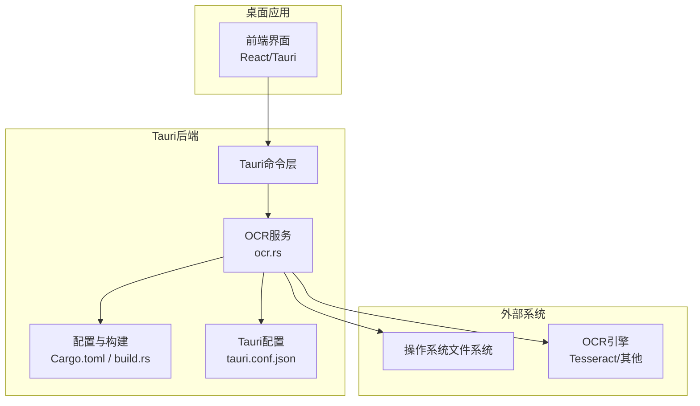
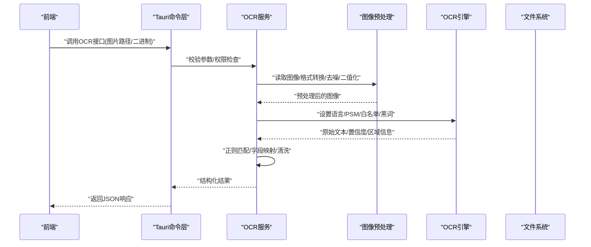
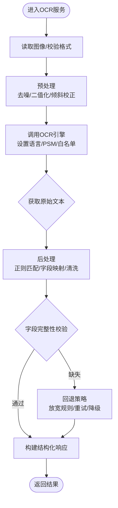
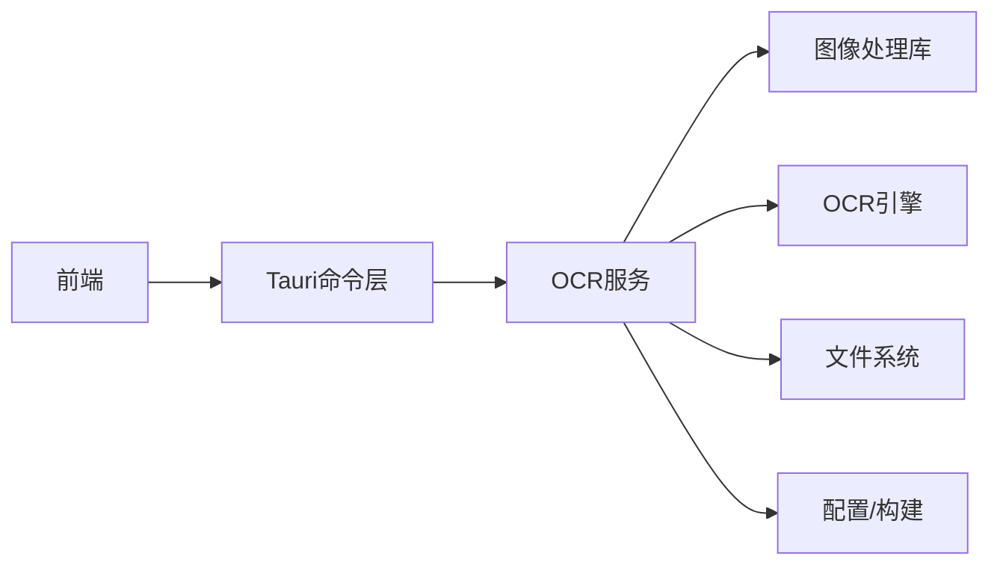

# OCR识别模块

<cite>
**本文引用的文件**   
- [apps/desktop/src-tauri/src/ocr.rs](file://apps/desktop/src-tauri/src/ocr.rs)
- [apps/desktop/src-tauri/Cargo.toml](file://apps/desktop/src-tauri/Cargo.toml)
- [apps/desktop/src-tauri/build.rs](file://apps/desktop/src-tauri/build.rs)
- [apps/desktop/src-tauri/tauri.conf.json](file://apps/desktop/src-tauri/tauri.conf.json)
- [README.md](file://README.md)
</cite>

## 目录
1. [简介](#简介)
2. [项目结构](#项目结构)
3. [核心组件](#核心组件)
4. [架构总览](#架构总览)
5. [详细组件分析](#详细组件分析)
6. [依赖关系分析](#依赖关系分析)
7. [性能考虑](#性能考虑)
8. [故障排查指南](#故障排查指南)
9. [结论](#结论)
10. [附录](#附录)

## 简介
本模块为桌面端OCR识别能力，负责从图像中提取文本并结构化输出。文档覆盖以下方面：
- OCR引擎集成与配置（Tesseract等）
- 图像预处理流程（格式转换、质量优化、字符识别增强）
- 文本提取算法（正则匹配、数据结构解析、字段映射）
- 多语言支持与自定义词典配置
- 识别准确率优化与错误处理策略

## 项目结构
OCR相关代码位于Tauri后端Rust工程中，前端通过Tauri命令调用后端OCR能力。关键位置如下：
- Tauri Rust实现：apps/desktop/src-tauri/src/ocr.rs
- 构建与依赖管理：apps/desktop/src-tauri/Cargo.toml、apps/desktop/src-tauri/build.rs
- Tauri配置：apps/desktop/src-tauri/tauri.conf.json
- 项目说明：README.md

图表来源
- [apps/desktop/src-tauri/src/ocr.rs](file://apps/desktop/src-tauri/src/ocr.rs)
- [apps/desktop/src-tauri/Cargo.toml](file://apps/desktop/src-tauri/Cargo.toml)
- [apps/desktop/src-tauri/build.rs](file://apps/desktop/src-tauri/build.rs)
- [apps/desktop/src-tauri/tauri.conf.json](file://apps/desktop/src-tauri/tauri.conf.json)

章节来源
- [apps/desktop/src-tauri/src/ocr.rs](file://apps/desktop/src-tauri/src/ocr.rs)
- [apps/desktop/src-tauri/Cargo.toml](file://apps/desktop/src-tauri/Cargo.toml)
- [apps/desktop/src-tauri/build.rs](file://apps/desktop/src-tauri/build.rs)
- [apps/desktop/src-tauri/tauri.conf.json](file://apps/desktop/src-tauri/tauri.conf.json)
- [README.md](file://README.md)

## 核心组件
- OCR服务：封装图像读取、预处理、调用OCR引擎、结果后处理与结构化输出。
- 构建与依赖：声明OCR库依赖、平台特定编译选项与资源打包。
- Tauri命令层：暴露给前端的API入口，负责参数校验、异步执行与错误返回。
- 配置与运行时：加载OCR引擎路径、语言包、PSM模式、白名单/黑名单等。

章节来源
- [apps/desktop/src-tauri/src/ocr.rs](file://apps/desktop/src-tauri/src/ocr.rs)
- [apps/desktop/src-tauri/Cargo.toml](file://apps/desktop/src-tauri/Cargo.toml)
- [apps/desktop/src-tauri/build.rs](file://apps/desktop/src-tauri/build.rs)
- [apps/desktop/src-tauri/tauri.conf.json](file://apps/desktop/src-tauri/tauri.conf.json)

## 架构总览
整体数据流从前端发起OCR请求开始，经Tauri命令路由到OCR服务，完成图像预处理、调用OCR引擎、后处理与结构化输出，最终将结果返回前端。

图表来源
- [apps/desktop/src-tauri/src/ocr.rs](file://apps/desktop/src-tauri/src/ocr.rs)
- [apps/desktop/src-tauri/Cargo.toml](file://apps/desktop/src-tauri/Cargo.toml)
- [apps/desktop/src-tauri/build.rs](file://apps/desktop/src-tauri/build.rs)
- [apps/desktop/src-tauri/tauri.conf.json](file://apps/desktop/src-tauri/tauri.conf.json)

## 详细组件分析

### OCR服务（ocr.rs）
职责与要点：
- 输入：图片路径或二进制数据；可选配置（语言、PSM、白名单/黑名单、阈值等）。
- 预处理：格式统一、尺寸归一化、去噪、对比度增强、二值化、倾斜校正。
- 识别：调用OCR引擎，设置语言包与识别模式，获取文本与置信度。
- 后处理：正则表达式抽取关键字段、去除噪声字符、合并行/段落、字段映射。
- 输出：结构化JSON（如日期、金额、标题、分类等），附带置信度与元数据。

建议的数据结构与流程（概念性）：
- 输入配置对象：包含语言、PSM、阈值、白名单/黑名单、是否启用去噪等。
- 中间态：预处理后的图像缓冲区、OCR原始文本、区域级置信度。
- 输出对象：字段键值对、置信度评分、错误码与诊断信息。

章节来源
- [apps/desktop/src-tauri/src/ocr.rs](file://apps/desktop/src-tauri/src/ocr.rs)

### 构建与依赖（Cargo.toml / build.rs）
- 依赖声明：引入OCR库（如tesseract crate）、图像处理库（如image、opencv等）、序列化库（serde/serde_json）。
- 平台差异：针对不同操作系统设置编译标志、链接器参数、动态库路径。
- 资源打包：将语言包、字典文件打包进应用或安装时下载。
- 构建脚本：在build.rs中检测环境、生成配置文件或预编译资源。

章节来源
- [apps/desktop/src-tauri/Cargo.toml](file://apps/desktop/src-tauri/Cargo.toml)
- [apps/desktop/src-tauri/build.rs](file://apps/desktop/src-tauri/build.rs)

### Tauri配置（tauri.conf.json）
- 命令注册：定义OCR命令名称、参数类型、返回值类型。
- 权限与安全：限制文件系统访问范围、网络访问策略（如需在线模型）。
- 窗口与进程：控制并发、超时、内存上限等运行参数。

章节来源
- [apps/desktop/src-tauri/tauri.conf.json](file://apps/desktop/src-tauri/tauri.conf.json)

### 文本提取算法
- 正则表达式匹配：用于抽取日期、金额、发票号、邮箱等常见字段。
- 数据结构解析：将OCR原始文本按行/块组织，结合版面信息重建语义单元。
- 字段映射：将识别到的片段映射到业务字段（如“金额”、“日期”、“商户名”）。
- 置信度融合：基于OCR置信度与规则置信度加权，决定最终取值。

章节来源
- [apps/desktop/src-tauri/src/ocr.rs](file://apps/desktop/src-tauri/src/ocr.rs)

### 多语言支持与自定义词典
- 语言包：根据用户选择加载对应语言数据文件（如eng、chi_sim等）。
- PSM模式：页面分割模式（全图、单行、单词等）影响识别效果。
- 自定义词典：提供白名单（限定字符集）与黑名单（过滤噪声）以提升准确率。
- 动态切换：支持运行时切换语言与PSM，无需重启应用。

章节来源
- [apps/desktop/src-tauri/src/ocr.rs](file://apps/desktop/src-tauri/src/ocr.rs)
- [apps/desktop/src-tauri/Cargo.toml](file://apps/desktop/src-tauri/Cargo.toml)

## 依赖关系分析
OCR模块依赖外部OCR引擎与图像处理库，同时受Tauri框架约束。

图表来源
- [apps/desktop/src-tauri/src/ocr.rs](file://apps/desktop/src-tauri/src/ocr.rs)
- [apps/desktop/src-tauri/Cargo.toml](file://apps/desktop/src-tauri/Cargo.toml)
- [apps/desktop/src-tauri/build.rs](file://apps/desktop/src-tauri/build.rs)
- [apps/desktop/src-tauri/tauri.conf.json](file://apps/desktop/src-tauri/tauri.conf.json)

章节来源
- [apps/desktop/src-tauri/src/ocr.rs](file://apps/desktop/src-tauri/src/ocr.rs)
- [apps/desktop/src-tauri/Cargo.toml](file://apps/desktop/src-tauri/Cargo.toml)
- [apps/desktop/src-tauri/build.rs](file://apps/desktop/src-tauri/build.rs)
- [apps/desktop/src-tauri/tauri.conf.json](file://apps/desktop/src-tauri/tauri.conf.json)

## 性能考虑
- 预处理优化：合理选择二值化阈值、减少不必要的缩放与滤波操作。
- 并行处理：批量图片时采用线程池或异步任务提高吞吐。
- 缓存策略：缓存常用语言包与模板，避免重复加载。
- 内存管理：及时释放图像缓冲，限制单次处理大小。
- 引擎调优：选择合适的PSM与OEM模式，降低误识别率。

[本节为通用指导，不直接分析具体文件]

## 故障排查指南
常见问题与定位方法：
- 无法找到OCR引擎：检查依赖库安装路径、环境变量与动态链接配置。
- 语言包缺失：确认语言数据文件存在且路径正确。
- 识别结果为空或乱码：检查图像质量、预处理参数、PSM设置与白名单/黑名单。
- 字段映射失败：核对正则表达式与业务字段定义，增加兜底逻辑。
- 性能问题：监控CPU/内存占用，调整并发与批处理大小。

章节来源
- [apps/desktop/src-tauri/src/ocr.rs](file://apps/desktop/src-tauri/src/ocr.rs)
- [apps/desktop/src-tauri/Cargo.toml](file://apps/desktop/src-tauri/Cargo.toml)
- [apps/desktop/src-tauri/build.rs](file://apps/desktop/src-tauri/build.rs)
- [apps/desktop/src-tauri/tauri.conf.json](file://apps/desktop/src-tauri/tauri.conf.json)

## 结论
本OCR模块通过Tauri后端整合OCR引擎与图像处理能力，提供端到端的图像文本提取与结构化输出。通过合理的预处理、灵活的引擎配置与稳健的后处理策略，可在多种场景下获得稳定可靠的识别结果。建议持续优化预处理与正则规则，并结合业务反馈迭代提升准确率。

[本节为总结性内容，不直接分析具体文件]

## 附录
- 术语表：
  - PSM：页面分割模式，控制OCR如何划分文本区域。
  - OEM：OCR引擎模式，如仅文本识别或文本+布局识别。
  - 白名单/黑名单：用于限定或过滤字符集合，提升识别精度。
- 参考资源：
  - Tesseract官方文档与语言包说明
  - 图像处理库（如image、opencv）使用指南

[本节为补充信息，不直接分析具体文件]