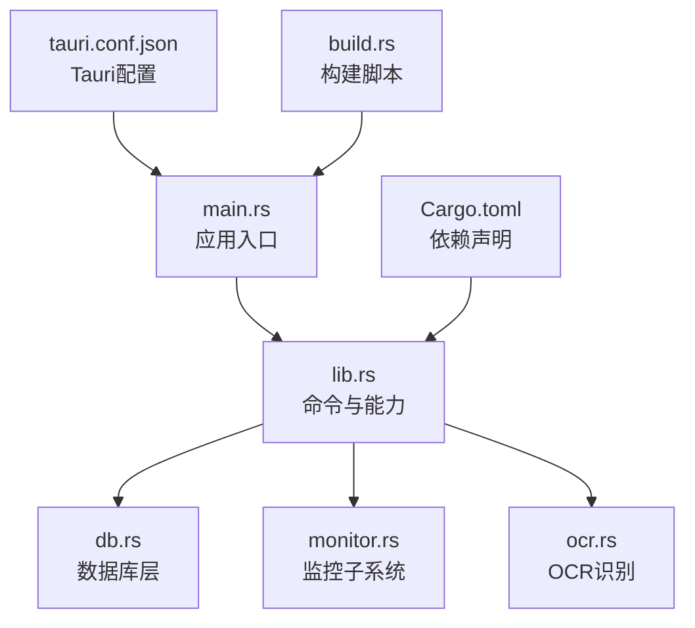
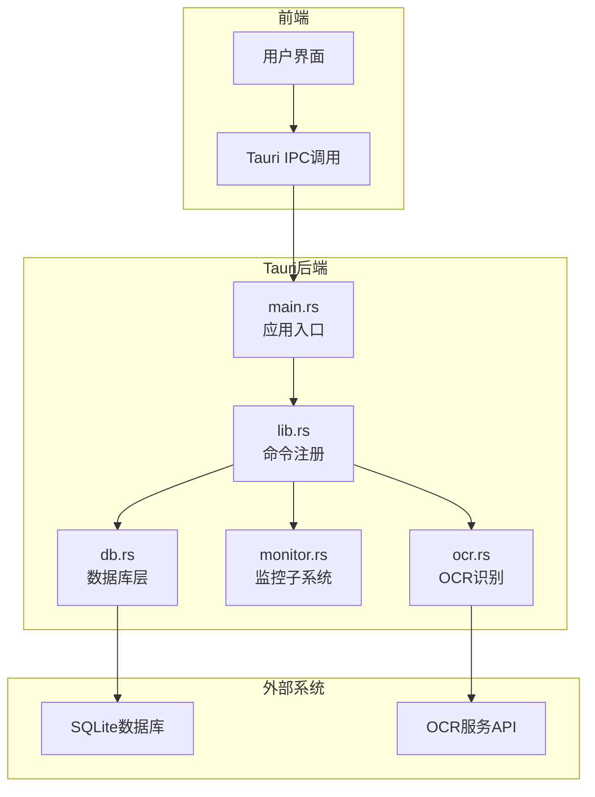
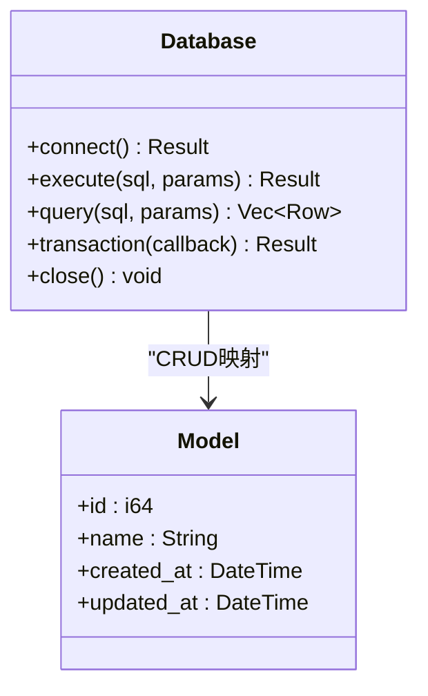
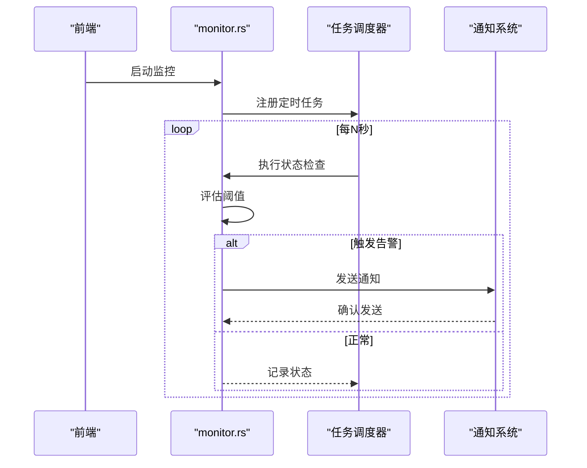
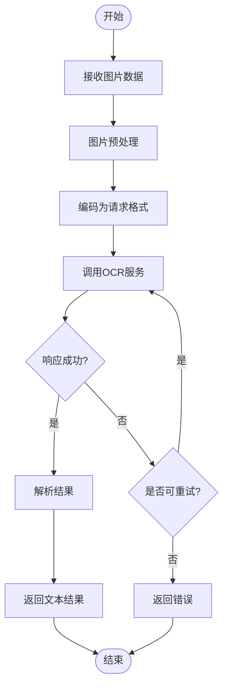
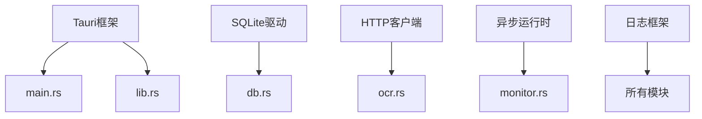

# Tauri后端

<cite>
**本文引用的文件**   
- [apps/desktop/src-tauri/Cargo.toml](file://apps/desktop/src-tauri/Cargo.toml)
- [apps/desktop/src-tauri/tauri.conf.json](file://apps/desktop/src-tauri/tauri.conf.json)
- [apps/desktop/src-tauri/build.rs](file://apps/desktop/src-tauri/build.rs)
- [apps/desktop/src-tauri/src/main.rs](file://apps/desktop/src-tauri/src/main.rs)
- [apps/desktop/src-tauri/src/lib.rs](file://apps/desktop/src-tauri/src/lib.rs)
- [apps/desktop/src-tauri/src/db.rs](file://apps/desktop/src-tauri/src/db.rs)
- [apps/desktop/src-tauri/src/monitor.rs](file://apps/desktop/src-tauri/src/monitor.rs)
- [apps/desktop/src-tauri/src/ocr.rs](file://apps/desktop/src-tauri/src/ocr.rs)
</cite>

## 目录
1. [简介](#简介)
2. [项目结构](#项目结构)
3. [核心组件](#核心组件)
4. [架构总览](#架构总览)
5. [详细组件分析](#详细组件分析)
6. [依赖关系分析](#依赖关系分析)
7. [性能考量](#性能考量)
8. [故障排查指南](#故障排查指南)
9. [结论](#结论)
10. [附录：IPC接口文档](#附录ipc接口文档)

## 简介
本文件面向Tauri桌面应用的后端（Rust）部分，系统性说明其核心功能与架构设计。重点覆盖：
- 数据库操作模块：SQLite集成、数据模型定义与CRUD操作
- 监控功能：定时任务、通知系统与状态检查
- OCR识别：第三方OCR服务集成与调用流程
- IPC接口：前后端通信协议、函数调用与数据格式
- 错误处理与日志记录最佳实践

该文档旨在帮助开发者快速理解后端实现，并指导后续扩展与维护。

## 项目结构
后端位于 apps/desktop/src-tauri 目录，采用Tauri标准工程组织方式：
- Cargo.toml：Rust包配置与依赖声明
- tauri.conf.json：Tauri应用配置（窗口、权限、插件等）
- build.rs：构建脚本（如资源打包、平台相关设置）
- src/main.rs：Tauri应用入口，初始化运行时与命令注册
- src/lib.rs：库入口，暴露给前端的命令与能力
- src/db.rs：数据库层（SQLite连接、迁移、CRUD）
- src/monitor.rs：监控子系统（定时任务、通知、状态检查）
- src/ocr.rs：OCR识别模块（外部服务调用）

**图表来源** 
- [apps/desktop/src-tauri/src/main.rs](file://apps/desktop/src-tauri/src/main.rs)
- [apps/desktop/src-tauri/src/lib.rs](file://apps/desktop/src-tauri/src/lib.rs)
- [apps/desktop/src-tauri/src/db.rs](file://apps/desktop/src-tauri/src/db.rs)
- [apps/desktop/src-tauri/src/monitor.rs](file://apps/desktop/src-tauri/src/monitor.rs)
- [apps/desktop/src-tauri/src/ocr.rs](file://apps/desktop/src-tauri/src/ocr.rs)
- [apps/desktop/src-tauri/Cargo.toml](file://apps/desktop/src-tauri/Cargo.toml)
- [apps/desktop/src-tauri/tauri.conf.json](file://apps/desktop/src-tauri/tauri.conf.json)
- [apps/desktop/src-tauri/build.rs](file://apps/desktop/src-tauri/build.rs)

**章节来源**
- [apps/desktop/src-tauri/Cargo.toml](file://apps/desktop/src-tauri/Cargo.toml)
- [apps/desktop/src-tauri/tauri.conf.json](file://apps/desktop/src-tauri/tauri.conf.json)
- [apps/desktop/src-tauri/build.rs](file://apps/desktop/src-tauri/build.rs)
- [apps/desktop/src-tauri/src/main.rs](file://apps/desktop/src-tauri/src/main.rs)
- [apps/desktop/src-tauri/src/lib.rs](file://apps/desktop/src-tauri/src/lib.rs)

## 核心组件
- 数据库层（db.rs）：封装SQLite连接、表结构定义、CRUD操作，提供事务支持与错误传播
- 监控子系统（monitor.rs）：基于定时器执行周期性任务，聚合状态检查与通知推送
- OCR识别（ocr.rs）：封装外部OCR服务的HTTP调用，处理图片预处理与结果解析
- 命令与能力（lib.rs）：将Rust函数暴露为Tauri命令，供前端通过IPC调用
- 应用入口（main.rs）：初始化Tauri运行时、加载配置、注册命令与插件

**章节来源**
- [apps/desktop/src-tauri/src/db.rs](file://apps/desktop/src-tauri/src/db.rs)
- [apps/desktop/src-tauri/src/monitor.rs](file://apps/desktop/src-tauri/src/monitor.rs)
- [apps/desktop/src-tauri/src/ocr.rs](file://apps/desktop/src-tauri/src/ocr.rs)
- [apps/desktop/src-tauri/src/lib.rs](file://apps/desktop/src-tauri/src/lib.rs)
- [apps/desktop/src-tauri/src/main.rs](file://apps/desktop/src-tauri/src/main.rs)

## 架构总览
整体架构遵循“前端UI + Tauri IPC + Rust后端”的分层模式：
- 前端通过Tauri命令调用后端能力
- 后端按职责划分为数据库、监控、OCR等模块
- 各模块通过清晰的接口进行交互，避免强耦合
- 错误统一处理与日志输出，便于问题定位

**图表来源** 
- [apps/desktop/src-tauri/src/main.rs](file://apps/desktop/src-tauri/src/main.rs)
- [apps/desktop/src-tauri/src/lib.rs](file://apps/desktop/src-tauri/src/lib.rs)
- [apps/desktop/src-tauri/src/db.rs](file://apps/desktop/src-tauri/src/db.rs)
- [apps/desktop/src-tauri/src/monitor.rs](file://apps/desktop/src-tauri/src/monitor.rs)
- [apps/desktop/src-tauri/src/ocr.rs](file://apps/desktop/src-tauri/src/ocr.rs)

## 详细组件分析

### 数据库层（db.rs）
- 功能概述：负责SQLite连接管理、表结构定义、CRUD操作与事务控制
- 关键设计：
  - 连接池或单例连接，确保并发安全
  - 使用SQLx或rusqlite进行SQL执行
  - 数据模型映射到Rust结构体
  - 错误类型统一，便于上层处理
- 典型操作：
  - 初始化数据库与迁移
  - 插入、更新、删除、查询
  - 批量操作与事务回滚

**图表来源** 
- [apps/desktop/src-tauri/src/db.rs](file://apps/desktop/src-tauri/src/db.rs)

**章节来源**
- [apps/desktop/src-tauri/src/db.rs](file://apps/desktop/src-tauri/src/db.rs)

### 监控子系统（monitor.rs）
- 功能概述：实现定时任务调度、状态检查与通知推送
- 关键设计：
  - 基于tokio或std::thread的定时器
  - 任务队列与优先级支持
  - 通知渠道（系统通知、邮件、Webhook）
  - 健康检查与告警阈值
- 典型流程：
  - 启动时注册任务
  - 周期执行状态检查
  - 触发条件满足时发送通知

**图表来源** 
- [apps/desktop/src-tauri/src/monitor.rs](file://apps/desktop/src-tauri/src/monitor.rs)

**章节来源**
- [apps/desktop/src-tauri/src/monitor.rs](file://apps/desktop/src-tauri/src/monitor.rs)

### OCR识别（ocr.rs）
- 功能概述：封装外部OCR服务的HTTP调用，处理图片预处理与结果解析
- 关键设计：
  - 异步HTTP客户端（reqwest或ureq）
  - 图片格式转换与压缩
  - 重试机制与超时控制
  - 结果结构化解析
- 典型流程：
  - 接收前端图片数据
  - 预处理与编码
  - 调用OCR API
  - 解析响应并返回文本

**图表来源** 
- [apps/desktop/src-tauri/src/ocr.rs](file://apps/desktop/src-tauri/src/ocr.rs)

**章节来源**
- [apps/desktop/src-tauri/src/ocr.rs](file://apps/desktop/src-tauri/src/ocr.rs)

### 命令与能力（lib.rs）
- 功能概述：将Rust函数暴露为Tauri命令，供前端通过IPC调用
- 关键设计：
  - 使用#[tauri::command]宏注册函数
  - 参数序列化与反序列化
  - 错误类型转换为前端可识别格式
  - 异步命令支持
- 典型命令：
  - 数据库CRUD操作
  - 监控任务控制
  - OCR识别调用

**章节来源**
- [apps/desktop/src-tauri/src/lib.rs](file://apps/desktop/src-tauri/src/lib.rs)

### 应用入口（main.rs）
- 功能概述：初始化Tauri运行时、加载配置、注册命令与插件
- 关键设计：
  - 配置读取与环境变量注入
  - 日志初始化与级别设置
  - 插件加载与能力声明
  - 主线程事件循环

**章节来源**
- [apps/desktop/src-tauri/src/main.rs](file://apps/desktop/src-tauri/src/main.rs)

## 依赖关系分析
后端依赖主要包括：
- Tauri框架：提供IPC、命令注册、应用生命周期管理
- SQLite驱动：用于本地数据存储
- HTTP客户端：用于OCR服务调用
- 异步运行时：tokio或async-std
- 日志框架：tracing或log

**图表来源** 
- [apps/desktop/src-tauri/Cargo.toml](file://apps/desktop/src-tauri/Cargo.toml)
- [apps/desktop/src-tauri/src/main.rs](file://apps/desktop/src-tauri/src/main.rs)
- [apps/desktop/src-tauri/src/lib.rs](file://apps/desktop/src-tauri/src/lib.rs)
- [apps/desktop/src-tauri/src/db.rs](file://apps/desktop/src-tauri/src/db.rs)
- [apps/desktop/src-tauri/src/monitor.rs](file://apps/desktop/src-tauri/src/monitor.rs)
- [apps/desktop/src-tauri/src/ocr.rs](file://apps/desktop/src-tauri/src/ocr.rs)

**章节来源**
- [apps/desktop/src-tauri/Cargo.toml](file://apps/desktop/src-tauri/Cargo.toml)

## 性能考量
- 数据库操作：
  - 使用连接池提高并发性能
  - 批量操作减少IO次数
  - 索引优化查询性能
- 监控任务：
  - 合理设置任务间隔，避免过度占用CPU
  - 使用异步任务避免阻塞主线程
- OCR调用：
  - 图片压缩减少传输大小
  - 缓存常见结果提升响应速度
  - 超时与重试机制保证稳定性

[本节为通用指导，不直接分析具体文件]

## 故障排查指南
- 常见问题：
  - 数据库连接失败：检查路径权限与SQLite版本兼容性
  - OCR服务超时：验证网络连通性与API密钥有效性
  - 监控任务未执行：确认定时器配置与权限设置
- 调试建议：
  - 启用详细日志输出
  - 使用Tauri DevTools查看IPC调用
  - 分模块隔离问题范围

**章节来源**
- [apps/desktop/src-tauri/src/db.rs](file://apps/desktop/src-tauri/src/db.rs)
- [apps/desktop/src-tauri/src/ocr.rs](file://apps/desktop/src-tauri/src/ocr.rs)
- [apps/desktop/src-tauri/src/monitor.rs](file://apps/desktop/src-tauri/src/monitor.rs)

## 结论
Tauri后端通过清晰的模块化设计实现了数据库操作、监控与OCR识别等核心功能。各组件职责明确，接口简洁，便于扩展与维护。建议在生产环境中加强错误处理与日志记录，确保系统稳定运行。

[本节为总结性内容，不直接分析具体文件]

## 附录：IPC接口文档
- 通信协议：Tauri IPC基于JSON-RPC风格
- 命令注册：使用#[tauri::command]宏暴露函数
- 数据格式：参数与返回值使用serde序列化
- 错误处理：统一错误类型，前端可识别错误码

**章节来源**
- [apps/desktop/src-tauri/src/lib.rs](file://apps/desktop/src-tauri/src/lib.rs)
- [apps/desktop/src-tauri/tauri.conf.json](file://apps/desktop/src-tauri/tauri.conf.json)