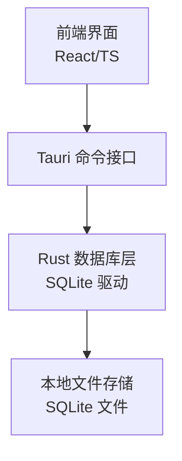
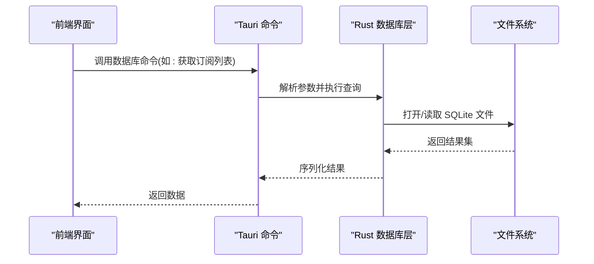
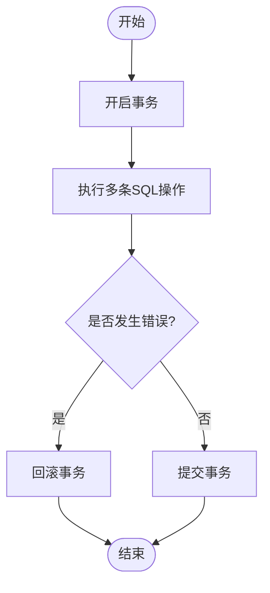
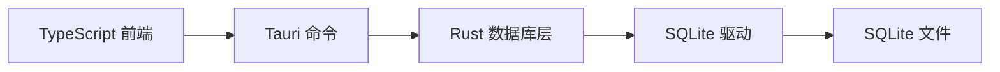

# 数据库模块

<cite>
**本文引用的文件**   
- [apps/desktop/src-tauri/src/db.rs](file://apps/desktop/src-tauri/src/db.rs)
- [apps/desktop/src-tauri/Cargo.toml](file://apps/desktop/src-tauri/Cargo.toml)
- [apps/desktop/src/storage.ts](file://apps/desktop/src/storage.ts)
- [apps/desktop/src/subTableHandlers.ts](file://apps/desktop/src/subTableHandlers.ts)
- [apps/desktop/src/subscriptionFields.ts](file://apps/desktop/src/subscriptionFields.ts)
- [apps/desktop/src/BillsView.tsx](file://apps/desktop/src/BillsView.tsx)
- [apps/desktop/src/PendingView.tsx](file://apps/desktop/src/PendingView.tsx)
- [apps/desktop/src/Dashboard.tsx](file://apps/desktop/src/Dashboard.tsx)
- [apps/desktop/src/StatsView.tsx](file://apps/desktop/src/StatsView.tsx)
- [apps/desktop/src/SettingsModal.tsx](file://apps/desktop/src/SettingsModal.tsx)
</cite>

## 目录
1. [简介](#简介)
2. [项目结构](#项目结构)
3. [核心组件](#核心组件)
4. [架构总览](#架构总览)
5. [详细组件分析](#详细组件分析)
6. [依赖关系分析](#依赖关系分析)
7. [性能考虑](#性能考虑)
8. [故障排查指南](#故障排查指南)
9. [结论](#结论)
10. [附录](#附录)

## 简介
本文件聚焦于项目的数据库模块，围绕 SQLite 的集成与配置、数据模型定义（订阅信息、账单记录、分类数据）、CRUD 操作实现（连接池管理、事务处理、查询优化）、数据迁移与版本管理策略、备份恢复功能以及性能优化建议进行系统化说明。文档面向不同技术背景的读者，既提供高层概览，也给出代码级分析与图示，帮助快速理解并扩展数据库能力。

## 项目结构
本项目采用 Tauri 架构：前端使用 React/TypeScript，后端通过 Rust 暴露系统能力，SQLite 作为本地持久化存储。数据库相关的关键位置如下：
- Rust 层：Tauri 插件/命令中负责 SQLite 连接、事务、迁移与备份等能力
- TypeScript 层：UI 状态与交互逻辑，调用 Rust 命令完成数据读写
- 配置与依赖：Rust Cargo 依赖声明包含 SQLite 驱动与 Tauri 绑定

图表来源
- [apps/desktop/src-tauri/src/db.rs](file://apps/desktop/src-tauri/src/db.rs)
- [apps/desktop/src/storage.ts](file://apps/desktop/src/storage.ts)

章节来源
- [apps/desktop/src-tauri/Cargo.toml](file://apps/desktop/src-tauri/Cargo.toml)
- [apps/desktop/src/storage.ts](file://apps/desktop/src/storage.ts)

## 核心组件
- 数据库连接与初始化：在应用启动时建立 SQLite 连接，确保单例或连接池可用
- 数据模型映射：将订阅、账单、分类等实体映射为表结构与类型
- CRUD 操作封装：提供增删改查函数，统一错误处理与日志
- 事务管理：批量写入与一致性更新时使用事务
- 迁移与版本：按版本号执行增量迁移脚本
- 备份与恢复：导出/导入 SQLite 文件或关键表数据

章节来源
- [apps/desktop/src-tauri/src/db.rs](file://apps/desktop/src-tauri/src/db.rs)
- [apps/desktop/src/storage.ts](file://apps/desktop/src/storage.ts)

## 架构总览
下图展示从 UI 到 SQLite 的完整调用链，包括命令路由、Rust 层处理与文件落盘。

图表来源
- [apps/desktop/src-tauri/src/db.rs](file://apps/desktop/src-tauri/src/db.rs)
- [apps/desktop/src/storage.ts](file://apps/desktop/src/storage.ts)

## 详细组件分析

### 数据模型定义
- 订阅信息：包含订阅名称、平台、价格、币种、计费周期、到期时间、提醒设置、备注等字段
- 账单记录：关联订阅、账单日期、金额、币种、支付方式、状态、备注等
- 分类数据：分类名称、图标、颜色、排序、是否默认等

这些模型在 Rust 层以结构体或行映射表示，并在 SQLite 中以表形式持久化；TypeScript 侧通过类型定义保持前后端一致。

章节来源
- [apps/desktop/src/subscriptionFields.ts](file://apps/desktop/src/subscriptionFields.ts)
- [apps/desktop/src/subTableHandlers.ts](file://apps/desktop/src/subTableHandlers.ts)
- [apps/desktop/src-tauri/src/db.rs](file://apps/desktop/src-tauri/src/db.rs)

### CRUD 操作与连接池管理
- 连接池：通过连接池复用连接，减少频繁创建/销毁开销，提高并发读性能
- 事务处理：对批量插入/更新使用事务，保证原子性与一致性
- 查询优化：合理使用索引（如订阅名、到期时间、账单日期），避免全表扫描；分页查询限制返回行数
- 错误处理：捕获 SQL 异常，转换为统一错误码与消息，便于上层处理

章节来源
- [apps/desktop/src-tauri/src/db.rs](file://apps/desktop/src-tauri/src/db.rs)

### 事务处理流程

图表来源
- [apps/desktop/src-tauri/src/db.rs](file://apps/desktop/src-tauri/src/db.rs)

### 数据迁移与版本管理
- 版本表：维护当前数据库版本与迁移历史
- 增量迁移：按版本号顺序执行迁移脚本，支持新增表、字段、索引与数据修复
- 回滚策略：谨慎设计可回滚迁移，避免破坏性变更；必要时提供数据校验与修复工具

章节来源
- [apps/desktop/src-tauri/src/db.rs](file://apps/desktop/src-tauri/src/db.rs)

### 备份与恢复
- 备份：导出 SQLite 文件或关键表快照，支持定时任务与手动触发
- 恢复：导入备份文件覆盖或合并数据，需校验版本与完整性
- 安全：备份文件加密与权限控制，防止敏感信息泄露

章节来源
- [apps/desktop/src-tauri/src/db.rs](file://apps/desktop/src-tauri/src/db.rs)

### 前端集成与调用
- storage.ts：封装与 Rust 命令的通信，统一请求/响应格式与错误处理
- subTableHandlers.ts：订阅表格的增删改查事件处理，调用 storage 方法
- subscriptionFields.ts：订阅表单字段定义与校验规则
- BillsView.tsx、PendingView.tsx、Dashboard.tsx、StatsView.tsx：各视图加载与展示数据，依赖 storage 提供的数据接口
- SettingsModal.tsx：数据库设置（路径、备份开关、迁移状态）

章节来源
- [apps/desktop/src/storage.ts](file://apps/desktop/src/storage.ts)
- [apps/desktop/src/subTableHandlers.ts](file://apps/desktop/src/subTableHandlers.ts)
- [apps/desktop/src/subscriptionFields.ts](file://apps/desktop/src/subscriptionFields.ts)
- [apps/desktop/src/BillsView.tsx](file://apps/desktop/src/BillsView.tsx)
- [apps/desktop/src/PendingView.tsx](file://apps/desktop/src/PendingView.tsx)
- [apps/desktop/src/Dashboard.tsx](file://apps/desktop/src/Dashboard.tsx)
- [apps/desktop/src/StatsView.tsx](file://apps/desktop/src/StatsView.tsx)
- [apps/desktop/src/SettingsModal.tsx](file://apps/desktop/src/SettingsModal.tsx)

## 依赖关系分析
Rust 层依赖 SQLite 驱动与 Tauri 绑定，TypeScript 层通过 Tauri 命令与 Rust 交互。

图表来源
- [apps/desktop/src-tauri/Cargo.toml](file://apps/desktop/src-tauri/Cargo.toml)
- [apps/desktop/src-tauri/src/db.rs](file://apps/desktop/src-tauri/src/db.rs)
- [apps/desktop/src/storage.ts](file://apps/desktop/src/storage.ts)

章节来源
- [apps/desktop/src-tauri/Cargo.toml](file://apps/desktop/src-tauri/Cargo.toml)
- [apps/desktop/src-tauri/src/db.rs](file://apps/desktop/src-tauri/src/db.rs)
- [apps/desktop/src/storage.ts](file://apps/desktop/src/storage.ts)

## 性能考虑
- 连接池大小：根据并发读多写少的场景调整池大小，避免过多连接导致资源竞争
- 索引设计：为高频查询字段建立索引，如订阅名、到期时间、账单日期
- 分页与过滤：限制返回行数，结合条件过滤减少数据传输
- 批量操作：使用事务与批量插入提升写入吞吐
- 缓存策略：对只读数据（如分类字典）在前端缓存，降低重复查询
- I/O 优化：避免频繁小文件写入，合并写入与异步处理

[本节为通用指导，不直接分析具体文件]

## 故障排查指南
- 连接失败：检查 SQLite 文件路径与权限，确认驱动已正确加载
- 事务异常：查看事务内 SQL 语句与约束冲突，必要时回滚并重试
- 迁移失败：核对版本号与迁移脚本顺序，验证数据完整性
- 备份恢复：校验备份文件完整性与版本兼容性，避免覆盖错误数据
- 前端报错：检查 storage.ts 的错误映射与日志输出，定位具体命令与参数

章节来源
- [apps/desktop/src-tauri/src/db.rs](file://apps/desktop/src-tauri/src/db.rs)
- [apps/desktop/src/storage.ts](file://apps/desktop/src/storage.ts)

## 结论
本数据库模块以 SQLite 为核心，结合 Tauri 的跨平台能力，实现了订阅、账单与分类数据的本地持久化。通过连接池、事务、迁移与备份机制，保障了数据一致性与可维护性。前端与后端的清晰分层使得扩展与维护更加便捷。建议在后续迭代中持续优化索引与查询，完善监控与告警，进一步提升稳定性与性能。

[本节为总结性内容，不直接分析具体文件]

## 附录
- 术语表：连接池、事务、迁移、备份、索引、分页
- 最佳实践：单一职责、错误统一、日志规范、版本控制
- 参考文件：见“本文引用的文件”列表

[本节为补充信息，不直接分析具体文件]