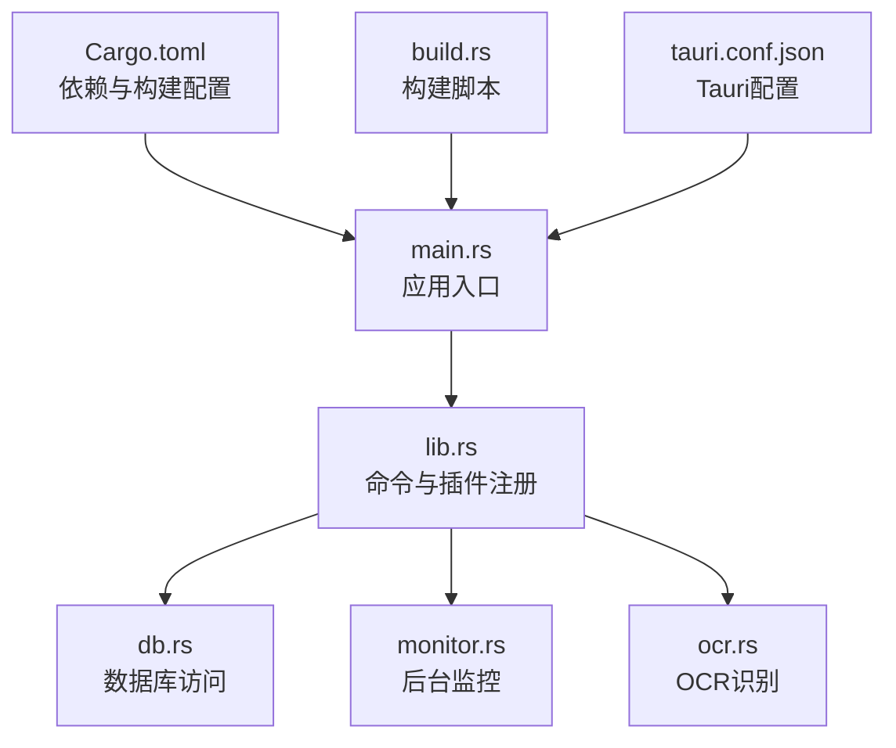
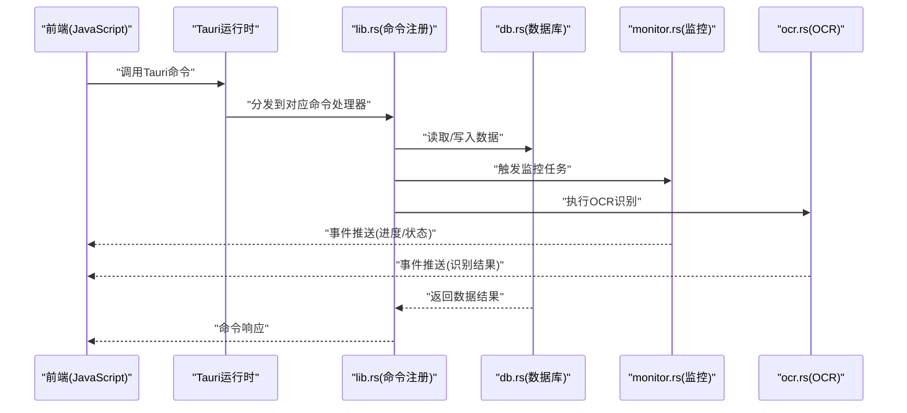
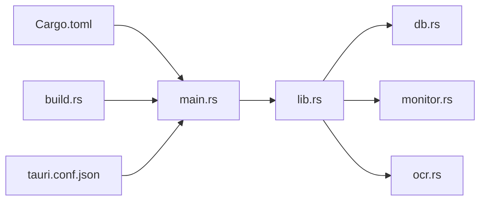

# 核心模块

<cite>
**本文引用的文件**   
- [apps/desktop/src-tauri/Cargo.toml](file://apps/desktop/src-tauri/Cargo.toml)
- [apps/desktop/src-tauri/build.rs](file://apps/desktop/src-tauri/build.rs)
- [apps/desktop/src-tauri/tauri.conf.json](file://apps/desktop/src-tauri/tauri.conf.json)
- [apps/desktop/src-tauri/src/main.rs](file://apps/desktop/src-tauri/src/main.rs)
- [apps/desktop/src-tauri/src/lib.rs](file://apps/desktop/src-tauri/src/lib.rs)
- [apps/desktop/src-tauri/src/db.rs](file://apps/desktop/src-tauri/src/db.rs)
- [apps/desktop/src-tauri/src/monitor.rs](file://apps/desktop/src-tauri/src/monitor.rs)
- [apps/desktop/src-tauri/src/ocr.rs](file://apps/desktop/src-tauri/src/ocr.rs)
</cite>

## 目录
1. [简介](#简介)
2. [项目结构](#项目结构)
3. [核心组件](#核心组件)
4. [架构总览](#架构总览)
5. [详细组件分析](#详细组件分析)
6. [依赖关系分析](#依赖关系分析)
7. [性能考量](#性能考量)
8. [故障排查指南](#故障排查指南)
9. [结论](#结论)
10. [附录](#附录)

## 简介
本文件面向Tauri桌面应用的后端（Rust）核心模块，聚焦以下目标：
- Rust后端主入口与模块组织方式
- Cargo.toml配置说明（依赖管理、构建配置、平台特定设置）
- Tauri应用生命周期与初始化流程
- IPC接口整体设计（命令注册、事件处理、错误处理）
- 模块间依赖关系与数据流向

该文档旨在帮助开发者快速理解并扩展Tauri后端能力，同时为后续维护与优化提供清晰参考。

## 项目结构
Tauri后端位于 apps/desktop/src-tauri 目录下，采用典型的“单二进制 + 多模块”的Rust工程组织方式：
- main.rs：进程入口，负责Tauri应用启动与窗口创建
- lib.rs：库入口，集中注册Tauri命令、插件与全局状态
- db.rs：数据库访问封装（持久化层）
- monitor.rs：后台监控任务（如定时检查、系统事件监听等）
- ocr.rs：OCR识别相关能力（图片解析、文本提取）

图表来源
- [apps/desktop/src-tauri/src/main.rs](file://apps/desktop/src-tauri/src/main.rs)
- [apps/desktop/src-tauri/src/lib.rs](file://apps/desktop/src-tauri/src/lib.rs)
- [apps/desktop/src-tauri/src/db.rs](file://apps/desktop/src-tauri/src/db.rs)
- [apps/desktop/src-tauri/src/monitor.rs](file://apps/desktop/src-tauri/src/monitor.rs)
- [apps/desktop/src-tauri/src/ocr.rs](file://apps/desktop/src-tauri/src/ocr.rs)
- [apps/desktop/src-tauri/Cargo.toml](file://apps/desktop/src-tauri/Cargo.toml)
- [apps/desktop/src-tauri/build.rs](file://apps/desktop/src-tauri/build.rs)
- [apps/desktop/src-tauri/tauri.conf.json](file://apps/desktop/src-tauri/tauri.conf.json)

章节来源
- [apps/desktop/src-tauri/src/main.rs](file://apps/desktop/src-tauri/src/main.rs)
- [apps/desktop/src-tauri/src/lib.rs](file://apps/desktop/src-tauri/src/lib.rs)
- [apps/desktop/src-tauri/Cargo.toml](file://apps/desktop/src-tauri/Cargo.toml)
- [apps/desktop/src-tauri/build.rs](file://apps/desktop/src-tauri/build.rs)
- [apps/desktop/src-tauri/tauri.conf.json](file://apps/desktop/src-tauri/tauri.conf.json)

## 核心组件
- 应用入口（main.rs）
  - 负责初始化Tauri上下文、加载配置、创建主窗口、启动必要的后台任务
  - 通常调用库入口以完成命令与插件注册
- 库入口（lib.rs）
  - 集中注册Tauri命令（IPC）、插件、全局状态与中间件
  - 暴露对外API（通过Tauri命令），并协调各业务模块
- 数据库（db.rs）
  - 封装SQLite或本地存储操作，提供事务、迁移、查询与写入能力
  - 保证并发安全与错误回滚
- 监控（monitor.rs）
  - 实现定时任务、系统事件监听、资源监控等后台工作
  - 通过事件通道与前端交互
- OCR（ocr.rs）
  - 封装图像识别逻辑，支持批量处理与结果缓存
  - 与数据库协作，将识别结果持久化

章节来源
- [apps/desktop/src-tauri/src/main.rs](file://apps/desktop/src-tauri/src/main.rs)
- [apps/desktop/src-tauri/src/lib.rs](file://apps/desktop/src-tauri/src/lib.rs)
- [apps/desktop/src-tauri/src/db.rs](file://apps/desktop/src-tauri/src/db.rs)
- [apps/desktop/src-tauri/src/monitor.rs](file://apps/desktop/src-tauri/src/monitor.rs)
- [apps/desktop/src-tauri/src/ocr.rs](file://apps/desktop/src-tauri/src/ocr.rs)

## 架构总览
下图展示了Tauri应用的总体架构与关键交互路径：前端通过Tauri IPC调用后端命令，命令路由到具体业务模块（数据库、监控、OCR），并通过事件机制向前端推送异步结果。

图表来源
- [apps/desktop/src-tauri/src/lib.rs](file://apps/desktop/src-tauri/src/lib.rs)
- [apps/desktop/src-tauri/src/db.rs](file://apps/desktop/src-tauri/src/db.rs)
- [apps/desktop/src-tauri/src/monitor.rs](file://apps/desktop/src-tauri/src/monitor.rs)
- [apps/desktop/src-tauri/src/ocr.rs](file://apps/desktop/src-tauri/src/ocr.rs)

## 详细组件分析

### 应用入口与生命周期（main.rs）
- 职责
  - 初始化Tauri应用上下文
  - 加载配置文件（tauri.conf.json）
  - 创建主窗口并挂载前端资源
  - 启动必要的全局服务（如监控任务）
- 生命周期要点
  - 应用启动阶段：加载配置、初始化日志、准备数据库连接
  - 运行阶段：保持事件循环，响应IPC请求
  - 关闭阶段：清理资源、保存状态、退出进程

章节来源
- [apps/desktop/src-tauri/src/main.rs](file://apps/desktop/src-tauri/src/main.rs)
- [apps/desktop/src-tauri/tauri.conf.json](file://apps/desktop/src-tauri/tauri.conf.json)

### 库入口与命令注册（lib.rs）
- 职责
  - 集中注册所有Tauri命令（IPC端点）
  - 初始化全局状态与共享资源（如数据库连接池）
  - 绑定事件总线，供各模块发布/订阅消息
- 设计模式
  - 命令路由：按功能域划分命令命名空间（如 db.*、ocr.*、monitor.*）
  - 中间件：统一鉴权、日志记录、错误包装
  - 插件化：按需启用可选能力（如OCR引擎）

章节来源
- [apps/desktop/src-tauri/src/lib.rs](file://apps/desktop/src-tauri/src/lib.rs)

### 数据库模块（db.rs）
- 职责
  - 提供统一的CRUD接口
  - 管理连接池与事务边界
  - 执行数据迁移与版本兼容
- 并发与安全
  - 使用线程安全的连接池
  - 读写分离与锁策略避免竞争条件
- 错误处理
  - 定义领域错误类型（如不存在、约束冲突）
  - 向上抛出可恢复异常，由上层统一处理

章节来源
- [apps/desktop/src-tauri/src/db.rs](file://apps/desktop/src-tauri/src/db.rs)

### 监控模块（monitor.rs）
- 职责
  - 定时轮询与系统事件监听
  - 资源使用率采集与告警
  - 与前端通过事件通道同步状态
- 调度策略
  - 基于定时器与任务队列
  - 支持动态启停与优先级控制

章节来源
- [apps/desktop/src-tauri/src/monitor.rs](file://apps/desktop/src-tauri/src/monitor.rs)

### OCR模块（ocr.rs）
- 职责
  - 图片预处理与格式转换
  - 调用OCR引擎进行文本识别
  - 结果后处理与缓存
- 性能优化
  - 批处理与并行识别
  - 结果缓存与去重

章节来源
- [apps/desktop/src-tauri/src/ocr.rs](file://apps/desktop/src-tauri/src/ocr.rs)

### 构建与配置（Cargo.toml、build.rs、tauri.conf.json）
- Cargo.toml
  - 依赖管理：声明Tauri、数据库驱动、OCR库等
  - 构建配置：目标平台、特性开关、优化级别
  - 平台特定设置：条件编译与平台专属依赖
- build.rs
  - 生成代码（如schema、类型定义）
  - 打包资源（图标、静态文件）
  - 平台差异化构建步骤
- tauri.conf.json
  - 应用元信息（名称、版本、图标）
  - 窗口配置（尺寸、行为、权限）
  - 安全策略（CSP、白名单、插件启用）

章节来源
- [apps/desktop/src-tauri/Cargo.toml](file://apps/desktop/src-tauri/Cargo.toml)
- [apps/desktop/src-tauri/build.rs](file://apps/desktop/src-tauri/build.rs)
- [apps/desktop/src-tauri/tauri.conf.json](file://apps/desktop/src-tauri/tauri.conf.json)

## 依赖关系分析
- 模块耦合
  - lib.rs作为中枢，低耦合地组合db.rs、monitor.rs、ocr.rs
  - 通过事件总线解耦异步任务与前端通信
- 外部依赖
  - Tauri运行时：IPC、窗口管理、插件体系
  - 数据库驱动：SQLite或其他嵌入式存储
  - OCR引擎：第三方库或系统API
- 潜在风险
  - 循环依赖需通过特征或抽象接口规避
  - 外部库升级需评估兼容性

图表来源
- [apps/desktop/src-tauri/src/main.rs](file://apps/desktop/src-tauri/src/main.rs)
- [apps/desktop/src-tauri/src/lib.rs](file://apps/desktop/src-tauri/src/lib.rs)
- [apps/desktop/src-tauri/src/db.rs](file://apps/desktop/src-tauri/src/db.rs)
- [apps/desktop/src-tauri/src/monitor.rs](file://apps/desktop/src-tauri/src/monitor.rs)
- [apps/desktop/src-tauri/src/ocr.rs](file://apps/desktop/src-tauri/src/ocr.rs)
- [apps/desktop/src-tauri/Cargo.toml](file://apps/desktop/src-tauri/Cargo.toml)
- [apps/desktop/src-tauri/build.rs](file://apps/desktop/src-tauri/build.rs)
- [apps/desktop/src-tauri/tauri.conf.json](file://apps/desktop/src-tauri/tauri.conf.json)

章节来源
- [apps/desktop/src-tauri/src/lib.rs](file://apps/desktop/src-tauri/src/lib.rs)
- [apps/desktop/src-tauri/Cargo.toml](file://apps/desktop/src-tauri/Cargo.toml)

## 性能考量
- 数据库
  - 使用连接池减少握手开销
  - 合理索引与分页查询降低延迟
- 监控
  - 控制轮询频率，避免CPU占用过高
  - 批量上报与合并事件减少IPC压力
- OCR
  - 并行处理与流水线优化吞吐
  - 缓存热点结果，减少重复计算
- 内存与GC
  - 避免大对象频繁分配与复制
  - 及时释放临时资源，防止内存泄漏

[本节为通用指导，不直接分析具体文件]

## 故障排查指南
- 常见问题定位
  - 命令未注册：检查lib.rs中的命令注册是否完整
  - 数据库连接失败：确认连接参数与权限
  - OCR识别失败：验证输入图片格式与引擎可用性
  - 监控任务未执行：检查定时器与事件通道
- 调试建议
  - 启用详细日志输出
  - 使用断点与堆栈跟踪定位异常
  - 隔离问题模块进行单元测试

章节来源
- [apps/desktop/src-tauri/src/lib.rs](file://apps/desktop/src-tauri/src/lib.rs)
- [apps/desktop/src-tauri/src/db.rs](file://apps/desktop/src-tauri/src/db.rs)
- [apps/desktop/src-tauri/src/monitor.rs](file://apps/desktop/src-tauri/src/monitor.rs)
- [apps/desktop/src-tauri/src/ocr.rs](file://apps/desktop/src-tauri/src/ocr.rs)

## 结论
本核心模块文档梳理了Tauri后端的主入口、模块组织、配置与IPC架构，明确了各组件职责与交互关系。通过合理的依赖管理与错误处理机制，系统具备良好的可扩展性与可维护性。建议在后续迭代中持续优化性能与稳定性，并完善监控与诊断能力。

[本节为总结性内容，不直接分析具体文件]

## 附录
- 术语表
  - Tauri：跨平台桌面应用框架
  - IPC：进程间通信机制
  - OCR：光学字符识别
- 参考链接
  - Tauri官方文档
  - Rust语言规范
  - SQLite使用指南

[本节为补充信息，不直接分析具体文件]