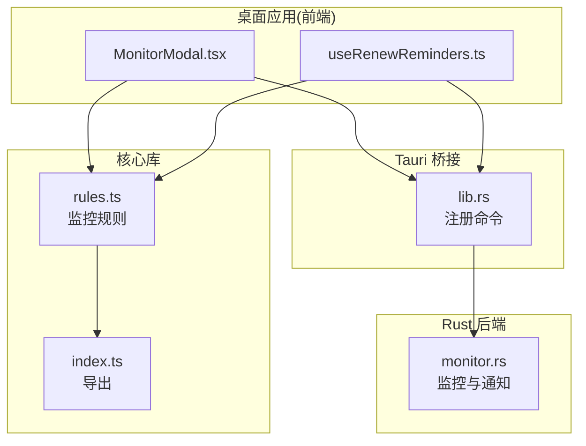
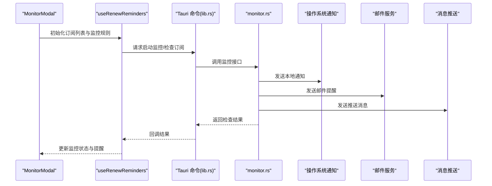
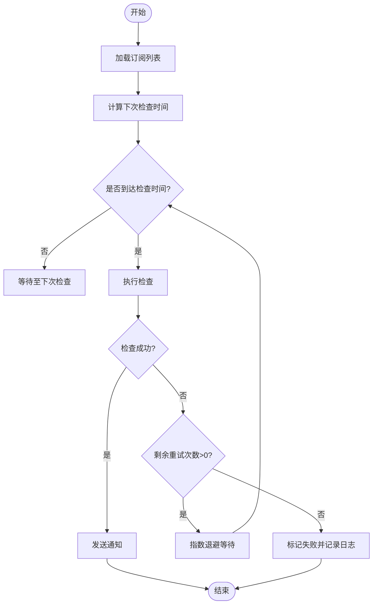
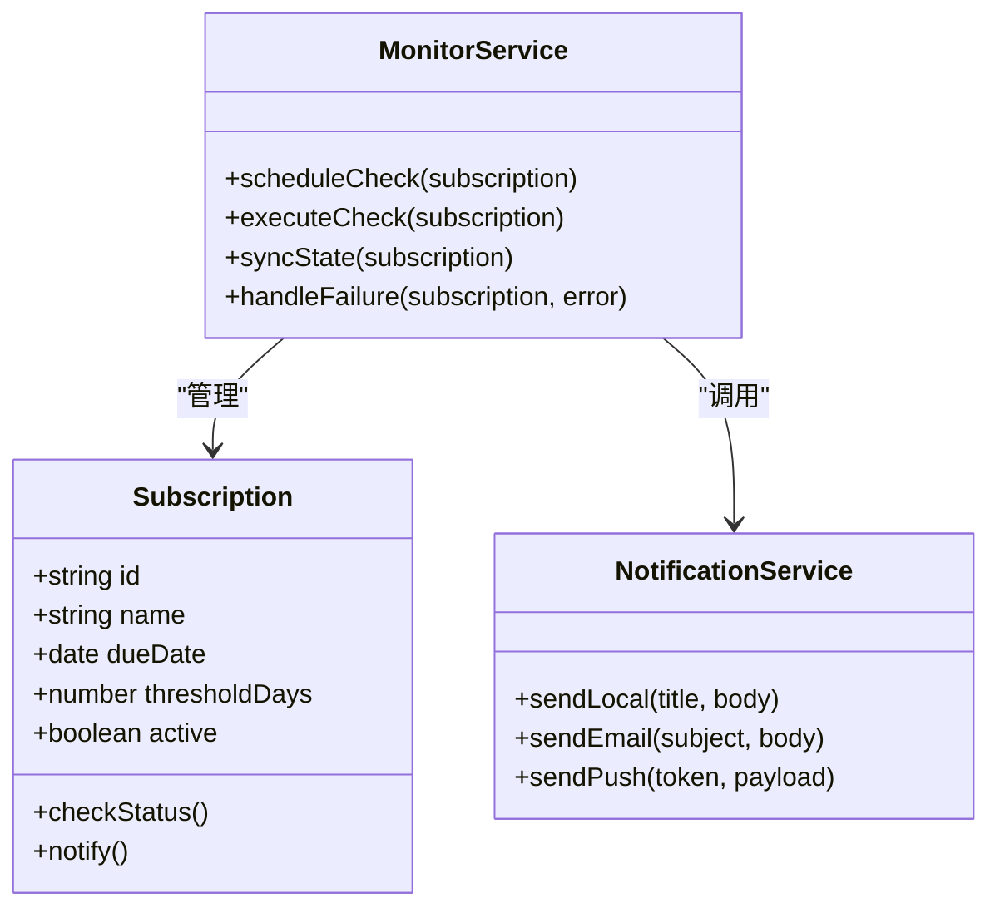
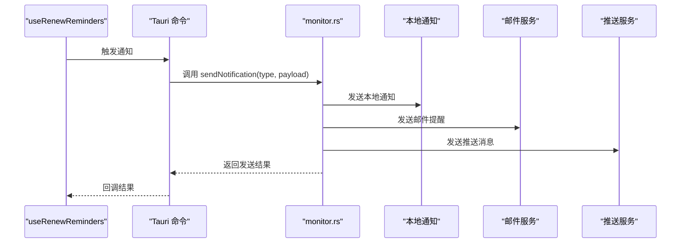
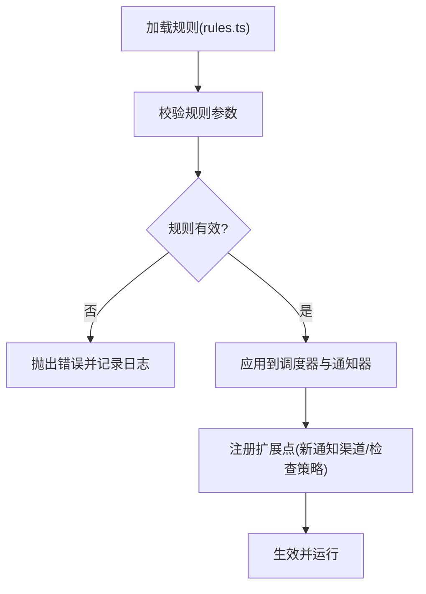
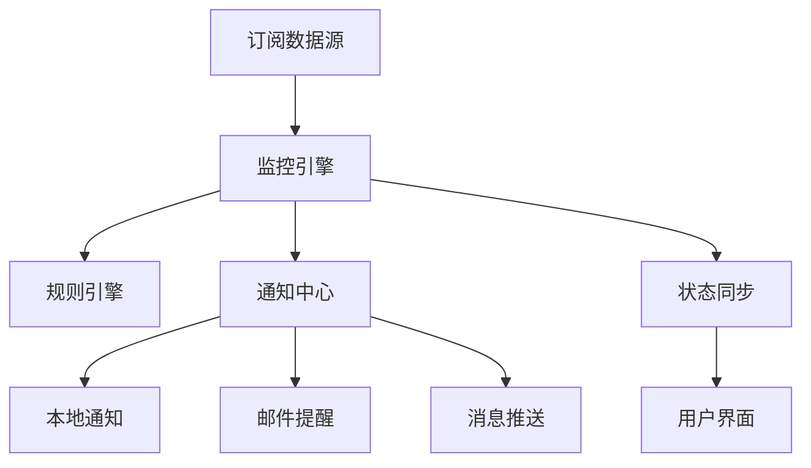
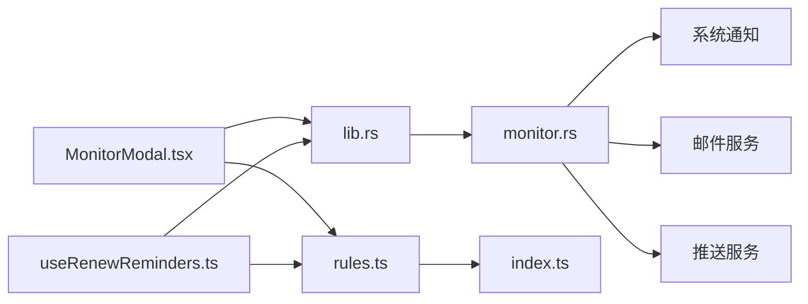

# 监控模块

<cite>
**本文引用的文件**   
- [apps/desktop/src/MonitorModal.tsx](file://apps/desktop/src/MonitorModal.tsx)
- [apps/desktop/src/useRenewReminders.ts](file://apps/desktop/src/useRenewReminders.ts)
- [apps/desktop/src-tauri/src/monitor.rs](file://apps/desktop/src-tauri/src/monitor.rs)
- [apps/desktop/src-tauri/src/lib.rs](file://apps/desktop/src-tauri/src/lib.rs)
- [apps/desktop/src-tauri/Cargo.toml](file://apps/desktop/src-tauri/Cargo.toml)
- [apps/desktop/package.json](file://apps/desktop/package.json)
- [packages/core/src/rules.ts](file://packages/core/src/rules.ts)
- [packages/core/src/index.ts](file://packages/core/src/index.ts)
</cite>

## 目录
1. [简介](#简介)
2. [项目结构](#项目结构)
3. [核心组件](#核心组件)
4. [架构总览](#架构总览)
5. [详细组件分析](#详细组件分析)
6. [依赖分析](#依赖分析)
7. [性能考虑](#性能考虑)
8. [故障排查指南](#故障排查指南)
9. [结论](#结论)
10. [附录](#附录)

## 简介
本文件面向“订阅管理”项目的监控模块，系统性说明定时任务系统、订阅状态监控与通知体系的设计与实现。重点覆盖：
- 定时任务调度：周期执行、间隔控制、重试策略
- 订阅状态监控：到期提醒、自动检查、状态同步
- 通知系统：本地通知、邮件提醒、消息推送
- 监控规则配置与扩展点
- 错误处理与日志记录最佳实践

## 项目结构
监控相关代码主要分布在桌面端前端（React/Tauri）与 Rust 后端之间：
- 前端通过 Tauri 命令调用 Rust 能力，进行系统级通知与后台任务协调
- 前端 Hook 负责订阅到期提醒的调度与 UI 联动
- Rust 侧提供 monitor 模块，承载平台无关的监控逻辑与通知能力
- 核心库 packages/core 提供规则定义与通用工具

图表来源
- [apps/desktop/src/MonitorModal.tsx](file://apps/desktop/src/MonitorModal.tsx)
- [apps/desktop/src/useRenewReminders.ts](file://apps/desktop/src/useRenewReminders.ts)
- [apps/desktop/src-tauri/src/lib.rs](file://apps/desktop/src-tauri/src/lib.rs)
- [apps/desktop/src-tauri/src/monitor.rs](file://apps/desktop/src-tauri/src/monitor.rs)
- [packages/core/src/rules.ts](file://packages/core/src/rules.ts)
- [packages/core/src/index.ts](file://packages/core/src/index.ts)

章节来源
- [apps/desktop/src/MonitorModal.tsx](file://apps/desktop/src/MonitorModal.tsx)
- [apps/desktop/src/useRenewReminders.ts](file://apps/desktop/src/useRenewReminders.ts)
- [apps/desktop/src-tauri/src/lib.rs](file://apps/desktop/src-tauri/src/lib.rs)
- [apps/desktop/src-tauri/src/monitor.rs](file://apps/desktop/src-tauri/src/monitor.rs)
- [packages/core/src/rules.ts](file://packages/core/src/rules.ts)
- [packages/core/src/index.ts](file://packages/core/src/index.ts)

## 核心组件
- 监控弹窗 MonitorModal：用于展示监控状态、触发手动检查、查看通知历史等
- 续费提醒 Hook useRenewReminders：封装订阅到期前的提醒调度、间隔与重试
- Tauri 命令注册 lib.rs：将前端函数映射到 Rust 方法，暴露系统通知与监控能力
- Rust 监控模块 monitor.rs：实现跨平台的监控与通知（本地通知、邮件、推送）
- 规则模块 rules.ts：定义监控规则（如到期阈值、检查频率、重试次数）
- 核心导出 index.ts：聚合对外 API，供上层使用

章节来源
- [apps/desktop/src/MonitorModal.tsx](file://apps/desktop/src/MonitorModal.tsx)
- [apps/desktop/src/useRenewReminders.ts](file://apps/desktop/src/useRenewReminders.ts)
- [apps/desktop/src-tauri/src/lib.rs](file://apps/desktop/src-tauri/src/lib.rs)
- [apps/desktop/src-tauri/src/monitor.rs](file://apps/desktop/src-tauri/src/monitor.rs)
- [packages/core/src/rules.ts](file://packages/core/src/rules.ts)
- [packages/core/src/index.ts](file://packages/core/src/index.ts)

## 架构总览
整体采用“前端调度 + 后端能力”的分层架构：
- 前端负责用户交互与轻量调度（Hook），并通过 Tauri 调用后端能力
- Rust 后端负责系统通知、持久化与跨平台兼容
- 规则引擎位于核心库，前后端共享规则语义

图表来源
- [apps/desktop/src/MonitorModal.tsx](file://apps/desktop/src/MonitorModal.tsx)
- [apps/desktop/src/useRenewReminders.ts](file://apps/desktop/src/useRenewReminders.ts)
- [apps/desktop/src-tauri/src/lib.rs](file://apps/desktop/src-tauri/src/lib.rs)
- [apps/desktop/src-tauri/src/monitor.rs](file://apps/desktop/src-tauri/src/monitor.rs)

## 详细组件分析

### 定时任务系统（调度、间隔与重试）
- 调度入口：useRenewReminders 负责根据订阅到期时间计算下一次检查时间，并设置定时器
- 执行间隔：支持按天/周/月等多粒度间隔；可配置最小检查间隔，避免频繁触发
- 重试机制：当检查失败或网络异常时，按指数退避策略重试，最多重试 N 次后标记失败
- 幂等性：同一订阅在同一周期内仅触发一次提醒，避免重复通知

图表来源
- [apps/desktop/src/useRenewReminders.ts](file://apps/desktop/src/useRenewReminders.ts)
- [apps/desktop/src-tauri/src/monitor.rs](file://apps/desktop/src-tauri/src/monitor.rs)

章节来源
- [apps/desktop/src/useRenewReminders.ts](file://apps/desktop/src/useRenewReminders.ts)
- [apps/desktop/src-tauri/src/monitor.rs](file://apps/desktop/src-tauri/src/monitor.rs)

### 订阅状态监控（到期提醒、自动检查、状态同步）
- 到期提醒：基于订阅到期日与阈值（如提前 7/3/1 天）触发提醒
- 自动检查：周期性拉取订阅状态（如支付平台、账单记录），更新本地状态
- 状态同步：将远端状态与本地缓存对比，差异则触发提醒与审计日志

图表来源
- [apps/desktop/src/useRenewReminders.ts](file://apps/desktop/src/useRenewReminders.ts)
- [apps/desktop/src-tauri/src/monitor.rs](file://apps/desktop/src-tauri/src/monitor.rs)

章节来源
- [apps/desktop/src/useRenewReminders.ts](file://apps/desktop/src/useRenewReminders.ts)
- [apps/desktop/src-tauri/src/monitor.rs](file://apps/desktop/src-tauri/src/monitor.rs)

### 通知系统（本地通知、邮件提醒、消息推送）
- 本地通知：通过系统通知中心弹出提醒，支持标题、正文、优先级
- 邮件提醒：支持模板渲染、附件（账单）、批量发送
- 消息推送：支持设备令牌、主题订阅、离线队列

图表来源
- [apps/desktop/src-tauri/src/lib.rs](file://apps/desktop/src-tauri/src/lib.rs)
- [apps/desktop/src-tauri/src/monitor.rs](file://apps/desktop/src-tauri/src/monitor.rs)

章节来源
- [apps/desktop/src-tauri/src/lib.rs](file://apps/desktop/src-tauri/src/lib.rs)
- [apps/desktop/src-tauri/src/monitor.rs](file://apps/desktop/src-tauri/src/monitor.rs)

### 监控规则配置与自定义扩展点
- 规则定义：在 rules.ts 中集中定义监控规则（如到期阈值、检查频率、重试上限）
- 规则校验：对输入参数进行合法性校验，确保调度安全
- 扩展点：提供插件式接口，允许新增通知渠道或检查策略

图表来源
- [packages/core/src/rules.ts](file://packages/core/src/rules.ts)
- [packages/core/src/index.ts](file://packages/core/src/index.ts)

章节来源
- [packages/core/src/rules.ts](file://packages/core/src/rules.ts)
- [packages/core/src/index.ts](file://packages/core/src/index.ts)

### 概念总览（非代码映射）
下图为监控模块的概念流程，便于理解整体工作流：

[本图为概念流程图，不直接映射具体源码文件]

## 依赖分析
- 前端依赖 Tauri 命令进行跨进程通信
- Rust 模块依赖系统通知与外部服务（邮件、推送）
- 核心库提供规则与工具，被前后端共同引用

图表来源
- [apps/desktop/src/MonitorModal.tsx](file://apps/desktop/src/MonitorModal.tsx)
- [apps/desktop/src/useRenewReminders.ts](file://apps/desktop/src/useRenewReminders.ts)
- [apps/desktop/src-tauri/src/lib.rs](file://apps/desktop/src-tauri/src/lib.rs)
- [apps/desktop/src-tauri/src/monitor.rs](file://apps/desktop/src-tauri/src/monitor.rs)
- [packages/core/src/rules.ts](file://packages/core/src/rules.ts)
- [packages/core/src/index.ts](file://packages/core/src/index.ts)

章节来源
- [apps/desktop/src/MonitorModal.tsx](file://apps/desktop/src/MonitorModal.tsx)
- [apps/desktop/src/useRenewReminders.ts](file://apps/desktop/src/useRenewReminders.ts)
- [apps/desktop/src-tauri/src/lib.rs](file://apps/desktop/src-tauri/src/lib.rs)
- [apps/desktop/src-tauri/src/monitor.rs](file://apps/desktop/src-tauri/src/monitor.rs)
- [packages/core/src/rules.ts](file://packages/core/src/rules.ts)
- [packages/core/src/index.ts](file://packages/core/src/index.ts)

## 性能考虑
- 合理设置检查间隔，避免频繁 I/O 与网络请求
- 使用指数退避与最大重试限制，降低雪崩风险
- 通知去重与批处理，减少系统资源占用
- 异步执行与超时控制，保证主线程响应性

## 故障排查指南
- 常见问题
  - 通知未送达：检查系统通知权限、邮件配置、推送令牌有效性
  - 重复提醒：确认去重逻辑与周期边界
  - 检查失败：查看错误码与日志，定位网络或服务问题
- 调试建议
  - 启用详细日志，记录每次检查与通知的上下文
  - 使用模拟数据验证规则与调度逻辑
  - 分阶段灰度发布通知渠道

章节来源
- [apps/desktop/src-tauri/src/monitor.rs](file://apps/desktop/src-tauri/src/monitor.rs)
- [apps/desktop/src/useRenewReminders.ts](file://apps/desktop/src/useRenewReminders.ts)

## 结论
监控模块通过“前端调度 + 后端能力 + 规则引擎”的组合，实现了稳定可靠的订阅到期提醒与状态同步。建议在后续迭代中完善可观测性与可配置性，提升系统的可扩展性与健壮性。

## 附录
- 构建与依赖
  - Tauri 配置与依赖声明见 Cargo.toml
  - 前端包管理与脚本见 package.json

章节来源
- [apps/desktop/src-tauri/Cargo.toml](file://apps/desktop/src-tauri/Cargo.toml)
- [apps/desktop/package.json](file://apps/desktop/package.json)