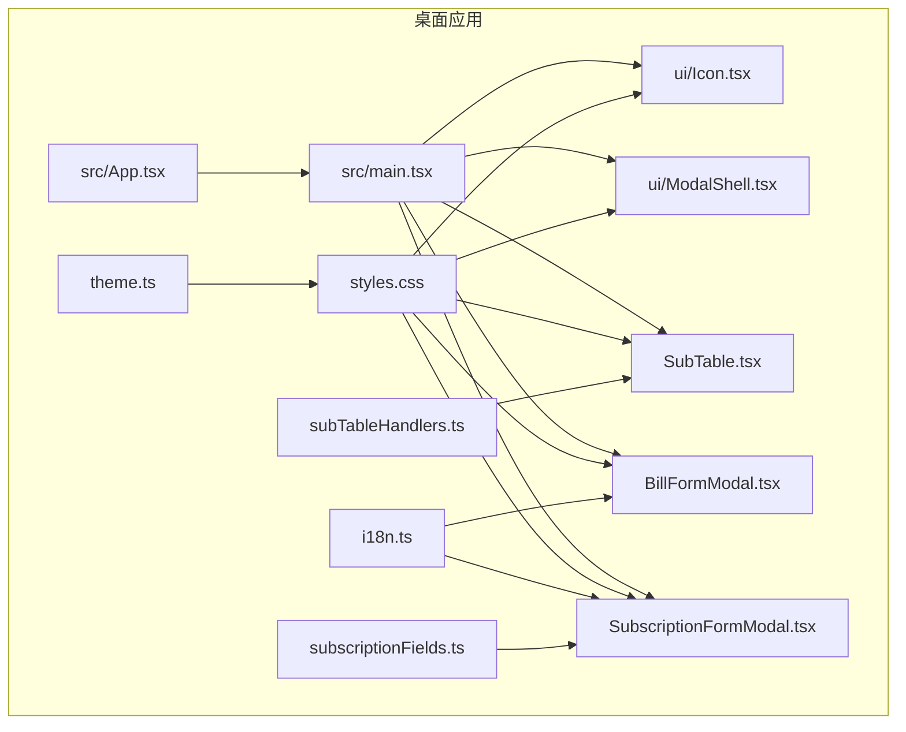
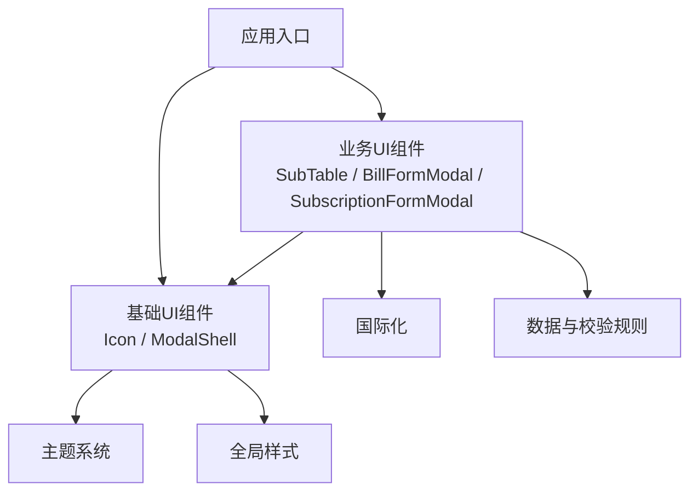
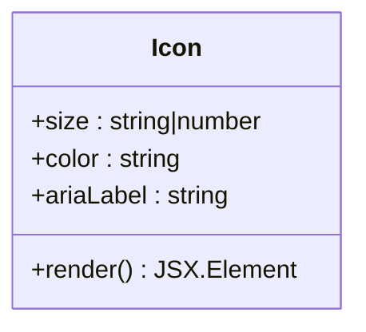
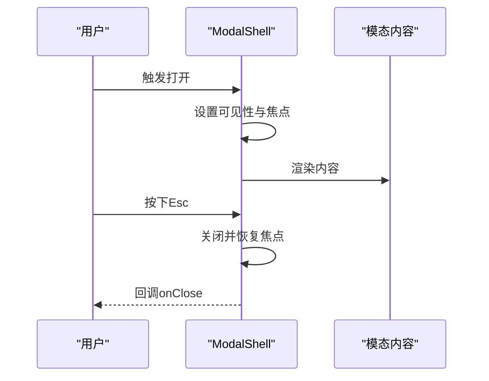
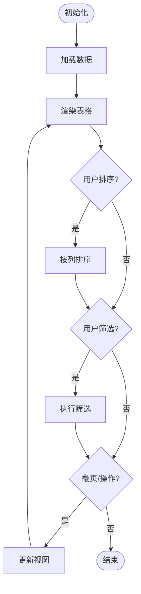
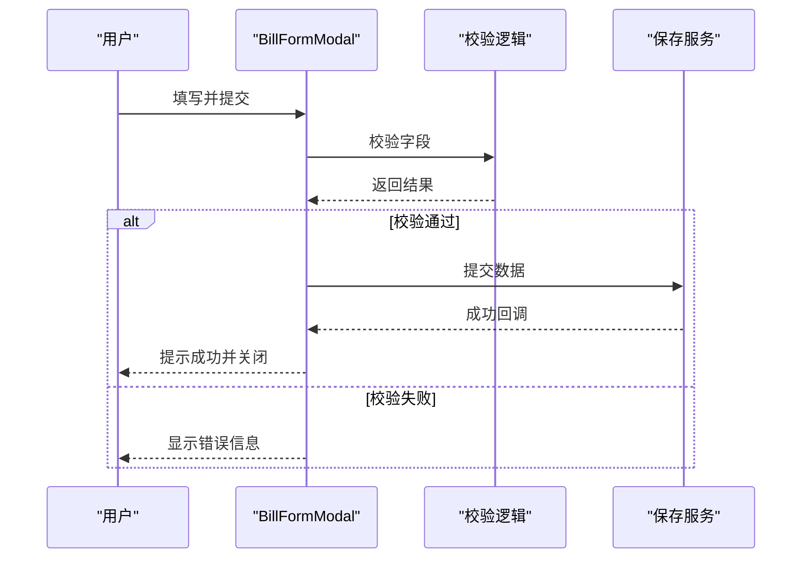
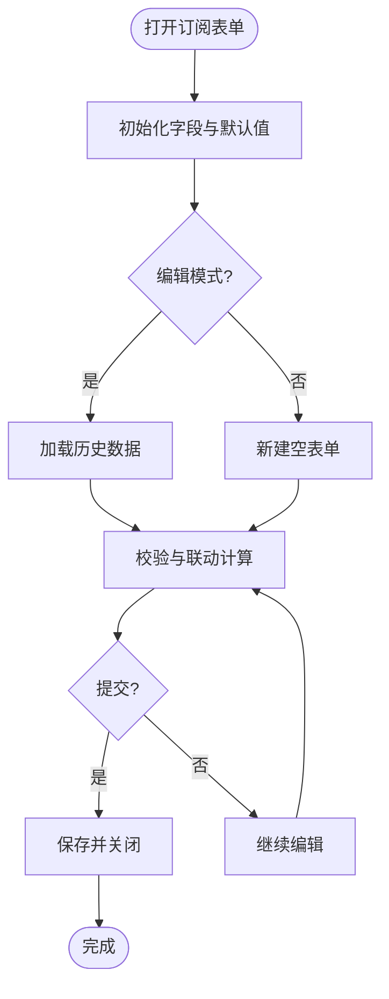
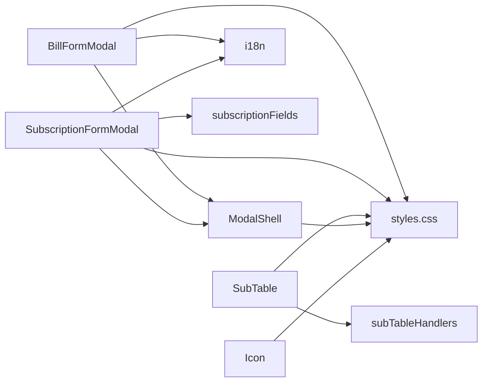

# UI组件

<cite>
**本文引用的文件**   
- [Icon.tsx](file://apps/desktop/src/ui/Icon.tsx)
- [ModalShell.tsx](file://apps/desktop/src/ui/ModalShell.tsx)
- [SubTable.tsx](file://apps/desktop/src/SubTable.tsx)
- [BillFormModal.tsx](file://apps/desktop/src/BillFormModal.tsx)
- [SubscriptionFormModal.tsx](file://apps/desktop/src/SubscriptionFormModal.tsx)
- [styles.css](file://apps/desktop/src/styles.css)
- [theme.ts](file://apps/desktop/src/theme.ts)
- [i18n.ts](file://apps/desktop/src/i18n.ts)
- [subscriptionFields.ts](file://apps/desktop/src/subscriptionFields.ts)
- [subTableHandlers.ts](file://apps/desktop/src/subTableHandlers.ts)
</cite>

## 目录
1. [简介](#简介)
2. [项目结构](#项目结构)
3. [核心组件](#核心组件)
4. [架构总览](#架构总览)
5. [详细组件分析](#详细组件分析)
6. [依赖分析](#依赖分析)
7. [性能考虑](#性能考虑)
8. [故障排查指南](#故障排查指南)
9. [结论](#结论)
10. [附录](#附录)

## 简介
本文件面向UI组件的复用与集成，聚焦以下可复用组件：
- Icon图标组件
- ModalShell模态框容器
- SubTable子表格
- BillFormModal账单表单
- SubscriptionFormModal订阅表单

文档将说明各组件的职责、属性接口、事件处理、样式定制选项、组合模式与最佳实践，并补充响应式设计与无障碍访问支持要点。

## 项目结构
UI相关代码主要位于桌面应用目录 apps/desktop/src 下：
- ui/ 目录包含通用UI基础组件（如Icon、ModalShell）
- 页面级表单与表格组件位于 src 根目录（如BillFormModal、SubscriptionFormModal、SubTable）
- 主题与国际化分别由 theme.ts 与 i18n.ts 提供
- 样式集中在 styles.css

图表来源
- [Icon.tsx](file://apps/desktop/src/ui/Icon.tsx)
- [ModalShell.tsx](file://apps/desktop/src/ui/ModalShell.tsx)
- [SubTable.tsx](file://apps/desktop/src/SubTable.tsx)
- [BillFormModal.tsx](file://apps/desktop/src/BillFormModal.tsx)
- [SubscriptionFormModal.tsx](file://apps/desktop/src/SubscriptionFormModal.tsx)
- [styles.css](file://apps/desktop/src/styles.css)
- [theme.ts](file://apps/desktop/src/theme.ts)
- [i18n.ts](file://apps/desktop/src/i18n.ts)
- [subscriptionFields.ts](file://apps/desktop/src/subscriptionFields.ts)
- [subTableHandlers.ts](file://apps/desktop/src/subTableHandlers.ts)

章节来源
- [styles.css](file://apps/desktop/src/styles.css)
- [theme.ts](file://apps/desktop/src/theme.ts)
- [i18n.ts](file://apps/desktop/src/i18n.ts)

## 核心组件
本节概述各组件的职责与使用方式，后续章节深入分析接口与实现细节。

- Icon图标组件：用于统一图标渲染与主题适配，支持尺寸、颜色、无障碍标签等配置。
- ModalShell模态框容器：提供模态框外壳、遮罩、焦点管理与键盘交互（Esc关闭）。
- SubTable子表格：展示结构化数据，支持排序、筛选、分页与行操作。
- BillFormModal账单表单：用于新增/编辑账单记录，包含金额、日期、分类等字段校验与提交。
- SubscriptionFormModal订阅表单：用于新增/编辑订阅项，包含周期、价格、到期提醒等字段与规则。

章节来源
- [Icon.tsx](file://apps/desktop/src/ui/Icon.tsx)
- [ModalShell.tsx](file://apps/desktop/src/ui/ModalShell.tsx)
- [SubTable.tsx](file://apps/desktop/src/SubTable.tsx)
- [BillFormModal.tsx](file://apps/desktop/src/BillFormModal.tsx)
- [SubscriptionFormModal.tsx](file://apps/desktop/src/SubscriptionFormModal.tsx)

## 架构总览
UI层以“基础组件 + 业务表单/表格”的分层组织，通过主题与国际化进行全局一致性控制。

图表来源
- [Icon.tsx](file://apps/desktop/src/ui/Icon.tsx)
- [ModalShell.tsx](file://apps/desktop/src/ui/ModalShell.tsx)
- [SubTable.tsx](file://apps/desktop/src/SubTable.tsx)
- [BillFormModal.tsx](file://apps/desktop/src/BillFormModal.tsx)
- [SubscriptionFormModal.tsx](file://apps/desktop/src/SubscriptionFormModal.tsx)
- [theme.ts](file://apps/desktop/src/theme.ts)
- [styles.css](file://apps/desktop/src/styles.css)
- [i18n.ts](file://apps/desktop/src/i18n.ts)
- [subscriptionFields.ts](file://apps/desktop/src/subscriptionFields.ts)

## 详细组件分析

### Icon图标组件
- 职责：集中管理图标资源与渲染逻辑，确保一致的视觉风格与无障碍语义。
- 关键能力：
  - 尺寸与颜色：通过属性控制图标大小与主题色适配。
  - 无障碍：支持aria-label或title描述，便于屏幕阅读器识别。
  - 主题联动：从主题系统读取颜色变量，保证暗/亮模式一致。
- 使用建议：
  - 在按钮、链接、状态指示处统一使用Icon，避免分散的SVG内联。
  - 为功能性图标提供有意义的无障碍文本。

图表来源
- [Icon.tsx](file://apps/desktop/src/ui/Icon.tsx)

章节来源
- [Icon.tsx](file://apps/desktop/src/ui/Icon.tsx)
- [styles.css](file://apps/desktop/src/styles.css)
- [theme.ts](file://apps/desktop/src/theme.ts)

### ModalShell模态框容器
- 职责：封装模态框外壳、遮罩层、焦点陷阱与键盘事件（如Esc关闭），提升用户体验与可访问性。
- 关键能力：
  - 可见性控制：通过属性控制显示/隐藏。
  - 焦点管理：打开时聚焦到标题或首个输入，关闭后恢复焦点。
  - 键盘交互：支持Esc关闭、Tab循环聚焦。
  - 内容插槽：允许传入任意内容作为模态体。
- 使用建议：
  - 所有需要弹窗的场景优先使用ModalShell，保证一致行为。
  - 为模态框设置明确的标题与role="dialog"。

图表来源
- [ModalShell.tsx](file://apps/desktop/src/ui/ModalShell.tsx)

章节来源
- [ModalShell.tsx](file://apps/desktop/src/ui/ModalShell.tsx)
- [styles.css](file://apps/desktop/src/styles.css)

### SubTable子表格
- 职责：展示结构化数据，支持排序、筛选、分页与行操作（编辑、删除等）。
- 关键能力：
  - 列定义：表头、数据类型、格式化函数。
  - 数据源：受控或本地数据，支持更新与刷新。
  - 交互：点击排序、输入筛选、分页切换、行选择。
  - 事件：行点击、批量操作、导出等回调。
- 使用建议：
  - 大数据量场景启用虚拟滚动或分页。
  - 为每列提供合适的对齐与格式（金额、日期等）。

图表来源
- [SubTable.tsx](file://apps/desktop/src/SubTable.tsx)
- [subTableHandlers.ts](file://apps/desktop/src/subTableHandlers.ts)

章节来源
- [SubTable.tsx](file://apps/desktop/src/SubTable.tsx)
- [subTableHandlers.ts](file://apps/desktop/src/subTableHandlers.ts)
- [styles.css](file://apps/desktop/src/styles.css)

### BillFormModal账单表单
- 职责：提供账单的新增与编辑能力，包含金额、日期、分类、备注等字段及校验。
- 关键能力：
  - 字段校验：必填、数值范围、日期合法性。
  - 提交处理：组装数据、调用保存API或状态更新。
  - 国际化：文案与提示多语言化。
  - 主题适配：表单控件样式跟随主题。
- 使用建议：
  - 将表单数据与UI状态分离，便于测试与复用。
  - 错误提示就近显示，保持用户上下文。

图表来源
- [BillFormModal.tsx](file://apps/desktop/src/BillFormModal.tsx)

章节来源
- [BillFormModal.tsx](file://apps/desktop/src/BillFormModal.tsx)
- [i18n.ts](file://apps/desktop/src/i18n.ts)
- [styles.css](file://apps/desktop/src/styles.css)

### SubscriptionFormModal订阅表单
- 职责：提供订阅项的新增与编辑能力，包含周期、价格、到期日、提醒策略等字段。
- 关键能力：
  - 字段与规则：基于subscriptionFields定义字段类型、默认值与校验规则。
  - 计算与联动：根据周期自动计算到期日与下次续费时间。
  - 提醒与通知：支持订阅到期提醒开关与阈值。
  - 国际化与主题：文案与样式统一。
- 使用建议：
  - 复杂字段拆分子组件，提高可读性与可测试性。
  - 对敏感字段（如支付信息）做额外安全提示。

图表来源
- [SubscriptionFormModal.tsx](file://apps/desktop/src/SubscriptionFormModal.tsx)
- [subscriptionFields.ts](file://apps/desktop/src/subscriptionFields.ts)

章节来源
- [SubscriptionFormModal.tsx](file://apps/desktop/src/SubscriptionFormModal.tsx)
- [subscriptionFields.ts](file://apps/desktop/src/subscriptionFields.ts)
- [i18n.ts](file://apps/desktop/src/i18n.ts)
- [styles.css](file://apps/desktop/src/styles.css)

### 组件组合模式与最佳实践
- 组合原则：
  - 基础组件（Icon、ModalShell）负责通用交互与样式；业务组件（SubTable、BillFormModal、SubscriptionFormModal）专注领域逻辑。
  - 通过属性与事件解耦，避免硬编码依赖。
- 推荐模式：
  - 受控组件：表单与表格数据由父组件管理，利于状态同步与测试。
  - 插槽/内容分发：ModalShell承载任意内容，SubTable通过列定义扩展。
  - 主题与国际化：通过theme.ts与i18n.ts注入，避免在组件内硬编码。
- 可访问性：
  - 为交互元素提供语义化标签与ARIA属性。
  - 确保键盘可达与焦点顺序合理。
- 响应式：
  - 使用相对单位与弹性布局，在小屏设备上折叠列或简化表单。
  - 表格在移动端采用横向滚动或卡片视图。

[无具体文件分析，无需章节来源]

## 依赖分析
组件间依赖关系如下：
- 业务组件依赖基础组件（ModalShell、Icon）
- 表单组件依赖国际化与字段定义
- 表格组件依赖数据处理与事件处理器

图表来源
- [BillFormModal.tsx](file://apps/desktop/src/BillFormModal.tsx)
- [SubscriptionFormModal.tsx](file://apps/desktop/src/SubscriptionFormModal.tsx)
- [SubTable.tsx](file://apps/desktop/src/SubTable.tsx)
- [ModalShell.tsx](file://apps/desktop/src/ui/ModalShell.tsx)
- [Icon.tsx](file://apps/desktop/src/ui/Icon.tsx)
- [subscriptionFields.ts](file://apps/desktop/src/subscriptionFields.ts)
- [subTableHandlers.ts](file://apps/desktop/src/subTableHandlers.ts)
- [styles.css](file://apps/desktop/src/styles.css)
- [i18n.ts](file://apps/desktop/src/i18n.ts)

章节来源
- [BillFormModal.tsx](file://apps/desktop/src/BillFormModal.tsx)
- [SubscriptionFormModal.tsx](file://apps/desktop/src/SubscriptionFormModal.tsx)
- [SubTable.tsx](file://apps/desktop/src/SubTable.tsx)
- [ModalShell.tsx](file://apps/desktop/src/ui/ModalShell.tsx)
- [Icon.tsx](file://apps/desktop/src/ui/Icon.tsx)
- [subscriptionFields.ts](file://apps/desktop/src/subscriptionFields.ts)
- [subTableHandlers.ts](file://apps/desktop/src/subTableHandlers.ts)
- [styles.css](file://apps/desktop/src/styles.css)
- [i18n.ts](file://apps/desktop/src/i18n.ts)

## 性能考虑
- 列表渲染：对大数据集启用分页或虚拟滚动，减少DOM节点数量。
- 表单校验：采用防抖与增量校验，避免每次输入都全量校验。
- 主题与样式：尽量使用CSS变量与类名切换，避免频繁重排重绘。
- 事件处理：为高频事件（滚动、输入）添加节流/防抖。
- 资源加载：图标按需加载与缓存，减少初始包体积。

[无具体文件分析，无需章节来源]

## 故障排查指南
- 模态框无法关闭：检查是否被其他遮罩覆盖、焦点是否被劫持、键盘事件是否被阻止。
- 表单提交无效：确认字段校验规则与必填项，查看控制台错误与网络请求。
- 表格数据不更新：检查数据源引用是否变化、事件回调是否正确触发。
- 样式错乱：确认主题变量生效、CSS优先级与命名冲突。
- 国际化缺失：确认翻译键存在且加载正确。

章节来源
- [ModalShell.tsx](file://apps/desktop/src/ui/ModalShell.tsx)
- [BillFormModal.tsx](file://apps/desktop/src/BillFormModal.tsx)
- [SubscriptionFormModal.tsx](file://apps/desktop/src/SubscriptionFormModal.tsx)
- [SubTable.tsx](file://apps/desktop/src/SubTable.tsx)
- [styles.css](file://apps/desktop/src/styles.css)
- [i18n.ts](file://apps/desktop/src/i18n.ts)

## 结论
本UI组件体系以基础组件为核心，结合业务表单与表格，形成清晰分层与高内聚低耦合的结构。通过主题与国际化保障一致性，借助可访问性与响应式设计提升体验。遵循组合模式与最佳实践，可在不同场景下快速复用与扩展。

[无具体文件分析，无需章节来源]

## 附录
- 响应式设计要点：
  - 使用弹性布局与媒体查询适配不同屏幕。
  - 表格在小屏设备下采用卡片视图或横向滚动。
  - 表单字段在窄屏下堆叠排列，提升可读性。
- 无障碍访问要点：
  - 为交互元素提供语义化标签与ARIA属性。
  - 确保键盘可达与焦点顺序合理。
  - 为图标与图片提供替代文本。

[无具体文件分析，无需章节来源]