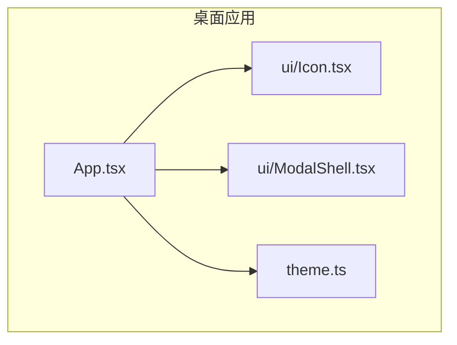
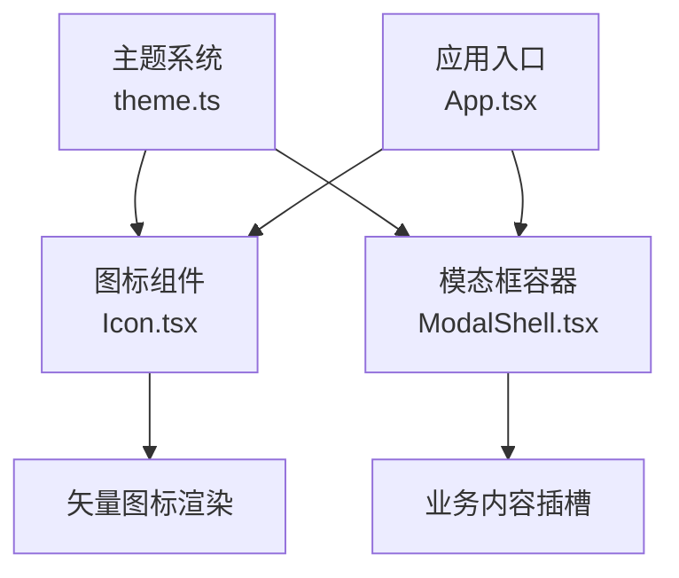
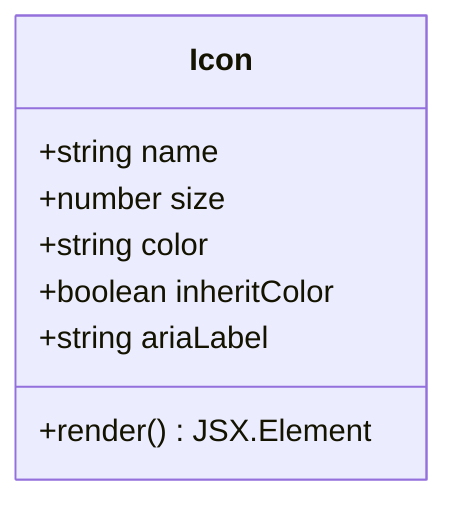
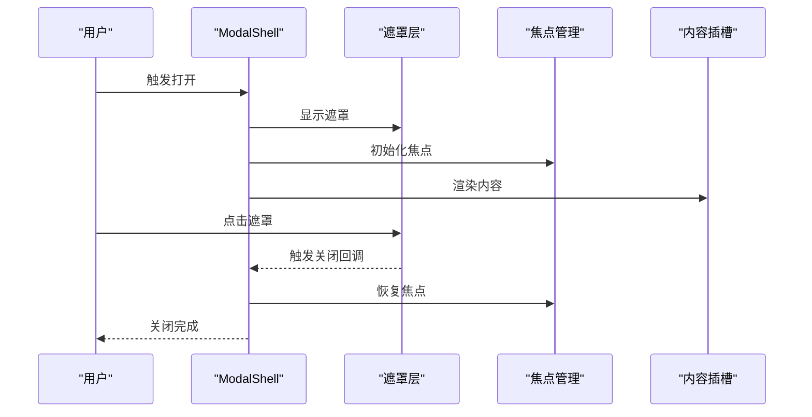
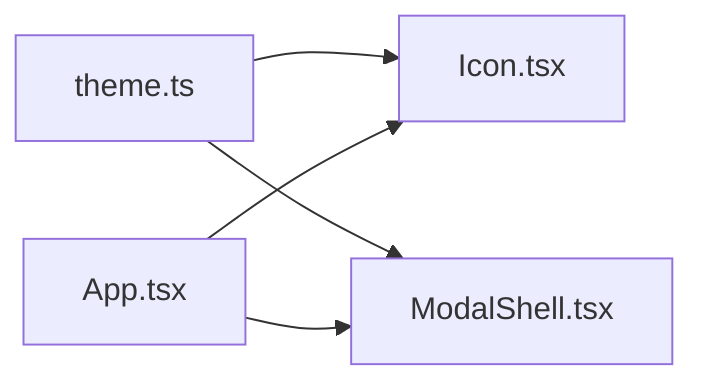

# 基础组件

<cite>
**本文引用的文件**   
- [Icon.tsx](file://apps/desktop/src/ui/Icon.tsx)
- [ModalShell.tsx](file://apps/desktop/src/ui/ModalShell.tsx)
- [theme.ts](file://apps/desktop/src/theme.ts)
- [App.tsx](file://apps/desktop/src/App.tsx)
</cite>

## 目录
1. [简介](#简介)
2. [项目结构](#项目结构)
3. [核心组件](#核心组件)
4. [架构总览](#架构总览)
5. [详细组件分析](#详细组件分析)
6. [依赖关系分析](#依赖关系分析)
7. [性能考虑](#性能考虑)
8. [故障排查指南](#故障排查指南)
9. [结论](#结论)
10. [附录：API与使用示例](#附录api与使用示例)

## 简介
本文件面向开发者，系统化梳理并文档化基础UI组件：Icon图标组件与ModalShell模态框容器。内容涵盖组件能力、属性配置、事件机制、主题适配、键盘导航、响应式行为、最佳实践与性能优化建议，帮助读者快速上手并高质量集成到应用中。

## 项目结构
本项目采用多应用（desktop、ios）与共享核心库（core）的仓库结构。本次文档聚焦桌面端应用的UI层基础组件，位于 apps/desktop/src/ui 目录下，并与主题系统 theme.ts 协同工作。

图表来源
- [App.tsx](file://apps/desktop/src/App.tsx)
- [Icon.tsx](file://apps/desktop/src/ui/Icon.tsx)
- [ModalShell.tsx](file://apps/desktop/src/ui/ModalShell.tsx)
- [theme.ts](file://apps/desktop/src/theme.ts)

章节来源
- [App.tsx](file://apps/desktop/src/App.tsx)
- [Icon.tsx](file://apps/desktop/src/ui/Icon.tsx)
- [ModalShell.tsx](file://apps/desktop/src/ui/ModalShell.tsx)
- [theme.ts](file://apps/desktop/src/theme.ts)

## 核心组件
- Icon 图标组件：提供统一的图标渲染入口，支持尺寸、颜色、主题色、语义化属性等配置，便于在按钮、标签、导航等场景复用。
- ModalShell 模态框容器：提供遮罩层、焦点管理、键盘导航（如Esc关闭）、可滚动内容区、响应式布局等通用能力，作为各类业务弹窗的基础壳。

章节来源
- [Icon.tsx](file://apps/desktop/src/ui/Icon.tsx)
- [ModalShell.tsx](file://apps/desktop/src/ui/ModalShell.tsx)

## 架构总览
Icon 与 ModalShell 均受主题系统驱动，确保视觉一致性；ModalShell 负责交互与可访问性，Icon 专注图形表达。两者通过上层页面组件组合使用，形成稳定的基础UI层。

图表来源
- [theme.ts](file://apps/desktop/src/theme.ts)
- [Icon.tsx](file://apps/desktop/src/ui/Icon.tsx)
- [ModalShell.tsx](file://apps/desktop/src/ui/ModalShell.tsx)
- [App.tsx](file://apps/desktop/src/App.tsx)

## 详细组件分析

### Icon 图标组件
- 支持的图标类型
  - 基于SVG的矢量图标，便于缩放与主题着色。
  - 可通过名称或标识选择不同图标集（例如常用操作、状态、导航等）。
- 尺寸配置
  - 支持以像素或相对单位设置宽高，默认值保证可读性与一致性。
  - 支持按设计令牌（token）统一控制尺寸档位。
- 颜色定制
  - 支持显式传入颜色值，或继承父级颜色。
  - 支持从主题中读取当前语义色（如主色、成功、警告、错误等）。
- 主题适配
  - 自动跟随明暗主题切换，保持对比度与可读性。
  - 支持通过主题变量覆盖默认样式。
- 可访问性与语义
  - 提供 aria-* 属性，用于屏幕阅读器描述。
  - 支持 role 与 tabIndex 控制，确保键盘可达性。
- 性能与渲染
  - 内联SVG减少请求开销，适合小图标高频使用。
  - 避免不必要的重绘，结合CSS transform进行动画更友好。

图表来源
- [Icon.tsx](file://apps/desktop/src/ui/Icon.tsx)

章节来源
- [Icon.tsx](file://apps/desktop/src/ui/Icon.tsx)
- [theme.ts](file://apps/desktop/src/theme.ts)

### ModalShell 模态框容器
- 功能特性
  - 内容插槽：支持头部、主体、底部等多区域插槽，灵活承载业务内容。
  - 遮罩层处理：点击遮罩关闭、阻止背景滚动、层级隔离。
  - 键盘导航：支持Esc关闭、Tab焦点循环、焦点初始定位与恢复。
  - 响应式行为：根据视口宽度调整布局（如居中、全屏、侧边抽屉）。
  - 可访问性：aria-modal、role="dialog"、焦点管理与屏幕阅读器提示。
- 生命周期与事件
  - 打开/关闭回调、遮罩点击回调、ESC键回调、焦点进入/离开回调。
  - 支持受控与非受控两种模式（由外部状态或内部状态管理）。
- 样式与主题
  - 遵循主题令牌，支持明暗主题切换。
  - 提供尺寸、间距、圆角、阴影等可配置项。
- 性能与体验
  - 延迟渲染内容以提升首屏性能。
  - 防抖/节流关闭逻辑，避免重复触发。
  - 合理拆分子组件，减少不必要重渲染。

图表来源
- [ModalShell.tsx](file://apps/desktop/src/ui/ModalShell.tsx)

章节来源
- [ModalShell.tsx](file://apps/desktop/src/ui/ModalShell.tsx)
- [theme.ts](file://apps/desktop/src/theme.ts)

## 依赖关系分析
- Icon 依赖主题系统获取颜色与语义变量，确保跨主题一致。
- ModalShell 依赖主题系统与浏览器API（焦点、事件、滚动），实现可访问性与交互。
- 上层应用通过 App.tsx 引入并使用这两个组件，形成稳定的基础UI层。

图表来源
- [theme.ts](file://apps/desktop/src/theme.ts)
- [Icon.tsx](file://apps/desktop/src/ui/Icon.tsx)
- [ModalShell.tsx](file://apps/desktop/src/ui/ModalShell.tsx)
- [App.tsx](file://apps/desktop/src/App.tsx)

章节来源
- [theme.ts](file://apps/desktop/src/theme.ts)
- [Icon.tsx](file://apps/desktop/src/ui/Icon.tsx)
- [ModalShell.tsx](file://apps/desktop/src/ui/ModalShell.tsx)
- [App.tsx](file://apps/desktop/src/App.tsx)

## 性能考虑
- 图标渲染
  - 优先使用内联SVG，减少网络请求与加载抖动。
  - 对静态图标进行缓存，避免重复创建实例。
  - 使用CSS transform替代频繁修改尺寸，提升动画性能。
- 模态框渲染
  - 按需渲染内容，避免在不可见时执行昂贵计算。
  - 使用懒加载与虚拟列表（当内容较长时）。
  - 合并多次状态更新，减少重渲染次数。
- 主题与样式
  - 通过主题令牌集中管理样式，减少重复计算。
  - 避免在高频事件中直接操作DOM，使用声明式更新。

## 故障排查指南
- 图标不显示或颜色异常
  - 检查图标名称是否正确，确认主题色是否被覆盖。
  - 验证父级颜色上下文与inheritColor配置。
- 模态框无法关闭或焦点异常
  - 确认键盘事件监听未被阻止（如e.stopPropagation）。
  - 检查焦点初始位置与恢复逻辑是否正确。
  - 验证遮罩层点击事件绑定与冒泡控制。
- 主题切换无效
  - 确认主题变量已正确注入且组件订阅了主题变化。
  - 检查样式优先级与覆盖规则。

章节来源
- [Icon.tsx](file://apps/desktop/src/ui/Icon.tsx)
- [ModalShell.tsx](file://apps/desktop/src/ui/ModalShell.tsx)
- [theme.ts](file://apps/desktop/src/theme.ts)

## 结论
Icon 与 ModalShell 作为基础UI组件，分别承担“图形表达”和“交互容器”的职责。通过主题系统实现一致的视觉风格，通过完善的可访问性与键盘导航保障用户体验。遵循本文档的配置与最佳实践，可在复杂业务场景中稳定复用并高效扩展。

## 附录：API与使用示例

### Icon 组件API
- 属性
  - name：图标名称或标识
  - size：尺寸（数值或单位）
  - color：颜色值或主题色名
  - inheritColor：是否继承父级颜色
  - ariaLabel：无障碍描述文本
  - role：语义角色
  - tabIndex：键盘可达性
- 事件
  - onClick：点击回调
- 使用示例
  - 基本用法：指定名称与尺寸
  - 主题色：使用主题中的语义色
  - 自定义颜色：传入具体颜色值
  - 无障碍：设置ariaLabel与role

章节来源
- [Icon.tsx](file://apps/desktop/src/ui/Icon.tsx)
- [theme.ts](file://apps/desktop/src/theme.ts)

### ModalShell 组件API
- 属性
  - open：是否打开（受控模式）
  - title：标题文本
  - width：宽度策略（如固定、自适应、全屏）
  - closeOnOverlay：是否允许点击遮罩关闭
  - closeOnEsc：是否允许Esc关闭
  - focusTrap：是否启用焦点陷阱
  - onOpen/onClose：打开/关闭回调
  - onOverlayClick：遮罩点击回调
  - children：内容插槽（头部、主体、底部）
- 事件
  - onClose：关闭事件
  - onOpen：打开事件
  - onKeyDown：键盘事件（可用于扩展快捷键）
- 使用示例
  - 受控模式：外部状态管理open
  - 非受控模式：内部状态管理
  - 响应式：根据视口调整布局
  - 可访问性：启用焦点陷阱与ARIA属性

章节来源
- [ModalShell.tsx](file://apps/desktop/src/ui/ModalShell.tsx)
- [theme.ts](file://apps/desktop/src/theme.ts)