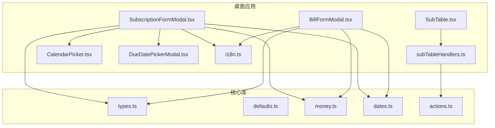
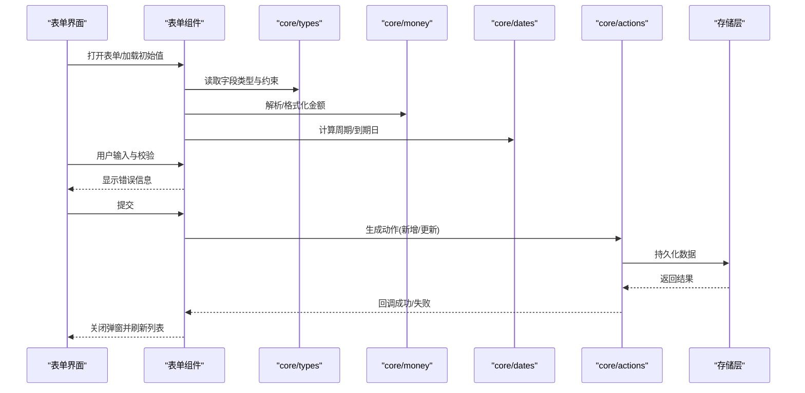
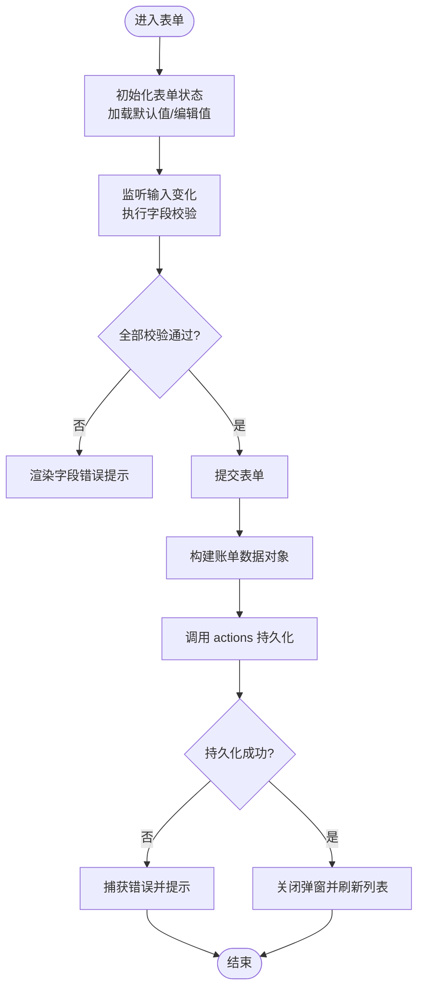
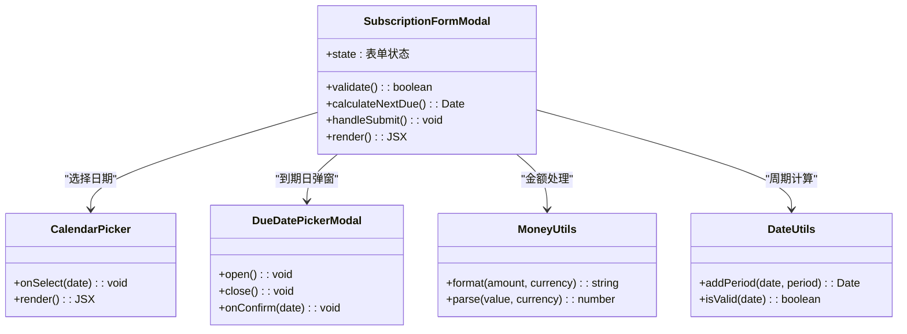
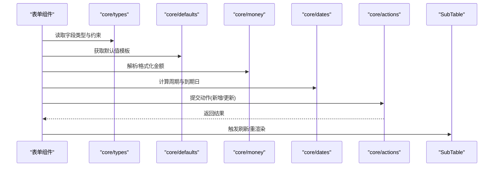
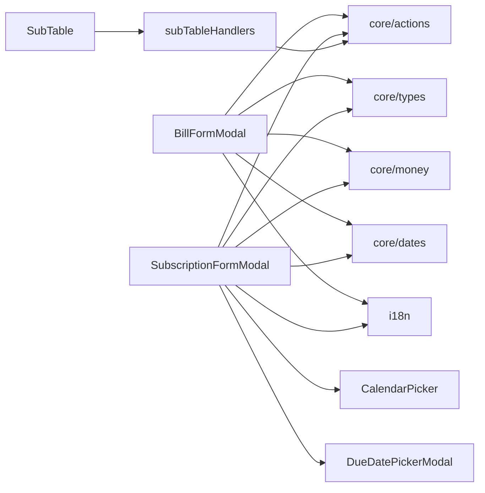

# 表单组件

<cite>
**本文引用的文件**   
- [BillFormModal.tsx](file://apps/desktop/src/BillFormModal.tsx)
- [SubscriptionFormModal.tsx](file://apps/desktop/src/SubscriptionFormModal.tsx)
- [subscriptionFields.ts](file://apps/desktop/src/subscriptionFields.ts)
- [i18n.ts](file://apps/desktop/src/i18n.ts)
- [CalendarPicker.tsx](file://apps/desktop/src/CalendarPicker.tsx)
- [DueDatePickerModal.tsx](file://apps/desktop/src/DueDatePickerModal.tsx)
- [SubTable.tsx](file://apps/desktop/src/SubTable.tsx)
- [subTableHandlers.ts](file://apps/desktop/src/subTableHandlers.ts)
- [types.ts](file://packages/core/src/types.ts)
- [defaults.ts](file://packages/core/src/defaults.ts)
- [money.ts](file://packages/core/src/money.ts)
- [dates.ts](file://packages/core/src/dates.ts)
- [actions.ts](file://packages/core/src/actions.ts)
</cite>

## 目录
1. [简介](#简介)
2. [项目结构](#项目结构)
3. [核心组件](#核心组件)
4. [架构总览](#架构总览)
5. [详细组件分析](#详细组件分析)
6. [依赖关系分析](#依赖关系分析)
7. [性能考虑](#性能考虑)
8. [故障排查指南](#故障排查指南)
9. [结论](#结论)
10. [附录](#附录)

## 简介
本文件面向订阅管理桌面应用中的表单组件，重点覆盖以下方面：
- BillFormModal（账单表单）：字段验证、数据绑定、错误处理与提交逻辑。
- SubscriptionFormModal（订阅表单）：日期选择器集成、金额计算、重复周期设置与状态管理。
- 表单定制选项、样式覆盖与国际化支持的使用示例。
- 表单组件与业务逻辑的集成方式与数据流处理。

## 项目结构
- 表单组件位于 apps/desktop/src 下，分别实现账单与订阅两类表单。
- 领域类型、默认值、金额与日期工具函数位于 packages/core/src。
- 国际化配置在 apps/desktop/src/i18n.ts。
- 表格展示与交互在 SubTable.tsx 与 subTableHandlers.ts。
- 日期选择相关组件包括 CalendarPicker.tsx 与 DueDatePickerModal.tsx。

图表来源
- [BillFormModal.tsx](file://apps/desktop/src/BillFormModal.tsx)
- [SubscriptionFormModal.tsx](file://apps/desktop/src/SubscriptionFormModal.tsx)
- [SubTable.tsx](file://apps/desktop/src/SubTable.tsx)
- [subTableHandlers.ts](file://apps/desktop/src/subTableHandlers.ts)
- [CalendarPicker.tsx](file://apps/desktop/src/CalendarPicker.tsx)
- [DueDatePickerModal.tsx](file://apps/desktop/src/DueDatePickerModal.tsx)
- [i18n.ts](file://apps/desktop/src/i18n.ts)
- [types.ts](file://packages/core/src/types.ts)
- [defaults.ts](file://packages/core/src/defaults.ts)
- [money.ts](file://packages/core/src/money.ts)
- [dates.ts](file://packages/core/src/dates.ts)
- [actions.ts](file://packages/core/src/actions.ts)

章节来源
- [BillFormModal.tsx](file://apps/desktop/src/BillFormModal.tsx)
- [SubscriptionFormModal.tsx](file://apps/desktop/src/SubscriptionFormModal.tsx)
- [SubTable.tsx](file://apps/desktop/src/SubTable.tsx)
- [subTableHandlers.ts](file://apps/desktop/src/subTableHandlers.ts)
- [i18n.ts](file://apps/desktop/src/i18n.ts)
- [CalendarPicker.tsx](file://apps/desktop/src/CalendarPicker.tsx)
- [DueDatePickerModal.tsx](file://apps/desktop/src/DueDatePickerModal.tsx)
- [types.ts](file://packages/core/src/types.ts)
- [defaults.ts](file://packages/core/src/defaults.ts)
- [money.ts](file://packages/core/src/money.ts)
- [dates.ts](file://packages/core/src/dates.ts)
- [actions.ts](file://packages/core/src/actions.ts)

## 核心组件
- BillFormModal：用于新增或编辑账单记录，包含名称、金额、日期、分类等字段，提供本地校验与错误提示，并在提交时调用核心动作以持久化数据。
- SubscriptionFormModal：用于新增或编辑订阅项，包含订阅名称、金额、币种、计费周期、下次到期日、状态等，集成日期选择器，自动计算周期与到期时间，并维护表单状态与校验结果。

章节来源
- [BillFormModal.tsx](file://apps/desktop/src/BillFormModal.tsx)
- [SubscriptionFormModal.tsx](file://apps/desktop/src/SubscriptionFormModal.tsx)

## 架构总览
表单组件通过 core 包提供的类型、默认值、金额与日期工具进行数据规范化与计算，并通过 actions 将变更写入存储层。UI 层使用 i18n 进行文案国际化，日期选择由 CalendarPicker 与 DueDatePickerModal 提供。

图表来源
- [SubscriptionFormModal.tsx](file://apps/desktop/src/SubscriptionFormModal.tsx)
- [types.ts](file://packages/core/src/types.ts)
- [money.ts](file://packages/core/src/money.ts)
- [dates.ts](file://packages/core/src/dates.ts)
- [actions.ts](file://packages/core/src/actions.ts)

## 详细组件分析

### BillFormModal（账单表单）
- 字段与验证
  - 必填字段：名称、金额、日期等；金额需为正数且符合货币格式；日期需为有效日期。
  - 实时校验：输入变化时即时反馈错误消息，避免无效提交。
- 数据绑定
  - 受控组件模式：表单状态与输入双向绑定，统一由组件状态管理。
  - 金额与日期通过 core 工具进行标准化，确保一致性。
- 错误处理
  - 字段级错误聚合，提交前汇总校验结果，错误信息按字段展示。
  - 网络或存储异常捕获，给出友好提示。
- 提交逻辑
  - 构建账单对象后调用 actions 创建或更新记录。
  - 成功后关闭弹窗并触发父级刷新。

图表来源
- [BillFormModal.tsx](file://apps/desktop/src/BillFormModal.tsx)
- [money.ts](file://packages/core/src/money.ts)
- [dates.ts](file://packages/core/src/dates.ts)
- [actions.ts](file://packages/core/src/actions.ts)

章节来源
- [BillFormModal.tsx](file://apps/desktop/src/BillFormModal.tsx)
- [money.ts](file://packages/core/src/money.ts)
- [dates.ts](file://packages/core/src/dates.ts)
- [actions.ts](file://packages/core/src/actions.ts)

### SubscriptionFormModal（订阅表单）
- 功能特性
  - 日期选择器集成：使用 CalendarPicker 与 DueDatePickerModal 选择开始/到期日期，自动计算下次到期日。
  - 金额计算：基于金额与币种进行格式化与精度控制，支持周期性费用换算。
  - 重复周期设置：支持按月/季度/年等周期，自动推导续费时间与提醒策略。
  - 状态管理：表单状态集中管理，包含字段值、校验结果、加载与错误状态。
- 数据绑定与校验
  - 受控组件模式，字段变化触发校验与重新计算。
  - 周期与到期日联动校验，防止非法组合。
- 提交逻辑
  - 构建订阅对象后调用 actions 持久化，成功后刷新订阅列表。

图表来源
- [SubscriptionFormModal.tsx](file://apps/desktop/src/SubscriptionFormModal.tsx)
- [CalendarPicker.tsx](file://apps/desktop/src/CalendarPicker.tsx)
- [DueDatePickerModal.tsx](file://apps/desktop/src/DueDatePickerModal.tsx)
- [money.ts](file://packages/core/src/money.ts)
- [dates.ts](file://packages/core/src/dates.ts)

章节来源
- [SubscriptionFormModal.tsx](file://apps/desktop/src/SubscriptionFormModal.tsx)
- [CalendarPicker.tsx](file://apps/desktop/src/CalendarPicker.tsx)
- [DueDatePickerModal.tsx](file://apps/desktop/src/DueDatePickerModal.tsx)
- [money.ts](file://packages/core/src/money.ts)
- [dates.ts](file://packages/core/src/dates.ts)

### 表单定制选项、样式覆盖与国际化
- 定制选项
  - 字段可见性与顺序可通过配置对象调整，支持扩展自定义字段。
  - 校验规则可注入，允许业务侧增强或替换默认校验。
- 样式覆盖
  - 通过主题变量或 CSS 类名覆盖默认样式，保持与设计系统一致。
- 国际化支持
  - 所有文案通过 i18n 模块加载，支持多语言切换与动态更新。

章节来源
- [i18n.ts](file://apps/desktop/src/i18n.ts)
- [SubscriptionFormModal.tsx](file://apps/desktop/src/SubscriptionFormModal.tsx)
- [BillFormModal.tsx](file://apps/desktop/src/BillFormModal.tsx)

### 与业务逻辑的集成与数据流
- 类型与默认值
  - 使用 core/types 定义表单数据结构与约束，defaults 提供默认值模板。
- 金额与日期
  - money.ts 负责金额解析与格式化，dates.ts 负责周期计算与合法性校验。
- 动作与持久化
  - actions.ts 封装增删改查动作，统一处理副作用与状态同步。
- 列表与交互
  - SubTable.tsx 展示订阅与账单列表，subTableHandlers.ts 处理行操作与事件转发。

图表来源
- [SubscriptionFormModal.tsx](file://apps/desktop/src/SubscriptionFormModal.tsx)
- [BillFormModal.tsx](file://apps/desktop/src/BillFormModal.tsx)
- [types.ts](file://packages/core/src/types.ts)
- [defaults.ts](file://packages/core/src/defaults.ts)
- [money.ts](file://packages/core/src/money.ts)
- [dates.ts](file://packages/core/src/dates.ts)
- [actions.ts](file://packages/core/src/actions.ts)
- [SubTable.tsx](file://apps/desktop/src/SubTable.tsx)

章节来源
- [types.ts](file://packages/core/src/types.ts)
- [defaults.ts](file://packages/core/src/defaults.ts)
- [money.ts](file://packages/core/src/money.ts)
- [dates.ts](file://packages/core/src/dates.ts)
- [actions.ts](file://packages/core/src/actions.ts)
- [SubTable.tsx](file://apps/desktop/src/SubTable.tsx)
- [subTableHandlers.ts](file://apps/desktop/src/subTableHandlers.ts)

## 依赖关系分析
- 组件内聚性
  - 表单组件内部状态与校验逻辑高内聚，外部仅暴露必要接口。
- 直接依赖
  - 表单组件依赖 core 的类型、默认值、金额与日期工具，以及 actions 进行数据持久化。
- 间接依赖
  - 通过 SubTable 与 handlers 与列表展示层解耦，降低耦合度。
- 外部依赖
  - i18n 提供国际化能力，日历组件提供日期选择能力。

图表来源
- [BillFormModal.tsx](file://apps/desktop/src/BillFormModal.tsx)
- [SubscriptionFormModal.tsx](file://apps/desktop/src/SubscriptionFormModal.tsx)
- [types.ts](file://packages/core/src/types.ts)
- [money.ts](file://packages/core/src/money.ts)
- [dates.ts](file://packages/core/src/dates.ts)
- [actions.ts](file://packages/core/src/actions.ts)
- [i18n.ts](file://apps/desktop/src/i18n.ts)
- [CalendarPicker.tsx](file://apps/desktop/src/CalendarPicker.tsx)
- [DueDatePickerModal.tsx](file://apps/desktop/src/DueDatePickerModal.tsx)
- [SubTable.tsx](file://apps/desktop/src/SubTable.tsx)
- [subTableHandlers.ts](file://apps/desktop/src/subTableHandlers.ts)

章节来源
- [BillFormModal.tsx](file://apps/desktop/src/BillFormModal.tsx)
- [SubscriptionFormModal.tsx](file://apps/desktop/src/SubscriptionFormModal.tsx)
- [types.ts](file://packages/core/src/types.ts)
- [money.ts](file://packages/core/src/money.ts)
- [dates.ts](file://packages/core/src/dates.ts)
- [actions.ts](file://packages/core/src/actions.ts)
- [i18n.ts](file://apps/desktop/src/i18n.ts)
- [CalendarPicker.tsx](file://apps/desktop/src/CalendarPicker.tsx)
- [DueDatePickerModal.tsx](file://apps/desktop/src/DueDatePickerModal.tsx)
- [SubTable.tsx](file://apps/desktop/src/SubTable.tsx)
- [subTableHandlers.ts](file://apps/desktop/src/subTableHandlers.ts)

## 性能考虑
- 表单校验优化
  - 采用防抖与增量校验，减少不必要的重渲染与计算。
- 金额与日期计算
  - 复用 core 工具函数，避免重复解析与格式化开销。
- 状态管理
  - 局部状态与全局状态分离，仅在必要时触发列表刷新。
- 组件渲染
  - 使用受控组件与最小化 state 更新，提升响应速度。

[本节为通用指导，不直接分析具体文件]

## 故障排查指南
- 常见错误
  - 金额格式不正确：检查金额解析与格式化逻辑，确认币种与精度。
  - 日期非法：校验日期范围与周期组合，确保到期日大于开始日。
  - 提交失败：查看 actions 返回值与错误日志，确认存储层可用性。
- 调试建议
  - 打印表单状态与校验结果，定位问题字段。
  - 使用浏览器开发者工具断点调试关键函数。
  - 检查 i18n 文案是否完整，避免空字符串导致 UI 异常。

章节来源
- [SubscriptionFormModal.tsx](file://apps/desktop/src/SubscriptionFormModal.tsx)
- [BillFormModal.tsx](file://apps/desktop/src/BillFormModal.tsx)
- [actions.ts](file://packages/core/src/actions.ts)

## 结论
BillFormModal 与 SubscriptionFormModal 通过 core 包的类型、默认值、金额与日期工具实现了稳健的数据绑定、校验与持久化流程。借助 i18n 与日历组件，表单具备良好的可定制性与用户体验。建议在业务扩展中遵循现有模式，保持高内聚低耦合，确保可维护性与性能。

[本节为总结性内容，不直接分析具体文件]

## 附录
- 字段定制示例
  - 在表单配置中添加自定义字段，并注册对应校验规则与渲染组件。
- 样式覆盖示例
  - 通过主题变量覆盖颜色、字号与间距，确保与整体设计一致。
- 国际化示例
  - 在 i18n 文件中添加新键值，并在表单组件中使用对应键引用。

[本节为概念性内容，不直接分析具体文件]