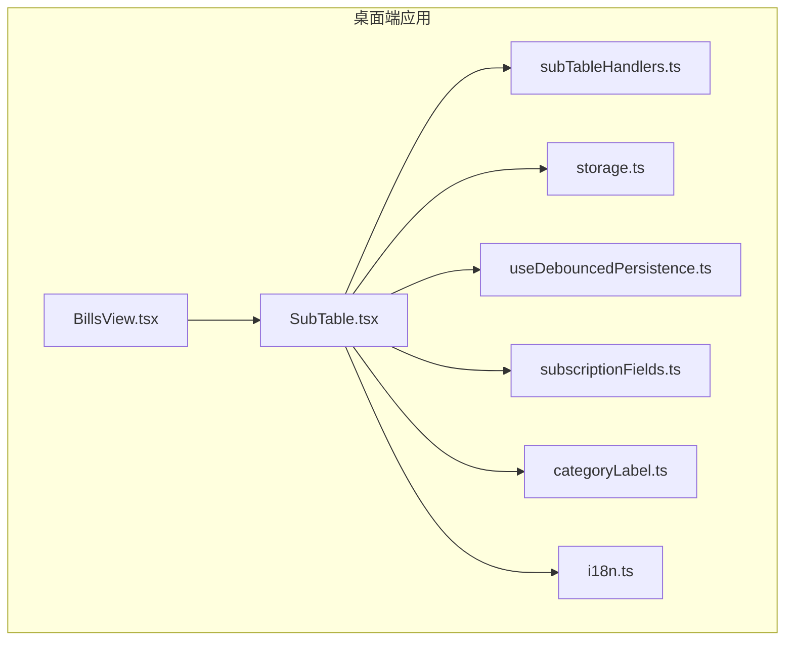
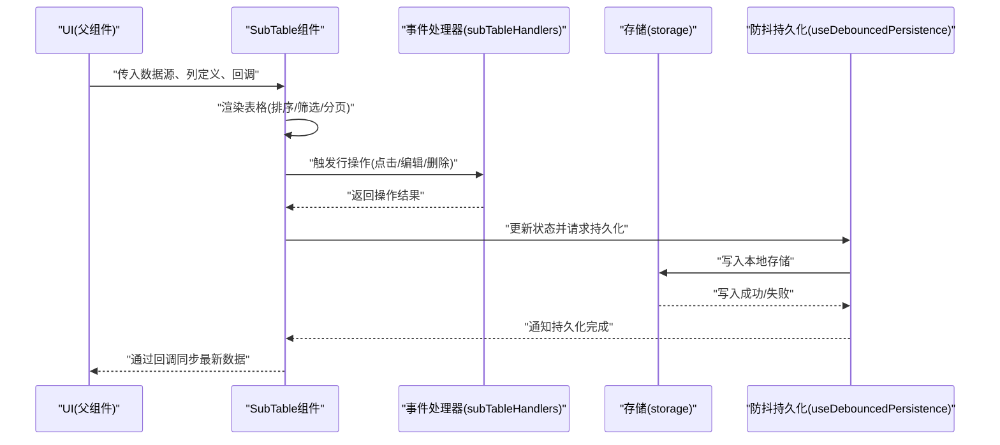
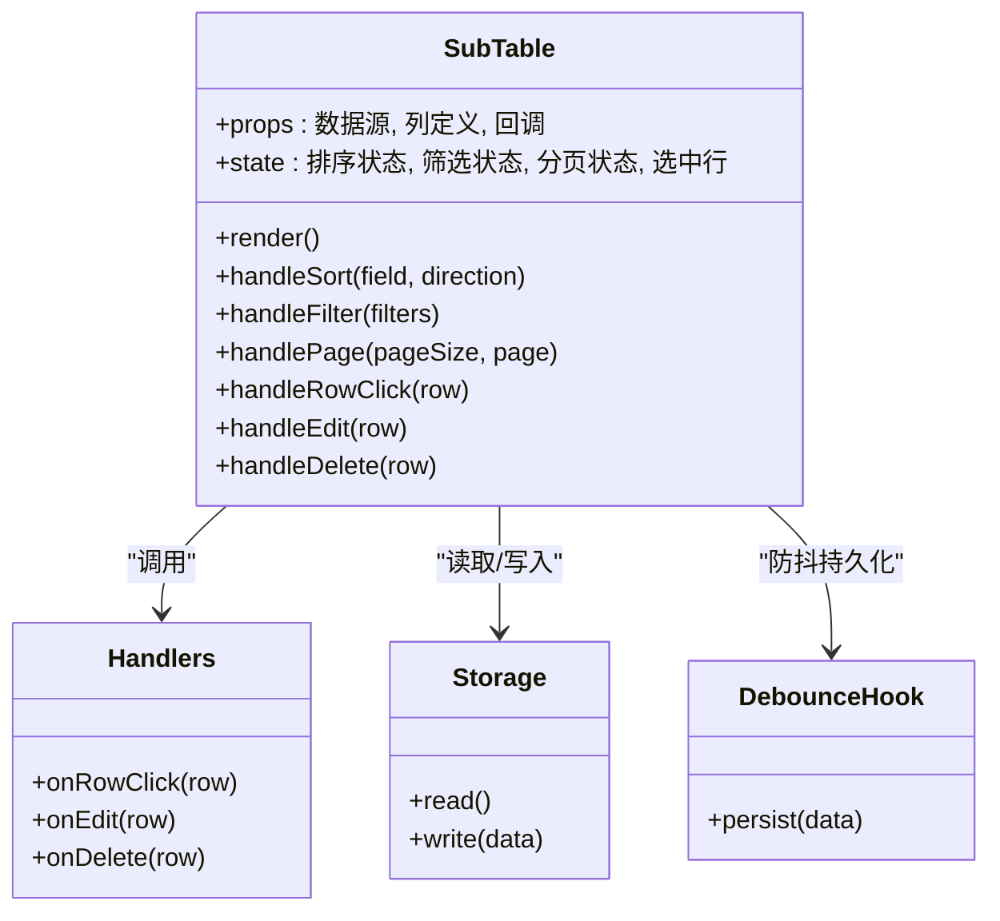
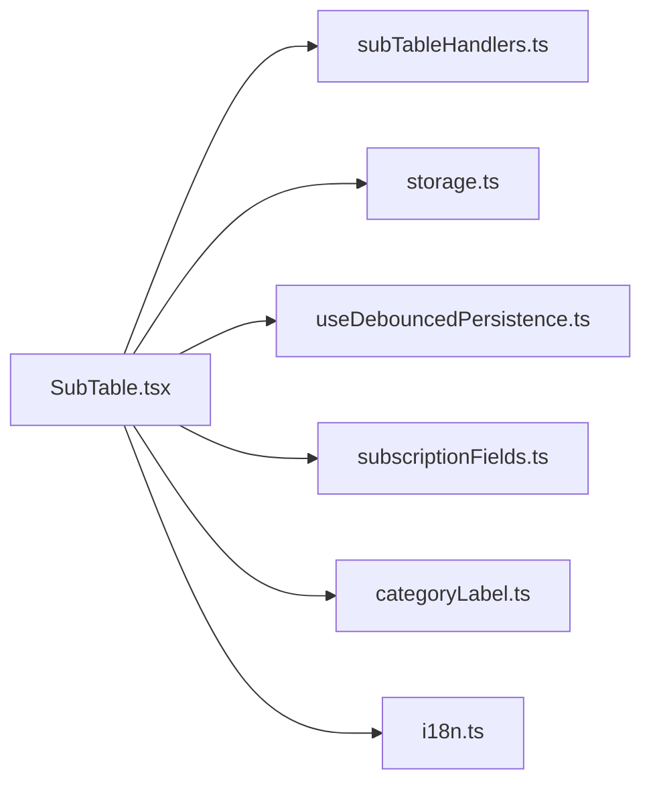

# 表格组件

<cite>
**本文档引用的文件**   
- [SubTable.tsx](file://apps/desktop/src/SubTable.tsx)
- [subTableHandlers.ts](file://apps/desktop/src/subTableHandlers.ts)
- [BillsView.tsx](file://apps/desktop/src/BillsView.tsx)
- [storage.ts](file://apps/desktop/src/storage.ts)
- [useDebouncedPersistence.ts](file://apps/desktop/src/useDebouncedPersistence.ts)
- [subscriptionFields.ts](file://apps/desktop/src/subscriptionFields.ts)
- [categoryLabel.ts](file://apps/desktop/src/categoryLabel.ts)
- [i18n.ts](file://apps/desktop/src/i18n.ts)
</cite>

## 目录
1. [简介](#简介)
2. [项目结构](#项目结构)
3. [核心组件](#核心组件)
4. [架构总览](#架构总览)
5. [详细组件分析](#详细组件分析)
6. [依赖关系分析](#依赖关系分析)
7. [性能考虑](#性能考虑)
8. [故障排查指南](#故障排查指南)
9. [结论](#结论)
10. [附录](#附录)

## 简介
本文件面向“表格组件”的实现与使用，重点围绕 SubTable 子表格组件展开，涵盖数据渲染、排序筛选、分页处理、行操作（点击、编辑、删除等）事件机制，以及定制选项（列定义、样式配置、行为控制）。同时说明表格组件与数据存储的集成方式、性能优化策略，并提供无障碍访问支持与移动端适配的最佳实践。

## 项目结构
桌面端应用位于 apps/desktop，其中与表格相关的核心代码集中在 src 目录下：
- SubTable.tsx：子表格组件实现，负责渲染、交互、状态管理
- subTableHandlers.ts：表格事件处理器（点击、编辑、删除等）
- BillsView.tsx：账单视图，可能包含主表格或作为 SubTable 的使用场景
- storage.ts：本地存储读写封装
- useDebouncedPersistence.ts：防抖持久化 Hook，用于减少频繁写入
- subscriptionFields.ts：订阅字段定义（可用于列定义与表单映射）
- categoryLabel.ts：分类标签转换工具
- i18n.ts：国际化资源

图表来源
- [BillsView.tsx](file://apps/desktop/src/BillsView.tsx)
- [SubTable.tsx](file://apps/desktop/src/SubTable.tsx)
- [subTableHandlers.ts](file://apps/desktop/src/subTableHandlers.ts)
- [storage.ts](file://apps/desktop/src/storage.ts)
- [useDebouncedPersistence.ts](file://apps/desktop/src/useDebouncedPersistence.ts)
- [subscriptionFields.ts](file://apps/desktop/src/subscriptionFields.ts)
- [categoryLabel.ts](file://apps/desktop/src/categoryLabel.ts)
- [i18n.ts](file://apps/desktop/src/i18n.ts)

章节来源
- [SubTable.tsx](file://apps/desktop/src/SubTable.tsx)
- [subTableHandlers.ts](file://apps/desktop/src/subTableHandlers.ts)
- [BillsView.tsx](file://apps/desktop/src/BillsView.tsx)
- [storage.ts](file://apps/desktop/src/storage.ts)
- [useDebouncedPersistence.ts](file://apps/desktop/src/useDebouncedPersistence.ts)
- [subscriptionFields.ts](file://apps/desktop/src/subscriptionFields.ts)
- [categoryLabel.ts](file://apps/desktop/src/categoryLabel.ts)
- [i18n.ts](file://apps/desktop/src/i18n.ts)

## 核心组件
- SubTable 子表格组件
  - 职责：接收数据源与列定义，渲染表格；提供排序、筛选、分页、行操作（点击、编辑、删除）等能力；与存储层对接进行数据持久化。
  - 关键特性：
    - 数据渲染：基于列定义动态渲染单元格内容，支持格式化与条件展示。
    - 排序与筛选：按列升/降序排序；支持文本模糊匹配、数值范围过滤等。
    - 分页处理：支持页大小切换、跳转页码、计算总页数。
    - 行操作：点击行选中/详情；编辑行数据并保存；删除行并确认。
    - 事件机制：通过回调函数将用户交互上报给父组件或处理器模块。
    - 定制选项：列定义（标题、字段、宽度、对齐、可排序、可筛选、格式化）、样式配置（主题、斑马纹、悬停高亮）、行为控制（是否可编辑、是否可多选、是否显示操作列）。
    - 无障碍访问：为表格元素添加语义化属性（如 aria-label、aria-sort、role="grid"），键盘导航支持（方向键移动、回车编辑、Esc 取消）。
    - 移动端适配：响应式布局、横向滚动、触摸友好的按钮尺寸与间距。

章节来源
- [SubTable.tsx](file://apps/desktop/src/SubTable.tsx)
- [subTableHandlers.ts](file://apps/desktop/src/subTableHandlers.ts)

## 架构总览
SubTable 组件采用“数据驱动 + 事件回调”的模式，与存储层解耦，通过 Hook 和工具函数完成数据持久化与格式化。整体流程如下：

图表来源
- [SubTable.tsx](file://apps/desktop/src/SubTable.tsx)
- [subTableHandlers.ts](file://apps/desktop/src/subTableHandlers.ts)
- [storage.ts](file://apps/desktop/src/storage.ts)
- [useDebouncedPersistence.ts](file://apps/desktop/src/useDebouncedPersistence.ts)

## 详细组件分析

### SubTable 子表格组件
- 数据渲染
  - 根据列定义生成表头与单元格，支持自定义渲染函数与格式化器。
  - 对空数据与加载态进行处理，提供占位提示。
- 排序与筛选
  - 单列或多列排序，维护排序状态（字段、方向）。
  - 筛选器类型包括文本输入、下拉选择、日期范围等，支持组合条件。
- 分页处理
  - 维护当前页码与页大小，计算切片数据，支持跳转到指定页。
- 行操作
  - 点击行：选中/展开详情。
  - 编辑行：进入编辑模式，校验后保存。
  - 删除行：二次确认后删除。
- 事件机制
  - 对外暴露 onRowClick、onEdit、onDelete、onSortChange、onFilterChange、onPageChange 等回调。
  - 内部通过 subTableHandlers 统一处理业务逻辑，避免在组件内耦合过多逻辑。
- 定制选项
  - 列定义：字段名、标题、宽度、对齐方式、是否可排序、是否可筛选、格式化函数、渲染函数。
  - 样式配置：主题色、斑马纹、悬停效果、边框样式、单元格内边距。
  - 行为控制：是否启用编辑、是否启用多选、是否显示操作列、是否固定列。
- 无障碍访问
  - 表格容器 role="grid"，表头 role="columnheader"，单元格 role="gridcell"。
  - 排序列设置 aria-sort="ascending/descending/none"。
  - 键盘导航：方向键移动焦点，Enter 编辑，Esc 取消，Tab 顺序合理。
- 移动端适配
  - 小屏幕下隐藏次要列，启用横向滚动；增大点击区域；简化筛选面板。

图表来源
- [SubTable.tsx](file://apps/desktop/src/SubTable.tsx)
- [subTableHandlers.ts](file://apps/desktop/src/subTableHandlers.ts)
- [storage.ts](file://apps/desktop/src/storage.ts)
- [useDebouncedPersistence.ts](file://apps/desktop/src/useDebouncedPersistence.ts)

章节来源
- [SubTable.tsx](file://apps/desktop/src/SubTable.tsx)
- [subTableHandlers.ts](file://apps/desktop/src/subTableHandlers.ts)

### 事件处理器（subTableHandlers.ts）
- 职责：集中处理表格行操作的业务逻辑，如打开编辑弹窗、执行删除、调用存储接口等。
- 设计要点：
  - 单一职责：每个操作对应一个处理器函数，便于测试与维护。
  - 错误处理：捕获异常并向上抛出或记录日志。
  - 副作用隔离：与 UI 状态解耦，仅处理数据与副作用。

章节来源
- [subTableHandlers.ts](file://apps/desktop/src/subTableHandlers.ts)

### 数据视图与集成（BillsView.tsx）
- 职责：作为 SubTable 的使用方，提供数据源与列定义，并处理回调。
- 集成方式：
  - 从 storage 读取数据，转换为表格所需格式。
  - 定义列映射（字段到显示名称、格式化规则）。
  - 处理编辑/删除回调，调用存储层更新数据。

章节来源
- [BillsView.tsx](file://apps/desktop/src/BillsView.tsx)

### 存储与持久化（storage.ts、useDebouncedPersistence.ts）
- storage.ts：封装本地存储的读写操作，提供统一的 API。
- useDebouncedPersistence.ts：对频繁的数据变更进行防抖，合并多次写入，降低 I/O 压力。
- 最佳实践：
  - 批量更新时合并数据再写入。
  - 写入失败时重试或回滚。
  - 区分开发/生产环境的存储策略（内存 vs 磁盘）。

章节来源
- [storage.ts](file://apps/desktop/src/storage.ts)
- [useDebouncedPersistence.ts](file://apps/desktop/src/useDebouncedPersistence.ts)

### 列定义与工具（subscriptionFields.ts、categoryLabel.ts、i18n.ts）
- subscriptionFields.ts：定义字段元数据（类型、默认值、验证规则），用于表单与列映射。
- categoryLabel.ts：将分类 ID 转换为可读标签，提升用户体验。
- i18n.ts：多语言资源，支持表格文案国际化。

章节来源
- [subscriptionFields.ts](file://apps/desktop/src/subscriptionFields.ts)
- [categoryLabel.ts](file://apps/desktop/src/categoryLabel.ts)
- [i18n.ts](file://apps/desktop/src/i18n.ts)

## 依赖关系分析
- SubTable 依赖：
  - 事件处理器：处理行操作逻辑
  - 存储层：数据持久化
  - 防抖 Hook：优化写入频率
  - 工具函数：字段定义、标签转换、国际化
- 耦合度：
  - 组件与存储解耦，通过回调与 Hook 间接依赖
  - 事件处理器独立于 UI，便于复用与测试

图表来源
- [SubTable.tsx](file://apps/desktop/src/SubTable.tsx)
- [subTableHandlers.ts](file://apps/desktop/src/subTableHandlers.ts)
- [storage.ts](file://apps/desktop/src/storage.ts)
- [useDebouncedPersistence.ts](file://apps/desktop/src/useDebouncedPersistence.ts)
- [subscriptionFields.ts](file://apps/desktop/src/subscriptionFields.ts)
- [categoryLabel.ts](file://apps/desktop/src/categoryLabel.ts)
- [i18n.ts](file://apps/desktop/src/i18n.ts)

章节来源
- [SubTable.tsx](file://apps/desktop/src/SubTable.tsx)
- [subTableHandlers.ts](file://apps/desktop/src/subTableHandlers.ts)
- [storage.ts](file://apps/desktop/src/storage.ts)
- [useDebouncedPersistence.ts](file://apps/desktop/src/useDebouncedPersistence.ts)
- [subscriptionFields.ts](file://apps/desktop/src/subscriptionFields.ts)
- [categoryLabel.ts](file://apps/desktop/src/categoryLabel.ts)
- [i18n.ts](file://apps/desktop/src/i18n.ts)

## 性能考虑
- 渲染优化
  - 虚拟滚动：大数据量时使用虚拟列表减少 DOM 节点数量。
  - 记忆化：对列渲染函数与格式化器使用 memoization 避免重复计算。
- 排序与筛选
  - 服务端排序与筛选：数据量大时优先在服务端处理，客户端仅做轻量过滤。
  - 增量更新：仅重排受影响行，避免全量重渲染。
- 分页
  - 按需加载：每页数据懒加载，结合预取下一页提升体验。
- 存储写入
  - 防抖与节流：合并多次写入，减少 I/O 次数。
  - 批量提交：将多次变更合并为一次事务性写入。
- 内存管理
  - 及时释放事件监听与定时器。
  - 避免闭包持有大对象引用。

[本节为通用指导，不直接分析具体文件]

## 故障排查指南
- 常见问题
  - 数据未持久化：检查 storage 写入是否成功，确认防抖 Hook 是否正确触发。
  - 排序/筛选无效：确认列定义中是否启用排序/筛选，检查筛选条件拼接逻辑。
  - 行操作无响应：检查事件处理器是否正确绑定，回调参数是否传递正确。
  - 移动端显示异常：检查响应式样式与横向滚动设置。
- 调试建议
  - 在事件处理器中添加日志输出，定位问题阶段。
  - 使用浏览器开发者工具检查网络请求与本地存储。
  - 编写单元测试覆盖关键路径（排序、筛选、分页、编辑、删除）。

章节来源
- [subTableHandlers.ts](file://apps/desktop/src/subTableHandlers.ts)
- [storage.ts](file://apps/desktop/src/storage.ts)
- [useDebouncedPersistence.ts](file://apps/desktop/src/useDebouncedPersistence.ts)

## 结论
SubTable 子表格组件通过清晰的职责划分与模块化设计，实现了数据渲染、排序筛选、分页处理与行操作的完整功能。借助事件处理器与存储层的解耦，组件具备良好的可扩展性与可维护性。配合防抖持久化、虚拟滚动与按需加载等优化策略，可在大数据量场景下保持良好性能。同时，通过无障碍访问与移动端适配的最佳实践，提升了可用性与用户体验。

[本节为总结，不直接分析具体文件]

## 附录
- 定制示例（概念性）
  - 列定义：包含字段名、标题、宽度、对齐、可排序、可筛选、格式化函数。
  - 样式配置：主题色、斑马纹、悬停高亮、边框样式。
  - 行为控制：是否可编辑、是否可多选、是否显示操作列。
- 无障碍访问清单
  - 语义化属性：role、aria-label、aria-sort。
  - 键盘导航：方向键、回车、Esc、Tab。
- 移动端适配清单
  - 响应式布局、横向滚动、触摸友好按钮尺寸。

[本节为补充信息，不直接分析具体文件]