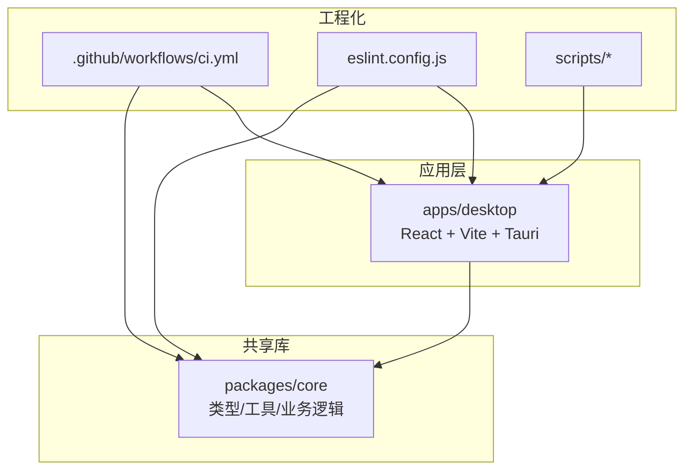
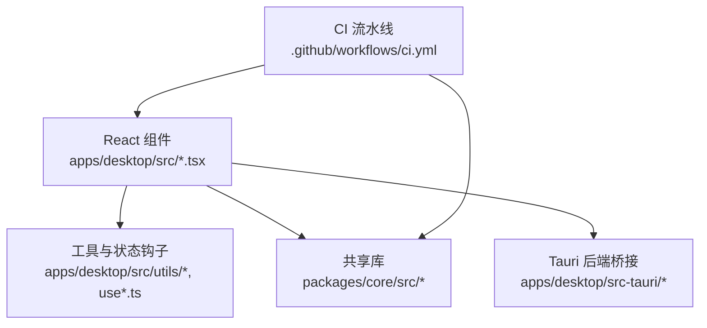
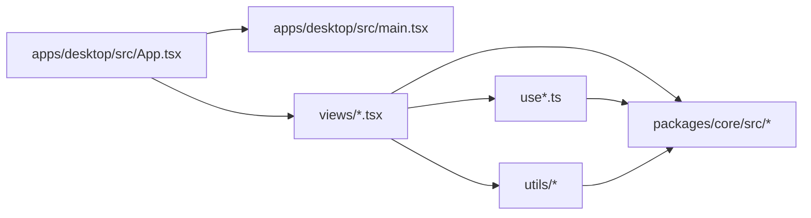

# 代码规范

<cite>
**本文引用的文件**   
- [eslint.config.js](file://eslint.config.js)
- [package.json](file://package.json)
- [apps/desktop/package.json](file://apps/desktop/package.json)
- [packages/core/package.json](file://packages/core/package.json)
- [apps/desktop/tsconfig.json](file://apps/desktop/tsconfig.json)
- [packages/core/tsconfig.json](file://packages/core/tsconfig.json)
- [apps/desktop/vite.config.ts](file://apps/desktop/vite.config.ts)
- [apps/desktop/src/main.tsx](file://apps/desktop/src/main.tsx)
- [apps/desktop/src/App.tsx](file://apps/desktop/src/App.tsx)
- [apps/desktop/src/i18n.ts](file://apps/desktop/src/i18n.ts)
- [apps/desktop/src/theme.ts](file://apps/desktop/src/theme.ts)
- [apps/desktop/src/storage.ts](file://apps/desktop/src/storage.ts)
- [apps/desktop/src/utils/dateUtils.ts](file://apps/desktop/src/utils/dateUtils.ts)
- [apps/desktop/src/ui/Icon.tsx](file://apps/desktop/src/ui/Icon.tsx)
- [apps/desktop/src/ui/ModalShell.tsx](file://apps/desktop/src/ui/ModalShell.tsx)
- [apps/desktop/src/BillFormModal.tsx](file://apps/desktop/src/BillFormModal.tsx)
- [apps/desktop/src/BillsView.tsx](file://apps/desktop/src/BillsView.tsx)
- [apps/desktop/src/Dashboard.tsx](file://apps/desktop/src/Dashboard.tsx)
- [apps/desktop/src/PendingView.tsx](file://apps/desktop/src/PendingView.tsx)
- [apps/desktop/src/StatsView.tsx](file://apps/desktop/src/StatsView.tsx)
- [apps/desktop/src/SubTable.tsx](file://apps/desktop/src/SubTable.tsx)
- [apps/desktop/src/subscriptionFields.ts](file://apps/desktop/src/subscriptionFields.ts)
- [apps/desktop/src/subTableHandlers.ts](file://apps/desktop/src/subTableHandlers.ts)
- [apps/desktop/src/categoryLabel.ts](file://apps/desktop/src/categoryLabel.ts)
- [apps/desktop/src/useDebouncedPersistence.ts](file://apps/desktop/src/useDebouncedPersistence.ts)
- [apps/desktop/src/useRenewReminders.ts](file://apps/desktop/src/useRenewReminders.ts)
- [packages/core/src/index.ts](file://packages/core/src/index.ts)
- [packages/core/src/types.ts](file://packages/core/src/types.ts)
- [packages/core/src/actions.ts](file://packages/core/src/actions.ts)
- [packages/core/src/rules.ts](file://packages/core/src/rules.ts)
- [packages/core/src/money.ts](file://packages/core/src/money.ts)
- [packages/core/src/dates.ts](file://packages/core/src/dates.ts)
- [packages/core/src/stats.ts](file://packages/core/src/stats.ts)
- [packages/core/src/views.ts](file://packages/core/src/views.ts)
- [packages/core/src/defaults.ts](file://packages/core/src/defaults.ts)
- [packages/core/src/ids.ts](file://packages/core/src/ids.ts)
- [packages/core/src/load.ts](file://packages/core/src/load.ts)
- [packages/core/src/normalize.ts](file://packages/core/src/normalize.ts)
- [packages/core/src/paste.ts](file://packages/core/src/paste.ts)
- [packages/core/src/analytics.ts](file://packages/core/src/analytics.ts)
</cite>

## 目录
1. [简介](#简介)
2. [项目结构](#项目结构)
3. [核心组件](#核心组件)
4. [架构总览](#架构总览)
5. [详细组件分析](#详细组件分析)
6. [依赖关系分析](#依赖关系分析)
7. [性能考量](#性能考量)
8. [故障排查指南](#故障排查指南)
9. [结论](#结论)
10. [附录](#附录)

## 简介
本规范文档面向本项目的前端与共享库开发，目标是为团队提供统一、可执行的编码约定与质量保障流程。内容覆盖：
- ESLint 规则配置与自定义规则建议
- TypeScript 编码约定与类型定义最佳实践
- React 组件命名规范与文件组织方式
- 代码格式化与 Prettier 配置建议
- 导入导出规范、注释约定与错误处理模式
- 代码审查检查清单与质量保证流程（CI）

本规范以仓库现有配置与实践为依据，结合通用工程化最佳实践进行系统化整理，确保新成员快速上手并保持一致性。

## 项目结构
本项目采用多包（monorepo）结构，包含桌面应用与共享核心库：
- apps/desktop：基于 Tauri + Vite + React 的桌面客户端
- packages/core：跨平台共享逻辑与类型定义
- scripts：构建与签名脚本
- docs：产品与设计文档

图表来源
- [apps/desktop/package.json](file://apps/desktop/package.json)
- [packages/core/package.json](file://packages/core/package.json)
- [.github/workflows/ci.yml](file://.github/workflows/ci.yml)
- [eslint.config.js](file://eslint.config.js)

章节来源
- [apps/desktop/package.json](file://apps/desktop/package.json)
- [packages/core/package.json](file://packages/core/package.json)
- [.github/workflows/ci.yml](file://.github/workflows/ci.yml)

## 核心组件
- ESLint 配置位于根目录 eslint.config.js，用于统一静态检查规则与插件集成。
- TypeScript 配置分别位于各包的 tsconfig.json，保证编译选项一致性与模块解析策略。
- Vite 构建配置位于 apps/desktop/vite.config.ts，控制前端构建与插件链。
- 共享库 packages/core 暴露类型、工具函数与业务逻辑，供桌面应用消费。

章节来源
- [eslint.config.js](file://eslint.config.js)
- [apps/desktop/tsconfig.json](file://apps/desktop/tsconfig.json)
- [packages/core/tsconfig.json](file://packages/core/tsconfig.json)
- [apps/desktop/vite.config.ts](file://apps/desktop/vite.config.ts)
- [packages/core/src/index.ts](file://packages/core/src/index.ts)

## 架构总览
整体架构遵循“应用层 + 共享库”的分层设计：
- 应用层负责 UI 渲染、用户交互与本地持久化
- 共享库封装领域模型、计算逻辑与数据转换
- 工程化通过 ESLint、Vitest、Tauri 构建与 CI 流水线保障质量

图表来源
- [apps/desktop/src/main.tsx](file://apps/desktop/src/main.tsx)
- [apps/desktop/src/App.tsx](file://apps/desktop/src/App.tsx)
- [packages/core/src/index.ts](file://packages/core/src/index.ts)
- [.github/workflows/ci.yml](file://.github/workflows/ci.yml)

## 详细组件分析

### ESLint 规则与自定义规则
- 根级 eslint.config.js 集中管理规则集与插件，建议：
  - 启用 TypeScript 与 React 生态插件，确保 TSX 与 JSX 语法正确性
  - 统一 import 顺序与路径别名解析，避免循环依赖
  - 禁止未使用的变量与死代码，提升可读性
  - 对异步操作与错误边界进行约束，减少运行时异常
- 自定义规则建议：
  - 强制组件文件命名与导出一致性
  - 限制在共享库中引入 UI 相关依赖
  - 校验 i18n 键值存在性

章节来源
- [eslint.config.js](file://eslint.config.js)

### TypeScript 编码约定与类型定义最佳实践
- 使用严格模式与精确类型推断，避免 any；必要时使用 unknown 配合守卫
- 公共 API 优先使用接口与类型别名，保持向后兼容
- 枚举与字面量联合类型用于状态与常量表达
- 泛型用于可复用数据结构与函数，提高类型安全
- 在 packages/core 中集中定义领域类型，并在应用层按需引用

章节来源
- [packages/core/src/types.ts](file://packages/core/src/types.ts)
- [packages/core/src/index.ts](file://packages/core/src/index.ts)
- [apps/desktop/tsconfig.json](file://apps/desktop/tsconfig.json)
- [packages/core/tsconfig.json](file://packages/core/tsconfig.json)

### React 组件命名规范与文件组织
- 组件文件以 PascalCase 命名，如 SubscriptionFormModal.tsx、BillsView.tsx
- 单一职责：每个组件聚焦一个功能域，复杂页面拆分为子组件
- 组合优于继承：通过 props 与 hooks 组合行为
- 文件组织：UI 组件放在 ui/，视图放在根或按功能分目录，工具与状态钩子放在 utils/ 与 src 根目录
- 导出规范：默认导出组件，具名导出辅助函数与常量

章节来源
- [apps/desktop/src/ui/Icon.tsx](file://apps/desktop/src/ui/Icon.tsx)
- [apps/desktop/src/ui/ModalShell.tsx](file://apps/desktop/src/ui/ModalShell.tsx)
- [apps/desktop/src/BillFormModal.tsx](file://apps/desktop/src/BillFormModal.tsx)
- [apps/desktop/src/BillsView.tsx](file://apps/desktop/src/BillsView.tsx)
- [apps/desktop/src/Dashboard.tsx](file://apps/desktop/src/Dashboard.tsx)
- [apps/desktop/src/PendingView.tsx](file://apps/desktop/src/PendingView.tsx)
- [apps/desktop/src/StatsView.tsx](file://apps/desktop/src/StatsView.tsx)
- [apps/desktop/src/SubTable.tsx](file://apps/desktop/src/SubTable.tsx)

### 代码格式化与 Prettier 配置
- 建议在 monorepo 根目录统一 Prettier 配置，确保所有包一致
- 与 ESLint 集成，避免格式冲突
- 常用约定：单引号、尾逗号、行宽 120、对象属性紧凑排版等

章节来源
- [eslint.config.js](file://eslint.config.js)

### 导入导出规范
- 统一使用路径别名（如 @/ 或包名），避免相对路径混乱
- 按功能分组导入，第三方库在前、内部模块在后
- 避免循环依赖：将共享逻辑下沉到 packages/core
- 对外暴露最小 API，隐藏实现细节

章节来源
- [apps/desktop/src/main.tsx](file://apps/desktop/src/main.tsx)
- [apps/desktop/src/App.tsx](file://apps/desktop/src/App.tsx)
- [packages/core/src/index.ts](file://packages/core/src/index.ts)

### 注释约定
- 公共函数与类型需添加 JSDoc 说明，描述参数、返回值与副作用
- 复杂业务逻辑添加行内注释解释意图
- 避免冗余注释，注释应解释“为什么”，而非“是什么”

章节来源
- [packages/core/src/money.ts](file://packages/core/src/money.ts)
- [packages/core/src/dates.ts](file://packages/core/src/dates.ts)
- [apps/desktop/src/utils/dateUtils.ts](file://apps/desktop/src/utils/dateUtils.ts)

### 错误处理模式
- 统一错误类型与错误码，便于追踪与上报
- 异步操作使用 try/catch 包裹，失败时降级或提示用户
- 在 UI 层展示友好错误信息，避免泄露敏感信息
- 关键路径增加日志埋点，便于问题定位

章节来源
- [apps/desktop/src/storage.ts](file://apps/desktop/src/storage.ts)
- [apps/desktop/src/useDebouncedPersistence.ts](file://apps/desktop/src/useDebouncedPersistence.ts)
- [packages/core/src/load.ts](file://packages/core/src/load.ts)

### 国际化与主题
- i18n 键值集中管理，避免硬编码文案
- 主题配置集中，支持明暗模式切换

章节来源
- [apps/desktop/src/i18n.ts](file://apps/desktop/src/i18n.ts)
- [apps/desktop/src/theme.ts](file://apps/desktop/src/theme.ts)

### 表单与数据处理
- 表单字段定义与校验分离，便于复用与维护
- 表格数据处理使用纯函数，避免副作用
- 防抖与节流用于高频更新场景，提升性能

章节来源
- [apps/desktop/src/subscriptionFields.ts](file://apps/desktop/src/subscriptionFields.ts)
- [apps/desktop/src/subTableHandlers.ts](file://apps/desktop/src/subTableHandlers.ts)
- [apps/desktop/src/categoryLabel.ts](file://apps/desktop/src/categoryLabel.ts)
- [apps/desktop/src/useDebouncedPersistence.ts](file://apps/desktop/src/useDebouncedPersistence.ts)

### 共享库核心逻辑
- 类型与常量集中在 types.ts 与 defaults.ts
- 业务规则与计算逻辑在 rules.ts、stats.ts、money.ts、dates.ts
- 数据加载与转换在 load.ts、normalize.ts、paste.ts
- 分析埋点在 analytics.ts

章节来源
- [packages/core/src/types.ts](file://packages/core/src/types.ts)
- [packages/core/src/defaults.ts](file://packages/core/src/defaults.ts)
- [packages/core/src/rules.ts](file://packages/core/src/rules.ts)
- [packages/core/src/stats.ts](file://packages/core/src/stats.ts)
- [packages/core/src/money.ts](file://packages/core/src/money.ts)
- [packages/core/src/dates.ts](file://packages/core/src/dates.ts)
- [packages/core/src/load.ts](file://packages/core/src/load.ts)
- [packages/core/src/normalize.ts](file://packages/core/src/normalize.ts)
- [packages/core/src/paste.ts](file://packages/core/src/paste.ts)
- [packages/core/src/analytics.ts](file://packages/core/src/analytics.ts)

## 依赖关系分析
- 应用层依赖共享库，避免反向依赖
- 工具与状态钩子仅依赖共享库与浏览器 API
- 测试与构建工具独立于业务逻辑

图表来源
- [apps/desktop/src/App.tsx](file://apps/desktop/src/App.tsx)
- [apps/desktop/src/main.tsx](file://apps/desktop/src/main.tsx)
- [packages/core/src/index.ts](file://packages/core/src/index.ts)

章节来源
- [apps/desktop/src/App.tsx](file://apps/desktop/src/App.tsx)
- [apps/desktop/src/main.tsx](file://apps/desktop/src/main.tsx)
- [packages/core/src/index.ts](file://packages/core/src/index.ts)

## 性能考量
- 使用 React.memo 与 useMemo/useCallback 优化重渲染
- 大列表虚拟化渲染，避免一次性加载过多节点
- 防抖与节流用于输入与滚动事件
- 懒加载路由与组件，减少首屏体积
- 共享库保持无副作用，便于缓存与并行执行

[本节为通用指导，不直接分析具体文件]

## 故障排查指南
- 常见问题：
  - 类型错误：检查 tsconfig 严格模式与类型定义是否完整
  - 导入错误：确认路径别名与模块导出是否正确
  - 运行时错误：查看控制台与日志，定位异步失败路径
  - 构建失败：检查依赖版本与插件兼容性
- 调试建议：
  - 使用断点与日志输出关键状态
  - 缩小复现场景，逐步隔离问题
  - 利用 Vitest 编写单元测试验证逻辑

章节来源
- [apps/desktop/vite.config.ts](file://apps/desktop/vite.config.ts)
- [apps/desktop/tsconfig.json](file://apps/desktop/tsconfig.json)
- [packages/core/tsconfig.json](file://packages/core/tsconfig.json)

## 结论
本规范通过统一的 ESLint、TypeScript、React 与格式化约定，结合清晰的模块划分与错误处理模式，为项目提供了稳定的工程质量基线。建议在新功能开发中严格遵循本规范，并通过 CI 自动化检查确保一致性。

[本节为总结性内容，不直接分析具体文件]

## 附录

### 代码审查检查清单
- 类型定义是否完整且无 any
- 组件命名是否符合 PascalCase 与单一职责
- 导入顺序与路径别名是否规范
- 错误处理是否完善，用户反馈是否友好
- 是否有不必要的副作用或全局状态
- 是否添加了必要的注释与文档
- 测试覆盖率是否满足要求

[本节为通用指导，不直接分析具体文件]

### 质量保证流程（CI）
- 安装依赖与构建
- 运行 ESLint 与类型检查
- 执行单元测试与集成测试
- 生成产物并打包

章节来源
- [.github/workflows/ci.yml](file://.github/workflows/ci.yml)