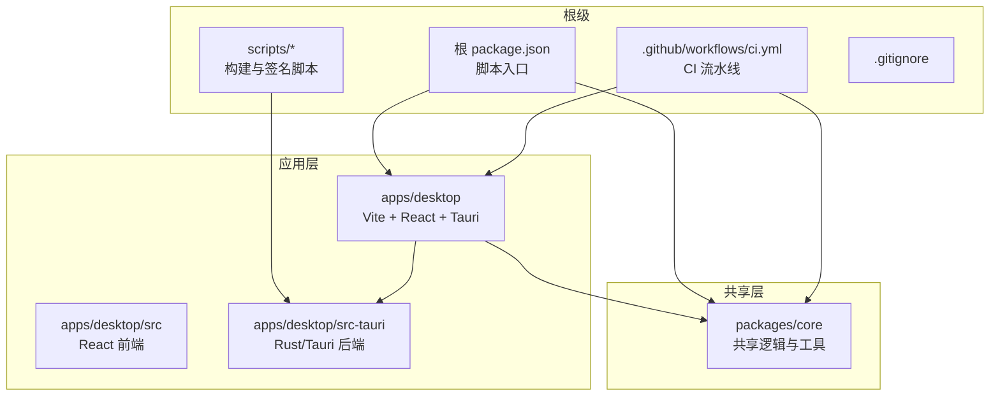
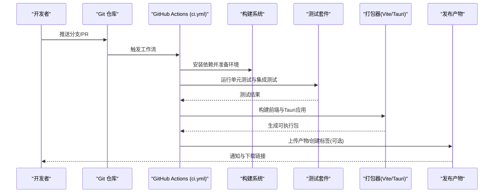
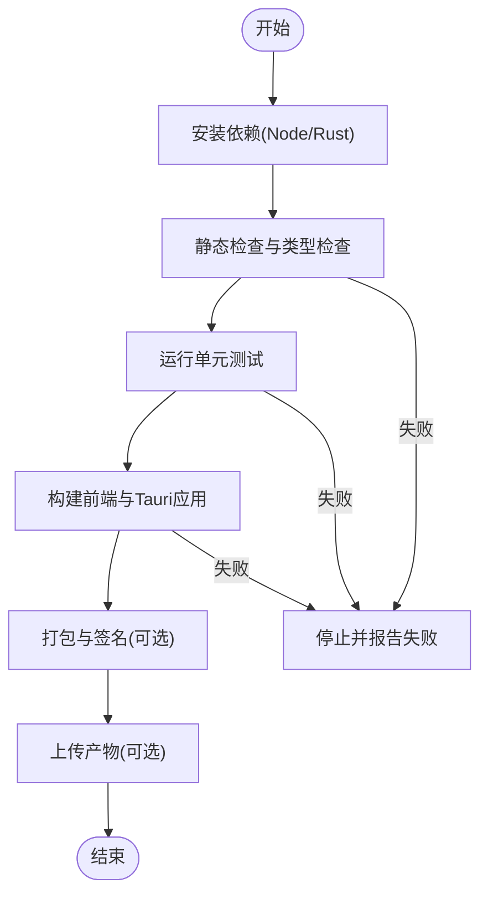
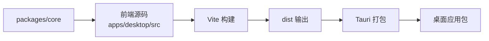
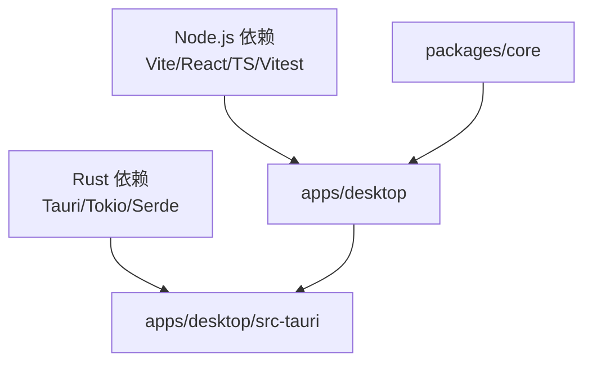

# 开发工作流

<cite>
**本文引用的文件**   
- [ci.yml](file://.github/workflows/ci.yml)
- [package.json](file://package.json)
- [apps/desktop/package.json](file://apps/desktop/package.json)
- [apps/desktop/vite.config.ts](file://apps/desktop/vite.config.ts)
- [apps/desktop/vitest.config.ts](file://apps/desktop/vitest.config.ts)
- [apps/desktop/tsconfig.json](file://apps/desktop/tsconfig.json)
- [apps/desktop/src/main.tsx](file://apps/desktop/src/main.tsx)
- [apps/desktop/src-tauri/Cargo.toml](file://apps/desktop/src-tauri/Cargo.toml)
- [apps/desktop/src-tauri/tauri.conf.json](file://apps/desktop/src-tauri/tauri.conf.json)
- [apps/desktop/src-tauri/build.rs](file://apps/desktop/src-tauri/build.rs)
- [packages/core/package.json](file://packages/core/package.json)
- [packages/core/vitest.config.ts](file://packages/core/vitest.config.ts)
- [scripts/sign-macos-app.sh](file://scripts/sign-macos-app.sh)
- [.gitignore](file://.gitignore)
</cite>

## 目录
1. [简介](#简介)
2. [项目结构](#项目结构)
3. [核心组件](#核心组件)
4. [架构总览](#架构总览)
5. [详细组件分析](#详细组件分析)
6. [依赖分析](#依赖分析)
7. [性能考虑](#性能考虑)
8. [故障排查指南](#故障排查指南)
9. [结论](#结论)
10. [附录](#附录)

## 简介
本文件面向开发者，系统化说明本仓库的开发工作流，包括：
- Git 分支管理策略与提交信息规范
- CI/CD 流水线配置与自动化测试流程
- 代码构建与打包（前端、Tauri/Rust）
- 版本发布流程与标签管理
- 本地开发调试技巧与性能分析方法
- 常见问题诊断与排障指引

目标是让新加入的开发者快速上手，并在日常迭代中保持高质量与一致性。

## 项目结构
本项目采用多包（monorepo）组织方式，包含桌面端应用（Tauri + React/Vite）、共享核心库以及文档与脚本等。关键目录职责如下：
- apps/desktop：桌面端应用（Vite + React + Tauri），含前端源码与 Rust/Tauri 后端
- packages/core：跨平台共享逻辑与工具库
- .github/workflows：CI 流水线定义
- scripts：构建与签名辅助脚本
- docs：产品与部署文档

图表来源
- [package.json](file://package.json)
- [ci.yml](file://.github/workflows/ci.yml)
- [apps/desktop/package.json](file://apps/desktop/package.json)
- [apps/desktop/src/main.tsx](file://apps/desktop/src/main.tsx)
- [apps/desktop/src-tauri/Cargo.toml](file://apps/desktop/src-tauri/Cargo.toml)
- [packages/core/package.json](file://packages/core/package.json)

章节来源
- [package.json](file://package.json)
- [apps/desktop/package.json](file://apps/desktop/package.json)
- [packages/core/package.json](file://packages/core/package.json)
- [apps/desktop/src/main.tsx](file://apps/desktop/src/main.tsx)
- [apps/desktop/src-tauri/Cargo.toml](file://apps/desktop/src-tauri/Cargo.toml)

## 核心组件
- 前端工程化（Vite + React + TypeScript）
  - 构建与开发服务器由 Vite 驱动，配置文件位于 apps/desktop/vite.config.ts
  - 单元测试使用 Vitest，配置文件位于 apps/desktop/vitest.config.ts 与 packages/core/vitest.config.ts
- Tauri 桌面应用（Rust + Web 前端）
  - Tauri 配置位于 apps/desktop/src-tauri/tauri.conf.json
  - Rust 后端入口与模块在 apps/desktop/src-tauri/src 下，Cargo 清单为 Cargo.toml
  - 构建钩子 build.rs 用于生成类型或资源
- 共享核心库（packages/core）
  - 提供领域逻辑、工具函数与类型定义，供桌面端引用

章节来源
- [apps/desktop/vite.config.ts](file://apps/desktop/vite.config.ts)
- [apps/desktop/vitest.config.ts](file://apps/desktop/vitest.config.ts)
- [apps/desktop/src-tauri/tauri.conf.json](file://apps/desktop/src-tauri/tauri.conf.json)
- [apps/desktop/src-tauri/Cargo.toml](file://apps/desktop/src-tauri/Cargo.toml)
- [apps/desktop/src-tauri/build.rs](file://apps/desktop/src-tauri/build.rs)
- [packages/core/vitest.config.ts](file://packages/core/vitest.config.ts)

## 架构总览
下图展示从代码提交到构建、测试、打包与发布的端到端流程，涵盖前端、Tauri 后端与共享库。

图表来源
- [ci.yml](file://.github/workflows/ci.yml)
- [apps/desktop/vite.config.ts](file://apps/desktop/vite.config.ts)
- [apps/desktop/src-tauri/tauri.conf.json](file://apps/desktop/src-tauri/tauri.conf.json)
- [apps/desktop/src-tauri/Cargo.toml](file://apps/desktop/src-tauri/Cargo.toml)

## 详细组件分析

### Git 分支管理与提交信息规范
- 分支模型建议
  - main：稳定主线，仅接受通过 CI 的合并
  - develop：集成开发分支，日常功能在此汇聚
  - feature/*：功能分支，按“feature/模块名”命名
  - fix/*：缺陷修复分支
  - release/*：预发布分支，冻结变更并进行回归测试
  - hotfix/*：紧急修复分支，直接基于 main
- 提交信息规范（Conventional Commits）
  - 格式：type(scope): subject
  - 常用 type：feat、fix、docs、style、refactor、test、chore、perf、build、ci
  - 示例：feat(desktop): 新增订阅提醒弹窗；fix(core): 修正金额计算精度问题
- 分支保护与 PR 要求
  - main 分支启用保护规则，至少 1 人审查并通过 CI
  - PR 标题遵循提交信息规范，描述变更影响与测试覆盖

章节来源
- [.gitignore](file://.gitignore)

### CI/CD 流水线与自动化测试
- 触发条件
  - push 到受保护分支（如 main、develop）与所有 PR
- 主要阶段
  - 安装依赖：Node.js 与 Rust 工具链准备
  - 静态检查：ESLint 与 TypeScript 编译检查
  - 单元测试：Vitest 运行 apps/desktop 与 packages/core 测试
  - 构建：Vite 构建前端资源，Tauri 构建 Rust 后端与打包
  - 产物归档：将构建产物上传至 GitHub Actions Artifacts（可选）
- 缓存与加速
  - 缓存 node_modules 与 Cargo 依赖以提升速度
- 失败处理
  - 任一阶段失败即中断流水线，阻止合并

图表来源
- [ci.yml](file://.github/workflows/ci.yml)

章节来源
- [ci.yml](file://.github/workflows/ci.yml)

### 代码构建与打包配置
- 前端构建（Vite）
  - 开发模式：启动本地开发服务器与热重载
  - 生产构建：优化资源、压缩与代码分割
  - 环境变量：通过 Vite 注入，区分开发与生产
- Tauri 打包
  - 前端资源作为 Webview 内容加载
  - Rust 后端暴露命令给前端调用
  - 平台相关配置与图标等资源在 tauri.conf.json 中声明
  - 构建脚本 build.rs 可用于生成类型或嵌入资源
- 共享库构建
  - packages/core 独立构建与测试，供桌面端引用

图表来源
- [apps/desktop/vite.config.ts](file://apps/desktop/vite.config.ts)
- [apps/desktop/src-tauri/tauri.conf.json](file://apps/desktop/src-tauri/tauri.conf.json)
- [apps/desktop/src-tauri/build.rs](file://apps/desktop/src-tauri/build.rs)
- [packages/core/package.json](file://packages/core/package.json)

章节来源
- [apps/desktop/vite.config.ts](file://apps/desktop/vite.config.ts)
- [apps/desktop/src-tauri/tauri.conf.json](file://apps/desktop/src-tauri/tauri.conf.json)
- [apps/desktop/src-tauri/build.rs](file://apps/desktop/src-tauri/build.rs)
- [apps/desktop/src-tauri/Cargo.toml](file://apps/desktop/src-tauri/Cargo.toml)
- [packages/core/package.json](file://packages/core/package.json)

### 版本发布流程与标签管理
- 版本号约定（SemVer）
  - 主版本：破坏性变更
  - 次版本：向后兼容的功能新增
  - 修订号：向后兼容的问题修复
- 发布步骤
  - 在 release/* 分支进行最终验证与回归测试
  - 合并至 main 并打标签 vX.Y.Z
  - CI 根据标签触发发布流程（构建、签名、上传）
- 标签规范
  - 格式：v{major}.{minor}.{patch}
  - 示例：v1.2.3
- 产物分发
  - 桌面安装包与校验和文件上传至发布页
  - 更新日志自动生成（基于提交信息）

章节来源
- [scripts/sign-macos-app.sh](file://scripts/sign-macos-app.sh)

### 本地开发调试技巧与性能分析
- 前端调试
  - 使用浏览器开发者工具进行断点、网络与性能面板分析
  - 利用 Vite 的热重载快速验证 UI 改动
- Tauri 调试
  - 使用 Rust 调试器（如 VS Code + rust-analyzer）调试后端逻辑
  - 查看 Tauri 控制台输出定位前后端交互问题
- 性能分析
  - 前端：Performance 面板、内存快照、Lighthouse
  - Rust：cargo flamegraph 或 perf 工具分析热点
- 测试与覆盖率
  - 运行 Vitest 并生成覆盖率报告，确保关键路径覆盖

章节来源
- [apps/desktop/vitest.config.ts](file://apps/desktop/vitest.config.ts)
- [packages/core/vitest.config.ts](file://packages/core/vitest.config.ts)

## 依赖分析
- 外部依赖
  - Node.js 生态：Vite、React、TypeScript、Vitest、ESLint
  - Rust 生态：Tauri、Tokio、serde 等
- 内部依赖
  - apps/desktop 依赖 packages/core
  - CI 依赖 Node.js 与 Rust 工具链
- 潜在风险
  - 依赖版本锁定需定期审计
  - 避免循环依赖，保持模块内聚

图表来源
- [apps/desktop/package.json](file://apps/desktop/package.json)
- [apps/desktop/src-tauri/Cargo.toml](file://apps/desktop/src-tauri/Cargo.toml)
- [packages/core/package.json](file://packages/core/package.json)

章节来源
- [apps/desktop/package.json](file://apps/desktop/package.json)
- [apps/desktop/src-tauri/Cargo.toml](file://apps/desktop/src-tauri/Cargo.toml)
- [packages/core/package.json](file://packages/core/package.json)

## 性能考虑
- 构建优化
  - 启用 Vite 的代码分割与资源压缩
  - 缓存 Node 与 Cargo 依赖以缩短 CI 时间
- 运行时优化
  - 前端：懒加载路由与组件，减少首屏体积
  - Rust：异步 I/O 与高效序列化，避免阻塞事件循环
- 监控与分析
  - 引入性能埋点与错误上报，持续跟踪用户体验

[本节为通用指导，不直接分析具体文件]

## 故障排查指南
- 常见构建问题
  - 依赖缺失：清理缓存并重新安装
  - 版本冲突：锁定依赖版本并升级工具链
- 测试失败
  - 检查测试环境与数据初始化
  - 使用 Vitest 的 --reporter=verbose 查看详细输出
- Tauri 打包失败
  - 确认 Rust 工具链与目标平台正确
  - 检查 tauri.conf.json 中的资源路径与权限
- 性能瓶颈
  - 使用浏览器与 Rust 性能工具定位热点
  - 优化渲染与 I/O 操作

章节来源
- [apps/desktop/vitest.config.ts](file://apps/desktop/vitest.config.ts)
- [apps/desktop/src-tauri/tauri.conf.json](file://apps/desktop/src-tauri/tauri.conf.json)

## 结论
通过规范的分支管理、严格的提交信息、自动化的 CI/CD 与完善的构建打包流程，本项目实现了高效的开发与交付。结合本地调试技巧与性能分析方法，团队能够快速定位问题并持续优化用户体验。建议在后续迭代中持续完善监控与告警机制，进一步提升稳定性与可维护性。

[本节为总结，不直接分析具体文件]

## 附录
- 术语表
  - Monorepo：多包仓库，统一管理多个子项目
  - SemVer：语义化版本控制
  - Tauri：基于 Rust 的桌面应用框架
- 参考文档
  - 产品文档与部署指南位于 docs 目录
  - 脚本与签名流程见 scripts 目录

[本节为补充信息，不直接分析具体文件]