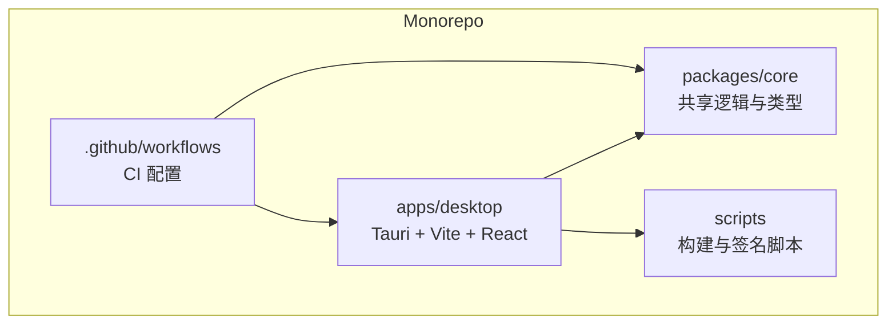
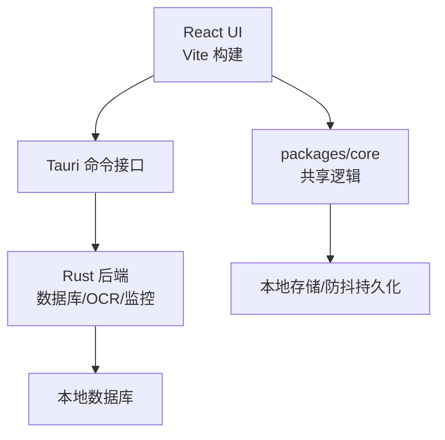
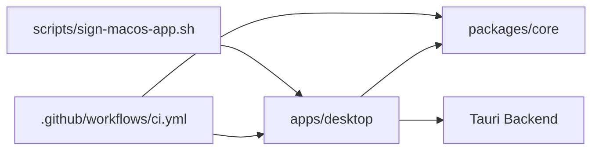

# 开发指南

<cite>
**本文引用的文件**   
- [package.json](file://package.json)
- [eslint.config.js](file://eslint.config.js)
- [apps/desktop/package.json](file://apps/desktop/package.json)
- [apps/desktop/tsconfig.json](file://apps/desktop/tsconfig.json)
- [apps/desktop/tsconfig.node.json](file://apps/desktop/tsconfig.node.json)
- [apps/desktop/vite.config.ts](file://apps/desktop/vite.config.ts)
- [apps/desktop/vitest.config.ts](file://apps/desktop/vitest.config.ts)
- [packages/core/package.json](file://packages/core/package.json)
- [packages/core/tsconfig.json](file://packages/core/tsconfig.json)
- [packages/core/vitest.config.ts](file://packages/core/vitest.config.ts)
- [.github/workflows/ci.yml](file://.github/workflows/ci.yml)
- [apps/desktop/src/main.tsx](file://apps/desktop/src/main.tsx)
- [apps/desktop/src/App.tsx](file://apps/desktop/src/App.tsx)
- [apps/desktop/src/i18n.ts](file://apps/desktop/src/i18n.ts)
- [apps/desktop/src/storage.ts](file://apps/desktop/src/storage.ts)
- [apps/desktop/src/useDebouncedPersistence.ts](file://apps/desktop/src/useDebouncedPersistence.ts)
- [apps/desktop/src-tauri/Cargo.toml](file://apps/desktop/src-tauri/Cargo.toml)
- [apps/desktop/src-tauri/tauri.conf.json](file://apps/desktop/src-tauri/tauri.conf.json)
- [scripts/sign-macos-app.sh](file://scripts/sign-macos-app.sh)
</cite>

## 目录
1. [简介](#简介)
2. [项目结构](#项目结构)
3. [核心组件](#核心组件)
4. [架构总览](#架构总览)
5. [详细组件分析](#详细组件分析)
6. [依赖分析](#依赖分析)
7. [性能考虑](#性能考虑)
8. [故障排查指南](#故障排查指南)
9. [结论](#结论)
10. [附录](#附录)

## 简介
本指南面向希望参与本项目开发的工程师，涵盖以下内容：
- 开发环境搭建与配置要求（Node、Rust/Tauri、包管理器）
- 代码规范与 ESLint 规则说明
- TypeScript 配置与项目结构约定
- Git 工作流与分支管理策略
- 代码审查流程与提交规范
- 性能分析与调试技巧
- 常见问题排查与解决方案

## 项目结构
本项目采用 Monorepo 组织方式，包含桌面端应用、共享核心库以及脚本与文档等。

- apps/desktop：基于 Tauri + Vite + React + TypeScript 的桌面应用前端与后端桥接
- packages/core：跨平台共享逻辑与类型定义
- scripts：构建与签名辅助脚本
- .github/workflows：CI 流水线配置

**图表来源** 
- [apps/desktop/package.json](file://apps/desktop/package.json)
- [packages/core/package.json](file://packages/core/package.json)
- [.github/workflows/ci.yml](file://.github/workflows/ci.yml)

**章节来源**
- [package.json](file://package.json)
- [apps/desktop/package.json](file://apps/desktop/package.json)
- [packages/core/package.json](file://packages/core/package.json)

## 核心组件
- 桌面应用入口与路由：React 应用入口与根组件负责初始化 UI、国际化与状态持久化
- 数据持久化：本地存储与防抖持久化 Hook，保障用户体验与数据安全
- 共享核心库：提供通用工具、类型、统计与导入导出能力
- Tauri 后端：Rust 实现数据库、OCR、监控等原生能力，通过 Tauri 暴露给前端

**章节来源**
- [apps/desktop/src/main.tsx](file://apps/desktop/src/main.tsx)
- [apps/desktop/src/App.tsx](file://apps/desktop/src/App.tsx)
- [apps/desktop/src/i18n.ts](file://apps/desktop/src/i18n.ts)
- [apps/desktop/src/storage.ts](file://apps/desktop/src/storage.ts)
- [apps/desktop/src/useDebouncedPersistence.ts](file://apps/desktop/src/useDebouncedPersistence.ts)
- [packages/core/package.json](file://packages/core/package.json)
- [apps/desktop/src-tauri/Cargo.toml](file://apps/desktop/src-tauri/Cargo.toml)

## 架构总览
整体架构由前端 UI、共享核心库与 Tauri 原生能力组成，通过 Tauri 命令进行前后端通信。

**图表来源** 
- [apps/desktop/src/main.tsx](file://apps/desktop/src/main.tsx)
- [apps/desktop/src/App.tsx](file://apps/desktop/src/App.tsx)
- [apps/desktop/src/storage.ts](file://apps/desktop/src/storage.ts)
- [apps/desktop/src/useDebouncedPersistence.ts](file://apps/desktop/src/useDebouncedPersistence.ts)
- [apps/desktop/src-tauri/Cargo.toml](file://apps/desktop/src-tauri/Cargo.toml)
- [apps/desktop/src-tauri/tauri.conf.json](file://apps/desktop/src-tauri/tauri.conf.json)

## 详细组件分析

### 开发环境与配置要求
- Node.js：建议使用 LTS 版本，确保与包管理器兼容
- Rust 与 Cargo：安装 Rust Toolchain，用于编译 Tauri 后端
- Tauri CLI：用于构建与运行桌面应用
- 包管理器：推荐使用 npm 或 pnpm，保持 lockfile 一致

关键配置文件位置：
- 根级包配置与脚本：[package.json](file://package.json)
- 桌面应用包配置：[apps/desktop/package.json](file://apps/desktop/package.json)
- 核心库包配置：[packages/core/package.json](file://packages/core/package.json)
- Tauri 配置：[apps/desktop/src-tauri/tauri.conf.json](file://apps/desktop/src-tauri/tauri.conf.json)
- Rust 工程配置：[apps/desktop/src-tauri/Cargo.toml](file://apps/desktop/src-tauri/Cargo.toml)

**章节来源**
- [package.json](file://package.json)
- [apps/desktop/package.json](file://apps/desktop/package.json)
- [packages/core/package.json](file://packages/core/package.json)
- [apps/desktop/src-tauri/tauri.conf.json](file://apps/desktop/src-tauri/tauri.conf.json)
- [apps/desktop/src-tauri/Cargo.toml](file://apps/desktop/src-tauri/Cargo.toml)

### 代码规范与 ESLint 规则
- 统一使用 ESLint 进行静态检查与格式化
- 根级 ESLint 配置位于 [eslint.config.js](file://eslint.config.js)，建议在各子项目中继承并扩展
- 推荐在 IDE 中启用 ESLint 插件，保存时自动修复常见错误
- 建议在 CI 中执行 lint 检查，保证代码质量一致性

**章节来源**
- [eslint.config.js](file://eslint.config.js)

### TypeScript 配置与项目结构约定
- 桌面应用 TS 配置：
  - 应用层配置：[apps/desktop/tsconfig.json](file://apps/desktop/tsconfig.json)
  - Node 侧配置：[apps/desktop/tsconfig.node.json](file://apps/desktop/tsconfig.node.json)
- 核心库 TS 配置：[packages/core/tsconfig.json](file://packages/core/tsconfig.json)
- 模块划分约定：
  - UI 组件放在 src/ui
  - 业务视图放在 src 根目录或按功能分目录
  - 工具函数放在 src/utils
  - 国际化与主题放在 src/i18n.ts、src/theme.ts
  - 测试文件与源文件同目录，后缀 .test.ts/.test.tsx

**章节来源**
- [apps/desktop/tsconfig.json](file://apps/desktop/tsconfig.json)
- [apps/desktop/tsconfig.node.json](file://apps/desktop/tsconfig.node.json)
- [packages/core/tsconfig.json](file://packages/core/tsconfig.json)
- [apps/desktop/src/main.tsx](file://apps/desktop/src/main.tsx)
- [apps/desktop/src/App.tsx](file://apps/desktop/src/App.tsx)
- [apps/desktop/src/i18n.ts](file://apps/desktop/src/i18n.ts)

### Git 工作流与分支管理策略
- 主分支保护：main/master 为稳定分支，禁止直接推送
- 功能分支：feature/* 用于新功能开发
- 修复分支：fix/* 用于问题修复
- 发布分支：release/* 用于预发布与版本打包
- 热修复分支：hotfix/* 用于紧急修复
- 提交前检查：在 pre-commit 或 CI 中执行 lint 与测试

CI 流水线参考：
- GitHub Actions 配置：[.github/workflows/ci.yml](file://.github/workflows/ci.yml)

**章节来源**
- [.github/workflows/ci.yml](file://.github/workflows/ci.yml)

### 代码审查流程与提交规范
- 提交信息规范：遵循 Conventional Commits（如 feat、fix、docs、refactor、test、chore）
- Pull Request 要求：
  - 描述变更背景与影响范围
  - 附带相关测试用例与截图（如涉及 UI）
  - 通过所有 CI 检查（lint、test、build）
- 审查要点：
  - 代码可读性与可维护性
  - 类型安全与边界条件处理
  - 性能与资源占用
  - 安全性与权限控制（尤其是 Tauri 命令）

**章节来源**
- [.github/workflows/ci.yml](file://.github/workflows/ci.yml)

### 性能分析与调试技巧
- 前端性能：
  - 使用浏览器开发者工具的 Performance 面板分析渲染瓶颈
  - 对重计算逻辑使用 useMemo/useCallback 优化
  - 大列表虚拟化与分页加载
- 数据持久化：
  - 使用防抖持久化 Hook 减少频繁写入：[apps/desktop/src/useDebouncedPersistence.ts](file://apps/desktop/src/useDebouncedPersistence.ts)
  - 合理设计存储结构与索引，避免全表扫描
- Tauri 后端调试：
  - 查看 Rust 日志输出，定位原生层问题
  - 使用 Tauri DevTools 进行前后端联调
- 构建与打包：
  - 使用 Vite 的构建分析插件识别大包体积
  - 按需引入与 Tree Shaking 优化产物大小

**章节来源**
- [apps/desktop/src/useDebouncedPersistence.ts](file://apps/desktop/src/useDebouncedPersistence.ts)
- [apps/desktop/vite.config.ts](file://apps/desktop/vite.config.ts)
- [apps/desktop/src-tauri/Cargo.toml](file://apps/desktop/src-tauri/Cargo.toml)

### 测试策略与运行
- 测试框架：Vitest
- 配置位置：
  - 桌面应用测试配置：[apps/desktop/vitest.config.ts](file://apps/desktop/vitest.config.ts)
  - 核心库测试配置：[packages/core/vitest.config.ts](file://packages/core/vitest.config.ts)
- 测试文件命名：*.test.ts / *.test.tsx，与源文件同目录
- 运行命令：
  - 运行全部测试：npm test
  - 运行单文件测试：npm test -- path/to/file.test.ts

**章节来源**
- [apps/desktop/vitest.config.ts](file://apps/desktop/vitest.config.ts)
- [packages/core/vitest.config.ts](file://packages/core/vitest.config.ts)

### 构建与打包
- 前端构建：Vite 负责开发与生产构建
- Tauri 构建：Rust 后端编译与桌面应用打包
- macOS 签名：使用脚本进行应用签名与公证
- 构建脚本位置：[scripts/sign-macos-app.sh](file://scripts/sign-macos-app.sh)

**章节来源**
- [apps/desktop/vite.config.ts](file://apps/desktop/vite.config.ts)
- [apps/desktop/src-tauri/tauri.conf.json](file://apps/desktop/src-tauri/tauri.conf.json)
- [scripts/sign-macos-app.sh](file://scripts/sign-macos-app.sh)

## 依赖分析
项目依赖关系如下：
- 桌面应用依赖共享核心库
- CI 流水线依赖 Node.js 与 Rust 环境
- 构建脚本依赖系统工具链（如 codesign）

**图表来源** 
- [apps/desktop/package.json](file://apps/desktop/package.json)
- [packages/core/package.json](file://packages/core/package.json)
- [.github/workflows/ci.yml](file://.github/workflows/ci.yml)
- [scripts/sign-macos-app.sh](file://scripts/sign-macos-app.sh)

**章节来源**
- [apps/desktop/package.json](file://apps/desktop/package.json)
- [packages/core/package.json](file://packages/core/package.json)
- [.github/workflows/ci.yml](file://.github/workflows/ci.yml)
- [scripts/sign-macos-app.sh](file://scripts/sign-macos-app.sh)

## 性能考虑
- 前端渲染优化：
  - 避免不必要的重渲染，合理使用 React.memo、useMemo、useCallback
  - 大列表使用虚拟滚动，减少 DOM 节点数量
  - 图片与资源懒加载，提升首屏加载速度
- 数据操作优化：
  - 批量更新与合并请求，减少网络开销
  - 使用索引与缓存策略，加速查询响应
- 内存管理：
  - 及时释放不再使用的对象与事件监听器
  - 避免闭包引用导致的内存泄漏
- Tauri 后端优化：
  - 异步处理耗时任务，避免阻塞主线程
  - 合理设计数据结构，减少序列化与反序列化开销

## 故障排查指南
- 启动失败：
  - 检查 Node.js 与 Rust 环境是否正确安装
  - 确认依赖是否完整安装，尝试清理 node_modules 后重新安装
- 构建失败：
  - 查看构建日志中的错误信息，定位具体模块或语法错误
  - 检查 TypeScript 配置与 ESLint 规则是否冲突
- 运行时错误：
  - 使用浏览器开发者工具与 Tauri DevTools 进行调试
  - 检查本地存储与权限配置是否正确
- 打包失败：
  - 检查 macOS 签名证书与配置文件
  - 确认系统工具链（如 codesign）可用

**章节来源**
- [apps/desktop/vite.config.ts](file://apps/desktop/vite.config.ts)
- [apps/desktop/src-tauri/tauri.conf.json](file://apps/desktop/src-tauri/tauri.conf.json)
- [scripts/sign-macos-app.sh](file://scripts/sign-macos-app.sh)

## 结论
本指南提供了从环境搭建到代码规范、从架构设计到性能优化的全面开发指导。遵循本文档的建议，可以有效提升开发效率与代码质量，确保项目的稳定交付与维护。

## 附录
- 常用命令速查：
  - 安装依赖：npm install
  - 启动开发服务器：npm run dev
  - 运行测试：npm test
  - 构建应用：npm run build
  - 打包桌面应用：npm run tauri build
- 参考文档：
  - Tauri 官方文档
  - Vite 官方文档
  - React 官方文档
  - Rust 官方文档