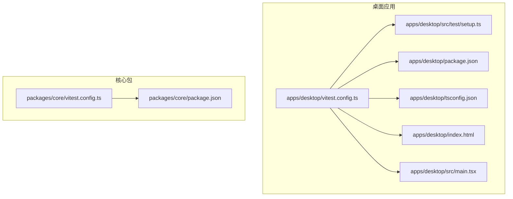
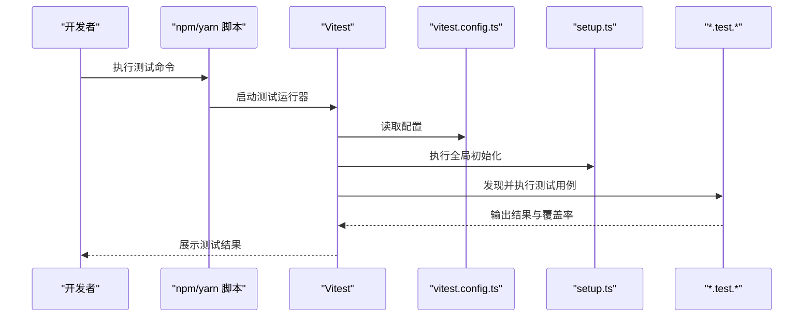
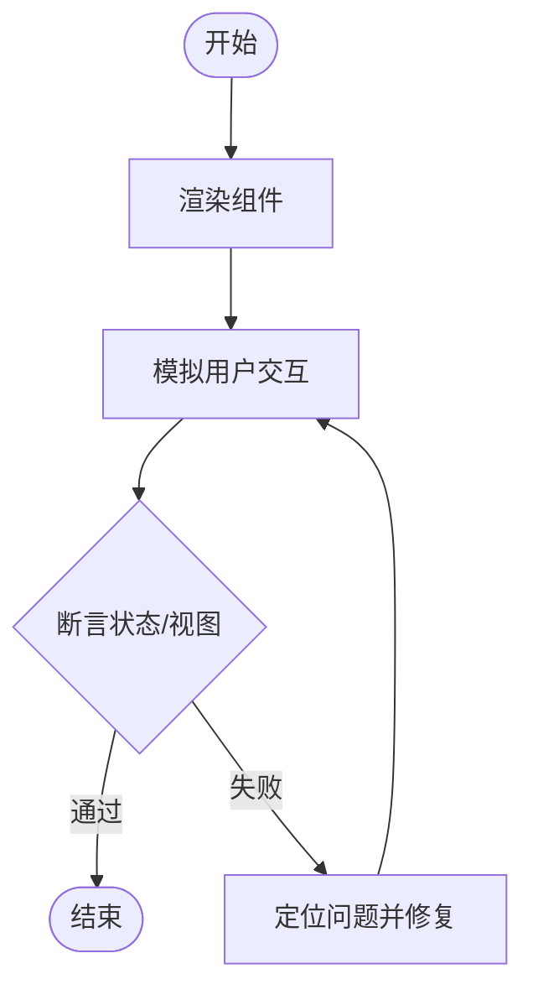
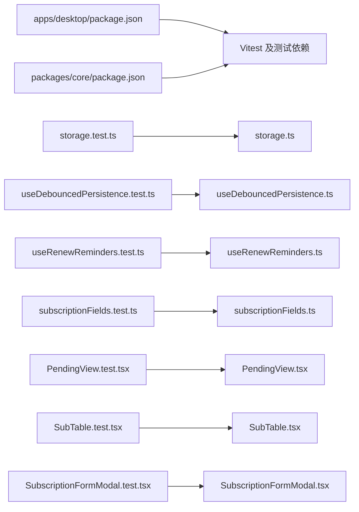

# 测试指南

<cite>
**本文引用的文件**   
- [package.json](file://package.json)
- [apps/desktop/vitest.config.ts](file://apps/desktop/vitest.config.ts)
- [apps/desktop/src/test/setup.ts](file://apps/desktop/src/test/setup.ts)
- [apps/desktop/package.json](file://apps/desktop/package.json)
- [apps/desktop/tsconfig.json](file://apps/desktop/tsconfig.json)
- [packages/core/vitest.config.ts](file://packages/core/vitest.config.ts)
- [packages/core/package.json](file://packages/core/package.json)
- [packages/core/src/actions.test.ts](file://packages/core/src/actions.test.ts)
- [packages/core/src/money.test.ts](file://packages/core/src/money.test.ts)
- [packages/core/src/paste.test.ts](file://packages/core/src/paste.test.ts)
- [packages/core/src/import.test.ts](file://packages/core/src/import.test.ts)
- [apps/desktop/src/PendingView.test.tsx](file://apps/desktop/src/PendingView.test.tsx)
- [apps/desktop/src/SubTable.test.tsx](file://apps/desktop/src/SubTable.test.tsx)
- [apps/desktop/src/SubscriptionFormModal.test.tsx](file://apps/desktop/src/SubscriptionFormModal.test.tsx)
- [apps/desktop/src/categoryLabel.test.ts](file://apps/desktop/src/categoryLabel.test.ts)
- [apps/desktop/src/storage.test.ts](file://apps/desktop/src/storage.test.ts)
- [apps/desktop/src/useDebouncedPersistence.test.ts](file://apps/desktop/src/useDebouncedPersistence.test.ts)
- [apps/desktop/src/useRenewReminders.test.ts](file://apps/desktop/src/useRenewReminders.test.ts)
- [apps/desktop/src/utils/dateUtils.ts](file://apps/desktop/src/utils/dateUtils.ts)
- [apps/desktop/src/ui/Icon.tsx](file://apps/desktop/src/ui/Icon.tsx)
- [apps/desktop/src/ui/ModalShell.tsx](file://apps/desktop/src/ui/ModalShell.tsx)
- [apps/desktop/src/PendingView.tsx](file://apps/desktop/src/PendingView.tsx)
- [apps/desktop/src/SubTable.tsx](file://apps/desktop/src/SubTable.tsx)
- [apps/desktop/src/SubscriptionFormModal.tsx](file://apps/desktop/src/SubscriptionFormModal.tsx)
- [apps/desktop/src/storage.ts](file://apps/desktop/src/storage.ts)
- [apps/desktop/src/useDebouncedPersistence.ts](file://apps/desktop/src/useDebouncedPersistence.ts)
- [apps/desktop/src/useRenewReminders.ts](file://apps/desktop/src/useRenewReminders.ts)
- [apps/desktop/src/subscriptionFields.ts](file://apps/desktop/src/subscriptionFields.ts)
- [apps/desktop/src/subscriptionFields.test.ts](file://apps/desktop/src/subscriptionFields.test.ts)
- [apps/desktop/src/BillFormModal.tsx](file://apps/desktop/src/BillFormModal.tsx)
- [apps/desktop/src/Dashboard.tsx](file://apps/desktop/src/Dashboard.tsx)
- [apps/desktop/src/main.tsx](file://apps/desktop/src/main.tsx)
- [apps/desktop/index.html](file://apps/desktop/index.html)
- [scripts/parity-baseline.json](file://scripts/parity-baseline.json)
</cite>

## 目录
1. [简介](#简介)
2. [项目结构](#项目结构)
3. [核心组件](#核心组件)
4. [架构总览](#架构总览)
5. [详细组件分析](#详细组件分析)
6. [依赖分析](#依赖分析)
7. [性能考虑](#性能考虑)
8. [故障排查指南](#故障排查指南)
9. [结论](#结论)
10. [附录](#附录)

## 简介
本指南面向使用 Vitest 的单元测试、React 组件测试与集成测试实践，覆盖以下主题：
- Vitest 配置与运行方式（应用层与包层）
- 单元测试编写规范与最佳实践
- React 组件测试模式与 Mock 策略
- 集成测试与端到端测试的实现思路
- 测试覆盖率要求与报告生成
- 测试数据准备与断言库使用指南

本项目采用多包结构，桌面应用位于 apps/desktop，核心逻辑位于 packages/core。两者均通过 Vitest 进行单元测试与部分集成测试。

## 项目结构
- apps/desktop：桌面应用前端代码，包含 React 组件、工具函数、以及对应的测试文件；Vitest 配置文件位于根目录 apps/desktop/vitest.config.ts，测试环境初始化在 apps/desktop/src/test/setup.ts。
- packages/core：共享核心逻辑与工具，包含大量 .test.ts 文件用于单元测试；Vitest 配置文件位于 packages/core/vitest.config.ts。
- scripts：包含一些辅助脚本，如 parity-baseline.json 可用于基准对比或回归检查。

图表来源
- [apps/desktop/vitest.config.ts](file://apps/desktop/vitest.config.ts)
- [apps/desktop/src/test/setup.ts](file://apps/desktop/src/test/setup.ts)
- [apps/desktop/package.json](file://apps/desktop/package.json)
- [apps/desktop/tsconfig.json](file://apps/desktop/tsconfig.json)
- [apps/desktop/index.html](file://apps/desktop/index.html)
- [apps/desktop/src/main.tsx](file://apps/desktop/src/main.tsx)
- [packages/core/vitest.config.ts](file://packages/core/vitest.config.ts)
- [packages/core/package.json](file://packages/core/package.json)

章节来源
- [apps/desktop/vitest.config.ts](file://apps/desktop/vitest.config.ts)
- [apps/desktop/src/test/setup.ts](file://apps/desktop/src/test/setup.ts)
- [apps/desktop/package.json](file://apps/desktop/package.json)
- [packages/core/vitest.config.ts](file://packages/core/vitest.config.ts)
- [packages/core/package.json](file://packages/core/package.json)

## 核心组件
- Vitest 配置
  - 应用层：apps/desktop/vitest.config.ts 定义测试环境、匹配规则、覆盖率等。
  - 包层：packages/core/vitest.config.ts 定义核心包的测试环境与匹配规则。
- 测试环境初始化
  - apps/desktop/src/test/setup.ts 提供全局测试设置（例如 DOM/JSDOM、全局变量、默认 Mock）。
- 测试入口与脚本
  - apps/desktop/package.json 与 packages/core/package.json 中定义了 test 命令以运行 Vitest。
- 类型与构建
  - apps/desktop/tsconfig.json 确保测试与源码类型一致。

章节来源
- [apps/desktop/vitest.config.ts](file://apps/desktop/vitest.config.ts)
- [apps/desktop/src/test/setup.ts](file://apps/desktop/src/test/setup.ts)
- [apps/desktop/package.json](file://apps/desktop/package.json)
- [packages/core/vitest.config.ts](file://packages/core/vitest.config.ts)
- [packages/core/package.json](file://packages/core/package.json)
- [apps/desktop/tsconfig.json](file://apps/desktop/tsconfig.json)

## 架构总览
下图展示了测试执行的关键路径：从 package.json 的脚本触发 Vitest，加载各模块的 vitest.config.ts，再根据 setup.ts 初始化环境，最后运行 *.test.* 文件。

图表来源
- [apps/desktop/package.json](file://apps/desktop/package.json)
- [apps/desktop/vitest.config.ts](file://apps/desktop/vitest.config.ts)
- [apps/desktop/src/test/setup.ts](file://apps/desktop/src/test/setup.ts)
- [packages/core/vitest.config.ts](file://packages/core/vitest.config.ts)

## 详细组件分析

### 单元测试编写规范与最佳实践
- 命名与组织
  - 将测试文件与源码同目录放置，命名为 xxx.test.ts 或 xxx.test.tsx，便于自动发现。
  - 示例参考：
    - [packages/core/src/actions.test.ts](file://packages/core/src/actions.test.ts)
    - [packages/core/src/money.test.ts](file://packages/core/src/money.test.ts)
    - [packages/core/src/paste.test.ts](file://packages/core/src/paste.test.ts)
    - [packages/core/src/import.test.ts](file://packages/core/src/import.test.ts)
    - [apps/desktop/src/categoryLabel.test.ts](file://apps/desktop/src/categoryLabel.test.ts)
    - [apps/desktop/src/storage.test.ts](file://apps/desktop/src/storage.test.ts)
    - [apps/desktop/src/useDebouncedPersistence.test.ts](file://apps/desktop/src/useDebouncedPersistence.test.ts)
    - [apps/desktop/src/useRenewReminders.test.ts](file://apps/desktop/src/useRenewReminders.test.ts)
    - [apps/desktop/src/subscriptionFields.test.ts](file://apps/desktop/src/subscriptionFields.test.ts)
- 断言风格
  - 使用 expect/it/describe 等基础 API，保持测试意图清晰。
  - 对边界条件与异常路径进行覆盖。
- 可维护性
  - 每个测试聚焦单一职责，避免跨模块耦合。
  - 使用工厂或 fixtures 管理测试数据，减少重复。

章节来源
- [packages/core/src/actions.test.ts](file://packages/core/src/actions.test.ts)
- [packages/core/src/money.test.ts](file://packages/core/src/money.test.ts)
- [packages/core/src/paste.test.ts](file://packages/core/src/paste.test.ts)
- [packages/core/src/import.test.ts](file://packages/core/src/import.test.ts)
- [apps/desktop/src/categoryLabel.test.ts](file://apps/desktop/src/categoryLabel.test.ts)
- [apps/desktop/src/storage.test.ts](file://apps/desktop/src/storage.test.ts)
- [apps/desktop/src/useDebouncedPersistence.test.ts](file://apps/desktop/src/useDebouncedPersistence.test.ts)
- [apps/desktop/src/useRenewReminders.test.ts](file://apps/desktop/src/useRenewReminders.test.ts)
- [apps/desktop/src/subscriptionFields.test.ts](file://apps/desktop/src/subscriptionFields.test.ts)

### React 组件测试模式与 Mock 策略
- 组件测试
  - 针对 UI 组件，渲染到 JSDOM，模拟用户交互，断言视图状态变化。
  - 示例参考：
    - [apps/desktop/src/PendingView.test.tsx](file://apps/desktop/src/PendingView.test.tsx)
    - [apps/desktop/src/SubTable.test.tsx](file://apps/desktop/src/SubTable.test.tsx)
    - [apps/desktop/src/SubscriptionFormModal.test.tsx](file://apps/desktop/src/SubscriptionFormModal.test.tsx)
- Mock 策略
  - 对外部依赖（网络、存储、第三方库）使用 vi.mock 或手动 mock。
  - 对时间相关逻辑使用 jest-vitest-date-mock 或类似方案控制时间。
  - 对 i18n、路由、状态管理等外部能力进行隔离。
- 常见模式
  - 给定-当-则（Given-When-Then）结构，提升可读性。
  - 参数化测试覆盖多组输入。
  - 对异步操作使用 await 与超时保护。

图表来源
- [apps/desktop/src/PendingView.test.tsx](file://apps/desktop/src/PendingView.test.tsx)
- [apps/desktop/src/SubTable.test.tsx](file://apps/desktop/src/SubTable.test.tsx)
- [apps/desktop/src/SubscriptionFormModal.test.tsx](file://apps/desktop/src/SubscriptionFormModal.test.tsx)

章节来源
- [apps/desktop/src/PendingView.test.tsx](file://apps/desktop/src/PendingView.test.tsx)
- [apps/desktop/src/SubTable.test.tsx](file://apps/desktop/src/SubTable.test.tsx)
- [apps/desktop/src/SubscriptionFormModal.test.tsx](file://apps/desktop/src/SubscriptionFormModal.test.tsx)

### 集成测试实现方式
- 目标
  - 验证多个模块协作的正确性，如表单提交、数据持久化、提醒调度等。
- 方法
  - 使用真实或半真实的依赖（如内存存储、Mock 服务），保证接近生产行为。
  - 示例参考：
    - 存储集成：[apps/desktop/src/storage.test.ts](file://apps/desktop/src/storage.test.ts)、[apps/desktop/src/storage.ts](file://apps/desktop/src/storage.ts)
    - 防抖持久化：[apps/desktop/src/useDebouncedPersistence.test.ts](file://apps/desktop/src/useDebouncedPersistence.test.ts)、[apps/desktop/src/useDebouncedPersistence.ts](file://apps/desktop/src/useDebouncedPersistence.ts)
    - 续订提醒：[apps/desktop/src/useRenewReminders.test.ts](file://apps/desktop/src/useRenewReminders.test.ts)、[apps/desktop/src/useRenewReminders.ts](file://apps/desktop/src/useRenewReminders.ts)
    - 订阅字段校验：[apps/desktop/src/subscriptionFields.test.ts](file://apps/desktop/src/subscriptionFields.test.ts)、[apps/desktop/src/subscriptionFields.ts](file://apps/desktop/src/subscriptionFields.ts)
- 注意事项
  - 控制并发与定时器，避免竞态条件影响稳定性。
  - 清理副作用（事件监听、定时器、全局状态）。

章节来源
- [apps/desktop/src/storage.test.ts](file://apps/desktop/src/storage.test.ts)
- [apps/desktop/src/storage.ts](file://apps/desktop/src/storage.ts)
- [apps/desktop/src/useDebouncedPersistence.test.ts](file://apps/desktop/src/useDebouncedPersistence.test.ts)
- [apps/desktop/src/useDebouncedPersistence.ts](file://apps/desktop/src/useDebouncedPersistence.ts)
- [apps/desktop/src/useRenewReminders.test.ts](file://apps/desktop/src/useRenewReminders.test.ts)
- [apps/desktop/src/useRenewReminders.ts](file://apps/desktop/src/useRenewReminders.ts)
- [apps/desktop/src/subscriptionFields.test.ts](file://apps/desktop/src/subscriptionFields.test.ts)
- [apps/desktop/src/subscriptionFields.ts](file://apps/desktop/src/subscriptionFields.ts)

### 端到端测试实现思路
- 说明
  - 当前仓库未包含专门的 E2E 框架配置（如 Playwright/Cypress），可在 CI 中扩展。
- 建议
  - 基于现有 Vitest 生态，引入浏览器自动化或桌面端自动化方案。
  - 将关键用户流程（登录、创建订阅、账单录入、统计查看）纳入 E2E 套件。
  - 在 CI 中并行执行，缩短反馈时间。

[本节为概念性内容，不直接分析具体文件]

### 测试覆盖率要求与报告生成
- 配置
  - 在 apps/desktop/vitest.config.ts 与 packages/core/vitest.config.ts 中启用覆盖率收集与阈值。
- 指标
  - 语句、分支、函数、行覆盖率应达到团队约定阈值。
- 报告
  - 生成 HTML/JSON 报告，便于归档与审查。
  - 在 CI 中上传覆盖率报告，作为质量门禁。

章节来源
- [apps/desktop/vitest.config.ts](file://apps/desktop/vitest.config.ts)
- [packages/core/vitest.config.ts](file://packages/core/vitest.config.ts)

### 测试数据准备与断言库使用指南
- 数据准备
  - 使用 fixtures 或工厂函数生成稳定、可复用的测试数据。
  - 对复杂对象（如订阅、账单）提供最小必要字段。
- 断言库
  - 使用 Vitest 内置 expect API，结合 toBe、toEqual、toContain、toThrow、toHaveTextContent 等。
  - 对异步断言使用 await 与合理超时。
- 示例参考
  - 工具函数断言：[apps/desktop/src/categoryLabel.test.ts](file://apps/desktop/src/categoryLabel.test.ts)
  - 日期工具：[apps/desktop/src/utils/dateUtils.ts](file://apps/desktop/src/utils/dateUtils.ts)
  - 组件交互断言：[apps/desktop/src/PendingView.test.tsx](file://apps/desktop/src/PendingView.test.tsx)、[apps/desktop/src/SubTable.test.tsx](file://apps/desktop/src/SubTable.test.tsx)、[apps/desktop/src/SubscriptionFormModal.test.tsx](file://apps/desktop/src/SubscriptionFormModal.test.tsx)

章节来源
- [apps/desktop/src/categoryLabel.test.ts](file://apps/desktop/src/categoryLabel.test.ts)
- [apps/desktop/src/utils/dateUtils.ts](file://apps/desktop/src/utils/dateUtils.ts)
- [apps/desktop/src/PendingView.test.tsx](file://apps/desktop/src/PendingView.test.tsx)
- [apps/desktop/src/SubTable.test.tsx](file://apps/desktop/src/SubTable.test.tsx)
- [apps/desktop/src/SubscriptionFormModal.test.tsx](file://apps/desktop/src/SubscriptionFormModal.test.tsx)

## 依赖分析
- 包级依赖
  - apps/desktop/package.json 与 packages/core/package.json 声明了测试相关依赖（如 Vitest、JSDOM、React Testing Library 等）。
- 运行时依赖
  - 测试会依赖源码中的模块（如 storage.ts、useDebouncedPersistence.ts、useRenewReminders.ts、subscriptionFields.ts 等）。
- 组件依赖
  - PendingView、SubTable、SubscriptionFormModal 等组件可能被测试渲染与交互。

图表来源
- [apps/desktop/package.json](file://apps/desktop/package.json)
- [packages/core/package.json](file://packages/core/package.json)
- [apps/desktop/src/storage.test.ts](file://apps/desktop/src/storage.test.ts)
- [apps/desktop/src/storage.ts](file://apps/desktop/src/storage.ts)
- [apps/desktop/src/useDebouncedPersistence.test.ts](file://apps/desktop/src/useDebouncedPersistence.test.ts)
- [apps/desktop/src/useDebouncedPersistence.ts](file://apps/desktop/src/useDebouncedPersistence.ts)
- [apps/desktop/src/useRenewReminders.test.ts](file://apps/desktop/src/useRenewReminders.test.ts)
- [apps/desktop/src/useRenewReminders.ts](file://apps/desktop/src/useRenewReminders.ts)
- [apps/desktop/src/subscriptionFields.test.ts](file://apps/desktop/src/subscriptionFields.test.ts)
- [apps/desktop/src/subscriptionFields.ts](file://apps/desktop/src/subscriptionFields.ts)
- [apps/desktop/src/PendingView.test.tsx](file://apps/desktop/src/PendingView.test.tsx)
- [apps/desktop/src/PendingView.tsx](file://apps/desktop/src/PendingView.tsx)
- [apps/desktop/src/SubTable.test.tsx](file://apps/desktop/src/SubTable.test.tsx)
- [apps/desktop/src/SubTable.tsx](file://apps/desktop/src/SubTable.tsx)
- [apps/desktop/src/SubscriptionFormModal.test.tsx](file://apps/desktop/src/SubscriptionFormModal.test.tsx)
- [apps/desktop/src/SubscriptionFormModal.tsx](file://apps/desktop/src/SubscriptionFormModal.tsx)

章节来源
- [apps/desktop/package.json](file://apps/desktop/package.json)
- [packages/core/package.json](file://packages/core/package.json)
- [apps/desktop/src/storage.test.ts](file://apps/desktop/src/storage.test.ts)
- [apps/desktop/src/useDebouncedPersistence.test.ts](file://apps/desktop/src/useDebouncedPersistence.test.ts)
- [apps/desktop/src/useRenewReminders.test.ts](file://apps/desktop/src/useRenewReminders.test.ts)
- [apps/desktop/src/subscriptionFields.test.ts](file://apps/desktop/src/subscriptionFields.test.ts)
- [apps/desktop/src/PendingView.test.tsx](file://apps/desktop/src/PendingView.test.tsx)
- [apps/desktop/src/SubTable.test.tsx](file://apps/desktop/src/SubTable.test.tsx)
- [apps/desktop/src/SubscriptionFormModal.test.tsx](file://apps/desktop/src/SubscriptionFormModal.test.tsx)

## 性能考虑
- 测试隔离
  - 每个测试独立环境，避免共享状态导致的不稳定。
- 资源占用
  - 合理使用 JSDOM，避免大型 DOM 树渲染。
  - 对耗时操作（网络、I/O）进行 Mock 或节流。
- 并行执行
  - 利用 Vitest 的并行能力加速测试套件。
- 覆盖率阈值
  - 设置合理的覆盖率门槛，避免过度追求覆盖率而牺牲可维护性。

[本节为通用指导，不直接分析具体文件]

## 故障排查指南
- 常见问题
  - 环境变量缺失：检查 setup.ts 是否初始化必要的全局变量。
  - 模块解析错误：确认 tsconfig.json 与 vitest.config.ts 的路径映射。
  - 组件渲染失败：检查依赖 Mock 是否正确，尤其是 i18n、路由、状态管理。
  - 异步测试不稳定：增加重试或等待策略，避免竞态条件。
- 调试技巧
  - 使用 console.log 或调试器定位问题。
  - 缩小测试范围，逐步定位失败原因。
  - 查看覆盖率报告，识别未覆盖路径。

章节来源
- [apps/desktop/src/test/setup.ts](file://apps/desktop/src/test/setup.ts)
- [apps/desktop/tsconfig.json](file://apps/desktop/tsconfig.json)
- [apps/desktop/vitest.config.ts](file://apps/desktop/vitest.config.ts)

## 结论
本指南总结了 Vitest 在本项目中的配置与实践，涵盖单元测试、React 组件测试、集成测试与覆盖率报告。建议团队遵循统一的测试规范，持续完善测试套件，保障代码质量与交付效率。

[本节为总结性内容，不直接分析具体文件]

## 附录
- 相关脚本与基准
  - scripts/parity-baseline.json 可用于基准对比或回归检查，建议在变更关键逻辑时更新基线。

章节来源
- [scripts/parity-baseline.json](file://scripts/parity-baseline.json)