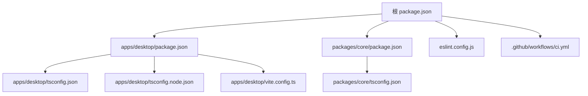
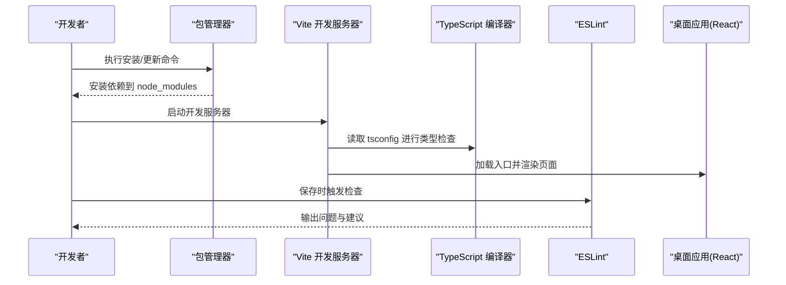
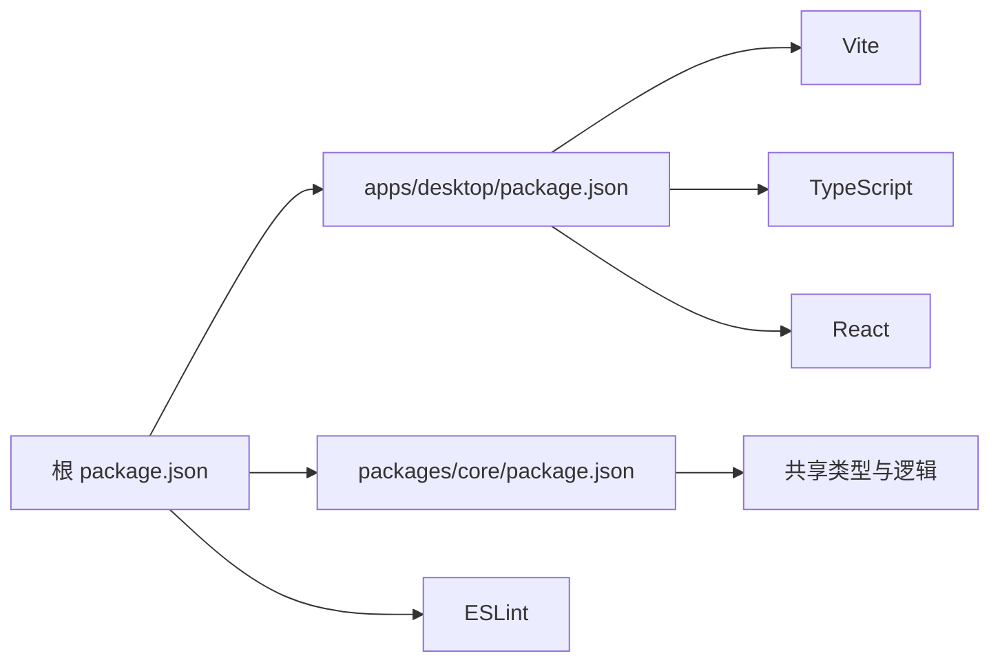

# 环境搭建

<cite>
**本文引用的文件**   
- [package.json](file://package.json)
- [apps/desktop/package.json](file://apps/desktop/package.json)
- [apps/desktop/tsconfig.json](file://apps/desktop/tsconfig.json)
- [apps/desktop/tsconfig.node.json](file://apps/desktop/tsconfig.node.json)
- [apps/desktop/vite.config.ts](file://apps/desktop/vite.config.ts)
- [packages/core/package.json](file://packages/core/package.json)
- [packages/core/tsconfig.json](file://packages/core/tsconfig.json)
- [eslint.config.js](file://eslint.config.js)
- [.github/workflows/ci.yml](file://.github/workflows/ci.yml)
</cite>

## 目录
1. [简介](#简介)
2. [项目结构](#项目结构)
3. [核心组件](#核心组件)
4. [架构总览](#架构总览)
5. [详细组件分析](#详细组件分析)
6. [依赖分析](#依赖分析)
7. [性能考虑](#性能考虑)
8. [故障排查指南](#故障排查指南)
9. [结论](#结论)
10. [附录](#附录)

## 简介
本指南面向首次接触本仓库的开发者，目标是帮助你从零开始完成本地环境搭建与开发调试。内容涵盖：
- Node.js 版本要求与包管理器选择
- Monorepo 初始化与依赖安装流程
- TypeScript 配置与编译选项说明
- 开发服务器启动方式与热重载配置
- 常见环境问题排查与解决方案
- IDE（VSCode）扩展推荐与调试配置建议

## 项目结构
本项目采用 Monorepo 组织方式，包含桌面端应用、共享核心库以及脚本与文档等模块。关键目录与职责如下：
- apps/desktop：桌面端前端应用（基于 Vite + React），Tauri 后端位于 src-tauri
- packages/core：共享业务逻辑与类型定义
- scripts：构建与发布辅助脚本
- docs：产品与平台相关文档
- .github/workflows：CI 流水线配置

图表来源
- [package.json](file://package.json)
- [apps/desktop/package.json](file://apps/desktop/package.json)
- [apps/desktop/tsconfig.json](file://apps/desktop/tsconfig.json)
- [apps/desktop/tsconfig.node.json](file://apps/desktop/tsconfig.node.json)
- [apps/desktop/vite.config.ts](file://apps/desktop/vite.config.ts)
- [packages/core/package.json](file://packages/core/package.json)
- [packages/core/tsconfig.json](file://packages/core/tsconfig.json)
- [eslint.config.js](file://eslint.config.js)
- [.github/workflows/ci.yml](file://.github/workflows/ci.yml)

章节来源
- [package.json](file://package.json)
- [apps/desktop/package.json](file://apps/desktop/package.json)
- [packages/core/package.json](file://packages/core/package.json)

## 核心组件
- 包管理与工作区
  - 根 package.json 定义了工作区与工作区成员，集中管理脚本命令与公共依赖
  - apps/desktop 与 packages/core 各自维护自身依赖与构建配置
- 构建与开发工具链
  - Vite：提供快速开发服务器、按需编译与热重载
  - TypeScript：统一类型系统与编译选项
  - ESLint：代码风格与静态检查
- 跨平台桌面应用
  - Tauri：将 Web 前端打包为桌面应用（Rust 后端位于 apps/desktop/src-tauri）

章节来源
- [package.json](file://package.json)
- [apps/desktop/package.json](file://apps/desktop/package.json)
- [packages/core/package.json](file://packages/core/package.json)
- [eslint.config.js](file://eslint.config.js)

## 架构总览
下图展示了开发环境与构建流程的关键交互：Node.js 通过包管理器解析工作区依赖，Vite 启动开发服务器并监听源码变更，TypeScript 编译器按 tsconfig 进行类型检查与转译，ESLint 在保存或提交前进行代码质量检查。

图表来源
- [apps/desktop/vite.config.ts](file://apps/desktop/vite.config.ts)
- [apps/desktop/tsconfig.json](file://apps/desktop/tsconfig.json)
- [eslint.config.js](file://eslint.config.js)

## 详细组件分析

### Node.js 版本与包管理器
- Node.js 版本要求
  - 参考 CI 配置中的引擎声明，确保本地 Node.js 版本满足要求
- 包管理器
  - 推荐使用 npm（与 package-lock.json 配套），也可使用 pnpm/yarn 但需留意锁文件差异

章节来源
- [.github/workflows/ci.yml](file://.github/workflows/ci.yml)
- [package.json](file://package.json)

### 项目初始化与依赖安装
- 前置条件
  - 安装符合要求的 Node.js 版本
  - 确认已安装 npm（或使用兼容的包管理器）
- 初始化步骤
  - 克隆仓库后进入根目录
  - 执行依赖安装命令以拉取所有工作区依赖
  - 若遇到网络问题，可切换镜像源或代理
- 验证安装
  - 运行开发服务器命令，确认无报错且页面正常加载

章节来源
- [package.json](file://package.json)
- [apps/desktop/package.json](file://apps/desktop/package.json)

### TypeScript 配置与编译选项
- 应用层配置
  - apps/desktop/tsconfig.json：定义 React 应用的目标、模块解析、路径别名与严格模式等
  - apps/desktop/tsconfig.node.json：针对 Node/Vite 插件与脚本的类型检查
- 共享库配置
  - packages/core/tsconfig.json：定义库的编译目标与导出类型
- 编译与类型检查
  - 开发时由 Vite 驱动增量编译与类型检查
  - 可在根脚本中统一执行类型检查与构建

章节来源
- [apps/desktop/tsconfig.json](file://apps/desktop/tsconfig.json)
- [apps/desktop/tsconfig.node.json](file://apps/desktop/tsconfig.node.json)
- [packages/core/tsconfig.json](file://packages/core/tsconfig.json)

### 开发服务器与热重载
- 启动方式
  - 通过根脚本或应用脚本启动 Vite 开发服务器
- 热重载
  - Vite 默认启用模块热替换（HMR），修改源码后自动刷新
- 端口与环境变量
  - 可通过环境变量或配置文件调整端口、代理与构建产物路径

章节来源
- [apps/desktop/vite.config.ts](file://apps/desktop/vite.config.ts)
- [apps/desktop/package.json](file://apps/desktop/package.json)

### 代码质量与规范
- ESLint 配置
  - 根目录 eslint.config.js 统一管理规则与插件
- 集成方式
  - 可在编辑器保存时触发检查，或在 CI 中强制校验

章节来源
- [eslint.config.js](file://eslint.config.js)

### Tauri 桌面应用（可选）
- 后端语言
  - Rust（位于 apps/desktop/src-tauri）
- 构建与打包
  - 遵循 Tauri 官方文档进行环境准备与签名（macOS 等平台）

章节来源
- [apps/desktop/src-tauri/Cargo.toml](file://apps/desktop/src-tauri/Cargo.toml)
- [apps/desktop/src-tauri/tauri.conf.json](file://apps/desktop/src-tauri/tauri.conf.json)

## 依赖分析
下图展示工作区依赖关系与主要工具链：

图表来源
- [package.json](file://package.json)
- [apps/desktop/package.json](file://apps/desktop/package.json)
- [packages/core/package.json](file://packages/core/package.json)
- [eslint.config.js](file://eslint.config.js)

章节来源
- [package.json](file://package.json)
- [apps/desktop/package.json](file://apps/desktop/package.json)
- [packages/core/package.json](file://packages/core/package.json)

## 性能考虑
- 依赖安装
  - 使用稳定的网络与合适的缓存策略，避免重复下载
- 开发体验
  - 合理配置 Vite 的预构建与分包，减少冷启动时间
- 类型检查
  - 仅在必要阶段运行完整类型检查，避免阻塞日常开发

[本节为通用指导，不直接分析具体文件]

## 故障排查指南
- Node.js 版本不匹配
  - 症状：安装或运行时报错提示引擎版本不符
  - 处理：根据 CI 配置中的引擎声明升级或切换 Node.js 版本
- 依赖安装失败
  - 症状：网络超时、权限错误或锁文件冲突
  - 处理：清理缓存与 node_modules，重新安装；必要时切换镜像源或代理
- 端口占用
  - 症状：开发服务器无法启动
  - 处理：更换端口或释放占用进程
- 类型检查错误
  - 症状：tsconfig 或第三方库类型缺失
  - 处理：安装对应类型包或调整 tsconfig 的模块解析与严格模式
- ESLint 报错
  - 症状：保存时报格式或规则错误
  - 处理：按提示修复或调整规则配置

章节来源
- [.github/workflows/ci.yml](file://.github/workflows/ci.yml)
- [apps/desktop/vite.config.ts](file://apps/desktop/vite.config.ts)
- [apps/desktop/tsconfig.json](file://apps/desktop/tsconfig.json)
- [eslint.config.js](file://eslint.config.js)

## 结论
通过本指南，你应能顺利完成本地环境搭建、依赖安装与开发服务器启动，并理解 TypeScript 与 Vite 的配置要点。遇到问题时，可依据故障排查部分快速定位与解决。建议在团队内统一 Node.js 版本与包管理器，以减少协作成本。

[本节为总结性内容，不直接分析具体文件]

## 附录

### VSCode 扩展与调试建议
- 推荐扩展
  - ESLint：实时代码质量检查
  - Prettier：统一代码格式化
  - TypeScript 语言支持：增强类型提示与跳转
  - Vite 插件（可选）：提升开发体验
- 调试配置
  - 使用 Chrome 调试器连接 Vite 开发服务器
  - 在 launch.json 中添加 Node 调试配置（如需调试脚本）

[本节为通用建议，不直接分析具体文件]