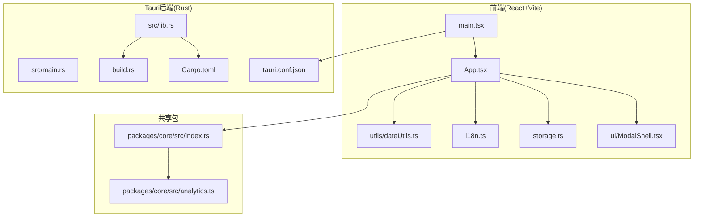
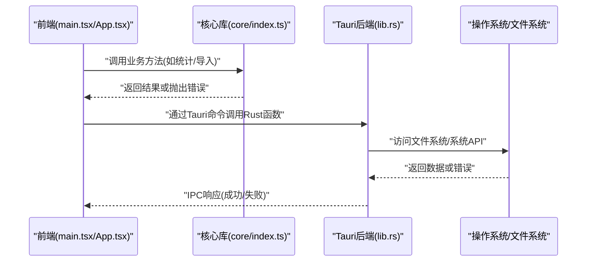
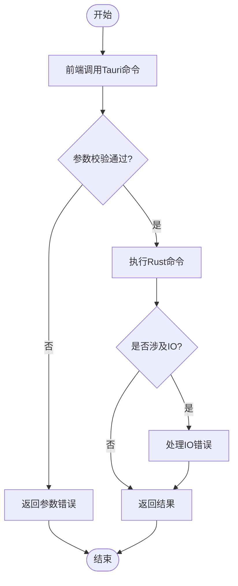
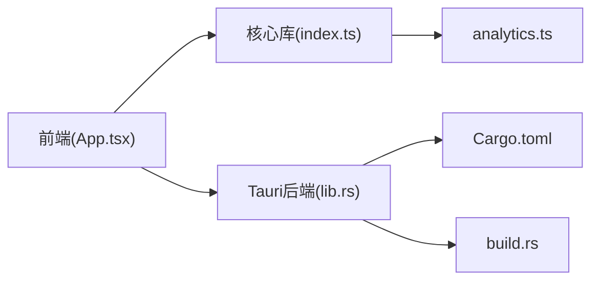

# 调试技巧

<cite>
**本文引用的文件**   
- [apps/desktop/src/main.tsx](file://apps/desktop/src/main.tsx)
- [apps/desktop/vite.config.ts](file://apps/desktop/vite.config.ts)
- [apps/desktop/package.json](file://apps/desktop/package.json)
- [apps/desktop/src-tauri/tauri.conf.json](file://apps/desktop/src-tauri/tauri.conf.json)
- [apps/desktop/src-tauri/Cargo.toml](file://apps/desktop/src-tauri/Cargo.toml)
- [apps/desktop/src-tauri/src/lib.rs](file://apps/desktop/src-tauri/src/lib.rs)
- [apps/desktop/src-tauri/src/main.rs](file://apps/desktop/src-tauri/src/main.rs)
- [apps/desktop/src-tauri/build.rs](file://apps/desktop/src-tauri/build.rs)
- [apps/desktop/src/App.tsx](file://apps/desktop/src/App.tsx)
- [apps/desktop/src/ui/ModalShell.tsx](file://apps/desktop/src/ui/ModalShell.tsx)
- [apps/desktop/src/storage.ts](file://apps/desktop/src/storage.ts)
- [apps/desktop/src/i18n.ts](file://apps/desktop/src/i18n.ts)
- [apps/desktop/src/utils/dateUtils.ts](file://apps/desktop/src/utils/dateUtils.ts)
- [packages/core/src/index.ts](file://packages/core/src/index.ts)
- [packages/core/src/analytics.ts](file://packages/core/src/analytics.ts)
- [scripts/sign-macos-app.sh](file://scripts/sign-macos-app.sh)
</cite>

## 目录
1. [简介](#简介)
2. [项目结构](#项目结构)
3. [核心组件](#核心组件)
4. [架构总览](#架构总览)
5. [详细组件分析](#详细组件分析)
6. [依赖分析](#依赖分析)
7. [性能考虑](#性能考虑)
8. [故障排查指南](#故障排查指南)
9. [结论](#结论)
10. [附录](#附录)

## 简介
本文件面向使用 Tauri + React 的桌面应用开发者，提供一套实用的调试技巧与最佳实践。内容涵盖：
- 浏览器开发者工具的使用要点（控制台、网络、性能、内存）
- React DevTools 的安装与配置
- Tauri 应用的调试流程（前端、后端 Rust、IPC 通信）
- 日志记录策略与错误监控方案
- 性能分析与内存泄漏检测方法
- 常见问题排查与解决方案
- 调试工具与插件推荐

## 项目结构
本项目采用多包结构：
- apps/desktop：Tauri 桌面应用前端（React + Vite）与 Tauri 后端（Rust）
- packages/core：共享业务逻辑与类型定义
- scripts：构建与签名脚本

图表来源
- [apps/desktop/src/main.tsx](file://apps/desktop/src/main.tsx)
- [apps/desktop/src/App.tsx](file://apps/desktop/src/App.tsx)
- [apps/desktop/src/ui/ModalShell.tsx](file://apps/desktop/src/ui/ModalShell.tsx)
- [apps/desktop/src/storage.ts](file://apps/desktop/src/storage.ts)
- [apps/desktop/src/i18n.ts](file://apps/desktop/src/i18n.ts)
- [apps/desktop/src/utils/dateUtils.ts](file://apps/desktop/src/utils/dateUtils.ts)
- [apps/desktop/src-tauri/src/lib.rs](file://apps/desktop/src-tauri/src/lib.rs)
- [apps/desktop/src-tauri/src/main.rs](file://apps/desktop/src-tauri/src/main.rs)
- [apps/desktop/src-tauri/build.rs](file://apps/desktop/src-tauri/build.rs)
- [apps/desktop/src-tauri/tauri.conf.json](file://apps/desktop/src-tauri/tauri.conf.json)
- [apps/desktop/src-tauri/Cargo.toml](file://apps/desktop/src-tauri/Cargo.toml)
- [packages/core/src/index.ts](file://packages/core/src/index.ts)
- [packages/core/src/analytics.ts](file://packages/core/src/analytics.ts)

章节来源
- [apps/desktop/src/main.tsx](file://apps/desktop/src/main.tsx)
- [apps/desktop/src/App.tsx](file://apps/desktop/src/App.tsx)
- [apps/desktop/src-tauri/src/lib.rs](file://apps/desktop/src-tauri/src/lib.rs)
- [apps/desktop/src-tauri/src/main.rs](file://apps/desktop/src-tauri/src/main.rs)
- [apps/desktop/src-tauri/tauri.conf.json](file://apps/desktop/src-tauri/tauri.conf.json)
- [apps/desktop/src-tauri/Cargo.toml](file://apps/desktop/src-tauri/Cargo.toml)
- [packages/core/src/index.ts](file://packages/core/src/index.ts)

## 核心组件
- 前端入口与路由挂载：main.tsx 负责初始化 React 应用并挂载到 DOM
- 应用根组件：App.tsx 组织页面与状态
- UI 壳层：ModalShell.tsx 提供弹窗等通用 UI 能力
- 数据持久化：storage.ts 封装本地存储读写
- 国际化：i18n.ts 管理语言资源
- 日期工具：dateUtils.ts 提供日期格式化与计算
- Tauri 后端：lib.rs 暴露 Rust 命令给前端；main.rs 启动应用；build.rs 处理构建期任务
- 共享核心库：packages/core 提供业务类型、统计、导入导出等能力

章节来源
- [apps/desktop/src/main.tsx](file://apps/desktop/src/main.tsx)
- [apps/desktop/src/App.tsx](file://apps/desktop/src/App.tsx)
- [apps/desktop/src/ui/ModalShell.tsx](file://apps/desktop/src/ui/ModalShell.tsx)
- [apps/desktop/src/storage.ts](file://apps/desktop/src/storage.ts)
- [apps/desktop/src/i18n.ts](file://apps/desktop/src/i18n.ts)
- [apps/desktop/src/utils/dateUtils.ts](file://apps/desktop/src/utils/dateUtils.ts)
- [apps/desktop/src-tauri/src/lib.rs](file://apps/desktop/src-tauri/src/lib.rs)
- [apps/desktop/src-tauri/src/main.rs](file://apps/desktop/src-tauri/src/main.rs)
- [apps/desktop/src-tauri/build.rs](file://apps/desktop/src-tauri/build.rs)
- [packages/core/src/index.ts](file://packages/core/src/index.ts)

## 架构总览
下图展示了 Tauri 应用中前端与后端的交互关系，以及 IPC 调用路径。

图表来源
- [apps/desktop/src/main.tsx](file://apps/desktop/src/main.tsx)
- [apps/desktop/src/App.tsx](file://apps/desktop/src/App.tsx)
- [apps/desktop/src-tauri/src/lib.rs](file://apps/desktop/src-tauri/src/lib.rs)
- [packages/core/src/index.ts](file://packages/core/src/index.ts)

## 详细组件分析

### 前端调试要点（React + Vite）
- 启用开发服务器热重载：确保 vite.config.ts 中开启 HMR 与 SourceMap
- 使用 React DevTools：安装扩展并在浏览器中查看组件树、Props、State
- 控制台断点与日志：在关键事件回调与渲染路径上设置断点
- 网络面板：检查 API 请求、缓存、跨域问题
- 性能面板：录制渲染帧，定位重排重绘与长任务
- 内存面板：快照对比，查找未释放引用

章节来源
- [apps/desktop/vite.config.ts](file://apps/desktop/vite.config.ts)
- [apps/desktop/package.json](file://apps/desktop/package.json)
- [apps/desktop/src/main.tsx](file://apps/desktop/src/main.tsx)
- [apps/desktop/src/App.tsx](file://apps/desktop/src/App.tsx)

### Tauri 后端调试（Rust）
- 使用 Cargo 运行与调试：cargo run 启动，配合 IDE 断点调试
- 日志输出：在 lib.rs 中使用日志框架输出关键路径信息
- 命令注册：确认 lib.rs 中正确注册 Tauri 命令，便于前端调用
- 构建期任务：build.rs 用于生成代码或资源，注意其执行时机与错误输出

章节来源
- [apps/desktop/src-tauri/src/lib.rs](file://apps/desktop/src-tauri/src/lib.rs)
- [apps/desktop/src-tauri/src/main.rs](file://apps/desktop/src-tauri/src/main.rs)
- [apps/desktop/src-tauri/build.rs](file://apps/desktop/src-tauri/build.rs)
- [apps/desktop/src-tauri/Cargo.toml](file://apps/desktop/src-tauri/Cargo.toml)

### IPC 通信调试
- 前端侧：在调用 Tauri 命令前后打印参数与返回值，捕获异常
- 后端侧：在命令实现中记录输入参数与处理结果
- 错误传播：统一错误码与消息，便于前端展示与上报

图表来源
- [apps/desktop/src-tauri/src/lib.rs](file://apps/desktop/src-tauri/src/lib.rs)
- [apps/desktop/src/App.tsx](file://apps/desktop/src/App.tsx)

### 日志记录策略
- 前端日志：按模块划分，区分 info/warn/error，避免在生产环境输出敏感信息
- 后端日志：结构化日志，包含时间戳、模块名、请求ID
- 日志聚合：将关键错误上报至监控系统，便于追踪

章节来源
- [apps/desktop/src/storage.ts](file://apps/desktop/src/storage.ts)
- [apps/desktop/src/i18n.ts](file://apps/desktop/src/i18n.ts)
- [apps/desktop/src/utils/dateUtils.ts](file://apps/desktop/src/utils/dateUtils.ts)
- [apps/desktop/src-tauri/src/lib.rs](file://apps/desktop/src-tauri/src/lib.rs)

### 错误监控方案
- 全局错误捕获：前端 window.onerror 与 unhandledrejection
- 业务错误分类：区分网络错误、业务校验错误、系统错误
- 上报策略：批量上报、去重、脱敏

章节来源
- [apps/desktop/src/App.tsx](file://apps/desktop/src/App.tsx)
- [packages/core/src/analytics.ts](file://packages/core/src/analytics.ts)

### 性能分析与内存泄漏检测
- 前端性能：使用 Performance 面板录制，关注长任务与主线程阻塞
- 内存泄漏：使用 Memory 面板进行堆快照对比，查找未释放对象
- 渲染优化：减少不必要的重渲染，合理使用 useMemo/useCallback
- 后端性能：使用 profiling 工具分析热点函数

章节来源
- [apps/desktop/src/App.tsx](file://apps/desktop/src/App.tsx)
- [apps/desktop/src/ui/ModalShell.tsx](file://apps/desktop/src/ui/ModalShell.tsx)
- [apps/desktop/src-tauri/src/lib.rs](file://apps/desktop/src-tauri/src/lib.rs)

## 依赖分析
前端与后端通过 Tauri IPC 解耦，核心库提供共享逻辑。

图表来源
- [apps/desktop/src/App.tsx](file://apps/desktop/src/App.tsx)
- [packages/core/src/index.ts](file://packages/core/src/index.ts)
- [packages/core/src/analytics.ts](file://packages/core/src/analytics.ts)
- [apps/desktop/src-tauri/src/lib.rs](file://apps/desktop/src-tauri/src/lib.rs)
- [apps/desktop/src-tauri/Cargo.toml](file://apps/desktop/src-tauri/Cargo.toml)
- [apps/desktop/src-tauri/build.rs](file://apps/desktop/src-tauri/build.rs)

章节来源
- [apps/desktop/src/App.tsx](file://apps/desktop/src/App.tsx)
- [packages/core/src/index.ts](file://packages/core/src/index.ts)
- [apps/desktop/src-tauri/src/lib.rs](file://apps/desktop/src-tauri/src/lib.rs)

## 性能考虑
- 前端：避免频繁状态更新，合并渲染批次，懒加载大组件
- 后端：I/O 操作异步化，避免阻塞主线程
- 打包优化：按需引入第三方库，关闭生产环境的 SourceMap
- 监控指标：收集关键路径耗时与错误率，建立基线

[本节为通用指导，不直接分析具体文件]

## 故障排查指南
- 启动失败：检查 vite.config.ts 与 package.json 的脚本配置
- 运行时崩溃：查看控制台错误栈，定位触发点
- 权限问题：确认 tauri.conf.json 中的权限声明
- 跨域问题：检查网络面板与后端 CORS 配置
- 打包签名：使用 scripts/sign-macos-app.sh 进行 macOS 签名

章节来源
- [apps/desktop/vite.config.ts](file://apps/desktop/vite.config.ts)
- [apps/desktop/package.json](file://apps/desktop/package.json)
- [apps/desktop/src-tauri/tauri.conf.json](file://apps/desktop/src-tauri/tauri.conf.json)
- [scripts/sign-macos-app.sh](file://scripts/sign-macos-app.sh)

## 结论
通过合理配置浏览器开发者工具与 React DevTools，结合 Tauri 的 IPC 调试与 Rust 后端调试，可以高效定位问题。建议建立统一的日志与错误监控体系，持续优化性能与稳定性。

[本节为总结性内容，不直接分析具体文件]

## 附录
- 常用快捷键：控制台过滤、断点条件、性能录制
- 推荐插件：React DevTools、Vue DevTools（如使用）、JSON Viewer
- 调试命令：cargo dev、vite --debug、tauri dev

[本节为通用参考，不直接分析具体文件]