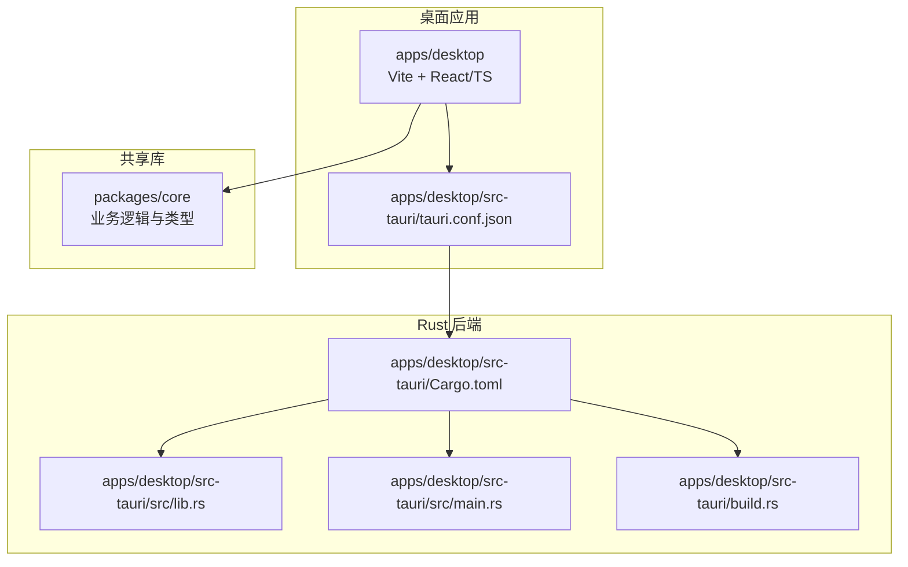
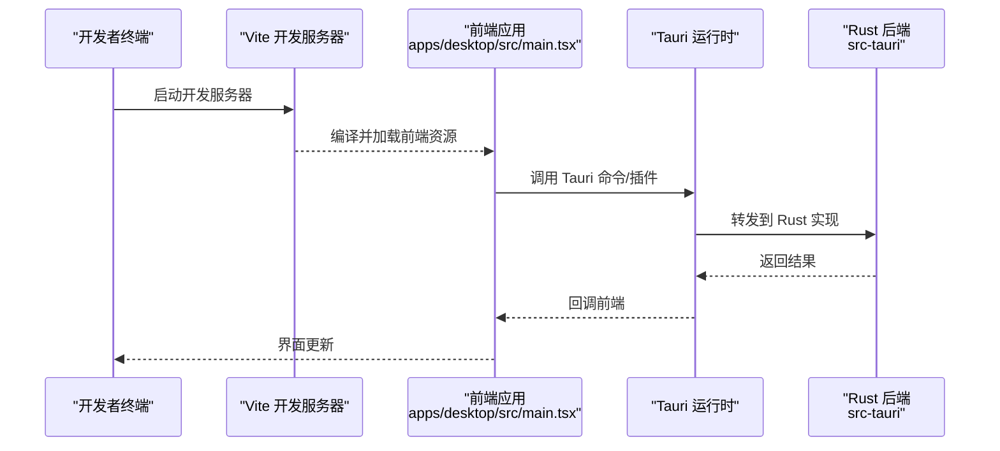
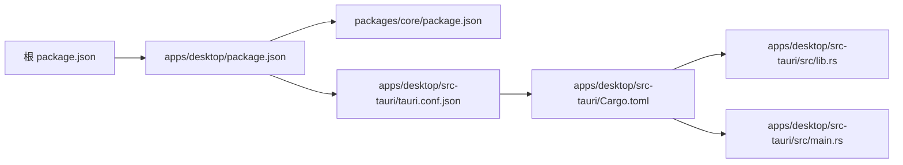

# 快速开始

<cite>
**本文引用的文件**   
- [README.md](file://README.md)
- [package.json](file://package.json)
- [apps/desktop/package.json](file://apps/desktop/package.json)
- [apps/desktop/tsconfig.json](file://apps/desktop/tsconfig.json)
- [apps/desktop/vite.config.ts](file://apps/desktop/vite.config.ts)
- [apps/desktop/src/main.tsx](file://apps/desktop/src/main.tsx)
- [apps/desktop/src-tauri/Cargo.toml](file://apps/desktop/src-tauri/Cargo.toml)
- [apps/desktop/src-tauri/tauri.conf.json](file://apps/desktop/src-tauri/tauri.conf.json)
- [apps/desktop/src-tauri/build.rs](file://apps/desktop/src-tauri/build.rs)
- [apps/desktop/src-tauri/src/lib.rs](file://apps/desktop/src-tauri/src/lib.rs)
- [apps/desktop/src-tauri/src/main.rs](file://apps/desktop/src-tauri/src/main.rs)
- [packages/core/package.json](file://packages/core/package.json)
- [scripts/sign-macos-app.sh](file://scripts/sign-macos-app.sh)
</cite>

## 目录
1. [简介](#简介)
2. [项目结构](#项目结构)
3. [核心组件](#核心组件)
4. [架构总览](#架构总览)
5. [详细组件分析](#详细组件分析)
6. [依赖关系分析](#依赖关系分析)
7. [性能注意事项](#性能注意事项)
8. [故障排除指南](#故障排除指南)
9. [结论](#结论)
10. [附录](#附录)

## 简介
本快速开始指南帮助你在最短时间内完成环境准备、克隆仓库、安装依赖、构建与运行，并了解桌面端应用的基本使用。该项目采用 Tauri + Vite + React/TypeScript 的桌面应用架构，前端位于 apps/desktop，后端 Rust 逻辑位于 apps/desktop/src-tauri，核心业务逻辑封装在 packages/core 中。

## 项目结构
- apps/desktop：桌面端应用（Vite + React/TS），通过 Tauri 打包为原生应用
- apps/desktop/src-tauri：Tauri 后端（Rust），负责系统能力调用、本地存储、OCR 等
- packages/core：跨平台共享的业务逻辑库（类型、工具函数、统计等）
- scripts：辅助脚本（如 macOS 签名）
- docs：产品与发布文档

图表来源
- [apps/desktop/package.json](file://apps/desktop/package.json)
- [apps/desktop/src-tauri/tauri.conf.json](file://apps/desktop/src-tauri/tauri.conf.json)
- [apps/desktop/src-tauri/Cargo.toml](file://apps/desktop/src-tauri/Cargo.toml)
- [apps/desktop/src-tauri/src/lib.rs](file://apps/desktop/src-tauri/src/lib.rs)
- [apps/desktop/src-tauri/src/main.rs](file://apps/desktop/src-tauri/src/main.rs)
- [apps/desktop/src-tauri/build.rs](file://apps/desktop/src-tauri/build.rs)
- [packages/core/package.json](file://packages/core/package.json)

章节来源
- [README.md](file://README.md)
- [apps/desktop/package.json](file://apps/desktop/package.json)
- [apps/desktop/tsconfig.json](file://apps/desktop/tsconfig.json)
- [apps/desktop/vite.config.ts](file://apps/desktop/vite.config.ts)
- [apps/desktop/src/main.tsx](file://apps/desktop/src/main.tsx)
- [apps/desktop/src-tauri/Cargo.toml](file://apps/desktop/src-tauri/Cargo.toml)
- [apps/desktop/src-tauri/tauri.conf.json](file://apps/desktop/src-tauri/tauri.conf.json)
- [apps/desktop/src-tauri/build.rs](file://apps/desktop/src-tauri/build.rs)
- [apps/desktop/src-tauri/src/lib.rs](file://apps/desktop/src-tauri/src/lib.rs)
- [apps/desktop/src-tauri/src/main.rs](file://apps/desktop/src-tauri/src/main.rs)
- [packages/core/package.json](file://packages/core/package.json)

## 核心组件
- 前端入口与配置
  - 入口文件：apps/desktop/src/main.tsx
  - 构建配置：apps/desktop/vite.config.ts
  - TypeScript 配置：apps/desktop/tsconfig.json
  - 包管理：apps/desktop/package.json
- Tauri 后端
  - 配置：apps/desktop/src-tauri/tauri.conf.json
  - Rust 工程：apps/desktop/src-tauri/Cargo.toml
  - 构建脚本：apps/desktop/src-tauri/build.rs
  - 主程序与模块：apps/desktop/src-tauri/src/main.rs、lib.rs
- 共享库
  - 包定义与导出：packages/core/package.json

章节来源
- [apps/desktop/src/main.tsx](file://apps/desktop/src/main.tsx)
- [apps/desktop/vite.config.ts](file://apps/desktop/vite.config.ts)
- [apps/desktop/tsconfig.json](file://apps/desktop/tsconfig.json)
- [apps/desktop/package.json](file://apps/desktop/package.json)
- [apps/desktop/src-tauri/tauri.conf.json](file://apps/desktop/src-tauri/tauri.conf.json)
- [apps/desktop/src-tauri/Cargo.toml](file://apps/desktop/src-tauri/Cargo.toml)
- [apps/desktop/src-tauri/build.rs](file://apps/desktop/src-tauri/build.rs)
- [apps/desktop/src-tauri/src/main.rs](file://apps/desktop/src-tauri/src/main.rs)
- [apps/desktop/src-tauri/src/lib.rs](file://apps/desktop/src-tauri/src/lib.rs)
- [packages/core/package.json](file://packages/core/package.json)

## 架构总览
该应用由前端 UI（React/TS + Vite）与 Tauri 后端（Rust）组成，通过 Tauri 命令进行前后端通信；共享业务逻辑集中在 packages/core，供前端和后端复用。

图表来源
- [apps/desktop/src/main.tsx](file://apps/desktop/src/main.tsx)
- [apps/desktop/src-tauri/src/main.rs](file://apps/desktop/src-tauri/src/main.rs)
- [apps/desktop/src-tauri/src/lib.rs](file://apps/desktop/src-tauri/src/lib.rs)
- [apps/desktop/src-tauri/tauri.conf.json](file://apps/desktop/src-tauri/tauri.conf.json)

## 详细组件分析

### 环境准备
- Node.js
  - 版本要求：请根据根 package.json 与 apps/desktop/package.json 中的引擎声明选择匹配的 LTS 版本
  - 建议通过 nvm 或 fnm 管理多版本
- Rust 工具链
  - 安装 rustup 与稳定版工具链
  - 确保 cargo、rustc、rustfmt 可用
- 平台相关依赖
  - Windows：可能需要 Visual Studio Build Tools 或 C++ 工作负载
  - macOS：Xcode Command Line Tools 与必要的签名证书（用于打包）
  - Linux：系统级依赖（如 GTK/WebKit 等，视目标平台而定）

章节来源
- [package.json](file://package.json)
- [apps/desktop/package.json](file://apps/desktop/package.json)
- [apps/desktop/src-tauri/Cargo.toml](file://apps/desktop/src-tauri/Cargo.toml)
- [scripts/sign-macos-app.sh](file://scripts/sign-macos-app.sh)

### 克隆与初始化
- 克隆仓库
  - git clone 仓库地址
  - 进入项目根目录
- 安装依赖
  - 使用 npm/yarn/pnpm 安装根与工作区依赖
  - 若使用 monorepo 工作区，确保包管理器支持 workspace 协议
- 首次构建
  - 执行构建命令以生成 Tauri 前端产物与 Rust 二进制

章节来源
- [package.json](file://package.json)
- [apps/desktop/package.json](file://apps/desktop/package.json)
- [apps/desktop/src-tauri/Cargo.toml](file://apps/desktop/src-tauri/Cargo.toml)

### 开发与生产运行
- 开发模式
  - 启动 Vite 开发服务器并联动 Tauri 调试
  - 热重载与前端调试
- 生产构建
  - 构建前端静态资源
  - 使用 Tauri CLI 打包为各平台安装包/可执行文件

章节来源
- [apps/desktop/vite.config.ts](file://apps/desktop/vite.config.ts)
- [apps/desktop/package.json](file://apps/desktop/package.json)
- [apps/desktop/src-tauri/tauri.conf.json](file://apps/desktop/src-tauri/tauri.conf.json)
- [apps/desktop/src-tauri/build.rs](file://apps/desktop/src-tauri/build.rs)

### 首次启动配置
- Tauri 配置
  - 检查 tauri.conf.json 中的窗口、权限、图标、URL 前缀等
- 环境变量
  - 如需接入外部服务或启用调试日志，可在开发模式下设置环境变量
- 本地数据
  - 首次运行将创建默认数据目录与配置文件

章节来源
- [apps/desktop/src-tauri/tauri.conf.json](file://apps/desktop/src-tauri/tauri.conf.json)
- [apps/desktop/src/main.tsx](file://apps/desktop/src/main.tsx)

### 基本使用教程
- 启动应用后，查看仪表盘与订阅列表
- 新增订阅项并设置到期提醒
- 查看统计视图与账单明细
- 使用设置面板调整语言、主题与通知选项

章节来源
- [apps/desktop/src/main.tsx](file://apps/desktop/src/main.tsx)
- [apps/desktop/package.json](file://apps/desktop/package.json)

## 依赖关系分析
- 前端依赖
  - React/TS、Vite、Tauri 前端 SDK
- 后端依赖
  - Rust crate 依赖（数据库、网络、OCR 等）
- 共享依赖
  - packages/core 提供类型与工具函数，被前端与后端共同引用

图表来源
- [package.json](file://package.json)
- [apps/desktop/package.json](file://apps/desktop/package.json)
- [packages/core/package.json](file://packages/core/package.json)
- [apps/desktop/src-tauri/tauri.conf.json](file://apps/desktop/src-tauri/tauri.conf.json)
- [apps/desktop/src-tauri/Cargo.toml](file://apps/desktop/src-tauri/Cargo.toml)
- [apps/desktop/src-tauri/src/lib.rs](file://apps/desktop/src-tauri/src/lib.rs)
- [apps/desktop/src-tauri/src/main.rs](file://apps/desktop/src-tauri/src/main.rs)

章节来源
- [package.json](file://package.json)
- [apps/desktop/package.json](file://apps/desktop/package.json)
- [packages/core/package.json](file://packages/core/package.json)
- [apps/desktop/src-tauri/tauri.conf.json](file://apps/desktop/src-tauri/tauri.conf.json)
- [apps/desktop/src-tauri/Cargo.toml](file://apps/desktop/src-tauri/Cargo.toml)

## 性能注意事项
- 前端
  - 合理拆分路由与组件，避免首屏过大
  - 使用 Vite 的代码分割与按需加载
- 后端
  - 避免阻塞主线程的重计算任务
  - 对 OCR 等耗时操作使用异步处理与进度反馈
- 数据持久化
  - 批量写入与增量同步，减少频繁 I/O

[本节为通用指导，不直接分析具体文件]

## 故障排除指南
- Node.js 版本不匹配
  - 现象：依赖安装失败或构建报错
  - 解决：切换至 package.json 指定的 Node 版本
- Rust 工具链缺失或版本过旧
  - 现象：cargo 构建失败、找不到编译器
  - 解决：安装最新稳定版工具链，并确保 PATH 正确
- 平台依赖缺失
  - Windows：缺少 C++ 构建工具
  - macOS：签名证书未配置导致打包失败
  - Linux：缺少 WebKit/GTK 等系统库
- Tauri 构建问题
  - 现象：前端资源路径错误或权限不足
  - 解决：检查 tauri.conf.json 与构建脚本，确认输出目录权限
- 首次运行无数据
  - 现象：界面空白或提示未初始化
  - 解决：确认应用有写入权限并成功创建默认数据目录

章节来源
- [apps/desktop/package.json](file://apps/desktop/package.json)
- [apps/desktop/src-tauri/Cargo.toml](file://apps/desktop/src-tauri/Cargo.toml)
- [apps/desktop/src-tauri/tauri.conf.json](file://apps/desktop/src-tauri/tauri.conf.json)
- [apps/desktop/src-tauri/build.rs](file://apps/desktop/src-tauri/build.rs)
- [scripts/sign-macos-app.sh](file://scripts/sign-macos-app.sh)

## 结论
通过以上步骤，你可以在本地快速搭建并运行桌面端应用，理解其基于 Tauri 的前后端协作方式，并掌握基本的日常使用。遇到问题时，优先检查 Node/Rust 环境与平台依赖，再逐步排查 Tauri 配置与构建脚本。

## 附录
- 常用命令参考
  - 安装依赖：在项目根目录执行包管理器安装命令
  - 开发运行：启动 Vite 并与 Tauri 联动调试
  - 生产构建：构建前端与打包 Tauri 应用
- 相关文档
  - 产品说明与发布流程见 docs 目录
  - macOS 签名与打包脚本见 scripts 目录

[本节为补充信息，不直接分析具体文件]