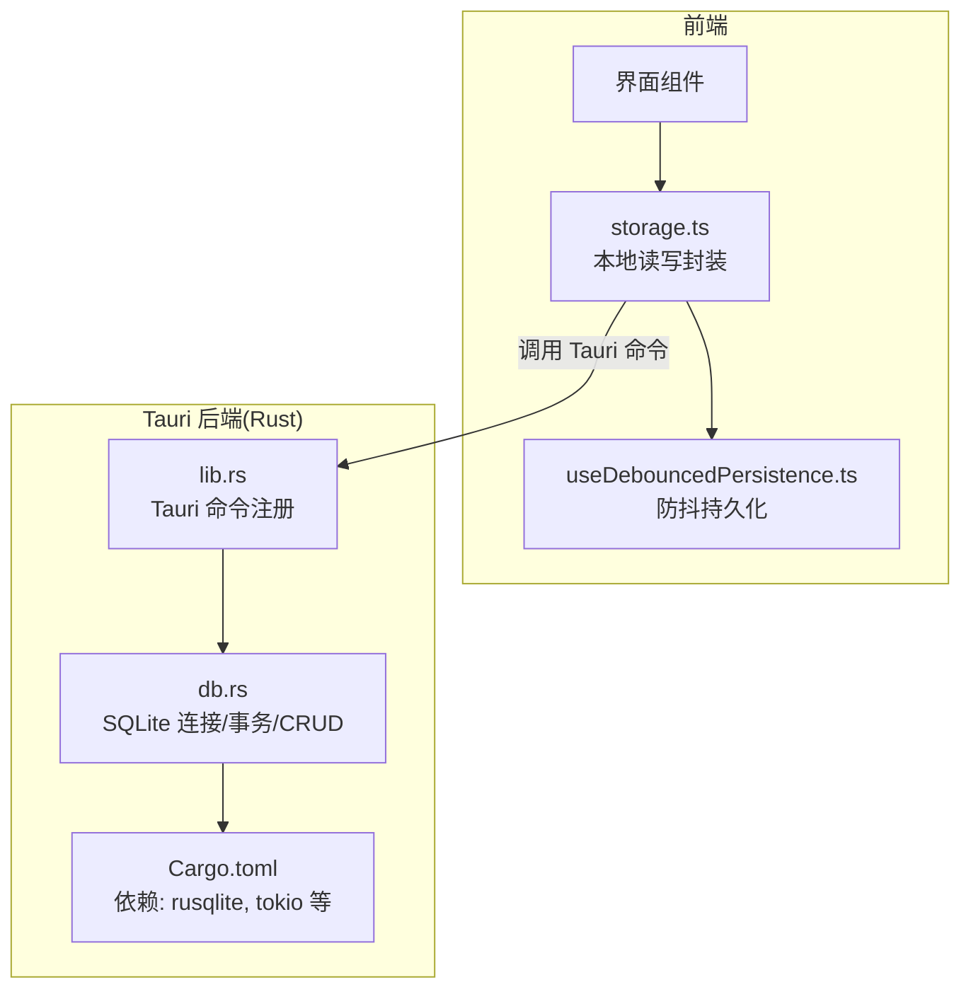
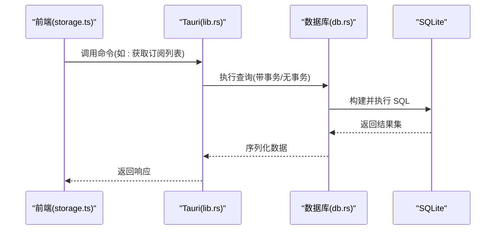
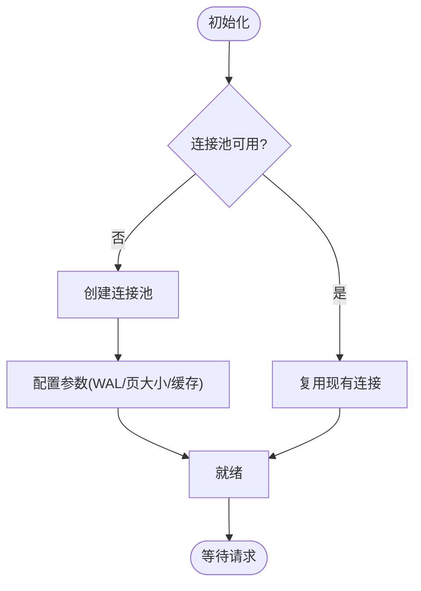
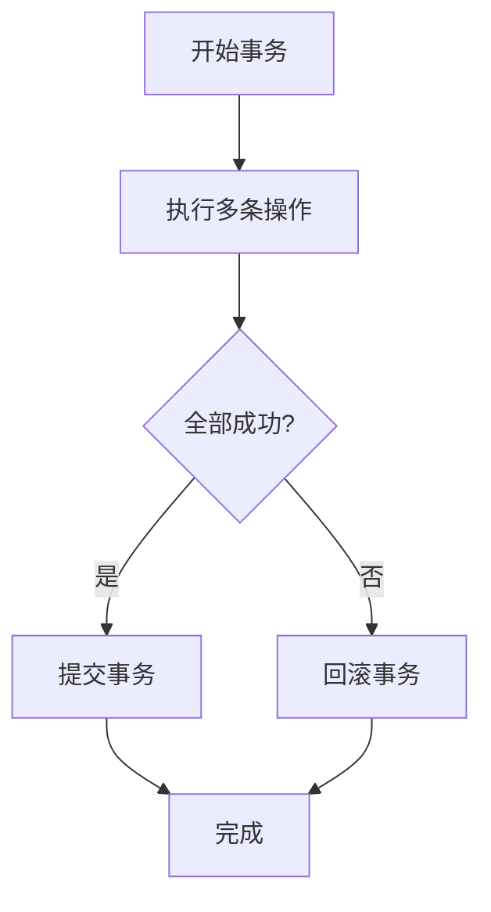
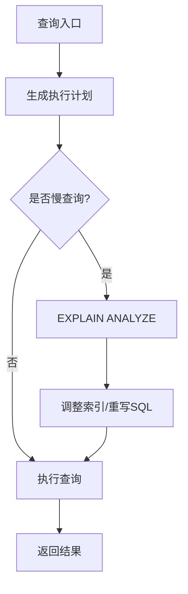
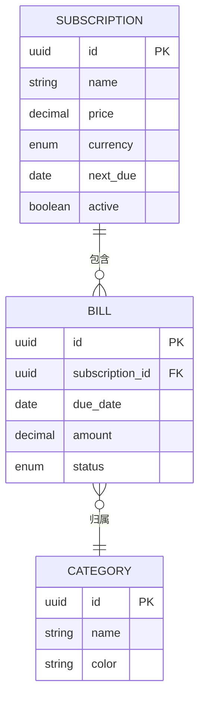
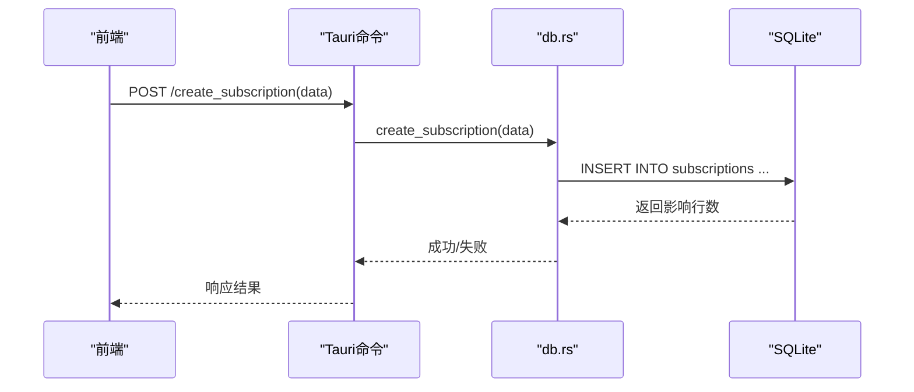
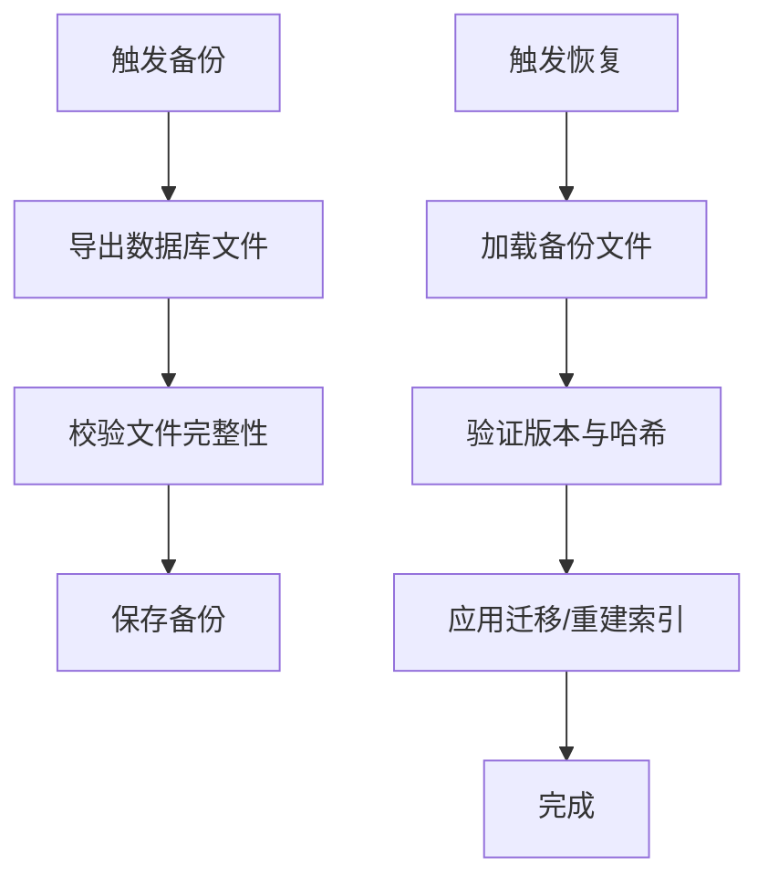
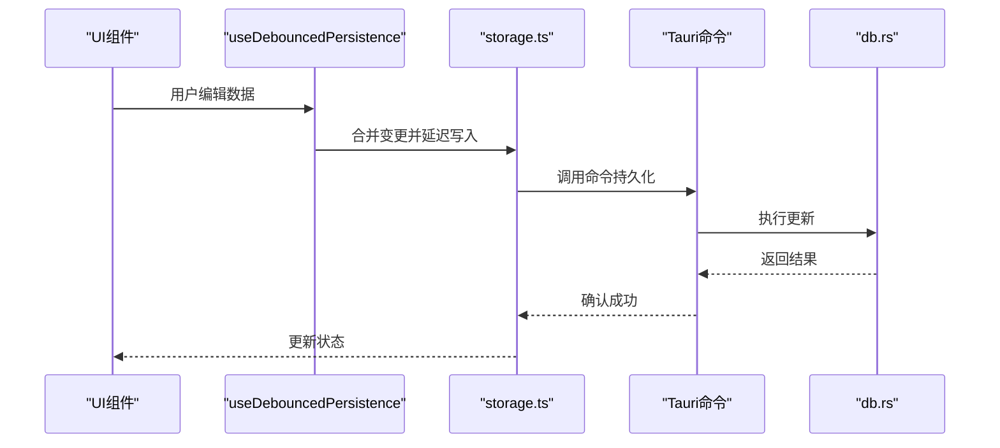
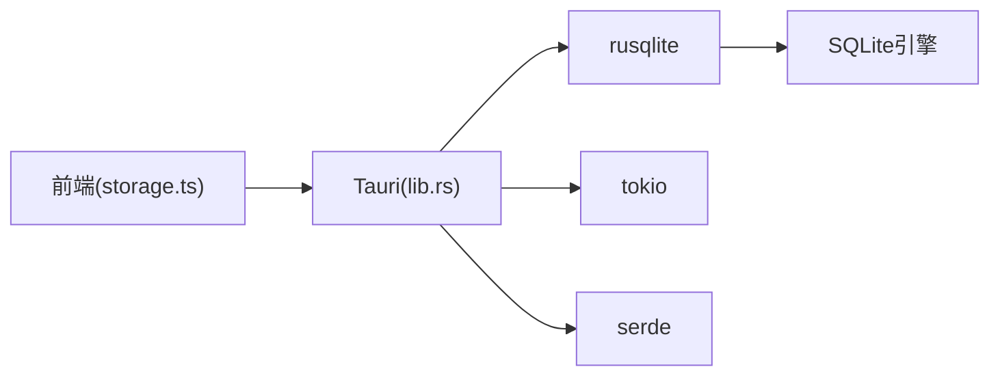

# 数据库层

<cite>
**本文引用的文件**   
- [apps/desktop/src-tauri/src/db.rs](file://apps/desktop/src-tauri/src/db.rs)
- [apps/desktop/src-tauri/src/lib.rs](file://apps/desktop/src-tauri/src/lib.rs)
- [apps/desktop/src-tauri/Cargo.toml](file://apps/desktop/src-tauri/Cargo.toml)
- [apps/desktop/src/storage.ts](file://apps/desktop/src/storage.ts)
- [apps/desktop/src/useDebouncedPersistence.ts](file://apps/desktop/src/useDebouncedPersistence.ts)
</cite>

## 目录
1. [简介](#简介)
2. [项目结构](#项目结构)
3. [核心组件](#核心组件)
4. [架构总览](#架构总览)
5. [详细组件分析](#详细组件分析)
6. [依赖关系分析](#依赖关系分析)
7. [性能考虑](#性能考虑)
8. [故障排查指南](#故障排查指南)
9. [结论](#结论)
10. [附录](#附录)

## 简介
本章节聚焦于 Rust 后端 SQLite 数据库层的实现与使用，涵盖连接管理、事务处理、查询优化、模式设计、CRUD 接口、异步机制、备份恢复与迁移、性能调优、索引优化以及与前端的数据同步和状态管理。文档以仓库中的 Rust Tauri 后端与前端 TypeScript 存储模块为依据进行说明，帮助读者快速理解并高效使用该数据库层。

## 项目结构
- Rust/Tauri 后端位于 apps/desktop/src-tauri，核心数据库逻辑集中在 db.rs，Tauri 命令入口在 lib.rs，依赖声明在 Cargo.toml。
- 前端通过 storage.ts 与 useDebouncedPersistence.ts 负责本地持久化与数据同步策略。

图表来源
- [apps/desktop/src-tauri/src/lib.rs](file://apps/desktop/src-tauri/src/lib.rs)
- [apps/desktop/src-tauri/src/db.rs](file://apps/desktop/src-tauri/src/db.rs)
- [apps/desktop/src-tauri/Cargo.toml](file://apps/desktop/src-tauri/Cargo.toml)
- [apps/desktop/src/storage.ts](file://apps/desktop/src/storage.ts)
- [apps/desktop/src/useDebouncedPersistence.ts](file://apps/desktop/src/useDebouncedPersistence.ts)

章节来源
- [apps/desktop/src-tauri/src/db.rs](file://apps/desktop/src-tauri/src/db.rs)
- [apps/desktop/src-tauri/src/lib.rs](file://apps/desktop/src-tauri/src/lib.rs)
- [apps/desktop/src-tauri/Cargo.toml](file://apps/desktop/src-tauri/Cargo.toml)
- [apps/desktop/src/storage.ts](file://apps/desktop/src/storage.ts)
- [apps/desktop/src/useDebouncedPersistence.ts](file://apps/desktop/src/useDebouncedPersistence.ts)

## 核心组件
- 连接管理：单例或线程安全的连接池，确保并发安全与资源释放。
- 事务处理：支持显式事务边界，保证一致性；提供自动提交与回滚策略。
- CRUD 接口：统一的增删改查方法，参数校验与错误传播。
- 异步机制：基于 Tokio 的异步 I/O，避免阻塞 UI 线程。
- 模式与表：定义必要的表结构与字段约束，便于扩展与维护。
- 备份与迁移：提供导出/导入与版本迁移脚本执行能力。
- 前端同步：通过 Tauri 命令桥接前端与后端，结合防抖策略降低写入频率。

章节来源
- [apps/desktop/src-tauri/src/db.rs](file://apps/desktop/src-tauri/src/db.rs)
- [apps/desktop/src-tauri/src/lib.rs](file://apps/desktop/src-tauri/src/lib.rs)
- [apps/desktop/src-tauri/Cargo.toml](file://apps/desktop/src-tauri/Cargo.toml)
- [apps/desktop/src/storage.ts](file://apps/desktop/src/storage.ts)
- [apps/desktop/src/useDebouncedPersistence.ts](file://apps/desktop/src/useDebouncedPersistence.ts)

## 架构总览
整体采用“前端轻量 + 后端集中”的架构：前端通过 Tauri 命令调用 Rust 后端，后端统一管理与 SQLite 的交互，包括连接、事务、CRUD、备份迁移等。

图表来源
- [apps/desktop/src-tauri/src/lib.rs](file://apps/desktop/src-tauri/src/lib.rs)
- [apps/desktop/src-tauri/src/db.rs](file://apps/desktop/src-tauri/src/db.rs)

## 详细组件分析

### 连接管理
- 连接生命周期：应用启动时初始化连接或连接池，关闭时释放资源。
- 并发安全：使用内部锁或连接池限制并发访问，避免竞争条件。
- 配置项：可配置 WAL 模式、页大小、缓存大小等以提升性能。
- 错误处理：连接失败重试、超时控制、日志记录。

章节来源
- [apps/desktop/src-tauri/src/db.rs](file://apps/desktop/src-tauri/src/db.rs)
- [apps/desktop/src-tauri/Cargo.toml](file://apps/desktop/src-tauri/Cargo.toml)

### 事务处理
- 事务边界：读多写少场景建议批量操作包裹在事务中，减少磁盘 IO。
- 隔离级别：默认读已提交，必要时提升隔离级别。
- 回滚策略：异常捕获后自动回滚，保证数据一致性。
- 嵌套事务：谨慎使用，避免复杂嵌套导致死锁。

章节来源
- [apps/desktop/src-tauri/src/db.rs](file://apps/desktop/src-tauri/src/db.rs)

### 查询优化
- 索引策略：为高频查询字段建立索引，避免全表扫描。
- 查询计划：使用 EXPLAIN ANALYZE 分析慢查询，优化 JOIN 与子查询。
- 分页与限制：合理使用 LIMIT/OFFSET 或游标分页。
- 批量写入：使用 INSERT OR REPLACE 或事务内批量插入。

章节来源
- [apps/desktop/src-tauri/src/db.rs](file://apps/desktop/src-tauri/src/db.rs)

### 模式设计与表结构
- 实体建模：订阅、账单、分类、统计等核心实体。
- 字段类型：选择合适的数据类型（整数、文本、日期时间、数值）。
- 约束与唯一性：主键、外键、唯一约束、非空约束。
- 版本管理：通过迁移脚本维护 schema 演进。

章节来源
- [apps/desktop/src-tauri/src/db.rs](file://apps/desktop/src-tauri/src/db.rs)

### CRUD 接口与异步机制
- 接口设计：统一的 create/read/update/delete 函数，输入输出明确。
- 异步模型：基于 Tokio 的 async/await，避免阻塞 UI。
- 错误传播：将数据库错误映射为业务错误，便于前端处理。
- 序列化：前后端数据通过 JSON 或结构化协议传输。

章节来源
- [apps/desktop/src-tauri/src/lib.rs](file://apps/desktop/src-tauri/src/lib.rs)
- [apps/desktop/src-tauri/src/db.rs](file://apps/desktop/src-tauri/src/db.rs)

### 备份、恢复与迁移
- 备份：导出完整数据库文件或增量快照。
- 恢复：从备份文件还原，支持校验完整性。
- 迁移：按版本号顺序执行迁移脚本，确保兼容性。
- 回滚：提供回滚脚本或快照切换机制。

章节来源
- [apps/desktop/src-tauri/src/db.rs](file://apps/desktop/src-tauri/src/db.rs)

### 前端数据同步与状态管理
- 本地存储：storage.ts 封装读写逻辑，优先本地缓存。
- 防抖持久化：useDebouncedPersistence.ts 合并频繁写入，降低 I/O 压力。
- 同步策略：变更事件驱动，按需拉取或推送更新。
- 冲突解决：基于时间戳或版本号合并差异。

章节来源
- [apps/desktop/src/storage.ts](file://apps/desktop/src/storage.ts)
- [apps/desktop/src/useDebouncedPersistence.ts](file://apps/desktop/src/useDebouncedPersistence.ts)
- [apps/desktop/src-tauri/src/lib.rs](file://apps/desktop/src-tauri/src/lib.rs)
- [apps/desktop/src-tauri/src/db.rs](file://apps/desktop/src-tauri/src/db.rs)

## 依赖关系分析
- Rust 依赖：rusqlite 用于 SQLite 交互，tokio 提供异步运行时，serde 用于序列化。
- Tauri 集成：lib.rs 注册命令，暴露给前端调用。
- 前端依赖：TypeScript 模块通过 Tauri 插件与后端通信。

图表来源
- [apps/desktop/src-tauri/Cargo.toml](file://apps/desktop/src-tauri/Cargo.toml)
- [apps/desktop/src-tauri/src/lib.rs](file://apps/desktop/src-tauri/src/lib.rs)
- [apps/desktop/src/storage.ts](file://apps/desktop/src/storage.ts)

章节来源
- [apps/desktop/src-tauri/Cargo.toml](file://apps/desktop/src-tauri/Cargo.toml)
- [apps/desktop/src-tauri/src/lib.rs](file://apps/desktop/src-tauri/src/lib.rs)
- [apps/desktop/src/storage.ts](file://apps/desktop/src/storage.ts)

## 性能考虑
- 连接池：合理设置最大连接数，避免过多上下文切换。
- WAL 模式：启用 Write-Ahead Logging 提升并发读性能。
- 索引优化：为常用过滤与排序字段添加索引，定期分析查询计划。
- 批量操作：合并多次写入为单次事务，减少磁盘 IO。
- 内存缓存：对热点数据使用内存缓存，降低数据库压力。
- 监控指标：记录慢查询、事务耗时、连接池利用率。

[本节为通用指导，不直接分析具体文件]

## 故障排查指南
- 连接失败：检查数据库路径、权限、WAL 文件完整性。
- 事务冲突：查看死锁日志，优化事务粒度与隔离级别。
- 查询缓慢：使用 EXPLAIN ANALYZE 定位瓶颈，调整索引或 SQL。
- 数据不一致：核对备份与恢复流程，确保迁移脚本幂等。
- 前端同步问题：检查防抖策略与网络/命令调用链路。

章节来源
- [apps/desktop/src-tauri/src/db.rs](file://apps/desktop/src-tauri/src/db.rs)
- [apps/desktop/src/storage.ts](file://apps/desktop/src/storage.ts)

## 结论
本数据库层以 Rust/Tauri 为核心，结合 SQLite 提供稳定高效的本地数据存储方案。通过清晰的连接管理、事务处理、查询优化与前后端同步机制，满足桌面应用对数据一致性与性能的要求。建议持续监控与调优，确保系统在高负载下的稳定性与可扩展性。

[本节为总结，不直接分析具体文件]

## 附录
- 最佳实践：
  - 始终在事务中执行批量写入。
  - 为高频查询字段建立复合索引。
  - 使用 WAL 模式提升并发读性能。
  - 定期备份与测试恢复流程。
- 常见问题：
  - 数据库被锁定：检查未提交事务与长事务。
  - 查询性能下降：分析执行计划，优化 SQL 与索引。
  - 前端状态不同步：检查防抖与命令调用链。

[本节为补充信息，不直接分析具体文件]