# 数据管理

<cite>
**本文引用的文件**   
- [apps/desktop/src/storage.ts](file://apps/desktop/src/storage.ts)
- [apps/desktop/src/useDebouncedPersistence.ts](file://apps/desktop/src/useDebouncedPersistence.ts)
- [packages/core/src/import.ts](file://packages/core/src/import.ts)
- [packages/core/src/normalize.ts](file://packages/core/src/normalize.ts)
- [packages/core/src/types.ts](file://packages/core/src/types.ts)
- [packages/core/src/load.ts](file://packages/core/src/load.ts)
- [packages/core/src/actions.ts](file://packages/core/src/actions.ts)
- [packages/core/src/defaults.ts](file://packages/core/src/defaults.ts)
- [apps/desktop/src/subscriptionFields.ts](file://apps/desktop/src/subscriptionFields.ts)
- [apps/desktop/src/subTableHandlers.ts](file://apps/desktop/src/subTableHandlers.ts)
- [apps/desktop/src/BillsView.tsx](file://apps/desktop/src/BillsView.tsx)
- [apps/desktop/src/PendingView.tsx](file://apps/desktop/src/PendingView.tsx)
</cite>

## 目录
1. [简介](#简介)
2. [项目结构](#项目结构)
3. [核心组件](#核心组件)
4. [架构总览](#架构总览)
5. [详细组件分析](#详细组件分析)
6. [依赖关系分析](#依赖关系分析)
7. [性能考量](#性能考量)
8. [故障排查指南](#故障排查指南)
9. [结论](#结论)
10. [附录](#附录)

## 简介
本文件面向订阅管理应用的数据管理子系统，围绕本地存储策略、数据结构设计、useDebouncedPersistence 钩子实现与用法、数据导入导出（CSV/JSON）、数据验证与规范化、数据同步与冲突解决、备份与恢复、以及数据迁移与版本兼容性进行系统化说明。文档以仓库中的实际代码为依据，提供架构图、流程图和时序图，帮助读者快速理解并正确使用相关能力。

## 项目结构
数据管理相关代码主要分布在以下位置：
- 桌面端 UI 层：负责用户交互、表单处理与视图渲染，调用持久化与导入导出能力
- 核心库 core：提供类型定义、默认值、数据加载、导入导出、规范化、动作与统计等通用能力
- Tauri/Rust 后端：提供底层数据库访问（SQLite）与 OCR 等能力（不在本文重点范围内）

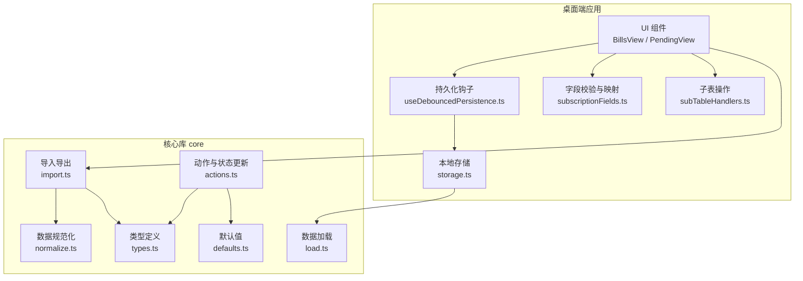

图表来源
- [apps/desktop/src/BillsView.tsx](file://apps/desktop/src/BillsView.tsx)
- [apps/desktop/src/PendingView.tsx](file://apps/desktop/src/PendingView.tsx)
- [apps/desktop/src/storage.ts](file://apps/desktop/src/storage.ts)
- [apps/desktop/src/useDebouncedPersistence.ts](file://apps/desktop/src/useDebouncedPersistence.ts)
- [apps/desktop/src/subscriptionFields.ts](file://apps/desktop/src/subscriptionFields.ts)
- [apps/desktop/src/subTableHandlers.ts](file://apps/desktop/src/subTableHandlers.ts)
- [packages/core/src/types.ts](file://packages/core/src/types.ts)
- [packages/core/src/defaults.ts](file://packages/core/src/defaults.ts)
- [packages/core/src/load.ts](file://packages/core/src/load.ts)
- [packages/core/src/import.ts](file://packages/core/src/import.ts)
- [packages/core/src/normalize.ts](file://packages/core/src/normalize.ts)
- [packages/core/src/actions.ts](file://packages/core/src/actions.ts)

章节来源
- [apps/desktop/src/storage.ts](file://apps/desktop/src/storage.ts)
- [apps/desktop/src/useDebouncedPersistence.ts](file://apps/desktop/src/useDebouncedPersistence.ts)
- [packages/core/src/import.ts](file://packages/core/src/import.ts)
- [packages/core/src/normalize.ts](file://packages/core/src/normalize.ts)
- [packages/core/src/types.ts](file://packages/core/src/types.ts)
- [packages/core/src/load.ts](file://packages/core/src/load.ts)
- [packages/core/src/actions.ts](file://packages/core/src/actions.ts)
- [packages/core/src/defaults.ts](file://packages/core/src/defaults.ts)
- [apps/desktop/src/subscriptionFields.ts](file://apps/desktop/src/subscriptionFields.ts)
- [apps/desktop/src/subTableHandlers.ts](file://apps/desktop/src/subTableHandlers.ts)
- [apps/desktop/src/BillsView.tsx](file://apps/desktop/src/BillsView.tsx)
- [apps/desktop/src/PendingView.tsx](file://apps/desktop/src/PendingView.tsx)

## 核心组件
- 本地存储 storage.ts：封装浏览器或桌面端的本地存储接口，提供读写、批量写入与事务性更新能力，确保 UI 状态与持久化一致。
- 持久化钩子 useDebouncedPersistence.ts：在状态变化时进行防抖持久化，减少频繁 I/O 开销，保证最终一致性。
- 导入导出 import.ts：支持 CSV/JSON 的解析与生成，包含列映射、类型转换与错误收集。
- 数据规范化 normalize.ts：对导入数据进行清洗、补全、去重与格式统一，确保进入系统的数据符合类型约束。
- 类型与默认值 types.ts、defaults.ts：统一定义数据模型、枚举、必填项与默认值，为验证与规范化提供依据。
- 数据加载 load.ts：从本地存储或外部源加载数据，提供缓存与懒加载策略。
- 动作 actions.ts：定义增删改查等状态变更动作，配合 UI 层与持久化层形成统一的状态流。

章节来源
- [apps/desktop/src/storage.ts](file://apps/desktop/src/storage.ts)
- [apps/desktop/src/useDebouncedPersistence.ts](file://apps/desktop/src/useDebouncedPersistence.ts)
- [packages/core/src/import.ts](file://packages/core/src/import.ts)
- [packages/core/src/normalize.ts](file://packages/core/src/normalize.ts)
- [packages/core/src/types.ts](file://packages/core/src/types.ts)
- [packages/core/src/defaults.ts](file://packages/core/src/defaults.ts)
- [packages/core/src/load.ts](file://packages/core/src/load.ts)
- [packages/core/src/actions.ts](file://packages/core/src/actions.ts)

## 架构总览
数据管理采用“UI 层 + 持久化层 + 核心库”的分层架构。UI 层通过 hooks 与 handlers 触发动作；持久化层负责将状态落盘；核心库提供类型、默认值、导入导出与规范化能力。整体流程强调“最终一致性”与“可回滚”，并通过规范化与验证保障数据质量。

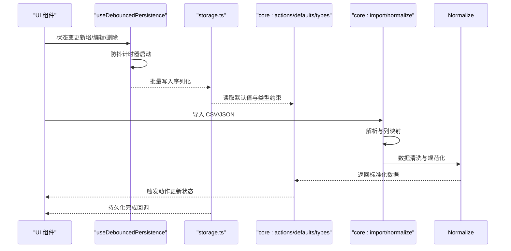

图表来源
- [apps/desktop/src/useDebouncedPersistence.ts](file://apps/desktop/src/useDebouncedPersistence.ts)
- [apps/desktop/src/storage.ts](file://apps/desktop/src/storage.ts)
- [packages/core/src/actions.ts](file://packages/core/src/actions.ts)
- [packages/core/src/defaults.ts](file://packages/core/src/defaults.ts)
- [packages/core/src/types.ts](file://packages/core/src/types.ts)
- [packages/core/src/import.ts](file://packages/core/src/import.ts)
- [packages/core/src/normalize.ts](file://packages/core/src/normalize.ts)

## 详细组件分析

### 本地存储策略与数据结构
- 存储介质与键空间：按模块划分键空间（如订阅、账单、设置），避免键冲突；支持 JSON 序列化对象数组与配置对象。
- 写入策略：优先批量写入与事务性更新，减少 I/O 次数；失败时保留旧数据并提供重试机制。
- 数据结构设计：基于 types.ts 定义的主实体（订阅、账单、分类、提醒等），defaults.ts 提供默认字段与枚举值；所有实体具备唯一标识与时间戳。
- 读写性能：大列表分页加载与懒加载结合，避免一次性加载全部数据；关键路径使用内存缓存。

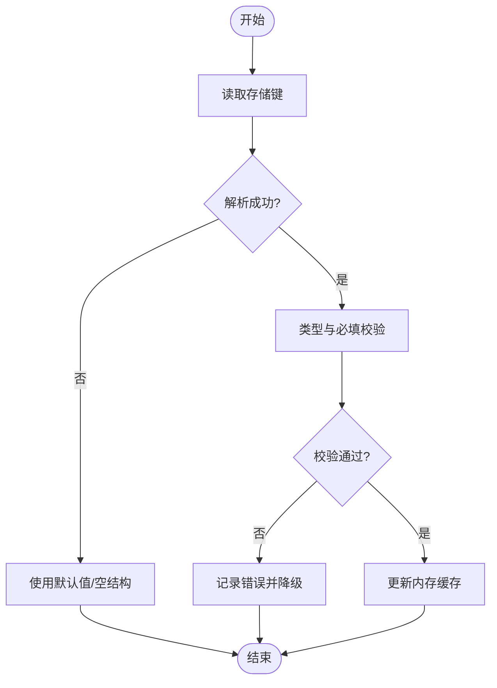

图表来源
- [apps/desktop/src/storage.ts](file://apps/desktop/src/storage.ts)
- [packages/core/src/types.ts](file://packages/core/src/types.ts)
- [packages/core/src/defaults.ts](file://packages/core/src/defaults.ts)

章节来源
- [apps/desktop/src/storage.ts](file://apps/desktop/src/storage.ts)
- [packages/core/src/types.ts](file://packages/core/src/types.ts)
- [packages/core/src/defaults.ts](file://packages/core/src/defaults.ts)

### useDebouncedPersistence 钩子实现原理与使用方法
- 实现原理：监听状态变化，启动防抖定时器；在延迟后执行一次批量持久化，避免高频写入；支持取消与强制立即保存。
- 使用方法：在组件中传入状态与持久化键，钩子内部维护防抖逻辑与写入回调；组件无需关心 I/O 细节。
- 最佳实践：对大对象或数组进行分片写入；对关键操作（如删除）可选择立即保存。

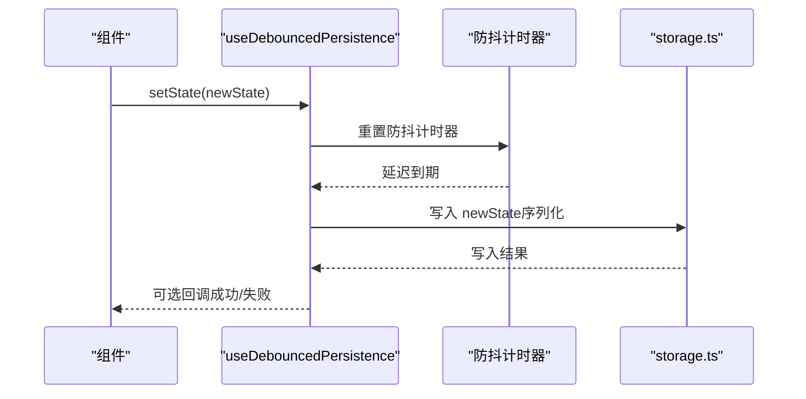

图表来源
- [apps/desktop/src/useDebouncedPersistence.ts](file://apps/desktop/src/useDebouncedPersistence.ts)
- [apps/desktop/src/storage.ts](file://apps/desktop/src/storage.ts)

章节来源
- [apps/desktop/src/useDebouncedPersistence.ts](file://apps/desktop/src/useDebouncedPersistence.ts)
- [apps/desktop/src/storage.ts](file://apps/desktop/src/storage.ts)

### 数据导入导出功能（CSV/JSON）
- 导入流程：读取文件内容 -> 解析为原始行/对象 -> 列映射与类型转换 -> 规范化与校验 -> 合并到现有数据 -> 触发 UI 更新。
- 导出流程：读取当前状态 -> 序列化为目标格式（CSV/JSON）-> 生成下载链接或文件。
- 错误处理：逐行错误收集与报告，允许部分成功；对缺失字段提供默认值或跳过策略。

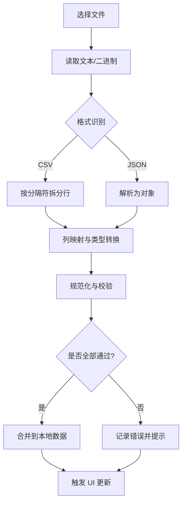

图表来源
- [packages/core/src/import.ts](file://packages/core/src/import.ts)
- [packages/core/src/normalize.ts](file://packages/core/src/normalize.ts)
- [packages/core/src/types.ts](file://packages/core/src/types.ts)

章节来源
- [packages/core/src/import.ts](file://packages/core/src/import.ts)
- [packages/core/src/normalize.ts](file://packages/core/src/normalize.ts)
- [packages/core/src/types.ts](file://packages/core/src/types.ts)

### 数据验证与规范化流程
- 验证规则：基于 types.ts 的字段类型、必填项与取值范围；defaults.ts 提供默认值填充。
- 规范化步骤：去除空白字符、统一日期与金额格式、归一化分类名称、去重与合并重复项。
- 输出：标准化的数据对象数组，可直接用于 UI 展示与持久化。

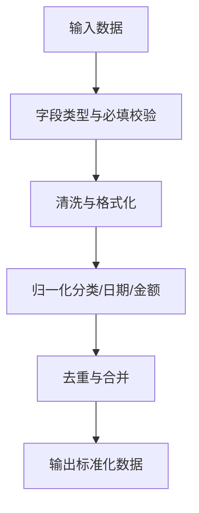

图表来源
- [packages/core/src/normalize.ts](file://packages/core/src/normalize.ts)
- [packages/core/src/types.ts](file://packages/core/src/types.ts)
- [packages/core/src/defaults.ts](file://packages/core/src/defaults.ts)

章节来源
- [packages/core/src/normalize.ts](file://packages/core/src/normalize.ts)
- [packages/core/src/types.ts](file://packages/core/src/types.ts)
- [packages/core/src/defaults.ts](file://packages/core/src/defaults.ts)

### 数据同步机制与冲突解决策略
- 同步机制：UI 状态变更通过 actions.ts 触发，持久化层异步写入；必要时提供乐观更新与回滚。
- 冲突解决：基于唯一标识进行增量合并；对并发修改采用“最后写入胜出”或“字段级合并”策略；提供冲突日志与用户确认。
- 一致性保障：写入前校验版本号或时间戳，避免覆盖新数据；失败时重试与降级。

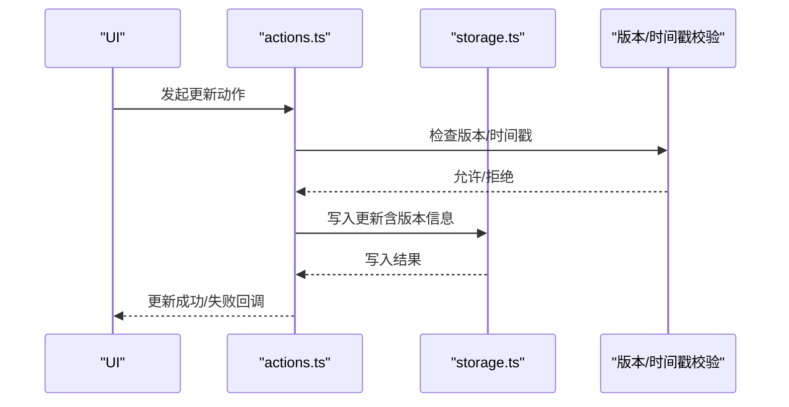

图表来源
- [packages/core/src/actions.ts](file://packages/core/src/actions.ts)
- [apps/desktop/src/storage.ts](file://apps/desktop/src/storage.ts)

章节来源
- [packages/core/src/actions.ts](file://packages/core/src/actions.ts)
- [apps/desktop/src/storage.ts](file://apps/desktop/src/storage.ts)

### 数据备份与恢复操作指南
- 备份：导出为 JSON/CSV，建议包含元数据（版本、时间戳、来源）。
- 恢复：导入备份文件，系统进行规范化与校验；冲突时提示用户选择合并策略。
- 安全建议：备份文件加密存储；恢复前进行完整性校验。

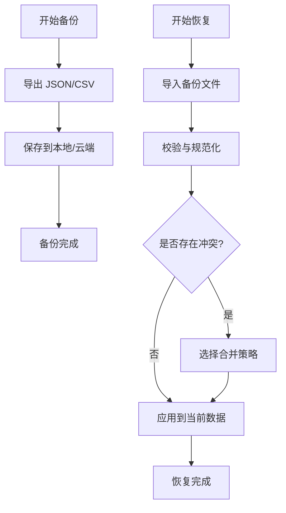

图表来源
- [packages/core/src/import.ts](file://packages/core/src/import.ts)
- [packages/core/src/normalize.ts](file://packages/core/src/normalize.ts)

章节来源
- [packages/core/src/import.ts](file://packages/core/src/import.ts)
- [packages/core/src/normalize.ts](file://packages/core/src/normalize.ts)

### 数据迁移与版本兼容性处理方案
- 版本管理：在数据对象中嵌入 schema_version 字段；升级时检测版本并执行迁移脚本。
- 迁移策略：向后兼容（新增字段有默认值）、向前兼容（忽略未知字段）；提供回滚脚本。
- 测试与验证：迁移前后进行数据完整性校验与抽样对比。

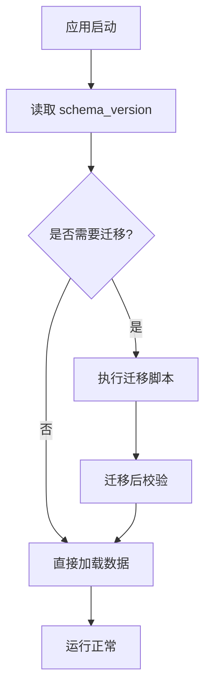

图表来源
- [packages/core/src/load.ts](file://packages/core/src/load.ts)
- [packages/core/src/types.ts](file://packages/core/src/types.ts)

章节来源
- [packages/core/src/load.ts](file://packages/core/src/load.ts)
- [packages/core/src/types.ts](file://packages/core/src/types.ts)

### 字段校验与子表操作
- 字段校验：subscriptionFields.ts 定义各字段的校验规则与显示标签，确保表单输入正确。
- 子表操作：subTableHandlers.ts 提供子表的增删改与排序逻辑，与主表保持关联一致性。

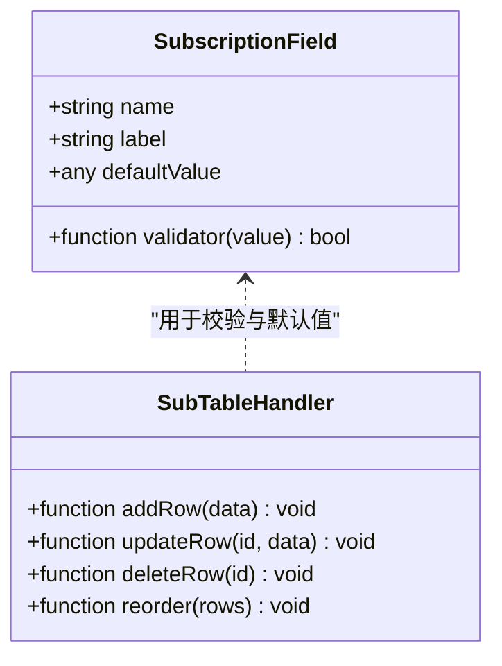

图表来源
- [apps/desktop/src/subscriptionFields.ts](file://apps/desktop/src/subscriptionFields.ts)
- [apps/desktop/src/subTableHandlers.ts](file://apps/desktop/src/subTableHandlers.ts)

章节来源
- [apps/desktop/src/subscriptionFields.ts](file://apps/desktop/src/subscriptionFields.ts)
- [apps/desktop/src/subTableHandlers.ts](file://apps/desktop/src/subTableHandlers.ts)

## 依赖关系分析
- UI 层依赖持久化钩子与字段校验，间接依赖核心库的类型与默认值。
- 导入导出依赖规范化与类型定义，确保数据一致性。
- 动作层与持久化层解耦，便于扩展与替换存储实现。

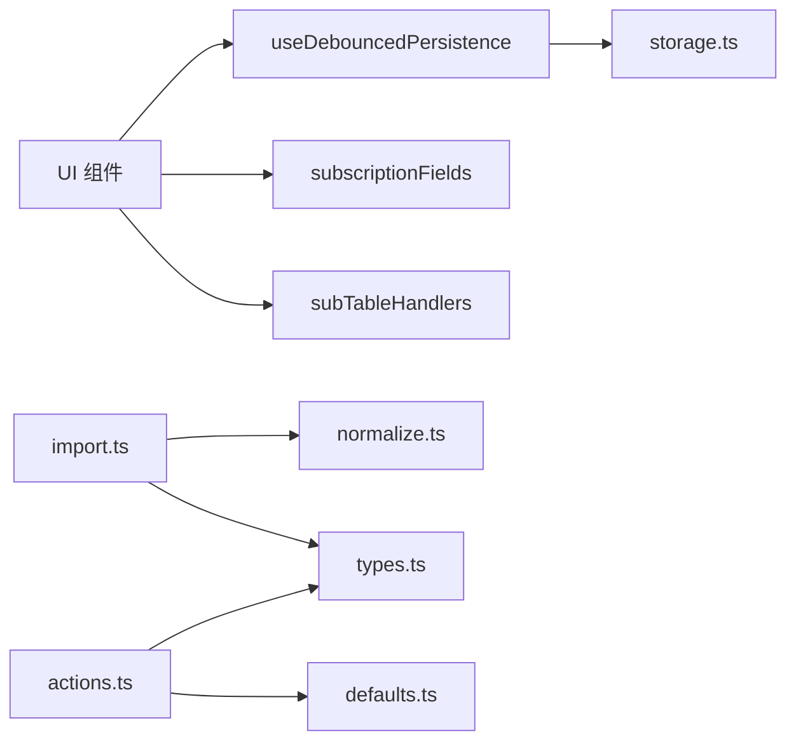

图表来源
- [apps/desktop/src/BillsView.tsx](file://apps/desktop/src/BillsView.tsx)
- [apps/desktop/src/PendingView.tsx](file://apps/desktop/src/PendingView.tsx)
- [apps/desktop/src/useDebouncedPersistence.ts](file://apps/desktop/src/useDebouncedPersistence.ts)
- [apps/desktop/src/storage.ts](file://apps/desktop/src/storage.ts)
- [apps/desktop/src/subscriptionFields.ts](file://apps/desktop/src/subscriptionFields.ts)
- [apps/desktop/src/subTableHandlers.ts](file://apps/desktop/src/subTableHandlers.ts)
- [packages/core/src/import.ts](file://packages/core/src/import.ts)
- [packages/core/src/normalize.ts](file://packages/core/src/normalize.ts)
- [packages/core/src/types.ts](file://packages/core/src/types.ts)
- [packages/core/src/actions.ts](file://packages/core/src/actions.ts)
- [packages/core/src/defaults.ts](file://packages/core/src/defaults.ts)

章节来源
- [apps/desktop/src/BillsView.tsx](file://apps/desktop/src/BillsView.tsx)
- [apps/desktop/src/PendingView.tsx](file://apps/desktop/src/PendingView.tsx)
- [apps/desktop/src/useDebouncedPersistence.ts](file://apps/desktop/src/useDebouncedPersistence.ts)
- [apps/desktop/src/storage.ts](file://apps/desktop/src/storage.ts)
- [apps/desktop/src/subscriptionFields.ts](file://apps/desktop/src/subscriptionFields.ts)
- [apps/desktop/src/subTableHandlers.ts](file://apps/desktop/src/subTableHandlers.ts)
- [packages/core/src/import.ts](file://packages/core/src/import.ts)
- [packages/core/src/normalize.ts](file://packages/core/src/normalize.ts)
- [packages/core/src/types.ts](file://packages/core/src/types.ts)
- [packages/core/src/actions.ts](file://packages/core/src/actions.ts)
- [packages/core/src/defaults.ts](file://packages/core/src/defaults.ts)

## 性能考量
- 防抖持久化：useDebouncedPersistence 降低 I/O 频率，提升响应速度。
- 批量写入：storage.ts 支持批量操作，减少磁盘写放大。
- 懒加载与分页：load.ts 按需加载数据，避免首屏阻塞。
- 内存缓存：热点数据缓存于内存，缩短查询路径。

[本节为通用指导，不直接分析具体文件]

## 故障排查指南
- 导入失败：检查文件格式与编码；查看错误日志定位异常行；确认列映射是否正确。
- 持久化失败：检查存储空间与权限；重试写入并记录失败原因；必要时回滚到上次快照。
- 数据不一致：核对版本号与时间戳；检查并发写入冲突；使用规范化重新对齐数据。

章节来源
- [packages/core/src/import.ts](file://packages/core/src/import.ts)
- [apps/desktop/src/storage.ts](file://apps/desktop/src/storage.ts)
- [packages/core/src/normalize.ts](file://packages/core/src/normalize.ts)

## 结论
本数据管理方案通过分层架构、防抖持久化、严格验证与规范化、以及完善的导入导出与迁移机制，实现了高可用、可扩展且易维护的数据管理能力。建议在后续迭代中持续优化性能与用户体验，并加强错误监控与日志采集。

[本节为总结性内容，不直接分析具体文件]

## 附录
- 术语表：schema_version、规范化、防抖、乐观更新、回滚、增量合并
- 参考文件清单见“本文引用的文件”

[本节为补充信息，不直接分析具体文件]