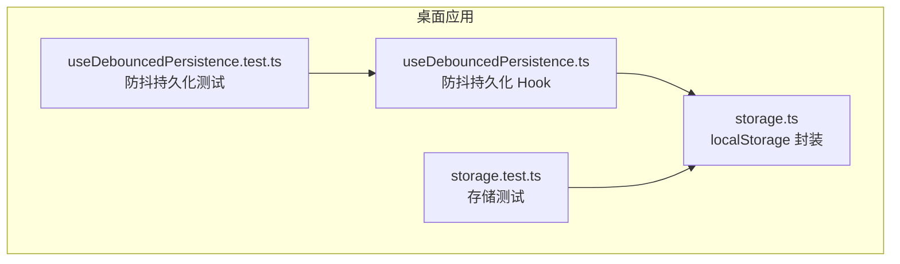
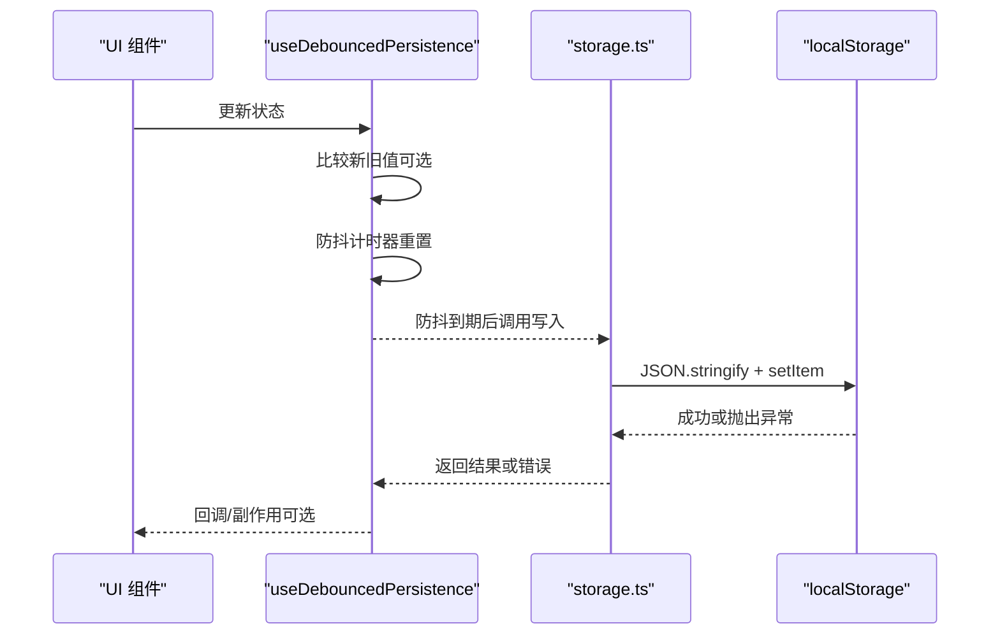
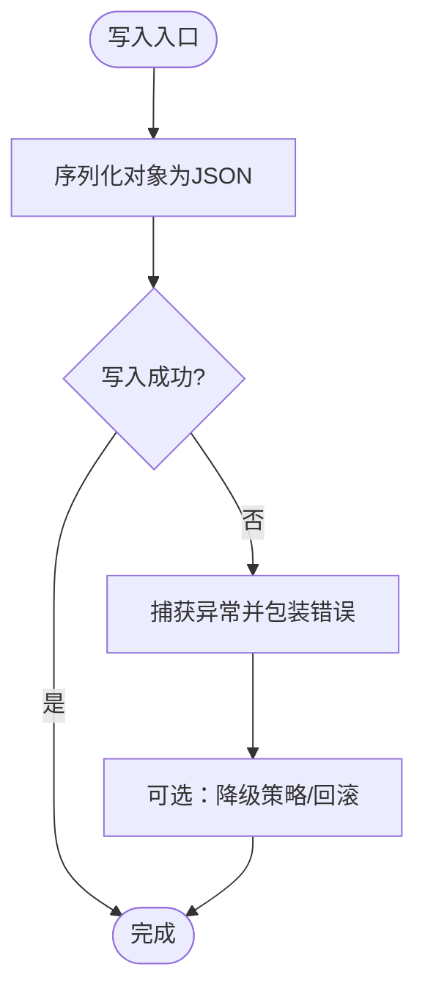
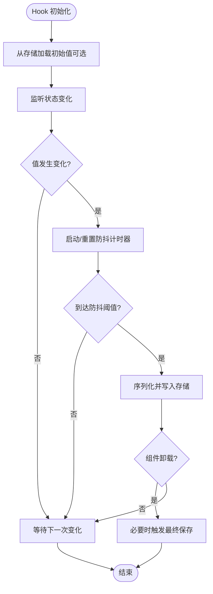
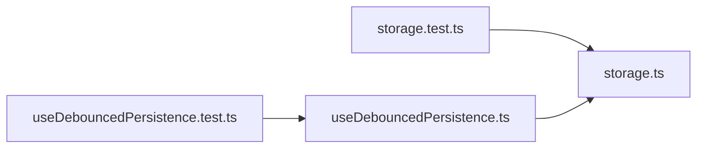

# 本地存储

<cite>
**本文引用的文件**   
- [storage.ts](file://apps/desktop/src/storage.ts)
- [useDebouncedPersistence.ts](file://apps/desktop/src/useDebouncedPersistence.ts)
- [storage.test.ts](file://apps/desktop/src/storage.test.ts)
- [useDebouncedPersistence.test.ts](file://apps/desktop/src/useDebouncedPersistence.test.ts)
</cite>

## 目录
1. [简介](#简介)
2. [项目结构](#项目结构)
3. [核心组件](#核心组件)
4. [架构总览](#架构总览)
5. [详细组件分析](#详细组件分析)
6. [依赖关系分析](#依赖关系分析)
7. [性能考量](#性能考量)
8. [故障排查指南](#故障排查指南)
9. [结论](#结论)
10. [附录](#附录)

## 简介
本文件面向“本地存储”能力，聚焦以下目标：
- 详细说明 storage.ts 中 localStorage 的封装与数据结构设计
- 解释 useDebouncedPersistence 钩子的防抖持久化机制（变更检测、自动保存策略、性能优化）
- 明确存储键值命名规范与数据序列化格式
- 提供存储操作的最佳实践与错误处理方案
- 给出存储容量管理与清理策略

## 项目结构
与本地存储相关的代码位于桌面应用模块 apps/desktop/src 下，关键文件如下：
- storage.ts：localStorage 的读写封装、键空间管理、序列化/反序列化、错误处理
- useDebouncedPersistence.ts：基于防抖的持久化 React Hook，负责状态到存储的自动同步
- storage.test.ts：对 storage.ts 的行为进行单元测试覆盖
- useDebouncedPersistence.test.ts：对防抖持久化 Hook 的行为进行单元测试覆盖

图表来源 
- [storage.ts](file://apps/desktop/src/storage.ts)
- [useDebouncedPersistence.ts](file://apps/desktop/src/useDebouncedPersistence.ts)
- [storage.test.ts](file://apps/desktop/src/storage.test.ts)
- [useDebouncedPersistence.test.ts](file://apps/desktop/src/useDebouncedPersistence.test.ts)

章节来源
- [storage.ts](file://apps/desktop/src/storage.ts)
- [useDebouncedPersistence.ts](file://apps/desktop/src/useDebouncedPersistence.ts)
- [storage.test.ts](file://apps/desktop/src/storage.test.ts)
- [useDebouncedPersistence.test.ts](file://apps/desktop/src/useDebouncedPersistence.test.ts)

## 核心组件
- localStorage 封装层（storage.ts）
  - 提供统一的读取、写入、删除接口
  - 统一处理 JSON 序列化/反序列化
  - 集中捕获并上报 StorageError
  - 维护键空间前缀与命名约定
- 防抖持久化 Hook（useDebouncedPersistence.ts）
  - 监听状态变化，按防抖阈值批量落盘
  - 支持自定义比较函数以减少不必要的写入
  - 在组件卸载时确保最终一致性（必要时触发一次保存）

章节来源
- [storage.ts](file://apps/desktop/src/storage.ts)
- [useDebouncedPersistence.ts](file://apps/desktop/src/useDebouncedPersistence.ts)

## 架构总览
下图展示了 Hook 与存储层的交互流程：Hook 负责变更检测与调度，存储层负责安全读写与序列化。

图表来源 
- [useDebouncedPersistence.ts](file://apps/desktop/src/useDebouncedPersistence.ts)
- [storage.ts](file://apps/desktop/src/storage.ts)

## 详细组件分析

### storage.ts：localStorage 封装与数据结构
- 职责边界
  - 读：根据键名获取字符串并解析为对象
  - 写：将对象序列化为字符串并写入
  - 删：移除指定键
  - 错误：捕获并包装为统一错误类型
- 数据结构设计
  - 所有键采用统一前缀，避免与其他模块冲突
  - 键名遵循“模块_实体_字段”三段式，便于检索与清理
  - 值统一为可 JSON 序列化的对象或数组
- 序列化与兼容性
  - 写入前执行序列化；读取失败时回退到默认值
  - 版本迁移可通过在值中携带 schemaVersion 字段实现
- 错误处理
  - 捕获 JSON 解析异常、配额超限、权限不足等
  - 对外暴露结构化错误信息，便于上层重试或降级

图表来源 
- [storage.ts](file://apps/desktop/src/storage.ts)

章节来源
- [storage.ts](file://apps/desktop/src/storage.ts)
- [storage.test.ts](file://apps/desktop/src/storage.test.ts)

### useDebouncedPersistence.ts：防抖持久化 Hook
- 变更检测
  - 使用浅比较或自定义比较函数判断是否需要持久化
  - 避免无意义写入，降低 I/O 压力
- 防抖策略
  - 每次状态更新重置定时器，达到阈值后再执行一次保存
  - 支持最大保存间隔与最小间隔配置
- 自动保存时机
  - 组件卸载时若存在未保存变更，触发最后一次保存以保证一致性
  - 可在外部触发强制保存（如导出、切换页面）
- 性能优化
  - 合并多次变更，减少序列化与 I/O 次数
  - 可选惰性加载：仅在首次访问时从存储初始化状态
  - 支持选择性持久化：仅对需要落盘的字段启用 Hook

图表来源 
- [useDebouncedPersistence.ts](file://apps/desktop/src/useDebouncedPersistence.ts)

章节来源
- [useDebouncedPersistence.ts](file://apps/desktop/src/useDebouncedPersistence.ts)
- [useDebouncedPersistence.test.ts](file://apps/desktop/src/useDebouncedPersistence.test.ts)

## 依赖关系分析
- Hook 依赖存储层提供的读写接口，不直接操作 localStorage
- 测试文件分别验证存储层与 Hook 的行为，保证契约稳定
- 通过清晰的接口边界，降低耦合度，便于替换后端存储或增加缓存层

图表来源 
- [useDebouncedPersistence.ts](file://apps/desktop/src/useDebouncedPersistence.ts)
- [storage.ts](file://apps/desktop/src/storage.ts)
- [useDebouncedPersistence.test.ts](file://apps/desktop/src/useDebouncedPersistence.test.ts)
- [storage.test.ts](file://apps/desktop/src/storage.test.ts)

章节来源
- [useDebouncedPersistence.ts](file://apps/desktop/src/useDebouncedPersistence.ts)
- [storage.ts](file://apps/desktop/src/storage.ts)
- [useDebouncedPersistence.test.ts](file://apps/desktop/src/useDebouncedPersistence.test.ts)
- [storage.test.ts](file://apps/desktop/src/storage.test.ts)

## 性能考量
- 序列化成本
  - 大对象频繁序列化会显著影响性能，建议拆分数据或按需持久化
- I/O 频率
  - 通过防抖合并写入，减少 setItem 调用次数
- 内存占用
  - 避免在 Hook 中持有过大的中间态，及时释放引用
- 首屏加载
  - 可选择异步加载与懒初始化，缩短渲染阻塞时间
- 并发写入
  - 单进程内串行写入，避免竞态导致的数据覆盖

[本节为通用指导，不直接分析具体文件]

## 故障排查指南
- 常见错误
  - JSON 解析失败：检查对象是否包含不可序列化的属性（如函数、循环引用）
  - 存储空间不足：提示用户清理或迁移至其他存储介质
  - 权限受限：确认浏览器/环境允许访问 localStorage
- 定位步骤
  - 查看存储层抛出的错误类型与消息
  - 校验键名是否符合命名规范
  - 检查 Hook 的比较函数是否正确，避免误判导致不保存
- 恢复策略
  - 提供默认值回退
  - 支持增量修复：尝试部分字段恢复
  - 记录错误日志以便后续分析

章节来源
- [storage.ts](file://apps/desktop/src/storage.ts)
- [useDebouncedPersistence.ts](file://apps/desktop/src/useDebouncedPersistence.ts)

## 结论
- storage.ts 提供了稳定、可测试的 localStorage 封装，统一了序列化、错误处理与键空间管理
- useDebouncedPersistence.ts 以防抖为核心，兼顾一致性与性能，适合高频状态持久化场景
- 通过明确的命名规范与错误处理策略，系统具备良好的可维护性与可扩展性

[本节为总结性内容，不直接分析具体文件]

## 附录

### 存储键值命名规范
- 前缀：应用或模块标识（例如：app_）
- 主体：业务实体（例如：subscription、settings）
- 字段：具体字段或集合（例如：list、meta）
- 示例模式：app_subscription_list、app_settings_meta
- 版本控制：在值对象中包含 schemaVersion，便于未来迁移

### 数据序列化格式
- 统一 JSON 文本
- 推荐结构：{ data, schemaVersion, updatedAt }
- 禁止包含函数、Symbol、循环引用等不可序列化项

### 最佳实践
- 写入前校验数据有效性
- 使用比较函数避免无变更写入
- 对敏感数据考虑加密或脱敏
- 为重要数据提供备份与恢复能力
- 在跨标签页场景中注意事件同步（如 storage 事件）

### 容量管理与清理策略
- 监控存储用量，超过阈值时触发清理
- 清理优先级：过期数据 > 非关键数据 > 历史快照
- 提供用户可见的清理入口与统计信息
- 定期归档与压缩旧数据

[本节为通用指导，不直接分析具体文件]