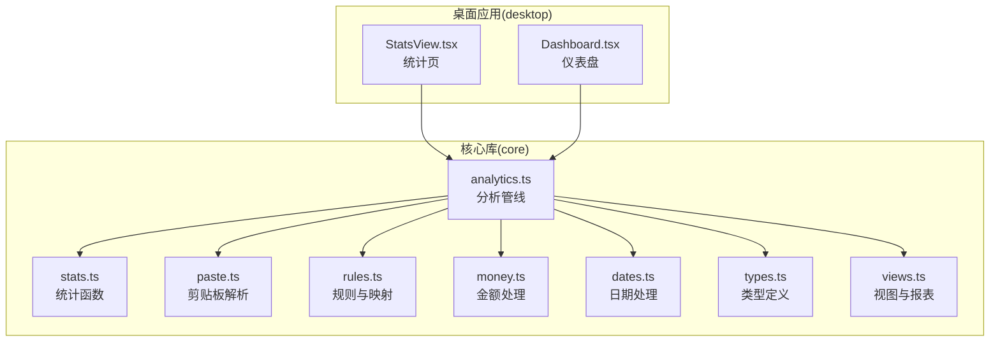
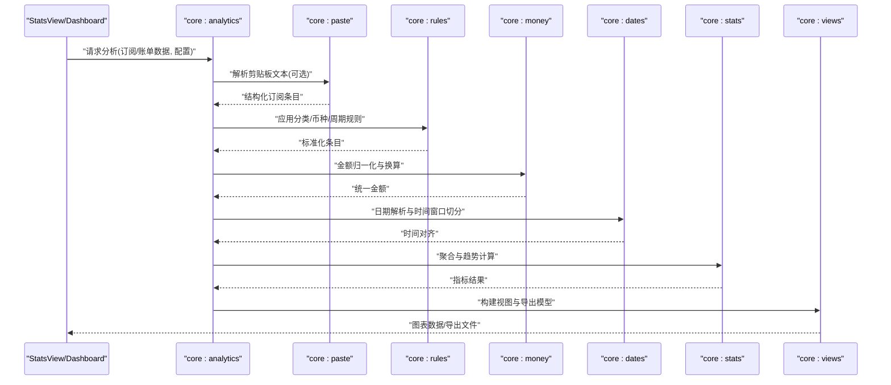
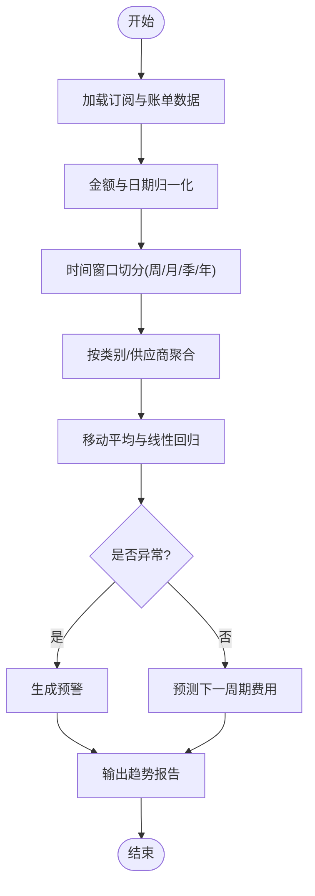
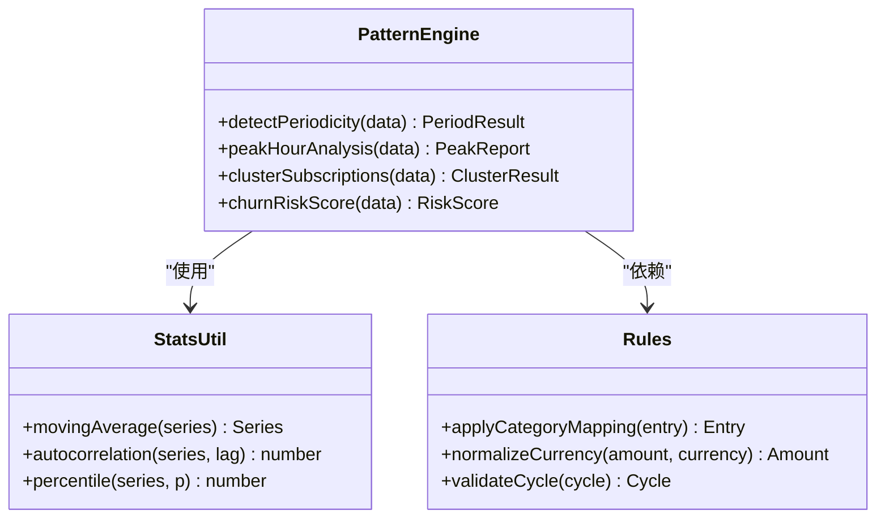
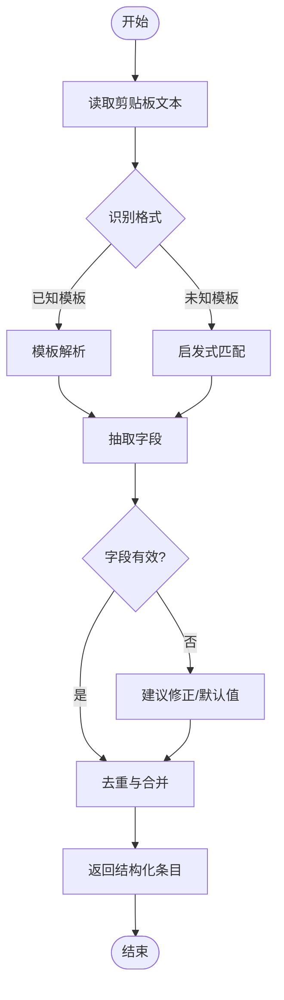
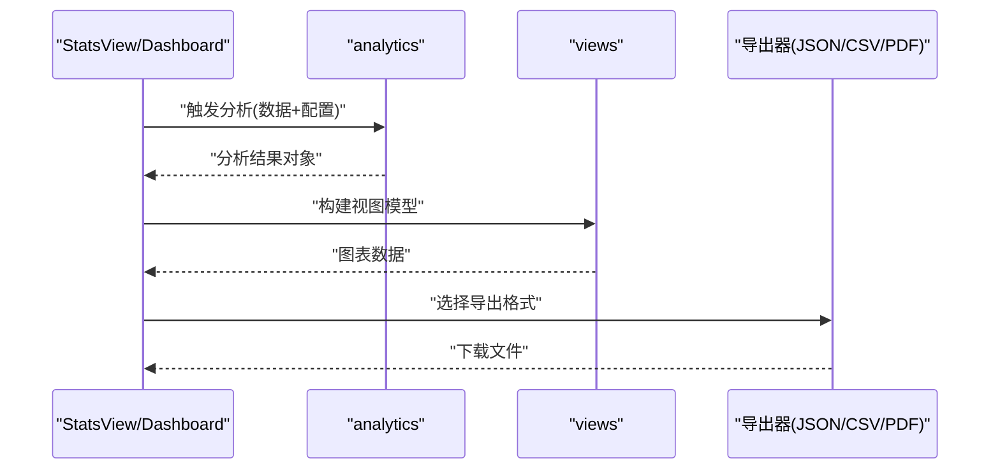
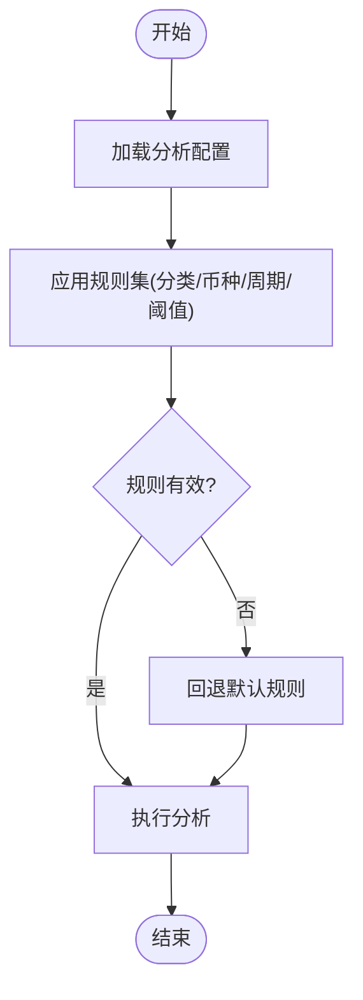
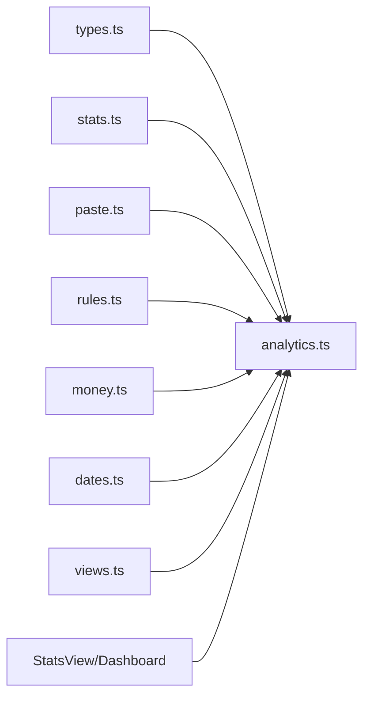

# 分析统计

<cite>
**本文引用的文件**   
- [packages/core/src/analytics.ts](file://packages/core/src/analytics.ts)
- [packages/core/src/stats.ts](file://packages/core/src/stats.ts)
- [packages/core/src/paste.ts](file://packages/core/src/paste.ts)
- [packages/core/src/rules.ts](file://packages/core/src/rules.ts)
- [packages/core/src/money.ts](file://packages/core/src/money.ts)
- [packages/core/src/dates.ts](file://packages/core/src/dates.ts)
- [packages/core/src/types.ts](file://packages/core/src/types.ts)
- [packages/core/src/views.ts](file://packages/core/src/views.ts)
- [apps/desktop/src/StatsView.tsx](file://apps/desktop/src/StatsView.tsx)
- [apps/desktop/src/Dashboard.tsx](file://apps/desktop/src/Dashboard.tsx)
</cite>

## 目录
1. [简介](#简介)
2. [项目结构](#项目结构)
3. [核心组件](#核心组件)
4. [架构总览](#架构总览)
5. [详细组件分析](#详细组件分析)
6. [依赖关系分析](#依赖关系分析)
7. [性能考虑](#性能考虑)
8. [故障排查指南](#故障排查指南)
9. [结论](#结论)
10. [附录](#附录)

## 简介
本文件围绕核心库的分析统计功能进行系统化说明，覆盖费用趋势分析、使用模式识别、剪贴板解析与导入、分析结果生成与导出、配置选项与自定义规则实现，以及数据隐私保护与性能优化建议。目标读者包括产品与运营人员、前端开发者与桌面端集成者，力求以循序渐进的方式呈现从概念到实现的完整知识体系。

## 项目结构
核心分析统计能力集中在 packages/core 模块中，UI 层在 apps/desktop 提供可视化展示与交互入口。关键文件职责概览：
- analytics.ts：分析管线编排、指标聚合、趋势计算、模式识别等高层逻辑
- stats.ts：基础统计函数（均值、方差、分位数、移动平均等）
- paste.ts：剪贴板文本解析，支持多种订阅信息格式自动识别与结构化
- rules.ts：分析规则与映射规则（分类、币种、周期、阈值等）
- money.ts：金额规范化、货币换算、精度控制
- dates.ts：日期解析、周期对齐、时间窗口切分
- types.ts：数据结构定义（订阅项、账单、视图、分析结果等）
- views.ts：视图与报表的构建与序列化
- StatsView.tsx / Dashboard.tsx：桌面端统计页面与仪表盘，调用 core 能力并渲染图表

**图示来源**
- [packages/core/src/analytics.ts](file://packages/core/src/analytics.ts)
- [packages/core/src/stats.ts](file://packages/core/src/stats.ts)
- [packages/core/src/paste.ts](file://packages/core/src/paste.ts)
- [packages/core/src/rules.ts](file://packages/core/src/rules.ts)
- [packages/core/src/money.ts](file://packages/core/src/money.ts)
- [packages/core/src/dates.ts](file://packages/core/src/dates.ts)
- [packages/core/src/types.ts](file://packages/core/src/types.ts)
- [packages/core/src/views.ts](file://packages/core/src/views.ts)
- [apps/desktop/src/StatsView.tsx](file://apps/desktop/src/StatsView.tsx)
- [apps/desktop/src/Dashboard.tsx](file://apps/desktop/src/Dashboard.tsx)

**章节来源**
- [packages/core/src/analytics.ts](file://packages/core/src/analytics.ts)
- [packages/core/src/stats.ts](file://packages/core/src/stats.ts)
- [packages/core/src/paste.ts](file://packages/core/src/paste.ts)
- [packages/core/src/rules.ts](file://packages/core/src/rules.ts)
- [packages/core/src/money.ts](file://packages/core/src/money.ts)
- [packages/core/src/dates.ts](file://packages/core/src/dates.ts)
- [packages/core/src/types.ts](file://packages/core/src/types.ts)
- [packages/core/src/views.ts](file://packages/core/src/views.ts)
- [apps/desktop/src/StatsView.tsx](file://apps/desktop/src/StatsView.tsx)
- [apps/desktop/src/Dashboard.tsx](file://apps/desktop/src/Dashboard.tsx)

## 核心组件
- 分析管线（analytics.ts）
  - 负责将原始订阅与账单数据清洗、归一化后，按时间窗口聚合，计算费用趋势、类别占比、峰值时段、续订预测等指标，并输出可导出的分析结果对象。
- 统计函数（stats.ts）
  - 提供均值、方差、标准差、分位数、移动平均、线性回归斜率等基础统计工具，供趋势与模式识别算法复用。
- 剪贴板解析（paste.ts）
  - 解析用户粘贴的订阅信息文本，自动识别平台、服务名、价格、币种、计费周期、到期日等字段，支持多格式模板与模糊匹配。
- 规则系统（rules.ts）
  - 定义分类映射、币种换算、周期标准化、阈值告警、异常值过滤等规则，支持运行时扩展与优先级排序。
- 金额处理（money.ts）
  - 统一金额单位与精度，处理汇率换算、舍入策略、负数与折扣表示。
- 日期处理（dates.ts）
  - 解析不同日期格式，对齐到周/月/季度/年等时间粒度，计算间隔与到期提醒。
- 类型定义（types.ts）
  - 统一定义订阅项、账单记录、视图、分析结果、规则配置等数据结构。
- 视图与报表（views.ts）
  - 将分析结果序列化为前端图表可用的视图模型，支持分页、筛选、分组与导出格式（JSON/CSV）。

**章节来源**
- [packages/core/src/analytics.ts](file://packages/core/src/analytics.ts)
- [packages/core/src/stats.ts](file://packages/core/src/stats.ts)
- [packages/core/src/paste.ts](file://packages/core/src/paste.ts)
- [packages/core/src/rules.ts](file://packages/core/src/rules.ts)
- [packages/core/src/money.ts](file://packages/core/src/money.ts)
- [packages/core/src/dates.ts](file://packages/core/src/dates.ts)
- [packages/core/src/types.ts](file://packages/core/src/types.ts)
- [packages/core/src/views.ts](file://packages/core/src/views.ts)

## 架构总览
分析统计的整体流程如下：输入订阅与账单数据 → 剪贴板解析与规则映射 → 金额与日期归一化 → 统计聚合与趋势计算 → 模式识别与预警 → 生成视图与导出。

**图示来源**
- [packages/core/src/analytics.ts](file://packages/core/src/analytics.ts)
- [packages/core/src/paste.ts](file://packages/core/src/paste.ts)
- [packages/core/src/rules.ts](file://packages/core/src/rules.ts)
- [packages/core/src/money.ts](file://packages/core/src/money.ts)
- [packages/core/src/dates.ts](file://packages/core/src/dates.ts)
- [packages/core/src/stats.ts](file://packages/core/src/stats.ts)
- [packages/core/src/views.ts](file://packages/core/src/views.ts)
- [apps/desktop/src/StatsView.tsx](file://apps/desktop/src/StatsView.tsx)
- [apps/desktop/src/Dashboard.tsx](file://apps/desktop/src/Dashboard.tsx)

## 详细组件分析

### 费用趋势分析
- 时间窗口聚合：按周/月/季/年对账单金额进行汇总，支持滚动窗口与同比/环比计算。
- 趋势拟合：基于移动平均与线性回归斜率判断上升/下降趋势，结合分位数检测异常波动。
- 类别贡献度：按服务类别或供应商维度拆分费用，计算占比与变化幅度。
- 预测与预警：根据历史斜率与季节性特征，估算未来周期费用，设置阈值触发提醒。

**图示来源**
- [packages/core/src/analytics.ts](file://packages/core/src/analytics.ts)
- [packages/core/src/stats.ts](file://packages/core/src/stats.ts)
- [packages/core/src/money.ts](file://packages/core/src/money.ts)
- [packages/core/src/dates.ts](file://packages/core/src/dates.ts)

**章节来源**
- [packages/core/src/analytics.ts](file://packages/core/src/analytics.ts)
- [packages/core/src/stats.ts](file://packages/core/src/stats.ts)
- [packages/core/src/money.ts](file://packages/core/src/money.ts)
- [packages/core/src/dates.ts](file://packages/core/src/dates.ts)

### 使用模式识别
- 周期性识别：通过自相关与周期检测算法识别月度/季度/年度续费规律。
- 高峰时段：统计续费发生的小时/星期分布，定位集中续费时段。
- 行为聚类：依据消费金额、频率、类别偏好对用户订阅组合进行聚类，发现相似群体。
- 流失风险：基于续费延迟、取消迹象与使用活跃度评估流失概率。

**图示来源**
- [packages/core/src/analytics.ts](file://packages/core/src/analytics.ts)
- [packages/core/src/stats.ts](file://packages/core/src/stats.ts)
- [packages/core/src/rules.ts](file://packages/core/src/rules.ts)

**章节来源**
- [packages/core/src/analytics.ts](file://packages/core/src/analytics.ts)
- [packages/core/src/stats.ts](file://packages/core/src/stats.ts)
- [packages/core/src/rules.ts](file://packages/core/src/rules.ts)

### 剪贴板解析与导入
- 多格式支持：识别常见订阅平台文本模板（如邮件通知、网页复制），支持正则与启发式匹配。
- 字段抽取：提取服务名、价格、币种、计费周期、到期日、链接等关键字段。
- 容错与补全：缺失字段采用默认值或规则推断，重复条目去重合并。
- 导入校验：返回结构化订阅条目列表，附带解析置信度与错误提示。

**图示来源**
- [packages/core/src/paste.ts](file://packages/core/src/paste.ts)
- [packages/core/src/rules.ts](file://packages/core/src/rules.ts)
- [packages/core/src/types.ts](file://packages/core/src/types.ts)

**章节来源**
- [packages/core/src/paste.ts](file://packages/core/src/paste.ts)
- [packages/core/src/rules.ts](file://packages/core/src/rules.ts)
- [packages/core/src/types.ts](file://packages/core/src/types.ts)

### 分析结果生成与导出
- 结果模型：包含趋势曲线、类别占比、峰值时段、预测区间、预警事件等。
- 视图构建：将结果转换为前端图表所需的数据结构，支持分组、筛选与分页。
- 导出格式：支持 JSON（完整分析）、CSV（表格数据）、PDF（报告摘要）等。
- 版本兼容：导出模型包含版本号与元数据，便于后续升级与回溯。

**图示来源**
- [packages/core/src/analytics.ts](file://packages/core/src/analytics.ts)
- [packages/core/src/views.ts](file://packages/core/src/views.ts)
- [apps/desktop/src/StatsView.tsx](file://apps/desktop/src/StatsView.tsx)
- [apps/desktop/src/Dashboard.tsx](file://apps/desktop/src/Dashboard.tsx)

**章节来源**
- [packages/core/src/analytics.ts](file://packages/core/src/analytics.ts)
- [packages/core/src/views.ts](file://packages/core/src/views.ts)
- [apps/desktop/src/StatsView.tsx](file://apps/desktop/src/StatsView.tsx)
- [apps/desktop/src/Dashboard.tsx](file://apps/desktop/src/Dashboard.tsx)

### 分析配置与自定义规则
- 配置项：时间窗口粒度、币种与汇率源、分类映射表、阈值与告警级别、导出格式与字段选择。
- 规则扩展：新增分类映射、币种换算、周期标准化、异常值过滤规则；支持优先级与条件分支。
- 规则验证：运行时校验规则合法性，失败时回退到默认规则并记录日志。
- 动态更新：支持热更新规则集，无需重启即可生效。

**图示来源**
- [packages/core/src/rules.ts](file://packages/core/src/rules.ts)
- [packages/core/src/analytics.ts](file://packages/core/src/analytics.ts)

**章节来源**
- [packages/core/src/rules.ts](file://packages/core/src/rules.ts)
- [packages/core/src/analytics.ts](file://packages/core/src/analytics.ts)

## 依赖关系分析
- 内聚性：analytics.ts 作为编排中心，低耦合地调用 stats、paste、rules、money、dates、views 等模块，职责清晰。
- 耦合点：
  - analytics.ts 依赖 types.ts 的数据结构契约
  - paste.ts 与 rules.ts 共享字段映射与校验逻辑
  - money.ts 与 dates.ts 为 analytics.ts 提供基础处理能力
- 外部依赖：UI 层仅依赖 core 暴露的接口，不直接访问内部实现，便于替换与测试。

**图示来源**
- [packages/core/src/types.ts](file://packages/core/src/types.ts)
- [packages/core/src/analytics.ts](file://packages/core/src/analytics.ts)
- [packages/core/src/stats.ts](file://packages/core/src/stats.ts)
- [packages/core/src/paste.ts](file://packages/core/src/paste.ts)
- [packages/core/src/rules.ts](file://packages/core/src/rules.ts)
- [packages/core/src/money.ts](file://packages/core/src/money.ts)
- [packages/core/src/dates.ts](file://packages/core/src/dates.ts)
- [packages/core/src/views.ts](file://packages/core/src/views.ts)
- [apps/desktop/src/StatsView.tsx](file://apps/desktop/src/StatsView.tsx)
- [apps/desktop/src/Dashboard.tsx](file://apps/desktop/src/Dashboard.tsx)

**章节来源**
- [packages/core/src/analytics.ts](file://packages/core/src/analytics.ts)
- [packages/core/src/types.ts](file://packages/core/src/types.ts)
- [packages/core/src/stats.ts](file://packages/core/src/stats.ts)
- [packages/core/src/paste.ts](file://packages/core/src/paste.ts)
- [packages/core/src/rules.ts](file://packages/core/src/rules.ts)
- [packages/core/src/money.ts](file://packages/core/src/money.ts)
- [packages/core/src/dates.ts](file://packages/core/src/dates.ts)
- [packages/core/src/views.ts](file://packages/core/src/views.ts)
- [apps/desktop/src/StatsView.tsx](file://apps/desktop/src/StatsView.tsx)
- [apps/desktop/src/Dashboard.tsx](file://apps/desktop/src/Dashboard.tsx)

## 性能考虑
- 数据量优化
  - 增量计算：仅对新增或变更的订阅/账单数据进行重新聚合，避免全量重算。
  - 缓存中间结果：对常用时间窗口与类别聚合结果进行缓存，减少重复计算。
  - 分批处理：大文本剪贴板解析采用流式处理，降低内存峰值。
- 算法复杂度
  - 移动平均与线性回归采用 O(n) 滑动窗口与增量更新，避免 O(n^2)。
  - 周期检测与自相关计算限制最大滞后长度，平衡精度与性能。
- 并发与异步
  - 分析任务异步执行，UI 保持响应；支持取消与进度反馈。
  - 导出任务后台运行，完成后通知下载。
- 内存与CPU
  - 避免创建过多临时对象，复用数组与映射。
  - 对热点路径进行基准测试与瓶颈定位。

[本节为通用指导，不涉及具体文件分析]

## 故障排查指南
- 剪贴板解析失败
  - 检查文本格式是否被识别，查看解析置信度与错误提示。
  - 确认规则映射表是否包含对应服务与币种。
- 金额异常
  - 核对币种与汇率源，检查舍入策略与精度设置。
  - 确认是否存在负数或折扣表示导致符号错误。
- 日期错误
  - 检查本地时区与日期格式，确保时间窗口对齐正确。
  - 对跨月/跨年续费进行边界验证。
- 趋势误报
  - 调整移动平均窗口长度与回归斜率阈值。
  - 增加异常值过滤规则，排除一次性大额支出。
- 导出失败
  - 检查导出格式支持与字段完整性。
  - 确认文件系统权限与磁盘空间。

**章节来源**
- [packages/core/src/paste.ts](file://packages/core/src/paste.ts)
- [packages/core/src/money.ts](file://packages/core/src/money.ts)
- [packages/core/src/dates.ts](file://packages/core/src/dates.ts)
- [packages/core/src/analytics.ts](file://packages/core/src/analytics.ts)
- [packages/core/src/views.ts](file://packages/core/src/views.ts)

## 结论
本分析统计模块以清晰的模块化设计与稳健的算法实现，提供了从数据解析、归一化到趋势分析与模式识别的完整能力。通过可扩展的规则系统与灵活的导出机制，满足多样化业务需求。建议在大规模数据场景下引入增量计算与缓存策略，并结合隐私保护措施确保数据安全。

[本节为总结性内容，不涉及具体文件分析]

## 附录
- 数据隐私保护建议
  - 本地优先：所有敏感数据默认存储于本地，避免上传至云端。
  - 最小化采集：仅收集必要的订阅与账单信息，不记录用户身份标识。
  - 加密存储：对本地数据库与导出文件进行加密，防止泄露。
  - 权限控制：限制剪贴板与文件系统访问范围，遵循最小权限原则。
  - 审计与日志：记录关键操作日志但不含敏感内容，支持用户审计。
- 性能优化清单
  - 启用增量分析与缓存
  - 限制剪贴板解析文本大小
  - 使用 Web Worker 或后台线程执行耗时任务
  - 对图表数据进行降采样与懒加载

[本节为通用指导，不涉及具体文件分析]