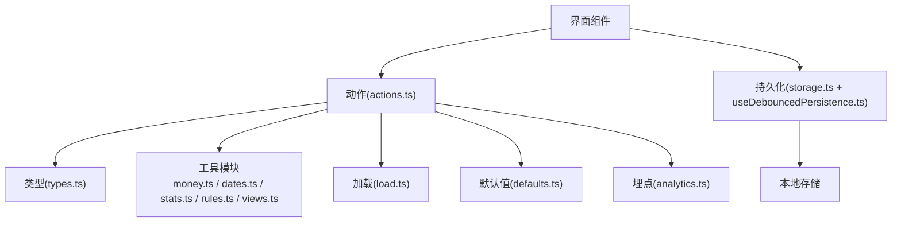
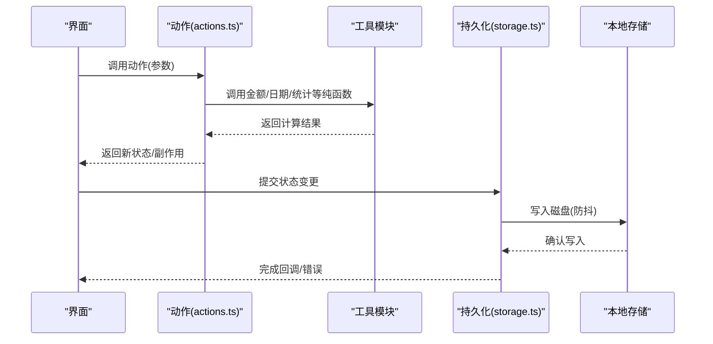
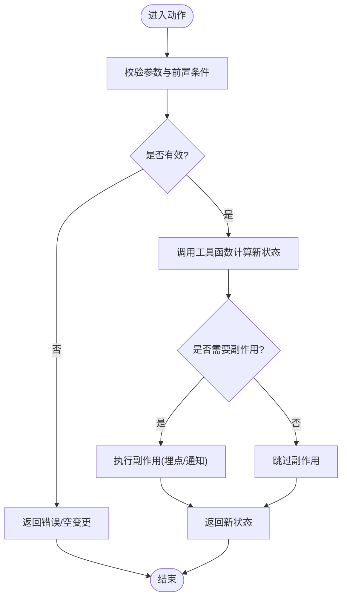
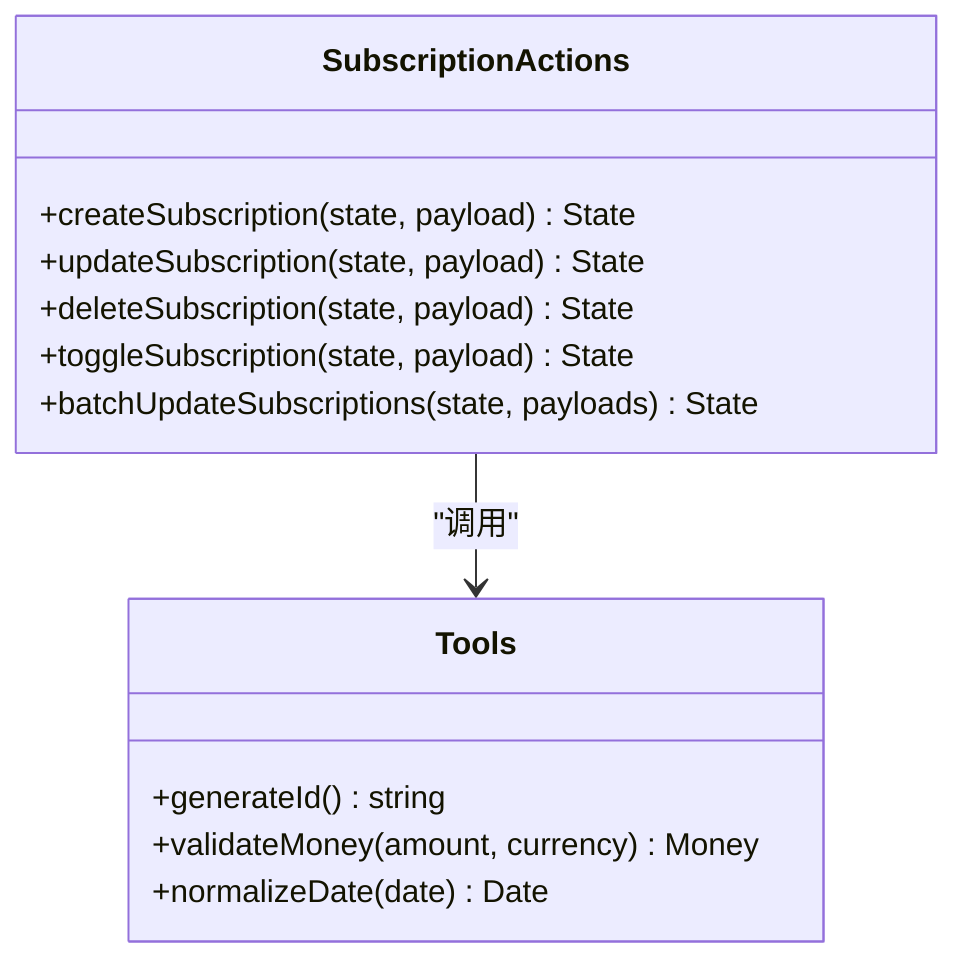
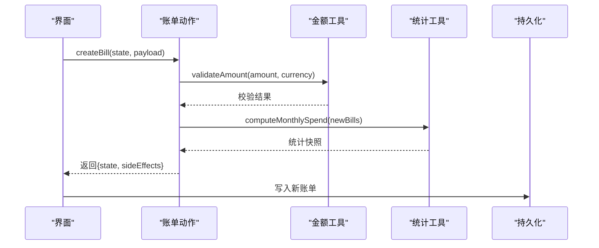
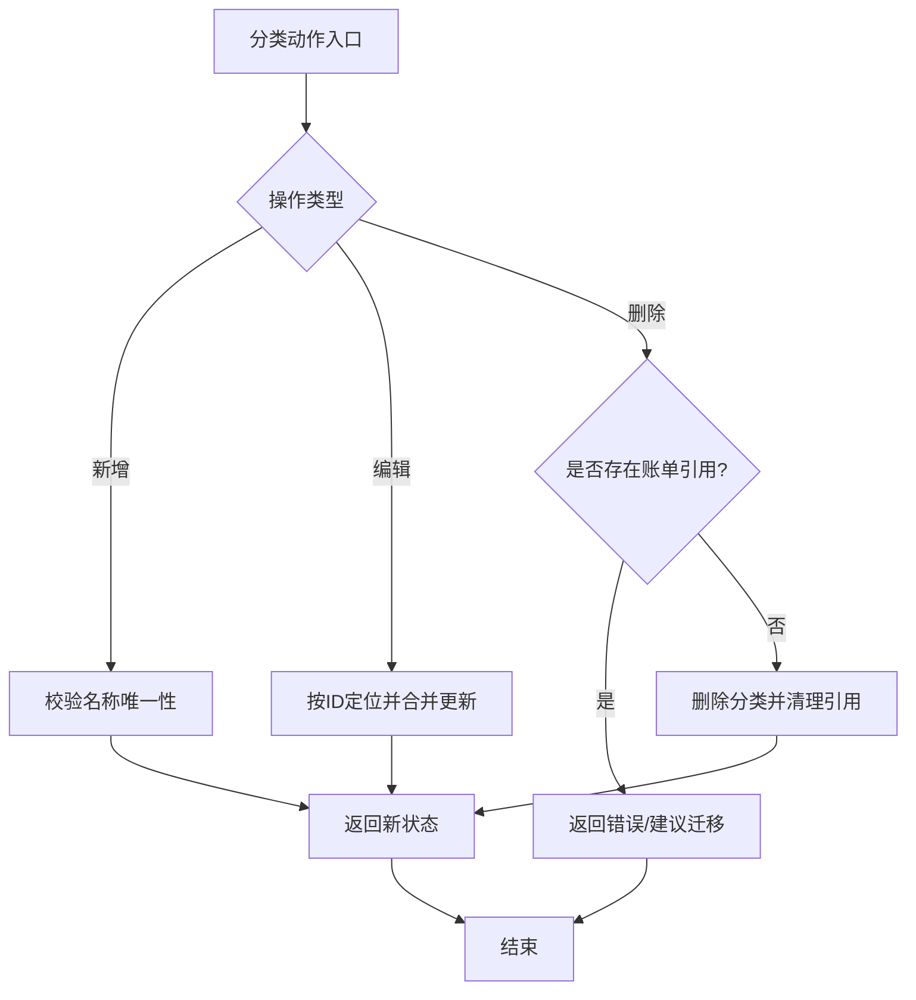
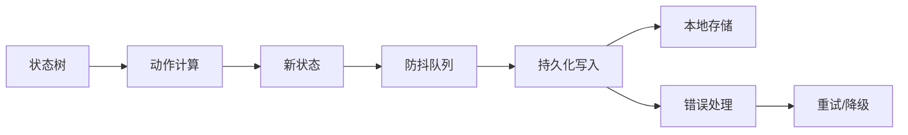
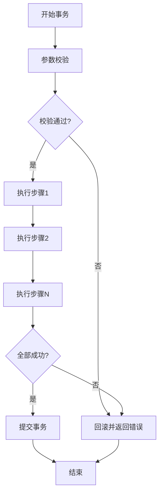
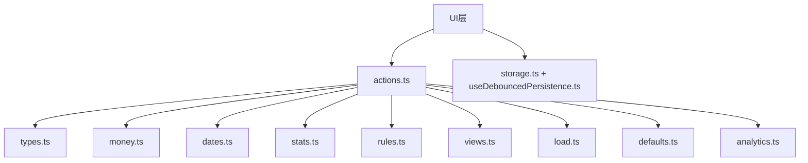

# 动作系统

<cite>
**本文引用的文件**   
- [packages/core/src/actions.ts](file://packages/core/src/actions.ts)
- [packages/core/src/types.ts](file://packages/core/src/types.ts)
- [packages/core/src/index.ts](file://packages/core/src/index.ts)
- [packages/core/src/load.ts](file://packages/core/src/load.ts)
- [packages/core/src/defaults.ts](file://packages/core/src/defaults.ts)
- [packages/core/src/money.ts](file://packages/core/src/money.ts)
- [packages/core/src/dates.ts](file://packages/core/src/dates.ts)
- [packages/core/src/stats.ts](file://packages/core/src/stats.ts)
- [packages/core/src/rules.ts](file://packages/core/src/rules.ts)
- [packages/core/src/views.ts](file://packages/core/src/views.ts)
- [packages/core/src/analytics.ts](file://packages/core/src/analytics.ts)
- [apps/desktop/src/storage.ts](file://apps/desktop/src/storage.ts)
- [apps/desktop/src/useDebouncedPersistence.ts](file://apps/desktop/src/useDebouncedPersistence.ts)
</cite>

## 目录
1. [简介](#简介)
2. [项目结构](#项目结构)
3. [核心组件](#核心组件)
4. [架构总览](#架构总览)
5. [详细组件分析](#详细组件分析)
6. [依赖关系分析](#依赖关系分析)
7. [性能考量](#性能考量)
8. [故障排查指南](#故障排查指南)
9. [结论](#结论)
10. [附录：动作API参考](#附录动作api参考)

## 简介
本文件围绕核心库的动作系统，系统性阐述状态管理的动作设计模式与实现要点。重点覆盖订阅管理、账单操作、分类管理等核心动作的创建、分发与执行机制；说明状态更新策略与数据持久化集成方式；并提供完整的动作API参考（参数、返回值、使用示例）以及错误处理与事务管理机制说明。文档力求在保持技术严谨性的同时，对非专业读者友好。

## 项目结构
核心库位于 packages/core，提供纯函数式动作定义、类型定义、工具方法与视图计算等能力；桌面应用通过 storage 层与 useDebouncedPersistence 钩子将动作结果持久化到本地存储。整体采用“动作驱动”的状态管理模式：UI 触发动作，动作返回新的状态或副作用，持久化层负责落盘。

图表来源
- [packages/core/src/actions.ts](file://packages/core/src/actions.ts)
- [packages/core/src/types.ts](file://packages/core/src/types.ts)
- [packages/core/src/money.ts](file://packages/core/src/money.ts)
- [packages/core/src/dates.ts](file://packages/core/src/dates.ts)
- [packages/core/src/stats.ts](file://packages/core/src/stats.ts)
- [packages/core/src/rules.ts](file://packages/core/src/rules.ts)
- [packages/core/src/views.ts](file://packages/core/src/views.ts)
- [packages/core/src/load.ts](file://packages/core/src/load.ts)
- [packages/core/src/defaults.ts](file://packages/core/src/defaults.ts)
- [packages/core/src/analytics.ts](file://packages/core/src/analytics.ts)
- [apps/desktop/src/storage.ts](file://apps/desktop/src/storage.ts)
- [apps/desktop/src/useDebouncedPersistence.ts](file://apps/desktop/src/useDebouncedPersistence.ts)

章节来源
- [packages/core/src/index.ts](file://packages/core/src/index.ts)
- [packages/core/src/actions.ts](file://packages/core/src/actions.ts)
- [packages/core/src/types.ts](file://packages/core/src/types.ts)

## 核心组件
- 动作定义与调度：集中定义所有业务动作（订阅、账单、分类等），统一输入输出契约，便于测试与复用。
- 类型系统：以强类型约束动作参数、状态结构与返回值，确保一致性。
- 工具与计算：金额、日期、统计、规则匹配、视图聚合等纯函数，保证可预测性。
- 加载与默认值：提供初始状态与导入/导出辅助。
- 埋点：记录关键动作事件，用于产品分析与问题定位。
- 持久化：桌面端通过 storage 与防抖持久化钩子，将状态变更安全落盘。

章节来源
- [packages/core/src/actions.ts](file://packages/core/src/actions.ts)
- [packages/core/src/types.ts](file://packages/core/src/types.ts)
- [packages/core/src/money.ts](file://packages/core/src/money.ts)
- [packages/core/src/dates.ts](file://packages/core/src/dates.ts)
- [packages/core/src/stats.ts](file://packages/core/src/stats.ts)
- [packages/core/src/rules.ts](file://packages/core/src/rules.ts)
- [packages/core/src/views.ts](file://packages/core/src/views.ts)
- [packages/core/src/load.ts](file://packages/core/src/load.ts)
- [packages/core/src/defaults.ts](file://packages/core/src/defaults.ts)
- [packages/core/src/analytics.ts](file://packages/core/src/analytics.ts)
- [apps/desktop/src/storage.ts](file://apps/desktop/src/storage.ts)
- [apps/desktop/src/useDebouncedPersistence.ts](file://apps/desktop/src/useDebouncedPersistence.ts)

## 架构总览
动作系统的核心思想是“不可变状态 + 纯函数动作”。UI 调用动作，动作基于当前状态与输入参数计算出新状态，并可选择触发副作用（如埋点）。持久化层监听状态变化，进行异步落盘。

图表来源
- [packages/core/src/actions.ts](file://packages/core/src/actions.ts)
- [packages/core/src/money.ts](file://packages/core/src/money.ts)
- [packages/core/src/dates.ts](file://packages/core/src/dates.ts)
- [packages/core/src/stats.ts](file://packages/core/src/stats.ts)
- [apps/desktop/src/storage.ts](file://apps/desktop/src/storage.ts)
- [apps/desktop/src/useDebouncedPersistence.ts](file://apps/desktop/src/useDebouncedPersistence.ts)

## 详细组件分析

### 动作设计与分发机制
- 动作签名：统一的入参为“当前状态 + 动作载荷”，返回“新状态 + 可选副作用”。这保证了可测试性与可组合性。
- 分发流程：UI 层收集用户输入，构造动作载荷，调用对应动作；动作内部调用工具函数进行计算，生成新状态；UI 层根据返回值更新状态并触发持久化。
- 订阅管理：UI 通过订阅机制监听状态变化，仅重渲染受影响的视图部分，避免全量刷新。

图表来源
- [packages/core/src/actions.ts](file://packages/core/src/actions.ts)
- [packages/core/src/types.ts](file://packages/core/src/types.ts)

章节来源
- [packages/core/src/actions.ts](file://packages/core/src/actions.ts)
- [packages/core/src/types.ts](file://packages/core/src/types.ts)

### 订阅管理动作
- 新增订阅：校验必填字段（名称、周期、金额、币种等），生成唯一ID，插入订阅列表，更新统计视图。
- 编辑订阅：按ID定位订阅项，合并更新字段，保持未修改字段不变。
- 删除订阅：按ID移除订阅项，清理相关统计缓存。
- 批量操作：支持批量启用/禁用、批量调整周期等复合动作。

图表来源
- [packages/core/src/actions.ts](file://packages/core/src/actions.ts)
- [packages/core/src/money.ts](file://packages/core/src/money.ts)
- [packages/core/src/dates.ts](file://packages/core/src/dates.ts)
- [packages/core/src/ids.ts](file://packages/core/src/ids.ts)

章节来源
- [packages/core/src/actions.ts](file://packages/core/src/actions.ts)
- [packages/core/src/money.ts](file://packages/core/src/money.ts)
- [packages/core/src/dates.ts](file://packages/core/src/dates.ts)
- [packages/core/src/ids.ts](file://packages/core/src/ids.ts)

### 账单操作动作
- 新增账单：校验金额与日期，关联订阅项，生成账单条目，更新月度支出统计。
- 编辑账单：按ID更新账单字段，重新计算统计。
- 删除账单：移除账单条目，回滚统计影响。
- 批量导入：解析导入数据，去重与校验后批量写入。

图表来源
- [packages/core/src/actions.ts](file://packages/core/src/actions.ts)
- [packages/core/src/money.ts](file://packages/core/src/money.ts)
- [packages/core/src/stats.ts](file://packages/core/src/stats.ts)
- [apps/desktop/src/storage.ts](file://apps/desktop/src/storage.ts)

章节来源
- [packages/core/src/actions.ts](file://packages/core/src/actions.ts)
- [packages/core/src/money.ts](file://packages/core/src/money.ts)
- [packages/core/src/stats.ts](file://packages/core/src/stats.ts)

### 分类管理动作
- 新增分类：校验名称唯一性，创建分类对象，加入分类列表。
- 编辑分类：按ID更新分类属性，同步更新已关联账单的分类引用。
- 删除分类：检查是否有账单引用，若无则删除；若有则提示迁移。
- 分类统计：按分类聚合支出，生成视图数据。

图表来源
- [packages/core/src/actions.ts](file://packages/core/src/actions.ts)
- [packages/core/src/types.ts](file://packages/core/src/types.ts)

章节来源
- [packages/core/src/actions.ts](file://packages/core/src/actions.ts)
- [packages/core/src/types.ts](file://packages/core/src/types.ts)

### 状态更新策略与数据持久化集成
- 不可变更新：每次动作返回全新状态对象，避免共享引用导致的意外变更。
- 局部更新：仅更新受影响字段，减少重渲染范围。
- 防抖持久化：通过 useDebouncedPersistence 对高频状态变更进行合并写入，降低I/O压力。
- 错误边界：持久化失败时保留内存状态，提供重试与降级策略。

图表来源
- [packages/core/src/actions.ts](file://packages/core/src/actions.ts)
- [apps/desktop/src/useDebouncedPersistence.ts](file://apps/desktop/src/useDebouncedPersistence.ts)
- [apps/desktop/src/storage.ts](file://apps/desktop/src/storage.ts)

章节来源
- [packages/core/src/actions.ts](file://packages/core/src/actions.ts)
- [apps/desktop/src/useDebouncedPersistence.ts](file://apps/desktop/src/useDebouncedPersistence.ts)
- [apps/desktop/src/storage.ts](file://apps/desktop/src/storage.ts)

### 错误处理与事务机制
- 参数校验：动作入口处严格校验输入，失败立即返回错误，不产生副作用。
- 原子性：单个动作内的状态更新视为原子操作，要么全部成功，要么全部回滚。
- 事务包装：对多步骤动作（如批量导入）提供事务包装，确保中间状态不一致时可回滚。
- 错误上报：关键错误通过埋点模块上报，便于追踪与分析。

图表来源
- [packages/core/src/actions.ts](file://packages/core/src/actions.ts)
- [packages/core/src/analytics.ts](file://packages/core/src/analytics.ts)

章节来源
- [packages/core/src/actions.ts](file://packages/core/src/actions.ts)
- [packages/core/src/analytics.ts](file://packages/core/src/analytics.ts)

## 依赖关系分析
动作系统依赖类型定义、工具函数与持久化层。工具函数均为纯函数，无外部副作用，确保动作的可预测性。持久化层独立于动作逻辑，通过接口抽象解耦。

图表来源
- [packages/core/src/actions.ts](file://packages/core/src/actions.ts)
- [packages/core/src/types.ts](file://packages/core/src/types.ts)
- [packages/core/src/money.ts](file://packages/core/src/money.ts)
- [packages/core/src/dates.ts](file://packages/core/src/dates.ts)
- [packages/core/src/stats.ts](file://packages/core/src/stats.ts)
- [packages/core/src/rules.ts](file://packages/core/src/rules.ts)
- [packages/core/src/views.ts](file://packages/core/src/views.ts)
- [packages/core/src/load.ts](file://packages/core/src/load.ts)
- [packages/core/src/defaults.ts](file://packages/core/src/defaults.ts)
- [packages/core/src/analytics.ts](file://packages/core/src/analytics.ts)
- [apps/desktop/src/storage.ts](file://apps/desktop/src/storage.ts)
- [apps/desktop/src/useDebouncedPersistence.ts](file://apps/desktop/src/useDebouncedPersistence.ts)

章节来源
- [packages/core/src/actions.ts](file://packages/core/src/actions.ts)
- [packages/core/src/types.ts](file://packages/core/src/types.ts)

## 性能考量
- 纯函数计算：工具函数无副作用，易于缓存与并行化。
- 增量更新：仅更新变化字段，减少重渲染开销。
- 防抖写入：持久化写入合并高频变更，降低磁盘I/O。
- 视图聚合：统计与视图计算按需触发，避免不必要的重算。

[本节为通用指导，无需特定文件来源]

## 故障排查指南
- 常见错误：参数校验失败、重复ID冲突、金额格式错误、日期解析异常。
- 调试建议：启用详细日志，检查动作输入输出，验证工具函数返回值。
- 持久化问题：检查存储权限、磁盘空间、防抖队列状态。
- 回滚策略：事务失败时自动回滚，确保状态一致性。

章节来源
- [packages/core/src/actions.ts](file://packages/core/src/actions.ts)
- [apps/desktop/src/storage.ts](file://apps/desktop/src/storage.ts)

## 结论
动作系统通过严格的类型约束、纯函数计算与不可变状态更新，实现了高内聚、低耦合的状态管理。订阅、账单、分类等核心动作清晰分离，便于扩展与维护。结合防抖持久化与事务机制，系统在性能与可靠性之间取得平衡。

[本节为总结性内容，无需特定文件来源]

## 附录：动作API参考

### 订阅管理动作
- createSubscription
  - 参数：{ name, period, amount, currency, categoryId?, notes? }
  - 返回：{ state, sideEffects? }
  - 示例：调用后订阅列表增加一项，统计视图更新。
- updateSubscription
  - 参数：{ id, fields }
  - 返回：{ state, sideEffects? }
  - 示例：更新订阅周期与金额，重新计算统计。
- deleteSubscription
  - 参数：{ id }
  - 返回：{ state, sideEffects? }
  - 示例：删除订阅并清理相关统计。
- toggleSubscription
  - 参数：{ id }
  - 返回：{ state, sideEffects? }
  - 示例：切换订阅启用状态。

章节来源
- [packages/core/src/actions.ts](file://packages/core/src/actions.ts)
- [packages/core/src/types.ts](file://packages/core/src/types.ts)

### 账单操作动作
- createBill
  - 参数：{ subscriptionId, amount, currency, date, categoryId?, notes? }
  - 返回：{ state, sideEffects? }
  - 示例：新增账单并更新月度支出。
- updateBill
  - 参数：{ id, fields }
  - 返回：{ state, sideEffects? }
  - 示例：修改账单金额或日期。
- deleteBill
  - 参数：{ id }
  - 返回：{ state, sideEffects? }
  - 示例：删除账单并回滚统计。
- importBills
  - 参数：{ bills[] }
  - 返回：{ state, sideEffects? }
  - 示例：批量导入账单，去重与校验。

章节来源
- [packages/core/src/actions.ts](file://packages/core/src/actions.ts)
- [packages/core/src/money.ts](file://packages/core/src/money.ts)
- [packages/core/src/stats.ts](file://packages/core/src/stats.ts)

### 分类管理动作
- createCategory
  - 参数：{ name, color?, icon? }
  - 返回：{ state, sideEffects? }
  - 示例：新增分类并初始化样式。
- updateCategory
  - 参数：{ id, fields }
  - 返回：{ state, sideEffects? }
  - 示例：更新分类名称或颜色。
- deleteCategory
  - 参数：{ id }
  - 返回：{ state, sideEffects? }
  - 示例：删除分类并处理引用。
- getCategoryStats
  - 参数：{ period }
  - 返回：{ stats[], sideEffects? }
  - 示例：按分类聚合支出统计。

章节来源
- [packages/core/src/actions.ts](file://packages/core/src/actions.ts)
- [packages/core/src/types.ts](file://packages/core/src/types.ts)

### 通用动作
- loadState
  - 参数：{ source }
  - 返回：{ state, sideEffects? }
  - 示例：从本地存储或云端加载状态。
- saveState
  - 参数：{ state }
  - 返回：{ sideEffects? }
  - 示例：保存状态到本地存储。
- resetState
  - 参数：{}
  - 返回：{ state, sideEffects? }
  - 示例：重置为默认状态。

章节来源
- [packages/core/src/load.ts](file://packages/core/src/load.ts)
- [packages/core/src/defaults.ts](file://packages/core/src/defaults.ts)
- [apps/desktop/src/storage.ts](file://apps/desktop/src/storage.ts)