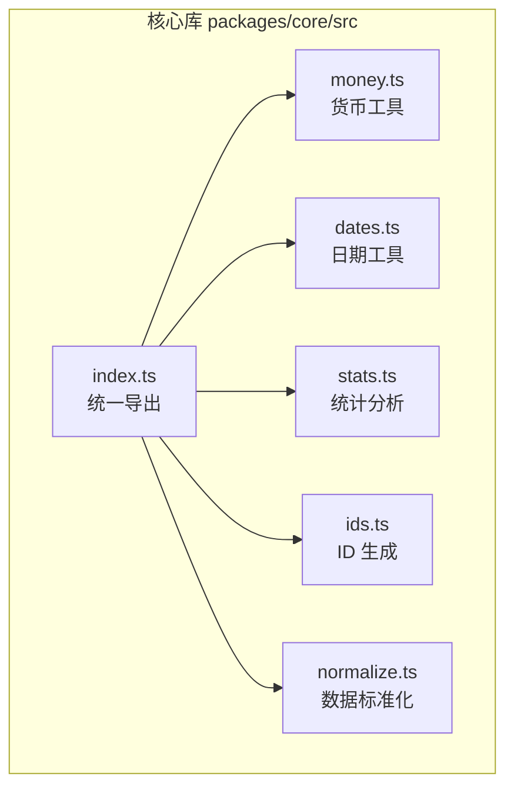
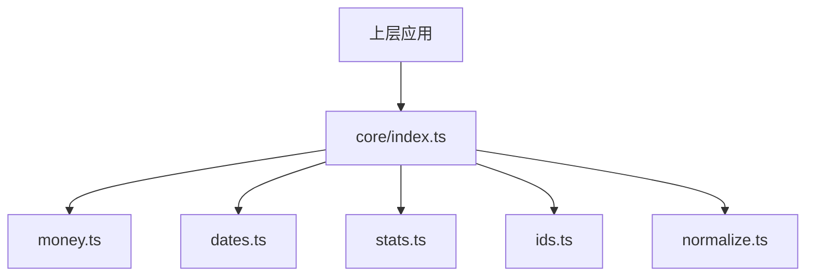
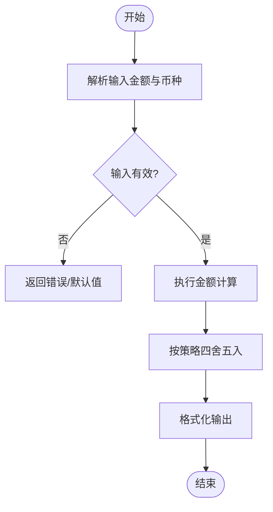
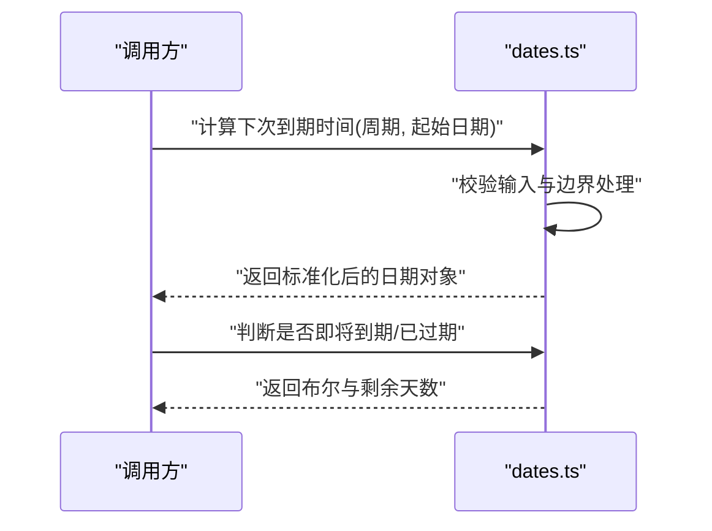
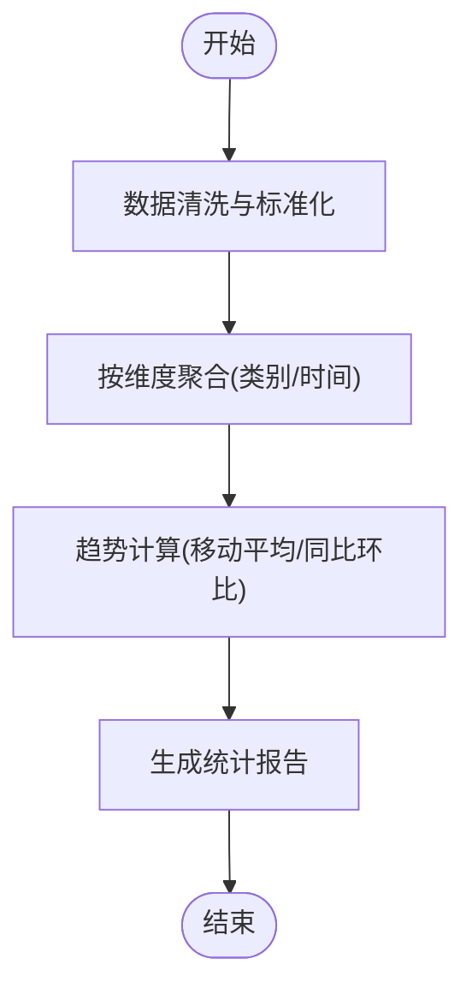
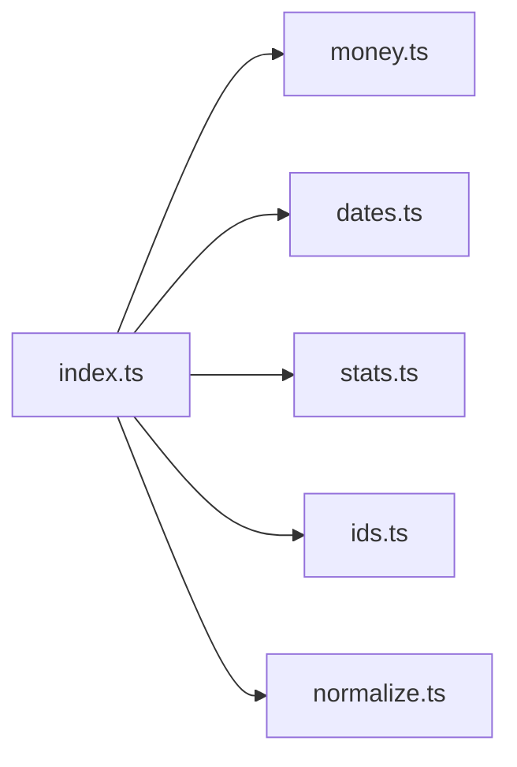

# 工具函数

<cite>
**本文引用的文件**   
- [packages/core/src/money.ts](file://packages/core/src/money.ts)
- [packages/core/src/dates.ts](file://packages/core/src/dates.ts)
- [packages/core/src/stats.ts](file://packages/core/src/stats.ts)
- [packages/core/src/ids.ts](file://packages/core/src/ids.ts)
- [packages/core/src/normalize.ts](file://packages/core/src/normalize.ts)
- [packages/core/src/index.ts](file://packages/core/src/index.ts)
</cite>

## 目录
1. [简介](#简介)
2. [项目结构](#项目结构)
3. [核心组件](#核心组件)
4. [架构总览](#架构总览)
5. [详细组件分析](#详细组件分析)
6. [依赖关系分析](#依赖关系分析)
7. [性能考虑](#性能考虑)
8. [故障排查指南](#故障排查指南)
9. [结论](#结论)
10. [附录：API 参考](#附录api-参考)

## 简介
本文件为核心库（packages/core）的工具函数文档，聚焦以下能力：
- 货币处理：金额计算、格式化、币种转换与精度控制
- 日期计算：周期计算、到期提醒、日期格式化与本地化
- 统计分析：订阅费用统计、趋势分析与聚合
- 其他实用工具：ID 生成、数据标准化等

目标读者包括前端开发者、桌面端集成者以及需要复用这些工具的二次开发用户。文档提供每个函数的 API 说明、参数定义、返回值格式和使用示例路径，帮助快速上手与排错。

## 项目结构
核心库位于 packages/core/src，按功能划分模块：
- money.ts：货币相关工具
- dates.ts：日期与时间工具
- stats.ts：统计分析工具
- ids.ts：ID 生成工具
- normalize.ts：数据标准化与清洗
- index.ts：统一导出入口

图表来源
- [packages/core/src/index.ts](file://packages/core/src/index.ts)

章节来源
- [packages/core/src/index.ts](file://packages/core/src/index.ts)

## 核心组件
本节概述各模块职责与典型用法场景：
- 货币模块：支持金额加减乘除、四舍五入、本地化格式化、汇率换算与币种符号展示
- 日期模块：支持周期计算（月/周/日）、到期提醒判断、相对时间描述、日期格式化与解析
- 统计模块：支持订阅费用汇总、月度/年度趋势、分类占比、同比环比等
- ID 模块：生成稳定且可读的短 ID，适用于记录标识
- 标准化模块：对输入数据进行规范化（如金额单位、日期字符串、空值处理）

章节来源
- [packages/core/src/money.ts](file://packages/core/src/money.ts)
- [packages/core/src/dates.ts](file://packages/core/src/dates.ts)
- [packages/core/src/stats.ts](file://packages/core/src/stats.ts)
- [packages/core/src/ids.ts](file://packages/core/src/ids.ts)
- [packages/core/src/normalize.ts](file://packages/core/src/normalize.ts)

## 架构总览
核心库以“纯函数 + 无副作用”的方式组织，便于测试与复用。各模块通过 index.ts 统一暴露接口，供上层应用（桌面端、iOS 等）调用。

图表来源
- [packages/core/src/index.ts](file://packages/core/src/index.ts)

## 详细组件分析

### 货币处理（money.ts）
主要能力：
- 金额计算：加、减、乘、除，支持小数精度与舍入策略
- 格式化：根据区域设置输出带币种符号的字符串
- 币种转换：基于汇率进行换算，支持双向转换与误差控制
- 校验与容错：非法输入返回默认值或错误信息

建议的使用流程：
- 输入金额统一转换为最小单位（如分）进行计算，避免浮点误差
- 输出前再格式化为用户可读形式
- 汇率更新后缓存最近一次换算结果，减少重复请求

图表来源
- [packages/core/src/money.ts](file://packages/core/src/money.ts)

章节来源
- [packages/core/src/money.ts](file://packages/core/src/money.ts)

### 日期计算（dates.ts）
主要能力：
- 周期计算：按月/周/日推进或回退，处理月末边界与闰年
- 到期提醒：计算距今天数、是否即将到期、已过期状态
- 格式化与解析：支持多种日期字符串与本地化显示
- 时区与本地化：正确处理时区偏移与语言环境

建议的使用流程：
- 所有内部计算使用 UTC 或统一时区，展示时再转换到本地时区
- 周期性任务采用“下次到期时间”作为基准，避免累积误差
- 用户输入日期需做合法性校验与归一化

图表来源
- [packages/core/src/dates.ts](file://packages/core/src/dates.ts)

章节来源
- [packages/core/src/dates.ts](file://packages/core/src/dates.ts)

### 统计分析（stats.ts）
主要能力：
- 订阅费用汇总：按类别、月份、年份聚合支出
- 趋势分析：移动平均、同比环比、峰值与谷值识别
- 分布统计：各类别占比、Top N 排序
- 异常检测：超阈值预警与离群值标记

建议的使用流程：
- 先对原始账单数据进行清洗与标准化
- 按时间窗口聚合后再进行趋势计算
- 可视化层仅负责渲染，不承载复杂计算逻辑

图表来源
- [packages/core/src/stats.ts](file://packages/core/src/stats.ts)

章节来源
- [packages/core/src/stats.ts](file://packages/core/src/stats.ts)

### ID 生成（ids.ts）
主要能力：
- 生成短 ID：可读性高、冲突概率低
- 可定制长度与字符集：适配不同业务场景
- 稳定性：相同输入可产生一致输出（可选）

使用建议：
- 对外暴露的 ID 避免包含敏感信息
- 批量生成时注意去重与重试机制

章节来源
- [packages/core/src/ids.ts](file://packages/core/src/ids.ts)

### 数据标准化（normalize.ts）
主要能力：
- 金额标准化：去除多余空格、统一货币单位、修正非法字符
- 日期标准化：兼容多格式字符串、自动推断时区
- 空值处理：将空字符串、null、undefined 统一为默认值
- 类型校验：确保字段类型符合预期

使用建议：
- 在数据入库前统一走标准化流程
- 对关键业务字段增加白名单校验

章节来源
- [packages/core/src/normalize.ts](file://packages/core/src/normalize.ts)

## 依赖关系分析
核心库模块之间保持低耦合，主要通过 index.ts 统一导出。各模块内部尽量使用纯函数，避免隐式全局状态。

图表来源
- [packages/core/src/index.ts](file://packages/core/src/index.ts)

章节来源
- [packages/core/src/index.ts](file://packages/core/src/index.ts)

## 性能考虑
- 金额计算：优先使用整数运算（如分），避免浮点误差；批量计算时合并舍入步骤
- 日期计算：缓存常用周期边界（如月末），减少重复计算
- 统计分析：对大数据集采用增量聚合与分页处理，避免一次性加载
- ID 生成：批量生成时使用随机种子与去重集合，降低碰撞率
- 标准化：对高频字段建立映射表，提升解析速度

## 故障排查指南
常见问题与定位方法：
- 金额显示异常：检查格式化区域设置与币种符号配置
- 到期提醒不准确：确认时区与本地化设置，核对周期边界处理
- 统计结果偏差：核查数据清洗规则与聚合维度是否正确
- ID 冲突：检查长度与字符集配置，必要时增加重试与去重逻辑
- 标准化失败：查看输入源是否符合预期格式，补充容错分支

章节来源
- [packages/core/src/money.ts](file://packages/core/src/money.ts)
- [packages/core/src/dates.ts](file://packages/core/src/dates.ts)
- [packages/core/src/stats.ts](file://packages/core/src/stats.ts)
- [packages/core/src/ids.ts](file://packages/core/src/ids.ts)
- [packages/core/src/normalize.ts](file://packages/core/src/normalize.ts)

## 结论
核心库提供了覆盖货币、日期、统计、ID 与标准化的完整工具集，适合用于订阅管理与账单分析类应用。通过统一的导出入口与清晰的模块边界，便于集成与维护。建议在业务层遵循“输入标准化、计算纯函数、输出格式化”的原则，以获得更好的可测试性与可维护性。

## 附录：API 参考

### 货币模块（money.ts）
- 金额计算
  - 名称：add / subtract / multiply / divide
  - 参数：金额数值、操作数、精度、舍入策略
  - 返回：计算结果（数值或格式化字符串）
  - 示例路径：[packages/core/src/money.ts](file://packages/core/src/money.ts)
- 格式化
  - 名称：formatMoney
  - 参数：金额数值、币种代码、区域设置
  - 返回：带币种符号的字符串
  - 示例路径：[packages/core/src/money.ts](file://packages/core/src/money.ts)
- 币种转换
  - 名称：convertCurrency
  - 参数：金额、源币种、目标币种、汇率
  - 返回：转换后的金额与币种信息
  - 示例路径：[packages/core/src/money.ts](file://packages/core/src/money.ts)

章节来源
- [packages/core/src/money.ts](file://packages/core/src/money.ts)

### 日期模块（dates.ts）
- 周期计算
  - 名称：nextOccurrence / previousOccurrence
  - 参数：周期类型（日/周/月）、起始日期、偏移量
  - 返回：标准化后的日期对象
  - 示例路径：[packages/core/src/dates.ts](file://packages/core/src/dates.ts)
- 到期提醒
  - 名称：isDueSoon / isOverdue / daysUntil
  - 参数：目标日期、阈值天数
  - 返回：布尔值与剩余天数
  - 示例路径：[packages/core/src/dates.ts](file://packages/core/src/dates.ts)
- 格式化与解析
  - 名称：formatDate / parseDate
  - 参数：日期对象或字符串、格式模板、区域设置
  - 返回：格式化字符串或日期对象
  - 示例路径：[packages/core/src/dates.ts](file://packages/core/src/dates.ts)

章节来源
- [packages/core/src/dates.ts](file://packages/core/src/dates.ts)

### 统计分析（stats.ts）
- 费用汇总
  - 名称：sumByCategory / sumByMonth / sumByYear
  - 参数：账单数据集、分组维度
  - 返回：聚合结果（键值对或数组）
  - 示例路径：[packages/core/src/stats.ts](file://packages/core/src/stats.ts)
- 趋势分析
  - 名称：movingAverage / yoy / mom
  - 参数：时间序列数据、窗口大小
  - 返回：趋势指标（数值或数组）
  - 示例路径：[packages/core/src/stats.ts](file://packages/core/src/stats.ts)
- 分布统计
  - 名称：topCategories / distribution
  - 参数：账单数据集、Top N
  - 返回：分类占比与排序结果
  - 示例路径：[packages/core/src/stats.ts](file://packages/core/src/stats.ts)

章节来源
- [packages/core/src/stats.ts](file://packages/core/src/stats.ts)

### ID 生成（ids.ts）
- 生成短 ID
  - 名称：generateId
  - 参数：长度、字符集、是否稳定
  - 返回：短 ID 字符串
  - 示例路径：[packages/core/src/ids.ts](file://packages/core/src/ids.ts)

章节来源
- [packages/core/src/ids.ts](file://packages/core/src/ids.ts)

### 数据标准化（normalize.ts）
- 金额标准化
  - 名称：normalizeAmount
  - 参数：原始金额、单位、区域设置
  - 返回：标准化后的数值与单位
  - 示例路径：[packages/core/src/normalize.ts](file://packages/core/src/normalize.ts)
- 日期标准化
  - 名称：normalizeDate
  - 参数：日期字符串、格式模板、时区
  - 返回：标准化后的日期对象
  - 示例路径：[packages/core/src/normalize.ts](file://packages/core/src/normalize.ts)
- 空值处理
  - 名称：coalesce / toDefault
  - 参数：多个候选值、默认值
  - 返回：第一个非空值或默认值
  - 示例路径：[packages/core/src/normalize.ts](file://packages/core/src/normalize.ts)

章节来源
- [packages/core/src/normalize.ts](file://packages/core/src/normalize.ts)