# 核心库

<cite>
**本文引用的文件**   
- [packages/core/src/index.ts](file://packages/core/src/index.ts)
- [packages/core/src/types.ts](file://packages/core/src/types.ts)
- [packages/core/src/actions.ts](file://packages/core/src/actions.ts)
- [packages/core/src/money.ts](file://packages/core/src/money.ts)
- [packages/core/src/dates.ts](file://packages/core/src/dates.ts)
- [packages/core/src/stats.ts](file://packages/core/src/stats.ts)
- [packages/core/src/defaults.ts](file://packages/core/src/defaults.ts)
- [packages/core/src/ids.ts](file://packages/core/src/ids.ts)
- [packages/core/src/load.ts](file://packages/core/src/load.ts)
- [packages/core/src/normalize.ts](file://packages/core/src/normalize.ts)
- [packages/core/src/paste.ts](file://packages/core/src/paste.ts)
- [packages/core/src/rules.ts](file://packages/core/src/rules.ts)
- [packages/core/src/views.ts](file://packages/core/src/views.ts)
- [packages/core/src/analytics.ts](file://packages/core/src/analytics.ts)
</cite>

## 目录
1. [简介](#简介)
2. [项目结构](#项目结构)
3. [核心组件](#核心组件)
4. [架构总览](#架构总览)
5. [详细组件分析](#详细组件分析)
6. [依赖关系分析](#依赖关系分析)
7. [性能考量](#性能考量)
8. [故障排查指南](#故障排查指南)
9. [结论](#结论)
10. [附录：API 参考与最佳实践](#附录api-参考与最佳实践)

## 简介
本文件面向 core 包，系统性阐述其设计目标、职责边界与实现要点。core 包提供订阅管理领域的数据模型、动作系统（状态管理与操作封装）、货币处理、日期计算、统计分析、导入粘贴、规则引擎、视图构建以及分析与加载等能力。目标是让上层应用以稳定、可组合的 API 完成订阅生命周期管理、账单统计与报表展示。

## 项目结构
core 包采用“按能力分文件”的组织方式，每个文件聚焦单一职责：类型定义、动作系统、工具函数、数据导入与规范化、视图聚合、分析统计等。入口 index.ts 统一对外暴露 API，便于上层按需引用。

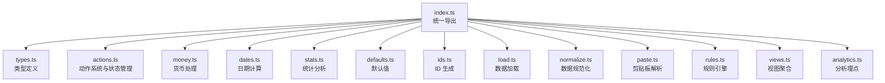

**图表来源** 
- [packages/core/src/index.ts](file://packages/core/src/index.ts)
- [packages/core/src/types.ts](file://packages/core/src/types.ts)
- [packages/core/src/actions.ts](file://packages/core/src/actions.ts)
- [packages/core/src/money.ts](file://packages/core/src/money.ts)
- [packages/core/src/dates.ts](file://packages/core/src/dates.ts)
- [packages/core/src/stats.ts](file://packages/core/src/stats.ts)
- [packages/core/src/defaults.ts](file://packages/core/src/defaults.ts)
- [packages/core/src/ids.ts](file://packages/core/src/ids.ts)
- [packages/core/src/load.ts](file://packages/core/src/load.ts)
- [packages/core/src/normalize.ts](file://packages/core/src/normalize.ts)
- [packages/core/src/paste.ts](file://packages/core/src/paste.ts)
- [packages/core/src/rules.ts](file://packages/core/src/rules.ts)
- [packages/core/src/views.ts](file://packages/core/src/views.ts)
- [packages/core/src/analytics.ts](file://packages/core/src/analytics.ts)

**章节来源**
- [packages/core/src/index.ts](file://packages/core/src/index.ts)

## 核心组件
- 类型定义系统：集中描述订阅、账单、分类、视图、规则等数据结构，保证全链路类型安全。
- 动作系统：基于不可变更新与纯函数，封装增删改查、批量操作与副作用隔离，提供稳定的状态演进路径。
- 货币处理：统一币种、精度、格式化与换算，避免浮点误差。
- 日期计算：周期对齐、到期提醒、区间统计等。
- 统计分析：按时间、分类、币种等多维度汇总与趋势分析。
- 导入与规范化：兼容多来源数据格式，清洗并映射为内部标准结构。
- 规则引擎：将业务规则抽象为可配置策略，驱动自动分类、校验与转换。
- 视图聚合：将原始数据转换为 UI 友好的视图模型。
- 分析与加载：埋点上报与数据持久化加载。

**章节来源**
- [packages/core/src/types.ts](file://packages/core/src/types.ts)
- [packages/core/src/actions.ts](file://packages/core/src/actions.ts)
- [packages/core/src/money.ts](file://packages/core/src/money.ts)
- [packages/core/src/dates.ts](file://packages/core/src/dates.ts)
- [packages/core/src/stats.ts](file://packages/core/src/stats.ts)
- [packages/core/src/normalize.ts](file://packages/core/src/normalize.ts)
- [packages/core/src/paste.ts](file://packages/core/src/paste.ts)
- [packages/core/src/rules.ts](file://packages/core/src/rules.ts)
- [packages/core/src/views.ts](file://packages/core/src/views.ts)
- [packages/core/src/analytics.ts](file://packages/core/src/analytics.ts)
- [packages/core/src/load.ts](file://packages/core/src/load.ts)

## 架构总览
core 包遵循“数据与行为分离”的原则：类型层定义契约，动作层负责状态变更，工具层提供无副作用能力，视图与分析层消费标准化数据。

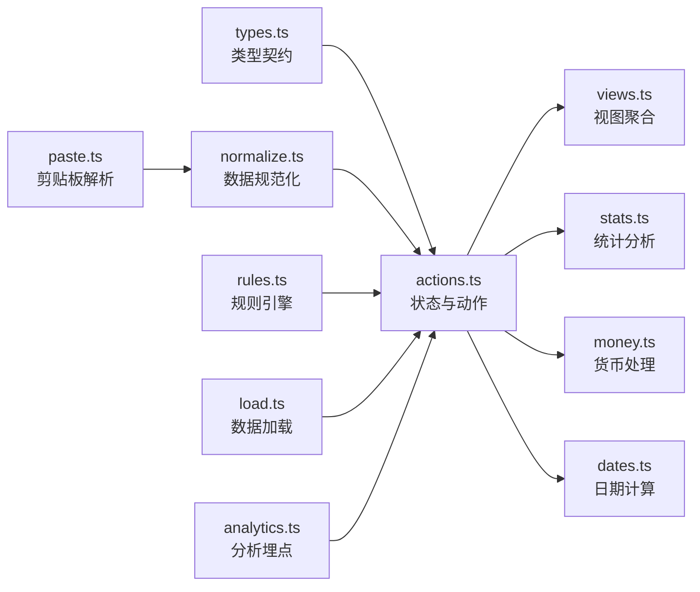

**图表来源** 
- [packages/core/src/types.ts](file://packages/core/src/types.ts)
- [packages/core/src/actions.ts](file://packages/core/src/actions.ts)
- [packages/core/src/views.ts](file://packages/core/src/views.ts)
- [packages/core/src/stats.ts](file://packages/core/src/stats.ts)
- [packages/core/src/money.ts](file://packages/core/src/money.ts)
- [packages/core/src/dates.ts](file://packages/core/src/dates.ts)
- [packages/core/src/paste.ts](file://packages/core/src/paste.ts)
- [packages/core/src/normalize.ts](file://packages/core/src/normalize.ts)
- [packages/core/src/rules.ts](file://packages/core/src/rules.ts)
- [packages/core/src/load.ts](file://packages/core/src/load.ts)
- [packages/core/src/analytics.ts](file://packages/core/src/analytics.ts)

## 详细组件分析

### 类型定义系统（types.ts）
- 职责：定义订阅、账单、分类、视图、规则、分析事件等核心数据结构与枚举，确保跨模块一致性与类型安全。
- 关键点：
  - 使用联合类型与字面量类型表达有限状态（如订阅状态、计费周期）。
  - 通过可选字段与默认值约定，降低上游输入复杂度。
  - 视图与规则类型解耦数据与展示/策略，便于扩展。

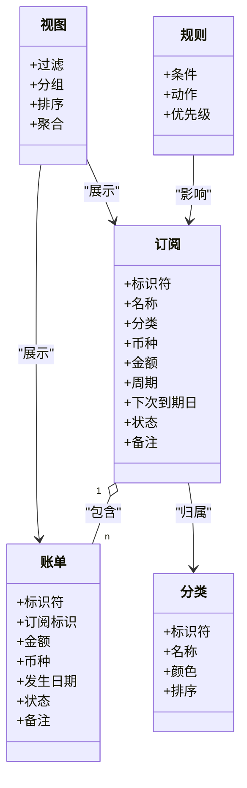

**图表来源** 
- [packages/core/src/types.ts](file://packages/core/src/types.ts)

**章节来源**
- [packages/core/src/types.ts](file://packages/core/src/types.ts)

### 动作系统（actions.ts）
- 职责：封装对订阅、账单、分类等实体的增删改查与批量操作，维护不可变状态，保证可预测的状态演进。
- 设计要点：
  - 每个动作是纯函数，接收当前状态与参数，返回新状态。
  - 支持事务性批处理，减少中间态与重渲染。
  - 内置校验与错误分支，失败时保持状态不变。
  - 与 ids、defaults、rules、money、dates 等工具协作，确保数据一致性。

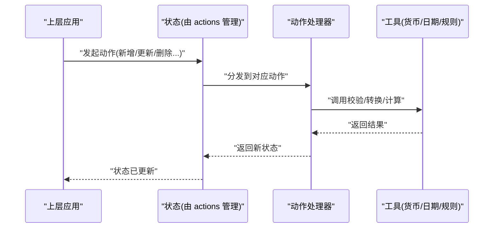

**图表来源** 
- [packages/core/src/actions.ts](file://packages/core/src/actions.ts)
- [packages/core/src/money.ts](file://packages/core/src/money.ts)
- [packages/core/src/dates.ts](file://packages/core/src/dates.ts)
- [packages/core/src/rules.ts](file://packages/core/src/rules.ts)
- [packages/core/src/ids.ts](file://packages/core/src/ids.ts)
- [packages/core/src/defaults.ts](file://packages/core/src/defaults.ts)

**章节来源**
- [packages/core/src/actions.ts](file://packages/core/src/actions.ts)

### 货币处理（money.ts）
- 职责：统一币种表示、数值精度、格式化与换算，避免浮点误差。
- 关键能力：
  - 金额标准化（单位、小数位、舍入策略）。
  - 格式化输出（本地化符号、千分位、币种后缀）。
  - 汇率换算接口（可扩展外部源）。
  - 比较与聚合（求和、平均、阈值判断）。

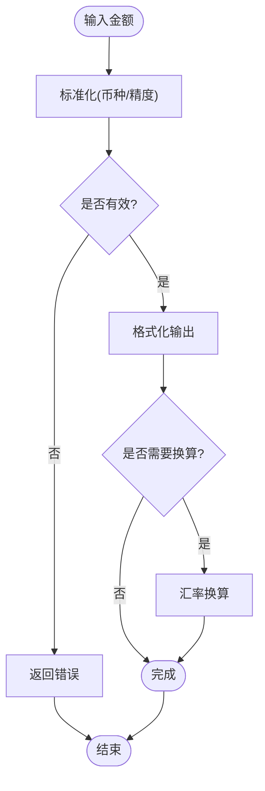

**图表来源** 
- [packages/core/src/money.ts](file://packages/core/src/money.ts)

**章节来源**
- [packages/core/src/money.ts](file://packages/core/src/money.ts)

### 日期计算（dates.ts）
- 职责：提供周期对齐、到期提醒、区间统计等日期工具。
- 关键能力：
  - 周期计算（月/季/年对齐、滚动窗口）。
  - 到期检测（提前提醒天数、重复周期）。
  - 区间统计（按月/周聚合、同比环比）。
  - 时区与本地化处理。

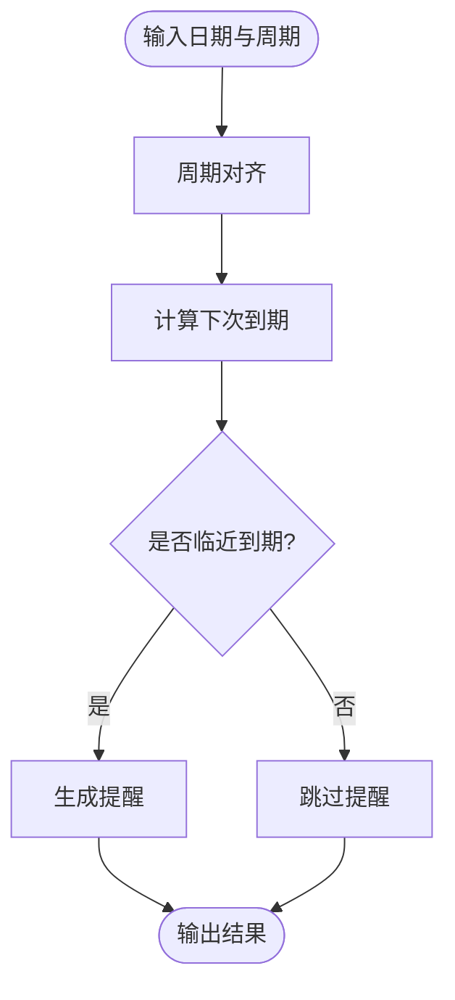

**图表来源** 
- [packages/core/src/dates.ts](file://packages/core/src/dates.ts)

**章节来源**
- [packages/core/src/dates.ts](file://packages/core/src/dates.ts)

### 统计分析（stats.ts）
- 职责：基于订阅与账单数据进行多维度统计与可视化准备。
- 关键能力：
  - 按时间、分类、币种聚合（总额、均值、峰值）。
  - 趋势分析（月度/季度增长、异常波动）。
  - 预算与超支检测（阈值对比）。
  - 导出友好结构（供图表或报表使用）。

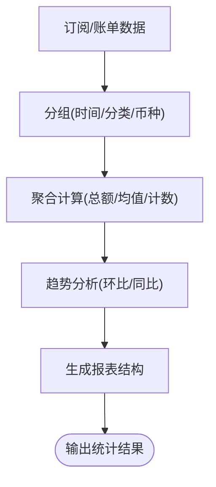

**图表来源** 
- [packages/core/src/stats.ts](file://packages/core/src/stats.ts)

**章节来源**
- [packages/core/src/stats.ts](file://packages/core/src/stats.ts)

### 导入与规范化（paste.ts, normalize.ts）
- 职责：将外部数据（剪贴板、CSV、JSON、网页复制文本）解析并规范化为内部标准结构。
- 关键能力：
  - 多格式识别与解析。
  - 字段映射与缺省填充。
  - 数据校验与错误定位。
  - 批量导入的事务性提交。

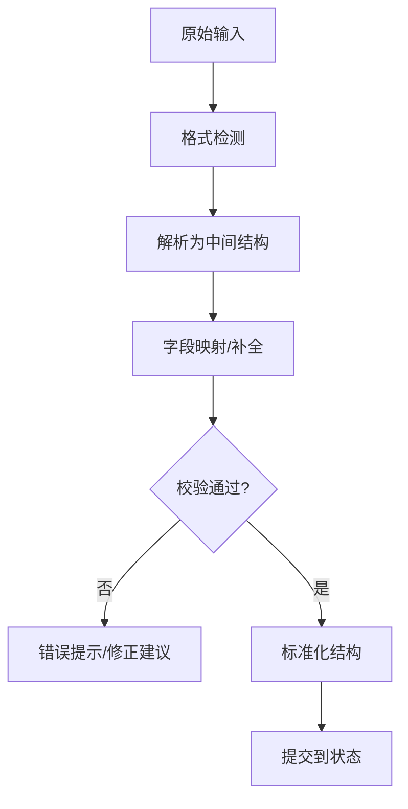

**图表来源** 
- [packages/core/src/paste.ts](file://packages/core/src/paste.ts)
- [packages/core/src/normalize.ts](file://packages/core/src/normalize.ts)

**章节来源**
- [packages/core/src/paste.ts](file://packages/core/src/paste.ts)
- [packages/core/src/normalize.ts](file://packages/core/src/normalize.ts)

### 规则引擎（rules.ts）
- 职责：将业务规则抽象为可配置策略，驱动自动分类、校验与转换。
- 关键能力：
  - 条件表达式与动作编排。
  - 优先级与短路逻辑。
  - 规则版本与回滚。
  - 与动作系统集成，执行后产生确定性状态变化。

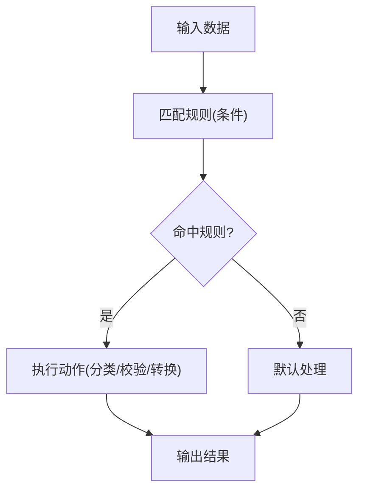

**图表来源** 
- [packages/core/src/rules.ts](file://packages/core/src/rules.ts)

**章节来源**
- [packages/core/src/rules.ts](file://packages/core/src/rules.ts)

### 视图聚合（views.ts）
- 职责：将原始数据转换为 UI 友好的视图模型，支持过滤、分组、排序与分页。
- 关键能力：
  - 多维过滤与搜索。
  - 动态分组与聚合。
  - 排序与分页。
  - 缓存与增量更新。

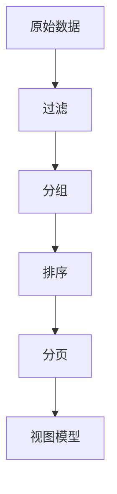

**图表来源** 
- [packages/core/src/views.ts](file://packages/core/src/views.ts)

**章节来源**
- [packages/core/src/views.ts](file://packages/core/src/views.ts)

### 分析与加载（analytics.ts, load.ts）
- 职责：埋点上报与数据持久化加载，保障用户体验与数据可靠性。
- 关键能力：
  - 事件采集与去抖。
  - 异步加载与重试。
  - 错误上报与降级。
  - 与动作系统解耦，仅消费标准化数据。

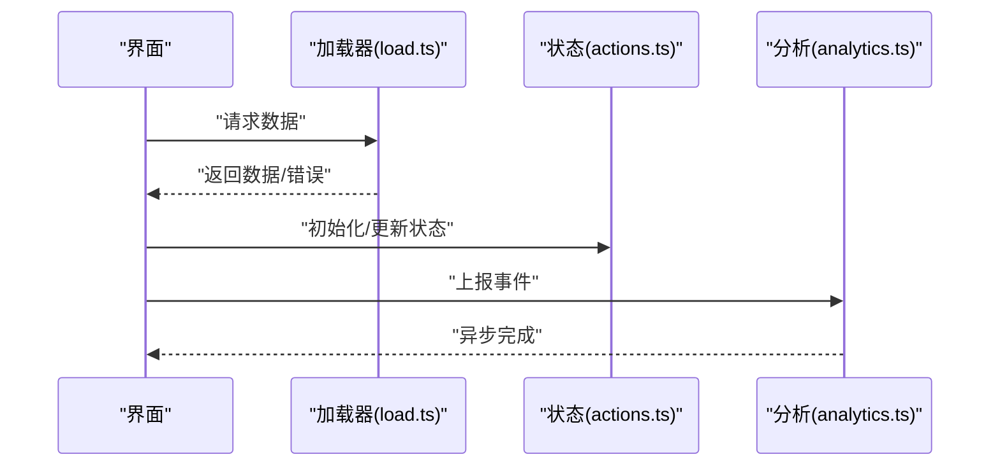

**图表来源** 
- [packages/core/src/load.ts](file://packages/core/src/load.ts)
- [packages/core/src/analytics.ts](file://packages/core/src/analytics.ts)
- [packages/core/src/actions.ts](file://packages/core/src/actions.ts)

**章节来源**
- [packages/core/src/analytics.ts](file://packages/core/src/analytics.ts)
- [packages/core/src/load.ts](file://packages/core/src/load.ts)

### 默认值与 ID（defaults.ts, ids.ts）
- 职责：提供统一的默认值与 ID 生成策略，确保数据一致性与唯一性。
- 关键能力：
  - 实体默认值模板。
  - 短 ID/UUID 生成。
  - 可插拔 ID 策略。

**章节来源**
- [packages/core/src/defaults.ts](file://packages/core/src/defaults.ts)
- [packages/core/src/ids.ts](file://packages/core/src/ids.ts)

## 依赖关系分析
core 包内部模块间耦合清晰：类型层为契约，动作层为核心，工具层为支撑，视图与分析为消费端。

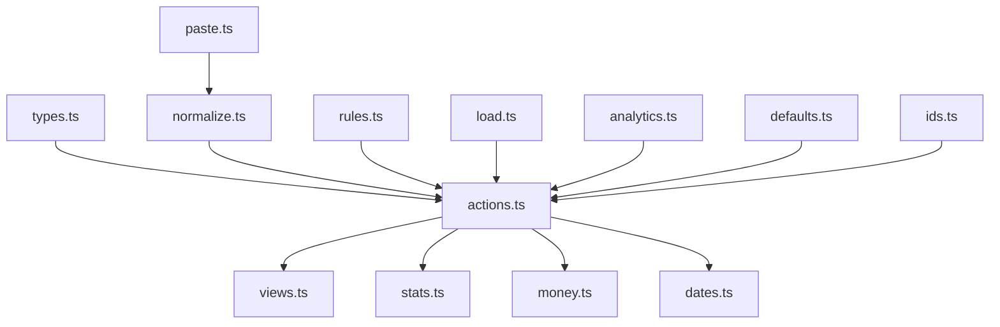

**图表来源** 
- [packages/core/src/types.ts](file://packages/core/src/types.ts)
- [packages/core/src/actions.ts](file://packages/core/src/actions.ts)
- [packages/core/src/views.ts](file://packages/core/src/views.ts)
- [packages/core/src/stats.ts](file://packages/core/src/stats.ts)
- [packages/core/src/money.ts](file://packages/core/src/money.ts)
- [packages/core/src/dates.ts](file://packages/core/src/dates.ts)
- [packages/core/src/paste.ts](file://packages/core/src/paste.ts)
- [packages/core/src/normalize.ts](file://packages/core/src/normalize.ts)
- [packages/core/src/rules.ts](file://packages/core/src/rules.ts)
- [packages/core/src/load.ts](file://packages/core/src/load.ts)
- [packages/core/src/analytics.ts](file://packages/core/src/analytics.ts)
- [packages/core/src/defaults.ts](file://packages/core/src/defaults.ts)
- [packages/core/src/ids.ts](file://packages/core/src/ids.ts)

**章节来源**
- [packages/core/src/index.ts](file://packages/core/src/index.ts)

## 性能考量
- 不可变更新：动作层返回新状态，避免共享可变对象导致的意外副作用与深度拷贝开销。
- 批处理：合并多次更新为一次状态变更，减少重渲染与计算。
- 惰性计算：视图与统计按需计算，必要时引入缓存与增量更新。
- 货币与日期：统一精度与时区处理，避免频繁转换带来的性能损耗。
- 导入优化：批量解析与校验，失败快速回滚。

[本节为通用指导，不直接分析具体文件]

## 故障排查指南
- 数据不一致：检查 normalize 与 rules 的映射与校验逻辑，确认默认值与必填字段。
- 金额异常：核对 money 的精度与舍入策略，检查汇率源可用性。
- 日期错误：确认时区与周期对齐逻辑，检查到期提醒阈值。
- 导入失败：查看 paste 的格式检测与错误定位信息，逐步缩小输入范围。
- 视图为空：检查过滤条件与分组键，确认数据是否被正确标准化。
- 分析缺失：确认 analytics 的事件触发时机与上报通道。

**章节来源**
- [packages/core/src/normalize.ts](file://packages/core/src/normalize.ts)
- [packages/core/src/money.ts](file://packages/core/src/money.ts)
- [packages/core/src/dates.ts](file://packages/core/src/dates.ts)
- [packages/core/src/paste.ts](file://packages/core/src/paste.ts)
- [packages/core/src/views.ts](file://packages/core/src/views.ts)
- [packages/core/src/analytics.ts](file://packages/core/src/analytics.ts)

## 结论
core 包以类型契约为基础，通过动作系统实现可预测的状态管理，配合货币、日期、统计、导入、规则、视图与分析等工具，形成高内聚、低耦合的订阅管理能力。上层应用可基于该包快速构建稳定、可扩展的订阅管理产品。

[本节为总结，不直接分析具体文件]

## 附录：API 参考与最佳实践

### 类型定义（types.ts）
- 订阅：标识、名称、分类、币种、金额、周期、下次到期、状态、备注。
- 账单：标识、订阅标识、金额、币种、发生日期、状态、备注。
- 分类：标识、名称、颜色、排序。
- 规则：条件、动作、优先级。
- 视图：过滤、分组、排序、聚合。

使用示例（概念）：
- 创建订阅：传入名称、分类、币种、金额、周期，自动生成标识与默认状态。
- 记录账单：关联订阅标识，填写金额、币种、发生日期，状态默认为已支付。
- 定义规则：设置条件（如名称包含某关键字），动作（自动分类或修改金额）。

**章节来源**
- [packages/core/src/types.ts](file://packages/core/src/types.ts)

### 动作系统（actions.ts）
- 新增订阅：参数为订阅数据，返回新状态。
- 更新订阅：参数为标识与变更字段，返回新状态。
- 删除订阅：参数为标识，返回新状态。
- 新增账单：参数为账单数据，返回新状态。
- 批量操作：参数为动作列表，返回新状态。
- 校验与错误：失败时返回错误信息，状态保持不变。

使用示例（概念）：
- 批量导入：先解析与规范化，再调用批量动作提交。
- 事务性更新：将多个相关动作合并为一个批次，确保一致性。

**章节来源**
- [packages/core/src/actions.ts](file://packages/core/src/actions.ts)

### 货币处理（money.ts）
- 标准化：统一币种与精度。
- 格式化：本地化显示。
- 换算：支持汇率接口。
- 比较与聚合：求和、均值、阈值判断。

使用示例（概念）：
- 将不同币种的金额换算为基准币种后再聚合。
- 格式化金额用于报表展示。

**章节来源**
- [packages/core/src/money.ts](file://packages/core/src/money.ts)

### 日期计算（dates.ts）
- 周期对齐：月/季/年对齐。
- 到期提醒：提前天数与重复周期。
- 区间统计：按月/周聚合。

使用示例（概念）：
- 根据订阅周期计算下次到期日与提醒。
- 统计某区间内的账单总额。

**章节来源**
- [packages/core/src/dates.ts](file://packages/core/src/dates.ts)

### 统计分析（stats.ts）
- 聚合：按时间、分类、币种汇总。
- 趋势：环比/同比分析。
- 预算：超支检测。

使用示例（概念）：
- 生成月度支出报表，按分类分组。
- 检测某分类是否超出预算。

**章节来源**
- [packages/core/src/stats.ts](file://packages/core/src/stats.ts)

### 导入与规范化（paste.ts, normalize.ts）
- 格式检测与解析。
- 字段映射与补全。
- 校验与错误定位。

使用示例（概念）：
- 从剪贴板粘贴 CSV，自动识别列名并映射。
- 批量导入失败时返回错误行号与原因。

**章节来源**
- [packages/core/src/paste.ts](file://packages/core/src/paste.ts)
- [packages/core/src/normalize.ts](file://packages/core/src/normalize.ts)

### 规则引擎（rules.ts）
- 条件匹配与动作执行。
- 优先级与短路。
- 版本管理与回滚。

使用示例（概念）：
- 当订阅名称包含“云”，自动归类为“云服务”。
- 金额超过阈值时标记为“需审核”。

**章节来源**
- [packages/core/src/rules.ts](file://packages/core/src/rules.ts)

### 视图聚合（views.ts）
- 过滤、分组、排序、分页。
- 缓存与增量更新。

使用示例（概念）：
- 按分类分组展示订阅列表，支持搜索与排序。
- 分页加载账单明细。

**章节来源**
- [packages/core/src/views.ts](file://packages/core/src/views.ts)

### 分析与加载（analytics.ts, load.ts）
- 事件采集与去抖。
- 异步加载与重试。
- 错误上报与降级。

使用示例（概念）：
- 页面加载时拉取数据，失败重试三次。
- 用户操作上报埋点，去抖避免重复。

**章节来源**
- [packages/core/src/analytics.ts](file://packages/core/src/analytics.ts)
- [packages/core/src/load.ts](file://packages/core/src/load.ts)

### 默认值与 ID（defaults.ts, ids.ts）
- 实体默认值模板。
- 短 ID/UUID 生成。

使用示例（概念）：
- 新建订阅时使用默认分类与状态。
- 生成唯一标识用于关联账单与订阅。

**章节来源**
- [packages/core/src/defaults.ts](file://packages/core/src/defaults.ts)
- [packages/core/src/ids.ts](file://packages/core/src/ids.ts)

### 最佳实践
- 始终通过动作系统更新状态，避免直接修改数据。
- 导入前进行规范化与校验，失败快速反馈。
- 货币与日期统一处理，避免分散逻辑。
- 视图与统计按需计算，必要时缓存。
- 规则与动作解耦，便于测试与维护。

[本节为通用指导，不直接分析具体文件]