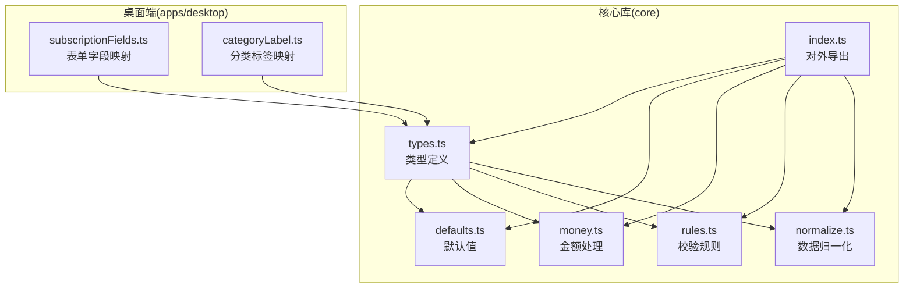
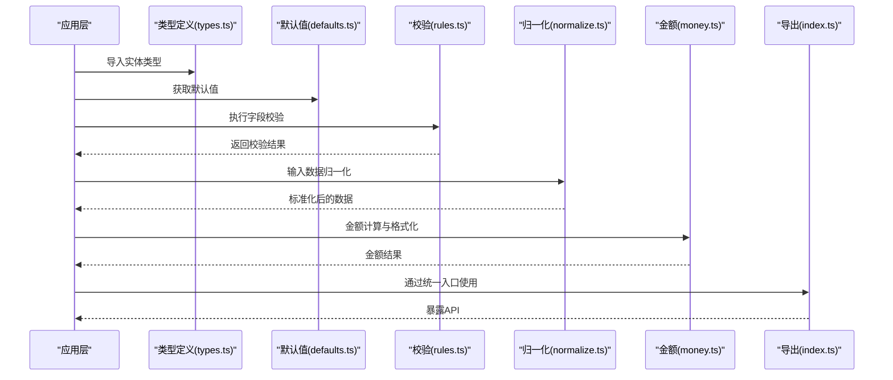
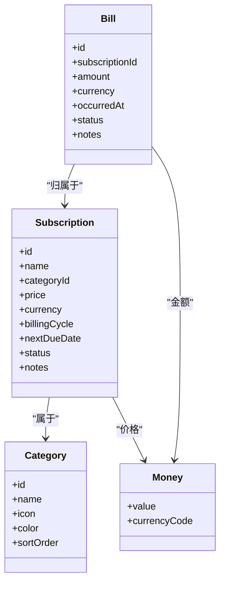
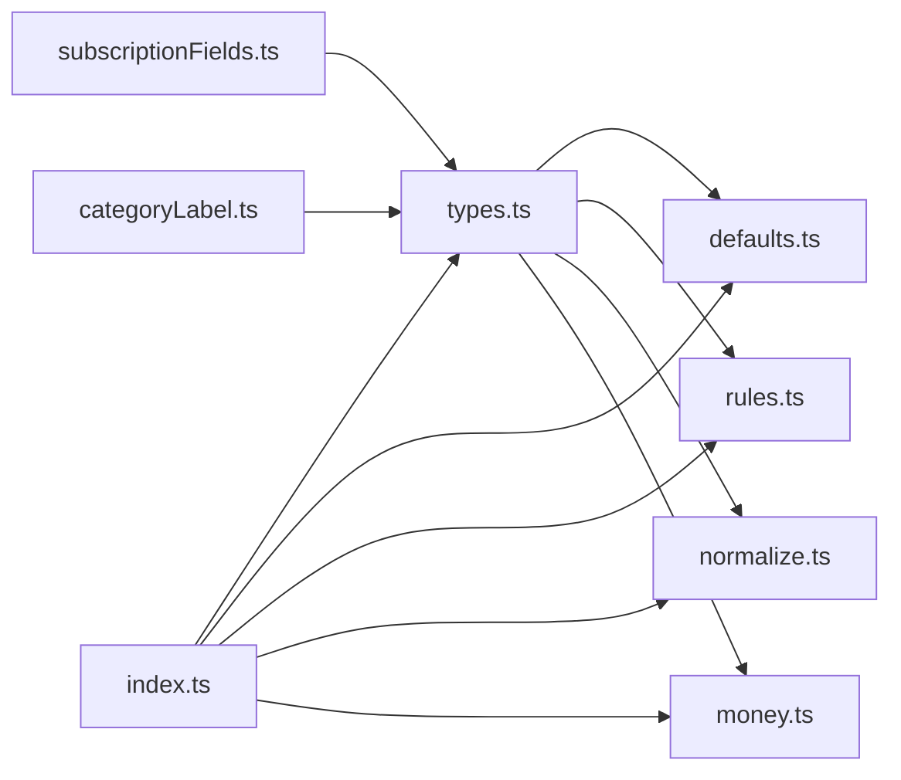

# 类型系统

<cite>
**本文引用的文件**   
- [packages/core/src/types.ts](file://packages/core/src/types.ts)
- [packages/core/src/defaults.ts](file://packages/core/src/defaults.ts)
- [packages/core/src/money.ts](file://packages/core/src/money.ts)
- [packages/core/src/rules.ts](file://packages/core/src/rules.ts)
- [packages/core/src/normalize.ts](file://packages/core/src/normalize.ts)
- [packages/core/src/index.ts](file://packages/core/src/index.ts)
- [apps/desktop/src/subscriptionFields.ts](file://apps/desktop/src/subscriptionFields.ts)
- [apps/desktop/src/categoryLabel.ts](file://apps/desktop/src/categoryLabel.ts)
</cite>

## 目录
1. [简介](#简介)
2. [项目结构](#项目结构)
3. [核心组件](#核心组件)
4. [架构总览](#架构总览)
5. [详细组件分析](#详细组件分析)
6. [依赖关系分析](#依赖关系分析)
7. [性能考量](#性能考量)
8. [故障排查指南](#故障排查指南)
9. [结论](#结论)
10. [附录](#附录)

## 简介
本文件围绕核心库的类型系统，系统化梳理订阅(Subscription)、账单(Bill)、分类(Category)等实体类型的定义、关系与约束；说明默认值配置与类型验证规则；给出使用示例与最佳实践；并提供类型扩展与自定义的实现指南。目标是让不同技术背景的读者都能准确理解并正确使用这些类型。

## 项目结构
核心类型与校验逻辑集中在 packages/core 包中，桌面端应用通过 apps/desktop 的字段定义和标签映射消费这些类型。下图展示了与类型系统相关的关键文件及其职责：

图表来源 
- [packages/core/src/types.ts](file://packages/core/src/types.ts)
- [packages/core/src/defaults.ts](file://packages/core/src/defaults.ts)
- [packages/core/src/money.ts](file://packages/core/src/money.ts)
- [packages/core/src/rules.ts](file://packages/core/src/rules.ts)
- [packages/core/src/normalize.ts](file://packages/core/src/normalize.ts)
- [packages/core/src/index.ts](file://packages/core/src/index.ts)
- [apps/desktop/src/subscriptionFields.ts](file://apps/desktop/src/subscriptionFields.ts)
- [apps/desktop/src/categoryLabel.ts](file://apps/desktop/src/categoryLabel.ts)

章节来源
- [packages/core/src/index.ts](file://packages/core/src/index.ts)

## 核心组件
本节聚焦核心类型体系中的关键实体与工具类型，涵盖订阅、账单、分类、货币与校验规则等。

- 订阅(Subscription)
  - 用途：描述一个周期性或一次性的订阅服务（如流媒体、云服务）。
  - 关键字段（概念性）：标识符、名称、类别、价格、币种、计费周期、下次到期日、状态、备注等。
  - 典型约束：名称非空、价格为正数、周期为枚举之一、到期日不晚于当前日期（根据业务策略可调整）。
  
- 账单(Bill)
  - 用途：记录一次具体的扣费或支付事件，通常由订阅触发。
  - 关键字段（概念性）：标识符、关联订阅ID、金额、币种、发生时间、状态、备注等。
  - 典型约束：金额大于等于零、时间戳有效、关联订阅存在（在写入层校验）。

- 分类(Category)
  - 用途：对订阅进行归类，便于统计与筛选。
  - 关键字段（概念性）：标识符、名称、图标/颜色、排序权重等。
  - 典型约束：名称唯一、权重为整数。

- 货币(Money)
  - 用途：统一金额与币种的表达，避免精度问题。
  - 关键字段（概念性）：数值、币种代码。
  - 典型约束：数值为非负数，币种为ISO标准代码。

- 校验规则(Rules)
  - 用途：集中管理各实体的必填项、取值范围、格式校验等。
  - 典型能力：字段级校验、组合校验、错误信息聚合。

章节来源
- [packages/core/src/types.ts](file://packages/core/src/types.ts)
- [packages/core/src/money.ts](file://packages/core/src/money.ts)
- [packages/core/src/rules.ts](file://packages/core/src/rules.ts)

## 架构总览
下图从“类型—默认值—校验—归一化—导出”的角度展示核心库的类型系统工作流：

图表来源 
- [packages/core/src/types.ts](file://packages/core/src/types.ts)
- [packages/core/src/defaults.ts](file://packages/core/src/defaults.ts)
- [packages/core/src/rules.ts](file://packages/core/src/rules.ts)
- [packages/core/src/normalize.ts](file://packages/core/src/normalize.ts)
- [packages/core/src/money.ts](file://packages/core/src/money.ts)
- [packages/core/src/index.ts](file://packages/core/src/index.ts)

## 详细组件分析

### 类型定义与关系
- 订阅(Subscription)
  - 与分类(Category)多对一：每个订阅属于一个分类。
  - 与账单(Bill)一对多：一个订阅可产生多个账单。
  - 与货币(Money)一对一：订阅价格采用金额类型。
  - 常见约束：名称必填、价格>0、周期为枚举、到期日>=当前日期（依策略）。

- 账单(Bill)
  - 与订阅(Subscription)多对一：每条账单归属一个订阅。
  - 与货币(Money)一对一：账单金额采用金额类型。
  - 常见约束：金额>=0、时间戳有效、关联订阅ID存在。

- 分类(Category)
  - 独立实体，被订阅引用。
  - 常见约束：名称唯一、权重为整数。

- 金额(Money)
  - 用于统一金额与币种，避免浮点误差。
  - 常见约束：数值非负、币种合法。

图表来源 
- [packages/core/src/types.ts](file://packages/core/src/types.ts)

章节来源
- [packages/core/src/types.ts](file://packages/core/src/types.ts)

### 默认值配置
- 订阅默认值
  - 名称：空字符串或占位文本
  - 类别：默认分类ID
  - 价格：0
  - 币种：默认币种代码
  - 周期：默认周期（如月）
  - 到期日：当前日期或空
  - 状态：默认状态（如活跃）
  - 备注：空字符串

- 账单默认值
  - 金额：0
  - 币种：默认币种代码
  - 发生时间：当前时间或空
  - 状态：默认状态（如已入账）
  - 备注：空字符串

- 分类默认值
  - 名称：默认名称
  - 图标/颜色：默认值
  - 排序权重：0

章节来源
- [packages/core/src/defaults.ts](file://packages/core/src/defaults.ts)

### 类型验证规则
- 必填校验：名称、金额、时间戳等关键字段不可为空。
- 取值范围：价格>0，金额>=0，周期为枚举集合，币种为合法代码。
- 格式校验：日期格式、时间戳有效性。
- 组合校验：到期日不早于创建日；账单关联的订阅必须存在。
- 错误聚合：将多条字段错误汇总返回，便于前端提示。

章节来源
- [packages/core/src/rules.ts](file://packages/core/src/rules.ts)

### 数据归一化
- 目标：将外部输入（表单、导入数据）转换为内部一致的结构。
- 常见处理：
  - 空白字符修剪
  - 大小写规范化（如币种大写）
  - 日期解析与标准化
  - 金额数值精度处理
  - 缺失字段填充默认值

章节来源
- [packages/core/src/normalize.ts](file://packages/core/src/normalize.ts)

### 金额处理
- 精度控制：以最小单位存储（如分），避免浮点误差。
- 格式化：按币种显示千分位、小数位数。
- 转换：支持币种换算（若实现汇率模块）。
- 校验：确保数值非负、币种合法。

章节来源
- [packages/core/src/money.ts](file://packages/core/src/money.ts)

### 对外导出与集成
- 统一入口：通过 index.ts 集中导出类型、默认值、校验与工具函数。
- 使用建议：优先通过统一入口引入，保证版本一致性。

章节来源
- [packages/core/src/index.ts](file://packages/core/src/index.ts)

### 桌面端字段映射与标签
- 订阅表单字段映射：将 UI 字段绑定到核心类型字段，提供默认值与校验提示。
- 分类标签映射：将分类 ID 映射为可读标签，便于展示。

章节来源
- [apps/desktop/src/subscriptionFields.ts](file://apps/desktop/src/subscriptionFields.ts)
- [apps/desktop/src/categoryLabel.ts](file://apps/desktop/src/categoryLabel.ts)

## 依赖关系分析
- 内聚性
  - types.ts 定义核心数据结构，保持高内聚。
  - rules.ts、normalize.ts、money.ts 分别专注校验、归一化与金额处理，职责清晰。
- 耦合度
  - defaults.ts 依赖 types.ts 的字段结构。
  - normalize.ts 依赖 types.ts 与 money.ts。
  - rules.ts 依赖 types.ts 与 money.ts。
  - index.ts 聚合导出，降低上层耦合。
- 外部依赖
  - 桌面端通过 subscriptionFields.ts 与 categoryLabel.ts 消费 core 类型。

图表来源 
- [packages/core/src/types.ts](file://packages/core/src/types.ts)
- [packages/core/src/defaults.ts](file://packages/core/src/defaults.ts)
- [packages/core/src/rules.ts](file://packages/core/src/rules.ts)
- [packages/core/src/normalize.ts](file://packages/core/src/normalize.ts)
- [packages/core/src/money.ts](file://packages/core/src/money.ts)
- [packages/core/src/index.ts](file://packages/core/src/index.ts)
- [apps/desktop/src/subscriptionFields.ts](file://apps/desktop/src/subscriptionFields.ts)
- [apps/desktop/src/categoryLabel.ts](file://apps/desktop/src/categoryLabel.ts)

章节来源
- [packages/core/src/index.ts](file://packages/core/src/index.ts)

## 性能考量
- 金额计算：使用整数最小单位减少浮点误差与比较开销。
- 校验优化：批量校验与短路策略结合，减少不必要的计算。
- 归一化：缓存常用转换结果（如币种大写、日期解析）。
- 内存占用：避免重复对象创建，尽量复用默认值实例。

[本节为通用指导，无需具体文件引用]

## 故障排查指南
- 常见错误
  - 必填字段缺失：检查表单提交前是否调用校验规则。
  - 金额异常：确认金额是否为非负数，币种代码是否合法。
  - 日期无效：检查日期格式与时区处理。
  - 关联失败：账单关联的订阅是否存在。
- 定位方法
  - 查看校验错误聚合输出，快速定位问题字段。
  - 打印归一化前后数据，对比差异。
  - 使用默认值初始化对象，逐步替换字段以隔离问题。

章节来源
- [packages/core/src/rules.ts](file://packages/core/src/rules.ts)
- [packages/core/src/normalize.ts](file://packages/core/src/normalize.ts)

## 结论
本类型系统以清晰的实体定义为核心，配合默认值、校验与归一化机制，形成稳定可靠的数据模型。通过统一的导出接口与桌面端的字段映射，既保证了类型安全，又提升了开发效率。遵循本文的最佳实践与扩展指南，可在不破坏现有契约的前提下平滑演进类型体系。

[本节为总结，无需具体文件引用]

## 附录

### 使用示例与最佳实践
- 创建订阅
  - 使用默认值初始化对象，再按需覆盖字段。
  - 提交前执行校验规则，收集并展示错误信息。
  - 金额使用金额类型，避免直接使用原始数值。
- 生成账单
  - 基于订阅信息与计费周期自动生成。
  - 校验关联订阅存在性与金额合法性。
- 分类管理
  - 新增分类时确保名称唯一。
  - 使用标签映射提升可读性。

章节来源
- [packages/core/src/defaults.ts](file://packages/core/src/defaults.ts)
- [packages/core/src/rules.ts](file://packages/core/src/rules.ts)
- [apps/desktop/src/subscriptionFields.ts](file://apps/desktop/src/subscriptionFields.ts)
- [apps/desktop/src/categoryLabel.ts](file://apps/desktop/src/categoryLabel.ts)

### 类型扩展与自定义指南
- 新增实体字段
  - 在 types.ts 中扩展类型定义。
  - 在 defaults.ts 中补充默认值。
  - 在 rules.ts 中添加字段校验规则。
  - 在 normalize.ts 中处理字段归一化。
- 自定义校验
  - 编写独立的校验函数，并在 rules.ts 中注册。
  - 确保错误信息明确且可本地化。
- 金额扩展
  - 如需支持新币种，更新币种代码与格式化逻辑。
  - 如涉及汇率换算，增加换算模块并保持幂等。

章节来源
- [packages/core/src/types.ts](file://packages/core/src/types.ts)
- [packages/core/src/defaults.ts](file://packages/core/src/defaults.ts)
- [packages/core/src/rules.ts](file://packages/core/src/rules.ts)
- [packages/core/src/normalize.ts](file://packages/core/src/normalize.ts)
- [packages/core/src/money.ts](file://packages/core/src/money.ts)