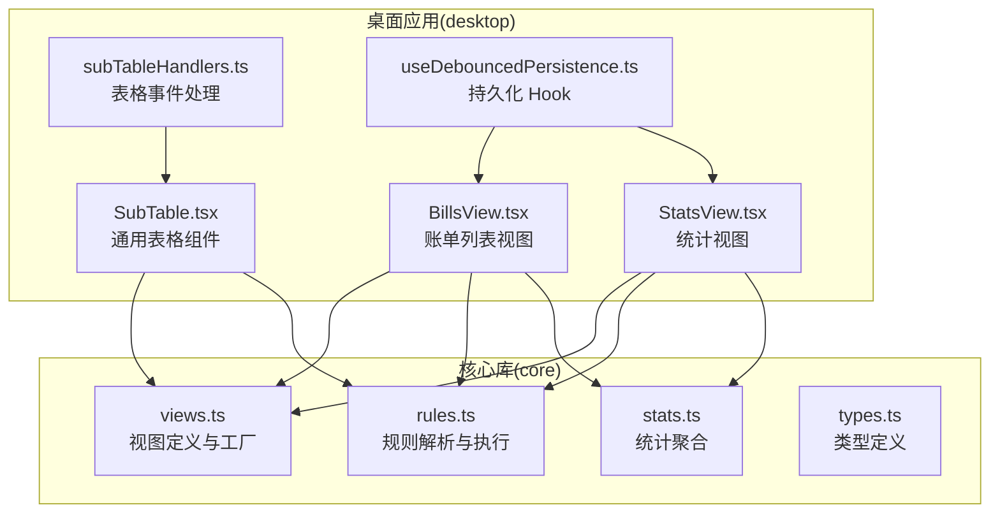
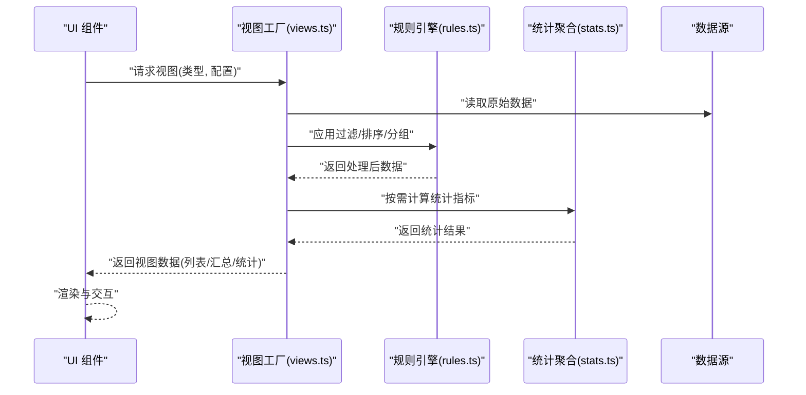
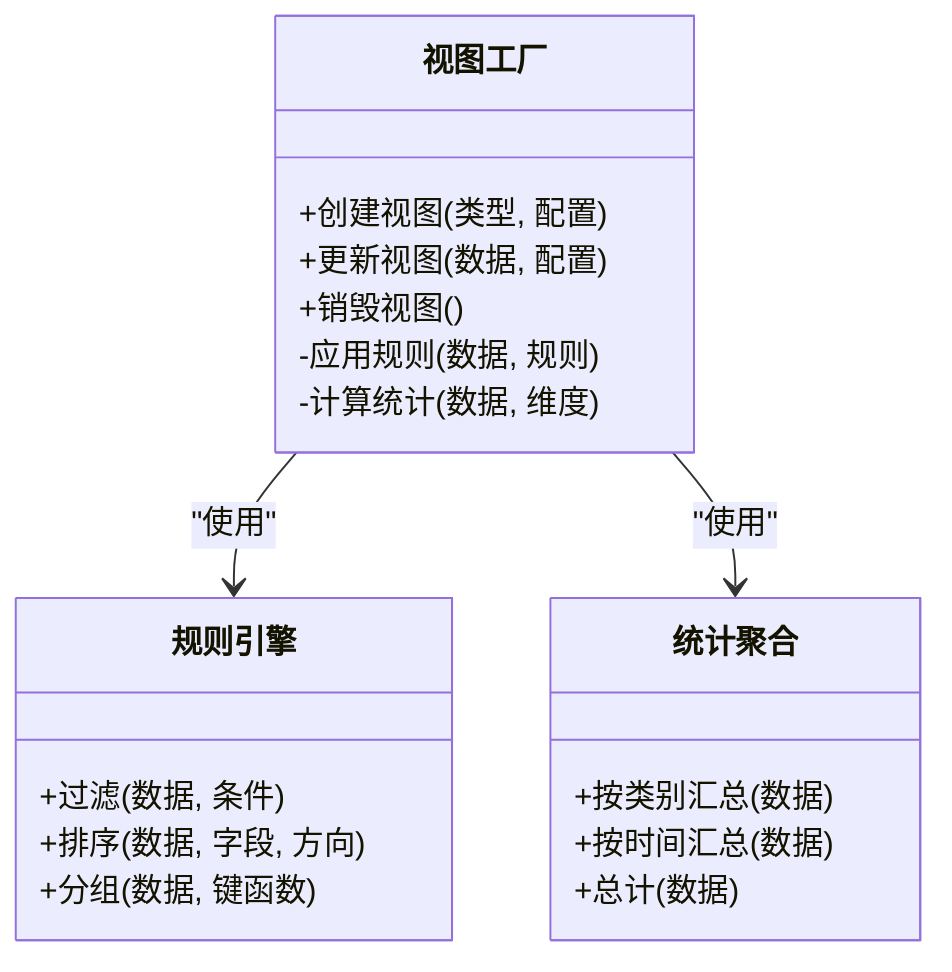
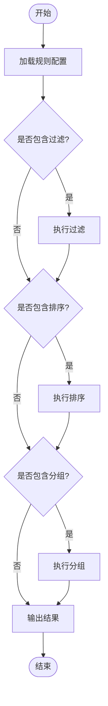
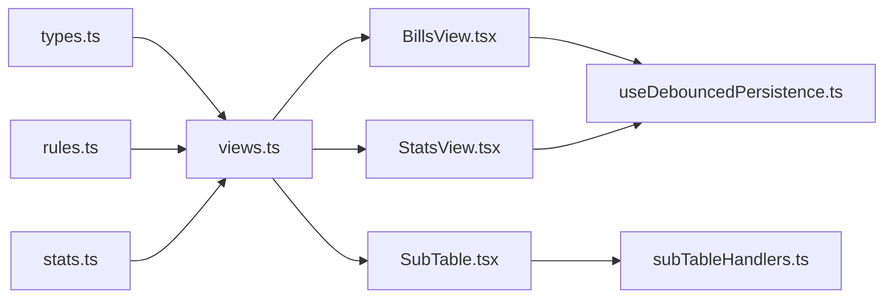

# 视图层

<cite>
**本文引用的文件**   
- [packages/core/src/views.ts](file://packages/core/src/views.ts)
- [packages/core/src/rules.ts](file://packages/core/src/rules.ts)
- [packages/core/src/stats.ts](file://packages/core/src/stats.ts)
- [packages/core/src/types.ts](file://packages/core/src/types.ts)
- [apps/desktop/src/BillsView.tsx](file://apps/desktop/src/BillsView.tsx)
- [apps/desktop/src/StatsView.tsx](file://apps/desktop/src/StatsView.tsx)
- [apps/desktop/src/SubTable.tsx](file://apps/desktop/src/SubTable.tsx)
- [apps/desktop/src/subTableHandlers.ts](file://apps/desktop/src/subTableHandlers.ts)
- [apps/desktop/src/useDebouncedPersistence.ts](file://apps/desktop/src/useDebouncedPersistence.ts)
</cite>

## 目录
1. [简介](#简介)
2. [项目结构](#项目结构)
3. [核心组件](#核心组件)
4. [架构总览](#架构总览)
5. [详细组件分析](#详细组件分析)
6. [依赖关系分析](#依赖关系分析)
7. [性能考虑](#性能考虑)
8. [故障排查指南](#故障排查指南)
9. [结论](#结论)
10. [附录：API 参考与自定义开发指南](#附录api-参考与自定义开发指南)

## 简介
本文件为核心库的“视图层”技术文档，聚焦数据视图的构建与管理机制。内容涵盖订阅列表、账单汇总、分类统计等典型视图类型；解释视图规则的定义与应用（过滤、排序、分组）；说明视图与数据的绑定关系及实时更新机制；提供视图配置的 API 参考与自定义视图开发指南；并给出性能优化建议与最佳实践。目标是帮助开发者快速理解并扩展视图能力，同时保证在桌面端应用中的稳定与高效。

## 项目结构
核心库位于 packages/core，负责数据模型、规则引擎、统计计算与视图定义；桌面应用位于 apps/desktop，负责 UI 渲染与交互，通过调用核心库暴露的接口来驱动视图。

图表来源
- [packages/core/src/views.ts](file://packages/core/src/views.ts)
- [packages/core/src/rules.ts](file://packages/core/src/rules.ts)
- [packages/core/src/stats.ts](file://packages/core/src/stats.ts)
- [packages/core/src/types.ts](file://packages/core/src/types.ts)
- [apps/desktop/src/BillsView.tsx](file://apps/desktop/src/BillsView.tsx)
- [apps/desktop/src/StatsView.tsx](file://apps/desktop/src/StatsView.tsx)
- [apps/desktop/src/SubTable.tsx](file://apps/desktop/src/SubTable.tsx)
- [apps/desktop/src/subTableHandlers.ts](file://apps/desktop/src/subTableHandlers.ts)
- [apps/desktop/src/useDebouncedPersistence.ts](file://apps/desktop/src/useDebouncedPersistence.ts)

章节来源
- [packages/core/src/views.ts](file://packages/core/src/views.ts)
- [packages/core/src/rules.ts](file://packages/core/src/rules.ts)
- [packages/core/src/stats.ts](file://packages/core/src/stats.ts)
- [packages/core/src/types.ts](file://packages/core/src/types.ts)
- [apps/desktop/src/BillsView.tsx](file://apps/desktop/src/BillsView.tsx)
- [apps/desktop/src/StatsView.tsx](file://apps/desktop/src/StatsView.tsx)
- [apps/desktop/src/SubTable.tsx](file://apps/desktop/src/SubTable.tsx)
- [apps/desktop/src/subTableHandlers.ts](file://apps/desktop/src/subTableHandlers.ts)
- [apps/desktop/src/useDebouncedPersistence.ts](file://apps/desktop/src/useDebouncedPersistence.ts)

## 核心组件
- 视图定义与工厂（views.ts）：提供视图类型的声明、默认配置、视图实例创建与更新流程，统一视图的数据输入输出契约。
- 规则引擎（rules.ts）：定义过滤、排序、分组的规则结构与执行器，支持组合与优先级控制。
- 统计聚合（stats.ts）：基于原始数据生成汇总指标（如按类别、时间维度的金额统计），供统计视图消费。
- 类型系统（types.ts）：统一定义数据模型、视图配置、规则对象、统计结果等类型，确保前后端一致。
- UI 视图组件（BillsView.tsx、StatsView.tsx、SubTable.tsx）：将核心库输出的视图数据渲染为可交互界面，并与用户操作联动。
- 表格事件处理（subTableHandlers.ts）：封装表格列点击排序、分页、筛选等交互逻辑，触发视图重新计算。
- 持久化 Hook（useDebouncedPersistence.ts）：对视图配置进行防抖持久化，避免频繁写入导致性能问题。

章节来源
- [packages/core/src/views.ts](file://packages/core/src/views.ts)
- [packages/core/src/rules.ts](file://packages/core/src/rules.ts)
- [packages/core/src/stats.ts](file://packages/core/src/stats.ts)
- [packages/core/src/types.ts](file://packages/core/src/types.ts)
- [apps/desktop/src/BillsView.tsx](file://apps/desktop/src/BillsView.tsx)
- [apps/desktop/src/StatsView.tsx](file://apps/desktop/src/StatsView.tsx)
- [apps/desktop/src/SubTable.tsx](file://apps/desktop/src/SubTable.tsx)
- [apps/desktop/src/subTableHandlers.ts](file://apps/desktop/src/subTableHandlers.ts)
- [apps/desktop/src/useDebouncedPersistence.ts](file://apps/desktop/src/useDebouncedPersistence.ts)

## 架构总览
视图层采用“数据源 → 规则引擎 → 视图工厂 → UI 组件”的分层架构。数据源提供原始记录（订阅、账单等），规则引擎根据配置执行过滤、排序、分组等操作，视图工厂产出标准化的视图数据结构，UI 组件负责渲染与交互。

图表来源
- [packages/core/src/views.ts](file://packages/core/src/views.ts)
- [packages/core/src/rules.ts](file://packages/core/src/rules.ts)
- [packages/core/src/stats.ts](file://packages/core/src/stats.ts)

章节来源
- [packages/core/src/views.ts](file://packages/core/src/views.ts)
- [packages/core/src/rules.ts](file://packages/core/src/rules.ts)
- [packages/core/src/stats.ts](file://packages/core/src/stats.ts)

## 详细组件分析

### 视图工厂与视图类型（views.ts）
- 职责：定义视图类型（如订阅列表、账单汇总、分类统计）、默认配置、视图实例生命周期（创建、更新、销毁）。
- 关键流程：
  - 接收原始数据与视图配置。
  - 委托规则引擎执行过滤、排序、分组。
  - 调用统计模块生成汇总指标。
  - 输出标准化视图数据供 UI 渲染。
- 更新机制：当数据或配置变化时，触发增量更新，避免全量重算。

图表来源
- [packages/core/src/views.ts](file://packages/core/src/views.ts)
- [packages/core/src/rules.ts](file://packages/core/src/rules.ts)
- [packages/core/src/stats.ts](file://packages/core/src/stats.ts)

章节来源
- [packages/core/src/views.ts](file://packages/core/src/views.ts)

### 规则引擎（rules.ts）
- 职责：解析并执行过滤、排序、分组规则，支持多规则组合与优先级。
- 关键能力：
  - 过滤：按字段值、范围、包含/不包含等条件筛选。
  - 排序：按单字段或多字段排序，支持升序/降序。
  - 分组：按指定键函数将数据分组，便于后续统计。
- 性能策略：规则链式执行，短路求值，避免不必要的计算。

图表来源
- [packages/core/src/rules.ts](file://packages/core/src/rules.ts)

章节来源
- [packages/core/src/rules.ts](file://packages/core/src/rules.ts)

### 统计聚合（stats.ts）
- 职责：基于原始数据计算各类统计指标，供统计视图展示。
- 常见维度：按类别、按时间（月/年）、按状态等。
- 输出结构：键值对或数组，包含计数、总和、平均值等指标。

章节来源
- [packages/core/src/stats.ts](file://packages/core/src/stats.ts)

### UI 视图组件（BillsView.tsx、StatsView.tsx、SubTable.tsx）
- BillsView.tsx：订阅列表视图，展示订阅项的基本信息与操作入口。
- StatsView.tsx：统计视图，展示分类统计、趋势图等汇总信息。
- SubTable.tsx：通用表格组件，支持列排序、分页、筛选等交互。
- 数据绑定：从视图工厂获取视图数据，映射到表格列与统计卡片。
- 实时更新：监听数据或配置变化，触发视图重建与 UI 刷新。

章节来源
- [apps/desktop/src/BillsView.tsx](file://apps/desktop/src/BillsView.tsx)
- [apps/desktop/src/StatsView.tsx](file://apps/desktop/src/StatsView.tsx)
- [apps/desktop/src/SubTable.tsx](file://apps/desktop/src/SubTable.tsx)

### 表格事件处理（subTableHandlers.ts）
- 职责：封装表格交互逻辑，如列点击排序、分页切换、筛选输入变更。
- 行为：将用户操作转换为视图配置更新，触发视图工厂重新计算。

章节来源
- [apps/desktop/src/subTableHandlers.ts](file://apps/desktop/src/subTableHandlers.ts)

### 持久化 Hook（useDebouncedPersistence.ts）
- 职责：对视图配置进行防抖持久化，减少频繁写入存储的性能开销。
- 策略：设置延迟时间，合并多次变更，最终落盘保存。

章节来源
- [apps/desktop/src/useDebouncedPersistence.ts](file://apps/desktop/src/useDebouncedPersistence.ts)

## 依赖关系分析
视图层依赖核心库的类型定义与工具函数，UI 组件依赖视图工厂与规则引擎的输出。整体耦合度低，职责清晰。

图表来源
- [packages/core/src/types.ts](file://packages/core/src/types.ts)
- [packages/core/src/views.ts](file://packages/core/src/views.ts)
- [packages/core/src/rules.ts](file://packages/core/src/rules.ts)
- [packages/core/src/stats.ts](file://packages/core/src/stats.ts)
- [apps/desktop/src/BillsView.tsx](file://apps/desktop/src/BillsView.tsx)
- [apps/desktop/src/StatsView.tsx](file://apps/desktop/src/StatsView.tsx)
- [apps/desktop/src/SubTable.tsx](file://apps/desktop/src/SubTable.tsx)
- [apps/desktop/src/subTableHandlers.ts](file://apps/desktop/src/subTableHandlers.ts)
- [apps/desktop/src/useDebouncedPersistence.ts](file://apps/desktop/src/useDebouncedPersistence.ts)

章节来源
- [packages/core/src/types.ts](file://packages/core/src/types.ts)
- [packages/core/src/views.ts](file://packages/core/src/views.ts)
- [packages/core/src/rules.ts](file://packages/core/src/rules.ts)
- [packages/core/src/stats.ts](file://packages/core/src/stats.ts)
- [apps/desktop/src/BillsView.tsx](file://apps/desktop/src/BillsView.tsx)
- [apps/desktop/src/StatsView.tsx](file://apps/desktop/src/StatsView.tsx)
- [apps/desktop/src/SubTable.tsx](file://apps/desktop/src/SubTable.tsx)
- [apps/desktop/src/subTableHandlers.ts](file://apps/desktop/src/subTableHandlers.ts)
- [apps/desktop/src/useDebouncedPersistence.ts](file://apps/desktop/src/useDebouncedPersistence.ts)

## 性能考虑
- 规则链优化：优先执行选择性高的过滤规则，减少后续计算量。
- 增量更新：仅对变化的数据片段进行重算，避免全量刷新。
- 防抖持久化：使用防抖策略合并多次配置变更，降低 I/O 压力。
- 统计缓存：对常用维度（如按月、按类别）的统计结果进行缓存，复用计算结果。
- 虚拟滚动：大数据列表建议使用虚拟滚动，提升渲染性能。

[本节为通用指导，不直接分析具体文件]

## 故障排查指南
- 视图未更新：检查数据或配置是否发生变化，确认视图工厂的更新回调是否被触发。
- 规则无效：验证规则语法与字段名是否正确，查看规则引擎的执行日志。
- 统计异常：核对统计维度与数据格式，确认分组键函数返回值一致性。
- 持久化失败：检查存储权限与路径，确认防抖时间设置合理。

章节来源
- [packages/core/src/rules.ts](file://packages/core/src/rules.ts)
- [packages/core/src/views.ts](file://packages/core/src/views.ts)
- [apps/desktop/src/useDebouncedPersistence.ts](file://apps/desktop/src/useDebouncedPersistence.ts)

## 结论
视图层通过清晰的职责划分与模块化设计，实现了灵活的数据视图构建与管理。规则引擎与统计聚合提供了强大的数据处理能力，UI 组件则专注于渲染与交互。遵循本文档的最佳实践与性能建议，可有效提升系统的稳定性与响应速度。

[本节为总结性内容，不直接分析具体文件]

## 附录：API 参考与自定义开发指南

### 视图配置 API 参考
- 视图类型：订阅列表、账单汇总、分类统计等。
- 配置项：
  - 过滤条件：字段、操作符、值。
  - 排序规则：字段、方向。
  - 分组维度：键函数或字段名。
  - 统计维度：类别、时间粒度等。
- 返回值：标准化视图数据，包含列表、汇总、统计等结构。

章节来源
- [packages/core/src/views.ts](file://packages/core/src/views.ts)
- [packages/core/src/types.ts](file://packages/core/src/types.ts)

### 自定义视图开发指南
- 步骤：
  1. 定义视图类型与默认配置。
  2. 实现数据预处理（过滤、排序、分组）。
  3. 集成统计聚合逻辑。
  4. 在 UI 组件中渲染视图数据。
  5. 处理用户交互，更新视图配置。
- 注意事项：
  - 保持数据流单向，避免副作用。
  - 使用类型定义确保接口一致性。
  - 添加单元测试覆盖关键逻辑。

章节来源
- [packages/core/src/views.ts](file://packages/core/src/views.ts)
- [packages/core/src/rules.ts](file://packages/core/src/rules.ts)
- [packages/core/src/stats.ts](file://packages/core/src/stats.ts)
- [apps/desktop/src/SubTable.tsx](file://apps/desktop/src/SubTable.tsx)
- [apps/desktop/src/subTableHandlers.ts](file://apps/desktop/src/subTableHandlers.ts)