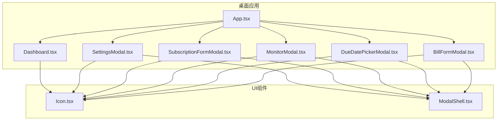
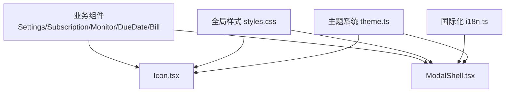
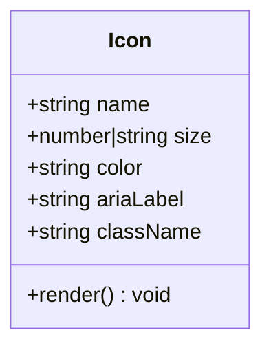
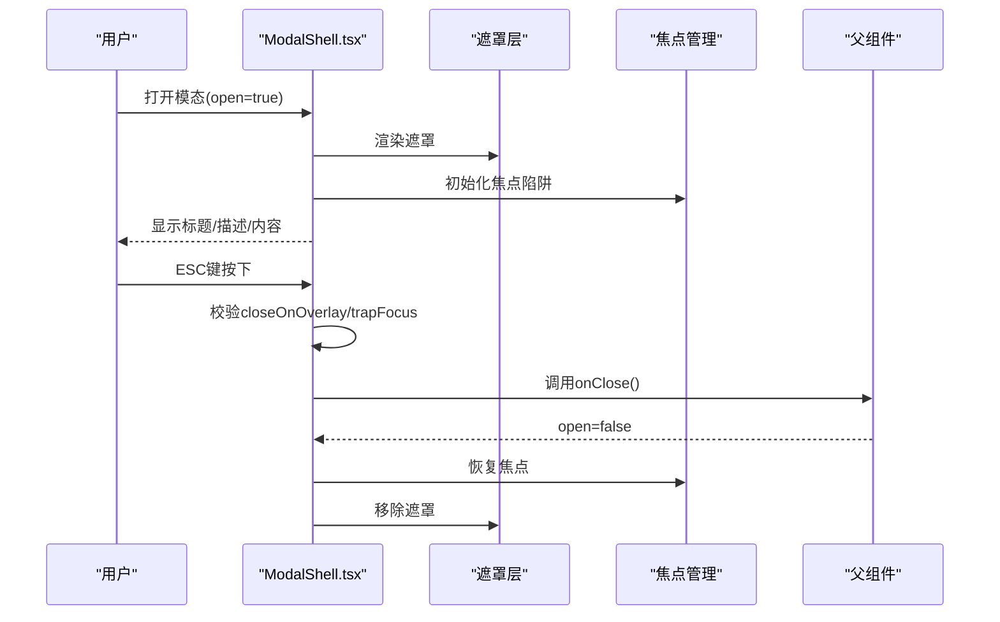
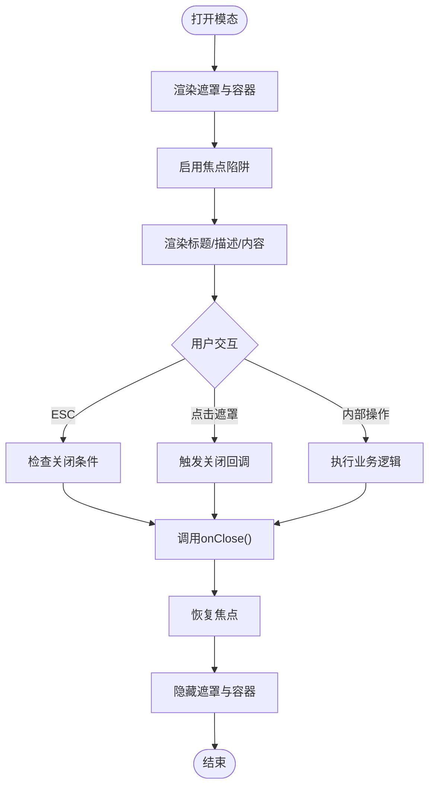
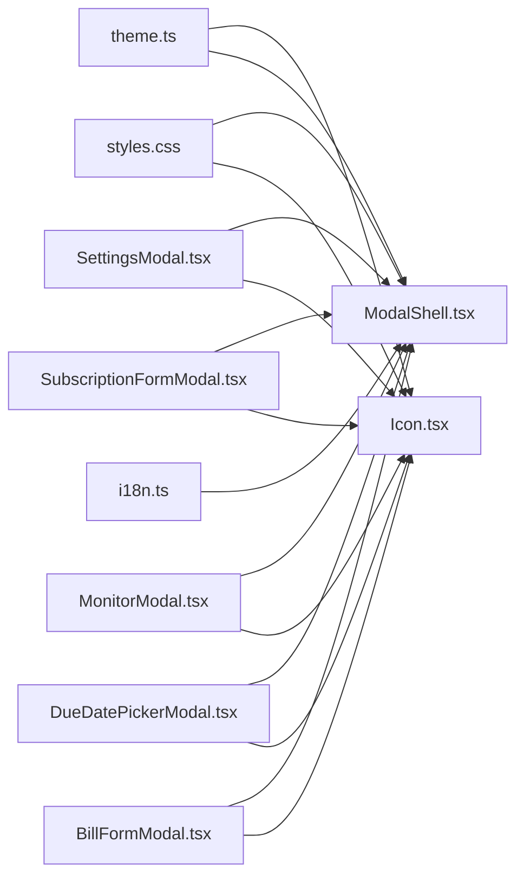

# UI组件库

<cite>
**本文引用的文件**   
- [Icon.tsx](file://apps/desktop/src/ui/Icon.tsx)
- [ModalShell.tsx](file://apps/desktop/src/ui/ModalShell.tsx)
- [App.tsx](file://apps/desktop/src/App.tsx)
- [Dashboard.tsx](file://apps/desktop/src/Dashboard.tsx)
- [SettingsModal.tsx](file://apps/desktop/src/SettingsModal.tsx)
- [SubscriptionFormModal.tsx](file://apps/desktop/src/SubscriptionFormModal.tsx)
- [MonitorModal.tsx](file://apps/desktop/src/MonitorModal.tsx)
- [DueDatePickerModal.tsx](file://apps/desktop/src/DueDatePickerModal.tsx)
- [BillFormModal.tsx](file://apps/desktop/src/BillFormModal.tsx)
- [theme.ts](file://apps/desktop/src/theme.ts)
- [i18n.ts](file://apps/desktop/src/i18n.ts)
- [styles.css](file://apps/desktop/src/styles.css)
</cite>

## 目录
1. [简介](#简介)
2. [项目结构](#项目结构)
3. [核心组件](#核心组件)
4. [架构总览](#架构总览)
5. [详细组件分析](#详细组件分析)
6. [依赖分析](#依赖分析)
7. [性能考虑](#性能考虑)
8. [故障排查指南](#故障排查指南)
9. [结论](#结论)
10. [附录](#附录)

## 简介
本文件面向UI组件库的使用与扩展，重点覆盖以下两个组件：
- Icon图标组件：提供统一的图标渲染、尺寸控制、颜色继承与无障碍属性。
- ModalShell模态框容器：提供模态遮罩、焦点管理、键盘交互、响应式布局与主题适配能力。

文档将阐述设计原则、API接口、使用示例、组合模式与最佳实践，并包含响应式设计、无障碍访问（a11y）和主题适配的说明。

## 项目结构
本项目采用应用内聚的组织方式，UI组件位于桌面应用的ui目录中，业务页面通过导入这些组件进行组合使用。Icon与ModalShell作为基础UI构件，被多个业务模态与视图复用。

图表来源
- [App.tsx](file://apps/desktop/src/App.tsx)
- [Dashboard.tsx](file://apps/desktop/src/Dashboard.tsx)
- [SettingsModal.tsx](file://apps/desktop/src/SettingsModal.tsx)
- [SubscriptionFormModal.tsx](file://apps/desktop/src/SubscriptionFormModal.tsx)
- [MonitorModal.tsx](file://apps/desktop/src/MonitorModal.tsx)
- [DueDatePickerModal.tsx](file://apps/desktop/src/DueDatePickerModal.tsx)
- [BillFormModal.tsx](file://apps/desktop/src/BillFormModal.tsx)
- [Icon.tsx](file://apps/desktop/src/ui/Icon.tsx)
- [ModalShell.tsx](file://apps/desktop/src/ui/ModalShell.tsx)

章节来源
- [App.tsx](file://apps/desktop/src/App.tsx)
- [Dashboard.tsx](file://apps/desktop/src/Dashboard.tsx)
- [SettingsModal.tsx](file://apps/desktop/src/SettingsModal.tsx)
- [SubscriptionFormModal.tsx](file://apps/desktop/src/SubscriptionFormModal.tsx)
- [MonitorModal.tsx](file://apps/desktop/src/MonitorModal.tsx)
- [DueDatePickerModal.tsx](file://apps/desktop/src/DueDatePickerModal.tsx)
- [BillFormModal.tsx](file://apps/desktop/src/BillFormModal.tsx)
- [Icon.tsx](file://apps/desktop/src/ui/Icon.tsx)
- [ModalShell.tsx](file://apps/desktop/src/ui/ModalShell.tsx)

## 核心组件
本节聚焦Icon与ModalShell两个组件的设计目标、职责边界与对外暴露的能力。

- Icon图标组件
  - 职责：统一图标渲染、尺寸与颜色控制、无障碍标签、与主题系统联动。
  - 关键能力：尺寸缩放、颜色继承、aria属性注入、可访问性文本支持。
  - 典型用法：在按钮、导航、表单控件等位置作为视觉提示或操作入口。

- ModalShell模态框容器
  - 职责：提供模态展示容器、遮罩层、焦点陷阱、ESC关闭、滚动锁定、响应式布局。
  - 关键能力：插槽内容承载、标题与描述区域、底部操作区、动画过渡、主题样式接入。
  - 典型用法：包裹业务表单、确认对话框、设置面板等需要中断用户流程的场景。

章节来源
- [Icon.tsx](file://apps/desktop/src/ui/Icon.tsx)
- [ModalShell.tsx](file://apps/desktop/src/ui/ModalShell.tsx)

## 架构总览
Icon与ModalShell作为原子级UI构件，被上层业务组件组合使用。ModalShell负责呈现与交互框架，Icon负责视觉符号表达。两者均与主题系统（theme.ts）、国际化（i18n.ts）以及全局样式（styles.css）协作，确保一致性与可维护性。

图表来源
- [theme.ts](file://apps/desktop/src/theme.ts)
- [i18n.ts](file://apps/desktop/src/i18n.ts)
- [styles.css](file://apps/desktop/src/styles.css)
- [Icon.tsx](file://apps/desktop/src/ui/Icon.tsx)
- [ModalShell.tsx](file://apps/desktop/src/ui/ModalShell.tsx)
- [SettingsModal.tsx](file://apps/desktop/src/SettingsModal.tsx)
- [SubscriptionFormModal.tsx](file://apps/desktop/src/SubscriptionFormModal.tsx)
- [MonitorModal.tsx](file://apps/desktop/src/MonitorModal.tsx)
- [DueDatePickerModal.tsx](file://apps/desktop/src/DueDatePickerModal.tsx)
- [BillFormModal.tsx](file://apps/desktop/src/BillFormModal.tsx)

## 详细组件分析

### Icon图标组件
Icon组件用于统一图标渲染与语义化表达，支持尺寸、颜色与无障碍属性的配置。

- API概览
  - 名称：Icon
  - 主要属性
    - name：图标标识（字符串）
    - size：尺寸（数值或预设值）
    - color：颜色（继承或指定）
    - ariaLabel：无障碍标签（字符串）
    - className：自定义类名（字符串）
  - 行为
    - 根据name选择对应图标资源
    - 应用size与color到渲染元素
    - 注入aria-*属性提升可访问性
    - 支持className叠加样式

- 使用示例（路径引用）
  - 在按钮中使用图标：[SettingsModal.tsx](file://apps/desktop/src/SettingsModal.tsx)
  - 在表单项中使用图标：[SubscriptionFormModal.tsx](file://apps/desktop/src/SubscriptionFormModal.tsx)
  - 在监控面板中使用图标：[MonitorModal.tsx](file://apps/desktop/src/MonitorModal.tsx)
  - 在日期选择器中使用图标：[DueDatePickerModal.tsx](file://apps/desktop/src/DueDatePickerModal.tsx)
  - 在账单表单中使用图标：[BillFormModal.tsx](file://apps/desktop/src/BillFormModal.tsx)

- 设计原则
  - 单一职责：仅负责图标渲染与语义标注
  - 主题兼容：颜色与尺寸受主题系统影响
  - 可访问性：默认提供aria-label与role支持
  - 可扩展：通过className允许外部样式覆盖

- 无障碍与主题
  - 无障碍：为屏幕阅读器提供语义信息；避免纯装饰图标时隐藏语义
  - 主题：颜色与尺寸跟随主题变量；支持深色/浅色切换

图表来源
- [Icon.tsx](file://apps/desktop/src/ui/Icon.tsx)

章节来源
- [Icon.tsx](file://apps/desktop/src/ui/Icon.tsx)
- [SettingsModal.tsx](file://apps/desktop/src/SettingsModal.tsx)
- [SubscriptionFormModal.tsx](file://apps/desktop/src/SubscriptionFormModal.tsx)
- [MonitorModal.tsx](file://apps/desktop/src/MonitorModal.tsx)
- [DueDatePickerModal.tsx](file://apps/desktop/src/DueDatePickerModal.tsx)
- [BillFormModal.tsx](file://apps/desktop/src/BillFormModal.tsx)

### ModalShell模态框容器
ModalShell是模态框的基础容器，提供遮罩、焦点管理、键盘事件处理、滚动锁定与响应式布局。

- API概览
  - 名称：ModalShell
  - 主要属性
    - open：是否显示（布尔）
    - onClose：关闭回调（函数）
    - title：标题（字符串）
    - description：描述（字符串）
    - footer：底部操作区（节点或函数）
    - width：宽度（数值或百分比）
    - responsive：是否启用响应式（布尔）
    - trapFocus：是否启用焦点陷阱（布尔）
    - closeOnOverlay：点击遮罩关闭（布尔）
    - className：自定义类名（字符串）
  - 插槽
    - default：主体内容插槽
    - header：头部插槽（可选）
    - footer：底部插槽（可选）

- 交互流程（序列图）

图表来源
- [ModalShell.tsx](file://apps/desktop/src/ui/ModalShell.tsx)

- 使用示例（路径引用）
  - 设置面板：[SettingsModal.tsx](file://apps/desktop/src/SettingsModal.tsx)
  - 订阅表单：[SubscriptionFormModal.tsx](file://apps/desktop/src/SubscriptionFormModal.tsx)
  - 监控面板：[MonitorModal.tsx](file://apps/desktop/src/MonitorModal.tsx)
  - 到期日选择：[DueDatePickerModal.tsx](file://apps/desktop/src/DueDatePickerModal.tsx)
  - 账单表单：[BillFormModal.tsx](file://apps/desktop/src/BillFormModal.tsx)

- 设计原则
  - 容器职责：只负责布局、交互与可访问性，不耦合业务逻辑
  - 插槽优先：通过插槽灵活承载任意内容
  - 主题适配：样式由主题系统与全局样式驱动
  - 响应式：移动端与桌面端自适应布局

- 无障碍与主题
  - 无障碍：ARIA角色、标题与描述关联、焦点陷阱、ESC关闭
  - 主题：背景色、边框、阴影、间距遵循主题变量

图表来源
- [ModalShell.tsx](file://apps/desktop/src/ui/ModalShell.tsx)

章节来源
- [ModalShell.tsx](file://apps/desktop/src/ui/ModalShell.tsx)
- [SettingsModal.tsx](file://apps/desktop/src/SettingsModal.tsx)
- [SubscriptionFormModal.tsx](file://apps/desktop/src/SubscriptionFormModal.tsx)
- [MonitorModal.tsx](file://apps/desktop/src/MonitorModal.tsx)
- [DueDatePickerModal.tsx](file://apps/desktop/src/DueDatePickerModal.tsx)
- [BillFormModal.tsx](file://apps/desktop/src/BillFormModal.tsx)

### 组件组合模式与最佳实践
- 组合模式
  - ModalShell作为外层容器，承载业务表单或信息展示
  - Icon作为内嵌元素，提供视觉提示与操作入口
  - 通过插槽将复杂内容模块化，保持ModalShell的职责单一

- 最佳实践
  - 始终为Icon提供ariaLabel，避免纯装饰图标时隐藏语义
  - 为ModalShell设置title与description，提升可访问性
  - 使用trapFocus确保键盘导航一致性
  - 合理设置width与responsive，适配多设备
  - 通过className进行局部样式覆盖，避免直接修改组件源码

章节来源
- [ModalShell.tsx](file://apps/desktop/src/ui/ModalShell.tsx)
- [Icon.tsx](file://apps/desktop/src/ui/Icon.tsx)

## 依赖分析
Icon与ModalShell依赖主题系统、国际化与全局样式，同时被多个业务组件复用。

图表来源
- [theme.ts](file://apps/desktop/src/theme.ts)
- [i18n.ts](file://apps/desktop/src/i18n.ts)
- [styles.css](file://apps/desktop/src/styles.css)
- [Icon.tsx](file://apps/desktop/src/ui/Icon.tsx)
- [ModalShell.tsx](file://apps/desktop/src/ui/ModalShell.tsx)
- [SettingsModal.tsx](file://apps/desktop/src/SettingsModal.tsx)
- [SubscriptionFormModal.tsx](file://apps/desktop/src/SubscriptionFormModal.tsx)
- [MonitorModal.tsx](file://apps/desktop/src/MonitorModal.tsx)
- [DueDatePickerModal.tsx](file://apps/desktop/src/DueDatePickerModal.tsx)
- [BillFormModal.tsx](file://apps/desktop/src/BillFormModal.tsx)

章节来源
- [theme.ts](file://apps/desktop/src/theme.ts)
- [i18n.ts](file://apps/desktop/src/i18n.ts)
- [styles.css](file://apps/desktop/src/styles.css)
- [Icon.tsx](file://apps/desktop/src/ui/Icon.tsx)
- [ModalShell.tsx](file://apps/desktop/src/ui/ModalShell.tsx)
- [SettingsModal.tsx](file://apps/desktop/src/SettingsModal.tsx)
- [SubscriptionFormModal.tsx](file://apps/desktop/src/SubscriptionFormModal.tsx)
- [MonitorModal.tsx](file://apps/desktop/src/MonitorModal.tsx)
- [DueDatePickerModal.tsx](file://apps/desktop/src/DueDatePickerModal.tsx)
- [BillFormModal.tsx](file://apps/desktop/src/BillFormModal.tsx)

## 性能考虑
- Icon组件
  - 避免重复加载相同图标资源，建议使用缓存或预加载策略
  - 控制size与color的更新频率，减少重绘
- ModalShell组件
  - 仅在open为true时渲染遮罩与内容，降低初始开销
  - 焦点陷阱与键盘事件监听应在组件卸载时清理
  - 响应式计算应避免频繁触发，使用防抖或节流优化

## 故障排查指南
- 常见问题
  - 图标未显示：检查name是否正确、资源路径是否可用、className是否覆盖导致不可见
  - 模态框无法关闭：确认onClose是否正确绑定、ESC与遮罩点击事件是否生效
  - 焦点异常：验证trapFocus是否启用、是否在关闭后正确恢复焦点
  - 主题不一致：检查主题变量是否覆盖、样式优先级是否正确
- 调试建议
  - 使用浏览器开发者工具检查DOM结构与样式
  - 打印组件属性以确认传入参数是否符合预期
  - 逐步注释插槽内容定位问题范围

章节来源
- [Icon.tsx](file://apps/desktop/src/ui/Icon.tsx)
- [ModalShell.tsx](file://apps/desktop/src/ui/ModalShell.tsx)
- [styles.css](file://apps/desktop/src/styles.css)
- [theme.ts](file://apps/desktop/src/theme.ts)

## 结论
Icon与ModalShell作为UI组件库的核心构件，提供了统一的图标渲染与模态框容器能力。通过清晰的API设计、插槽机制与主题适配，它们能够灵活地服务于各类业务场景。遵循无障碍与响应式设计原则，结合组合模式与最佳实践，可构建出高质量、可维护的用户界面。

## 附录
- 相关主题与样式文件
  - 主题定义：[theme.ts](file://apps/desktop/src/theme.ts)
  - 全局样式：[styles.css](file://apps/desktop/src/styles.css)
  - 国际化：[i18n.ts](file://apps/desktop/src/i18n.ts)
- 使用示例参考
  - 设置面板：[SettingsModal.tsx](file://apps/desktop/src/SettingsModal.tsx)
  - 订阅表单：[SubscriptionFormModal.tsx](file://apps/desktop/src/SubscriptionFormModal.tsx)
  - 监控面板：[MonitorModal.tsx](file://apps/desktop/src/MonitorModal.tsx)
  - 到期日选择：[DueDatePickerModal.tsx](file://apps/desktop/src/DueDatePickerModal.tsx)
  - 账单表单：[BillFormModal.tsx](file://apps/desktop/src/BillFormModal.tsx)