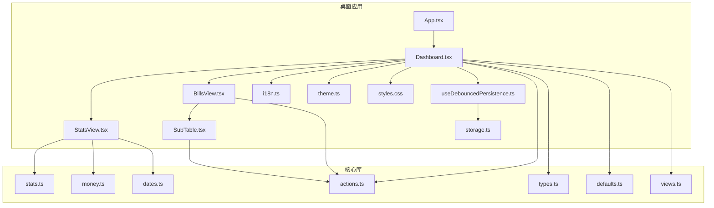
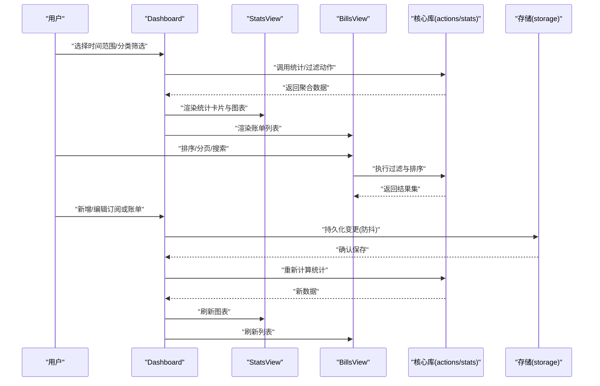
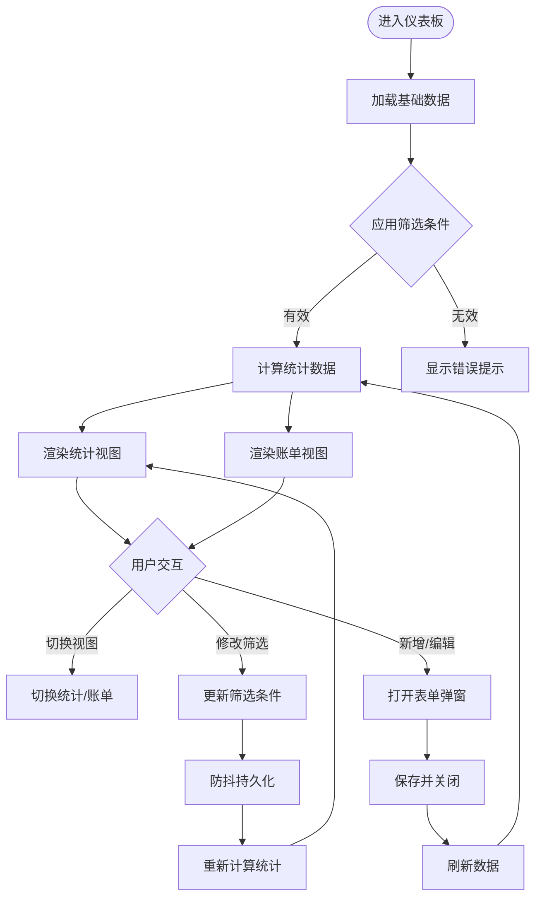
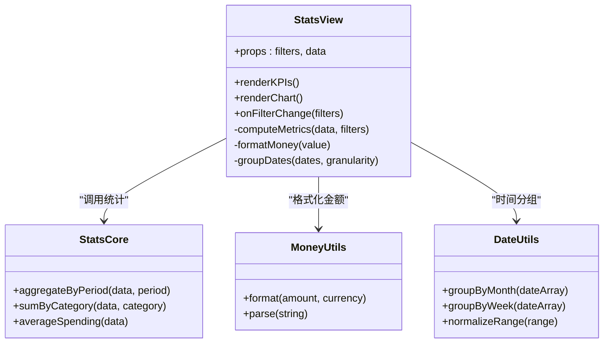
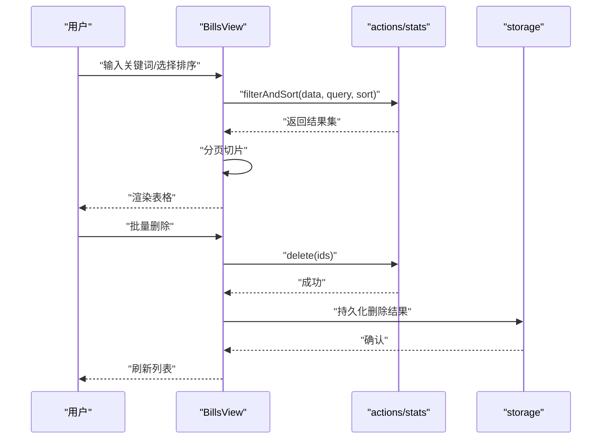
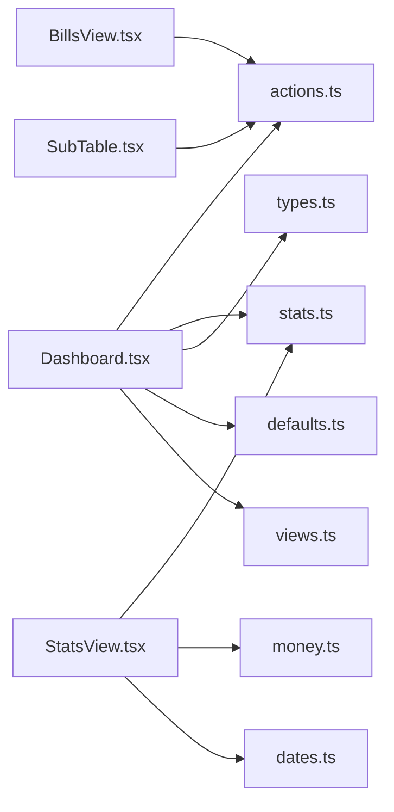

# 仪表板视图

<cite>
**本文引用的文件**   
- [Dashboard.tsx](file://apps/desktop/src/Dashboard.tsx)
- [StatsView.tsx](file://apps/desktop/src/StatsView.tsx)
- [BillsView.tsx](file://apps/desktop/src/BillsView.tsx)
- [SubTable.tsx](file://apps/desktop/src/SubTable.tsx)
- [categoryLabel.ts](file://apps/desktop/src/categoryLabel.ts)
- [subscriptionFields.ts](file://apps/desktop/src/subscriptionFields.ts)
- [useDebouncedPersistence.ts](file://apps/desktop/src/useDebouncedPersistence.ts)
- [storage.ts](file://apps/desktop/src/storage.ts)
- [i18n.ts](file://apps/desktop/src/i18n.ts)
- [theme.ts](file://apps/desktop/src/theme.ts)
- [styles.css](file://apps/desktop/src/styles.css)
- [actions.ts](file://packages/core/src/actions.ts)
- [stats.ts](file://packages/core/src/stats.ts)
- [types.ts](file://packages/core/src/types.ts)
- [defaults.ts](file://packages/core/src/defaults.ts)
- [views.ts](file://packages/core/src/views.ts)
- [money.ts](file://packages/core/src/money.ts)
- [dates.ts](file://packages/core/src/dates.ts)
- [App.tsx](file://apps/desktop/src/App.tsx)
- [main.tsx](file://apps/desktop/src/main.tsx)
</cite>

## 目录
1. [简介](#简介)
2. [项目结构](#项目结构)
3. [核心组件](#核心组件)
4. [架构总览](#架构总览)
5. [详细组件分析](#详细组件分析)
6. [依赖关系分析](#依赖关系分析)
7. [性能考虑](#性能考虑)
8. [故障排查指南](#故障排查指南)
9. [结论](#结论)
10. [附录](#附录)

## 简介
本文件面向“仪表板视图”（Dashboard）的完整说明，覆盖整体布局、数据展示逻辑、统计数据计算方式、图表渲染与实时更新机制、用户交互与筛选、可视化呈现、组件属性配置、事件处理与样式定制，以及性能优化与最佳实践。文档以代码为依据，结合仓库中的前端组件与核心库模块进行系统化阐述，帮助读者快速理解并高效扩展仪表板功能。

## 项目结构
本项目采用多包结构：桌面应用位于 apps/desktop，核心领域逻辑位于 packages/core。仪表板相关的前端实现集中在 apps/desktop/src 下的多个 React 组件中；统计计算、类型定义、默认值、视图工具等由 packages/core 提供。

图示来源 
- [App.tsx](file://apps/desktop/src/App.tsx)
- [Dashboard.tsx](file://apps/desktop/src/Dashboard.tsx)
- [StatsView.tsx](file://apps/desktop/src/StatsView.tsx)
- [BillsView.tsx](file://apps/desktop/src/BillsView.tsx)
- [SubTable.tsx](file://apps/desktop/src/SubTable.tsx)
- [i18n.ts](file://apps/desktop/src/i18n.ts)
- [theme.ts](file://apps/desktop/src/theme.ts)
- [styles.css](file://apps/desktop/src/styles.css)
- [useDebouncedPersistence.ts](file://apps/desktop/src/useDebouncedPersistence.ts)
- [storage.ts](file://apps/desktop/src/storage.ts)
- [actions.ts](file://packages/core/src/actions.ts)
- [stats.ts](file://packages/core/src/stats.ts)
- [types.ts](file://packages/core/src/types.ts)
- [defaults.ts](file://packages/core/src/defaults.ts)
- [views.ts](file://packages/core/src/views.ts)
- [money.ts](file://packages/core/src/money.ts)
- [dates.ts](file://packages/core/src/dates.ts)

章节来源
- [App.tsx](file://apps/desktop/src/App.tsx)
- [Dashboard.tsx](file://apps/desktop/src/Dashboard.tsx)
- [StatsView.tsx](file://apps/desktop/src/StatsView.tsx)
- [BillsView.tsx](file://apps/desktop/src/BillsView.tsx)
- [SubTable.tsx](file://apps/desktop/src/SubTable.tsx)
- [actions.ts](file://packages/core/src/actions.ts)
- [stats.ts](file://packages/core/src/stats.ts)
- [types.ts](file://packages/core/src/types.ts)
- [defaults.ts](file://packages/core/src/defaults.ts)
- [views.ts](file://packages/core/src/views.ts)
- [money.ts](file://packages/core/src/money.ts)
- [dates.ts](file://packages/core/src/dates.ts)
- [i18n.ts](file://apps/desktop/src/i18n.ts)
- [theme.ts](file://apps/desktop/src/theme.ts)
- [styles.css](file://apps/desktop/src/styles.css)
- [useDebouncedPersistence.ts](file://apps/desktop/src/useDebouncedPersistence.ts)
- [storage.ts](file://apps/desktop/src/storage.ts)

## 核心组件
- Dashboard：仪表板主容器，负责布局编排、状态管理、数据聚合入口、筛选条件与视图切换。
- StatsView：统计概览视图，展示关键指标与趋势图，调用核心库统计方法生成数据。
- BillsView：账单列表视图，支持分页、排序、筛选、批量操作与导出。
- SubTable：子表格组件，用于嵌套明细展示与行级交互。
- useDebouncedPersistence：防抖持久化 Hook，减少频繁写入存储的开销。
- storage：本地存储封装，统一读写策略。
- i18n：国际化文案管理。
- theme：主题与样式变量。
- styles.css：全局样式与组件样式。

章节来源
- [Dashboard.tsx](file://apps/desktop/src/Dashboard.tsx)
- [StatsView.tsx](file://apps/desktop/src/StatsView.tsx)
- [BillsView.tsx](file://apps/desktop/src/BillsView.tsx)
- [SubTable.tsx](file://apps/desktop/src/SubTable.tsx)
- [useDebouncedPersistence.ts](file://apps/desktop/src/useDebouncedPersistence.ts)
- [storage.ts](file://apps/desktop/src/storage.ts)
- [i18n.ts](file://apps/desktop/src/i18n.ts)
- [theme.ts](file://apps/desktop/src/theme.ts)
- [styles.css](file://apps/desktop/src/styles.css)

## 架构总览
仪表板采用“UI 层 + 核心库”的分层架构。UI 层负责交互与渲染，核心库提供领域能力（统计、金额格式化、日期处理、类型与默认值、视图工具）。数据流从 UI 触发 actions，进入核心库处理后返回结果，再由 UI 更新视图。

图示来源 
- [Dashboard.tsx](file://apps/desktop/src/Dashboard.tsx)
- [StatsView.tsx](file://apps/desktop/src/StatsView.tsx)
- [BillsView.tsx](file://apps/desktop/src/BillsView.tsx)
- [actions.ts](file://packages/core/src/actions.ts)
- [stats.ts](file://packages/core/src/stats.ts)
- [storage.ts](file://apps/desktop/src/storage.ts)

## 详细组件分析

### Dashboard 组件
- 职责：编排 StatsView 与 BillsView，维护筛选条件（时间范围、类别、关键词）、视图模式（统计/账单）、加载与错误状态。
- 数据流：通过 actions 获取原始数据，使用 stats 进行聚合，将结果传递给子组件。
- 交互：支持切换视图、重置筛选、打开表单弹窗（订阅/账单），监听键盘快捷键与窗口焦点变化。
- 持久化：使用 useDebouncedPersistence 对筛选条件与视图偏好进行防抖保存。
- 可访问性：遵循主题与国际化规范，确保文本与提示语的多语言支持。

图示来源 
- [Dashboard.tsx](file://apps/desktop/src/Dashboard.tsx)
- [useDebouncedPersistence.ts](file://apps/desktop/src/useDebouncedPersistence.ts)
- [actions.ts](file://packages/core/src/actions.ts)
- [stats.ts](file://packages/core/src/stats.ts)

章节来源
- [Dashboard.tsx](file://apps/desktop/src/Dashboard.tsx)
- [useDebouncedPersistence.ts](file://apps/desktop/src/useDebouncedPersistence.ts)
- [actions.ts](file://packages/core/src/actions.ts)
- [stats.ts](file://packages/core/src/stats.ts)

### StatsView 组件
- 职责：展示关键指标（如总支出、订阅数量、平均花费等）与趋势图（按月/周/日维度）。
- 数据计算：调用核心库 stats 模块进行聚合，结合 money 与 dates 模块进行金额格式化与时间分组。
- 图表渲染：根据数据维度动态生成图表配置，支持折线、柱状、饼图等类型。
- 实时更新：当筛选条件或底层数据变化时，自动重算并刷新图表。

图示来源 
- [StatsView.tsx](file://apps/desktop/src/StatsView.tsx)
- [stats.ts](file://packages/core/src/stats.ts)
- [money.ts](file://packages/core/src/money.ts)
- [dates.ts](file://packages/core/src/dates.ts)

章节来源
- [StatsView.tsx](file://apps/desktop/src/StatsView.tsx)
- [stats.ts](file://packages/core/src/stats.ts)
- [money.ts](file://packages/core/src/money.ts)
- [dates.ts](file://packages/core/src/dates.ts)

### BillsView 组件
- 职责：展示账单列表，支持搜索、排序、分页、批量删除与导出。
- 数据流：接收过滤后的数据集，按列排序，分页切片，渲染为表格。
- 交互：行点击展开详情，多选框批量操作，导出 CSV/PDF。
- 性能：虚拟滚动与懒加载，避免大数据量卡顿。

图示来源 
- [BillsView.tsx](file://apps/desktop/src/BillsView.tsx)
- [actions.ts](file://packages/core/src/actions.ts)
- [storage.ts](file://apps/desktop/src/storage.ts)

章节来源
- [BillsView.tsx](file://apps/desktop/src/BillsView.tsx)
- [actions.ts](file://packages/core/src/actions.ts)
- [storage.ts](file://apps/desktop/src/storage.ts)

### SubTable 组件
- 职责：作为嵌套表格，展示主表的子项明细，支持行内编辑与校验。
- 特性：可配置列定义、单元格编辑器、行级事件回调。
- 性能：按需渲染与增量更新，减少重排。

章节来源
- [SubTable.tsx](file://apps/desktop/src/SubTable.tsx)

### 分类标签与字段映射
- categoryLabel：提供分类名称映射与显示规则，保证界面一致性。
- subscriptionFields：订阅表单字段定义与校验规则，支撑新增/编辑流程。

章节来源
- [categoryLabel.ts](file://apps/desktop/src/categoryLabel.ts)
- [subscriptionFields.ts](file://apps/desktop/src/subscriptionFields.ts)

### 持久化与存储
- useDebouncedPersistence：对筛选条件、视图偏好等进行防抖保存，降低 I/O 压力。
- storage：封装本地存储接口，统一读写策略与错误处理。

章节来源
- [useDebouncedPersistence.ts](file://apps/desktop/src/useDebouncedPersistence.ts)
- [storage.ts](file://apps/desktop/src/storage.ts)

### 国际化与主题
- i18n：集中管理多语言文案，组件通过键值获取显示文本。
- theme：定义颜色、字体、间距等主题变量，支持明暗主题切换。
- styles.css：全局样式与组件样式，确保视觉一致性。

章节来源
- [i18n.ts](file://apps/desktop/src/i18n.ts)
- [theme.ts](file://apps/desktop/src/theme.ts)
- [styles.css](file://apps/desktop/src/styles.css)

## 依赖关系分析
仪表板依赖核心库提供的统计、金额、日期、类型与默认值等能力，同时通过 actions 协调数据变更。UI 层与核心库解耦，便于测试与复用。

图示来源 
- [Dashboard.tsx](file://apps/desktop/src/Dashboard.tsx)
- [StatsView.tsx](file://apps/desktop/src/StatsView.tsx)
- [BillsView.tsx](file://apps/desktop/src/BillsView.tsx)
- [SubTable.tsx](file://apps/desktop/src/SubTable.tsx)
- [actions.ts](file://packages/core/src/actions.ts)
- [stats.ts](file://packages/core/src/stats.ts)
- [types.ts](file://packages/core/src/types.ts)
- [defaults.ts](file://packages/core/src/defaults.ts)
- [views.ts](file://packages/core/src/views.ts)
- [money.ts](file://packages/core/src/money.ts)
- [dates.ts](file://packages/core/src/dates.ts)

章节来源
- [Dashboard.tsx](file://apps/desktop/src/Dashboard.tsx)
- [StatsView.tsx](file://apps/desktop/src/StatsView.tsx)
- [BillsView.tsx](file://apps/desktop/src/BillsView.tsx)
- [SubTable.tsx](file://apps/desktop/src/SubTable.tsx)
- [actions.ts](file://packages/core/src/actions.ts)
- [stats.ts](file://packages/core/src/stats.ts)
- [types.ts](file://packages/core/src/types.ts)
- [defaults.ts](file://packages/core/src/defaults.ts)
- [views.ts](file://packages/core/src/views.ts)
- [money.ts](file://packages/core/src/money.ts)
- [dates.ts](file://packages/core/src/dates.ts)

## 性能考虑
- 数据聚合优化：在核心库中对大数据集进行预分组与索引，减少重复计算。
- 防抖与节流：对筛选、搜索与持久化操作使用防抖，避免频繁重渲染与 I/O。
- 虚拟滚动：在大列表场景下启用虚拟滚动，仅渲染可视区域。
- 惰性加载：图表与子表按需加载，首屏更快。
- 缓存策略：对常用统计结果进行短期缓存，提升响应速度。
- 内存管理：及时释放不再使用的中间对象，避免内存泄漏。

[本节为通用指导，不直接分析具体文件]

## 故障排查指南
- 数据不一致：检查 actions 是否正确调用，确认 storage 写入是否成功，核对筛选条件是否被正确应用。
- 图表不更新：确认数据源是否变化，检查统计计算逻辑与时间分组是否正确。
- 性能问题：查看是否有未防抖的操作，是否存在全量重渲染，必要时引入虚拟滚动或分页。
- 国际化缺失：确认 i18n 键值是否存在，组件是否正确读取文案。
- 主题异常：检查 theme 变量是否生效，CSS 是否被覆盖。

章节来源
- [actions.ts](file://packages/core/src/actions.ts)
- [storage.ts](file://apps/desktop/src/storage.ts)
- [stats.ts](file://packages/core/src/stats.ts)
- [i18n.ts](file://apps/desktop/src/i18n.ts)
- [theme.ts](file://apps/desktop/src/theme.ts)
- [styles.css](file://apps/desktop/src/styles.css)

## 结论
仪表板视图通过清晰的组件分层与核心库解耦，实现了高内聚、低耦合的数据展示与交互体验。借助统计聚合、金额与日期工具、防抖持久化与主题国际化，系统具备良好的可维护性与扩展性。遵循本文的性能优化建议与最佳实践，可进一步提升用户体验与系统稳定性。

[本节为总结性内容，不直接分析具体文件]

## 附录
- 组件属性配置：建议在组件 props 中明确数据类型、默认值与必填项，配合类型定义提高健壮性。
- 事件处理：统一事件命名与冒泡策略，避免冲突；对异步操作进行错误捕获与用户反馈。
- 样式定制：优先使用主题变量，避免硬编码颜色与尺寸；保持 CSS 模块化与命名规范。
- 测试建议：对统计计算与 actions 编写单元测试，对 UI 交互进行快照测试。

[本节为补充信息，不直接分析具体文件]