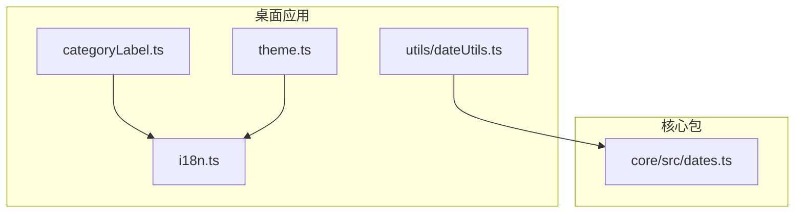
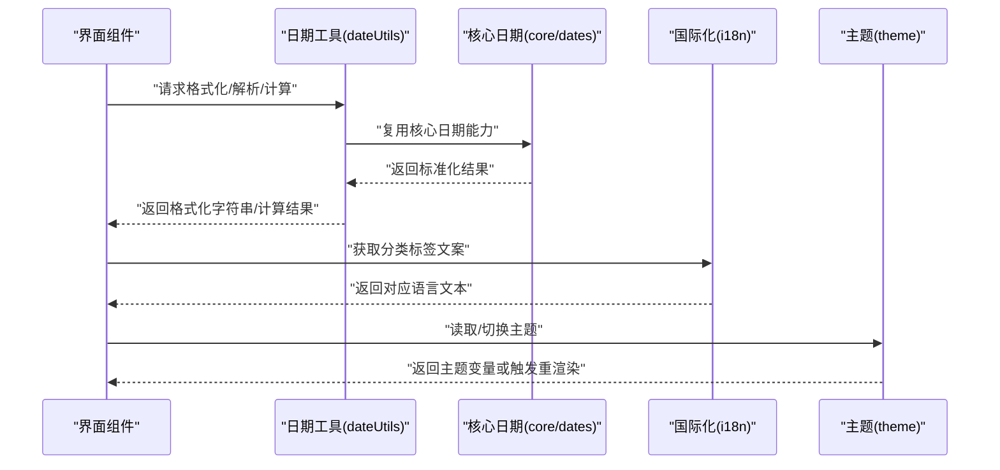
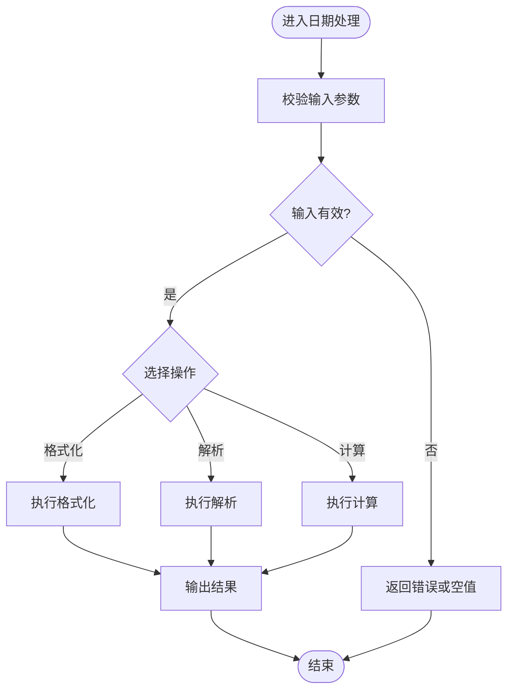
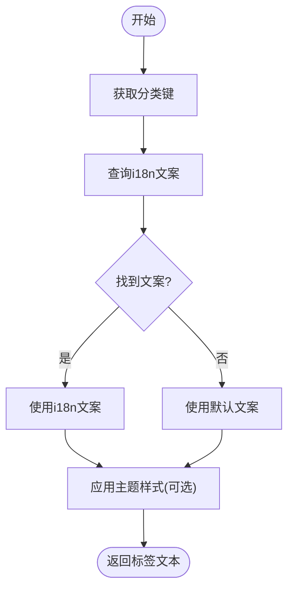
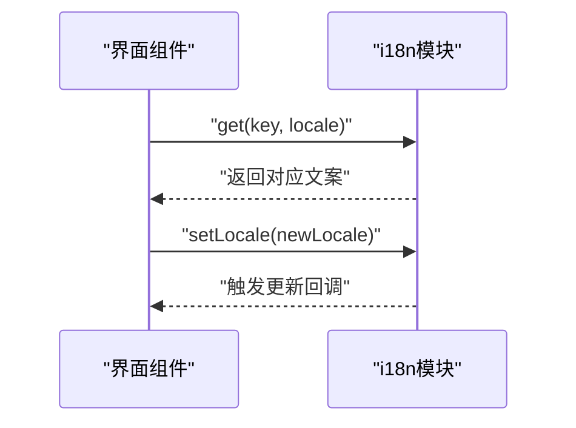
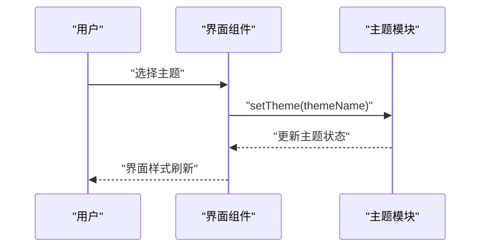
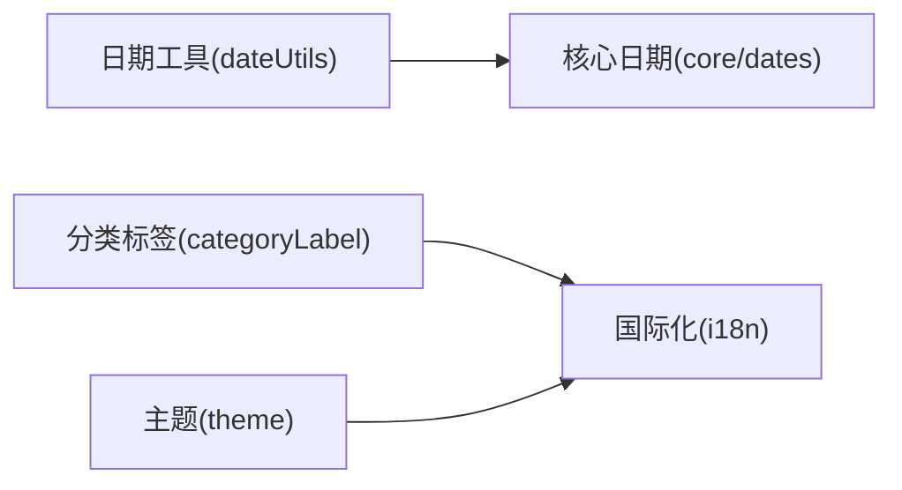

# 工具函数

<cite>
**本文引用的文件**   
- [apps/desktop/src/utils/dateUtils.ts](file://apps/desktop/src/utils/dateUtils.ts)
- [packages/core/src/dates.ts](file://packages/core/src/dates.ts)
- [apps/desktop/src/categoryLabel.ts](file://apps/desktop/src/categoryLabel.ts)
- [apps/desktop/src/i18n.ts](file://apps/desktop/src/i18n.ts)
- [apps/desktop/src/theme.ts](file://apps/desktop/src/theme.ts)
</cite>

## 目录
1. [简介](#简介)
2. [项目结构](#项目结构)
3. [核心组件](#核心组件)
4. [架构总览](#架构总览)
5. [详细组件分析](#详细组件分析)
6. [依赖分析](#依赖分析)
7. [性能考虑](#性能考虑)
8. [故障排查指南](#故障排查指南)
9. [结论](#结论)
10. [附录](#附录)

## 简介
本文件聚焦于桌面端与核心包中的工具函数，围绕以下主题提供系统化说明：
- dateUtils 日期工具：格式化、解析与计算能力
- categoryLabel 分类标签：处理逻辑与显示规则
- i18n 国际化：配置方式与多语言支持
- theme 主题系统：设计与切换机制
同时给出使用示例、参数说明、返回值类型以及扩展与最佳实践建议。

## 项目结构
与工具函数相关的代码主要分布在两个位置：
- apps/desktop/src：桌面应用层面的工具与UI相关实现（日期工具、分类标签、国际化、主题）
- packages/core/src：跨平台/可复用的核心能力（日期处理等）

**图表来源** 
- [apps/desktop/src/utils/dateUtils.ts](file://apps/desktop/src/utils/dateUtils.ts)
- [packages/core/src/dates.ts](file://packages/core/src/dates.ts)
- [apps/desktop/src/categoryLabel.ts](file://apps/desktop/src/categoryLabel.ts)
- [apps/desktop/src/i18n.ts](file://apps/desktop/src/i18n.ts)
- [apps/desktop/src/theme.ts](file://apps/desktop/src/theme.ts)

**章节来源**
- [apps/desktop/src/utils/dateUtils.ts](file://apps/desktop/src/utils/dateUtils.ts)
- [packages/core/src/dates.ts](file://packages/core/src/dates.ts)
- [apps/desktop/src/categoryLabel.ts](file://apps/desktop/src/categoryLabel.ts)
- [apps/desktop/src/i18n.ts](file://apps/desktop/src/i18n.ts)
- [apps/desktop/src/theme.ts](file://apps/desktop/src/theme.ts)

## 核心组件
本节概述各工具模块的职责与交互关系，为后续深入分析奠定基础。

- 日期工具（dateUtils）：封装常用日期格式化、解析与区间计算，统一输出格式，降低业务层复杂度
- 分类标签（categoryLabel）：将内部分类标识映射为用户可读的标签文本，支持本地化与默认回退
- 国际化（i18n）：集中管理文案键值对与当前语言环境，提供获取翻译的方法
- 主题（theme）：定义主题变量与切换策略，驱动界面样式变化

**章节来源**
- [apps/desktop/src/utils/dateUtils.ts](file://apps/desktop/src/utils/dateUtils.ts)
- [packages/core/src/dates.ts](file://packages/core/src/dates.ts)
- [apps/desktop/src/categoryLabel.ts](file://apps/desktop/src/categoryLabel.ts)
- [apps/desktop/src/i18n.ts](file://apps/desktop/src/i18n.ts)
- [apps/desktop/src/theme.ts](file://apps/desktop/src/theme.ts)

## 架构总览
下图展示了工具函数在应用中的调用关系与数据流向：

**图表来源** 
- [apps/desktop/src/utils/dateUtils.ts](file://apps/desktop/src/utils/dateUtils.ts)
- [packages/core/src/dates.ts](file://packages/core/src/dates.ts)
- [apps/desktop/src/i18n.ts](file://apps/desktop/src/i18n.ts)
- [apps/desktop/src/theme.ts](file://apps/desktop/src/theme.ts)

## 详细组件分析

### 日期工具（dateUtils）
职责与能力：
- 格式化：将日期对象转换为指定格式的字符串
- 解析：将字符串解析为日期对象，支持常见输入格式
- 计算：日期加减、区间判断、相对时间描述等

典型用法要点：
- 格式化：传入日期对象与格式模板，返回格式化后的字符串
- 解析：传入字符串与可选格式提示，返回日期对象或错误信息
- 计算：传入基准日期与偏移量，返回新日期；或比较两个日期的关系

参数与返回值（概念性说明）：
- 格式化函数：参数包含“日期”和“格式”，返回“字符串”
- 解析函数：参数包含“字符串”和“格式”，返回“日期对象或空值”
- 计算函数：参数包含“基准日期”“偏移单位与数值”，返回“新日期对象”

异常与边界：
- 非法输入时返回空值或抛出明确错误
- 时区与夏令时处理需保持一致性

扩展建议：
- 新增格式模板时，确保覆盖常用场景（年-月-日、时分秒、相对时间）
- 对解析失败进行统一错误码或错误消息封装

**章节来源**
- [apps/desktop/src/utils/dateUtils.ts](file://apps/desktop/src/utils/dateUtils.ts)
- [packages/core/src/dates.ts](file://packages/core/src/dates.ts)

#### 日期处理流程图

**图表来源** 
- [apps/desktop/src/utils/dateUtils.ts](file://apps/desktop/src/utils/dateUtils.ts)
- [packages/core/src/dates.ts](file://packages/core/src/dates.ts)

### 分类标签（categoryLabel）
职责与能力：
- 将内部分类标识映射为用户可读的标签文本
- 支持按当前语言环境返回对应文案
- 提供默认回退文案，保证无文案时的可用性

处理逻辑要点：
- 优先从国际化资源中查找对应键
- 若未找到，则返回默认文案
- 支持大小写与空格规范化，避免匹配失败

显示规则：
- 短标签用于列表展示，长标签用于详情页面
- 颜色或图标可由主题系统配合决定

扩展建议：
- 新增分类时同步补充多语言文案
- 对未知分类进行日志记录以便追踪

**章节来源**
- [apps/desktop/src/categoryLabel.ts](file://apps/desktop/src/categoryLabel.ts)
- [apps/desktop/src/i18n.ts](file://apps/desktop/src/i18n.ts)

#### 分类标签映射流程

**图表来源** 
- [apps/desktop/src/categoryLabel.ts](file://apps/desktop/src/categoryLabel.ts)
- [apps/desktop/src/i18n.ts](file://apps/desktop/src/i18n.ts)

### 国际化（i18n）
职责与能力：
- 集中管理多语言文案键值对
- 提供根据当前语言获取翻译的方法
- 支持动态切换语言并刷新界面

配置要点：
- 定义语言包结构与默认语言
- 提供加载与合并文案的机制
- 暴露获取当前语言与设置语言的接口

使用模式：
- 在组件中通过键名获取文案
- 在切换语言后触发必要的重渲染

最佳实践：
- 文案键命名遵循层级与语义规范
- 对缺失文案进行降级处理，避免空白显示

**章节来源**
- [apps/desktop/src/i18n.ts](file://apps/desktop/src/i18n.ts)

#### 国际化调用序列图

**图表来源** 
- [apps/desktop/src/i18n.ts](file://apps/desktop/src/i18n.ts)

### 主题（theme）
职责与能力：
- 定义主题变量（颜色、字体、间距等）
- 提供主题切换接口与状态管理
- 与UI组件联动，实现样式动态更新

设计要点：
- 主题变量应抽象出明暗两套或多套方案
- 切换时需保持状态持久化（如本地存储）
- 组件通过消费主题变量而非硬编码样式

切换机制：
- 监听用户选择或系统偏好
- 更新全局主题状态并通知订阅者

扩展建议：
- 预留自定义主题入口，允许运行时注入
- 对关键视觉元素提供测试断言，确保一致性

**章节来源**
- [apps/desktop/src/theme.ts](file://apps/desktop/src/theme.ts)
- [apps/desktop/src/i18n.ts](file://apps/desktop/src/i18n.ts)

#### 主题切换时序图

**图表来源** 
- [apps/desktop/src/theme.ts](file://apps/desktop/src/theme.ts)

## 依赖分析
工具模块之间的依赖关系如下：
- 日期工具依赖核心日期能力，形成复用层
- 分类标签依赖国际化模块以获取文案
- 主题模块独立但可与国际化协同（如主题名称的多语言化）

**图表来源** 
- [apps/desktop/src/utils/dateUtils.ts](file://apps/desktop/src/utils/dateUtils.ts)
- [packages/core/src/dates.ts](file://packages/core/src/dates.ts)
- [apps/desktop/src/categoryLabel.ts](file://apps/desktop/src/categoryLabel.ts)
- [apps/desktop/src/i18n.ts](file://apps/desktop/src/i18n.ts)
- [apps/desktop/src/theme.ts](file://apps/desktop/src/theme.ts)

**章节来源**
- [apps/desktop/src/utils/dateUtils.ts](file://apps/desktop/src/utils/dateUtils.ts)
- [packages/core/src/dates.ts](file://packages/core/src/dates.ts)
- [apps/desktop/src/categoryLabel.ts](file://apps/desktop/src/categoryLabel.ts)
- [apps/desktop/src/i18n.ts](file://apps/desktop/src/i18n.ts)
- [apps/desktop/src/theme.ts](file://apps/desktop/src/theme.ts)

## 性能考虑
- 日期格式化与解析应避免重复创建对象，必要时缓存结果
- 分类标签查询可使用键到文案的映射表，减少分支判断
- 国际化文案加载采用懒加载与按需合并，减少初始体积
- 主题切换尽量局部更新，避免全量重渲染

[本节为通用指导，不直接分析具体文件]

## 故障排查指南
常见问题与定位方法：
- 日期解析失败：检查输入字符串格式与时区设置，确认是否提供了正确的格式提示
- 分类标签为空：确认i18n中是否存在对应键，检查默认回退逻辑是否生效
- 主题未生效：检查主题状态是否正确更新，组件是否订阅了主题变更事件
- 多语言切换无效：确认语言包是否完整加载，是否有缓存导致旧文案残留

**章节来源**
- [apps/desktop/src/utils/dateUtils.ts](file://apps/desktop/src/utils/dateUtils.ts)
- [apps/desktop/src/categoryLabel.ts](file://apps/desktop/src/categoryLabel.ts)
- [apps/desktop/src/i18n.ts](file://apps/desktop/src/i18n.ts)
- [apps/desktop/src/theme.ts](file://apps/desktop/src/theme.ts)

## 结论
通过对日期工具、分类标签、国际化与主题系统的系统化梳理，可以在应用中构建一致、可维护且可扩展的工具层。建议在新增功能时遵循现有模式，完善文案与主题配置，确保用户体验的一致性。

[本节为总结性内容，不直接分析具体文件]

## 附录
- 使用示例（概念性）：
  - 日期格式化：传入日期与格式模板，得到格式化字符串
  - 日期解析：传入字符串与格式，得到日期对象
  - 日期计算：基于基准日期进行加减，得到新日期
  - 分类标签：传入分类键，得到本地化标签文本
  - 国际化：通过键获取文案，切换语言后刷新界面
  - 主题：设置主题名称，界面自动更新样式

- 最佳实践：
  - 统一错误处理与日志记录
  - 对关键路径编写单元测试
  - 保持API稳定，向后兼容

[本节为补充信息，不直接分析具体文件]