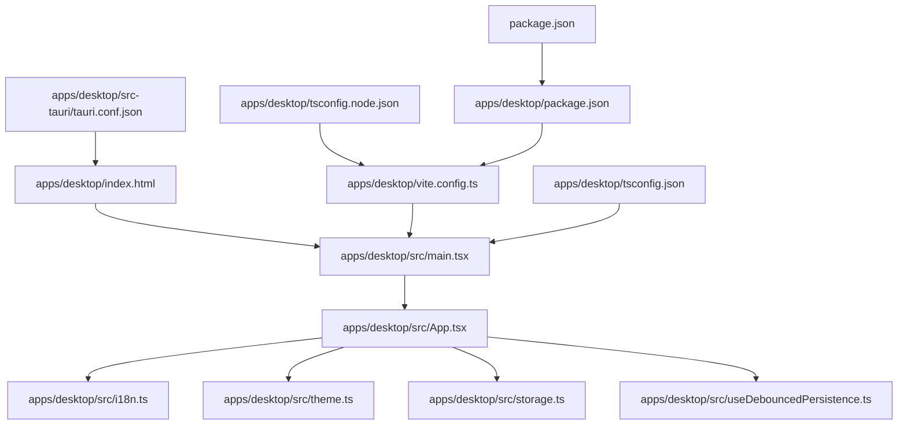
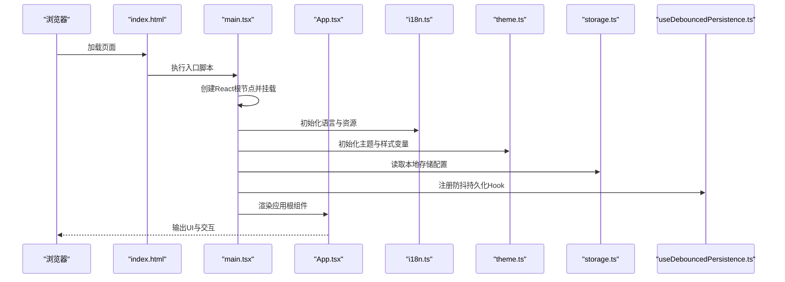
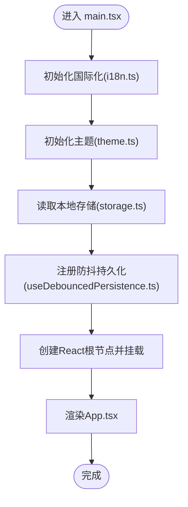
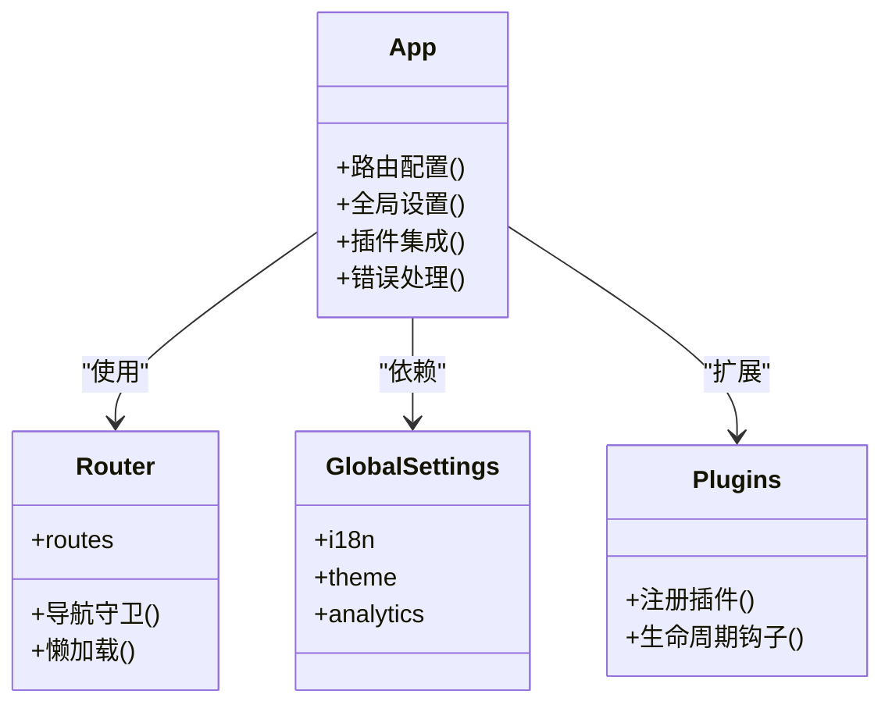
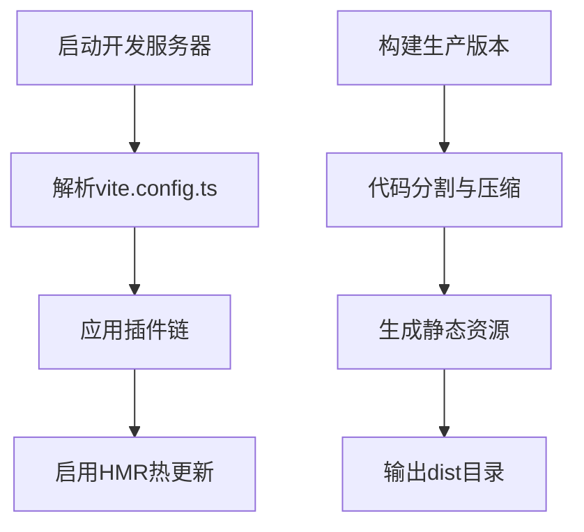
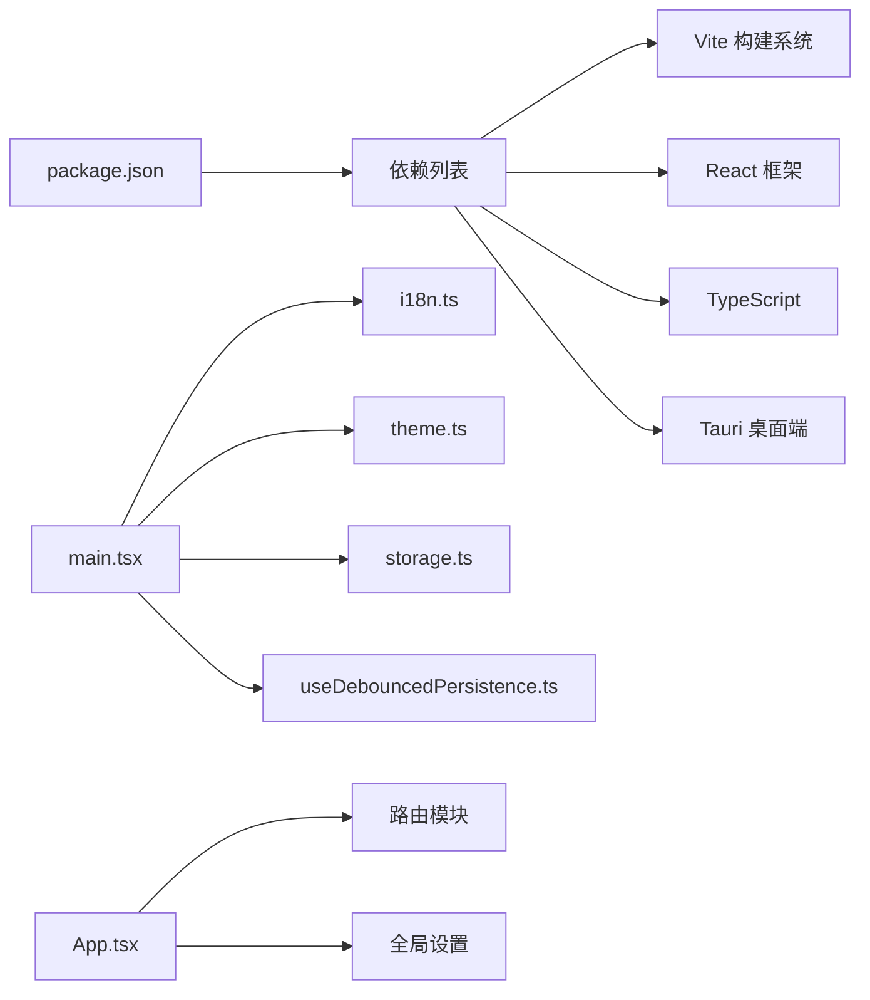

# 应用入口与配置

<cite>
**本文引用的文件**   
- [apps/desktop/src/main.tsx](file://apps/desktop/src/main.tsx)
- [apps/desktop/src/App.tsx](file://apps/desktop/src/App.tsx)
- [apps/desktop/vite.config.ts](file://apps/desktop/vite.config.ts)
- [apps/desktop/tsconfig.json](file://apps/desktop/tsconfig.json)
- [apps/desktop/tsconfig.node.json](file://apps/desktop/tsconfig.node.json)
- [apps/desktop/package.json](file://apps/desktop/package.json)
- [apps/desktop/index.html](file://apps/desktop/index.html)
- [apps/desktop/src/i18n.ts](file://apps/desktop/src/i18n.ts)
- [apps/desktop/src/theme.ts](file://apps/desktop/src/theme.ts)
- [apps/desktop/src/storage.ts](file://apps/desktop/src/storage.ts)
- [apps/desktop/src/useDebouncedPersistence.ts](file://apps/desktop/src/useDebouncedPersistence.ts)
- [apps/desktop/src-tauri/tauri.conf.json](file://apps/desktop/src-tauri/tauri.conf.json)
- [package.json](file://package.json)
</cite>

## 目录
1. [简介](#简介)
2. [项目结构](#项目结构)
3. [核心组件](#核心组件)
4. [架构总览](#架构总览)
5. [详细组件分析](#详细组件分析)
6. [依赖分析](#依赖分析)
7. [性能考虑](#性能考虑)
8. [故障排查指南](#故障排查指南)
9. [结论](#结论)
10. [附录](#附录)

## 简介
本文件聚焦于 React 应用的启动流程、路由与全局设置，覆盖以下关键主题：
- main.tsx 的初始化过程与应用挂载
- App.tsx 的应用结构与页面组织
- Vite 构建配置与开发服务器设置
- TypeScript 配置（tsconfig.json、tsconfig.node.json）
- 环境变量、插件集成与开发环境设置
- 配置选项说明与自定义扩展指南
- 常见问题解决方案与性能优化建议

## 项目结构
本项目采用多包/多应用结构。桌面端应用位于 apps/desktop，包含 React 前端代码、Vite 构建配置、Tauri 打包配置以及 TypeScript 配置。根目录 package.json 用于工作区脚本管理。

图表来源
- [apps/desktop/index.html:1-200](file://apps/desktop/index.html#L1-L200)
- [apps/desktop/src/main.tsx:1-200](file://apps/desktop/src/main.tsx#L1-L200)
- [apps/desktop/src/App.tsx:1-200](file://apps/desktop/src/App.tsx#L1-L200)
- [apps/desktop/vite.config.ts:1-200](file://apps/desktop/vite.config.ts#L1-L200)
- [apps/desktop/tsconfig.json:1-200](file://apps/desktop/tsconfig.json#L1-L200)
- [apps/desktop/tsconfig.node.json:1-200](file://apps/desktop/tsconfig.node.json#L1-L200)
- [apps/desktop/src-tauri/tauri.conf.json:1-200](file://apps/desktop/src-tauri/tauri.conf.json#L1-L200)
- [apps/desktop/package.json:1-200](file://apps/desktop/package.json#L1-L200)
- [package.json:1-200](file://package.json#L1-L200)

章节来源
- [apps/desktop/index.html:1-200](file://apps/desktop/index.html#L1-L200)
- [apps/desktop/package.json:1-200](file://apps/desktop/package.json#L1-L200)
- [package.json:1-200](file://package.json#L1-L200)

## 核心组件
- 应用入口 main.tsx：负责创建 React 根节点、挂载到 DOM、初始化国际化与主题等全局能力。
- 应用骨架 App.tsx：组织页面路由、布局、全局状态与插件集成点。
- 构建与类型：vite.config.ts 定义开发/生产构建、插件与代理；tsconfig.json 与 tsconfig.node.json 分别约束浏览器与 Node 侧类型。
- 运行时配置：i18n.ts 提供国际化；theme.ts 提供主题；storage.ts 与 useDebouncedPersistence.ts 提供数据持久化策略。
- Tauri 集成：src-tauri/tauri.conf.json 控制桌面端窗口、权限与资源路径。

章节来源
- [apps/desktop/src/main.tsx:1-200](file://apps/desktop/src/main.tsx#L1-L200)
- [apps/desktop/src/App.tsx:1-200](file://apps/desktop/src/App.tsx#L1-L200)
- [apps/desktop/vite.config.ts:1-200](file://apps/desktop/vite.config.ts#L1-L200)
- [apps/desktop/tsconfig.json:1-200](file://apps/desktop/tsconfig.json#L1-L200)
- [apps/desktop/tsconfig.node.json:1-200](file://apps/desktop/tsconfig.node.json#L1-L200)
- [apps/desktop/src/i18n.ts:1-200](file://apps/desktop/src/i18n.ts#L1-L200)
- [apps/desktop/src/theme.ts:1-200](file://apps/desktop/src/theme.ts#L1-L200)
- [apps/desktop/src/storage.ts:1-200](file://apps/desktop/src/storage.ts#L1-L200)
- [apps/desktop/src/useDebouncedPersistence.ts:1-200](file://apps/desktop/src/useDebouncedPersistence.ts#L1-L200)
- [apps/desktop/src-tauri/tauri.conf.json:1-200](file://apps/desktop/src-tauri/tauri.conf.json#L1-L200)

## 架构总览
下图展示了从 HTML 入口到 React 应用、再到各模块的调用关系与数据流向。

图表来源
- [apps/desktop/index.html:1-200](file://apps/desktop/index.html#L1-L200)
- [apps/desktop/src/main.tsx:1-200](file://apps/desktop/src/main.tsx#L1-L200)
- [apps/desktop/src/App.tsx:1-200](file://apps/desktop/src/App.tsx#L1-L200)
- [apps/desktop/src/i18n.ts:1-200](file://apps/desktop/src/i18n.ts#L1-L200)
- [apps/desktop/src/theme.ts:1-200](file://apps/desktop/src/theme.ts#L1-L200)
- [apps/desktop/src/storage.ts:1-200](file://apps/desktop/src/storage.ts#L1-L200)
- [apps/desktop/src/useDebouncedPersistence.ts:1-200](file://apps/desktop/src/useDebouncedPersistence.ts#L1-L200)

## 详细组件分析

### main.tsx 初始化流程
- 作用：创建 React 根容器、挂载到 DOM、初始化 i18n、主题与存储，最后渲染 App 根组件。
- 关键点：
  - 在挂载前完成语言与主题的初始化，确保首屏样式与文案正确。
  - 通过 storage 与持久化 Hook 建立数据层基础能力。
  - 将 App 作为根组件渲染，后续路由与页面均由其组织。

图表来源
- [apps/desktop/src/main.tsx:1-200](file://apps/desktop/src/main.tsx#L1-L200)
- [apps/desktop/src/i18n.ts:1-200](file://apps/desktop/src/i18n.ts#L1-L200)
- [apps/desktop/src/theme.ts:1-200](file://apps/desktop/src/theme.ts#L1-L200)
- [apps/desktop/src/storage.ts:1-200](file://apps/desktop/src/storage.ts#L1-L200)
- [apps/desktop/src/useDebouncedPersistence.ts:1-200](file://apps/desktop/src/useDebouncedPersistence.ts#L1-L200)

章节来源
- [apps/desktop/src/main.tsx:1-200](file://apps/desktop/src/main.tsx#L1-L200)

### App.tsx 应用结构
- 作用：组织路由、布局、全局状态与插件集成点，是页面导航与功能模块的聚合中心。
- 关键点：
  - 路由配置：集中管理页面路径与组件映射，支持嵌套与懒加载。
  - 全局设置：集成 i18n、主题、错误边界与日志埋点。
  - 插件扩展：预留插件注入点，便于按需启用功能。

图表来源
- [apps/desktop/src/App.tsx:1-200](file://apps/desktop/src/App.tsx#L1-L200)

章节来源
- [apps/desktop/src/App.tsx:1-200](file://apps/desktop/src/App.tsx#L1-L200)

### Vite 构建配置
- 作用：定义开发服务器、构建产物、插件链与环境变量注入。
- 关键点：
  - 开发服务器：端口、代理、热更新与调试选项。
  - 构建优化：代码分割、压缩、资源内联与缓存策略。
  - 插件集成：TypeScript、CSS、图片、SVG、路径别名等。
  - 环境变量：以 VITE_ 前缀暴露给客户端，区分开发与生产。

图表来源
- [apps/desktop/vite.config.ts:1-200](file://apps/desktop/vite.config.ts#L1-L200)

章节来源
- [apps/desktop/vite.config.ts:1-200](file://apps/desktop/vite.config.ts#L1-L200)

### TypeScript 配置
- tsconfig.json：约束浏览器端 TS 编译选项、模块解析与 JSX 处理。
- tsconfig.node.json：约束 Node 侧（如 Vite 插件、脚本）的 TS 编译选项。
- 关键点：
  - 严格模式与类型检查开关。
  - 路径别名与模块解析策略。
  - 与 Vite 的集成方式（如 .d.ts 声明）。

章节来源
- [apps/desktop/tsconfig.json:1-200](file://apps/desktop/tsconfig.json#L1-L200)
- [apps/desktop/tsconfig.node.json:1-200](file://apps/desktop/tsconfig.node.json#L1-L200)

### 环境变量与插件集成
- 环境变量：
  - 客户端可见变量需以 VITE_ 为前缀，通过 import.meta.env 访问。
  - 区分开发/测试/生产环境，避免敏感信息泄露。
- 插件集成：
  - 在 vite.config.ts 中按顺序注册插件，注意依赖顺序与副作用。
  - 常用插件：@vitejs/plugin-react、路径别名、CSS 预处理器、图片优化等。

章节来源
- [apps/desktop/vite.config.ts:1-200](file://apps/desktop/vite.config.ts#L1-L200)
- [apps/desktop/package.json:1-200](file://apps/desktop/package.json#L1-L200)

### Tauri 桌面端配置
- tauri.conf.json：定义窗口大小、图标、权限、后端命令与资源路径。
- 关键点：
  - 前端资源路径指向 Vite 构建产物。
  - 安全策略与白名单配置。
  - 平台特定设置（macOS/Windows/Linux）。

章节来源
- [apps/desktop/src-tauri/tauri.conf.json:1-200](file://apps/desktop/src-tauri/tauri.conf.json#L1-L200)

## 依赖分析
- 外部依赖：由 package.json 管理，包括 React、Vite、TypeScript、Tauri 相关包。
- 内部依赖：main.tsx 依赖 i18n、theme、storage、useDebouncedPersistence；App.tsx 依赖路由与全局设置。
- 构建依赖：Vite 插件链与 Node 工具链。

图表来源
- [package.json:1-200](file://package.json#L1-L200)
- [apps/desktop/package.json:1-200](file://apps/desktop/package.json#L1-L200)
- [apps/desktop/src/main.tsx:1-200](file://apps/desktop/src/main.tsx#L1-L200)
- [apps/desktop/src/App.tsx:1-200](file://apps/desktop/src/App.tsx#L1-L200)

章节来源
- [package.json:1-200](file://package.json#L1-L200)
- [apps/desktop/package.json:1-200](file://apps/desktop/package.json#L1-L200)

## 性能考虑
- 代码分割与懒加载：在 App.tsx 中对页面组件进行动态导入，减少首屏体积。
- 资源优化：在 vite.config.ts 中启用图片压缩、字体子集化与缓存策略。
- 构建优化：合理配置分包策略，避免单包过大；开启 Tree Shaking 与 Dead Code Elimination。
- 运行时优化：使用防抖持久化 Hook 降低频繁写入开销；避免不必要的重渲染。
- 内存与网络：监控长列表渲染与大数据传输，必要时引入虚拟滚动与分页。

[本节为通用指导，不直接分析具体文件]

## 故障排查指南
- 启动失败：
  - 检查 vite.config.ts 中的端口占用与代理配置。
  - 确认 Node 版本与依赖安装是否完整。
- 环境变量未生效：
  - 确认变量名以 VITE_ 开头，并在客户端通过 import.meta.env 访问。
  - 重启开发服务器使环境变量生效。
- 类型错误：
  - 检查 tsconfig.json 与 tsconfig.node.json 的模块解析与 JSX 设置。
  - 清理 node_modules 后重新安装依赖。
- Tauri 打包问题：
  - 检查 tauri.conf.json 中的资源路径与权限配置。
  - 确认前端构建产物路径正确。

章节来源
- [apps/desktop/vite.config.ts:1-200](file://apps/desktop/vite.config.ts#L1-L200)
- [apps/desktop/tsconfig.json:1-200](file://apps/desktop/tsconfig.json#L1-L200)
- [apps/desktop/tsconfig.node.json:1-200](file://apps/desktop/tsconfig.node.json#L1-L200)
- [apps/desktop/src-tauri/tauri.conf.json:1-200](file://apps/desktop/src-tauri/tauri.conf.json#L1-L200)

## 结论
本文系统梳理了 React 应用的入口与配置，涵盖 main.tsx 初始化、App.tsx 结构、Vite 构建与 TypeScript 配置，以及环境变量、插件集成与 Tauri 桌面端设置。通过合理的架构设计与优化策略，可提升开发体验与运行性能。建议在团队中统一配置规范，并持续监控构建产物与运行时指标。

[本节为总结性内容，不直接分析具体文件]

## 附录
- 自定义扩展指南：
  - 新增插件：在 vite.config.ts 中注册插件，并确保依赖顺序正确。
  - 新增环境变量：在 .env.* 文件中定义，并通过 import.meta.env 访问。
  - 新增页面：在 App.tsx 的路由表中添加映射，并使用懒加载优化首屏。
- 常见配置选项说明：
  - Vite：server.port、build.outDir、plugins 数组等。
  - TypeScript：compilerOptions.strict、moduleResolution、jsx 等。
  - Tauri：windows 配置、security.csp、bundle.resources 等。

[本节为补充说明，不直接分析具体文件]