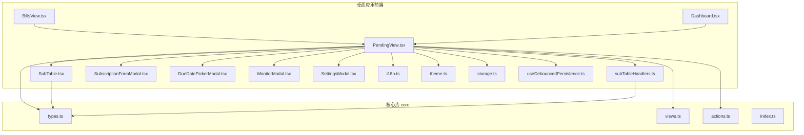
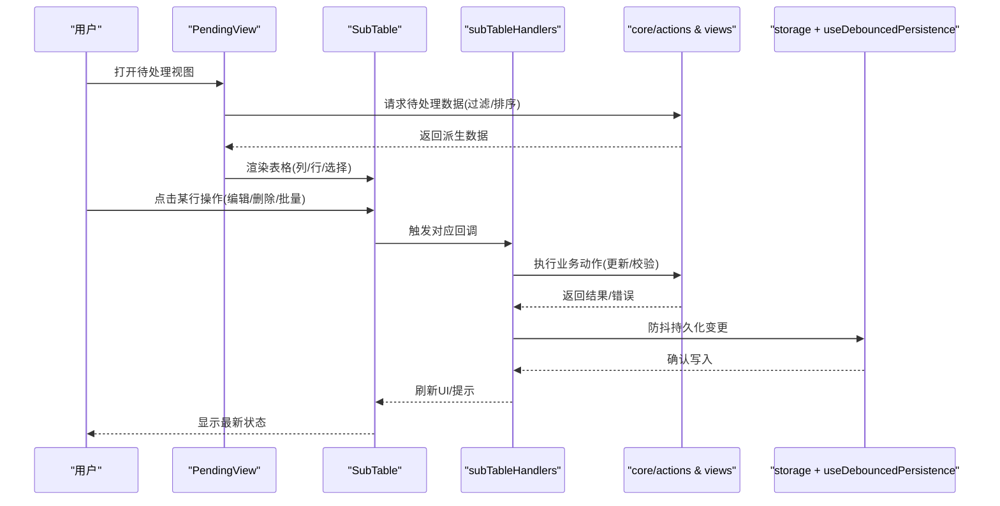
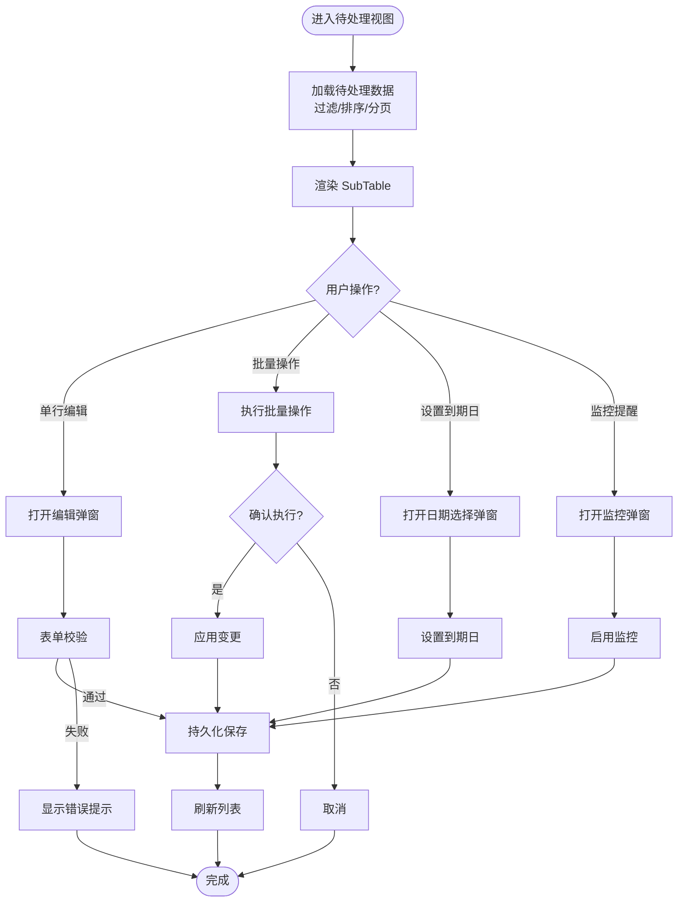
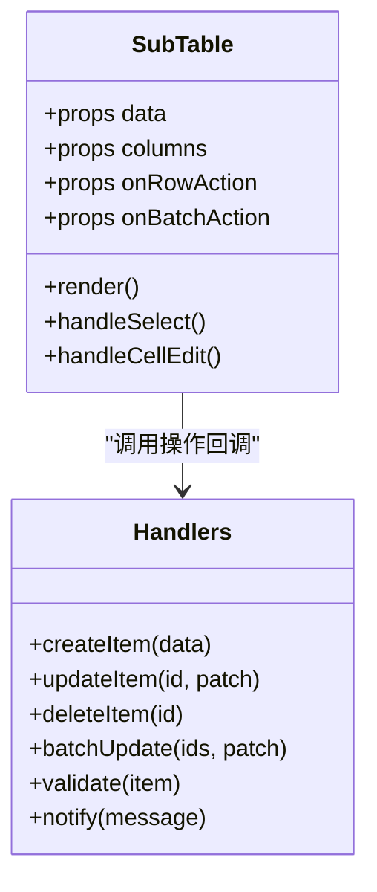
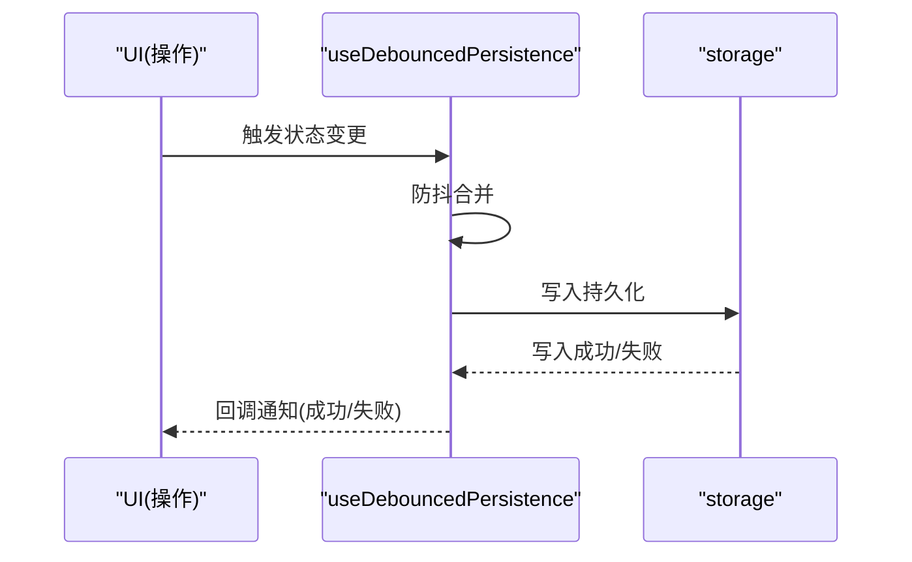
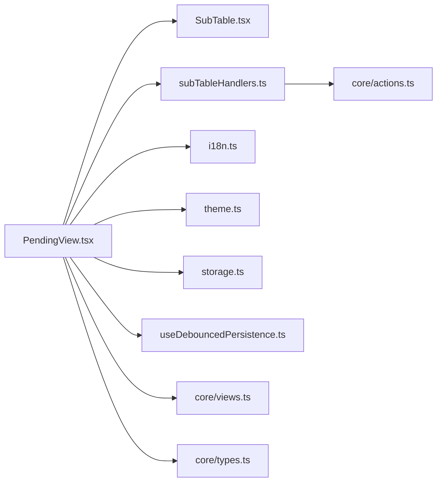

# 待处理视图

<cite>
**本文档引用的文件**   
- [PendingView.tsx](file://apps/desktop/src/PendingView.tsx)
- [PendingView.test.tsx](file://apps/desktop/src/PendingView.test.tsx)
- [SubTable.tsx](file://apps/desktop/src/SubTable.tsx)
- [subTableHandlers.ts](file://apps/desktop/src/subTableHandlers.ts)
- [storage.ts](file://apps/desktop/src/storage.ts)
- [useDebouncedPersistence.ts](file://apps/desktop/src/useDebouncedPersistence.ts)
- [i18n.ts](file://apps/desktop/src/i18n.ts)
- [theme.ts](file://apps/desktop/src/theme.ts)
- [Dashboard.tsx](file://apps/desktop/src/Dashboard.tsx)
- [BillsView.tsx](file://apps/desktop/src/BillsView.tsx)
- [SubscriptionFormModal.tsx](file://apps/desktop/src/SubscriptionFormModal.tsx)
- [DueDatePickerModal.tsx](file://apps/desktop/src/DueDatePickerModal.tsx)
- [MonitorModal.tsx](file://apps/desktop/src/MonitorModal.tsx)
- [settings-modal](file://apps/desktop/src/SettingsModal.tsx)
- [core/index.ts](file://packages/core/src/index.ts)
- [core/types.ts](file://packages/core/src/types.ts)
- [core/views.ts](file://packages/core/src/views.ts)
- [core/actions.ts](file://packages/core/src/actions.ts)
</cite>

## 目录
1. [简介](#简介)
2. [项目结构](#项目结构)
3. [核心组件](#核心组件)
4. [架构总览](#架构总览)
5. [详细组件分析](#详细组件分析)
6. [依赖关系分析](#依赖关系分析)
7. [性能考量](#性能考量)
8. [故障排查指南](#故障排查指南)
9. [结论](#结论)
10. [附录](#附录)

## 简介
本文件面向“待处理视图”（PendingView）的实现与使用，聚焦以下目标：
- 解释 PendingView 组件如何展示、筛选和编辑“待处理订阅项”。
- 说明数据获取、实时更新与状态同步机制。
- 梳理用户交互流程、操作反馈与错误处理策略。
- 给出组件配置选项、样式定制与扩展方法。
- 提供性能优化建议与最佳实践。

该视图通常用于订阅管理桌面应用中，帮助用户快速查看即将到期或需要处理的订阅条目，并进行批量或单项操作（如标记完成、调整到期日、监控提醒等）。

## 项目结构
PendingView 位于桌面应用前端模块中，与子表 SubTable、表单弹窗、持久化存储以及国际化主题等模块协作，共同实现完整的待处理视图体验。

图表来源
- [PendingView.tsx](file://apps/desktop/src/PendingView.tsx)
- [SubTable.tsx](file://apps/desktop/src/SubTable.tsx)
- [subTableHandlers.ts](file://apps/desktop/src/subTableHandlers.ts)
- [storage.ts](file://apps/desktop/src/storage.ts)
- [useDebouncedPersistence.ts](file://apps/desktop/src/useDebouncedPersistence.ts)
- [i18n.ts](file://apps/desktop/src/i18n.ts)
- [theme.ts](file://apps/desktop/src/theme.ts)
- [Dashboard.tsx](file://apps/desktop/src/Dashboard.tsx)
- [BillsView.tsx](file://apps/desktop/src/BillsView.tsx)
- [SubscriptionFormModal.tsx](file://apps/desktop/src/SubscriptionFormModal.tsx)
- [DueDatePickerModal.tsx](file://apps/desktop/src/DueDatePickerModal.tsx)
- [MonitorModal.tsx](file://apps/desktop/src/MonitorModal.tsx)
- [SettingsModal.tsx](file://apps/desktop/src/SettingsModal.tsx)
- [core/types.ts](file://packages/core/src/types.ts)
- [core/views.ts](file://packages/core/src/views.ts)
- [core/actions.ts](file://packages/core/src/actions.ts)

章节来源
- [PendingView.tsx](file://apps/desktop/src/PendingView.tsx)
- [SubTable.tsx](file://apps/desktop/src/SubTable.tsx)
- [subTableHandlers.ts](file://apps/desktop/src/subTableHandlers.ts)
- [storage.ts](file://apps/desktop/src/storage.ts)
- [useDebouncedPersistence.ts](file://apps/desktop/src/useDebouncedPersistence.ts)
- [i18n.ts](file://apps/desktop/src/i18n.ts)
- [theme.ts](file://apps/desktop/src/theme.ts)
- [Dashboard.tsx](file://apps/desktop/src/Dashboard.tsx)
- [BillsView.tsx](file://apps/desktop/src/BillsView.tsx)
- [SubscriptionFormModal.tsx](file://apps/desktop/src/SubscriptionFormModal.tsx)
- [DueDatePickerModal.tsx](file://apps/desktop/src/DueDatePickerModal.tsx)
- [MonitorModal.tsx](file://apps/desktop/src/MonitorModal.tsx)
- [SettingsModal.tsx](file://apps/desktop/src/SettingsModal.tsx)
- [core/types.ts](file://packages/core/src/types.ts)
- [core/views.ts](file://packages/core/src/views.ts)
- [core/actions.ts](file://packages/core/src/actions.ts)

## 核心组件
- PendingView：负责渲染“待处理”订阅列表，提供筛选、排序、分页、批量操作入口，以及与子表、弹窗的交互。
- SubTable：通用表格组件，承载行渲染、列定义、单元格编辑、选择与批量操作。
- subTableHandlers：封装对 SubTable 的操作回调（增删改查、批量更新、校验与提示）。
- storage + useDebouncedPersistence：本地持久化与防抖写入，保障数据一致性并减少 I/O 压力。
- i18n + theme：国际化文案与主题样式注入，支持多语言与暗色模式。
- 弹窗组件：SubscriptionFormModal（新增/编辑）、DueDatePickerModal（设置到期日）、MonitorModal（监控提醒）、SettingsModal（全局设置）。

章节来源
- [PendingView.tsx](file://apps/desktop/src/PendingView.tsx)
- [SubTable.tsx](file://apps/desktop/src/SubTable.tsx)
- [subTableHandlers.ts](file://apps/desktop/src/subTableHandlers.ts)
- [storage.ts](file://apps/desktop/src/storage.ts)
- [useDebouncedPersistence.ts](file://apps/desktop/src/useDebouncedPersistence.ts)
- [i18n.ts](file://apps/desktop/src/i18n.ts)
- [theme.ts](file://apps/desktop/src/theme.ts)
- [SubscriptionFormModal.tsx](file://apps/desktop/src/SubscriptionFormModal.tsx)
- [DueDatePickerModal.tsx](file://apps/desktop/src/DueDatePickerModal.tsx)
- [MonitorModal.tsx](file://apps/desktop/src/MonitorModal.tsx)
- [SettingsModal.tsx](file://apps/desktop/src/SettingsModal.tsx)

## 架构总览
PendingView 采用“视图层 + 行为层 + 数据层”的分层设计：
- 视图层：PendingView 与 SubTable 组合，负责 UI 渲染与用户交互事件派发。
- 行为层：subTableHandlers 集中处理业务逻辑（校验、转换、副作用），并通过 actions 调用核心库能力。
- 数据层：storage 与 useDebouncedPersistence 负责本地读写与防抖持久化；core/views 提供视图计算与派生数据。

图表来源
- [PendingView.tsx](file://apps/desktop/src/PendingView.tsx)
- [SubTable.tsx](file://apps/desktop/src/SubTable.tsx)
- [subTableHandlers.ts](file://apps/desktop/src/subTableHandlers.ts)
- [core/actions.ts](file://packages/core/src/actions.ts)
- [core/views.ts](file://packages/core/src/views.ts)
- [storage.ts](file://apps/desktop/src/storage.ts)
- [useDebouncedPersistence.ts](file://apps/desktop/src/useDebouncedPersistence.ts)

## 详细组件分析

### PendingView 组件
- 功能职责
  - 聚合待处理订阅数据，提供筛选条件（如到期时间范围、类别、金额区间）。
  - 集成 SubTable 进行列表展示，支持多选、排序、分页。
  - 通过弹窗组件完成新增、编辑、设置到期日、监控提醒等操作。
  - 与国际化与主题系统对接，保证文案与样式一致。
- 数据获取与更新
  - 从 core/views 获取派生的“待处理”数据集，结合本地缓存与实时状态。
  - 监听外部状态变化（如订阅项更新、筛选条件变更），触发重新计算与渲染。
- 用户交互流程
  - 行内操作：编辑、删除、标记完成、设置到期日、开启监控。
  - 批量操作：批量删除、批量设置到期日、批量标记完成。
  - 弹窗交互：表单提交后回写数据，失败时展示错误提示。
- 错误处理
  - 网络/存储异常捕获，降级为只读或提示重试。
  - 表单校验失败时高亮字段并阻止提交。
  - 操作失败时提供撤销或重试入口。

图表来源
- [PendingView.tsx](file://apps/desktop/src/PendingView.tsx)
- [SubTable.tsx](file://apps/desktop/src/SubTable.tsx)
- [subscriptionFields.ts](file://apps/desktop/src/subscriptionFields.ts)
- [subscriptionFields.test.ts](file://apps/desktop/src/subscriptionFields.test.ts)
- [storage.ts](file://apps/desktop/src/storage.ts)
- [useDebouncedPersistence.ts](file://apps/desktop/src/useDebouncedPersistence.ts)

章节来源
- [PendingView.tsx](file://apps/desktop/src/PendingView.tsx)
- [PendingView.test.tsx](file://apps/desktop/src/PendingView.test.tsx)

### SubTable 与操作处理器
- SubTable
  - 通用表格组件，支持列定义、行渲染、单元格编辑、选择与批量操作。
  - 与 PendingView 协作，接收数据源与回调函数，渲染交互界面。
- subTableHandlers
  - 封装对订阅项的增删改查、批量更新、校验与提示。
  - 与 core/actions 对接，确保业务规则一致性与可测试性。

图表来源
- [SubTable.tsx](file://apps/desktop/src/SubTable.tsx)
- [subTableHandlers.ts](file://apps/desktop/src/subTableHandlers.ts)

章节来源
- [SubTable.tsx](file://apps/desktop/src/SubTable.tsx)
- [subTableHandlers.ts](file://apps/desktop/src/subTableHandlers.ts)

### 数据持久化与实时更新
- storage
  - 提供本地存储接口（读取/写入/清空），封装底层存储细节。
- useDebouncedPersistence
  - 对频繁的状态变更进行防抖，合并写入，降低 I/O 频率。
  - 在组件卸载或空闲时触发最终落盘，保证数据一致性。

图表来源
- [storage.ts](file://apps/desktop/src/storage.ts)
- [useDebouncedPersistence.ts](file://apps/desktop/src/useDebouncedPersistence.ts)

章节来源
- [storage.ts](file://apps/desktop/src/storage.ts)
- [useDebouncedPersistence.ts](file://apps/desktop/src/useDebouncedPersistence.ts)

### 国际化与主题
- i18n
  - 提供多语言文案切换与格式化，确保界面文案一致性。
- theme
  - 提供主题变量与样式覆盖，支持明暗模式与品牌定制。

章节来源
- [i18n.ts](file://apps/desktop/src/i18n.ts)
- [theme.ts](file://apps/desktop/src/theme.ts)

### 弹窗组件与交互
- SubscriptionFormModal：新增/编辑订阅项，包含字段校验与提交反馈。
- DueDatePickerModal：选择到期日期，支持快捷选项与自定义日期。
- MonitorModal：设置监控提醒，包括阈值、周期与通知方式。
- SettingsModal：全局设置项，影响待处理视图的行为与展示。

章节来源
- [SubscriptionFormModal.tsx](file://apps/desktop/src/SubscriptionFormModal.tsx)
- [DueDatePickerModal.tsx](file://apps/desktop/src/DueDatePickerModal.tsx)
- [MonitorModal.tsx](file://apps/desktop/src/MonitorModal.tsx)
- [SettingsModal.tsx](file://apps/desktop/src/SettingsModal.tsx)

## 依赖关系分析
PendingView 依赖多个模块，形成清晰的耦合关系：
- 视图层依赖 SubTable 与弹窗组件。
- 行为层依赖 subTableHandlers 与 core/actions。
- 数据层依赖 storage 与 useDebouncedPersistence。
- 展示层依赖 i18n 与 theme。

图表来源
- [PendingView.tsx](file://apps/desktop/src/PendingView.tsx)
- [SubTable.tsx](file://apps/desktop/src/SubTable.tsx)
- [subTableHandlers.ts](file://apps/desktop/src/subTableHandlers.ts)
- [storage.ts](file://apps/desktop/src/storage.ts)
- [useDebouncedPersistence.ts](file://apps/desktop/src/useDebouncedPersistence.ts)
- [i18n.ts](file://apps/desktop/src/i18n.ts)
- [theme.ts](file://apps/desktop/src/theme.ts)
- [core/actions.ts](file://packages/core/src/actions.ts)
- [core/views.ts](file://packages/core/src/views.ts)
- [core/types.ts](file://packages/core/src/types.ts)

章节来源
- [PendingView.tsx](file://apps/desktop/src/PendingView.tsx)
- [SubTable.tsx](file://apps/desktop/src/SubTable.tsx)
- [subTableHandlers.ts](file://apps/desktop/src/subTableHandlers.ts)
- [storage.ts](file://apps/desktop/src/storage.ts)
- [useDebouncedPersistence.ts](file://apps/desktop/src/useDebouncedPersistence.ts)
- [i18n.ts](file://apps/desktop/src/i18n.ts)
- [theme.ts](file://apps/desktop/src/theme.ts)
- [core/actions.ts](file://packages/core/src/actions.ts)
- [core/views.ts](file://packages/core/src/views.ts)
- [core/types.ts](file://packages/core/src/types.ts)

## 性能考量
- 数据计算与渲染
  - 使用 core/views 的派生数据，避免重复计算；对大数据集启用虚拟滚动或分页。
  - 对筛选与排序结果进行缓存，仅在输入变化时重算。
- 持久化写入
  - 通过 useDebouncedPersistence 合并高频写入，减少磁盘 I/O。
  - 在组件卸载或空闲时触发最终落盘，避免阻塞主线程。
- 交互响应
  - 对长耗时操作（如批量更新）采用异步队列与进度反馈。
  - 对表单校验进行即时反馈，减少无效提交。
- 内存与资源
  - 及时清理定时器与事件监听器，防止内存泄漏。
  - 按需加载弹窗与模块，降低初始包体积。

[本节为通用指导，不直接分析具体文件]

## 故障排查指南
- 常见问题
  - 数据未更新：检查 core/views 的派生逻辑与缓存失效时机。
  - 持久化失败：验证 storage 接口权限与磁盘空间，查看防抖队列是否被中断。
  - 表单校验失败：核对 subscriptionFields 的校验规则与错误提示映射。
  - 弹窗无法关闭：检查事件冒泡与模态遮罩层级。
- 调试建议
  - 在 subTableHandlers 中添加日志输出，追踪操作链路。
  - 使用单元测试覆盖关键路径（PendingView.test、SubTable.test、subscriptionFields.test）。
  - 利用浏览器/桌面端开发者工具观察状态树与网络/存储调用。

章节来源
- [PendingView.test.tsx](file://apps/desktop/src/PendingView.test.tsx)
- [SubTable.test.tsx](file://apps/desktop/src/SubTable.test.tsx)
- [subscriptionFields.test.ts](file://apps/desktop/src/subscriptionFields.test.ts)
- [useDebouncedPersistence.test.ts](file://apps/desktop/src/useDebouncedPersistence.test.ts)
- [useRenewReminders.test.ts](file://apps/desktop/src/useRenewReminders.test.ts)

## 结论
PendingView 作为待处理订阅的核心视图，通过清晰的层次结构与模块化设计，实现了高效的数据展示、灵活的交互与可靠的持久化。借助 core 库的派生数据与统一动作，保证了业务一致性与可维护性。遵循本文的性能优化与最佳实践，可进一步提升用户体验与系统稳定性。

[本节为总结性内容，不直接分析具体文件]

## 附录
- 组件配置选项
  - 数据源：来自 core/views 的派生数据，支持筛选、排序、分页参数。
  - 列定义：基于 SubTable 的列配置，支持自定义渲染与编辑。
  - 行为回调：通过 subTableHandlers 提供的增删改查与批量操作。
  - 国际化：通过 i18n 的键值映射，支持动态切换语言。
  - 主题：通过 theme 的变量覆盖，支持明暗模式与品牌定制。
- 扩展方法
  - 新增列与操作：在 SubTable 列定义中扩展渲染与回调。
  - 自定义校验：在 subscriptionFields 中增加规则与提示。
  - 监控提醒：在 MonitorModal 中扩展阈值与通知渠道。
  - 持久化策略：在 useDebouncedPersistence 中调整防抖时间与写入策略。

[本节为补充信息，不直接分析具体文件]