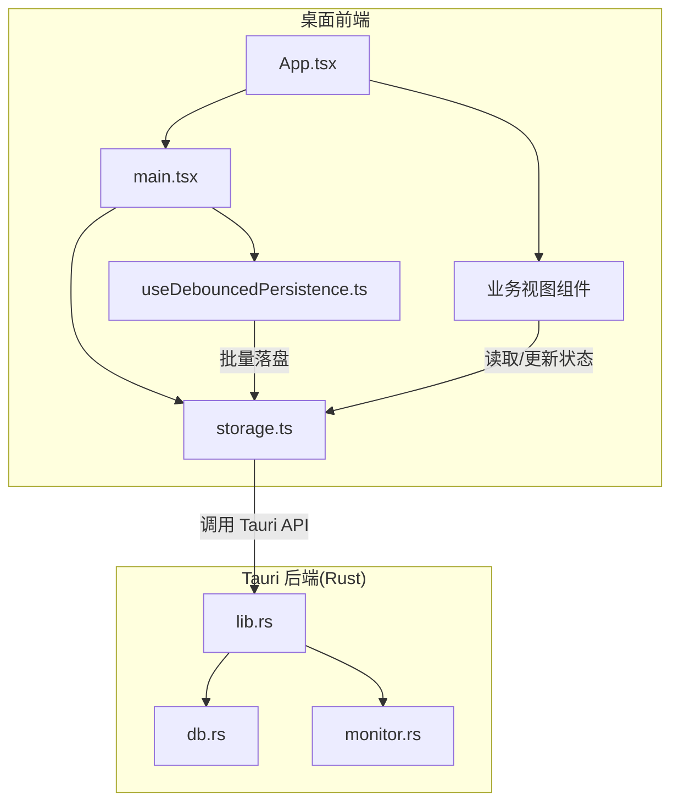
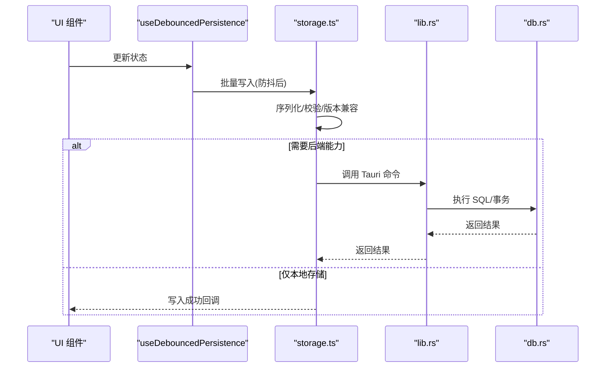
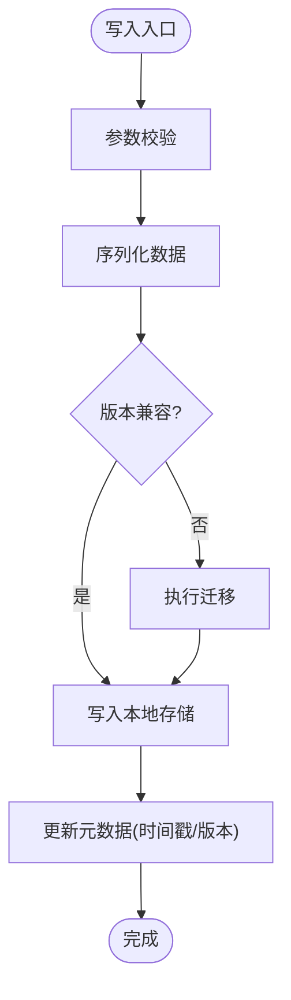
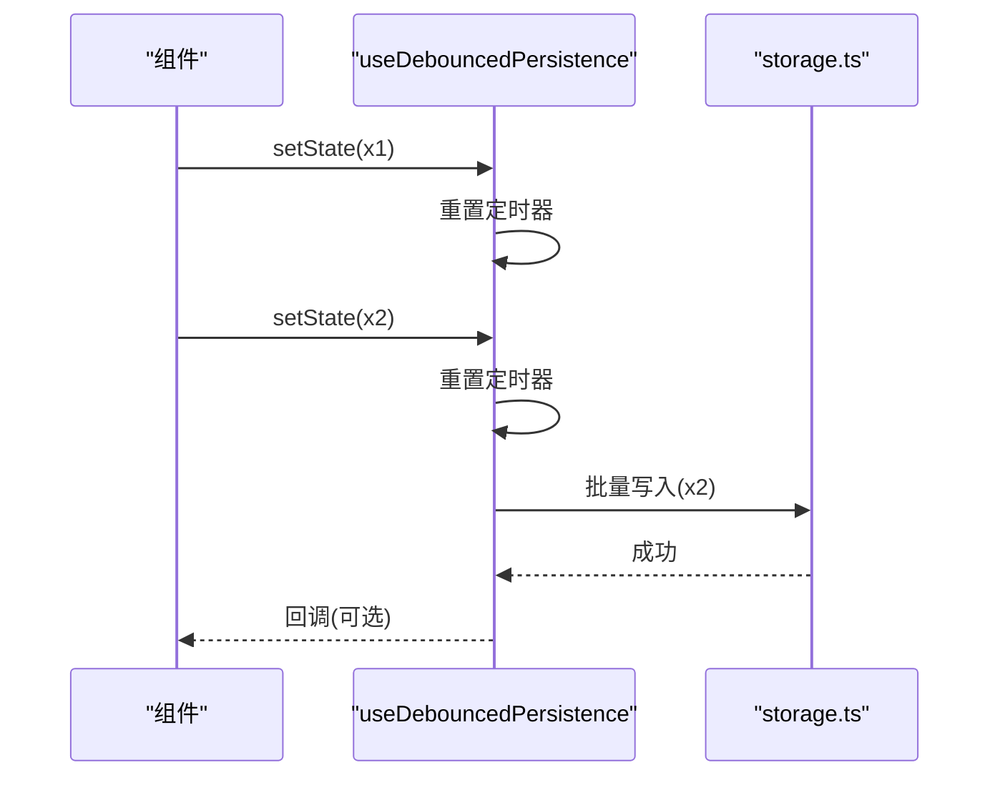
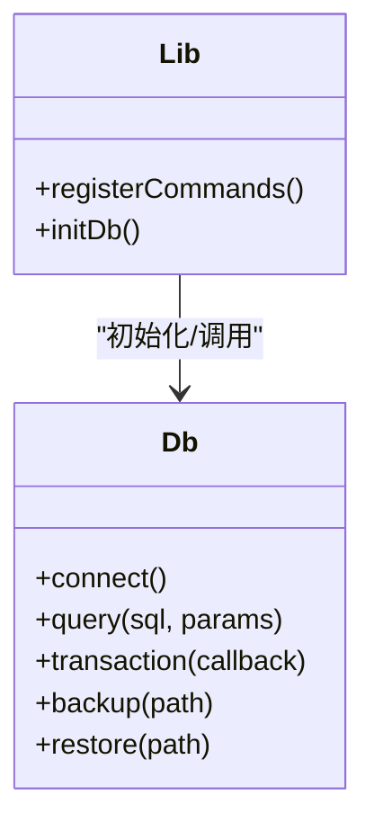
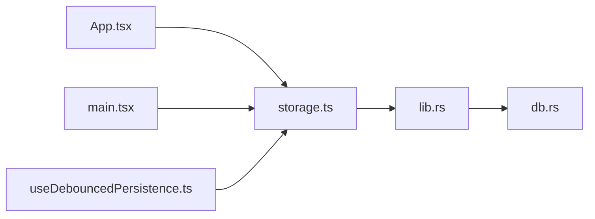

# 数据存储

<cite>
**本文引用的文件**   
- [storage.ts](file://apps/desktop/src/storage.ts)
- [storage.test.ts](file://apps/desktop/src/storage.test.ts)
- [useDebouncedPersistence.ts](file://apps/desktop/src/useDebouncedPersistence.ts)
- [useDebouncedPersistence.test.ts](file://apps/desktop/src/useDebouncedPersistence.test.ts)
- [main.tsx](file://apps/desktop/src/main.tsx)
- [App.tsx](file://apps/desktop/src/App.tsx)
- [db.rs](file://apps/desktop/src-tauri/src/db.rs)
- [lib.rs](file://apps/desktop/src-tauri/src/lib.rs)
- [monitor.rs](file://apps/desktop/src-tauri/src/monitor.rs)
- [Cargo.toml](file://apps/desktop/src-tauri/Cargo.toml)
</cite>

## 目录
1. [简介](#简介)
2. [项目结构](#项目结构)
3. [核心组件](#核心组件)
4. [架构总览](#架构总览)
5. [详细组件分析](#详细组件分析)
6. [依赖关系分析](#依赖关系分析)
7. [性能考虑](#性能考虑)
8. [故障排查指南](#故障排查指南)
9. [结论](#结论)
10. [附录](#附录)

## 简介
本文件聚焦于“订阅管理”应用的数据存储模块，系统性说明其数据持久化策略、存储格式与读写操作。文档覆盖本地存储实现、数据同步机制、版本兼容性、备份恢复、迁移策略、错误处理、容量管理与性能优化，并提供数据操作API和使用示例，帮助开发者快速理解并正确使用存储子系统。

## 项目结构
存储相关代码主要分布在桌面端前端（TypeScript）与 Tauri 后端（Rust）：
- 前端存储层：提供统一的本地存储接口、防抖持久化 Hook 以及测试用例。
- 后端数据库层：通过 Tauri 暴露 Rust 侧的数据库访问能力，用于更复杂的查询或跨进程数据一致性场景。
- 应用入口与页面：在应用初始化时加载数据，并在用户交互中触发写入与同步。

图表来源
- [main.tsx:1-200](file://apps/desktop/src/main.tsx#L1-L200)
- [App.tsx:1-200](file://apps/desktop/src/App.tsx#L1-L200)
- [storage.ts:1-200](file://apps/desktop/src/storage.ts#L1-L200)
- [useDebouncedPersistence.ts:1-200](file://apps/desktop/src/useDebouncedPersistence.ts#L1-L200)
- [lib.rs:1-200](file://apps/desktop/src-tauri/src/lib.rs#L1-L200)
- [db.rs:1-200](file://apps/desktop/src-tauri/src/db.rs#L1-L200)

章节来源
- [main.tsx:1-200](file://apps/desktop/src/main.tsx#L1-L200)
- [App.tsx:1-200](file://apps/desktop/src/App.tsx#L1-L200)
- [storage.ts:1-200](file://apps/desktop/src/storage.ts#L1-L200)
- [useDebouncedPersistence.ts:1-200](file://apps/desktop/src/useDebouncedPersistence.ts#L1-L200)
- [lib.rs:1-200](file://apps/desktop/src-tauri/src/lib.rs#L1-L200)
- [db.rs:1-200](file://apps/desktop/src-tauri/src/db.rs#L1-L200)

## 核心组件
- storage.ts：封装本地存储的读写、序列化/反序列化、键空间管理、错误处理与兼容逻辑。
- useDebouncedPersistence.ts：基于防抖的持久化 Hook，将高频状态变更合并为批量落盘，降低 I/O 压力。
- db.rs / lib.rs：Tauri 后端数据库访问封装，提供 Rust 侧的数据持久化能力（如 SQLite），供前端通过命令调用。
- monitor.rs：监控与辅助任务（如定时清理、健康检查等），可配合存储进行容量管理与维护。

章节来源
- [storage.ts:1-200](file://apps/desktop/src/storage.ts#L1-L200)
- [useDebouncedPersistence.ts:1-200](file://apps/desktop/src/useDebouncedPersistence.ts#L1-L200)
- [db.rs:1-200](file://apps/desktop/src-tauri/src/db.rs#L1-L200)
- [lib.rs:1-200](file://apps/desktop/src-tauri/src/lib.rs#L1-L200)
- [monitor.rs:1-200](file://apps/desktop/src-tauri/src/monitor.rs#L1-L200)

## 架构总览
整体采用“前端轻量本地存储 + 后端数据库”的分层设计：
- 前端使用 JSON 格式的本地存储（如 localStorage 或等效机制），保证快速读写与易调试。
- 通过 useDebouncedPersistence 对写操作进行防抖与批处理，减少频繁 I/O。
- 复杂查询或需要强一致性的场景，通过 Tauri 调用 Rust 后端数据库（SQLite）。
- 版本兼容与迁移在前端存储层完成，确保旧数据结构平滑升级。

图表来源
- [useDebouncedPersistence.ts:1-200](file://apps/desktop/src/useDebouncedPersistence.ts#L1-L200)
- [storage.ts:1-200](file://apps/desktop/src/storage.ts#L1-L200)
- [lib.rs:1-200](file://apps/desktop/src-tauri/src/lib.rs#L1-L200)
- [db.rs:1-200](file://apps/desktop/src-tauri/src/db.rs#L1-L200)

## 详细组件分析

### storage.ts：本地存储抽象与实现
- 职责
  - 提供统一的 get/set/remove/clear 等基础操作。
  - 负责数据的序列化/反序列化（JSON），以及异常捕获与降级策略。
  - 维护键空间与命名约定，避免冲突。
  - 内置版本字段与迁移钩子，支持向后兼容。
  - 可选地对接 Tauri 后端以扩展能力。
- 关键流程
  - 写入：校验输入 -> 序列化 -> 写入本地存储 -> 记录元数据（如时间戳/版本）-> 返回结果。
  - 读取：读取原始值 -> 反序列化 -> 版本检查与迁移 -> 返回数据。
  - 错误处理：捕获解析失败、权限不足、磁盘满等异常，并返回安全默认值或错误码。
- 复杂度
  - 读写时间复杂度 O(n)（n 为对象大小），受限于 JSON 序列化成本。
  - 空间复杂度取决于存储介质与数据量。
- 优化点
  - 增量更新与差分保存（仅保存变更字段）。
  - 压缩与分片存储（大对象拆分）。
  - 读写缓存与懒加载。

图表来源
- [storage.ts:1-200](file://apps/desktop/src/storage.ts#L1-L200)

章节来源
- [storage.ts:1-200](file://apps/desktop/src/storage.ts#L1-L200)
- [storage.test.ts:1-200](file://apps/desktop/src/storage.test.ts#L1-200)

### useDebouncedPersistence.ts：防抖持久化 Hook
- 职责
  - 将多次状态更新合并为一次持久化，降低 I/O 频率。
  - 提供立即落盘与延迟落盘的切换能力。
  - 内部调用 storage.ts 完成实际写入。
- 关键流程
  - 监听状态变化 -> 启动/重置定时器 -> 到达阈值后批量写入 -> 错误回滚与重试。
- 适用场景
  - 表单输入、列表编辑、实时预览等高频更新场景。

图表来源
- [useDebouncedPersistence.ts:1-200](file://apps/desktop/src/useDebouncedPersistence.ts#L1-L200)
- [storage.ts:1-200](file://apps/desktop/src/storage.ts#L1-L200)

章节来源
- [useDebouncedPersistence.ts:1-200](file://apps/desktop/src/useDebouncedPersistence.ts#L1-L200)
- [useDebouncedPersistence.test.ts:1-200](file://apps/desktop/src/useDebouncedPersistence.test.ts#L1-200)

### db.rs / lib.rs：Tauri 后端数据库访问
- 职责
  - 暴露 Tauri 命令，供前端调用 Rust 侧数据库操作。
  - 封装 SQLite 连接、事务、查询与索引优化。
  - 提供数据导入/导出、备份与恢复接口。
- 典型能力
  - 增删改查、事务提交/回滚、批量插入。
  - 数据校验与约束检查。
  - 与前端存储层协同，保证一致性。

图表来源
- [lib.rs:1-200](file://apps/desktop/src-tauri/src/lib.rs#L1-L200)
- [db.rs:1-200](file://apps/desktop/src-tauri/src/db.rs#L1-L200)

章节来源
- [lib.rs:1-200](file://apps/desktop/src-tauri/src/lib.rs#L1-L200)
- [db.rs:1-200](file://apps/desktop/src-tauri/src/db.rs#L1-L200)
- [Cargo.toml:1-200](file://apps/desktop/src-tauri/Cargo.toml#L1-200)

### monitor.rs：存储监控与维护
- 职责
  - 定期检测存储健康状态（可用空间、损坏检测）。
  - 触发清理策略（过期数据、临时文件）。
  - 上报统计信息（读写次数、失败率）。
- 与存储协作
  - 当检测到空间不足时，提示用户或触发压缩/归档。
  - 与迁移流程联动，确保数据完整性。

章节来源
- [monitor.rs:1-200](file://apps/desktop/src-tauri/src/monitor.rs#L1-200)

## 依赖关系分析
- 前端依赖
  - storage.ts 被 useDebouncedPersistence.ts 及多个业务组件调用。
  - main.tsx 与 App.tsx 在启动时加载初始数据，并在生命周期内触发写入。
- 后端依赖
  - lib.rs 注册 Tauri 命令，db.rs 实现具体数据库逻辑。
  - Cargo.toml 声明 Rust 依赖（如 sqlite、serde 等）。

图表来源
- [App.tsx:1-200](file://apps/desktop/src/App.tsx#L1-200)
- [main.tsx:1-200](file://apps/desktop/src/main.tsx#L1-200)
- [storage.ts:1-200](file://apps/desktop/src/storage.ts#L1-200)
- [useDebouncedPersistence.ts:1-200](file://apps/desktop/src/useDebouncedPersistence.ts#L1-200)
- [lib.rs:1-200](file://apps/desktop/src-tauri/src/lib.rs#L1-200)
- [db.rs:1-200](file://apps/desktop/src-tauri/src/db.rs#L1-200)

章节来源
- [App.tsx:1-200](file://apps/desktop/src/App.tsx#L1-200)
- [main.tsx:1-200](file://apps/desktop/src/main.tsx#L1-200)
- [storage.ts:1-200](file://apps/desktop/src/storage.ts#L1-200)
- [useDebouncedPersistence.ts:1-200](file://apps/desktop/src/useDebouncedPersistence.ts#L1-200)
- [lib.rs:1-200](file://apps/desktop/src-tauri/src/lib.rs#L1-200)
- [db.rs:1-200](file://apps/desktop/src-tauri/src/db.rs#L1-200)

## 性能考虑
- 序列化开销：JSON 序列化在大对象上可能成为瓶颈，建议分块存储或二进制格式（如 MessagePack）。
- I/O 频率：通过 useDebouncedPersistence 合并写入，减少频繁落盘。
- 缓存策略：热点数据内存缓存，结合失效策略（LRU/TTL）。
- 索引与查询：后端 SQLite 建立合适索引，避免全表扫描。
- 压缩与归档：历史数据压缩存储，释放主存储空间。
- 异步与并发：读写分离，避免阻塞 UI 线程。

[本节为通用指导，不直接分析具体文件]

## 故障排查指南
- 常见错误
  - 解析失败：JSON 格式不正确或字段缺失，需检查迁移逻辑与输入校验。
  - 权限不足：浏览器或系统限制本地存储访问，需确认权限设置。
  - 磁盘满：写入失败，需清理空间或启用压缩。
  - 版本不一致：旧数据结构无法识别，需执行迁移脚本。
- 定位方法
  - 查看 storage.test.ts 与 useDebouncedPersistence.test.ts 的用例，复现问题。
  - 检查 Tauri 日志与后端错误输出。
  - 使用 monitor.rs 的健康检查报告定位存储状态。
- 恢复步骤
  - 从备份恢复数据，验证完整性。
  - 重新运行迁移，确保版本一致。
  - 清空缓存并重建索引（后端）。

章节来源
- [storage.test.ts:1-200](file://apps/desktop/src/storage.test.ts#L1-200)
- [useDebouncedPersistence.test.ts:1-200](file://apps/desktop/src/useDebouncedPersistence.test.ts#L1-200)
- [monitor.rs:1-200](file://apps/desktop/src-tauri/src/monitor.rs#L1-200)

## 结论
本存储模块通过前端轻量本地存储与后端数据库分层设计，兼顾了易用性与可扩展性。借助防抖持久化与版本迁移机制，实现了高性能与高兼容性的数据管理。建议在后续迭代中引入更高效的序列化格式、完善的监控告警与自动化备份策略，进一步提升系统的稳定性与可维护性。

[本节为总结，不直接分析具体文件]

## 附录

### 数据持久化策略与存储格式
- 前端：JSON 文本存储，便于调试与跨平台兼容。
- 后端：SQLite 关系型数据库，适合复杂查询与事务。
- 元数据：包含版本号、时间戳、校验和等，用于迁移与完整性检查。

### 数据同步机制
- 前端优先本地写入，必要时同步至后端数据库。
- 冲突解决：以时间戳或版本号为准，支持手动合并。

### 版本兼容与迁移
- 每个数据对象携带 version 字段。
- 迁移脚本按版本顺序执行，确保向后兼容。
- 迁移失败自动回滚，保持数据一致性。

### 备份恢复与迁移策略
- 定期导出 JSON 备份，支持增量备份。
- 恢复时先校验完整性，再执行导入。
- 迁移前自动创建快照，失败可回滚。

### 存储容量管理
- 监控剩余空间，低于阈值触发清理或压缩。
- 归档历史数据，释放主存储。
- 用户可配置保留策略（如保留最近 N 条记录）。

### 安全考虑
- 敏感数据加密存储（如 AES）。
- 访问控制与权限校验。
- 防止注入攻击（后端 SQL 参数化）。

### 数据操作 API 与使用示例
- 基本操作
  - set(key, value): 写入键值对
  - get(key): 读取键值对
  - remove(key): 删除键值对
  - clear(): 清空所有数据
- 高级操作
  - batchSet(entries): 批量写入
  - export(): 导出数据
  - import(data): 导入数据
  - migrate(version): 执行迁移
- 使用示例（概念性）
  - 初始化：在应用启动时加载默认数据与执行迁移。
  - 表单提交：使用 useDebouncedPersistence 防抖写入。
  - 数据导出：调用 export() 生成备份文件。
  - 数据恢复：调用 import() 恢复备份数据。

[本节为概念性说明，不直接分析具体文件]