# 桌面应用

<cite>
**本文引用的文件**   
- [main.tsx](file://apps/desktop/src/main.tsx)
- [App.tsx](file://apps/desktop/src/App.tsx)
- [Dashboard.tsx](file://apps/desktop/src/Dashboard.tsx)
- [BillsView.tsx](file://apps/desktop/src/BillsView.tsx)
- [PendingView.tsx](file://apps/desktop/src/PendingView.tsx)
- [StatsView.tsx](file://apps/desktop/src/StatsView.tsx)
- [i18n.ts](file://apps/desktop/src/i18n.ts)
- [theme.ts](file://apps/desktop/src/theme.ts)
- [storage.ts](file://apps/desktop/src/storage.ts)
- [useDebouncedPersistence.ts](file://apps/desktop/src/useDebouncedPersistence.ts)
- [subscriptionFields.ts](file://apps/desktop/src/subscriptionFields.ts)
- [categoryLabel.ts](file://apps/desktop/src/categoryLabel.ts)
- [SubTable.tsx](file://apps/desktop/src/SubTable.tsx)
- [BillFormModal.tsx](file://apps/desktop/src/BillFormModal.tsx)
- [SubscriptionFormModal.tsx](file://apps/desktop/src/SubscriptionFormModal.tsx)
- [DueDatePickerModal.tsx](file://apps/desktop/src/DueDatePickerModal.tsx)
- [MonitorModal.tsx](file://apps/desktop/src/MonitorModal.tsx)
- [SettingsModal.tsx](file://apps/desktop/src/SettingsModal.tsx)
- [CalendarPicker.tsx](file://apps/desktop/src/CalendarPicker.tsx)
- [Icon.tsx](file://apps/desktop/src/ui/Icon.tsx)
- [ModalShell.tsx](file://apps/desktop/src/ui/ModalShell.tsx)
- [dateUtils.ts](file://apps/desktop/src/utils/dateUtils.ts)
- [index.ts](file://packages/core/src/index.ts)
- [types.ts](file://packages/core/src/types.ts)
- [actions.ts](file://packages/core/src/actions.ts)
- [stats.ts](file://packages/core/src/stats.ts)
- [defaults.ts](file://packages/core/src/defaults.ts)
- [load.ts](file://packages/core/src/load.ts)
- [money.ts](file://packages/core/src/money.ts)
- [rules.ts](file://packages/core/src/rules.ts)
- [views.ts](file://packages/core/src/views.ts)
- [package.json](file://apps/desktop/package.json)
- [vite.config.ts](file://apps/desktop/vite.config.ts)
</cite>

## 目录
1. [简介](#简介)
2. [项目结构](#项目结构)
3. [核心组件](#核心组件)
4. [架构总览](#架构总览)
5. [详细组件分析](#详细组件分析)
6. [依赖关系分析](#依赖关系分析)
7. [性能考虑](#性能考虑)
8. [故障排查指南](#故障排查指南)
9. [结论](#结论)
10. [附录](#附录)

## 简介
本桌面应用基于 React + Vite 构建，使用 Tauri 打包为原生桌面应用。前端采用模块化视图与弹窗组合的架构，通过本地存储与持久化 Hook 管理状态，结合国际化与主题系统提供一致的用户体验。核心业务逻辑（订阅、账单、统计、规则等）封装在 packages/core 中，便于复用与测试。

## 项目结构
- apps/desktop：桌面端应用源码与配置
  - src：React 应用入口、页面视图、弹窗、工具与样式
  - src-tauri：Tauri 后端（Rust），负责数据库、OCR、监控等能力
- packages/core：跨平台共享的核心库（类型、数据加载、统计、货币计算、规则等）
- docs：产品与设计文档
- scripts：构建与签名脚本

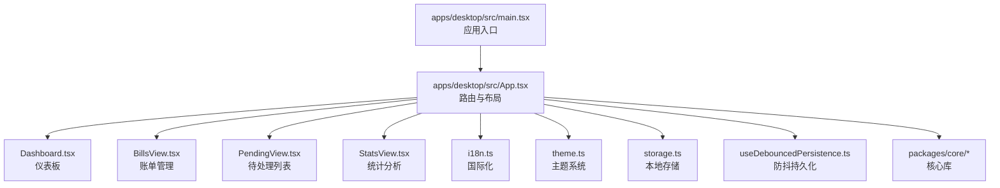

图表来源
- [main.tsx:1-200](file://apps/desktop/src/main.tsx#L1-L200)
- [App.tsx:1-200](file://apps/desktop/src/App.tsx#L1-L200)

章节来源
- [package.json](file://apps/desktop/package.json)
- [vite.config.ts](file://apps/desktop/vite.config.ts)

## 核心组件
- 入口与路由
  - main.tsx：初始化 React、I18n、主题与根组件挂载
  - App.tsx：定义路由与页面切换，集成全局状态与弹窗容器
- 主要视图
  - Dashboard.tsx：概览关键指标与快捷入口
  - BillsView.tsx：账单列表、筛选、编辑与批量操作
  - PendingView.tsx：待处理任务与提醒
  - StatsView.tsx：统计图表与趋势分析
- 弹窗与表单
  - BillFormModal.tsx：新增/编辑账单
  - SubscriptionFormModal.tsx：订阅项表单
  - DueDatePickerModal.tsx：到期日期选择
  - MonitorModal.tsx：监控设置
  - SettingsModal.tsx：应用设置
- 通用 UI
  - Icon.tsx：图标组件
  - ModalShell.tsx：弹窗外壳与遮罩
- 工具与配置
  - i18n.ts：多语言资源与切换
  - theme.ts：主题变量与切换
  - storage.ts：本地存储读写
  - useDebouncedPersistence.ts：防抖持久化 Hook
  - subscriptionFields.ts：表单字段定义
  - categoryLabel.ts：分类标签映射
  - dateUtils.ts：日期工具函数

章节来源
- [main.tsx:1-200](file://apps/desktop/src/main.tsx#L1-L200)
- [App.tsx:1-200](file://apps/desktop/src/App.tsx#L1-L200)
- [Dashboard.tsx:1-200](file://apps/desktop/src/Dashboard.tsx#L1-L200)
- [BillsView.tsx:1-200](file://apps/desktop/src/BillsView.tsx#L1-L200)
- [PendingView.tsx:1-200](file://apps/desktop/src/PendingView.tsx#L1-L200)
- [StatsView.tsx:1-200](file://apps/desktop/src/StatsView.tsx#L1-L200)
- [i18n.ts:1-200](file://apps/desktop/src/i18n.ts#L1-L200)
- [theme.ts:1-200](file://apps/desktop/src/theme.ts#L1-L200)
- [storage.ts:1-200](file://apps/desktop/src/storage.ts#L1-L200)
- [useDebouncedPersistence.ts:1-200](file://apps/desktop/src/useDebouncedPersistence.ts#L1-L200)
- [subscriptionFields.ts:1-200](file://apps/desktop/src/subscriptionFields.ts#L1-L200)
- [categoryLabel.ts:1-200](file://apps/desktop/src/categoryLabel.ts#L1-L200)
- [dateUtils.ts:1-200](file://apps/desktop/src/utils/dateUtils.ts#L1-L200)

## 架构总览
应用采用“视图 + 弹窗 + 工具”的分层结构：
- 视图层：Dashboard、BillsView、PendingView、StatsView 负责页面渲染与交互
- 弹窗层：各类 Modal 承载表单与设置，统一由 ModalShell 管理
- 工具层：i18n、theme、storage、useDebouncedPersistence、dateUtils 提供横切能力
- 核心库：packages/core 暴露类型、动作、统计、货币计算、规则与数据加载

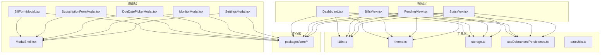

图表来源
- [App.tsx:1-200](file://apps/desktop/src/App.tsx#L1-L200)
- [Dashboard.tsx:1-200](file://apps/desktop/src/Dashboard.tsx#L1-L200)
- [BillsView.tsx:1-200](file://apps/desktop/src/BillsView.tsx#L1-L200)
- [PendingView.tsx:1-200](file://apps/desktop/src/PendingView.tsx#L1-L200)
- [StatsView.tsx:1-200](file://apps/desktop/src/StatsView.tsx#L1-L200)
- [BillFormModal.tsx:1-200](file://apps/desktop/src/BillFormModal.tsx#L1-L200)
- [SubscriptionFormModal.tsx:1-200](file://apps/desktop/src/SubscriptionFormModal.tsx#L1-L200)
- [DueDatePickerModal.tsx:1-200](file://apps/desktop/src/DueDatePickerModal.tsx#L1-L200)
- [MonitorModal.tsx:1-200](file://apps/desktop/src/MonitorModal.tsx#L1-L200)
- [SettingsModal.tsx:1-200](file://apps/desktop/src/SettingsModal.tsx#L1-L200)
- [ModalShell.tsx:1-200](file://apps/desktop/src/ui/ModalShell.tsx#L1-L200)
- [i18n.ts:1-200](file://apps/desktop/src/i18n.ts#L1-L200)
- [theme.ts:1-200](file://apps/desktop/src/theme.ts#L1-L200)
- [storage.ts:1-200](file://apps/desktop/src/storage.ts#L1-L200)
- [useDebouncedPersistence.ts:1-200](file://apps/desktop/src/useDebouncedPersistence.ts#L1-L200)
- [dateUtils.ts:1-200](file://apps/desktop/src/utils/dateUtils.ts#L1-L200)
- [index.ts:1-200](file://packages/core/src/index.ts#L1-L200)

## 详细组件分析

### 路由与入口
- main.tsx：初始化 I18n、主题、挂载根组件
- App.tsx：定义路由与页面切换，集成全局状态、弹窗容器与错误边界

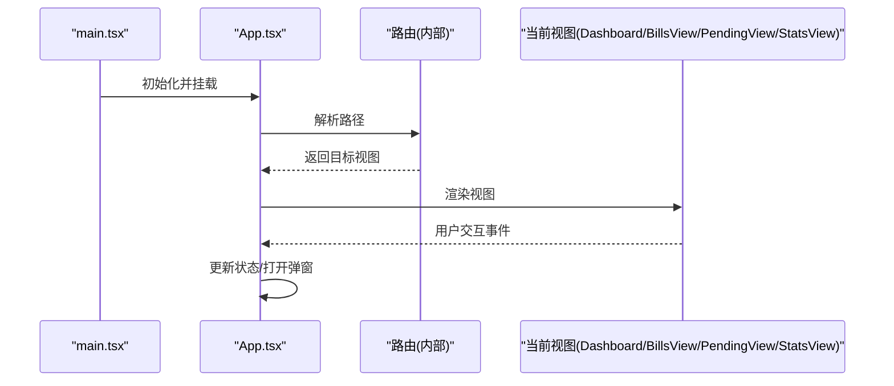

图表来源
- [main.tsx:1-200](file://apps/desktop/src/main.tsx#L1-L200)
- [App.tsx:1-200](file://apps/desktop/src/App.tsx#L1-L200)

章节来源
- [main.tsx:1-200](file://apps/desktop/src/main.tsx#L1-L200)
- [App.tsx:1-200](file://apps/desktop/src/App.tsx#L1-L200)

### Dashboard 仪表板
- 展示关键指标、最近账单、即将到期订阅
- 提供快速导航到账单、待处理与统计页
- 与 I18n、主题、存储联动

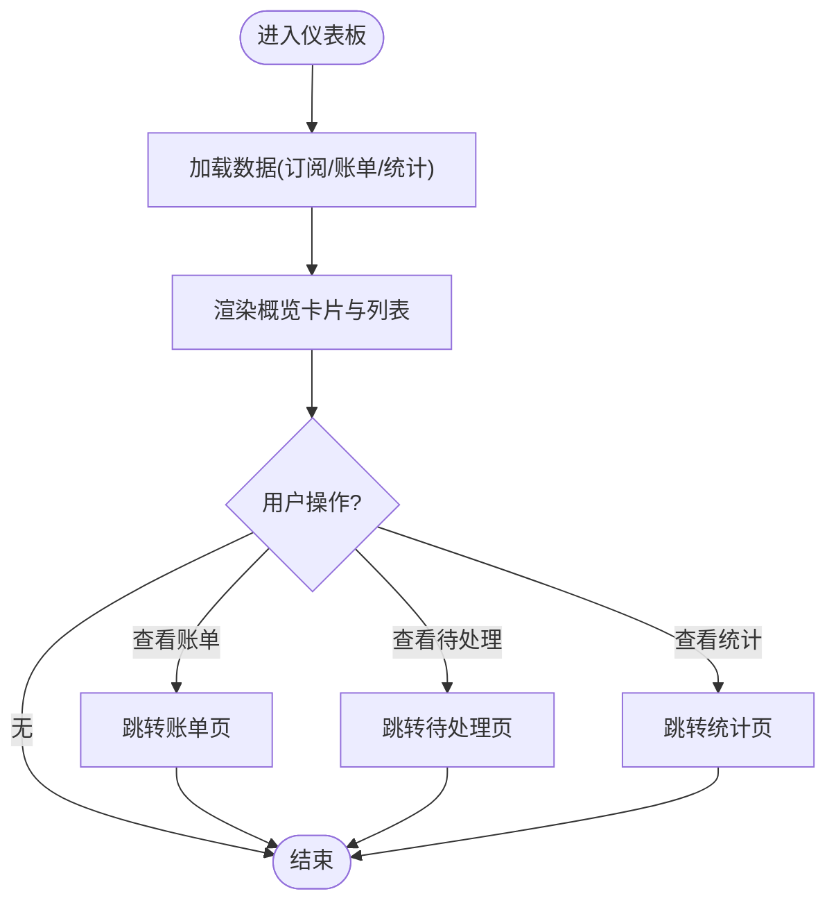

图表来源
- [Dashboard.tsx:1-200](file://apps/desktop/src/Dashboard.tsx#L1-L200)

章节来源
- [Dashboard.tsx:1-200](file://apps/desktop/src/Dashboard.tsx#L1-L200)

### BillsView 账单管理
- 账单列表、筛选、排序、分页
- 支持新增/编辑/删除，批量操作
- 通过 BillFormModal 进行表单输入，提交后触发核心库动作更新数据

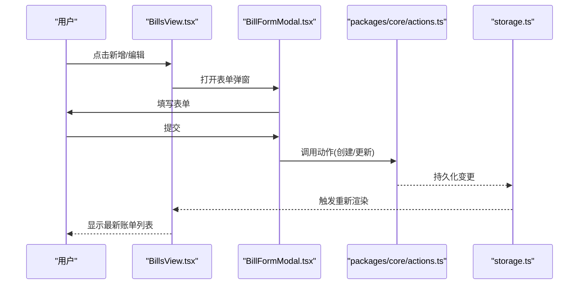

图表来源
- [BillsView.tsx:1-200](file://apps/desktop/src/BillsView.tsx#L1-L200)
- [BillFormModal.tsx:1-200](file://apps/desktop/src/BillFormModal.tsx#L1-L200)
- [actions.ts:1-200](file://packages/core/src/actions.ts#L1-L200)
- [storage.ts:1-200](file://apps/desktop/src/storage.ts#L1-L200)

章节来源
- [BillsView.tsx:1-200](file://apps/desktop/src/BillsView.tsx#L1-L200)
- [BillFormModal.tsx:1-200](file://apps/desktop/src/BillFormModal.tsx#L1-L200)
- [actions.ts:1-200](file://packages/core/src/actions.ts#L1-L200)
- [storage.ts:1-200](file://apps/desktop/src/storage.ts#L1-L200)

### PendingView 待处理列表
- 展示即将到期或需要处理的订阅/账单
- 支持标记完成、设置提醒、跳转到详情
- 与 useRenewReminders 配合实现提醒逻辑（若存在）

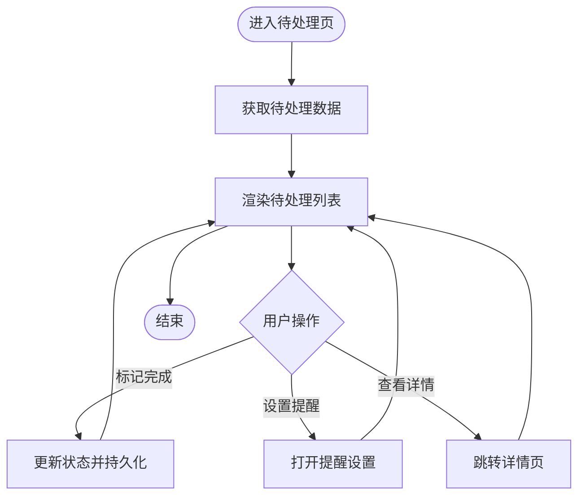

图表来源
- [PendingView.tsx:1-200](file://apps/desktop/src/PendingView.tsx#L1-L200)

章节来源
- [PendingView.tsx:1-200](file://apps/desktop/src/PendingView.tsx#L1-L200)

### StatsView 统计分析
- 汇总订阅支出、分类占比、趋势图
- 使用 core 的 stats 模块计算指标
- 支持时间范围筛选与导出

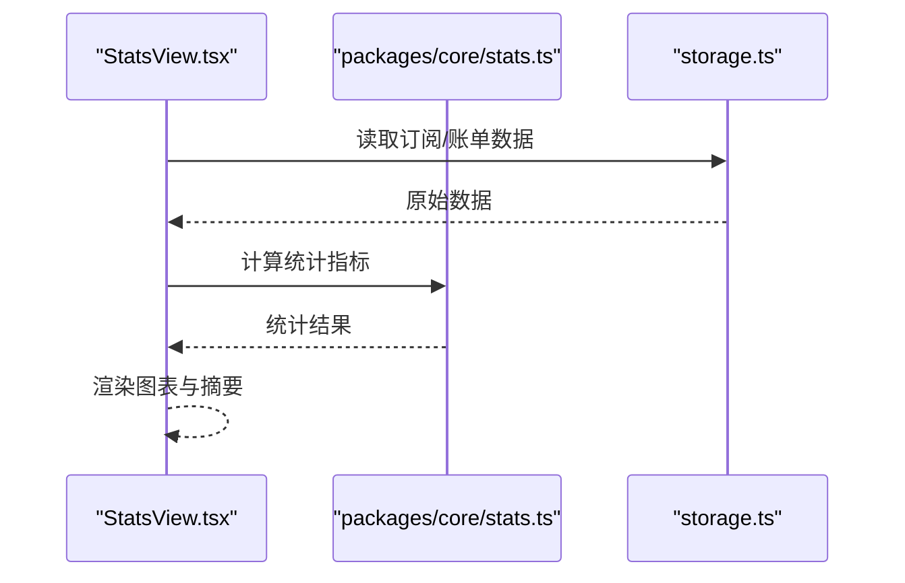

图表来源
- [StatsView.tsx:1-200](file://apps/desktop/src/StatsView.tsx#L1-L200)
- [stats.ts:1-200](file://packages/core/src/stats.ts#L1-L200)
- [storage.ts:1-200](file://apps/desktop/src/storage.ts#L1-L200)

章节来源
- [StatsView.tsx:1-200](file://apps/desktop/src/StatsView.tsx#L1-L200)
- [stats.ts:1-200](file://packages/core/src/stats.ts#L1-L200)

### 表单与弹窗
- BillFormModal：账单表单校验、提交、错误提示
- SubscriptionFormModal：订阅项字段由 subscriptionFields.ts 定义
- DueDatePickerModal：日期选择与格式化
- MonitorModal：监控开关与阈值设置
- SettingsModal：应用设置（语言、主题、存储策略）
- ModalShell：统一的弹窗外壳、键盘关闭、焦点管理

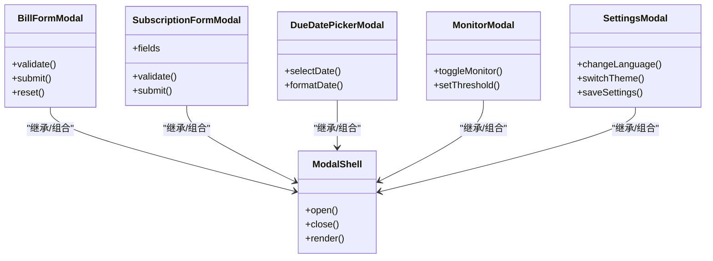

图表来源
- [ModalShell.tsx:1-200](file://apps/desktop/src/ui/ModalShell.tsx#L1-L200)
- [BillFormModal.tsx:1-200](file://apps/desktop/src/BillFormModal.tsx#L1-L200)
- [SubscriptionFormModal.tsx:1-200](file://apps/desktop/src/SubscriptionFormModal.tsx#L1-L200)
- [DueDatePickerModal.tsx:1-200](file://apps/desktop/src/DueDatePickerModal.tsx#L1-L200)
- [MonitorModal.tsx:1-200](file://apps/desktop/src/MonitorModal.tsx#L1-L200)
- [SettingsModal.tsx:1-200](file://apps/desktop/src/SettingsModal.tsx#L1-L200)

章节来源
- [ModalShell.tsx:1-200](file://apps/desktop/src/ui/ModalShell.tsx#L1-L200)
- [BillFormModal.tsx:1-200](file://apps/desktop/src/BillFormModal.tsx#L1-L200)
- [SubscriptionFormModal.tsx:1-200](file://apps/desktop/src/SubscriptionFormModal.tsx#L1-L200)
- [DueDatePickerModal.tsx:1-200](file://apps/desktop/src/DueDatePickerModal.tsx#L1-L200)
- [MonitorModal.tsx:1-200](file://apps/desktop/src/MonitorModal.tsx#L1-L200)
- [SettingsModal.tsx:1-200](file://apps/desktop/src/SettingsModal.tsx#L1-L200)

### 国际化与主题
- i18n.ts：多语言资源、切换语言、动态加载
- theme.ts：主题变量、明暗模式、样式注入

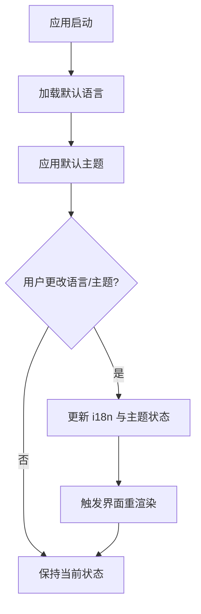

图表来源
- [i18n.ts:1-200](file://apps/desktop/src/i18n.ts#L1-L200)
- [theme.ts:1-200](file://apps/desktop/src/theme.ts#L1-L200)

章节来源
- [i18n.ts:1-200](file://apps/desktop/src/i18n.ts#L1-L200)
- [theme.ts:1-200](file://apps/desktop/src/theme.ts#L1-L200)

### 数据存储与持久化
- storage.ts：本地存储读写封装
- useDebouncedPersistence.ts：防抖持久化 Hook，减少频繁写入
- 与核心库 load.ts、defaults.ts 协作，确保数据一致性

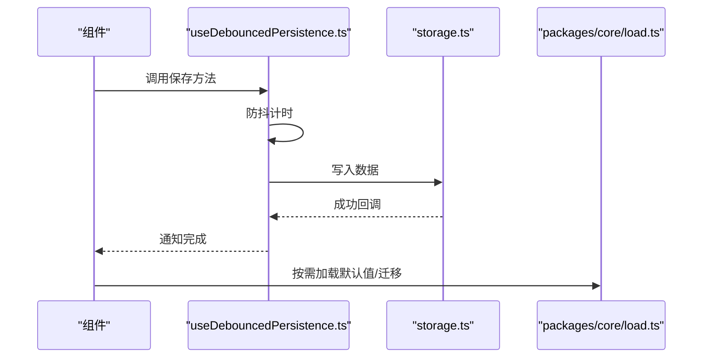

图表来源
- [useDebouncedPersistence.ts:1-200](file://apps/desktop/src/useDebouncedPersistence.ts#L1-L200)
- [storage.ts:1-200](file://apps/desktop/src/storage.ts#L1-L200)
- [load.ts:1-200](file://packages/core/src/load.ts#L1-L200)
- [defaults.ts:1-200](file://packages/core/src/defaults.ts#L1-L200)

章节来源
- [useDebouncedPersistence.ts:1-200](file://apps/desktop/src/useDebouncedPersistence.ts#L1-L200)
- [storage.ts:1-200](file://apps/desktop/src/storage.ts#L1-L200)
- [load.ts:1-200](file://packages/core/src/load.ts#L1-L200)
- [defaults.ts:1-200](file://packages/core/src/defaults.ts#L1-L200)

### 表格与数据处理
- SubTable.tsx：可排序、分页、筛选的数据表格
- categoryLabel.ts：分类标签映射
- dateUtils.ts：日期格式化与比较

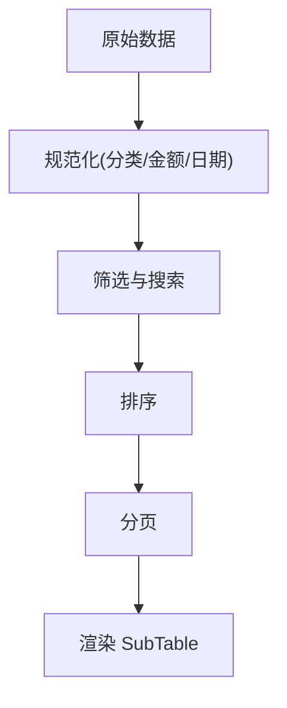

图表来源
- [SubTable.tsx:1-200](file://apps/desktop/src/SubTable.tsx#L1-L200)
- [categoryLabel.ts:1-200](file://apps/desktop/src/categoryLabel.ts#L1-L200)
- [dateUtils.ts:1-200](file://apps/desktop/src/utils/dateUtils.ts#L1-L200)

章节来源
- [SubTable.tsx:1-200](file://apps/desktop/src/SubTable.tsx#L1-L200)
- [categoryLabel.ts:1-200](file://apps/desktop/src/categoryLabel.ts#L1-L200)
- [dateUtils.ts:1-200](file://apps/desktop/src/utils/dateUtils.ts#L1-L200)

## 依赖关系分析
- 视图组件依赖核心库 actions、stats、types、money、rules、views
- 弹窗组件依赖表单字段定义与日期工具
- 全局能力（i18n、theme、storage、Hook）被各视图与弹窗复用

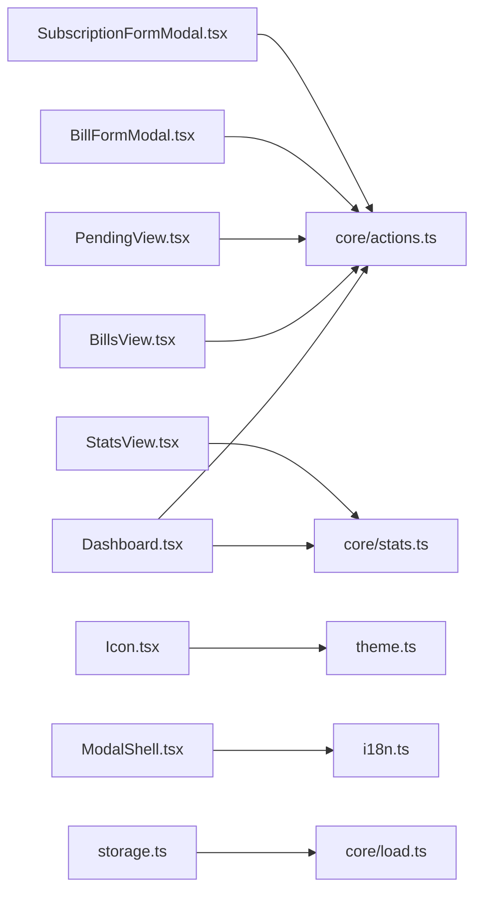

图表来源
- [Dashboard.tsx:1-200](file://apps/desktop/src/Dashboard.tsx#L1-L200)
- [BillsView.tsx:1-200](file://apps/desktop/src/BillsView.tsx#L1-L200)
- [PendingView.tsx:1-200](file://apps/desktop/src/PendingView.tsx#L1-L200)
- [StatsView.tsx:1-200](file://apps/desktop/src/StatsView.tsx#L1-L200)
- [BillFormModal.tsx:1-200](file://apps/desktop/src/BillFormModal.tsx#L1-L200)
- [SubscriptionFormModal.tsx:1-200](file://apps/desktop/src/SubscriptionFormModal.tsx#L1-L200)
- [Icon.tsx:1-200](file://apps/desktop/src/ui/Icon.tsx#L1-L200)
- [ModalShell.tsx:1-200](file://apps/desktop/src/ui/ModalShell.tsx#L1-L200)
- [storage.ts:1-200](file://apps/desktop/src/storage.ts#L1-L200)
- [actions.ts:1-200](file://packages/core/src/actions.ts#L1-L200)
- [stats.ts:1-200](file://packages/core/src/stats.ts#L1-L200)
- [load.ts:1-200](file://packages/core/src/load.ts#L1-L200)

章节来源
- [index.ts:1-200](file://packages/core/src/index.ts#L1-L200)
- [types.ts:1-200](file://packages/core/src/types.ts#L1-L200)
- [actions.ts:1-200](file://packages/core/src/actions.ts#L1-L200)
- [stats.ts:1-200](file://packages/core/src/stats.ts#L1-L200)
- [defaults.ts:1-200](file://packages/core/src/defaults.ts#L1-L200)
- [load.ts:1-200](file://packages/core/src/load.ts#L1-L200)
- [money.ts:1-200](file://packages/core/src/money.ts#L1-L200)
- [rules.ts:1-200](file://packages/core/src/rules.ts#L1-L200)
- [views.ts:1-200](file://packages/core/src/views.ts#L1-L200)

## 性能考虑
- 列表渲染优化
  - 对长列表使用虚拟滚动或分页（SubTable 已支持分页）
  - 避免在渲染路径中进行昂贵计算，将计算移至核心库并缓存结果
- 状态持久化
  - 使用 useDebouncedPersistence 减少频繁写入
  - 合并多次更新，批量提交
- 网络与 IO
  - 如需扩展 Tauri 能力，尽量异步并发，避免阻塞主线程
- 资源加载
  - 懒加载弹窗与重型组件
  - 图片与图标按需引入

[本节为通用指导，不直接分析具体文件]

## 故障排查指南
- 常见问题
  - 数据未持久化：检查 storage.ts 写入是否成功，确认 useDebouncedPersistence 的防抖间隔
  - 语言/主题未生效：确认 i18n 与 theme 的状态更新是否触发重渲染
  - 表单校验失败：核对 subscriptionFields.ts 字段定义与校验规则
  - 统计异常：检查 core/stats.ts 的计算逻辑与输入数据格式
- 调试建议
  - 在关键节点添加日志输出（注意生产环境清理）
  - 使用浏览器开发者工具或 Tauri 控制台查看错误堆栈
  - 对复杂流程编写单元测试（如 PendingView.test.ts、SubTable.test.ts）

章节来源
- [storage.ts:1-200](file://apps/desktop/src/storage.ts#L1-L200)
- [useDebouncedPersistence.ts:1-200](file://apps/desktop/src/useDebouncedPersistence.ts#L1-L200)
- [i18n.ts:1-200](file://apps/desktop/src/i18n.ts#L1-L200)
- [theme.ts:1-200](file://apps/desktop/src/theme.ts#L1-L200)
- [subscriptionFields.ts:1-200](file://apps/desktop/src/subscriptionFields.ts#L1-L200)
- [stats.ts:1-200](file://packages/core/src/stats.ts#L1-L200)

## 结论
本桌面应用以清晰的视图分层与弹窗体系组织代码，借助核心库实现业务逻辑复用，通过国际化与主题系统提升用户体验。建议在后续迭代中继续强化性能优化与测试覆盖，确保可扩展性与稳定性。

## 附录
- 组件使用示例（路径参考）
  - 仪表板：[Dashboard.tsx](file://apps/desktop/src/Dashboard.tsx)
  - 账单管理：[BillsView.tsx](file://apps/desktop/src/BillsView.tsx)、[BillFormModal.tsx](file://apps/desktop/src/BillFormModal.tsx)
  - 待处理列表：[PendingView.tsx](file://apps/desktop/src/PendingView.tsx)
  - 统计分析：[StatsView.tsx](file://apps/desktop/src/StatsView.tsx)
  - 表单字段：[subscriptionFields.ts](file://apps/desktop/src/subscriptionFields.ts)
  - 分类标签：[categoryLabel.ts](file://apps/desktop/src/categoryLabel.ts)
  - 日期工具：[dateUtils.ts](file://apps/desktop/src/utils/dateUtils.ts)
  - 表格组件：[SubTable.tsx](file://apps/desktop/src/SubTable.tsx)
  - 弹窗外壳：[ModalShell.tsx](file://apps/desktop/src/ui/ModalShell.tsx)
  - 图标组件：[Icon.tsx](file://apps/desktop/src/ui/Icon.tsx)
- 自定义指南
  - 新增视图：在 App.tsx 中添加路由与页面组件，复用 i18n、theme、storage
  - 新增弹窗：继承 ModalShell，实现表单校验与提交逻辑
  - 扩展核心库：在 packages/core 中新增模块，并在视图中按需引用

[本节为补充信息，不直接分析具体文件]