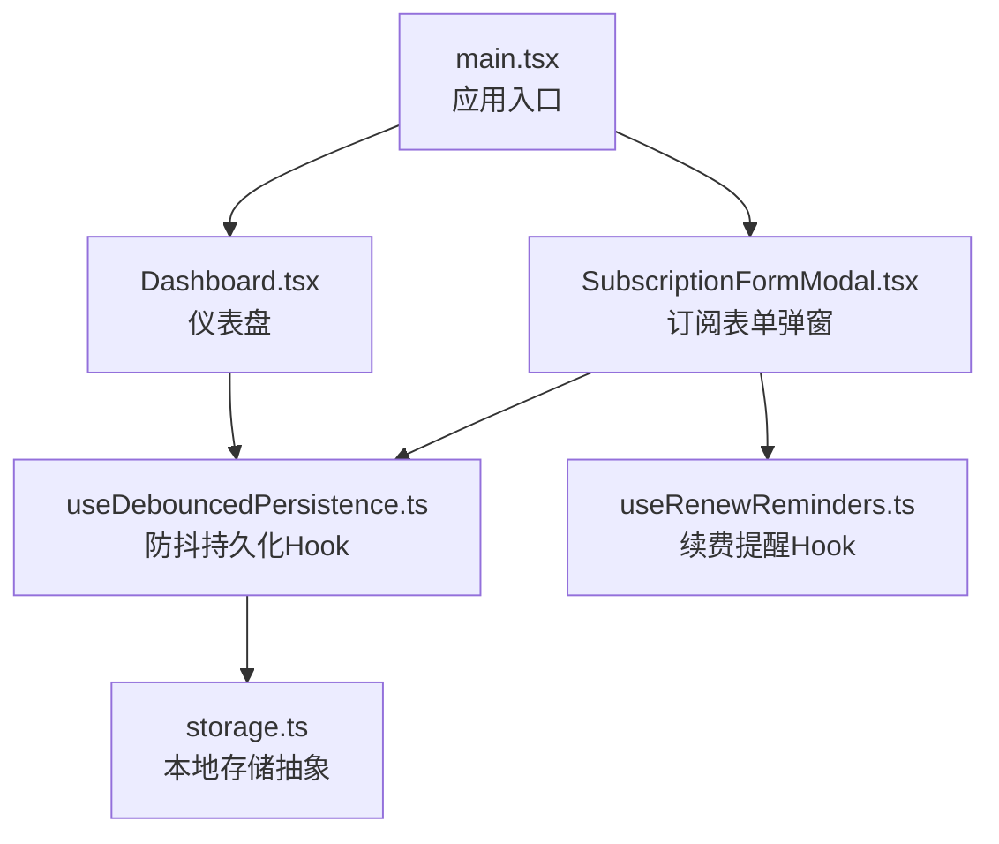
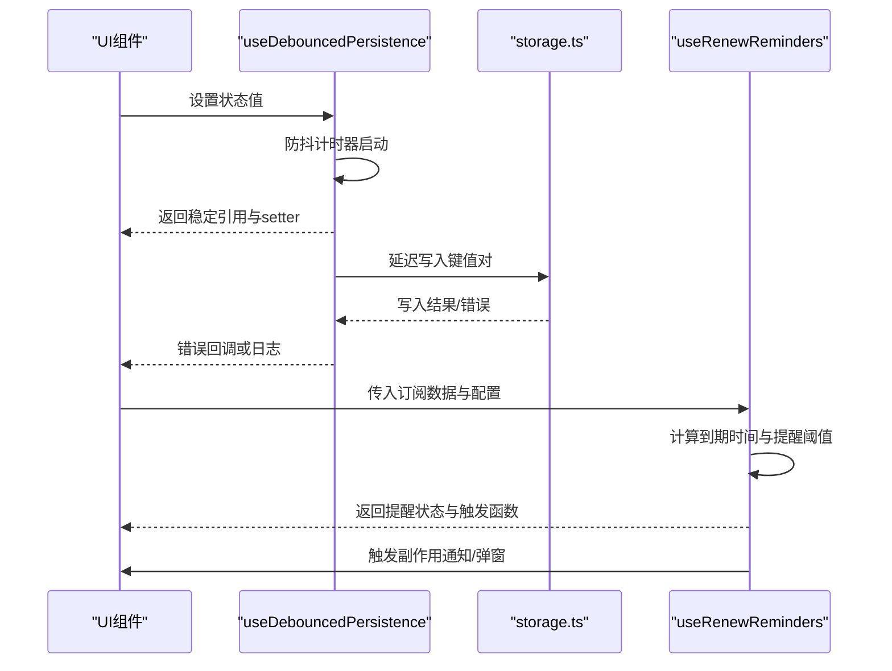
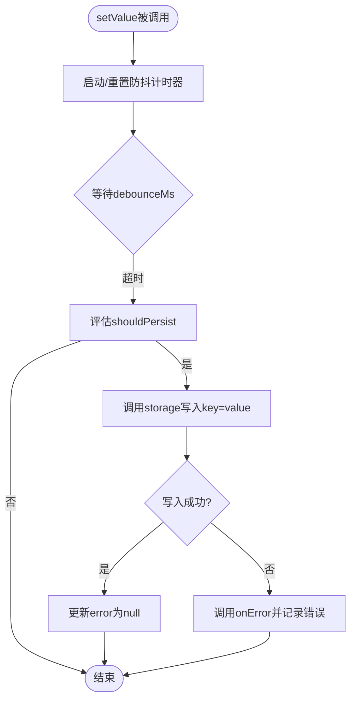
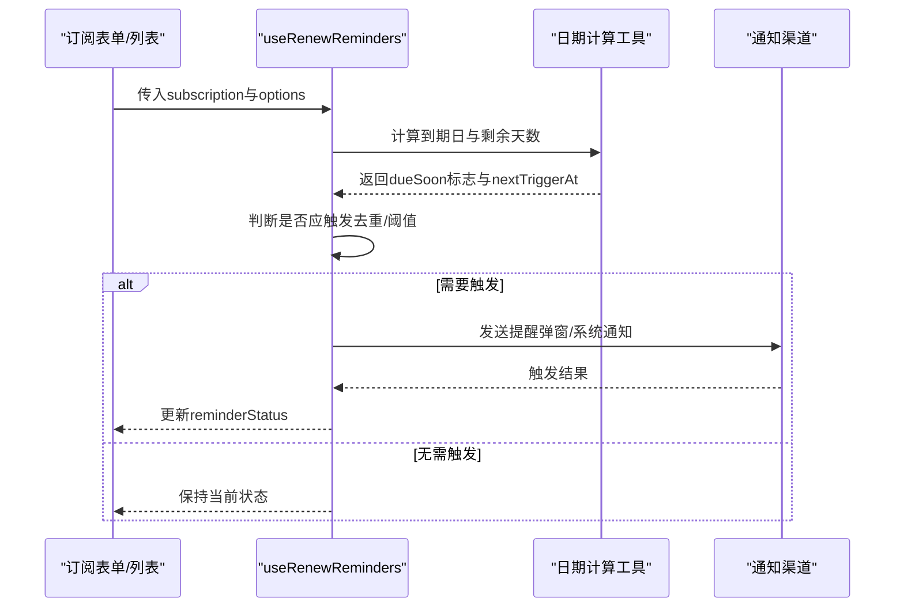
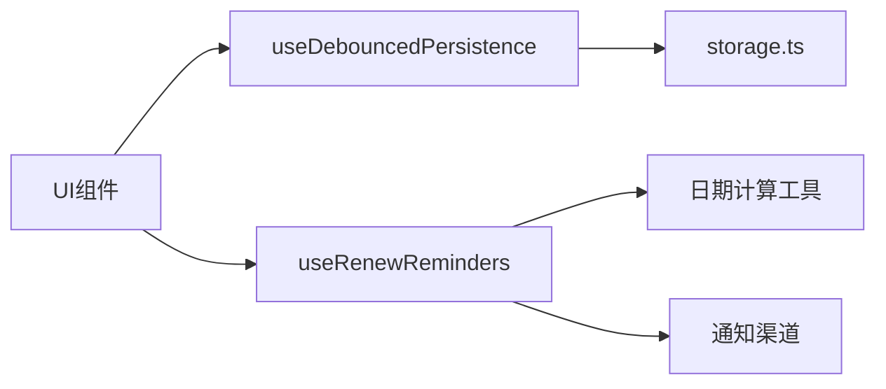

# 自定义Hooks

<cite>
**本文引用的文件**   
- [useDebouncedPersistence.ts](file://apps/desktop/src/useDebouncedPersistence.ts)
- [useRenewReminders.ts](file://apps/desktop/src/useRenewReminders.ts)
- [storage.ts](file://apps/desktop/src/storage.ts)
- [main.tsx](file://apps/desktop/src/main.tsx)
- [Dashboard.tsx](file://apps/desktop/src/Dashboard.tsx)
- [SubscriptionFormModal.tsx](file://apps/desktop/src/SubscriptionFormModal.tsx)
</cite>

## 目录
1. [简介](#简介)
2. [项目结构](#项目结构)
3. [核心组件](#核心组件)
4. [架构总览](#架构总览)
5. [详细组件分析](#详细组件分析)
6. [依赖关系分析](#依赖关系分析)
7. [性能考量](#性能考量)
8. [故障排查指南](#故障排查指南)
9. [结论](#结论)
10. [附录](#附录)

## 简介
本文件面向开发者与产品使用者，系统化介绍本项目中的两个自定义React Hooks：
- useDebouncedPersistence（防抖持久化Hook）：在状态变化时进行防抖写入，降低频繁I/O带来的性能损耗。
- useRenewReminders（续费提醒Hook）：基于订阅到期时间计算并触发续费提醒，支持配置项与副作用处理。

文档涵盖实现原理、状态管理、副作用处理、性能优化、使用示例、参数配置、错误处理以及组合模式与扩展指南。

## 项目结构
桌面端应用位于 apps/desktop/src，其中与Hook相关的核心文件包括：
- useDebouncedPersistence.ts：防抖持久化Hook实现
- useRenewReminders.ts：续费提醒Hook实现
- storage.ts：本地存储抽象（读写、序列化等）
- main.tsx：应用入口，初始化全局上下文与路由
- Dashboard.tsx：仪表盘页面，可能消费Hook或展示数据
- SubscriptionFormModal.tsx：订阅表单弹窗，常用于编辑订阅信息并触发持久化与提醒

图表来源
- [main.tsx](file://apps/desktop/src/main.tsx)
- [Dashboard.tsx](file://apps/desktop/src/Dashboard.tsx)
- [SubscriptionFormModal.tsx](file://apps/desktop/src/SubscriptionFormModal.tsx)
- [useDebouncedPersistence.ts](file://apps/desktop/src/useDebouncedPersistence.ts)
- [useRenewReminders.ts](file://apps/desktop/src/useRenewReminders.ts)
- [storage.ts](file://apps/desktop/src/storage.ts)

章节来源
- [main.tsx](file://apps/desktop/src/main.tsx)
- [Dashboard.tsx](file://apps/desktop/src/Dashboard.tsx)
- [SubscriptionFormModal.tsx](file://apps/desktop/src/SubscriptionFormModal.tsx)
- [useDebouncedPersistence.ts](file://apps/desktop/src/useDebouncedPersistence.ts)
- [useRenewReminders.ts](file://apps/desktop/src/useRenewReminders.ts)
- [storage.ts](file://apps/desktop/src/storage.ts)

## 核心组件
- useDebouncedPersistence
  - 职责：将任意状态值与一个键绑定，在值变化后延迟写入持久化存储，避免高频更新导致的I/O压力。
  - 关键特性：可配置防抖延迟、是否立即同步初始值、错误捕获与重试策略、选择性持久化字段。
- useRenewReminders
  - 职责：根据订阅的到期时间与当前时间计算提醒时机，支持一次性或周期性提醒、静默模式、通知渠道。
  - 关键特性：可配置提醒阈值（如提前N天）、提醒类型（弹窗/系统通知）、去重与节流、副作用回调。

章节来源
- [useDebouncedPersistence.ts](file://apps/desktop/src/useDebouncedPersistence.ts)
- [useRenewReminders.ts](file://apps/desktop/src/useRenewReminders.ts)

## 架构总览
下图展示了Hook在应用中的调用链与数据流：UI层通过Hook获取状态与操作函数；防抖持久化Hook在状态变更后延迟写入storage；续费提醒Hook依据订阅数据计算并触发提醒副作用。

图表来源
- [useDebouncedPersistence.ts](file://apps/desktop/src/useDebouncedPersistence.ts)
- [storage.ts](file://apps/desktop/src/storage.ts)
- [useRenewReminders.ts](file://apps/desktop/src/useRenewReminders.ts)

## 详细组件分析

### useDebouncedPersistence（防抖持久化Hook）
- 设计目标
  - 减少频繁写盘造成的性能抖动
  - 保证最终一致性（延迟写入但确保落盘）
  - 提供可控的错误处理与重试机制
- 输入参数（典型）
  - key：持久化键名
  - initialValue：初始值
  - options：{ debounceMs, immediateSync, onError, shouldPersist }
- 返回值
  - value：当前状态值
  - setValue：设置新值的函数（内部触发防抖写入）
  - persistNow：强制立即写入（可选）
  - error：最近一次写入错误（可选）
- 状态管理与副作用
  - 使用内部定时器维护防抖窗口
  - 在effect中监听值变化并调度写入
  - 首次挂载可选择立即同步初始值到存储
- 性能优化
  - 防抖合并多次快速更新
  - 选择性持久化（shouldPersist）避免无用写入
  - 稳定引用（memo化setValue/persistNow）减少重渲染
- 错误处理
  - 捕获存储异常（如权限不足、磁盘满）
  - 提供onError回调用于上报或降级
  - 支持失败重试与退避策略（可扩展）

图表来源
- [useDebouncedPersistence.ts](file://apps/desktop/src/useDebouncedPersistence.ts)
- [storage.ts](file://apps/desktop/src/storage.ts)

章节来源
- [useDebouncedPersistence.ts](file://apps/desktop/src/useDebouncedPersistence.ts)
- [storage.ts](file://apps/desktop/src/storage.ts)

### useRenewReminders（续费提醒Hook）
- 设计目标
  - 基于订阅到期时间自动触发提醒
  - 支持多种提醒策略与渠道
  - 避免重复提醒与过度通知
- 输入参数（典型）
  - subscription：包含到期日、周期、名称等字段
  - options：{ reminderDaysBefore, channels, onTrigger, dedupeKey }
- 返回值
  - reminderStatus：{ dueSoon, triggered, nextTriggerAt }
  - triggerReminder：手动触发提醒（可选）
  - clearReminder：清除已触发的提醒（可选）
- 触发条件
  - 当前时间接近到期日（<=reminderDaysBefore）
  - 未重复触发（基于dedupeKey或上次触发时间）
  - 订阅有效且未被取消
- 副作用处理
  - 通过onTrigger回调执行通知（弹窗/系统通知）
  - 支持静默模式（仅记录日志）
  - 可集成外部事件总线或消息队列
- 性能优化
  - 仅在订阅数据变化时重新计算
  - 使用稳定的比较逻辑避免不必要的副作用
  - 合理设置检查频率（如每分钟）

图表来源
- [useRenewReminders.ts](file://apps/desktop/src/useRenewReminders.ts)

章节来源
- [useRenewReminders.ts](file://apps/desktop/src/useRenewReminders.ts)

### 组合模式与使用示例
- 基础用法
  - 在表单中使用useDebouncedPersistence保存用户输入，避免每次按键都写盘
  - 在订阅列表中使用useRenewReminders显示即将到期的订阅并弹出提醒
- 组合模式
  - 将两者结合：当用户修改订阅到期日时，防抖持久化保存；同时续费提醒Hook根据新日期重新计算提醒
- 错误处理
  - 在onError中记录错误并提示用户“保存失败，请重试”
  - 对于提醒失败，提供“稍后再试”按钮
- 扩展指南
  - 为useDebouncedPersistence增加压缩或分片写入
  - 为useRenewReminders增加多渠道通知（邮件、短信）与模板引擎

章节来源
- [SubscriptionFormModal.tsx](file://apps/desktop/src/SubscriptionFormModal.tsx)
- [Dashboard.tsx](file://apps/desktop/src/Dashboard.tsx)

## 依赖关系分析
- useDebouncedPersistence依赖storage.ts进行实际I/O
- useRenewReminders依赖日期计算工具与通知渠道
- UI组件（Dashboard、SubscriptionFormModal）消费这两个Hook

图表来源
- [useDebouncedPersistence.ts](file://apps/desktop/src/useDebouncedPersistence.ts)
- [useRenewReminders.ts](file://apps/desktop/src/useRenewReminders.ts)
- [storage.ts](file://apps/desktop/src/storage.ts)

章节来源
- [useDebouncedPersistence.ts](file://apps/desktop/src/useDebouncedPersistence.ts)
- [useRenewReminders.ts](file://apps/desktop/src/useRenewReminders.ts)
- [storage.ts](file://apps/desktop/src/storage.ts)

## 性能考量
- 防抖持久化
  - 合理设置debounceMs（建议200-500ms）以平衡实时性与I/O压力
  - 使用shouldPersist过滤无关变更（如空字符串或默认值）
  - 避免在高频事件中直接调用setState导致重渲染
- 续费提醒
  - 限制检查频率（如每分钟），避免轮询开销
  - 使用stable comparison避免重复计算
  - 通知渠道异步处理，不阻塞主线程

## 故障排查指南
- 常见问题
  - 持久化未生效：检查key是否正确、storage权限、shouldPersist逻辑
  - 提醒未触发：确认subscription到期日格式、reminderDaysBefore阈值、去重键是否唯一
  - 内存泄漏：确保清理定时器与事件监听器
- 调试技巧
  - 在onError中打印堆栈与上下文
  - 使用浏览器/控制台日志观察防抖计时器状态
  - 模拟极端场景（网络中断、磁盘满）验证健壮性

章节来源
- [useDebouncedPersistence.ts](file://apps/desktop/src/useDebouncedPersistence.ts)
- [useRenewReminders.ts](file://apps/desktop/src/useRenewReminders.ts)

## 结论
useDebouncedPersistence与useRenewReminders分别解决了状态持久化与订阅提醒两大核心需求。通过合理的参数配置、错误处理与性能优化，它们能够在复杂UI场景中提供稳定高效的体验。建议在实际使用中结合业务需求进行扩展与定制。

## 附录
- 最佳实践
  - 始终为持久化键命名规范（如app:subscription:{id}:data）
  - 为提醒功能提供用户可关闭选项
  - 在测试中覆盖边界条件（空值、未来/过去日期、并发更新）
- 参考文件
  - [main.tsx](file://apps/desktop/src/main.tsx)
  - [Dashboard.tsx](file://apps/desktop/src/Dashboard.tsx)
  - [SubscriptionFormModal.tsx](file://apps/desktop/src/SubscriptionFormModal.tsx)
  - [useDebouncedPersistence.ts](file://apps/desktop/src/useDebouncedPersistence.ts)
  - [useRenewReminders.ts](file://apps/desktop/src/useRenewReminders.ts)
  - [storage.ts](file://apps/desktop/src/storage.ts)