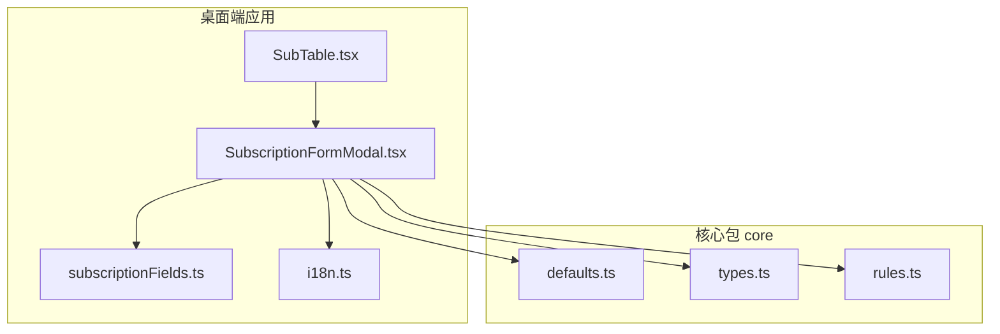
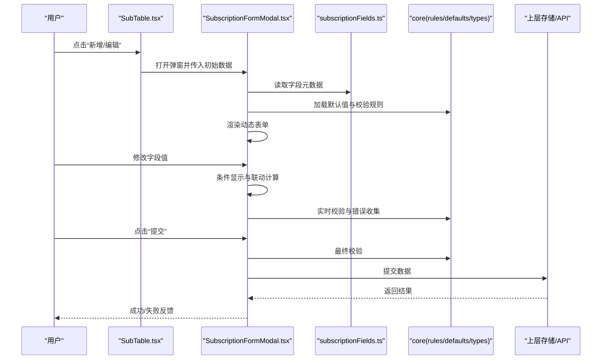
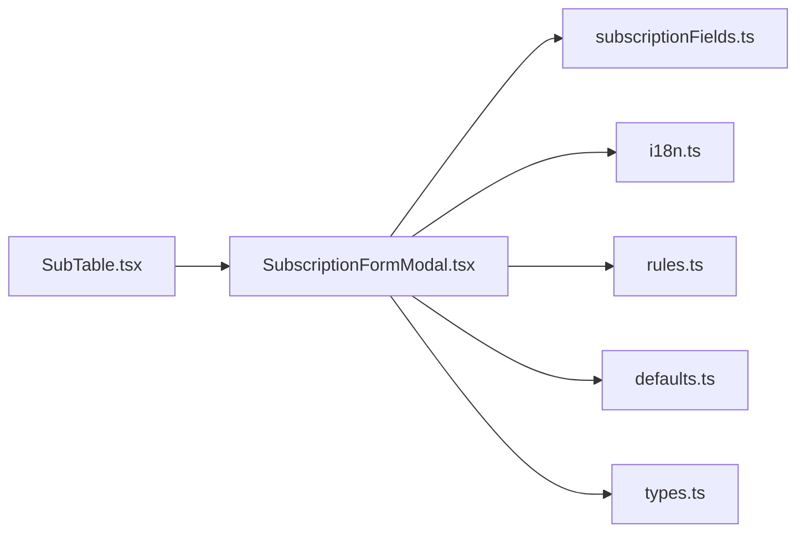

# 订阅表单

<cite>
**本文引用的文件**   
- [SubscriptionFormModal.tsx](file://apps/desktop/src/SubscriptionFormModal.tsx)
- [subscriptionFields.ts](file://apps/desktop/src/subscriptionFields.ts)
- [SubTable.tsx](file://apps/desktop/src/SubTable.tsx)
- [i18n.ts](file://apps/desktop/src/i18n.ts)
- [defaults.ts](file://packages/core/src/defaults.ts)
- [types.ts](file://packages/core/src/types.ts)
- [rules.ts](file://packages/core/src/rules.ts)
</cite>

## 目录
1. [简介](#简介)
2. [项目结构](#项目结构)
3. [核心组件](#核心组件)
4. [架构总览](#架构总览)
5. [详细组件分析](#详细组件分析)
6. [依赖关系分析](#依赖关系分析)
7. [性能考虑](#性能考虑)
8. [故障排查指南](#故障排查指南)
9. [结论](#结论)
10. [附录](#附录)

## 简介
本文件围绕订阅表单模块，系统性说明 SubscriptionFormModal 组件的表单设计、字段验证与数据提交流程。重点覆盖 subscriptionFields 中的字段定义、校验规则与默认值配置；解释动态表单生成、条件显示与联动逻辑；并给出表单状态管理、错误处理与用户反馈的实现要点。最后提供表单定制与扩展指南，帮助开发者快速适配业务需求。

## 项目结构
订阅表单相关代码主要位于桌面端应用目录 apps/desktop/src 中，核心文件包括：
- SubscriptionFormModal.tsx：订阅表单弹窗组件，负责渲染表单、处理交互与提交。
- subscriptionFields.ts：订阅表单字段元数据与校验规则定义。
- SubTable.tsx：订阅列表展示与操作入口，触发订阅表单弹窗。
- i18n.ts：国际化文案资源，用于表单提示与错误信息。
- packages/core 下的 defaults.ts、types.ts、rules.ts：通用默认值、类型定义与校验规则库。

**图表来源** 
- [SubscriptionFormModal.tsx](file://apps/desktop/src/SubscriptionFormModal.tsx)
- [subscriptionFields.ts](file://apps/desktop/src/subscriptionFields.ts)
- [SubTable.tsx](file://apps/desktop/src/SubTable.tsx)
- [i18n.ts](file://apps/desktop/src/i18n.ts)
- [defaults.ts](file://packages/core/src/defaults.ts)
- [types.ts](file://packages/core/src/types.ts)
- [rules.ts](file://packages/core/src/rules.ts)

**章节来源**
- [SubscriptionFormModal.tsx](file://apps/desktop/src/SubscriptionFormModal.tsx)
- [subscriptionFields.ts](file://apps/desktop/src/subscriptionFields.ts)
- [SubTable.tsx](file://apps/desktop/src/SubTable.tsx)
- [i18n.ts](file://apps/desktop/src/i18n.ts)
- [defaults.ts](file://packages/core/src/defaults.ts)
- [types.ts](file://packages/core/src/types.ts)
- [rules.ts](file://packages/core/src/rules.ts)

## 核心组件
- SubscriptionFormModal：订阅表单弹窗组件，承载动态表单渲染、字段校验、联动控制与提交流程。
- subscriptionFields：字段元数据集合，包含字段标识、类型、标签、占位符、默认值、是否必填、条件显示与联动规则等。
- SubTable：订阅列表视图，提供新增/编辑入口，打开或关闭订阅表单弹窗。
- i18n：多语言文案，为表单标签、提示信息与错误消息提供本地化支持。
- core.defaults/types/rules：统一默认值、类型定义与校验规则，确保跨模块一致性。

**章节来源**
- [SubscriptionFormModal.tsx](file://apps/desktop/src/SubscriptionFormModal.tsx)
- [subscriptionFields.ts](file://apps/desktop/src/subscriptionFields.ts)
- [SubTable.tsx](file://apps/desktop/src/SubTable.tsx)
- [i18n.ts](file://apps/desktop/src/i18n.ts)
- [defaults.ts](file://packages/core/src/defaults.ts)
- [types.ts](file://packages/core/src/types.ts)
- [rules.ts](file://packages/core/src/rules.ts)

## 架构总览
订阅表单采用“元数据驱动”的动态表单架构：
- 字段元数据（subscriptionFields）集中管理字段定义与校验规则。
- 表单组件（SubscriptionFormModal）根据元数据动态渲染输入控件，并绑定事件与校验。
- 条件显示与联动逻辑基于字段值变化进行计算，决定可见性与禁用状态。
- 提交阶段聚合表单数据，执行最终校验，调用上层存储或 API 完成持久化。

**图表来源** 
- [SubTable.tsx](file://apps/desktop/src/SubTable.tsx)
- [SubscriptionFormModal.tsx](file://apps/desktop/src/SubscriptionFormModal.tsx)
- [subscriptionFields.ts](file://apps/desktop/src/subscriptionFields.ts)
- [rules.ts](file://packages/core/src/rules.ts)
- [defaults.ts](file://packages/core/src/defaults.ts)
- [types.ts](file://packages/core/src/types.ts)

## 详细组件分析

### 字段定义与校验（subscriptionFields）
- 字段标识与类型：每个字段具备唯一标识与输入类型（如文本、数字、日期、选择等），便于动态渲染对应控件。
- 标签与占位符：提供用户友好的显示名称与输入提示，通常通过 i18n 获取。
- 默认值：为各字段设置合理的初始值，减少用户输入成本。
- 必填与可选：通过必填标记控制基础校验。
- 校验规则：内置长度、格式、范围等校验，可组合使用。
- 条件显示：基于其他字段值决定是否显示当前字段。
- 联动逻辑：字段值变化时触发联动，更新其他字段的可见性、禁用状态或默认值。

建议将复杂校验规则集中在 rules.ts，保持字段元数据简洁清晰。

**章节来源**
- [subscriptionFields.ts](file://apps/desktop/src/subscriptionFields.ts)
- [rules.ts](file://packages/core/src/rules.ts)
- [i18n.ts](file://apps/desktop/src/i18n.ts)

### 动态表单生成与渲染
- 元数据驱动：根据 subscriptionFields 遍历生成表单控件，避免硬编码。
- 控件绑定：为每个控件绑定值、变更事件与校验回调。
- 错误提示：在控件下方或侧边展示校验错误信息，提升用户体验。
- 响应式更新：字段值变化后重新计算条件显示与联动状态。

**章节来源**
- [SubscriptionFormModal.tsx](file://apps/desktop/src/SubscriptionFormModal.tsx)
- [subscriptionFields.ts](file://apps/desktop/src/subscriptionFields.ts)

### 条件显示与联动逻辑
- 条件显示：当某字段满足特定条件（如选择特定类别）时显示关联字段。
- 联动更新：字段值变化时，自动更新其他字段的值、可见性或禁用状态。
- 性能优化：对频繁变化的字段进行防抖或增量更新，避免全量重渲染。

**章节来源**
- [SubscriptionFormModal.tsx](file://apps/desktop/src/SubscriptionFormModal.tsx)
- [subscriptionFields.ts](file://apps/desktop/src/subscriptionFields.ts)

### 表单状态管理与错误处理
- 状态管理：维护表单原始值、当前值、校验状态与错误集合。
- 实时校验：在输入过程中即时校验，减少提交时的错误堆积。
- 错误收集：汇总所有字段错误，按字段维度展示。
- 提交前校验：提交时再次执行完整校验，阻止非法数据提交。

**章节来源**
- [SubscriptionFormModal.tsx](file://apps/desktop/src/SubscriptionFormModal.tsx)
- [rules.ts](file://packages/core/src/rules.ts)

### 数据提交与用户反馈
- 数据聚合：从表单状态中提取并提交结构化数据。
- 提交流程：调用上层存储或 API，处理成功与失败分支。
- 用户反馈：成功时关闭弹窗并刷新列表；失败时展示错误原因并提供重试选项。

**章节来源**
- [SubscriptionFormModal.tsx](file://apps/desktop/src/SubscriptionFormModal.tsx)
- [SubTable.tsx](file://apps/desktop/src/SubTable.tsx)

### 表单定制与扩展方法
- 新增字段：在 subscriptionFields 中添加字段元数据，并在 rules.ts 补充校验规则。
- 自定义控件：在动态渲染层增加新控件类型映射。
- 扩展联动：在字段元数据中声明新的条件与联动规则。
- 国际化：在 i18n.ts 中补充新字段的标签与错误文案。

**章节来源**
- [subscriptionFields.ts](file://apps/desktop/src/subscriptionFields.ts)
- [rules.ts](file://packages/core/src/rules.ts)
- [i18n.ts](file://apps/desktop/src/i18n.ts)
- [SubscriptionFormModal.tsx](file://apps/desktop/src/SubscriptionFormModal.tsx)

## 依赖关系分析
订阅表单模块依赖关系如下：
- SubscriptionFormModal 依赖 subscriptionFields 提供字段元数据。
- 依赖 i18n 提供多语言文案。
- 依赖 core.rules 提供校验规则。
- 依赖 core.defaults 提供默认值。
- 依赖 core.types 提供类型定义。
- SubTable 作为入口触发 SubscriptionFormModal。

**图表来源** 
- [SubTable.tsx](file://apps/desktop/src/SubTable.tsx)
- [SubscriptionFormModal.tsx](file://apps/desktop/src/SubscriptionFormModal.tsx)
- [subscriptionFields.ts](file://apps/desktop/src/subscriptionFields.ts)
- [i18n.ts](file://apps/desktop/src/i18n.ts)
- [rules.ts](file://packages/core/src/rules.ts)
- [defaults.ts](file://packages/core/src/defaults.ts)
- [types.ts](file://packages/core/src/types.ts)

**章节来源**
- [SubTable.tsx](file://apps/desktop/src/SubTable.tsx)
- [SubscriptionFormModal.tsx](file://apps/desktop/src/SubscriptionFormModal.tsx)
- [subscriptionFields.ts](file://apps/desktop/src/subscriptionFields.ts)
- [i18n.ts](file://apps/desktop/src/i18n.ts)
- [rules.ts](file://packages/core/src/rules.ts)
- [defaults.ts](file://packages/core/src/defaults.ts)
- [types.ts](file://packages/core/src/types.ts)

## 性能考虑
- 动态渲染优化：仅对受影响的字段进行局部更新，避免整表重渲染。
- 校验性能：对高频输入字段进行防抖，延迟校验触发。
- 条件计算缓存：对复杂条件表达式进行结果缓存，减少重复计算。
- 内存管理：及时释放不再使用的监听器与中间状态。

[本节为通用指导，不直接分析具体文件]

## 故障排查指南
- 字段未显示：检查条件显示规则与字段元数据是否正确配置。
- 校验不生效：确认 rules.ts 中是否定义了相应规则，且字段已绑定校验回调。
- 联动失效：检查字段值变化事件是否触发联动计算。
- 提交失败：查看网络或存储层错误日志，确认数据结构与类型匹配。
- 文案缺失：在 i18n.ts 中补充缺失的多语言键值。

**章节来源**
- [subscriptionFields.ts](file://apps/desktop/src/subscriptionFields.ts)
- [rules.ts](file://packages/core/src/rules.ts)
- [i18n.ts](file://apps/desktop/src/i18n.ts)
- [SubscriptionFormModal.tsx](file://apps/desktop/src/SubscriptionFormModal.tsx)

## 结论
订阅表单模块通过元数据驱动的动态表单架构，实现了高内聚、低耦合的字段管理与校验机制。借助条件显示与联动逻辑，表单具备良好的可扩展性与用户体验。遵循本文的定制与扩展指南，开发者可快速适配业务需求并保证系统稳定性。

[本节为总结性内容，不直接分析具体文件]

## 附录
- 最佳实践
  - 将校验规则与字段元数据分离，便于复用与维护。
  - 使用 i18n 统一管理文案，确保多语言一致性。
  - 对复杂联动逻辑进行单元测试，保障行为正确性。
- 常见问题
  - 默认值未生效：检查 defaults.ts 与字段元数据的默认值配置。
  - 类型不匹配：核对 types.ts 定义与提交数据结构。

[本节为补充信息，不直接分析具体文件]