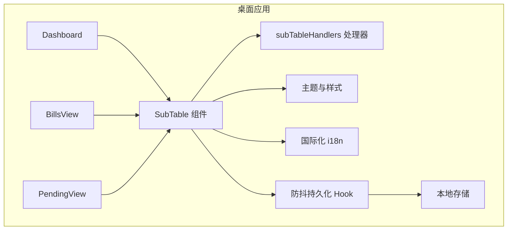
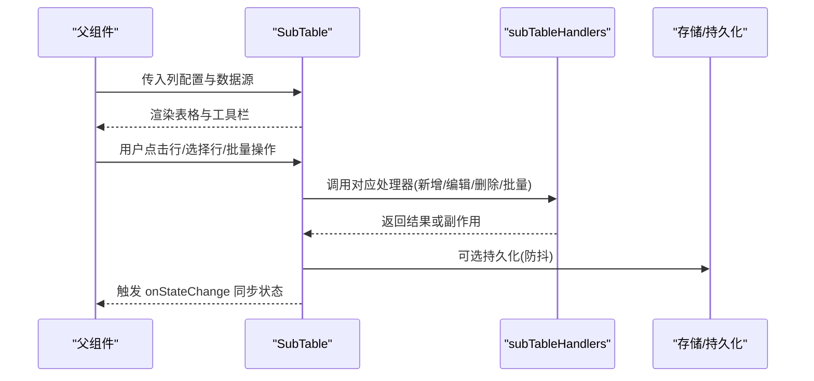
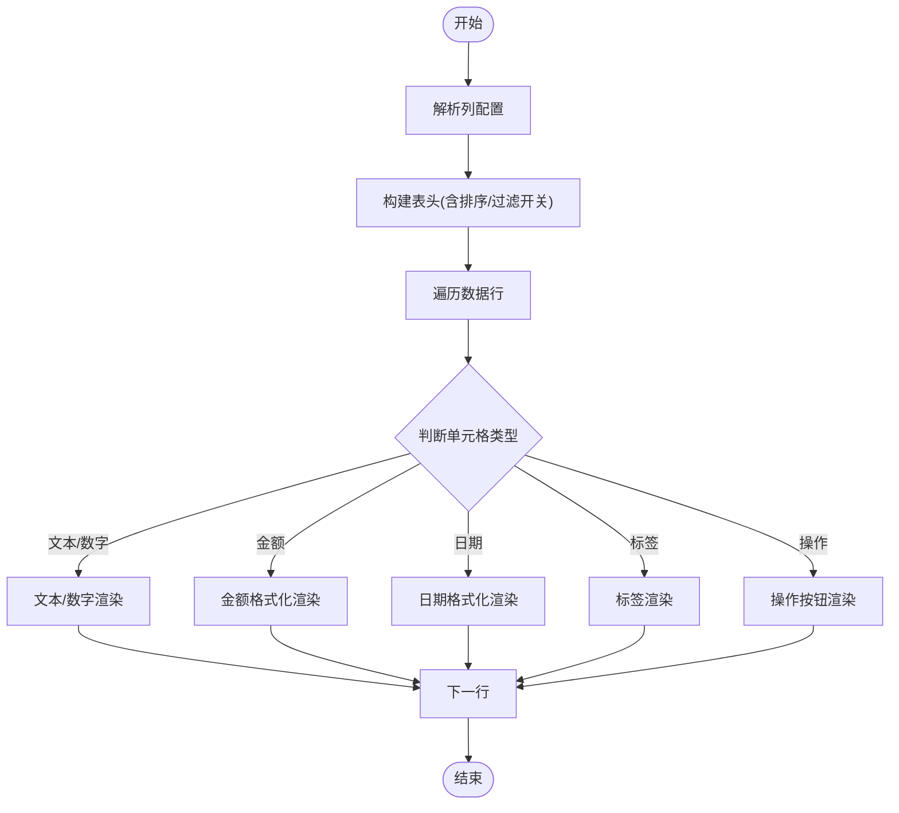
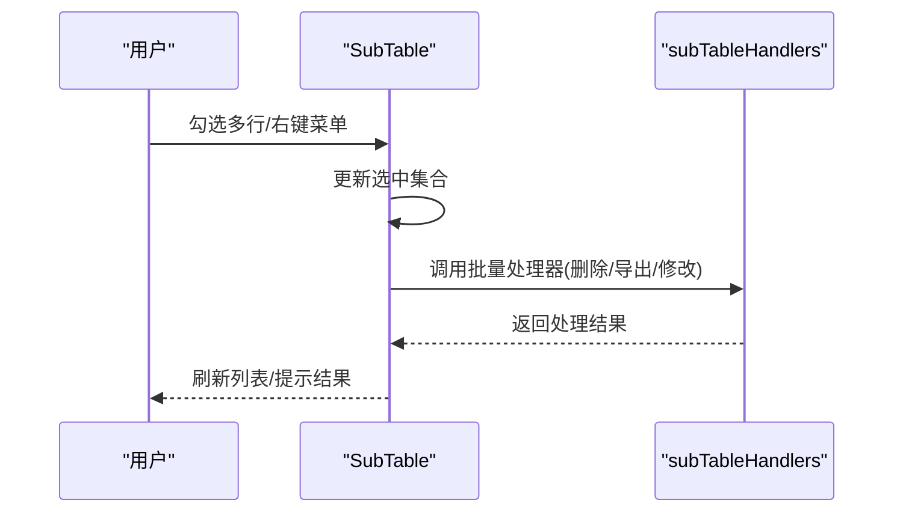
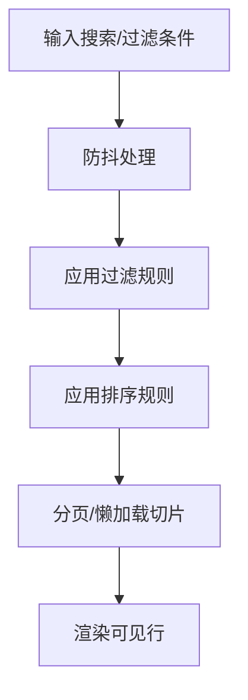
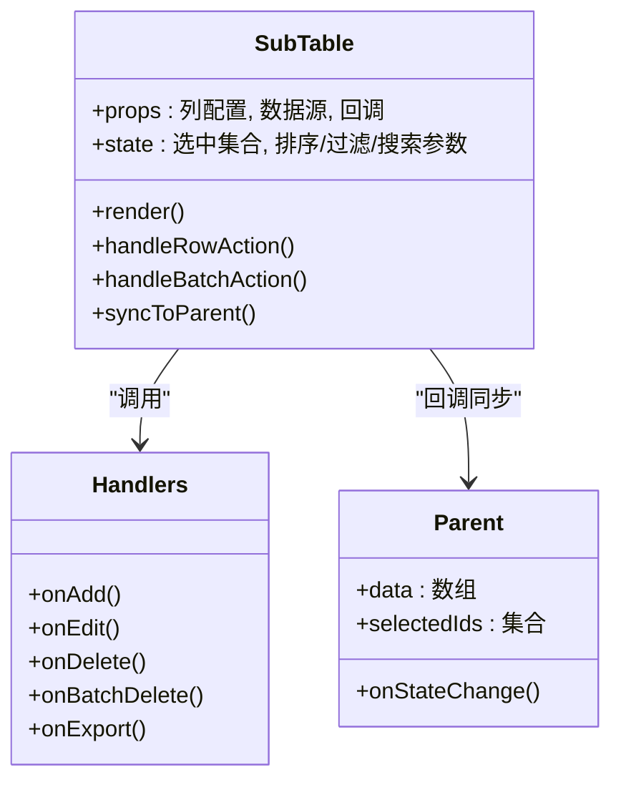
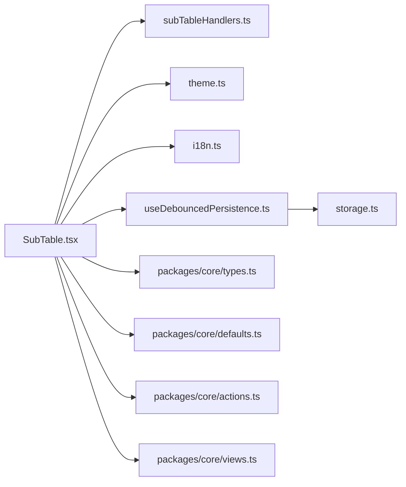

# 子表格组件

<cite>
**本文引用的文件**   
- [SubTable.tsx](file://apps/desktop/src/SubTable.tsx)
- [subTableHandlers.ts](file://apps/desktop/src/subTableHandlers.ts)
- [SubscriptionFormModal.tsx](file://apps/desktop/src/SubscriptionFormModal.tsx)
- [BillsView.tsx](file://apps/desktop/src/BillsView.tsx)
- [PendingView.tsx](file://apps/desktop/src/PendingView.tsx)
- [Dashboard.tsx](file://apps/desktop/src/Dashboard.tsx)
- [i18n.ts](file://apps/desktop/src/i18n.ts)
- [theme.ts](file://apps/desktop/src/theme.ts)
- [useDebouncedPersistence.ts](file://apps/desktop/src/useDebouncedPersistence.ts)
- [storage.ts](file://apps/desktop/src/storage.ts)
- [defaults.ts](file://packages/core/src/defaults.ts)
- [types.ts](file://packages/core/src/types.ts)
- [actions.ts](file://packages/core/src/actions.ts)
- [views.ts](file://packages/core/src/views.ts)
</cite>

## 目录
1. [简介](#简介)
2. [项目结构](#项目结构)
3. [核心组件](#核心组件)
4. [架构总览](#架构总览)
5. [详细组件分析](#详细组件分析)
6. [依赖关系分析](#依赖关系分析)
7. [性能考虑](#性能考虑)
8. [故障排查指南](#故障排查指南)
9. [结论](#结论)
10. [附录](#附录)

## 简介
本文件面向 SubTable（子表格）组件，系统性阐述其在数据展示、行操作与事件处理方面的实现机制。文档覆盖列配置、动态渲染与样式定制；行选择、批量操作与上下文菜单；排序、过滤与搜索的实现细节；以及懒加载、内存管理等性能优化策略。同时说明与父组件的数据同步与状态管理策略，帮助开发者快速集成并高效使用。

## 项目结构
SubTable 位于桌面应用前端模块中，作为订阅管理与账单视图的核心表格能力提供者。其职责包括：
- 接收来自父组件的列定义与数据源
- 提供行选择、批量操作、上下文菜单等交互
- 支持排序、过滤、搜索与分页/懒加载
- 通过受控或半受控模式与父组件进行数据同步

图表来源
- [Dashboard.tsx](file://apps/desktop/src/Dashboard.tsx)
- [BillsView.tsx](file://apps/desktop/src/BillsView.tsx)
- [PendingView.tsx](file://apps/desktop/src/PendingView.tsx)
- [SubTable.tsx](file://apps/desktop/src/SubTable.tsx)
- [subTableHandlers.ts](file://apps/desktop/src/subTableHandlers.ts)
- [theme.ts](file://apps/desktop/src/theme.ts)
- [i18n.ts](file://apps/desktop/src/i18n.ts)
- [useDebouncedPersistence.ts](file://apps/desktop/src/useDebouncedPersistence.ts)
- [storage.ts](file://apps/desktop/src/storage.ts)

章节来源
- [SubTable.tsx](file://apps/desktop/src/SubTable.tsx)
- [subTableHandlers.ts](file://apps/desktop/src/subTableHandlers.ts)
- [BillsView.tsx](file://apps/desktop/src/BillsView.tsx)
- [PendingView.tsx](file://apps/desktop/src/PendingView.tsx)
- [Dashboard.tsx](file://apps/desktop/src/Dashboard.tsx)

## 核心组件
- SubTable：负责表格渲染、列配置解析、行选择与批量操作、上下文菜单、排序/过滤/搜索、分页/懒加载、样式定制与国际化。
- subTableHandlers：封装与表格相关的业务事件处理器（如新增、编辑、删除、批量操作），供 SubTable 调用以解耦 UI 与业务逻辑。
- 父组件（Dashboard、BillsView、PendingView）：提供数据源、列定义与回调，控制表格的状态同步与行为。

章节来源
- [SubTable.tsx](file://apps/desktop/src/SubTable.tsx)
- [subTableHandlers.ts](file://apps/desktop/src/subTableHandlers.ts)
- [BillsView.tsx](file://apps/desktop/src/BillsView.tsx)
- [PendingView.tsx](file://apps/desktop/src/PendingView.tsx)
- [Dashboard.tsx](file://apps/desktop/src/Dashboard.tsx)

## 架构总览
SubTable 采用“配置驱动 + 事件驱动”的架构：
- 配置驱动：通过列定义（列键、标题、渲染器、排序/过滤开关）、行渲染函数、工具栏按钮等配置项驱动 UI 生成。
- 事件驱动：行点击、选择、批量操作、上下文菜单触发后，由 handlers 统一处理，再回写至父组件状态。

图表来源
- [SubTable.tsx](file://apps/desktop/src/SubTable.tsx)
- [subTableHandlers.ts](file://apps/desktop/src/subTableHandlers.ts)
- [useDebouncedPersistence.ts](file://apps/desktop/src/useDebouncedPersistence.ts)
- [storage.ts](file://apps/desktop/src/storage.ts)

## 详细组件分析

### 列配置与动态渲染
- 列配置项通常包含：列键、显示标题、是否可排序/可过滤、单元格渲染函数、宽度、对齐方式、格式化器等。
- 动态渲染：根据数据类型与列配置决定渲染器（文本、金额、日期、标签、操作按钮等）。
- 扩展点：允许在列级注入自定义渲染器或操作按钮，满足复杂场景。

图表来源
- [SubTable.tsx](file://apps/desktop/src/SubTable.tsx)
- [defaults.ts](file://packages/core/src/defaults.ts)
- [types.ts](file://packages/core/src/types.ts)

章节来源
- [SubTable.tsx](file://apps/desktop/src/SubTable.tsx)
- [defaults.ts](file://packages/core/src/defaults.ts)
- [types.ts](file://packages/core/src/types.ts)

### 行选择与批量操作
- 行选择：支持单选/多选，选中状态与数据源解耦，避免频繁重渲染。
- 批量操作：基于选中集合执行批量删除、批量修改属性、导出等。
- 上下文菜单：右键行或选中区域弹出菜单，提供常用操作入口。

图表来源
- [SubTable.tsx](file://apps/desktop/src/SubTable.tsx)
- [subTableHandlers.ts](file://apps/desktop/src/subTableHandlers.ts)

章节来源
- [SubTable.tsx](file://apps/desktop/src/SubTable.tsx)
- [subTableHandlers.ts](file://apps/desktop/src/subTableHandlers.ts)

### 排序、过滤与搜索
- 排序：支持单列/多列排序，按数值、字符串、日期等类型比较。
- 过滤：列级过滤（范围、包含、等于）与全局搜索（跨列匹配）。
- 性能：对大数据集采用虚拟滚动或分页，结合去抖输入提升体验。

图表来源
- [SubTable.tsx](file://apps/desktop/src/SubTable.tsx)
- [useDebouncedPersistence.ts](file://apps/desktop/src/useDebouncedPersistence.ts)

章节来源
- [SubTable.tsx](file://apps/desktop/src/SubTable.tsx)
- [useDebouncedPersistence.ts](file://apps/desktop/src/useDebouncedPersistence.ts)

### 样式定制与国际化
- 样式定制：通过主题系统（颜色、间距、字体）与列级样式钩子实现。
- 国际化：所有文案通过 i18n 资源加载，支持切换语言。

章节来源
- [theme.ts](file://apps/desktop/src/theme.ts)
- [i18n.ts](file://apps/desktop/src/i18n.ts)
- [SubTable.tsx](file://apps/desktop/src/SubTable.tsx)

### 与父组件的数据同步与状态管理
- 受控模式：父组件持有数据与选中态，SubTable 仅通过回调上报变更。
- 半受控模式：SubTable 内部维护临时状态，定期通过防抖持久化与父组件同步。
- 事件契约：定义统一的 onStateChange、onRowAction、onBatchAction 等回调接口。

图表来源
- [SubTable.tsx](file://apps/desktop/src/SubTable.tsx)
- [subTableHandlers.ts](file://apps/desktop/src/subTableHandlers.ts)
- [BillsView.tsx](file://apps/desktop/src/BillsView.tsx)
- [PendingView.tsx](file://apps/desktop/src/PendingView.tsx)
- [Dashboard.tsx](file://apps/desktop/src/Dashboard.tsx)

章节来源
- [SubTable.tsx](file://apps/desktop/src/SubTable.tsx)
- [subTableHandlers.ts](file://apps/desktop/src/subTableHandlers.ts)
- [BillsView.tsx](file://apps/desktop/src/BillsView.tsx)
- [PendingView.tsx](file://apps/desktop/src/PendingView.tsx)
- [Dashboard.tsx](file://apps/desktop/src/Dashboard.tsx)

## 依赖关系分析
- 组件内依赖：SubTable 依赖 handlers、主题、国际化、防抖持久化与存储。
- 外部依赖：core 包提供默认值、类型定义、动作与视图工具。

图表来源
- [SubTable.tsx](file://apps/desktop/src/SubTable.tsx)
- [subTableHandlers.ts](file://apps/desktop/src/subTableHandlers.ts)
- [theme.ts](file://apps/desktop/src/theme.ts)
- [i18n.ts](file://apps/desktop/src/i18n.ts)
- [useDebouncedPersistence.ts](file://apps/desktop/src/useDebouncedPersistence.ts)
- [storage.ts](file://apps/desktop/src/storage.ts)
- [types.ts](file://packages/core/src/types.ts)
- [defaults.ts](file://packages/core/src/defaults.ts)
- [actions.ts](file://packages/core/src/actions.ts)
- [views.ts](file://packages/core/src/views.ts)

章节来源
- [SubTable.tsx](file://apps/desktop/src/SubTable.tsx)
- [subTableHandlers.ts](file://apps/desktop/src/subTableHandlers.ts)
- [theme.ts](file://apps/desktop/src/theme.ts)
- [i18n.ts](file://apps/desktop/src/i18n.ts)
- [useDebouncedPersistence.ts](file://apps/desktop/src/useDebouncedPersistence.ts)
- [storage.ts](file://apps/desktop/src/storage.ts)
- [types.ts](file://packages/core/src/types.ts)
- [defaults.ts](file://packages/core/src/defaults.ts)
- [actions.ts](file://packages/core/src/actions.ts)
- [views.ts](file://packages/core/src/views.ts)

## 性能考虑
- 虚拟滚动/分页：仅渲染可视区域行，降低 DOM 节点数量。
- 去抖输入：搜索与过滤输入使用防抖，减少重复计算。
- 不可变更新：使用不可变数据结构与选择性更新，避免全量重渲染。
- 缓存与索引：对排序/过滤结果建立索引，加速查询。
- 懒加载：按需加载列渲染器与扩展模块，减小初始包体积。
- 内存管理：及时释放选中集合、缓存与监听器，防止泄漏。

[本节为通用指导，不直接分析具体文件]

## 故障排查指南
- 列渲染异常：检查列配置键名与数据类型是否匹配，确认渲染器是否存在。
- 排序/过滤无效：确认字段类型与比较器设置，检查过滤表达式语法。
- 批量操作无响应：核对 handlers 是否正确绑定与权限校验。
- 状态不同步：检查 onStateChange 回调是否被父组件正确消费。
- 性能卡顿：开启性能面板定位重渲染热点，启用虚拟滚动与去抖。

章节来源
- [SubTable.tsx](file://apps/desktop/src/SubTable.tsx)
- [subTableHandlers.ts](file://apps/desktop/src/subTableHandlers.ts)
- [useDebouncedPersistence.ts](file://apps/desktop/src/useDebouncedPersistence.ts)

## 结论
SubTable 通过配置驱动与事件驱动的架构，提供了灵活的列渲染、丰富的行操作与强大的排序/过滤/搜索能力。配合主题与国际化，可满足多样化业务需求。借助虚拟滚动、去抖与不可变更新等优化手段，可在大数据场景下保持流畅体验。与父组件的清晰契约确保状态同步稳定可靠。

[本节为总结性内容，不直接分析具体文件]

## 附录
- 最佳实践
  - 将列配置与数据模型分离，便于复用与维护。
  - 使用受控模式保证状态一致性，必要时引入半受控模式提升交互性能。
  - 对复杂列渲染进行懒加载与缓存。
  - 为批量操作提供撤销/恢复能力，提升用户体验。
- 常见问题
  - 大数据量导致卡顿：优先启用虚拟滚动与分页。
  - 国际化缺失：确保所有文案通过 i18n 资源加载。
  - 状态丢失：检查持久化与同步逻辑是否完整。

[本节为补充信息，不直接分析具体文件]