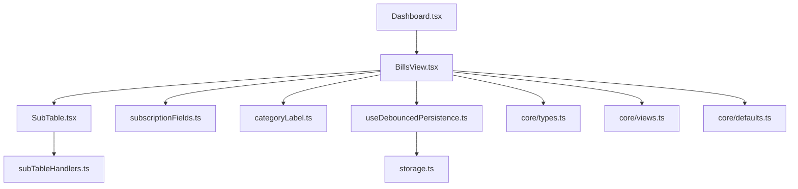
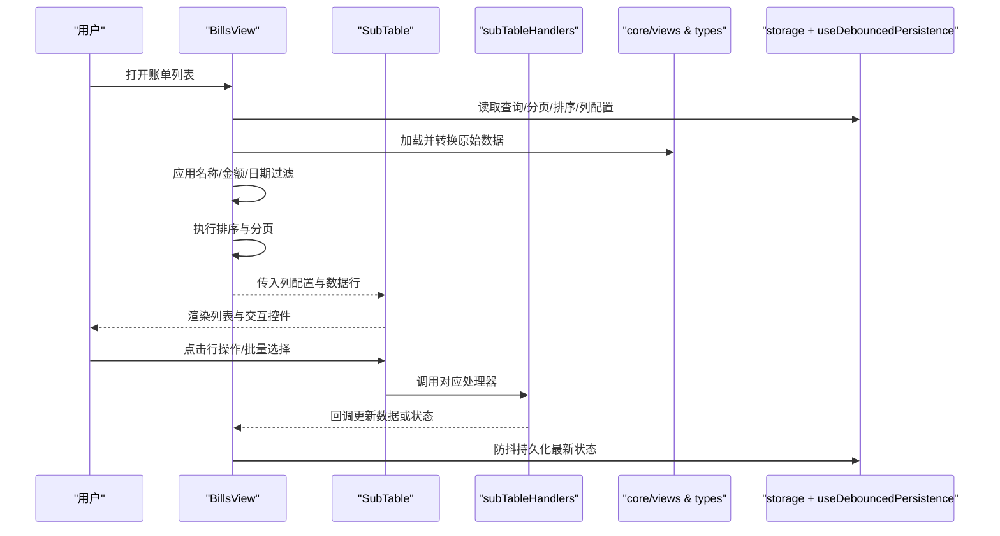
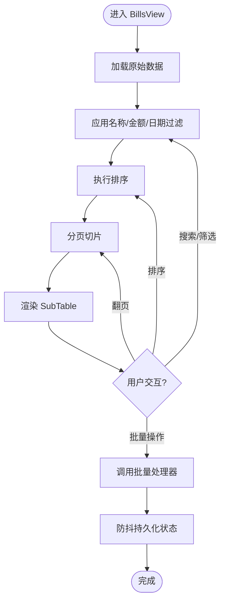
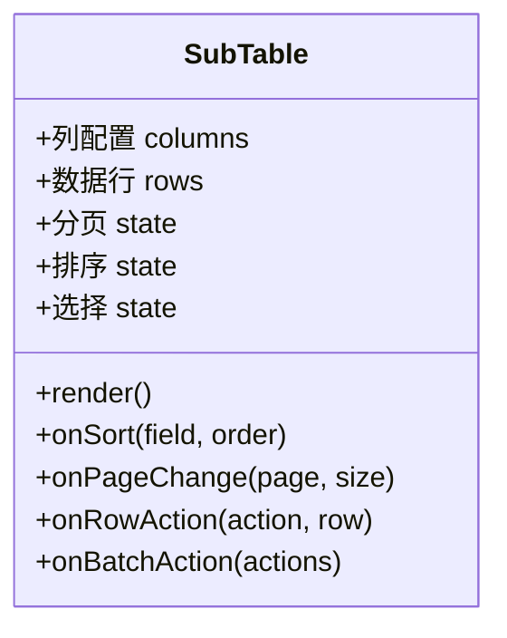
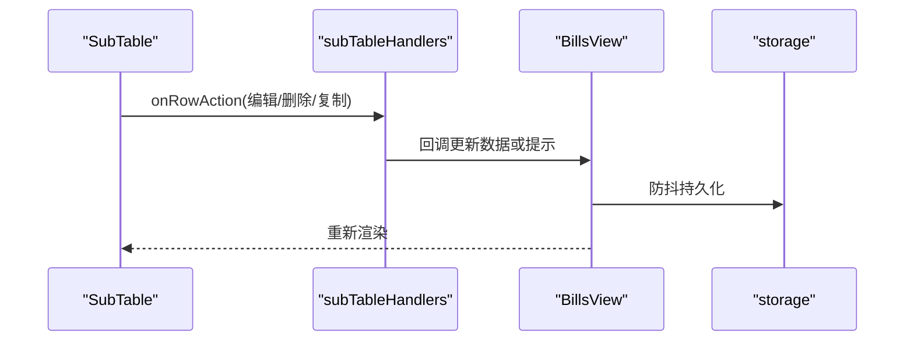
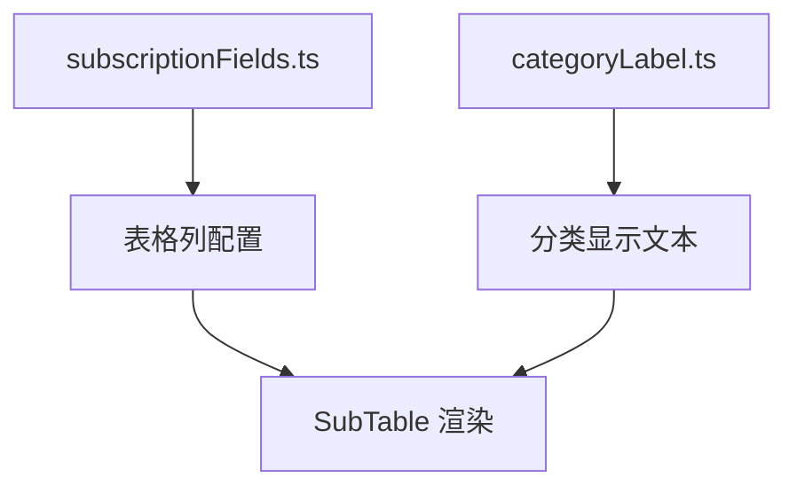
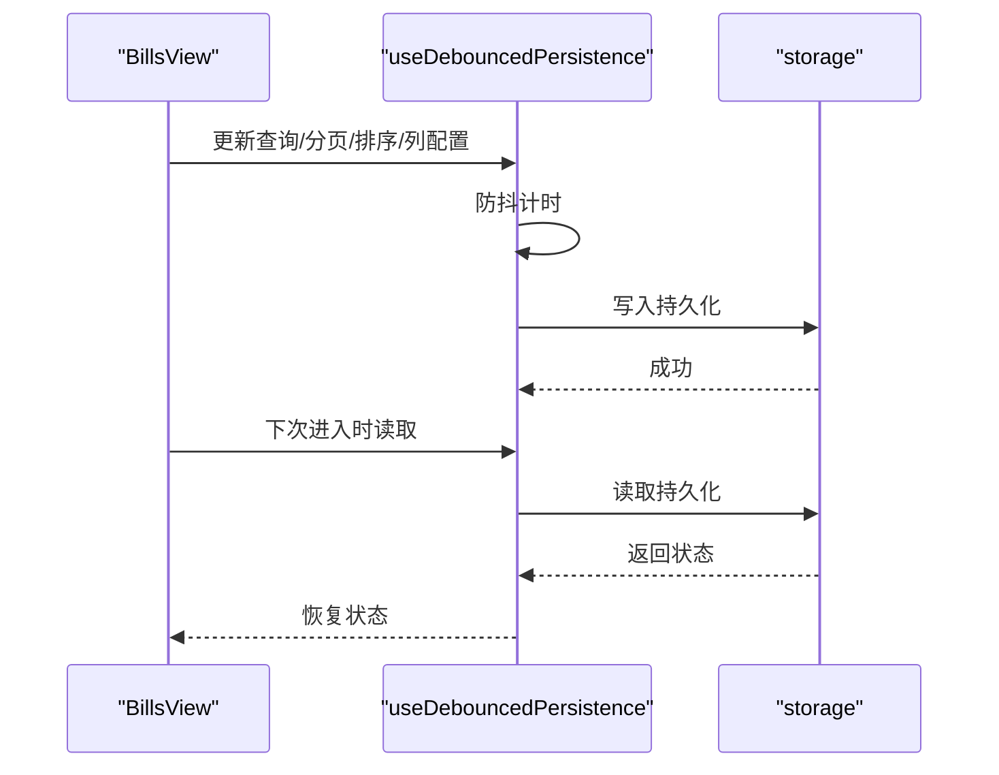
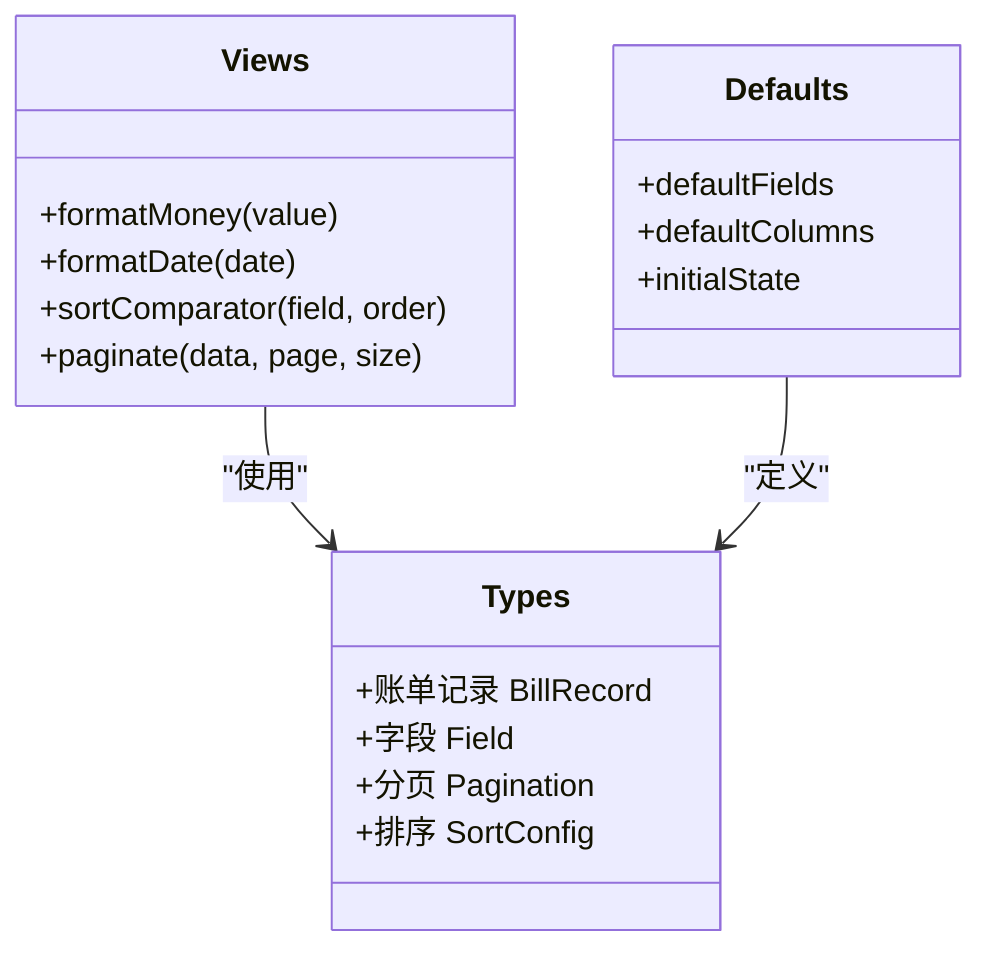
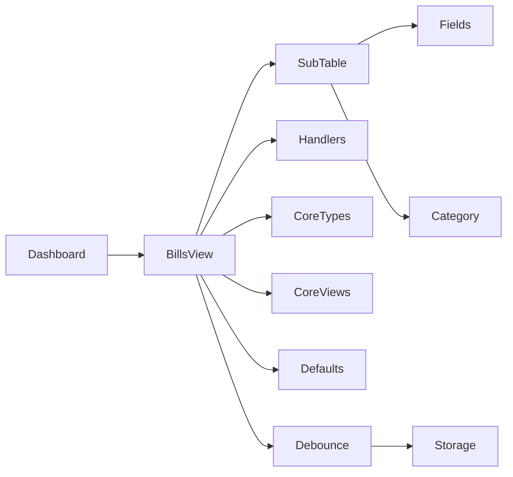

# 账单列表视图

<cite>
**本文引用的文件**   
- [BillsView.tsx](file://apps/desktop/src/BillsView.tsx)
- [SubTable.tsx](file://apps/desktop/src/SubTable.tsx)
- [subTableHandlers.ts](file://apps/desktop/src/subTableHandlers.ts)
- [subscriptionFields.ts](file://apps/desktop/src/subscriptionFields.ts)
- [categoryLabel.ts](file://apps/desktop/src/categoryLabel.ts)
- [useDebouncedPersistence.ts](file://apps/desktop/src/useDebouncedPersistence.ts)
- [storage.ts](file://apps/desktop/src/storage.ts)
- [Dashboard.tsx](file://apps/desktop/src/Dashboard.tsx)
- [types.ts](file://packages/core/src/types.ts)
- [views.ts](file://packages/core/src/views.ts)
- [defaults.ts](file://packages/core/src/defaults.ts)
</cite>

## 目录
1. [简介](#简介)
2. [项目结构](#项目结构)
3. [核心组件](#核心组件)
4. [架构总览](#架构总览)
5. [详细组件分析](#详细组件分析)
6. [依赖关系分析](#依赖关系分析)
7. [性能考量](#性能考量)
8. [故障排查指南](#故障排查指南)
9. [结论](#结论)
10. [附录](#附录)

## 简介
本文件为“账单列表视图”（BillsView）组件的完整技术文档，聚焦于账单数据列表的展示逻辑、搜索过滤、分页与排序、批量操作、性能优化（虚拟滚动与缓存）、自定义列配置与导出能力。文档面向开发者与维护者，兼顾非技术读者可理解性，提供架构图、流程图与关键实现路径引用，帮助快速定位问题与扩展功能。

## 项目结构
- 桌面端应用位于 apps/desktop/src，其中 BillsView.tsx 是账单列表的主视图组件。
- 表格渲染与交互由 SubTable.tsx 提供，子表处理器 subTableHandlers.ts 封装了行级操作（如编辑、删除、批量选择等）。
- 字段定义与校验在 subscriptionFields.ts 中集中管理，分类标签映射在 categoryLabel.ts。
- 持久化与防抖策略通过 useDebouncedPersistence.ts 和 storage.ts 实现。
- 核心类型与视图工具来自 packages/core：types.ts 定义数据结构，views.ts 提供视图相关工具，defaults.ts 提供默认值。

**图表来源** 
- [Dashboard.tsx](file://apps/desktop/src/Dashboard.tsx)
- [BillsView.tsx](file://apps/desktop/src/BillsView.tsx)
- [SubTable.tsx](file://apps/desktop/src/SubTable.tsx)
- [subTableHandlers.ts](file://apps/desktop/src/subTableHandlers.ts)
- [subscriptionFields.ts](file://apps/desktop/src/subscriptionFields.ts)
- [categoryLabel.ts](file://apps/desktop/src/categoryLabel.ts)
- [useDebouncedPersistence.ts](file://apps/desktop/src/useDebouncedPersistence.ts)
- [storage.ts](file://apps/desktop/src/storage.ts)
- [types.ts](file://packages/core/src/types.ts)
- [views.ts](file://packages/core/src/views.ts)
- [defaults.ts](file://packages/core/src/defaults.ts)

**章节来源**
- [BillsView.tsx](file://apps/desktop/src/BillsView.tsx)
- [SubTable.tsx](file://apps/desktop/src/SubTable.tsx)
- [subTableHandlers.ts](file://apps/desktop/src/subTableHandlers.ts)
- [subscriptionFields.ts](file://apps/desktop/src/subscriptionFields.ts)
- [categoryLabel.ts](file://apps/desktop/src/categoryLabel.ts)
- [useDebouncedPersistence.ts](file://apps/desktop/src/useDebouncedPersistence.ts)
- [storage.ts](file://apps/desktop/src/storage.ts)
- [Dashboard.tsx](file://apps/desktop/src/Dashboard.tsx)
- [types.ts](file://packages/core/src/types.ts)
- [views.ts](file://packages/core/src/views.ts)
- [defaults.ts](file://packages/core/src/defaults.ts)

## 核心组件
- BillsView：账单列表主视图，负责数据获取、状态管理、搜索过滤、分页与排序、批量操作入口、导出触发以及将处理后的数据传递给 SubTable 进行渲染。
- SubTable：通用表格组件，支持列定义、行渲染、选择、展开/折叠、分页控件、排序与筛选 UI。
- subTableHandlers：行级操作处理器，包含新增、编辑、删除、复制、批量选择与批量动作回调。
- subscriptionFields：字段元数据（名称、金额、日期、类别、备注等），用于表单与表格列配置。
- categoryLabel：分类到显示文本的映射，保证列表与表单中的分类一致性。
- useDebouncedPersistence：对查询条件、分页、排序等状态进行防抖持久化，避免频繁写入存储。
- storage：本地存储读写封装，确保跨会话保留用户偏好。
- core/types 与 core/views：统一的数据模型与视图工具函数（如格式化、排序比较器、分页计算等）。
- core/defaults：默认字段、默认视图配置与初始状态。

**章节来源**
- [BillsView.tsx](file://apps/desktop/src/BillsView.tsx)
- [SubTable.tsx](file://apps/desktop/src/SubTable.tsx)
- [subTableHandlers.ts](file://apps/desktop/src/subTableHandlers.ts)
- [subscriptionFields.ts](file://apps/desktop/src/subscriptionFields.ts)
- [categoryLabel.ts](file://apps/desktop/src/categoryLabel.ts)
- [useDebouncedPersistence.ts](file://apps/desktop/src/useDebouncedPersistence.ts)
- [storage.ts](file://apps/desktop/src/storage.ts)
- [types.ts](file://packages/core/src/types.ts)
- [views.ts](file://packages/core/src/views.ts)
- [defaults.ts](file://packages/core/src/defaults.ts)

## 架构总览
BillsView 作为上层视图，聚合数据源、过滤与排序逻辑，并将结果交给 SubTable 渲染。SubTable 仅关注 UI 表现与交互事件，具体业务逻辑下沉至 handlers 与 core 工具。状态通过 useDebouncedPersistence 与 storage 持久化，确保刷新后仍保持用户设置。

**图表来源** 
- [BillsView.tsx](file://apps/desktop/src/BillsView.tsx)
- [SubTable.tsx](file://apps/desktop/src/SubTable.tsx)
- [subTableHandlers.ts](file://apps/desktop/src/subTableHandlers.ts)
- [types.ts](file://packages/core/src/types.ts)
- [views.ts](file://packages/core/src/views.ts)
- [useDebouncedPersistence.ts](file://apps/desktop/src/useDebouncedPersistence.ts)
- [storage.ts](file://apps/desktop/src/storage.ts)

## 详细组件分析

### BillsView 组件
- 数据获取与转换：从数据源加载账单记录，使用 core 工具进行类型转换与格式化。
- 搜索过滤：支持按名称（模糊匹配）、金额（范围或精确）、日期（区间）等多条件组合过滤。
- 排序：支持按金额、日期、名称等字段升/降序排列。
- 分页：维护当前页码与每页条数，结合过滤与排序结果进行切片。
- 批量操作：提供全选/反选、批量删除、批量导出等入口，回调交由 handlers 处理。
- 导出：基于当前过滤结果生成 CSV/Excel（取决于实现），支持列选择与格式控制。
- 状态持久化：查询条件、分页、排序、列可见性与宽度通过 useDebouncedPersistence 与 storage 持久化。

**图表来源** 
- [BillsView.tsx](file://apps/desktop/src/BillsView.tsx)
- [useDebouncedPersistence.ts](file://apps/desktop/src/useDebouncedPersistence.ts)
- [storage.ts](file://apps/desktop/src/storage.ts)

**章节来源**
- [BillsView.tsx](file://apps/desktop/src/BillsView.tsx)
- [useDebouncedPersistence.ts](file://apps/desktop/src/useDebouncedPersistence.ts)
- [storage.ts](file://apps/desktop/src/storage.ts)

### SubTable 组件
- 列配置：接收字段元数据与自定义列定义，支持列显隐、宽度、对齐、格式化。
- 行渲染：根据字段类型渲染文本、金额、日期、分类标签等。
- 交互：行选择、展开详情、排序点击、分页控件、搜索框集成。
- 事件回调：将行操作事件上报给 handlers，统一处理业务逻辑。

**图表来源** 
- [SubTable.tsx](file://apps/desktop/src/SubTable.tsx)

**章节来源**
- [SubTable.tsx](file://apps/desktop/src/SubTable.tsx)

### subTableHandlers 处理器
- 行操作：新增、编辑、删除、复制、查看详情等。
- 批量操作：批量删除、批量导出、批量标记等。
- 回调机制：与 BillsView 的状态更新联动，触发数据刷新与持久化。

**图表来源** 
- [subTableHandlers.ts](file://apps/desktop/src/subTableHandlers.ts)
- [BillsView.tsx](file://apps/desktop/src/BillsView.tsx)
- [storage.ts](file://apps/desktop/src/storage.ts)

**章节来源**
- [subTableHandlers.ts](file://apps/desktop/src/subTableHandlers.ts)
- [BillsView.tsx](file://apps/desktop/src/BillsView.tsx)
- [storage.ts](file://apps/desktop/src/storage.ts)

### 字段与分类
- subscriptionFields：定义账单字段（名称、金额、日期、类别、备注等），包括验证规则与默认值。
- categoryLabel：分类键到显示文本的映射，确保列表与表单一致。

**图表来源** 
- [subscriptionFields.ts](file://apps/desktop/src/subscriptionFields.ts)
- [categoryLabel.ts](file://apps/desktop/src/categoryLabel.ts)
- [SubTable.tsx](file://apps/desktop/src/SubTable.tsx)

**章节来源**
- [subscriptionFields.ts](file://apps/desktop/src/subscriptionFields.ts)
- [categoryLabel.ts](file://apps/desktop/src/categoryLabel.ts)

### 状态持久化与存储
- useDebouncedPersistence：对查询条件、分页、排序、列配置等进行防抖持久化，减少 I/O 压力。
- storage：本地存储读写封装，提供键值存取与序列化/反序列化。

**图表来源** 
- [useDebouncedPersistence.ts](file://apps/desktop/src/useDebouncedPersistence.ts)
- [storage.ts](file://apps/desktop/src/storage.ts)
- [BillsView.tsx](file://apps/desktop/src/BillsView.tsx)

**章节来源**
- [useDebouncedPersistence.ts](file://apps/desktop/src/useDebouncedPersistence.ts)
- [storage.ts](file://apps/desktop/src/storage.ts)
- [BillsView.tsx](file://apps/desktop/src/BillsView.tsx)

### 核心类型与视图工具
- types：账单记录、字段、分页、排序等数据结构定义。
- views：视图工具函数，如金额格式化、日期格式化、排序比较器、分页计算等。
- defaults：默认字段、默认视图配置与初始状态。

**图表来源** 
- [types.ts](file://packages/core/src/types.ts)
- [views.ts](file://packages/core/src/views.ts)
- [defaults.ts](file://packages/core/src/defaults.ts)

**章节来源**
- [types.ts](file://packages/core/src/types.ts)
- [views.ts](file://packages/core/src/views.ts)
- [defaults.ts](file://packages/core/src/defaults.ts)

## 依赖关系分析
- BillsView 依赖 SubTable 进行渲染，依赖 handlers 处理交互，依赖 core 工具进行数据转换与视图计算。
- SubTable 依赖字段与分类映射以正确渲染列内容。
- useDebouncedPersistence 与 storage 贯穿状态持久化链路，降低 I/O 频率。
- Dashboard 作为入口页面，导航到 BillsView。

**图表来源** 
- [Dashboard.tsx](file://apps/desktop/src/Dashboard.tsx)
- [BillsView.tsx](file://apps/desktop/src/BillsView.tsx)
- [SubTable.tsx](file://apps/desktop/src/SubTable.tsx)
- [subTableHandlers.ts](file://apps/desktop/src/subTableHandlers.ts)
- [subscriptionFields.ts](file://apps/desktop/src/subscriptionFields.ts)
- [categoryLabel.ts](file://apps/desktop/src/categoryLabel.ts)
- [useDebouncedPersistence.ts](file://apps/desktop/src/useDebouncedPersistence.ts)
- [storage.ts](file://apps/desktop/src/storage.ts)
- [types.ts](file://packages/core/src/types.ts)
- [views.ts](file://packages/core/src/views.ts)
- [defaults.ts](file://packages/core/src/defaults.ts)

**章节来源**
- [Dashboard.tsx](file://apps/desktop/src/Dashboard.tsx)
- [BillsView.tsx](file://apps/desktop/src/BillsView.tsx)
- [SubTable.tsx](file://apps/desktop/src/SubTable.tsx)
- [subTableHandlers.ts](file://apps/desktop/src/subTableHandlers.ts)
- [subscriptionFields.ts](file://apps/desktop/src/subscriptionFields.ts)
- [categoryLabel.ts](file://apps/desktop/src/categoryLabel.ts)
- [useDebouncedPersistence.ts](file://apps/desktop/src/useDebouncedPersistence.ts)
- [storage.ts](file://apps/desktop/src/storage.ts)
- [types.ts](file://packages/core/src/types.ts)
- [views.ts](file://packages/core/src/views.ts)
- [defaults.ts](file://packages/core/src/defaults.ts)

## 性能考量
- 虚拟滚动：当数据量较大时，建议启用虚拟滚动以减少 DOM 节点数量，提升渲染性能。可在 SubTable 中集成虚拟列表库（如 react-window），仅渲染可视区域行。
- 数据缓存：对已过滤与排序的结果进行内存缓存，避免重复计算；结合防抖持久化，减少 I/O 开销。
- 懒加载与分页：合理设置每页条数，避免一次性渲染过多数据；结合后端分页接口时优先服务端分页。
- 去重与索引：对高频搜索字段建立索引或哈希映射，加速名称与日期区间匹配。
- 渲染优化：使用 React.memo 包裹行组件，避免不必要的重渲染；金额与日期格式化结果缓存。

[本节为通用性能指导，不直接分析具体文件]

## 故障排查指南
- 搜索无结果：检查过滤条件是否过严（如日期区间为空、金额范围不合理）；确认名称模糊匹配是否区分大小写。
- 排序异常：确认排序字段类型（数值/字符串/日期）与比较器实现；检查空值处理逻辑。
- 分页错位：核对分页参数（page、size）与数据长度；确保过滤与排序在分页前执行。
- 批量操作失败：检查 handlers 回调是否正确更新状态；确认权限与数据完整性校验。
- 导出为空：确认导出列配置与数据源是否一致；检查文件格式化逻辑。
- 状态未持久化：检查 useDebouncedPersistence 防抖时间是否过长；确认 storage 写入权限与键名冲突。

**章节来源**
- [subTableHandlers.ts](file://apps/desktop/src/subTableHandlers.ts)
- [useDebouncedPersistence.ts](file://apps/desktop/src/useDebouncedPersistence.ts)
- [storage.ts](file://apps/desktop/src/storage.ts)
- [views.ts](file://packages/core/src/views.ts)

## 结论
BillsView 组件通过清晰的职责划分与模块化设计，实现了账单列表的高效展示与交互。结合 SubTable、handlers、core 工具与持久化机制，提供了完整的搜索过滤、排序分页、批量操作与导出能力。建议在大数据量场景下引入虚拟滚动与缓存策略，进一步提升性能与用户体验。

[本节为总结性内容，不直接分析具体文件]

## 附录
- 自定义列配置：通过 subscriptionFields 定义字段元数据，并在 BillsView 中映射为列配置；支持列显隐、宽度、对齐、格式化。
- 导出功能：基于当前过滤结果生成文件，支持选择列与格式（CSV/Excel）；导出前可进行数据清洗与格式化。
- 最佳实践：保持字段定义与列配置一致；对敏感数据进行脱敏；导出文件命名包含时间戳与过滤摘要。

[本节为补充说明，不直接分析具体文件]