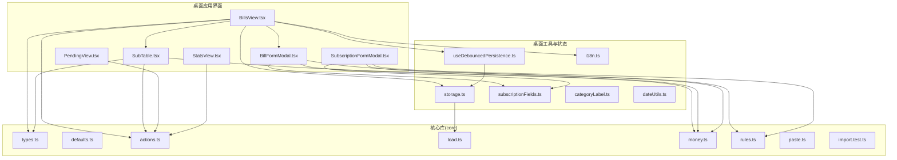
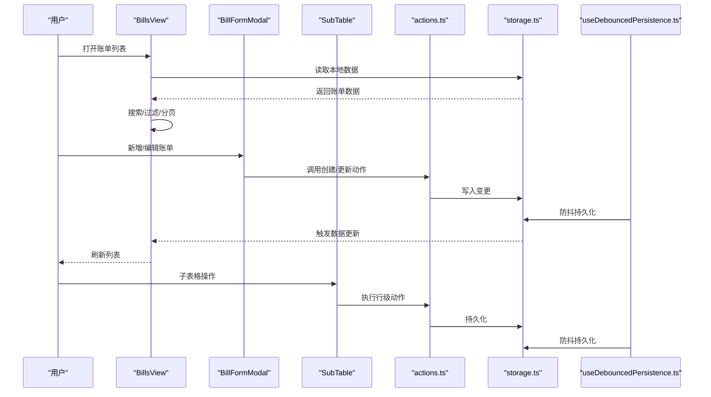
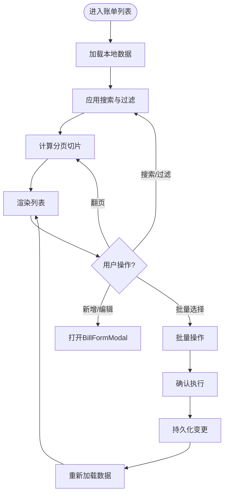
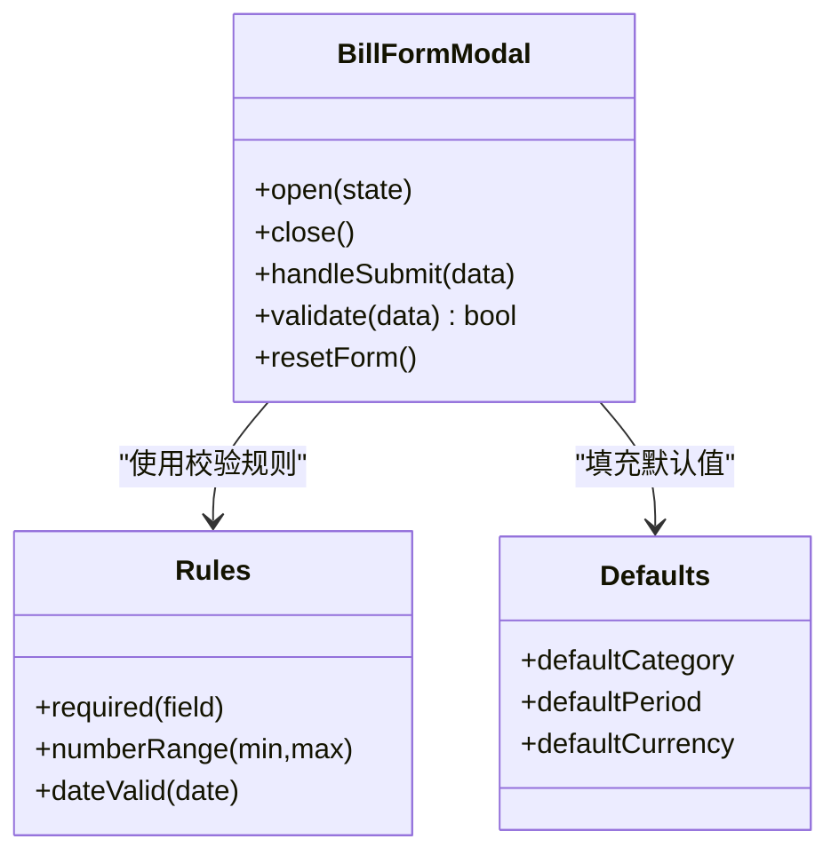
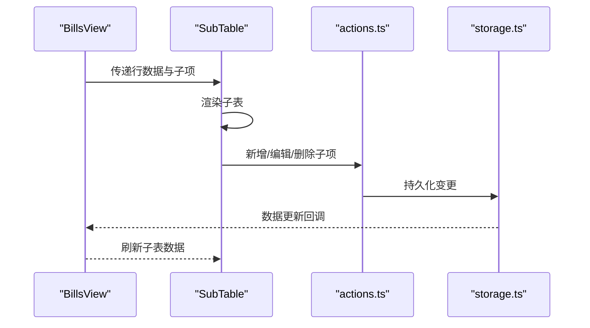
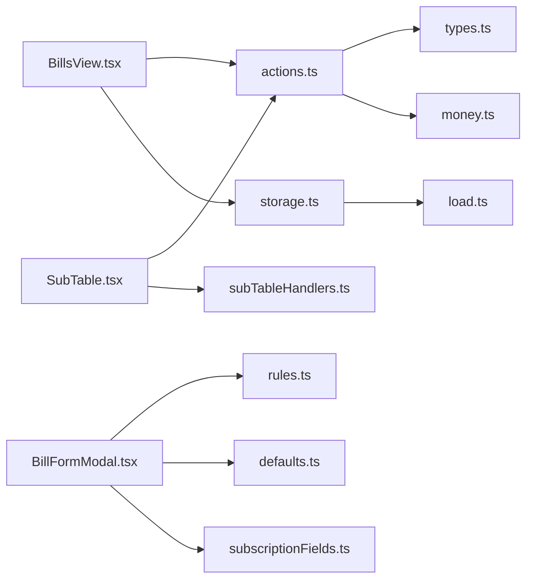

# 账单管理

<cite>
**本文引用的文件**   
- [BillsView.tsx](file://apps/desktop/src/BillsView.tsx)
- [BillFormModal.tsx](file://apps/desktop/src/BillFormModal.tsx)
- [SubTable.tsx](file://apps/desktop/src/SubTable.tsx)
- [subTableHandlers.ts](file://apps/desktop/src/subTableHandlers.ts)
- [SubscriptionFormModal.tsx](file://apps/desktop/src/SubscriptionFormModal.tsx)
- [PendingView.tsx](file://apps/desktop/src/PendingView.tsx)
- [StatsView.tsx](file://apps/desktop/src/StatsView.tsx)
- [storage.ts](file://apps/desktop/src/storage.ts)
- [useDebouncedPersistence.ts](file://apps/desktop/src/useDebouncedPersistence.ts)
- [i18n.ts](file://apps/desktop/src/i18n.ts)
- [defaults.ts](file://packages/core/src/defaults.ts)
- [types.ts](file://packages/core/src/types.ts)
- [actions.ts](file://packages/core/src/actions.ts)
- [load.ts](file://packages/core/src/load.ts)
- [money.ts](file://packages/core/src/money.ts)
- [rules.ts](file://packages/core/src/rules.ts)
- [paste.ts](file://packages/core/src/paste.ts)
- [import.test.ts](file://packages/core/src/import.test.ts)
- [subscriptionFields.ts](file://apps/desktop/src/subscriptionFields.ts)
- [categoryLabel.ts](file://apps/desktop/src/categoryLabel.ts)
- [dateUtils.ts](file://apps/desktop/src/utils/dateUtils.ts)
</cite>

## 目录
1. [简介](#简介)
2. [项目结构](#项目结构)
3. [核心组件](#核心组件)
4. [架构总览](#架构总览)
5. [详细组件分析](#详细组件分析)
6. [依赖关系分析](#依赖关系分析)
7. [性能考虑](#性能考虑)
8. [故障排查指南](#故障排查指南)
9. [结论](#结论)
10. [附录](#附录)

## 简介
本文件面向“账单管理”模块，聚焦以下目标：
- 全面说明 BillsView 组件的数据列表展示、搜索过滤与分页能力。
- 详细说明 BillFormModal 表单模态框的创建、编辑与校验逻辑。
- 解释 SubTable 子表格的实现、数据绑定与操作处理。
- 覆盖 CRUD 完整流程、错误处理与用户体验优化。
- 提供数据导入导出与批量操作指南。

该模块基于桌面端应用（Tauri + React），使用 packages/core 提供的类型、规则、金额工具与导入导出能力，结合本地持久化实现离线可用与快速交互体验。

## 项目结构
账单管理相关代码主要位于 apps/desktop/src 与 packages/core/src：
- UI 层：BillsView、BillFormModal、SubTable、SubscriptionFormModal、PendingView、StatsView 等视图与模态框。
- 业务逻辑与工具：storage、useDebouncedPersistence、i18n、subscriptionFields、categoryLabel、dateUtils。
- 核心库：types、defaults、actions、load、money、rules、paste、import.test 等。

图表来源 
- [BillsView.tsx](file://apps/desktop/src/BillsView.tsx)
- [BillFormModal.tsx](file://apps/desktop/src/BillFormModal.tsx)
- [SubTable.tsx](file://apps/desktop/src/SubTable.tsx)
- [storage.ts](file://apps/desktop/src/storage.ts)
- [useDebouncedPersistence.ts](file://apps/desktop/src/useDebouncedPersistence.ts)
- [i18n.ts](file://apps/desktop/src/i18n.ts)
- [subscriptionFields.ts](file://apps/desktop/src/subscriptionFields.ts)
- [categoryLabel.ts](file://apps/desktop/src/categoryLabel.ts)
- [dateUtils.ts](file://apps/desktop/src/utils/dateUtils.ts)
- [types.ts](file://packages/core/src/types.ts)
- [defaults.ts](file://packages/core/src/defaults.ts)
- [actions.ts](file://packages/core/src/actions.ts)
- [load.ts](file://packages/core/src/load.ts)
- [money.ts](file://packages/core/src/money.ts)
- [rules.ts](file://packages/core/src/rules.ts)
- [paste.ts](file://packages/core/src/paste.ts)
- [import.test.ts](file://packages/core/src/import.test.ts)

章节来源
- [BillsView.tsx](file://apps/desktop/src/BillsView.tsx)
- [storage.ts](file://apps/desktop/src/storage.ts)
- [useDebouncedPersistence.ts](file://apps/desktop/src/useDebouncedPersistence.ts)
- [types.ts](file://packages/core/src/types.ts)
- [actions.ts](file://packages/core/src/actions.ts)

## 核心组件
- BillsView：账单主视图，负责数据加载、搜索过滤、分页、批量选择与操作入口。
- BillFormModal：账单新增/编辑模态框，包含字段校验、默认值填充、提交与回滚。
- SubTable：子表格，用于在行内展示关联明细或扩展信息，支持行级操作。
- SubscriptionFormModal：订阅相关表单模态框，与账单流程联动。
- PendingView / StatsView：待办与统计视图，与账单数据联动展示。

章节来源
- [BillsView.tsx](file://apps/desktop/src/BillsView.tsx)
- [BillFormModal.tsx](file://apps/desktop/src/BillFormModal.tsx)
- [SubTable.tsx](file://apps/desktop/src/SubTable.tsx)
- [SubscriptionFormModal.tsx](file://apps/desktop/src/SubscriptionFormModal.tsx)
- [PendingView.tsx](file://apps/desktop/src/PendingView.tsx)
- [StatsView.tsx](file://apps/desktop/src/StatsView.tsx)

## 架构总览
整体采用“视图层 + 状态持久化 + 核心库”的分层设计：
- 视图层：React 组件负责渲染与用户交互。
- 状态层：通过 storage 与 useDebouncedPersistence 进行本地持久化与防抖保存。
- 核心库：提供类型定义、默认值、动作（actions）、数据加载（load）、金额计算（money）、校验规则（rules）与粘贴/导入能力。

图表来源 
- [BillsView.tsx](file://apps/desktop/src/BillsView.tsx)
- [BillFormModal.tsx](file://apps/desktop/src/BillFormModal.tsx)
- [SubTable.tsx](file://apps/desktop/src/SubTable.tsx)
- [actions.ts](file://packages/core/src/actions.ts)
- [storage.ts](file://apps/desktop/src/storage.ts)
- [useDebouncedPersistence.ts](file://apps/desktop/src/useDebouncedPersistence.ts)

## 详细组件分析

### BillsView 组件：数据列表、搜索过滤与分页
- 数据加载：从 storage 读取账单数据，结合 core 的 actions 与 load 完成初始化。
- 搜索过滤：支持按关键词、类别、日期范围等条件筛选，实时响应输入。
- 分页：根据当前页码与每页条数计算切片，提升大数据量下的渲染性能。
- 批量操作：多选后统一删除/导出/标记等。
- 交互反馈：操作成功提示、失败回滚、空状态与加载态。

图表来源 
- [BillsView.tsx](file://apps/desktop/src/BillsView.tsx)
- [storage.ts](file://apps/desktop/src/storage.ts)
- [actions.ts](file://packages/core/src/actions.ts)

章节来源
- [BillsView.tsx](file://apps/desktop/src/BillsView.tsx)
- [storage.ts](file://apps/desktop/src/storage.ts)
- [actions.ts](file://packages/core/src/actions.ts)

### BillFormModal 组件：创建、编辑与验证
- 表单字段：名称、金额、类别、周期、到期日、备注等，默认值来自 defaults。
- 校验规则：基于 rules 与 subscriptionFields 定义必填、格式、数值范围等。
- 提交逻辑：新建或更新时调用 actions，成功后关闭并刷新列表。
- 错误处理：捕获异常并提示，保持表单状态一致。
- 用户体验：即时校验、禁用无效提交、撤销与恢复。

图表来源 
- [BillFormModal.tsx](file://apps/desktop/src/BillFormModal.tsx)
- [rules.ts](file://packages/core/src/rules.ts)
- [defaults.ts](file://packages/core/src/defaults.ts)

章节来源
- [BillFormModal.tsx](file://apps/desktop/src/BillFormModal.tsx)
- [rules.ts](file://packages/core/src/rules.ts)
- [defaults.ts](file://packages/core/src/defaults.ts)
- [subscriptionFields.ts](file://apps/desktop/src/subscriptionFields.ts)

### SubTable 子表格：实现、数据绑定与操作处理
- 数据绑定：接收父级传入的行数据与子项集合，渲染为可展开的子表。
- 操作处理：支持新增、编辑、删除子项，并通过 actions 同步到存储。
- 状态同步：子表变更后触发父级刷新，保证一致性。
- 性能优化：按需渲染与虚拟滚动（如适用）。

图表来源 
- [SubTable.tsx](file://apps/desktop/src/SubTable.tsx)
- [subTableHandlers.ts](file://apps/desktop/src/subTableHandlers.ts)
- [actions.ts](file://packages/core/src/actions.ts)
- [storage.ts](file://apps/desktop/src/storage.ts)

章节来源
- [SubTable.tsx](file://apps/desktop/src/SubTable.tsx)
- [subTableHandlers.ts](file://apps/desktop/src/subTableHandlers.ts)
- [actions.ts](file://packages/core/src/actions.ts)
- [storage.ts](file://apps/desktop/src/storage.ts)

### 订阅表单与待办/统计视图
- SubscriptionFormModal：订阅相关字段与校验，与账单流程联动。
- PendingView：展示待处理账单与提醒。
- StatsView：汇总统计（总额、分类占比、趋势等）。

章节来源
- [SubscriptionFormModal.tsx](file://apps/desktop/src/SubscriptionFormModal.tsx)
- [PendingView.tsx](file://apps/desktop/src/PendingView.tsx)
- [StatsView.tsx](file://apps/desktop/src/StatsView.tsx)

## 依赖关系分析
- 组件耦合：BillsView 依赖 storage 与 actions；BillFormModal 依赖 rules、defaults、subscriptionFields；SubTable 依赖 actions 与 handlers。
- 外部依赖：core 库提供类型、默认值、动作、加载、金额、规则、粘贴与导入能力。
- 潜在循环：避免组件直接相互引用，通过 actions 与 storage 解耦。

图表来源 
- [BillsView.tsx](file://apps/desktop/src/BillsView.tsx)
- [BillFormModal.tsx](file://apps/desktop/src/BillFormModal.tsx)
- [SubTable.tsx](file://apps/desktop/src/SubTable.tsx)
- [actions.ts](file://packages/core/src/actions.ts)
- [storage.ts](file://apps/desktop/src/storage.ts)
- [rules.ts](file://packages/core/src/rules.ts)
- [defaults.ts](file://packages/core/src/defaults.ts)
- [subscriptionFields.ts](file://apps/desktop/src/subscriptionFields.ts)
- [subTableHandlers.ts](file://apps/desktop/src/subTableHandlers.ts)
- [types.ts](file://packages/core/src/types.ts)
- [money.ts](file://packages/core/src/money.ts)
- [load.ts](file://packages/core/src/load.ts)

章节来源
- [actions.ts](file://packages/core/src/actions.ts)
- [storage.ts](file://apps/desktop/src/storage.ts)
- [types.ts](file://packages/core/src/types.ts)

## 性能考虑
- 分页与虚拟化：对大数据集采用分页与按需渲染，减少首屏压力。
- 防抖持久化：useDebouncedPersistence 降低频繁写入带来的 IO 开销。
- 局部更新：子表操作仅更新受影响节点，避免全量重渲染。
- 内存管理：及时释放事件监听与定时器，避免泄漏。

[本节为通用指导，不直接分析具体文件]

## 故障排查指南
- 数据未更新：检查 storage 读写是否成功，确认 actions 是否正确触发持久化。
- 表单校验失败：核对 rules 与 subscriptionFields 配置，确保必填与格式正确。
- 子表操作无效：查看 subTableHandlers 中的事件绑定与返回值。
- 导入失败：检查 paste 与 import 测试用例，确认数据格式与编码。

章节来源
- [storage.ts](file://apps/desktop/src/storage.ts)
- [actions.ts](file://packages/core/src/actions.ts)
- [rules.ts](file://packages/core/src/rules.ts)
- [subscriptionFields.ts](file://apps/desktop/src/subscriptionFields.ts)
- [subTableHandlers.ts](file://apps/desktop/src/subTableHandlers.ts)
- [paste.ts](file://packages/core/src/paste.ts)
- [import.test.ts](file://packages/core/src/import.test.ts)

## 结论
账单管理模块以清晰的组件分层与核心库支撑，实现了高效的列表展示、灵活的搜索过滤、稳定的表单校验与可靠的子表操作。通过本地持久化与防抖策略，兼顾了性能与用户体验。建议在生产环境中进一步完善错误边界与日志上报，以提升可观测性与稳定性。

[本节为总结性内容，不直接分析具体文件]

## 附录
- 数据导入导出：
  - 导入：支持从剪贴板或文件导入，遵循 core 的 paste 与导入规范。
  - 导出：支持导出为 CSV/JSON，便于备份与分析。
- 批量操作：
  - 多选后统一删除、导出、标记已支付等。
  - 操作前二次确认，失败时回滚并提示。
- 国际化与主题：
  - i18n 提供多语言文案。
  - theme 与样式统一管理视觉风格。

章节来源
- [paste.ts](file://packages/core/src/paste.ts)
- [import.test.ts](file://packages/core/src/import.test.ts)
- [i18n.ts](file://apps/desktop/src/i18n.ts)
- [categoryLabel.ts](file://apps/desktop/src/categoryLabel.ts)
- [dateUtils.ts](file://apps/desktop/src/utils/dateUtils.ts)