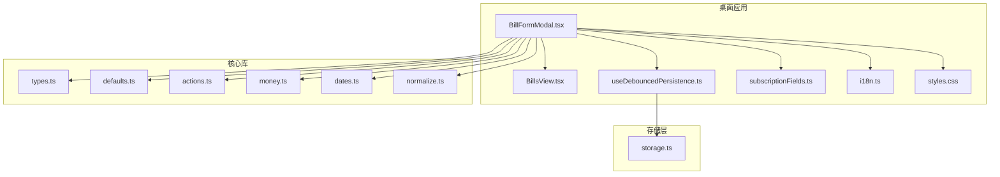
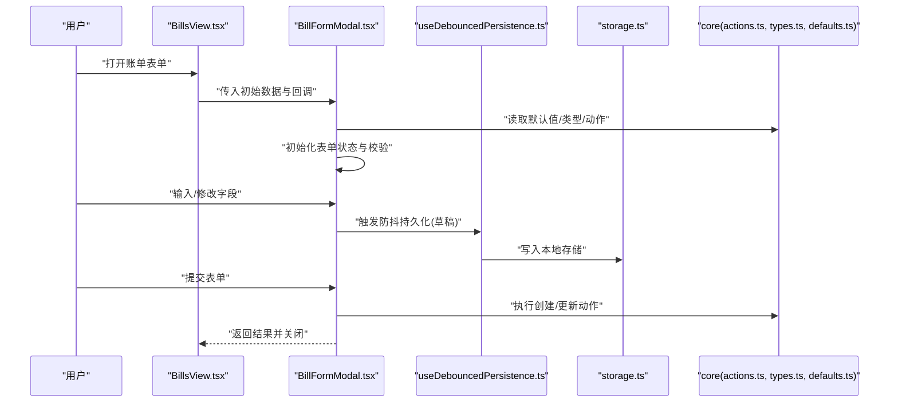
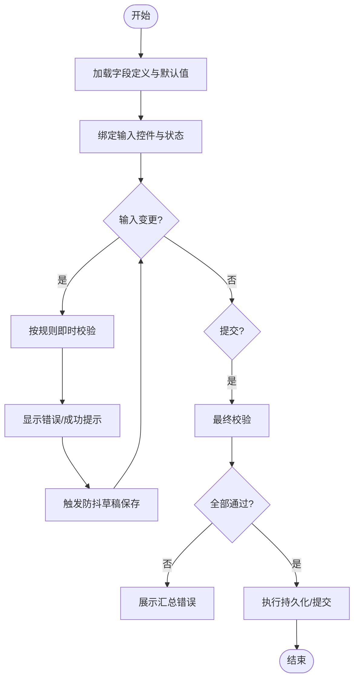
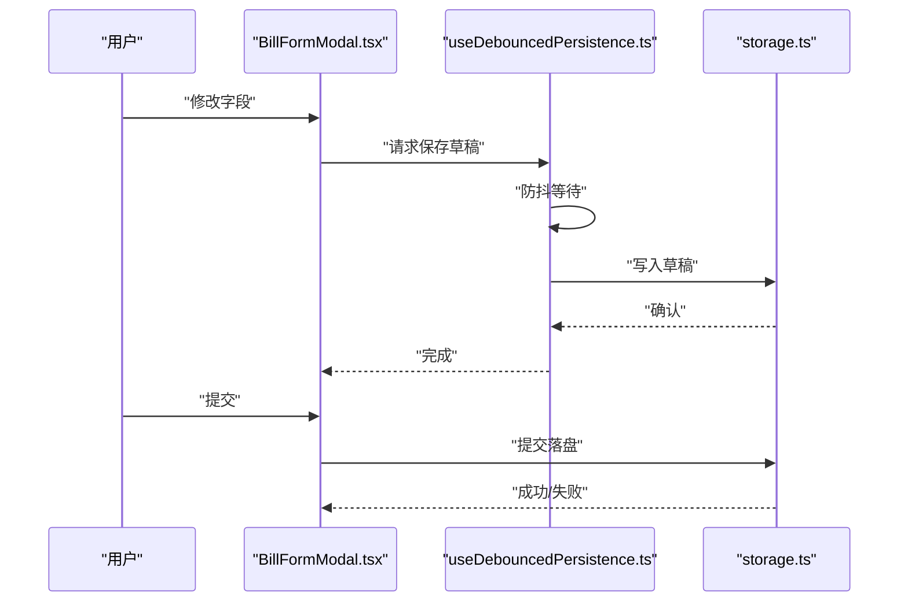
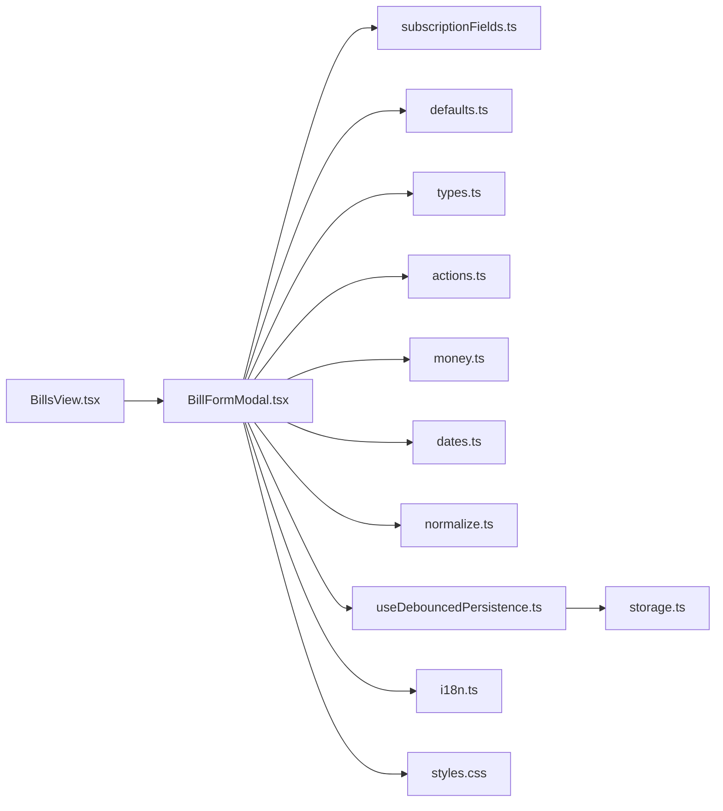

# 账单表单模态框

<cite>
**本文引用的文件**   
- [BillFormModal.tsx](file://apps/desktop/src/BillFormModal.tsx)
- [BillsView.tsx](file://apps/desktop/src/BillsView.tsx)
- [storage.ts](file://apps/desktop/src/storage.ts)
- [useDebouncedPersistence.ts](file://apps/desktop/src/useDebouncedPersistence.ts)
- [subscriptionFields.ts](file://apps/desktop/src/subscriptionFields.ts)
- [defaults.ts](file://packages/core/src/defaults.ts)
- [types.ts](file://packages/core/src/types.ts)
- [actions.ts](file://packages/core/src/actions.ts)
- [money.ts](file://packages/core/src/money.ts)
- [dates.ts](file://packages/core/src/dates.ts)
- [normalize.ts](file://packages/core/src/normalize.ts)
- [i18n.ts](file://apps/desktop/src/i18n.ts)
- [styles.css](file://apps/desktop/src/styles.css)
</cite>

## 目录
1. [简介](#简介)
2. [项目结构](#项目结构)
3. [核心组件](#核心组件)
4. [架构总览](#架构总览)
5. [详细组件分析](#详细组件分析)
6. [依赖分析](#依赖分析)
7. [性能考虑](#性能考虑)
8. [故障排查指南](#故障排查指南)
9. [结论](#结论)
10. [附录](#附录)

## 简介
本文件围绕 BillFormModal 组件，系统化阐述账单创建与编辑表单的实现方案。内容覆盖字段验证、数据绑定、用户交互、布局与响应式适配、键盘导航、数据持久化（含草稿保存与自动完成）、错误处理、用户反馈与可访问性最佳实践，并提供表单定制与扩展的开发指南。目标是帮助开发者快速理解并高效扩展该表单能力。

## 项目结构
BillFormModal 位于桌面应用前端模块中，负责渲染账单的创建/编辑表单；其数据模型与校验规则来自 core 包；持久化通过本地存储与防抖持久化 Hook 实现；国际化与样式分别由 i18n 与 CSS 提供。

图表来源
- [BillFormModal.tsx](file://apps/desktop/src/BillFormModal.tsx)
- [BillsView.tsx](file://apps/desktop/src/BillsView.tsx)
- [useDebouncedPersistence.ts](file://apps/desktop/src/useDebouncedPersistence.ts)
- [subscriptionFields.ts](file://apps/desktop/src/subscriptionFields.ts)
- [i18n.ts](file://apps/desktop/src/i18n.ts)
- [styles.css](file://apps/desktop/src/styles.css)
- [types.ts](file://packages/core/src/types.ts)
- [defaults.ts](file://packages/core/src/defaults.ts)
- [actions.ts](file://packages/core/src/actions.ts)
- [money.ts](file://packages/core/src/money.ts)
- [dates.ts](file://packages/core/src/dates.ts)
- [normalize.ts](file://packages/core/src/normalize.ts)
- [storage.ts](file://apps/desktop/src/storage.ts)

章节来源
- [BillFormModal.tsx](file://apps/desktop/src/BillFormModal.tsx)
- [BillsView.tsx](file://apps/desktop/src/BillsView.tsx)
- [storage.ts](file://apps/desktop/src/storage.ts)
- [useDebouncedPersistence.ts](file://apps/desktop/src/useDebouncedPersistence.ts)
- [subscriptionFields.ts](file://apps/desktop/src/subscriptionFields.ts)
- [defaults.ts](file://packages/core/src/defaults.ts)
- [types.ts](file://packages/core/src/types.ts)
- [actions.ts](file://packages/core/src/actions.ts)
- [money.ts](file://packages/core/src/money.ts)
- [dates.ts](file://packages/core/src/dates.ts)
- [normalize.ts](file://packages/core/src/normalize.ts)
- [i18n.ts](file://apps/desktop/src/i18n.ts)
- [styles.css](file://apps/desktop/src/styles.css)

## 核心组件
BillFormModal 是账单创建/编辑的核心 UI 组件，承担以下职责：
- 表单状态管理：维护字段值、校验状态、提交状态与错误信息
- 数据绑定：将输入控件与表单状态双向绑定
- 字段验证：基于字段定义与规则进行即时与提交时校验
- 用户交互：支持键盘导航、焦点管理、提示与反馈
- 数据持久化：草稿自动保存、提交后落盘
- 国际化与主题：文本与样式适配多语言与主题切换

章节来源
- [BillFormModal.tsx](file://apps/desktop/src/BillFormModal.tsx)
- [subscriptionFields.ts](file://apps/desktop/src/subscriptionFields.ts)
- [useDebouncedPersistence.ts](file://apps/desktop/src/useDebouncedPersistence.ts)
- [i18n.ts](file://apps/desktop/src/i18n.ts)
- [styles.css](file://apps/desktop/src/styles.css)

## 架构总览
下图展示了 BillFormModal 在整体系统中的位置与交互关系：UI 层负责渲染与事件处理；业务逻辑层调用 core 包的类型、默认值、动作与工具函数；持久化层通过防抖 Hook 写入 storage。

图表来源
- [BillsView.tsx](file://apps/desktop/src/BillsView.tsx)
- [BillFormModal.tsx](file://apps/desktop/src/BillFormModal.tsx)
- [useDebouncedPersistence.ts](file://apps/desktop/src/useDebouncedPersistence.ts)
- [storage.ts](file://apps/desktop/src/storage.ts)
- [actions.ts](file://packages/core/src/actions.ts)
- [types.ts](file://packages/core/src/types.ts)
- [defaults.ts](file://packages/core/src/defaults.ts)

## 详细组件分析

### 表单字段与验证
- 字段定义：集中管理字段元数据（标签、占位符、类型、是否必填、格式限制等）
- 校验策略：
  - 即时校验：输入时根据规则实时反馈
  - 提交校验：统一校验所有必填项与格式约束
- 数值与货币：金额字段使用专用工具进行格式化与精度控制
- 日期时间：统一使用日期工具进行解析、格式化与范围校验
- 归一化：对输入进行清洗与标准化，避免脏数据进入持久化层

图表来源
- [subscriptionFields.ts](file://apps/desktop/src/subscriptionFields.ts)
- [money.ts](file://packages/core/src/money.ts)
- [dates.ts](file://packages/core/src/dates.ts)
- [normalize.ts](file://packages/core/src/normalize.ts)
- [useDebouncedPersistence.ts](file://apps/desktop/src/useDebouncedPersistence.ts)

章节来源
- [subscriptionFields.ts](file://apps/desktop/src/subscriptionFields.ts)
- [money.ts](file://packages/core/src/money.ts)
- [dates.ts](file://packages/core/src/dates.ts)
- [normalize.ts](file://packages/core/src/normalize.ts)

### 数据绑定与用户交互
- 受控组件模式：所有输入均由状态驱动，保证单一数据源
- 键盘导航：支持 Tab 顺序、回车提交、Esc 取消、方向键在组合控件中的移动
- 焦点管理：错误聚焦到首个无效字段，提升可访问性与可用性
- 交互反馈：加载态禁用提交按钮，成功/失败消息短暂提示

章节来源
- [BillFormModal.tsx](file://apps/desktop/src/BillFormModal.tsx)
- [i18n.ts](file://apps/desktop/src/i18n.ts)

### 布局设计与响应式适配
- 栅格布局：在大屏上采用多列布局，小屏自动切换为单列堆叠
- 间距与对齐：统一的间距系统与对齐方式，确保视觉一致性
- 主题适配：颜色、圆角、阴影跟随主题变量
- 无障碍：语义化标签、ARIA 属性、对比度达标

章节来源
- [styles.css](file://apps/desktop/src/styles.css)
- [i18n.ts](file://apps/desktop/src/i18n.ts)

### 数据持久化、草稿与自动完成
- 草稿保存：输入变化触发防抖持久化，避免频繁 IO
- 自动完成：从历史或预设中智能补全常用字段
- 提交落盘：提交成功后执行正式持久化，并清理草稿
- 错误恢复：持久化失败时保留草稿并提示用户重试

图表来源
- [useDebouncedPersistence.ts](file://apps/desktop/src/useDebouncedPersistence.ts)
- [storage.ts](file://apps/desktop/src/storage.ts)
- [BillFormModal.tsx](file://apps/desktop/src/BillFormModal.tsx)

章节来源
- [useDebouncedPersistence.ts](file://apps/desktop/src/useDebouncedPersistence.ts)
- [storage.ts](file://apps/desktop/src/storage.ts)
- [BillFormModal.tsx](file://apps/desktop/src/BillFormModal.tsx)

### 错误处理与用户反馈
- 输入级错误：字段级错误文案与高亮
- 提交级错误：汇总错误列表与定位首个错误
- 网络/IO 错误：统一错误提示与重试入口
- 可恢复性：保留已填数据与草稿，降低用户损失

章节来源
- [BillFormModal.tsx](file://apps/desktop/src/BillFormModal.tsx)
- [actions.ts](file://packages/core/src/actions.ts)

### 可访问性最佳实践
- 语义化 HTML：使用合适的表单元素与标签
- 键盘可达：所有交互均可通过键盘完成
- 屏幕阅读器：为动态内容提供 aria-live 区域与描述
- 色彩与对比：遵循 WCAG 对比度要求

章节来源
- [BillFormModal.tsx](file://apps/desktop/src/BillFormModal.tsx)
- [i18n.ts](file://apps/desktop/src/i18n.ts)

### 表单定制与扩展指南
- 新增字段：
  - 在字段定义中添加新字段元数据
  - 在表单渲染中接入对应控件
  - 补充校验规则与格式化逻辑
- 自定义校验：
  - 在规则层添加异步/同步校验器
  - 提供友好的错误文案与提示
- 主题与样式：
  - 通过 CSS 变量或主题配置覆盖样式
- 国际化：
  - 为新字段文案注册翻译键
- 持久化扩展：
  - 在草稿/提交流程中扩展字段序列化和反序列化

章节来源
- [subscriptionFields.ts](file://apps/desktop/src/subscriptionFields.ts)
- [defaults.ts](file://packages/core/src/defaults.ts)
- [actions.ts](file://packages/core/src/actions.ts)
- [i18n.ts](file://apps/desktop/src/i18n.ts)
- [styles.css](file://apps/desktop/src/styles.css)

## 依赖分析
BillFormModal 的依赖关系如下：
- UI 层：BillsView 作为容器，传递初始数据与回调
- 业务层：core 包提供类型、默认值、动作与工具函数
- 持久化层：防抖 Hook 与 storage 模块协作
- 国际化与样式：i18n 与 styles.css

图表来源
- [BillsView.tsx](file://apps/desktop/src/BillsView.tsx)
- [BillFormModal.tsx](file://apps/desktop/src/BillFormModal.tsx)
- [subscriptionFields.ts](file://apps/desktop/src/subscriptionFields.ts)
- [defaults.ts](file://packages/core/src/defaults.ts)
- [types.ts](file://packages/core/src/types.ts)
- [actions.ts](file://packages/core/src/actions.ts)
- [money.ts](file://packages/core/src/money.ts)
- [dates.ts](file://packages/core/src/dates.ts)
- [normalize.ts](file://packages/core/src/normalize.ts)
- [useDebouncedPersistence.ts](file://apps/desktop/src/useDebouncedPersistence.ts)
- [storage.ts](file://apps/desktop/src/storage.ts)
- [i18n.ts](file://apps/desktop/src/i18n.ts)
- [styles.css](file://apps/desktop/src/styles.css)

章节来源
- [BillsView.tsx](file://apps/desktop/src/BillsView.tsx)
- [BillFormModal.tsx](file://apps/desktop/src/BillFormModal.tsx)
- [subscriptionFields.ts](file://apps/desktop/src/subscriptionFields.ts)
- [defaults.ts](file://packages/core/src/defaults.ts)
- [types.ts](file://packages/core/src/types.ts)
- [actions.ts](file://packages/core/src/actions.ts)
- [money.ts](file://packages/core/src/money.ts)
- [dates.ts](file://packages/core/src/dates.ts)
- [normalize.ts](file://packages/core/src/normalize.ts)
- [useDebouncedPersistence.ts](file://apps/desktop/src/useDebouncedPersistence.ts)
- [storage.ts](file://apps/desktop/src/storage.ts)
- [i18n.ts](file://apps/desktop/src/i18n.ts)
- [styles.css](file://apps/desktop/src/styles.css)

## 性能考虑
- 防抖持久化：减少频繁写入，降低 IO 压力
- 受控组件优化：仅在必要时重渲染，避免不必要的状态更新
- 计算缓存：对复杂校验与格式化结果进行缓存
- 懒加载：按需加载非关键资源与校验规则

[本节为通用指导，不直接分析具体文件]

## 故障排查指南
- 表单无法提交：
  - 检查字段校验规则与必填项
  - 查看控制台错误与网络请求日志
- 草稿未保存：
  - 确认防抖 Hook 是否被正确调用
  - 检查 storage 权限与存储空间
- 数值/日期异常：
  - 核对 money 与 dates 工具的输入格式
  - 检查 normalize 的清洗逻辑
- 国际化缺失：
  - 确认翻译键是否存在且已加载
- 样式错乱：
  - 检查主题变量与 CSS 覆盖优先级

章节来源
- [useDebouncedPersistence.ts](file://apps/desktop/src/useDebouncedPersistence.ts)
- [storage.ts](file://apps/desktop/src/storage.ts)
- [money.ts](file://packages/core/src/money.ts)
- [dates.ts](file://packages/core/src/dates.ts)
- [normalize.ts](file://packages/core/src/normalize.ts)
- [i18n.ts](file://apps/desktop/src/i18n.ts)
- [styles.css](file://apps/desktop/src/styles.css)

## 结论
BillFormModal 以清晰的职责划分与良好的分层设计，实现了健壮、易用且可扩展的账单表单能力。通过字段定义驱动的验证、防抖持久化的草稿机制、完善的键盘导航与可访问性支持，以及灵活的定制扩展点，开发者可以快速迭代并满足多样化需求。

[本节为总结，不直接分析具体文件]

## 附录
- 术语表
  - 草稿：未提交的临时数据，用于中断恢复
  - 防抖：延迟执行，合并多次连续触发
  - 受控组件：由外部状态驱动渲染的组件
- 参考路径
  - 字段定义：[subscriptionFields.ts](file://apps/desktop/src/subscriptionFields.ts)
  - 默认值与类型：[defaults.ts](file://packages/core/src/defaults.ts), [types.ts](file://packages/core/src/types.ts)
  - 动作与工具：[actions.ts](file://packages/core/src/actions.ts), [money.ts](file://packages/core/src/money.ts), [dates.ts](file://packages/core/src/dates.ts), [normalize.ts](file://packages/core/src/normalize.ts)
  - 持久化与存储：[useDebouncedPersistence.ts](file://apps/desktop/src/useDebouncedPersistence.ts), [storage.ts](file://apps/desktop/src/storage.ts)
  - 国际化与样式：[i18n.ts](file://apps/desktop/src/i18n.ts), [styles.css](file://apps/desktop/src/styles.css)

[本节为附录，不直接分析具体文件]