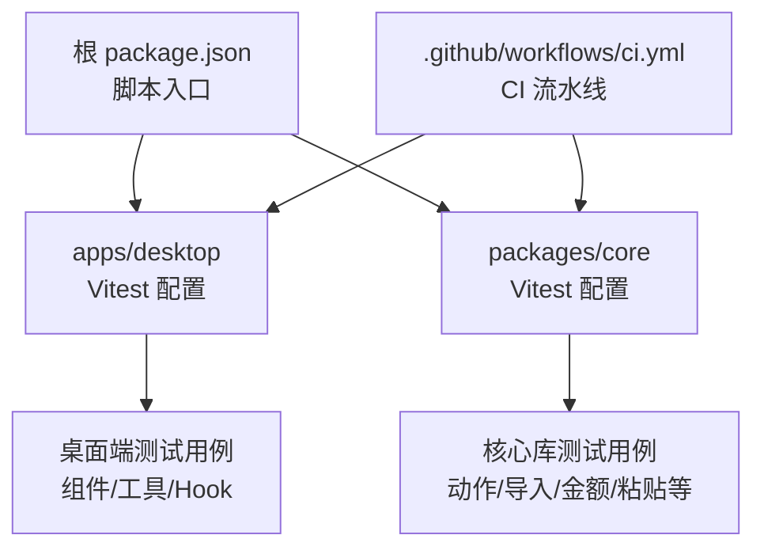
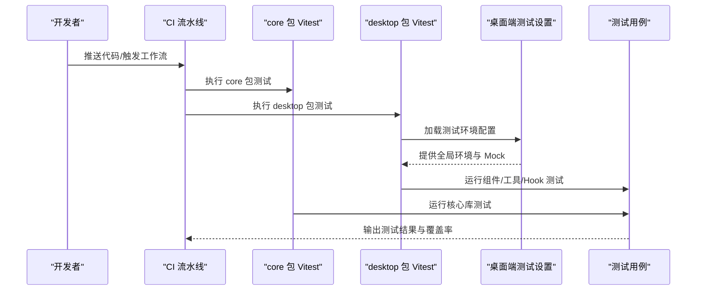
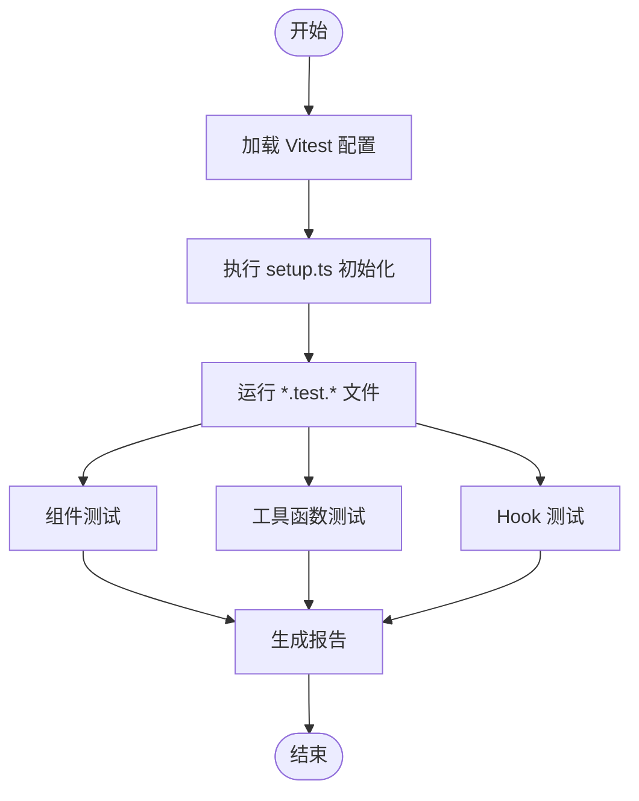
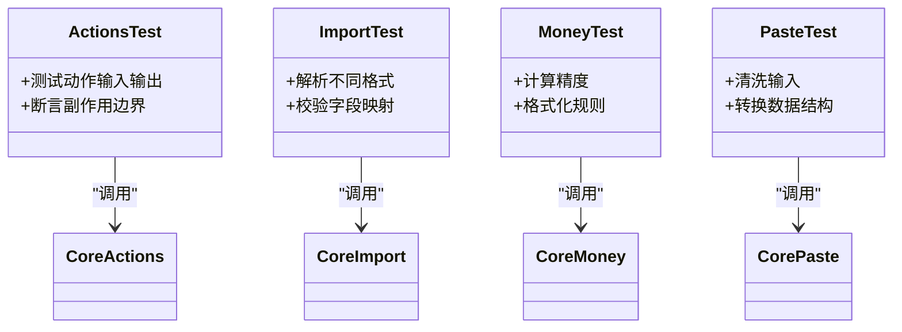
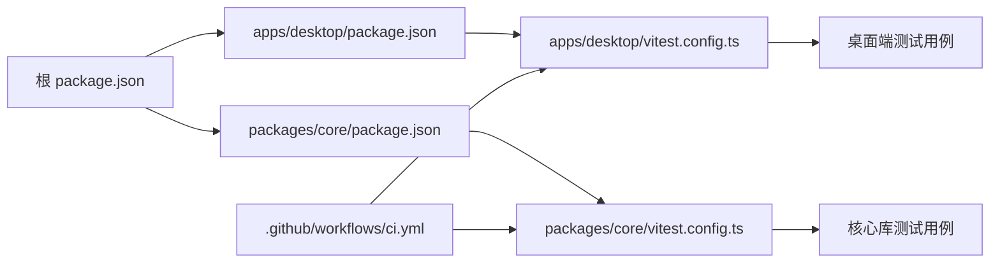

# 测试指南

<cite>
**本文引用的文件**   
- [package.json](file://package.json)
- [apps/desktop/package.json](file://apps/desktop/package.json)
- [packages/core/package.json](file://packages/core/package.json)
- [apps/desktop/vitest.config.ts](file://apps/desktop/vitest.config.ts)
- [packages/core/vitest.config.ts](file://packages/core/vitest.config.ts)
- [apps/desktop/src/test/setup.ts](file://apps/desktop/src/test/setup.ts)
- [apps/desktop/src/PendingView.test.tsx](file://apps/desktop/src/PendingView.test.tsx)
- [apps/desktop/src/SubTable.test.tsx](file://apps/desktop/src/SubTable.test.tsx)
- [apps/desktop/src/SubscriptionFormModal.test.tsx](file://apps/desktop/src/SubscriptionFormModal.test.tsx)
- [apps/desktop/src/categoryLabel.test.ts](file://apps/desktop/src/categoryLabel.test.ts)
- [apps/desktop/src/storage.test.ts](file://apps/desktop/src/storage.test.ts)
- [apps/desktop/src/subscriptionFields.test.ts](file://apps/desktop/src/subscriptionFields.test.ts)
- [apps/desktop/src/useDebouncedPersistence.test.ts](file://apps/desktop/src/useDebouncedPersistence.test.ts)
- [apps/desktop/src/useRenewReminders.test.ts](file://apps/desktop/src/useRenewReminders.test.ts)
- [packages/core/src/actions.test.ts](file://packages/core/src/actions.test.ts)
- [packages/core/src/import.test.ts](file://packages/core/src/import.test.ts)
- [packages/core/src/money.test.ts](file://packages/core/src/money.test.ts)
- [packages/core/src/paste.test.ts](file://packages/core/src/paste.test.ts)
- [.github/workflows/ci.yml](file://.github/workflows/ci.yml)
</cite>

## 目录
1. [简介](#简介)
2. [项目结构](#项目结构)
3. [核心组件](#核心组件)
4. [架构总览](#架构总览)
5. [详细组件分析](#详细组件分析)
6. [依赖分析](#依赖分析)
7. [性能考虑](#性能考虑)
8. [故障排查指南](#故障排查指南)
9. [结论](#结论)
10. [附录](#附录)

## 简介
本指南面向开发者与测试工程师，系统化说明本仓库的测试策略、框架选择（Vitest）、单元测试编写方法、环境配置与 Mock 数据准备、覆盖率要求、端到端测试实践以及持续集成中的测试执行流程。文档基于仓库现有测试用例与配置文件进行归纳总结，确保内容与实际实现一致，便于快速上手与长期维护。

## 项目结构
本项目采用多包（monorepo）结构，前端桌面应用位于 apps/desktop，核心逻辑库位于 packages/core。测试以 Vitest 为核心，按包独立配置与运行，便于并行执行与隔离。

图表来源
- [package.json](file://package.json)
- [apps/desktop/vitest.config.ts](file://apps/desktop/vitest.config.ts)
- [packages/core/vitest.config.ts](file://packages/core/vitest.config.ts)
- [.github/workflows/ci.yml](file://.github/workflows/ci.yml)

章节来源
- [package.json](file://package.json)
- [apps/desktop/package.json](file://apps/desktop/package.json)
- [packages/core/package.json](file://packages/core/package.json)

## 核心组件
- 测试框架：Vitest（单测与组件测试）
- 运行方式：各包独立 vitest.config.ts，支持并行与隔离
- 测试类型：
  - 组件测试（React 组件）
  - 工具函数测试（纯函数）
  - Hook 测试（自定义 Hook）
  - 业务逻辑测试（核心库 actions、money、import、paste 等）
- 覆盖率：通过 Vitest 内置报告生成（可按需开启阈值）

章节来源
- [apps/desktop/vitest.config.ts](file://apps/desktop/vitest.config.ts)
- [packages/core/vitest.config.ts](file://packages/core/vitest.config.ts)

## 架构总览
下图展示了从 CI 触发到各包测试执行的流程，以及桌面端测试环境的初始化与用例组织。

图表来源
- [.github/workflows/ci.yml](file://.github/workflows/ci.yml)
- [apps/desktop/vitest.config.ts](file://apps/desktop/vitest.config.ts)
- [packages/core/vitest.config.ts](file://packages/core/vitest.config.ts)
- [apps/desktop/src/test/setup.ts](file://apps/desktop/src/test/setup.ts)

## 详细组件分析

### 桌面端测试（apps/desktop）
- 组件测试
  - 覆盖 UI 交互与渲染路径，验证状态变化与用户反馈
  - 典型用例文件：PendingView、SubTable、SubscriptionFormModal
- 工具函数测试
  - 针对 categoryLabel、storage、subscriptionFields 等纯函数或简单模块
- Hook 测试
  - 针对 useDebouncedPersistence、useRenewReminders 等自定义 Hook
- 测试环境
  - 通过 setup.ts 统一初始化 DOM、Mock 与全局行为

图表来源
- [apps/desktop/vitest.config.ts](file://apps/desktop/vitest.config.ts)
- [apps/desktop/src/test/setup.ts](file://apps/desktop/src/test/setup.ts)
- [apps/desktop/src/PendingView.test.tsx](file://apps/desktop/src/PendingView.test.tsx)
- [apps/desktop/src/SubTable.test.tsx](file://apps/desktop/src/SubTable.test.tsx)
- [apps/desktop/src/SubscriptionFormModal.test.tsx](file://apps/desktop/src/SubscriptionFormModal.test.tsx)
- [apps/desktop/src/categoryLabel.test.ts](file://apps/desktop/src/categoryLabel.test.ts)
- [apps/desktop/src/storage.test.ts](file://apps/desktop/src/storage.test.ts)
- [apps/desktop/src/subscriptionFields.test.ts](file://apps/desktop/src/subscriptionFields.test.ts)
- [apps/desktop/src/useDebouncedPersistence.test.ts](file://apps/desktop/src/useDebouncedPersistence.test.ts)
- [apps/desktop/src/useRenewReminders.test.ts](file://apps/desktop/src/useRenewReminders.test.ts)

章节来源
- [apps/desktop/vitest.config.ts](file://apps/desktop/vitest.config.ts)
- [apps/desktop/src/test/setup.ts](file://apps/desktop/src/test/setup.ts)
- [apps/desktop/src/PendingView.test.tsx](file://apps/desktop/src/PendingView.test.tsx)
- [apps/desktop/src/SubTable.test.tsx](file://apps/desktop/src/SubTable.test.tsx)
- [apps/desktop/src/SubscriptionFormModal.test.tsx](file://apps/desktop/src/SubscriptionFormModal.test.tsx)
- [apps/desktop/src/categoryLabel.test.ts](file://apps/desktop/src/categoryLabel.test.ts)
- [apps/desktop/src/storage.test.ts](file://apps/desktop/src/storage.test.ts)
- [apps/desktop/src/subscriptionFields.test.ts](file://apps/desktop/src/subscriptionFields.test.ts)
- [apps/desktop/src/useDebouncedPersistence.test.ts](file://apps/desktop/src/useDebouncedPersistence.test.ts)
- [apps/desktop/src/useRenewReminders.test.ts](file://apps/desktop/src/useRenewReminders.test.ts)

### 核心库测试（packages/core）
- 测试范围
  - actions：业务动作与副作用边界
  - import：数据导入与解析
  - money：金额计算与格式化
  - paste：剪贴板数据处理
- 特点
  - 无 UI 依赖，聚焦纯函数与确定性逻辑
  - 易于并行执行与断言

图表来源
- [packages/core/src/actions.test.ts](file://packages/core/src/actions.test.ts)
- [packages/core/src/import.test.ts](file://packages/core/src/import.test.ts)
- [packages/core/src/money.test.ts](file://packages/core/src/money.test.ts)
- [packages/core/src/paste.test.ts](file://packages/core/src/paste.test.ts)

章节来源
- [packages/core/vitest.config.ts](file://packages/core/vitest.config.ts)
- [packages/core/src/actions.test.ts](file://packages/core/src/actions.test.ts)
- [packages/core/src/import.test.ts](file://packages/core/src/import.test.ts)
- [packages/core/src/money.test.ts](file://packages/core/src/money.test.ts)
- [packages/core/src/paste.test.ts](file://packages/core/src/paste.test.ts)

### 端到端测试（E2E）
- 现状
  - 当前仓库未包含 E2E 测试用例与相关配置
- 建议
  - 引入 Playwright 或 Cypress，结合 Tauri 打包产物进行 UI 自动化
  - 在 CI 中增加 E2E 步骤，使用 headless 模式执行
  - 为关键用户路径（订阅创建、账单查看、统计展示）编写场景用例

[本节为概念性指导，不直接分析具体文件]

## 依赖分析
- 包内依赖
  - desktop 与 core 各自拥有独立的 Vitest 配置，避免相互干扰
- 外部依赖
  - Vitest 作为测试运行时，配合 React Testing Library（若用于组件测试）
- 持续集成
  - CI 工作流负责安装依赖并执行各包测试

图表来源
- [package.json](file://package.json)
- [apps/desktop/package.json](file://apps/desktop/package.json)
- [packages/core/package.json](file://packages/core/package.json)
- [apps/desktop/vitest.config.ts](file://apps/desktop/vitest.config.ts)
- [packages/core/vitest.config.ts](file://packages/core/vitest.config.ts)
- [.github/workflows/ci.yml](file://.github/workflows/ci.yml)

章节来源
- [package.json](file://package.json)
- [apps/desktop/package.json](file://apps/desktop/package.json)
- [packages/core/package.json](file://packages/core/package.json)
- [.github/workflows/ci.yml](file://.github/workflows/ci.yml)

## 性能考虑
- 并行执行
  - 利用 Vitest 的多进程能力，按包与文件并行提升速度
- 隔离与缓存
  - 每个包独立配置，避免共享状态污染；合理使用测试缓存
- 资源占用
  - 组件测试尽量最小化渲染树，减少不必要的重渲染
- 覆盖率阈值
  - 建议在 CI 中设置最低覆盖率阈值，防止回归

[本节为通用指导，不直接分析具体文件]

## 故障排查指南
- 常见问题
  - 环境变量缺失：检查 setup.ts 是否初始化必要的全局对象与 API
  - 组件渲染失败：确认 DOM 环境已正确模拟
  - Mock 冲突：确保按需重置与清理，避免跨用例污染
- 调试技巧
  - 使用 Vitest 的 watch 模式定位问题
  - 对复杂组件逐步缩小断言范围，定位失败点
  - 在 CI 中保留日志与截图（如引入 E2E）

章节来源
- [apps/desktop/src/test/setup.ts](file://apps/desktop/src/test/setup.ts)

## 结论
本项目以 Vitest 为核心构建统一的测试体系，桌面端与核心库分别独立配置与执行，覆盖组件、工具函数与 Hook 等多类测试场景。建议在后续迭代中补充端到端测试，完善覆盖率阈值与错误诊断机制，进一步提升质量与可维护性。

[本节为总结性内容，不直接分析具体文件]

## 附录
- 常用命令
  - 运行桌面端测试：参考 apps/desktop/package.json 中的脚本
  - 运行核心库测试：参考 packages/core/package.json 中的脚本
  - 本地开发：使用 Vitest 的 watch 模式加速迭代
- 最佳实践
  - 用例命名清晰，描述预期行为
  - 断言明确，避免模糊匹配
  - Mock 外部依赖，保证测试稳定性
  - 保持用例小而专一，便于定位与维护

[本节为通用指导，不直接分析具体文件]