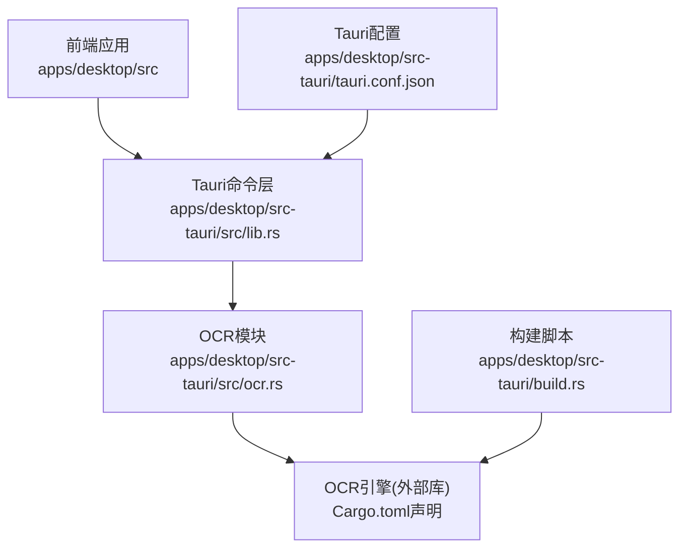
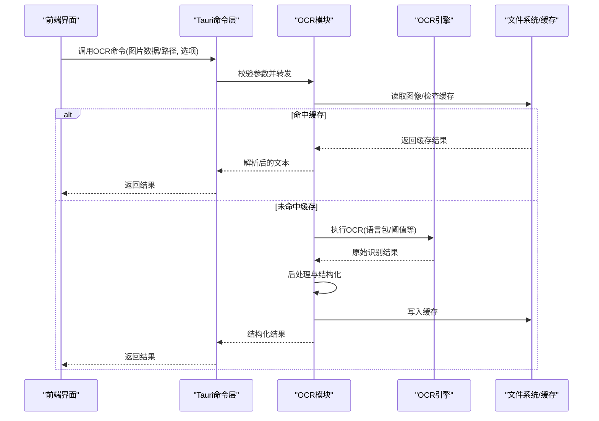
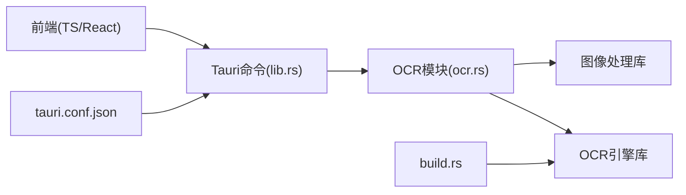
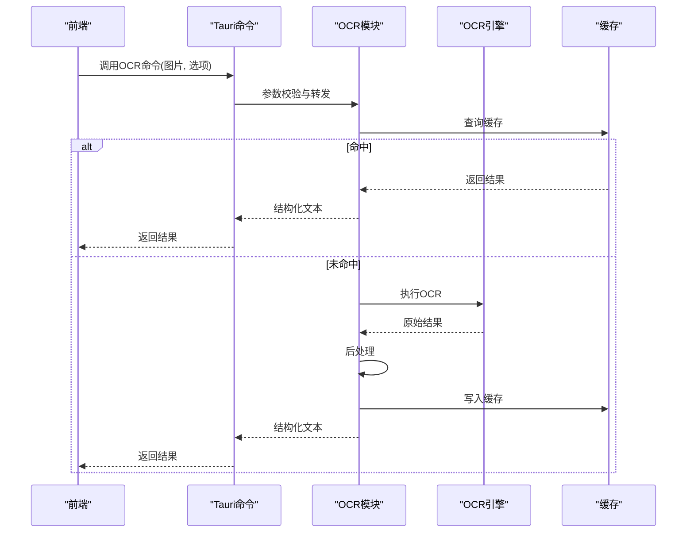

# OCR功能

<cite>
**本文档引用的文件**   
- [apps/desktop/src-tauri/src/ocr.rs](file://apps/desktop/src-tauri/src/ocr.rs)
- [apps/desktop/src-tauri/Cargo.toml](file://apps/desktop/src-tauri/Cargo.toml)
- [apps/desktop/src-tauri/build.rs](file://apps/desktop/src-tauri/build.rs)
- [apps/desktop/src-tauri/tauri.conf.json](file://apps/desktop/src-tauri/tauri.conf.json)
- [apps/desktop/src-tauri/src/lib.rs](file://apps/desktop/src-tauri/src/lib.rs)
- [apps/desktop/src-tauri/src/main.rs](file://apps/desktop/src-tauri/src/main.rs)
</cite>

## 目录
1. [简介](#简介)
2. [项目结构](#项目结构)
3. [核心组件](#核心组件)
4. [架构总览](#架构总览)
5. [详细组件分析](#详细组件分析)
6. [依赖关系分析](#依赖关系分析)
7. [性能考虑](#性能考虑)
8. [故障排查指南](#故障排查指南)
9. [结论](#结论)
10. [附录：使用示例与常见问题](#附录使用示例与常见问题)

## 简介
本文件面向OCR（光学字符识别）功能的实现与集成，聚焦于桌面端Tauri应用中OCR能力的组织方式、调用路径、配置项、错误处理与重试策略、以及可落地的优化建议。文档力求以循序渐进的方式帮助读者理解从前端到Rust后端、再到OCR引擎的完整链路，并提供排障与调优参考。

## 项目结构
本项目采用Tauri架构，前端为TypeScript/React应用，后端通过Rust暴露命令供前端调用。OCR能力位于Rust侧，由Tauri命令暴露给前端，并在构建阶段完成必要的原生依赖准备。

图表来源
- [apps/desktop/src-tauri/src/lib.rs](file://apps/desktop/src-tauri/src/lib.rs)
- [apps/desktop/src-tauri/src/ocr.rs](file://apps/desktop/src-tauri/src/ocr.rs)
- [apps/desktop/src-tauri/Cargo.toml](file://apps/desktop/src-tauri/Cargo.toml)
- [apps/desktop/src-tauri/build.rs](file://apps/desktop/src-tauri/build.rs)
- [apps/desktop/src-tauri/tauri.conf.json](file://apps/desktop/src-tauri/tauri.conf.json)

章节来源
- [apps/desktop/src-tauri/src/lib.rs](file://apps/desktop/src-tauri/src/lib.rs)
- [apps/desktop/src-tauri/src/ocr.rs](file://apps/desktop/src-tauri/src/ocr.rs)
- [apps/desktop/src-tauri/Cargo.toml](file://apps/desktop/src-tauri/Cargo.toml)
- [apps/desktop/src-tauri/build.rs](file://apps/desktop/src-tauri/build.rs)
- [apps/desktop/src-tauri/tauri.conf.json](file://apps/desktop/src-tauri/tauri.conf.json)

## 核心组件
- Tauri命令层：将前端调用桥接到Rust函数，负责参数校验、并发控制与错误返回。
- OCR模块：封装图像预处理、OCR调用、结果解析与缓存逻辑。
- 构建脚本：在打包时准备OCR引擎所需资源或系统依赖。
- Tauri配置：声明命令、权限与平台相关设置，影响OCR运行环境。

章节来源
- [apps/desktop/src-tauri/src/lib.rs](file://apps/desktop/src-tauri/src/lib.rs)
- [apps/desktop/src-tauri/src/ocr.rs](file://apps/desktop/src-tauri/src/ocr.rs)
- [apps/desktop/src-tauri/build.rs](file://apps/desktop/src-tauri/build.rs)
- [apps/desktop/src-tauri/tauri.conf.json](file://apps/desktop/src-tauri/tauri.conf.json)

## 架构总览
下图展示了从前端发起OCR请求到后端执行并返回结果的完整流程。

图表来源
- [apps/desktop/src-tauri/src/lib.rs](file://apps/desktop/src-tauri/src/lib.rs)
- [apps/desktop/src-tauri/src/ocr.rs](file://apps/desktop/src-tauri/src/ocr.rs)

## 详细组件分析

### OCR模块（Rust）
职责边界
- 输入：图像二进制或路径、OCR选项（语言、阈值、是否去噪等）。
- 输出：结构化文本（段落/行/词级信息）、置信度、坐标（可选）。
- 关键流程：参数校验→图像解码→预处理→OCR调用→结果清洗→缓存→返回。

典型数据结构与复杂度
- 图像解码：常见格式如PNG/JPEG/BMP，解码时间复杂度近似O(N)，N为像素数。
- 预处理：缩放、灰度化、二值化、去噪，线性扫描，O(N)。
- OCR推理：取决于引擎实现，通常为O(N×M)，M为模型规模相关因子。
- 结果解析：按行/词切分与置信度过滤，O(K)，K为检测到的文本块数量。

错误处理与降级
- 输入异常：非法路径、损坏图像→返回明确错误码与提示。
- 引擎不可用：缺少动态库/模型→回退到轻量模式或提示安装依赖。
- 超时/内存不足：触发重试或降低分辨率/关闭高级特性。

缓存策略
- 键生成：基于图像哈希+选项指纹，避免重复计算。
- 存储位置：本地磁盘或进程内内存缓存（根据大小与生命周期选择）。
- 失效策略：LRU或TTL，结合磁盘空间监控清理。

性能优化
- 并行：对多页PDF或批量图片进行并发处理，限制并发度避免OOM。
- 预取：热图预热与懒加载模型权重。
- 量化/裁剪：按需启用低精度或ROI区域识别以降低延迟。

章节来源
- [apps/desktop/src-tauri/src/ocr.rs](file://apps/desktop/src-tauri/src/ocr.rs)

### Tauri命令层
职责边界
- 暴露命令给前端：统一入口、鉴权、限流、日志。
- 参数序列化/反序列化：确保前后端类型一致。
- 错误映射：将Rust错误转换为前端友好的JSON结构。

并发与资源管理
- 使用线程池或异步任务调度，避免阻塞UI线程。
- 限制并发OCR任务数，防止CPU/内存峰值过高。

章节来源
- [apps/desktop/src-tauri/src/lib.rs](file://apps/desktop/src-tauri/src/lib.rs)

### 构建脚本与依赖准备
职责边界
- 下载/编译OCR引擎依赖（如tesseract、leptonica等）。
- 复制模型文件到目标目录，确保运行时可用。
- 平台差异处理（Windows/macOS/Linux）。

章节来源
- [apps/desktop/src-tauri/build.rs](file://apps/desktop/src-tauri/build.rs)
- [apps/desktop/src-tauri/Cargo.toml](file://apps/desktop/src-tauri/Cargo.toml)

### Tauri配置
职责边界
- 声明命令名、权限范围、窗口与沙箱策略。
- 指定平台特定能力（文件系统访问、网络等）。

章节来源
- [apps/desktop/src-tauri/tauri.conf.json](file://apps/desktop/src-tauri/tauri.conf.json)

## 依赖关系分析
OCR模块依赖Rust生态中的图像处理与OCR库；Tauri命令层依赖Tauri框架；构建脚本依赖系统工具链与网络资源。

图表来源
- [apps/desktop/src-tauri/src/lib.rs](file://apps/desktop/src-tauri/src/lib.rs)
- [apps/desktop/src-tauri/src/ocr.rs](file://apps/desktop/src-tauri/src/ocr.rs)
- [apps/desktop/src-tauri/build.rs](file://apps/desktop/src-tauri/build.rs)
- [apps/desktop/src-tauri/tauri.conf.json](file://apps/desktop/src-tauri/tauri.conf.json)

章节来源
- [apps/desktop/src-tauri/Cargo.toml](file://apps/desktop/src-tauri/Cargo.toml)
- [apps/desktop/src-tauri/src/lib.rs](file://apps/desktop/src-tauri/src/lib.rs)
- [apps/desktop/src-tauri/src/ocr.rs](file://apps/desktop/src-tauri/src/ocr.rs)

## 性能考虑
- 图像尺寸控制：优先压缩至合理分辨率，减少I/O与解码开销。
- 预处理流水线：灰度化与二值化顺序需针对字体/背景优化。
- 并发上限：根据CPU核数与内存预算设定最大并发。
- 缓存命中率：热点图像与固定模板应优先命中缓存。
- 模型加载：首次启动预热，后续复用实例。

[本节为通用指导，不直接分析具体文件]

## 故障排查指南
常见问题定位步骤
- 确认命令已注册且权限正确（查看Tauri配置与命令注册）。
- 验证图像可读性与编码（尝试独立解码器测试）。
- 检查OCR引擎与模型是否存在（构建脚本输出与运行时路径）。
- 观察日志与错误码（区分输入错误、引擎错误、超时/内存）。
- 逐步禁用预处理与缓存，定位瓶颈环节。

错误分类与建议
- 输入错误：修复路径/编码/损坏问题。
- 引擎缺失：重新构建或安装依赖。
- 资源不足：降低并发/分辨率，增加内存限制。
- 结果异常：调整阈值/语言包/去噪参数。

章节来源
- [apps/desktop/src-tauri/src/lib.rs](file://apps/desktop/src-tauri/src/lib.rs)
- [apps/desktop/src-tauri/src/ocr.rs](file://apps/desktop/src-tauri/src/ocr.rs)
- [apps/desktop/src-tauri/build.rs](file://apps/desktop/src-tauri/build.rs)
- [apps/desktop/src-tauri/tauri.conf.json](file://apps/desktop/src-tauri/tauri.conf.json)

## 结论
OCR功能在Tauri应用中通过清晰的命令层与模块化设计实现，具备可扩展的预处理、OCR调用、结果解析与缓存机制。通过合理的并发控制、缓存策略与错误处理，可在保证准确率的同时提升整体性能与稳定性。

[本节为总结性内容，不直接分析具体文件]

## 附录：使用示例与常见问题

### 端到端调用序列

图表来源
- [apps/desktop/src-tauri/src/lib.rs](file://apps/desktop/src-tauri/src/lib.rs)
- [apps/desktop/src-tauri/src/ocr.rs](file://apps/desktop/src-tauri/src/ocr.rs)

### 支持的图像格式与预处理流程
- 支持格式：PNG、JPEG、BMP（以实际解码库为准）。
- 预处理：灰度化→二值化→去噪→缩放→ROI裁剪（可按需开启）。
- 结果解析：行/词切分、置信度过滤、坐标还原（可选）。

章节来源
- [apps/desktop/src-tauri/src/ocr.rs](file://apps/desktop/src-tauri/src/ocr.rs)

### OCR引擎配置与缓存策略
- 引擎配置：语言包、阈值、去噪强度、并发度、超时。
- 缓存键：图像哈希+选项指纹。
- 缓存介质：内存（小图/热数据）+磁盘（大图/冷数据）。
- 失效策略：LRU/TTL+磁盘空间监控。

章节来源
- [apps/desktop/src-tauri/src/ocr.rs](file://apps/desktop/src-tauri/src/ocr.rs)

### 错误处理、重试与降级
- 重试：指数退避+最大次数限制。
- 降级：关闭高级预处理、降低分辨率、切换轻量模型。
- 回退：离线规则提取（如正则匹配金额/日期）作为兜底。

章节来源
- [apps/desktop/src-tauri/src/ocr.rs](file://apps/desktop/src-tauri/src/ocr.rs)

### 常见问题解决方案
- 无法识别中文：检查语言包是否安装与路径是否正确。
- 识别速度慢：降低分辨率、减少并发、启用缓存。
- 内存溢出：限制并发、启用流式处理、释放中间对象。
- 结果不稳定：调整阈值、增加训练样本、引入后处理规则。

章节来源
- [apps/desktop/src-tauri/src/ocr.rs](file://apps/desktop/src-tauri/src/ocr.rs)
- [apps/desktop/src-tauri/build.rs](file://apps/desktop/src-tauri/build.rs)