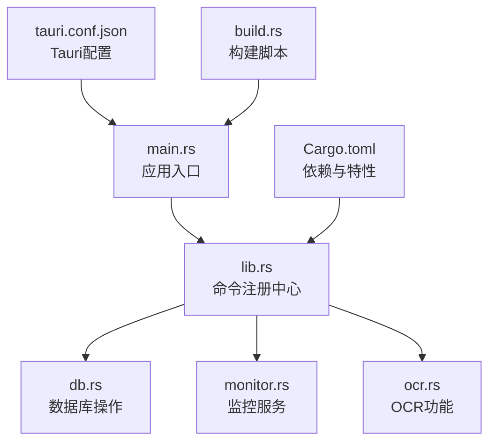
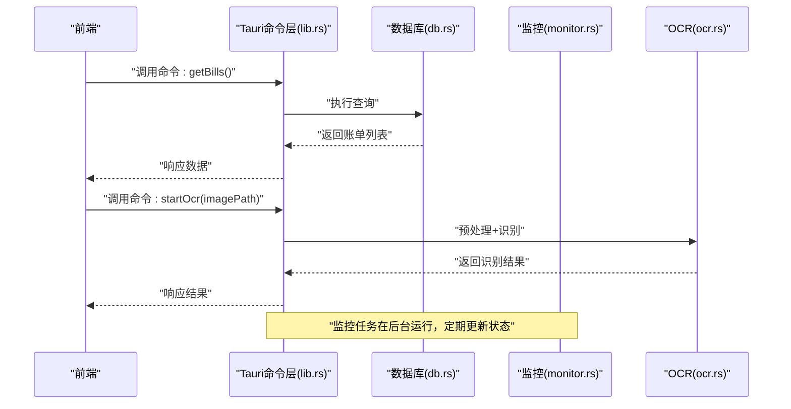
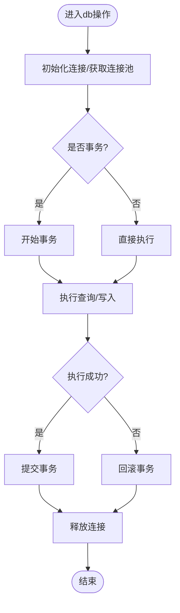
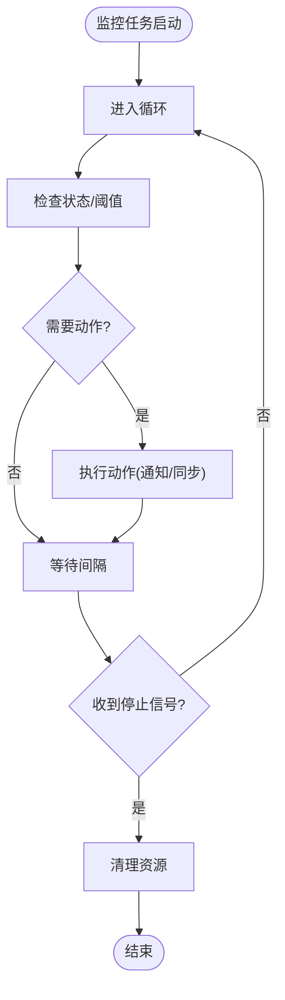
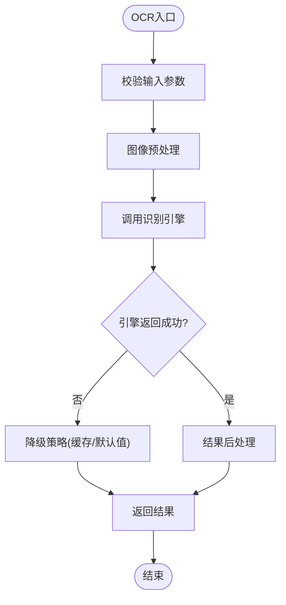
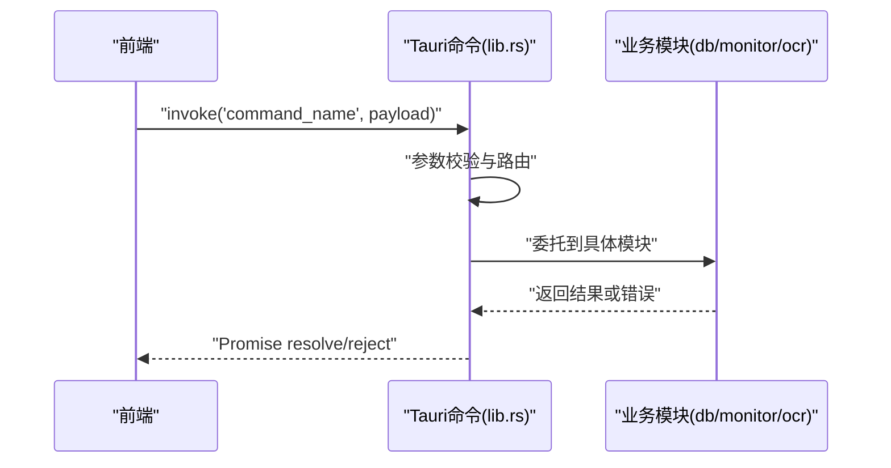
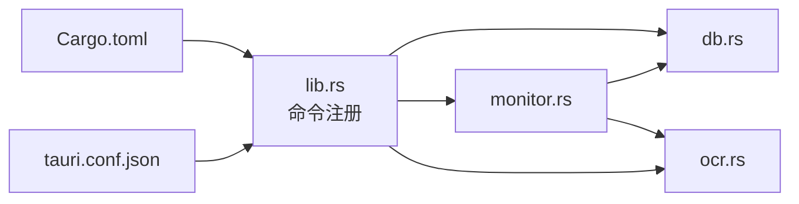

# Tauri后端架构

<cite>
**本文引用的文件**   
- [apps/desktop/src-tauri/src/db.rs](file://apps/desktop/src-tauri/src/db.rs)
- [apps/desktop/src-tauri/src/monitor.rs](file://apps/desktop/src-tauri/src/monitor.rs)
- [apps/desktop/src-tauri/src/ocr.rs](file://apps/desktop/src-tauri/src/ocr.rs)
- [apps/desktop/src-tauri/src/lib.rs](file://apps/desktop/src-tauri/src/lib.rs)
- [apps/desktop/src-tauri/src/main.rs](file://apps/desktop/src-tauri/src/main.rs)
- [apps/desktop/src-tauri/Cargo.toml](file://apps/desktop/src-tauri/Cargo.toml)
- [apps/desktop/src-tauri/tauri.conf.json](file://apps/desktop/src-tauri/tauri.conf.json)
- [apps/desktop/src-tauri/build.rs](file://apps/desktop/src-tauri/build.rs)
</cite>

## 目录
1. [简介](#简介)
2. [项目结构](#项目结构)
3. [核心组件](#核心组件)
4. [架构总览](#架构总览)
5. [详细组件分析](#详细组件分析)
6. [依赖关系分析](#依赖关系分析)
7. [性能考虑](#性能考虑)
8. [故障排查指南](#故障排查指南)
9. [结论](#结论)
10. [附录](#附录)

## 简介
本文件面向Tauri桌面应用的后端（Rust）架构，聚焦以下目标：
- 阐述模块化设计：数据库操作模块(db.rs)、监控服务(monitor.rs)、OCR功能(ocr.rs)的职责边界与协作方式。
- 解释Tauri命令系统：前端如何通过命令调用后端能力。
- 说明异步处理机制与错误处理策略。
- 描述内存管理与资源优化策略。
- 提供后端模块关系图与API调用流程图，帮助读者快速理解数据与控制流。

## 项目结构
后端位于 apps/desktop/src-tauri/src 目录，采用典型的Tauri Rust工程组织：
- main.rs：进程入口，初始化Tauri应用并注册插件、命令等。
- lib.rs：Tauri命令与插件的集中注册点，暴露给前端的API。
- db.rs：数据库访问层，封装SQLite或本地存储的读写逻辑。
- monitor.rs：后台监控任务，负责定时检查、状态同步与事件上报。
- ocr.rs：OCR识别能力，封装图像预处理、识别引擎调用与结果解析。
- Cargo.toml：Rust依赖声明与构建配置。
- tauri.conf.json：Tauri应用配置，包括权限、窗口、命令白名单等。
- build.rs：构建期脚本，用于生成类型定义或资源打包。

图表来源
- [apps/desktop/src-tauri/src/main.rs](file://apps/desktop/src-tauri/src/main.rs)
- [apps/desktop/src-tauri/src/lib.rs](file://apps/desktop/src-tauri/src/lib.rs)
- [apps/desktop/src-tauri/src/db.rs](file://apps/desktop/src-tauri/src/db.rs)
- [apps/desktop/src-tauri/src/monitor.rs](file://apps/desktop/src-tauri/src/monitor.rs)
- [apps/desktop/src-tauri/src/ocr.rs](file://apps/desktop/src-tauri/src/ocr.rs)
- [apps/desktop/src-tauri/Cargo.toml](file://apps/desktop/src-tauri/Cargo.toml)
- [apps/desktop/src-tauri/tauri.conf.json](file://apps/desktop/src-tauri/tauri.conf.json)
- [apps/desktop/src-tauri/build.rs](file://apps/desktop/src-tauri/src/build.rs)

章节来源
- [apps/desktop/src-tauri/src/main.rs](file://apps/desktop/src-tauri/src/main.rs)
- [apps/desktop/src-tauri/src/lib.rs](file://apps/desktop/src-tauri/src/lib.rs)
- [apps/desktop/src-tauri/Cargo.toml](file://apps/desktop/src-tauri/Cargo.toml)
- [apps/desktop/src-tauri/tauri.conf.json](file://apps/desktop/src-tauri/tauri.conf.json)

## 核心组件
- 数据库操作模块(db.rs)
  - 职责：连接管理、事务控制、CRUD封装、查询优化、迁移与备份。
  - 关键点：连接池、只读副本、批量写入、索引策略、并发安全。
- 监控服务(monitor.rs)
  - 职责：周期性任务调度、状态采集、告警触发、与后端其他模块的事件通信。
  - 关键点：异步任务生命周期、退避重试、优雅关闭、资源清理。
- OCR功能(ocr.rs)
  - 职责：图像输入校验、预处理、识别引擎调用、结果后处理与缓存。
  - 关键点：I/O密集型任务隔离、线程池使用、超时与降级、内存峰值控制。

章节来源
- [apps/desktop/src-tauri/src/db.rs](file://apps/desktop/src-tauri/src/db.rs)
- [apps/desktop/src-tauri/src/monitor.rs](file://apps/desktop/src-tauri/src/monitor.rs)
- [apps/desktop/src-tauri/src/ocr.rs](file://apps/desktop/src-tauri/src/ocr.rs)

## 架构总览
Tauri命令系统作为前后端契约，将前端请求路由到后端具体实现：
- 前端通过Tauri命令调用后端能力（如读取账单、启动OCR、查看监控状态）。
- lib.rs集中注册命令，命令处理器委托给db.rs、monitor.rs、ocr.rs等模块。
- main.rs负责应用生命周期与Tauri上下文初始化。

图表来源
- [apps/desktop/src-tauri/src/lib.rs](file://apps/desktop/src-tauri/src/lib.rs)
- [apps/desktop/src-tauri/src/db.rs](file://apps/desktop/src-tauri/src/db.rs)
- [apps/desktop/src-tauri/src/monitor.rs](file://apps/desktop/src-tauri/src/monitor.rs)
- [apps/desktop/src-tauri/src/ocr.rs](file://apps/desktop/src-tauri/src/ocr.rs)

## 详细组件分析

### 数据库操作模块(db.rs)
- 设计要点
  - 连接管理：单例或连接池，确保多线程安全。
  - 事务封装：批量操作使用事务，失败回滚。
  - 查询优化：分页、索引、预编译语句。
  - 错误处理：统一错误类型，区分IO错误、SQL错误、约束冲突。
- 典型流程
  - 初始化连接 -> 执行查询/写入 -> 提交事务 -> 释放资源。

图表来源
- [apps/desktop/src-tauri/src/db.rs](file://apps/desktop/src-tauri/src/db.rs)

章节来源
- [apps/desktop/src-tauri/src/db.rs](file://apps/desktop/src-tauri/src/db.rs)

### 监控服务(monitor.rs)
- 设计要点
  - 任务调度：基于定时器或事件驱动，支持延迟与间隔。
  - 生命周期：启动、运行、停止、重启；优雅退出。
  - 错误恢复：指数退避、熔断、健康检查。
  - 资源管理：避免泄漏，限制并发度。
- 典型流程
  - 启动任务 -> 周期采集 -> 条件判断 -> 触发动作 -> 记录日志。

图表来源
- [apps/desktop/src-tauri/src/monitor.rs](file://apps/desktop/src-tauri/src/monitor.rs)

章节来源
- [apps/desktop/src-tauri/src/monitor.rs](file://apps/desktop/src-tauri/src/monitor.rs)

### OCR功能(ocr.rs)
- 设计要点
  - I/O隔离：图像处理与识别放在独立线程或任务中，避免阻塞主线程。
  - 资源控制：限制并发、设置超时、缓存中间结果。
  - 错误处理：网络/引擎不可用时的降级策略。
- 典型流程
  - 输入校验 -> 预处理 -> 调用识别引擎 -> 后处理 -> 返回结果。

图表来源
- [apps/desktop/src-tauri/src/ocr.rs](file://apps/desktop/src-tauri/src/ocr.rs)

章节来源
- [apps/desktop/src-tauri/src/ocr.rs](file://apps/desktop/src-tauri/src/ocr.rs)

### Tauri命令系统与前端调用
- 命令注册：在lib.rs中集中注册命令，每个命令对应一个处理器函数。
- 参数传递：通过JSON序列化/反序列化，保证类型安全。
- 返回值：统一Result包装，便于错误传播。
- 前端调用：通过Tauri提供的JS API调用命令，接收Promise结果。

图表来源
- [apps/desktop/src-tauri/src/lib.rs](file://apps/desktop/src-tauri/src/lib.rs)
- [apps/desktop/src-tauri/src/db.rs](file://apps/desktop/src-tauri/src/db.rs)
- [apps/desktop/src-tauri/src/monitor.rs](file://apps/desktop/src-tauri/src/monitor.rs)
- [apps/desktop/src-tauri/src/ocr.rs](file://apps/desktop/src-tauri/src/ocr.rs)

章节来源
- [apps/desktop/src-tauri/src/lib.rs](file://apps/desktop/src-tauri/src/lib.rs)

## 依赖关系分析
- 模块内聚与耦合
  - db.rs、monitor.rs、ocr.rs相对独立，通过lib.rs的命令层解耦。
  - 监控服务可能依赖db.rs进行状态持久化，依赖ocr.rs触发识别任务。
- 外部依赖
  - Cargo.toml声明数据库驱动、OCR引擎、异步运行时等。
  - tauri.conf.json配置权限与命令白名单。

图表来源
- [apps/desktop/src-tauri/src/lib.rs](file://apps/desktop/src-tauri/src/lib.rs)
- [apps/desktop/src-tauri/src/db.rs](file://apps/desktop/src-tauri/src/db.rs)
- [apps/desktop/src-tauri/src/monitor.rs](file://apps/desktop/src-tauri/src/monitor.rs)
- [apps/desktop/src-tauri/src/ocr.rs](file://apps/desktop/src-tauri/src/ocr.rs)
- [apps/desktop/src-tauri/Cargo.toml](file://apps/desktop/src-tauri/Cargo.toml)
- [apps/desktop/src-tauri/tauri.conf.json](file://apps/desktop/src-tauri/tauri.conf.json)

章节来源
- [apps/desktop/src-tauri/src/lib.rs](file://apps/desktop/src-tauri/src/lib.rs)
- [apps/desktop/src-tauri/Cargo.toml](file://apps/desktop/src-tauri/Cargo.toml)
- [apps/desktop/src-tauri/tauri.conf.json](file://apps/desktop/src-tauri/tauri.conf.json)

## 性能考虑
- 数据库
  - 使用连接池减少握手开销，合理设置最大连接数。
  - 批量写入与事务合并，减少磁盘I/O。
  - 索引优化与查询计划分析，避免全表扫描。
- 监控
  - 任务去重与节流，避免重复工作。
  - 使用非阻塞I/O与异步任务，提高吞吐。
- OCR
  - 图像尺寸缩放与格式转换前置，降低引擎负载。
  - 结果缓存与增量更新，减少重复计算。
  - 限制并发与内存占用，防止OOM。

## 故障排查指南
- 常见问题定位
  - 命令未注册：检查lib.rs中的命令注册与tauri.conf.json的白名单。
  - 数据库连接失败：确认路径、权限、版本兼容性。
  - OCR引擎不可用：检查依赖库安装与环境变量。
  - 监控任务卡死：查看日志与心跳，确认是否被阻塞。
- 调试建议
  - 启用详细日志，按模块划分日志级别。
  - 使用性能剖析工具定位热点。
  - 模拟异常场景，验证错误处理与恢复逻辑。

## 结论
本架构通过清晰的模块划分与Tauri命令系统，实现了前后端解耦与可扩展性。db.rs、monitor.rs、ocr.rs各司其职，配合异步与错误处理机制，保障应用的稳定性与性能。建议在后续迭代中持续优化资源使用与错误恢复策略，提升用户体验。

## 附录
- 构建与发布
  - build.rs用于生成类型定义或资源打包。
  - tauri.conf.json配置签名、窗口行为与权限。
- 扩展建议
  - 增加缓存层（如内存缓存或Redis）。
  - 引入配置中心与动态加载。
  - 完善监控指标与告警通道。