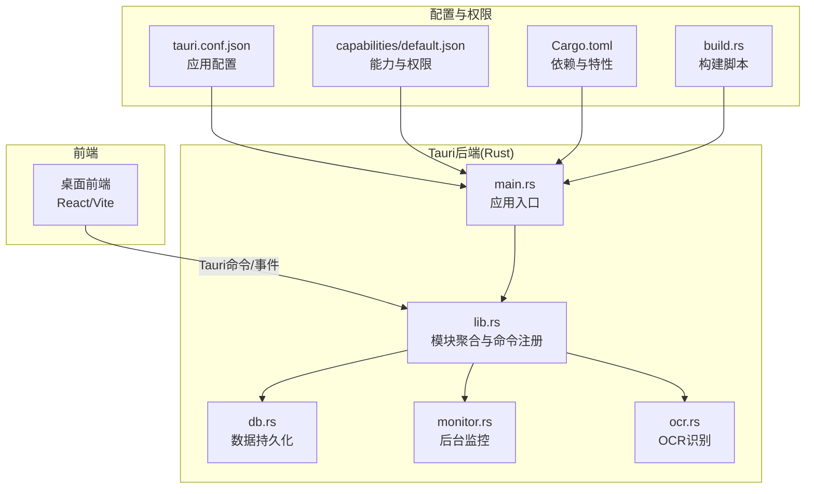
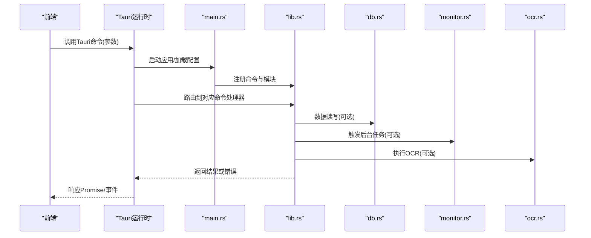
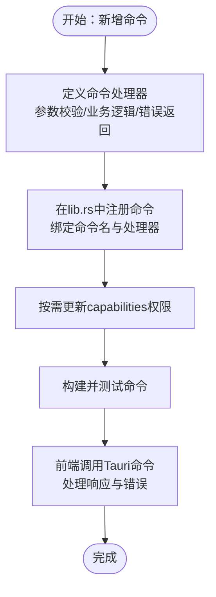

# Tauri核心架构

<cite>
**本文档引用的文件**   
- [apps/desktop/src-tauri/Cargo.toml](file://apps/desktop/src-tauri/Cargo.toml)
- [apps/desktop/src-tauri/tauri.conf.json](file://apps/desktop/src-tauri/tauri.conf.json)
- [apps/desktop/src-tauri/build.rs](file://apps/desktop/src-tauri/build.rs)
- [apps/desktop/src-tauri/src/lib.rs](file://apps/desktop/src-tauri/src/lib.rs)
- [apps/desktop/src-tauri/src/main.rs](file://apps/desktop/src-tauri/src/main.rs)
- [apps/desktop/src-tauri/src/db.rs](file://apps/desktop/src-tauri/src/db.rs)
- [apps/desktop/src-tauri/src/monitor.rs](file://apps/desktop/src-tauri/src/monitor.rs)
- [apps/desktop/src-tauri/src/ocr.rs](file://apps/desktop/src-tauri/src/ocr.rs)
- [apps/desktop/src-tauri/capabilities/default.json](file://apps/desktop/src-tauri/capabilities/default.json)
</cite>

## 目录
1. [简介](#简介)
2. [项目结构](#项目结构)
3. [核心组件](#核心组件)
4. [架构总览](#架构总览)
5. [详细组件分析](#详细组件分析)
6. [依赖与构建配置](#依赖与构建配置)
7. [性能考量](#性能考量)
8. [故障排查指南](#故障排查指南)
9. [结论](#结论)
10. [附录：新增Tauri命令示例](#附录新增tauri命令示例)

## 简介
本文件面向希望理解并扩展该Tauri应用的开发者，系统性阐述Rust后端的整体设计模式、模块组织、Tauri命令注册机制与前后端通信协议；同时解释Cargo.toml的依赖管理与构建配置、tauri.conf.json的配置选项与安全策略，以及应用启动流程、生命周期管理和错误处理机制。文档提供可视化图表与“章节来源”定位，便于快速查阅具体实现位置。

## 项目结构
本项目采用多包（monorepo）结构，桌面端位于 apps/desktop，其Tauri后端代码位于 apps/desktop/src-tauri。Rust后端以 lib.rs 为模块入口，main.rs 作为可执行入口，db.rs、monitor.rs、ocr.rs 分别承担数据库、监控与OCR能力。前端通过Tauri命令与Rust后端交互，权限由 capabilities/default.json 控制。

**图示来源** 
- [apps/desktop/src-tauri/src/main.rs](file://apps/desktop/src-tauri/src/main.rs)
- [apps/desktop/src-tauri/src/lib.rs](file://apps/desktop/src-tauri/src/lib.rs)
- [apps/desktop/src-tauri/tauri.conf.json](file://apps/desktop/src-tauri/tauri.conf.json)
- [apps/desktop/src-tauri/capabilities/default.json](file://apps/desktop/src-tauri/capabilities/default.json)
- [apps/desktop/src-tauri/Cargo.toml](file://apps/desktop/src-tauri/Cargo.toml)
- [apps/desktop/src-tauri/build.rs](file://apps/desktop/src-tauri/build.rs)

**章节来源**
- [apps/desktop/src-tauri/src/main.rs](file://apps/desktop/src-tauri/src/main.rs)
- [apps/desktop/src-tauri/src/lib.rs](file://apps/desktop/src-tauri/src/lib.rs)
- [apps/desktop/src-tauri/tauri.conf.json](file://apps/desktop/src-tauri/tauri.conf.json)
- [apps/desktop/src-tauri/capabilities/default.json](file://apps/desktop/src-tauri/capabilities/default.json)
- [apps/desktop/src-tauri/Cargo.toml](file://apps/desktop/src-tauri/Cargo.toml)
- [apps/desktop/src-tauri/build.rs](file://apps/desktop/src-tauri/build.rs)

## 核心组件
- 应用入口 main.rs：负责初始化Tauri应用、加载配置、注册插件与命令、启动UI窗口。
- 模块聚合 lib.rs：集中导出各功能模块，统一注册Tauri命令，暴露给前端的API边界。
- 数据层 db.rs：封装本地存储/数据库操作，提供事务与错误返回。
- 监控 monitor.rs：后台任务或系统级监控逻辑，通常以异步方式运行。
- OCR ocr.rs：调用外部工具或库进行图像识别，封装结果与错误。

上述组件通过Tauri命令接口被前端调用，形成清晰的职责边界与松耦合关系。

**章节来源**
- [apps/desktop/src-tauri/src/main.rs](file://apps/desktop/src-tauri/src/main.rs)
- [apps/desktop/src-tauri/src/lib.rs](file://apps/desktop/src-tauri/src/lib.rs)
- [apps/desktop/src-tauri/src/db.rs](file://apps/desktop/src-tauri/src/db.rs)
- [apps/desktop/src-tauri/src/monitor.rs](file://apps/desktop/src-tauri/src/monitor.rs)
- [apps/desktop/src-tauri/src/ocr.rs](file://apps/desktop/src-tauri/src/ocr.rs)

## 架构总览
下图展示从前端发起命令到Rust后端处理并返回结果的完整调用链，包括配置加载、权限校验与错误传播路径。

**图示来源** 
- [apps/desktop/src-tauri/src/main.rs](file://apps/desktop/src-tauri/src/main.rs)
- [apps/desktop/src-tauri/src/lib.rs](file://apps/desktop/src-tauri/src/lib.rs)
- [apps/desktop/src-tauri/src/db.rs](file://apps/desktop/src-tauri/src/db.rs)
- [apps/desktop/src-tauri/src/monitor.rs](file://apps/desktop/src-tauri/src/monitor.rs)
- [apps/desktop/src-tauri/src/ocr.rs](file://apps/desktop/src-tauri/src/ocr.rs)

## 详细组件分析

### 应用入口与生命周期(main.rs)
- 作用：创建Tauri应用实例，加载 tauri.conf.json，注册插件与命令，启动主窗口。
- 生命周期关键点：
  - 应用启动：读取配置、初始化日志、准备资源。
  - 窗口生命周期：监听窗口事件（如关闭、最小化），必要时清理资源。
  - 进程退出：确保后台任务停止、数据库连接释放。
- 错误处理：捕获启动期异常，输出诊断信息并安全退出。

**章节来源**
- [apps/desktop/src-tauri/src/main.rs](file://apps/desktop/src-tauri/src/main.rs)

### 模块聚合与命令注册(lib.rs)
- 作用：聚合 db、monitor、ocr 等模块，统一对外暴露Tauri命令。
- 设计要点：
  - 命令命名空间：按功能域划分命令前缀，避免冲突。
  - 参数校验：在命令入口处对输入进行类型与范围校验。
  - 错误模型：使用统一的Result/Err返回，便于前端区分业务错误与系统错误。
  - 并发模型：对耗时操作使用异步任务，避免阻塞UI线程。

**章节来源**
- [apps/desktop/src-tauri/src/lib.rs](file://apps/desktop/src-tauri/src/lib.rs)

### 数据层(db.rs)
- 职责：封装本地数据库/文件存储，提供增删改查与事务支持。
- 关键考虑：
  - 连接池与并发访问控制。
  - 迁移与版本兼容。
  - 错误分类（IO、SQL、约束冲突等）。

**章节来源**
- [apps/desktop/src-tauri/src/db.rs](file://apps/desktop/src-tauri/src/db.rs)

### 监控服务(monitor.rs)
- 职责：后台监控（如订阅到期提醒、系统状态采集）。
- 关键考虑：
  - 定时调度与取消机制。
  - 资源占用与优雅退出。
  - 与UI的事件通知（Tauri事件）。

**章节来源**
- [apps/desktop/src-tauri/src/monitor.rs](file://apps/desktop/src-tauri/src/monitor.rs)

### OCR能力(ocr.rs)
- 职责：调用OCR引擎或外部工具，完成图片文字识别。
- 关键考虑：
  - 外部依赖可用性检测。
  - 超时与重试策略。
  - 大图像处理与内存管理。

**章节来源**
- [apps/desktop/src-tauri/src/ocr.rs](file://apps/desktop/src-tauri/src/ocr.rs)

## 依赖与构建配置

### Cargo.toml依赖管理
- 依赖分组：
  - 运行时依赖：Tauri框架、序列化、文件系统、加密等。
  - 构建期依赖：用于生成schema、打包资源等。
- 特性开关：通过 features 控制平台相关能力（如macOS/iOS/Windows特定功能）。
- 版本锁定：Cargo.lock保证构建可重复性。

**章节来源**
- [apps/desktop/src-tauri/Cargo.toml](file://apps/desktop/src-tauri/Cargo.toml)

### 构建脚本(build.rs)
- 作用：在编译阶段生成必要文件（如Tauri schema、资源路径常量）。
- 常见任务：
  - 生成前端静态资源路径。
  - 根据目标平台注入宏或常量。
  - 预处理配置文件。

**章节来源**
- [apps/desktop/src-tauri/build.rs](file://apps/desktop/src-tauri/build.rs)

### tauri.conf.json配置与安全策略
- 应用元信息：名称、版本、图标、描述等。
- 窗口配置：尺寸、是否无边框、是否置顶等。
- 安全策略：
  - CSP（内容安全策略）限制内联脚本与外部资源。
  - 白名单域名允许网络请求。
  - 能力与权限：通过 capabilities/default.json 精细控制文件系统、网络、插件等权限。
- 插件与协议：自定义URL协议、IPC通道等。

**章节来源**
- [apps/desktop/src-tauri/tauri.conf.json](file://apps/desktop/src-tauri/tauri.conf.json)
- [apps/desktop/src-tauri/capabilities/default.json](file://apps/desktop/src-tauri/capabilities/default.json)

## 性能考量
- 命令处理尽量轻量，将耗时操作下沉至后台任务或异步函数。
- 数据库访问使用连接池与批量操作，减少锁竞争。
- OCR等大对象处理时注意内存峰值，必要时分块处理。
- 合理设置日志级别，生产环境降低冗余输出。
- 利用Tauri事件推送增量更新，避免频繁全量同步。

[本节为通用指导，不直接分析具体文件]

## 故障排查指南
- 启动失败：检查 tauri.conf.json 语法与路径有效性，确认依赖安装与平台工具链。
- 权限拒绝：核对 capabilities/default.json 中所需能力是否开启。
- 命令未注册：确认 lib.rs 中已正确注册命令名与处理器。
- 数据库错误：查看错误码与堆栈，优先验证连接与表结构。
- OCR失败：检查外部工具是否可用、输入格式是否符合预期。
- 日志定位：启用调试日志，复现问题并收集上下文。

**章节来源**
- [apps/desktop/src-tauri/tauri.conf.json](file://apps/desktop/src-tauri/tauri.conf.json)
- [apps/desktop/src-tauri/capabilities/default.json](file://apps/desktop/src-tauri/capabilities/default.json)
- [apps/desktop/src-tauri/src/lib.rs](file://apps/desktop/src-tauri/src/lib.rs)
- [apps/desktop/src-tauri/src/db.rs](file://apps/desktop/src-tauri/src/db.rs)
- [apps/desktop/src-tauri/src/ocr.rs](file://apps/desktop/src-tauri/src/ocr.rs)

## 结论
本架构以 lib.rs 为中心聚合各能力模块，通过Tauri命令与事件机制与前端解耦；tauri.conf.json 与 capabilities 共同构成安全边界；Cargo.toml 与 build.rs 保障依赖与构建一致性。遵循本文的扩展建议与最佳实践，可高效添加新命令与能力并保持系统稳定。

[本节为总结性内容，不直接分析具体文件]

## 附录：新增Tauri命令示例
以下以“新增一个获取订阅统计的命令”为例，说明如何在Rust后端添加命令并在前端调用。步骤如下：

1. 在对应模块中实现命令处理器（例如 stats.rs 或现有模块中新增函数），定义输入参数结构与返回值类型。
2. 在 lib.rs 中注册命令：将命令名映射到处理器函数，并确保模块已导出。
3. 如需访问数据库或外部服务，在处理器中调用相应模块方法，并返回 Result 类型以便错误传播。
4. 在前端通过Tauri客户端调用命令，处理成功与失败分支。

**图示来源** 
- [apps/desktop/src-tauri/src/lib.rs](file://apps/desktop/src-tauri/src/lib.rs)
- [apps/desktop/src-tauri/capabilities/default.json](file://apps/desktop/src-tauri/capabilities/default.json)

**章节来源**
- [apps/desktop/src-tauri/src/lib.rs](file://apps/desktop/src-tauri/src/lib.rs)
- [apps/desktop/src-tauri/capabilities/default.json](file://apps/desktop/src-tauri/capabilities/default.json)