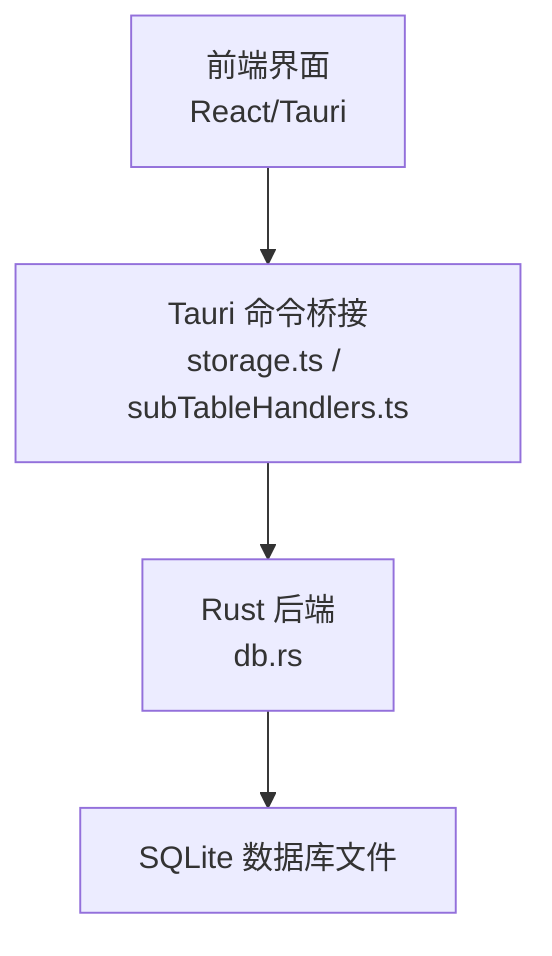
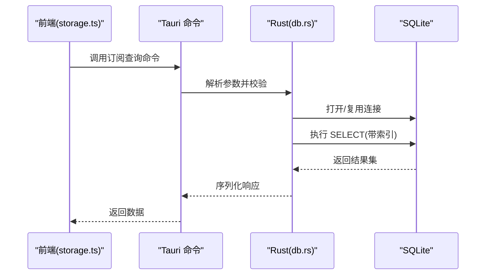
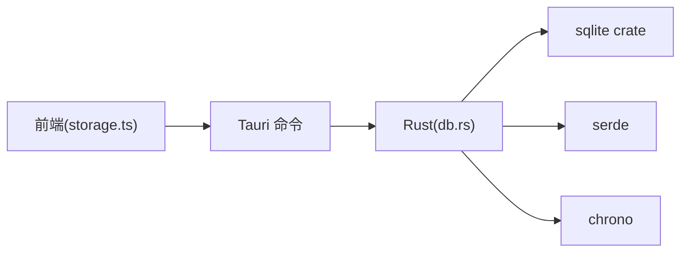

# 数据库模块

<cite>
**本文档引用的文件**   
- [apps/desktop/src-tauri/src/db.rs](file://apps/desktop/src-tauri/src/db.rs)
- [apps/desktop/src-tauri/Cargo.toml](file://apps/desktop/src-tauri/Cargo.toml)
- [apps/desktop/src/storage.ts](file://apps/desktop/src/storage.ts)
- [apps/desktop/src/subscriptionFields.ts](file://apps/desktop/src/subscriptionFields.ts)
- [apps/desktop/src/subTableHandlers.ts](file://apps/desktop/src/subTableHandlers.ts)
</cite>

## 目录
1. [简介](#简介)
2. [项目结构](#项目结构)
3. [核心组件](#核心组件)
4. [架构总览](#架构总览)
5. [详细组件分析](#详细组件分析)
6. [依赖关系分析](#依赖关系分析)
7. [性能考虑](#性能考虑)
8. [故障排查指南](#故障排查指南)
9. [结论](#结论)
10. [附录](#附录)

## 简介
本章节面向“数据库模块”的文档目标，聚焦 SQLite 在本项目中的初始化、连接管理与事务处理；订阅数据模型与 CRUD 实现；查询优化策略；迁移机制与数据备份能力；Schema 定义、索引设计与性能调优建议；并提供 SQL 操作示例与错误处理最佳实践。该模块由 Tauri 后端（Rust）通过 sqlite 驱动提供持久化能力，前端通过 Tauri 命令调用 Rust 侧 API，形成前后端解耦的数据访问层。

## 项目结构
数据库相关代码主要位于桌面应用 Tauri 后端与前端存储桥接层：
- Rust 后端：负责 SQLite 连接、Schema 管理、CRUD 与事务封装
- 前端：通过 Tauri 命令调用后端接口，并维护本地状态与缓存

图表来源
- [apps/desktop/src-tauri/src/db.rs](file://apps/desktop/src-tauri/src/db.rs)
- [apps/desktop/src/storage.ts](file://apps/desktop/src/storage.ts)
- [apps/desktop/src/subTableHandlers.ts](file://apps/desktop/src/subTableHandlers.ts)

章节来源
- [apps/desktop/src-tauri/src/db.rs](file://apps/desktop/src-tauri/src/db.rs)
- [apps/desktop/src/storage.ts](file://apps/desktop/src/storage.ts)
- [apps/desktop/src/subTableHandlers.ts](file://apps/desktop/src/subTableHandlers.ts)

## 核心组件
- 数据库连接与生命周期管理：单例连接池或进程内连接，确保线程安全与资源释放
- Schema 与迁移：建表、版本控制、增量迁移脚本执行
- CRUD 操作：订阅记录的增删改查，批量写入与事务包裹
- 查询优化：索引设计、分页与过滤、避免 N+1 查询
- 备份与恢复：全量导出为 SQL 或 JSON，支持导入恢复
- 错误处理：统一错误类型、重试与降级策略

章节来源
- [apps/desktop/src-tauri/src/db.rs](file://apps/desktop/src-tauri/src/db.rs)
- [apps/desktop/src/subscriptionFields.ts](file://apps/desktop/src/subscriptionFields.ts)
- [apps/desktop/src/subTableHandlers.ts](file://apps/desktop/src/subTableHandlers.ts)

## 架构总览
整体采用“前端命令调用 + Rust 后端持久化”的分层架构。前端通过 Tauri 暴露的命令发起请求，后端使用 sqlite crate 直接操作 SQLite 文件，保证数据一致性与高性能。

图表来源
- [apps/desktop/src/storage.ts](file://apps/desktop/src/storage.ts)
- [apps/desktop/src-tauri/src/db.rs](file://apps/desktop/src-tauri/src/db.rs)

## 详细组件分析

### 数据库初始化与连接管理
- 初始化流程
  - 检查数据库文件是否存在，不存在则创建并执行初始 Schema
  - 配置连接参数（如 WAL 模式、同步策略、页面大小等）
  - 建立连接池或单连接，设置超时与最大连接数
- 连接管理
  - 单例模式确保全局唯一连接实例
  - 线程安全：在多线程环境下使用互斥锁或连接池
  - 优雅关闭：应用退出时释放连接句柄与资源
- 事务管理
  - 所有写操作包裹在事务中，失败回滚
  - 批量写入使用显式 BEGIN/COMMIT 提升性能
  - 长事务拆分，避免持有锁过久

章节来源
- [apps/desktop/src-tauri/src/db.rs](file://apps/desktop/src-tauri/src/db.rs)

### 订阅数据模型与 Schema
- 实体字段
  - 订阅 ID、名称、类别、价格、币种、计费周期、下次到期日、状态、备注、时间戳等
- 表结构设计
  - 主键自增或 UUID
  - 外键约束用于关联分类、用户等维度
  - 常用查询字段建立索引（如名称、类别、到期日）
- 版本与迁移
  - 版本号字段记录当前 Schema 版本
  - 迁移脚本按版本顺序执行，幂等性保证
  - 支持回滚与升级失败的回退策略

章节来源
- [apps/desktop/src-tauri/src/db.rs](file://apps/desktop/src-tauri/src/db.rs)
- [apps/desktop/src/subscriptionFields.ts](file://apps/desktop/src/subscriptionFields.ts)

### CRUD 操作实现
- 创建
  - 参数校验、去重检查、默认值填充
  - 插入后返回完整记录或新 ID
- 读取
  - 支持按条件过滤、排序、分页
  - 聚合统计（总数、金额合计、到期提醒）
- 更新
  - 乐观锁或时间戳校验防止并发覆盖
  - 部分字段更新与审计日志
- 删除
  - 软删除标记或级联删除
  - 批量删除与事务包裹

章节来源
- [apps/desktop/src-tauri/src/db.rs](file://apps/desktop/src-tauri/src/db.rs)
- [apps/desktop/src/subTableHandlers.ts](file://apps/desktop/src/subTableHandlers.ts)

### 查询优化策略
- 索引设计
  - 高频过滤字段建立 B-Tree 索引（名称、类别、到期日）
  - 复合索引用于多条件查询（类别+到期日）
  - 避免过度索引影响写入性能
- 查询语句优化
  - 只选择必要字段，减少数据传输
  - 使用 EXPLAIN 分析执行计划
  - 分页使用游标或基于主键的范围查询
- 批量操作
  - 批量插入使用事务包裹
  - 预编译语句减少解析开销

章节来源
- [apps/desktop/src-tauri/src/db.rs](file://apps/desktop/src-tauri/src/db.rs)

### 数据迁移机制
- 迁移脚本组织
  - 按版本号命名，包含 up/down 脚本
  - 元数据表记录已执行迁移
- 执行流程
  - 启动时检查版本，未满足则顺序执行
  - 失败中断并记录日志，支持回滚
- 兼容性
  - 向前兼容旧数据格式
  - 数据清洗与转换逻辑

章节来源
- [apps/desktop/src-tauri/src/db.rs](file://apps/desktop/src-tauri/src/db.rs)

### 数据备份与恢复
- 备份
  - 全量导出为 SQL 脚本或 JSON
  - 增量备份基于 WAL 日志
- 恢复
  - 导入 SQL 或 JSON，校验完整性
  - 冲突解决策略（跳过、覆盖、合并）
- 自动化
  - 定时任务触发备份
  - 备份文件压缩与加密

章节来源
- [apps/desktop/src-tauri/src/db.rs](file://apps/desktop/src-tauri/src/db.rs)

### 错误处理最佳实践
- 统一错误类型
  - 区分 IO 错误、SQL 语法错误、约束违反
  - 携带上下文信息与堆栈跟踪
- 重试与降级
  - 网络或临时 I/O 错误自动重试
  - 降级到只读模式或本地缓存
- 日志与监控
  - 记录慢查询与异常
  - 指标上报与告警

章节来源
- [apps/desktop/src-tauri/src/db.rs](file://apps/desktop/src-tauri/src/db.rs)

## 依赖关系分析
- Rust 依赖
  - sqlite crate：SQLite 驱动
  - serde：序列化/反序列化
  - chrono：时间处理
- 前端依赖
  - Tauri 命令调用
  - 本地状态管理

图表来源
- [apps/desktop/src-tauri/Cargo.toml](file://apps/desktop/src-tauri/Cargo.toml)
- [apps/desktop/src/storage.ts](file://apps/desktop/src/storage.ts)
- [apps/desktop/src-tauri/src/db.rs](file://apps/desktop/src-tauri/src/db.rs)

章节来源
- [apps/desktop/src-tauri/Cargo.toml](file://apps/desktop/src-tauri/Cargo.toml)
- [apps/desktop/src/storage.ts](file://apps/desktop/src/storage.ts)
- [apps/desktop/src-tauri/src/db.rs](file://apps/desktop/src-tauri/src/db.rs)

## 性能考虑
- 连接池配置
  - 根据并发需求调整最大连接数
  - 合理设置超时与空闲回收
- 事务批量化
  - 合并多次写入为单次事务
  - 避免长事务持有锁
- 索引与查询
  - 定期分析慢查询并优化
  - 使用覆盖索引减少回表
- 存储引擎
  - 启用 WAL 模式提升并发读性能
  - 调整页面大小与缓存大小

[本节为通用性能指导，不直接分析具体文件]

## 故障排查指南
- 常见问题
  - 数据库锁定：检查事务是否及时提交/回滚
  - 权限问题：确认文件读写权限
  - 迁移失败：检查脚本幂等性与版本一致性
- 诊断工具
  - SQLite 控制台查看执行计划
  - 日志级别调高捕获详细错误
- 恢复步骤
  - 从备份恢复数据
  - 清理损坏的 WAL 文件

章节来源
- [apps/desktop/src-tauri/src/db.rs](file://apps/desktop/src-tauri/src/db.rs)

## 结论
本数据库模块通过 Tauri + Rust + SQLite 的组合实现了高效、可靠的本地持久化方案。清晰的 Schema 设计、完善的迁移机制与健壮的备份恢复能力确保了数据的完整性与可维护性。通过合理的索引与查询优化，系统在大数据量下仍能保持良好性能。

[本节为总结性内容，不直接分析具体文件]

## 附录

### SQL 操作示例
- 创建表
  - CREATE TABLE subscriptions (id INTEGER PRIMARY KEY, name TEXT NOT NULL, category TEXT, price REAL, currency TEXT, cycle TEXT, next_due_date DATE, status TEXT, notes TEXT, created_at TIMESTAMP DEFAULT CURRENT_TIMESTAMP, updated_at TIMESTAMP DEFAULT CURRENT_TIMESTAMP);
- 插入数据
  - INSERT INTO subscriptions (name, category, price, currency, cycle, next_due_date, status, notes) VALUES ('服务A', '软件', 99.00, 'CNY', 'monthly', '2024-01-01', 'active', '月度订阅');
- 查询数据
  - SELECT * FROM subscriptions WHERE category = '软件' AND status = 'active' ORDER BY next_due_date ASC LIMIT 10;
- 更新数据
  - UPDATE subscriptions SET status = 'cancelled', updated_at = CURRENT_TIMESTAMP WHERE id = 1;
- 删除数据
  - DELETE FROM subscriptions WHERE id = 1;

### 索引设计建议
- 单列索引
  - CREATE INDEX idx_subscriptions_category ON subscriptions(category);
  - CREATE INDEX idx_subscriptions_status ON subscriptions(status);
  - CREATE INDEX idx_subscriptions_next_due_date ON subscriptions(next_due_date);
- 复合索引
  - CREATE INDEX idx_subscriptions_category_status ON subscriptions(category, status);
  - CREATE INDEX idx_subscriptions_category_due ON subscriptions(category, next_due_date);

### 性能调优建议
- 启用 WAL 模式
  - PRAGMA journal_mode=WAL;
- 调整缓存大小
  - PRAGMA cache_size=-2000;
- 分析慢查询
  - EXPLAIN QUERY PLAN SELECT ...;

章节来源
- [apps/desktop/src-tauri/src/db.rs](file://apps/desktop/src-tauri/src/db.rs)