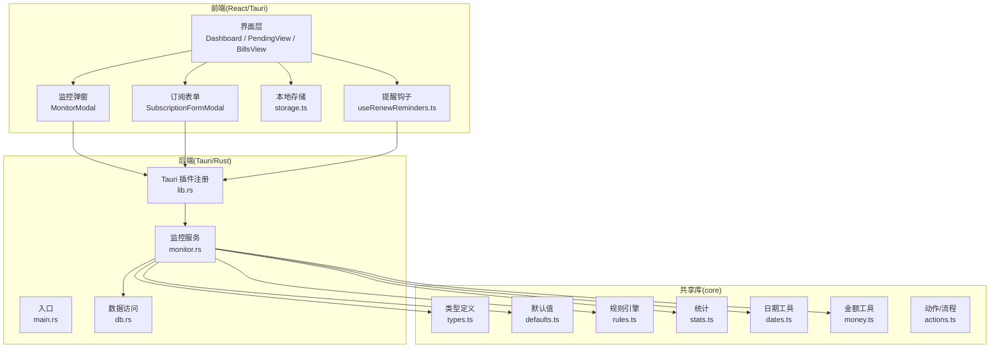
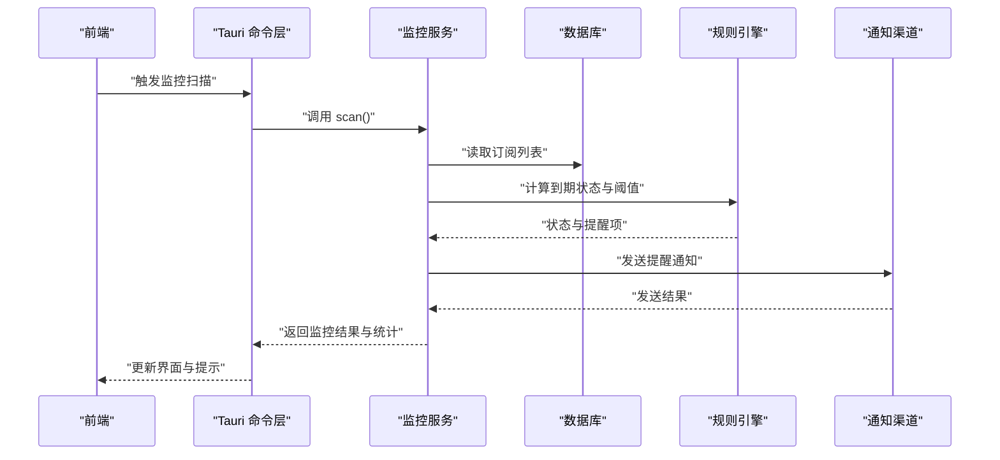
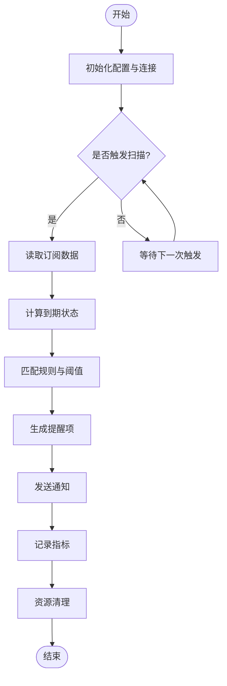
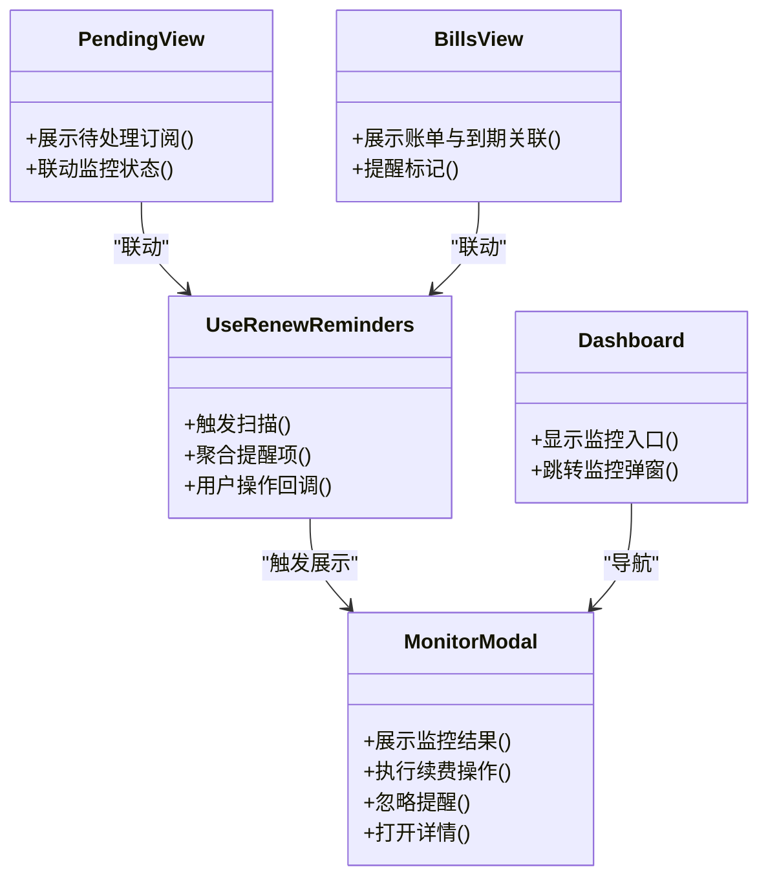
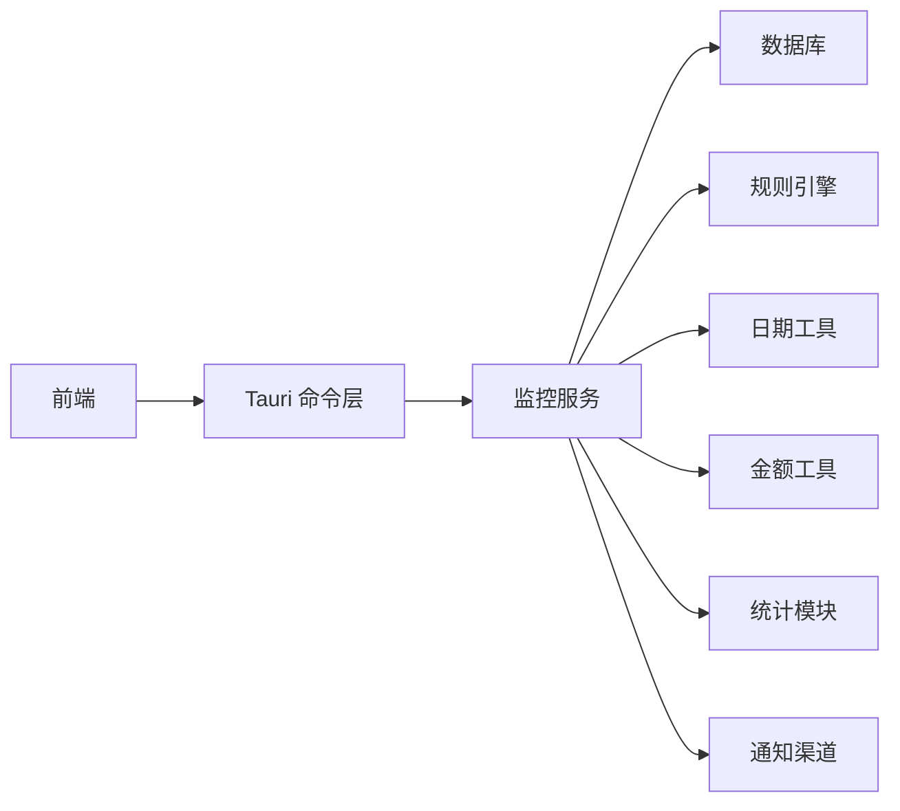

# 监控服务

<cite>
**本文引用的文件**   
- [monitor.rs](file://apps/desktop/src-tauri/src/monitor.rs)
- [lib.rs](file://apps/desktop/src-tauri/src/lib.rs)
- [main.rs](file://apps/desktop/src-tauri/src/main.rs)
- [db.rs](file://apps/desktop/src-tauri/src/db.rs)
- [useRenewReminders.ts](file://apps/desktop/src/useRenewReminders.ts)
- [MonitorModal.tsx](file://apps/desktop/src/MonitorModal.tsx)
- [Dashboard.tsx](file://apps/desktop/src/Dashboard.tsx)
- [SubscriptionFormModal.tsx](file://apps/desktop/src/SubscriptionFormModal.tsx)
- [PendingView.tsx](file://apps/desktop/src/PendingView.tsx)
- [BillsView.tsx](file://apps/desktop/src/BillsView.tsx)
- [storage.ts](file://apps/desktop/src/storage.ts)
- [defaults.ts](file://packages/core/src/defaults.ts)
- [rules.ts](file://packages/core/src/rules.ts)
- [types.ts](file://packages/core/src/types.ts)
- [actions.ts](file://packages/core/src/actions.ts)
- [stats.ts](file://packages/core/src/stats.ts)
- [dates.ts](file://packages/core/src/dates.ts)
- [money.ts](file://packages/core/src/money.ts)
- [package.json](file://apps/desktop/package.json)
</cite>

## 目录
1. [简介](#简介)
2. [项目结构](#项目结构)
3. [核心组件](#核心组件)
4. [架构总览](#架构总览)
5. [详细组件分析](#详细组件分析)
6. [依赖关系分析](#依赖关系分析)
7. [性能考量](#性能考量)
8. [故障排查指南](#故障排查指南)
9. [结论](#结论)
10. [附录](#附录)

## 简介
本文件面向订阅管理应用的“监控服务”，聚焦以下目标：
- 订阅到期监控机制：如何识别即将到期与已过期订阅，并触发提醒。
- 定时任务调度与提醒通知系统：后台扫描、阈值判断、通知渠道集成。
- 异步任务管理与资源清理：避免内存泄漏、确保任务生命周期可控。
- 监控状态跟踪、日志记录与异常处理：可观测性与稳定性保障。
- 监控规则配置、通知渠道与性能指标：可扩展与可运维性。
- 典型监控场景示例与故障排查：从问题定位到修复建议。

## 项目结构
本项目采用前后端分离的桌面应用架构：
- 前端（Tauri + React）：提供订阅录入、待办与账单视图、监控弹窗、设置等交互界面。
- 后端（Tauri Rust）：负责数据库访问、监控扫描、定时任务、通知调用等。
- 共享库（packages/core）：类型定义、默认值、规则引擎、统计与日期工具等。

图表来源
- [main.rs:1-200](file://apps/desktop/src-tauri/src/main.rs#L1-L200)
- [lib.rs:1-200](file://apps/desktop/src-tauri/src/lib.rs#L1-L200)
- [monitor.rs:1-200](file://apps/desktop/src-tauri/src/monitor.rs#L1-L200)
- [db.rs:1-200](file://apps/desktop/src-tauri/src/db.rs#L1-L200)
- [useRenewReminders.ts:1-200](file://apps/desktop/src/useRenewReminders.ts#L1-L200)
- [MonitorModal.tsx:1-200](file://apps/desktop/src/MonitorModal.tsx#L1-L200)
- [Dashboard.tsx:1-200](file://apps/desktop/src/Dashboard.tsx#L1-200)
- [SubscriptionFormModal.tsx:1-200](file://apps/desktop/src/SubscriptionFormModal.tsx#L1-200)
- [PendingView.tsx:1-200](file://apps/desktop/src/PendingView.tsx#L1-200)
- [BillsView.tsx:1-200](file://apps/desktop/src/BillsView.tsx#L1-200)
- [storage.ts:1-200](file://apps/desktop/src/storage.ts#L1-200)
- [defaults.ts:1-200](file://packages/core/src/defaults.ts#L1-200)
- [rules.ts:1-200](file://packages/core/src/rules.ts#L1-200)
- [types.ts:1-200](file://packages/core/src/types.ts#L1-200)
- [actions.ts:1-200](file://packages/core/src/actions.ts#L1-200)
- [stats.ts:1-200](file://packages/core/src/stats.ts#L1-200)
- [dates.ts:1-200](file://packages/core/src/dates.ts#L1-200)
- [money.ts:1-200](file://packages/core/src/money.ts#L1-200)

章节来源
- [main.rs:1-200](file://apps/desktop/src-tauri/src/main.rs#L1-L200)
- [lib.rs:1-200](file://apps/desktop/src-tauri/src/lib.rs#L1-L200)
- [monitor.rs:1-200](file://apps/desktop/src-tauri/src/monitor.rs#L1-L200)
- [db.rs:1-200](file://apps/desktop/src-tauri/src/db.rs#L1-L200)
- [useRenewReminders.ts:1-200](file://apps/desktop/src/useRenewReminders.ts#L1-L200)
- [MonitorModal.tsx:1-200](file://apps/desktop/src/MonitorModal.tsx#L1-L200)
- [Dashboard.tsx:1-200](file://apps/desktop/src/Dashboard.tsx#L1-L200)
- [SubscriptionFormModal.tsx:1-200](file://apps/desktop/src/SubscriptionFormModal.tsx#L1-L200)
- [PendingView.tsx:1-200](file://apps/desktop/src/PendingView.tsx#L1-L200)
- [BillsView.tsx:1-200](file://apps/desktop/src/BillsView.tsx#L1-L200)
- [storage.ts:1-200](file://apps/desktop/src/storage.ts#L1-L200)
- [defaults.ts:1-200](file://packages/core/src/defaults.ts#L1-L200)
- [rules.ts:1-200](file://packages/core/src/rules.ts#L1-L200)
- [types.ts:1-200](file://packages/core/src/types.ts#L1-L200)
- [actions.ts:1-200](file://packages/core/src/actions.ts#L1-L200)
- [stats.ts:1-200](file://packages/core/src/stats.ts#L1-L200)
- [dates.ts:1-200](file://packages/core/src/dates.ts#L1-L200)
- [money.ts:1-200](file://packages/core/src/money.ts#L1-L200)

## 核心组件
- 监控服务（Rust）：负责订阅数据的读取、到期计算、阈值判定、提醒生成与通知发送；支持后台定时扫描与事件驱动触发。
- 前端监控弹窗与提醒钩子：展示监控结果、用户操作入口（如续费、忽略），并在合适时机触发后端扫描。
- 数据访问层：封装数据库读写，保证事务与错误返回。
- 规则与统计：统一到期规则、阈值策略与统计指标输出。
- 工具与类型：日期、金额、默认值、类型定义等基础能力。

章节来源
- [monitor.rs:1-200](file://apps/desktop/src-tauri/src/monitor.rs#L1-L200)
- [useRenewReminders.ts:1-200](file://apps/desktop/src/useRenewReminders.ts#L1-L200)
- [MonitorModal.tsx:1-200](file://apps/desktop/src/MonitorModal.tsx#L1-L200)
- [db.rs:1-200](file://apps/desktop/src-tauri/src/db.rs#L1-L200)
- [rules.ts:1-200](file://packages/core/src/rules.ts#L1-L200)
- [stats.ts:1-200](file://packages/core/src/stats.ts#L1-L200)
- [dates.ts:1-200](file://packages/core/src/dates.ts#L1-L200)
- [money.ts:1-200](file://packages/core/src/money.ts#L1-L200)
- [defaults.ts:1-200](file://packages/core/src/defaults.ts#L1-L200)
- [types.ts:1-200](file://packages/core/src/types.ts#L1-L200)

## 架构总览
监控服务整体流程：
- 前端通过 Tauri 命令或事件触发监控扫描。
- 后端读取订阅数据，依据规则计算到期状态，生成提醒项。
- 根据通知渠道配置发送提醒（系统通知、站内消息等）。
- 将监控结果与统计指标回传前端，供界面展示与用户操作。

图表来源
- [lib.rs:1-200](file://apps/desktop/src-tauri/src/lib.rs#L1-L200)
- [monitor.rs:1-200](file://apps/desktop/src-tauri/src/monitor.rs#L1-L200)
- [db.rs:1-200](file://apps/desktop/src-tauri/src/db.rs#L1-L200)
- [rules.ts:1-200](file://packages/core/src/rules.ts#L1-L200)

章节来源
- [lib.rs:1-200](file://apps/desktop/src-tauri/src/lib.rs#L1-L200)
- [monitor.rs:1-200](file://apps/desktop/src-tauri/src/monitor.rs#L1-L200)
- [db.rs:1-200](file://apps/desktop/src-tauri/src/db.rs#L1-L200)
- [rules.ts:1-200](file://packages/core/src/rules.ts#L1-L200)

## 详细组件分析

### 监控服务（Rust）
职责：
- 订阅数据读取与校验
- 到期计算与阈值判定
- 提醒项生成与去重
- 通知发送与失败重试
- 监控状态与指标上报

关键流程（简化）：
- 初始化：加载配置、连接数据库、注册定时任务。
- 扫描：按周期或事件触发，拉取订阅数据，计算到期状态。
- 提醒：匹配规则，生成提醒项，调用通知渠道。
- 上报：统计扫描耗时、命中数、失败率等指标。
- 清理：释放资源、取消未完成任务、关闭连接。

图表来源
- [monitor.rs:1-200](file://apps/desktop/src-tauri/src/monitor.rs#L1-L200)
- [db.rs:1-200](file://apps/desktop/src-tauri/src/db.rs#L1-L200)
- [rules.ts:1-200](file://packages/core/src/rules.ts#L1-L200)

章节来源
- [monitor.rs:1-200](file://apps/desktop/src-tauri/src/monitor.rs#L1-L200)
- [db.rs:1-200](file://apps/desktop/src-tauri/src/db.rs#L1-L200)
- [rules.ts:1-200](file://packages/core/src/rules.ts#L1-L200)

### 前端提醒钩子与监控弹窗
- useRenewReminders：在订阅变更或页面可见时触发监控扫描，聚合提醒项，提供用户操作入口。
- MonitorModal：集中展示监控结果，支持一键续费、忽略、查看详情等操作。
- Dashboard/PendingView/BillsView：在不同视图下展示监控相关状态与入口。

图表来源
- [useRenewReminders.ts:1-200](file://apps/desktop/src/useRenewReminders.ts#L1-L200)
- [MonitorModal.tsx:1-200](file://apps/desktop/src/MonitorModal.tsx#L1-L200)
- [Dashboard.tsx:1-200](file://apps/desktop/src/Dashboard.tsx#L1-L200)
- [PendingView.tsx:1-200](file://apps/desktop/src/PendingView.tsx#L1-L200)
- [BillsView.tsx:1-200](file://apps/desktop/src/BillsView.tsx#L1-L200)

章节来源
- [useRenewReminders.ts:1-200](file://apps/desktop/src/useRenewReminders.ts#L1-L200)
- [MonitorModal.tsx:1-200](file://apps/desktop/src/MonitorModal.tsx#L1-L200)
- [Dashboard.tsx:1-200](file://apps/desktop/src/Dashboard.tsx#L1-L200)
- [PendingView.tsx:1-200](file://apps/desktop/src/PendingView.tsx#L1-L200)
- [BillsView.tsx:1-200](file://apps/desktop/src/BillsView.tsx#L1-L200)

### 数据访问与持久化
- db.rs：封装数据库操作，提供订阅查询、状态更新、事务控制。
- storage.ts：本地缓存与持久化，减少频繁 IO，提升响应速度。

章节来源
- [db.rs:1-200](file://apps/desktop/src-tauri/src/db.rs#L1-L200)
- [storage.ts:1-200](file://apps/desktop/src/storage.ts#L1-L200)

### 规则与统计
- rules.ts：到期规则、阈值策略、提醒级别定义。
- stats.ts：监控指标采集（扫描次数、命中数、失败率、耗时分布）。
- dates.ts：日期计算、时区处理、相对时间格式化。
- money.ts：金额计算、货币格式化、汇率换算（如有）。
- defaults.ts：默认阈值、通知渠道配置、扫描间隔等。
- types.ts：订阅、提醒、监控结果等类型定义。

章节来源
- [rules.ts:1-200](file://packages/core/src/rules.ts#L1-L200)
- [stats.ts:1-200](file://packages/core/src/stats.ts#L1-L200)
- [dates.ts:1-200](file://packages/core/src/dates.ts#L1-L200)
- [money.ts:1-200](file://packages/core/src/money.ts#L1-L200)
- [defaults.ts:1-200](file://packages/core/src/defaults.ts#L1-L200)
- [types.ts:1-200](file://packages/core/src/types.ts#L1-L200)

### 动作与流程
- actions.ts：订阅创建、续费、忽略、删除等动作编排，与监控提醒联动。

章节来源
- [actions.ts:1-200](file://packages/core/src/actions.ts#L1-L200)

## 依赖关系分析
监控服务依赖链：
- 前端通过 Tauri 命令调用后端监控服务。
- 监控服务依赖数据库、规则引擎、日期与金额工具、统计模块。
- 通知渠道为可选外部依赖，需具备失败重试与降级策略。

图表来源
- [lib.rs:1-200](file://apps/desktop/src-tauri/src/lib.rs#L1-L200)
- [monitor.rs:1-200](file://apps/desktop/src-tauri/src/monitor.rs#L1-L200)
- [db.rs:1-200](file://apps/desktop/src-tauri/src/db.rs#L1-L200)
- [rules.ts:1-200](file://packages/core/src/rules.ts#L1-L200)
- [dates.ts:1-200](file://packages/core/src/dates.ts#L1-L200)
- [money.ts:1-200](file://packages/core/src/money.ts#L1-L200)
- [stats.ts:1-200](file://packages/core/src/stats.ts#L1-L200)

章节来源
- [lib.rs:1-200](file://apps/desktop/src-tauri/src/lib.rs#L1-L200)
- [monitor.rs:1-200](file://apps/desktop/src-tauri/src/monitor.rs#L1-L200)
- [db.rs:1-200](file://apps/desktop/src-tauri/src/db.rs#L1-L200)
- [rules.ts:1-200](file://packages/core/src/rules.ts#L1-L200)
- [dates.ts:1-200](file://packages/core/src/dates.ts#L1-L200)
- [money.ts:1-200](file://packages/core/src/money.ts#L1-L200)
- [stats.ts:1-200](file://packages/core/src/stats.ts#L1-L200)

## 性能考量
- 批量读取与分页：避免一次性加载大量订阅数据，降低内存占用。
- 规则计算优化：使用索引与缓存，减少重复计算。
- 通知限流与合并：同一批次内合并相似提醒，降低通知风暴。
- 异步任务隔离：每个扫描任务独立上下文，失败不影响其他任务。
- 资源清理：及时释放数据库连接、取消超时任务、清理临时对象。
- 指标采集：记录扫描耗时、命中率、失败率，用于容量规划与调优。

[本节为通用指导，不直接分析具体文件]

## 故障排查指南
常见问题与定位步骤：
- 监控未触发
  - 检查前端是否调用 Tauri 命令或事件是否正确。
  - 查看后端日志，确认定时任务是否注册成功。
- 提醒不准确
  - 核对规则配置与阈值设置。
  - 验证日期与时区处理逻辑。
- 通知失败
  - 检查通知渠道配置与网络连通性。
  - 查看失败重试与降级策略是否生效。
- 性能问题
  - 分析统计指标中的耗时分布与失败率。
  - 检查数据库查询与规则计算是否存在瓶颈。
- 内存泄漏
  - 确认任务取消与资源释放逻辑。
  - 观察长时间运行后的内存增长趋势。

章节来源
- [monitor.rs:1-200](file://apps/desktop/src-tauri/src/monitor.rs#L1-L200)
- [useRenewReminders.ts:1-200](file://apps/desktop/src/useRenewReminders.ts#L1-L200)
- [MonitorModal.tsx:1-200](file://apps/desktop/src/MonitorModal.tsx#L1-L200)
- [db.rs:1-200](file://apps/desktop/src-tauri/src/db.rs#L1-L200)
- [rules.ts:1-200](file://packages/core/src/rules.ts#L1-L200)
- [stats.ts:1-200](file://packages/core/src/stats.ts#L1-L200)

## 结论
监控服务通过前后端协作，实现了订阅到期监控、定时任务调度与提醒通知的完整闭环。借助规则引擎与统计模块，系统具备良好的可扩展性与可观测性。通过合理的异步任务管理与资源清理策略，保障了长期运行的稳定性与性能。

[本节为总结，不直接分析具体文件]

## 附录
- 监控规则配置建议：合理设置提前提醒天数、分级提醒策略、静默时段。
- 通知渠道集成要点：统一接口抽象、失败重试、降级与告警。
- 性能监控指标：扫描耗时、命中率、失败率、通知成功率、内存与 CPU 使用率。
- 典型监控场景：
  - 即将到期提醒：提前 N 天推送，支持一键续费。
  - 已过期订阅：高优先级提醒，附带账单链接。
  - 批量订阅监控：按类别分组提醒，避免信息过载。
  - 自定义阈值：针对重要订阅设置更严格的提醒策略。

[本节为补充说明，不直接分析具体文件]