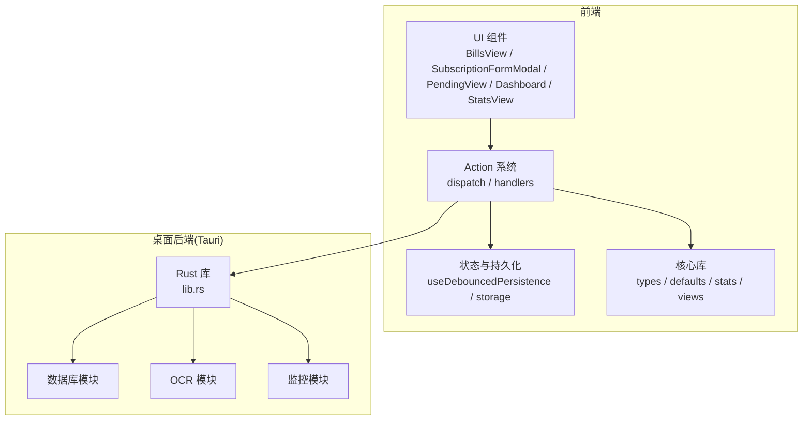
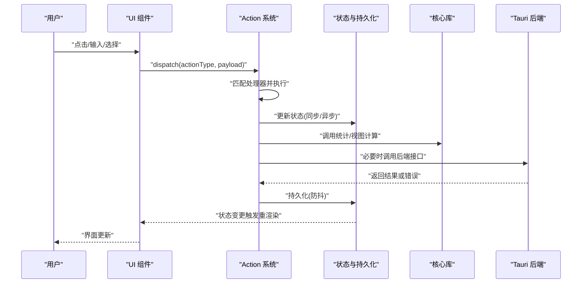
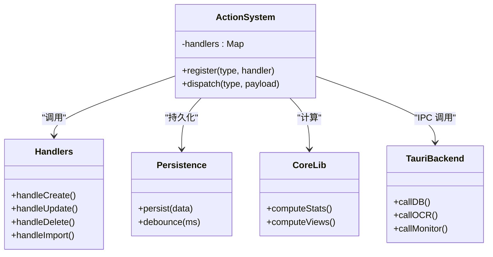
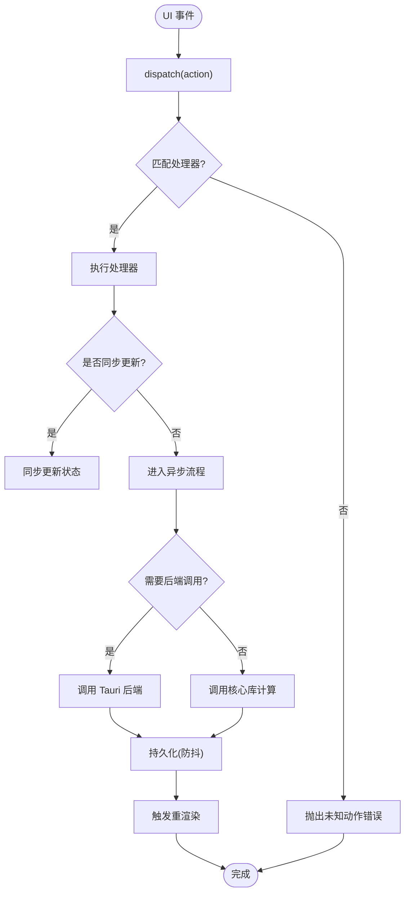
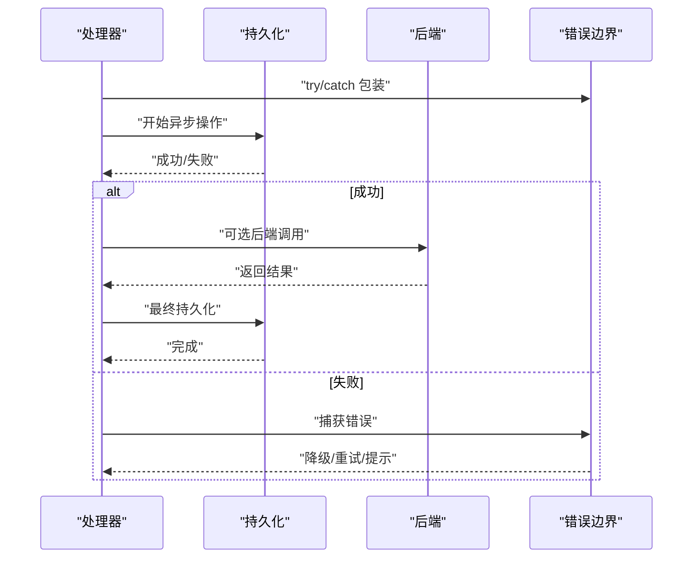
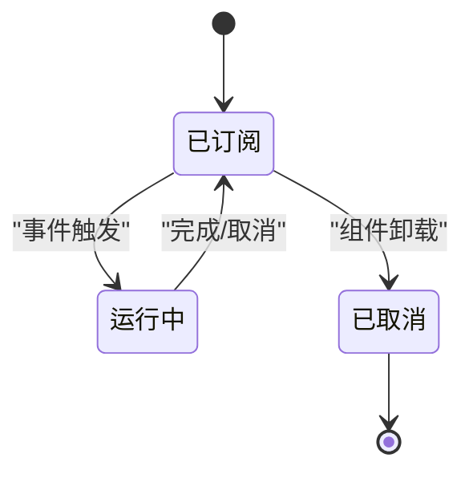
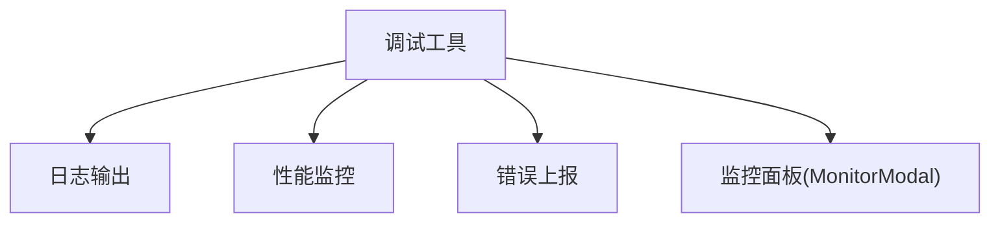
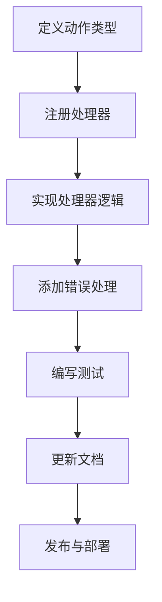
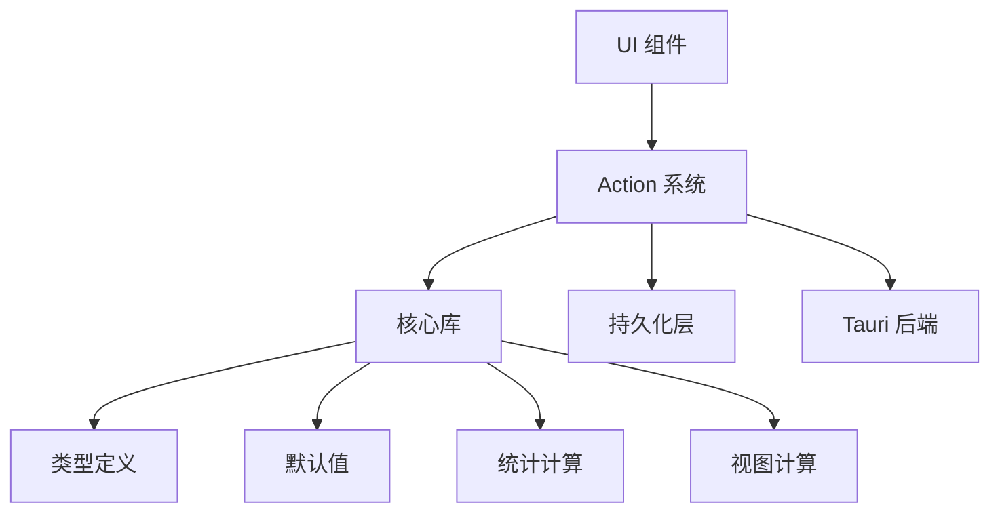

# 事件流

<cite>
**本文引用的文件**   
- [apps/desktop/src/actions.ts](file://apps/desktop/src/actions.ts)
- [packages/core/src/actions.ts](file://packages/core/src/actions.ts)
- [packages/core/src/types.ts](file://packages/core/src/types.ts)
- [packages/core/src/index.ts](file://packages/core/src/index.ts)
- [apps/desktop/src/main.tsx](file://apps/desktop/src/main.tsx)
- [apps/desktop/src/App.tsx](file://apps/desktop/src/App.tsx)
- [apps/desktop/src/storage.ts](file://apps/desktop/src/storage.ts)
- [apps/desktop/src/useDebouncedPersistence.ts](file://apps/desktop/src/useDebouncedPersistence.ts)
- [apps/desktop/src/subTableHandlers.ts](file://apps/desktop/src/subTableHandlers.ts)
- [apps/desktop/src/BillsView.tsx](file://apps/desktop/src/BillsView.tsx)
- [apps/desktop/src/SubscriptionFormModal.tsx](file://apps/desktop/src/SubscriptionFormModal.tsx)
- [apps/desktop/src/PendingView.tsx](file://apps/desktop/src/PendingView.tsx)
- [apps/desktop/src/Dashboard.tsx](file://apps/desktop/src/Dashboard.tsx)
- [apps/desktop/src/StatsView.tsx](file://apps/desktop/src/StatsView.tsx)
- [apps/desktop/src/MonitorModal.tsx](file://apps/desktop/src/MonitorModal.tsx)
- [apps/desktop/src/settings.ts](file://apps/desktop/src/settings.ts)
- [apps/desktop/src/i18n.ts](file://apps/desktop/src/i18n.ts)
- [apps/desktop/src/theme.ts](file://apps/desktop/src/theme.ts)
- [apps/desktop/src/utils/dateUtils.ts](file://apps/desktop/src/utils/dateUtils.ts)
- [apps/desktop/src-tauri/src/lib.rs](file://apps/desktop/src-tauri/src/lib.rs)
- [apps/desktop/src-tauri/Cargo.toml](file://apps/desktop/src-tauri/Cargo.toml)
</cite>

## 目录
1. [简介](#简介)
2. [项目结构](#项目结构)
3. [核心组件](#核心组件)
4. [架构总览](#架构总览)
5. [详细组件分析](#详细组件分析)
6. [依赖关系分析](#依赖关系分析)
7. [性能考量](#性能考量)
8. [故障排查指南](#故障排查指南)
9. [结论](#结论)
10. [附录](#附录)

## 简介
本文件面向“事件流”主题，系统化梳理从 UI 交互触发到数据更新的完整链路，重点解释 action 系统的实现原理（动作类型定义、处理函数注册与分发）、异步事件策略（错误处理与状态更新）、监听器生命周期与内存泄漏防护，以及事件调试与监控工具的使用。同时提供自定义事件处理的开发指南，帮助开发者快速扩展和集成新的业务事件。

## 项目结构
本项目采用前后端分离的桌面应用架构：
- 前端（React + TypeScript）负责 UI 渲染与用户交互，通过 action 系统驱动状态变化，并持久化到本地存储或 Tauri 后端。
- 核心逻辑（packages/core）封装领域模型、默认值、ID 生成、视图计算等通用能力，供桌面端复用。
- 桌面后端（Tauri/Rust）提供数据库、OCR、监控等原生能力，通过 IPC 暴露给前端。

**图表来源** 
- [apps/desktop/src/BillsView.tsx](file://apps/desktop/src/BillsView.tsx)
- [apps/desktop/src/SubscriptionFormModal.tsx](file://apps/desktop/src/SubscriptionFormModal.tsx)
- [apps/desktop/src/PendingView.tsx](file://apps/desktop/src/PendingView.tsx)
- [apps/desktop/src/Dashboard.tsx](file://apps/desktop/src/Dashboard.tsx)
- [apps/desktop/src/StatsView.tsx](file://apps/desktop/src/StatsView.tsx)
- [apps/desktop/src/actions.ts](file://apps/desktop/src/actions.ts)
- [packages/core/src/index.ts](file://packages/core/src/index.ts)
- [apps/desktop/src-tauri/src/lib.rs](file://apps/desktop/src-tauri/src/lib.rs)

**章节来源**
- [apps/desktop/src/main.tsx](file://apps/desktop/src/main.tsx)
- [apps/desktop/src/App.tsx](file://apps/desktop/src/App.tsx)
- [packages/core/src/index.ts](file://packages/core/src/index.ts)

## 核心组件
- Action 系统：集中管理动作类型、处理器注册与分发，确保 UI 事件到状态变更的可预测流程。
- 状态与持久化：基于 React 状态与自定义 Hook 实现防抖持久化，避免频繁 I/O 造成的性能问题。
- 核心库：统一类型定义、默认值、统计与视图计算，保证跨模块一致性。
- Tauri 后端：通过 Rust 暴露数据库、OCR、监控等能力，前端通过 IPC 调用。

**章节来源**
- [apps/desktop/src/actions.ts](file://apps/desktop/src/actions.ts)
- [apps/desktop/src/useDebouncedPersistence.ts](file://apps/desktop/src/useDebouncedPersistence.ts)
- [packages/core/src/types.ts](file://packages/core/src/types.ts)
- [apps/desktop/src-tauri/src/lib.rs](file://apps/desktop/src-tauri/src/lib.rs)

## 架构总览
下图展示从 UI 事件触发到数据更新的端到端流程，包括 action 分发、状态更新、持久化与后端交互。

**图表来源** 
- [apps/desktop/src/actions.ts](file://apps/desktop/src/actions.ts)
- [apps/desktop/src/useDebouncedPersistence.ts](file://apps/desktop/src/useDebouncedPersistence.ts)
- [packages/core/src/index.ts](file://packages/core/src/index.ts)
- [apps/desktop/src-tauri/src/lib.rs](file://apps/desktop/src-tauri/src/lib.rs)

## 详细组件分析

### Action 系统设计与实现
- 动作类型定义：在核心库中统一定义动作类型枚举与载荷结构，确保前后端一致。
- 处理器注册：action 系统维护一个映射表，将动作类型与处理函数绑定；支持按模块拆分注册，便于扩展与维护。
- 分发机制：dispatch 接收动作类型与载荷，查找对应处理器并执行；支持同步与异步处理器，统一错误边界。
- 副作用与状态更新：处理器内部可调用状态更新与持久化，必要时触发后端调用；所有副作用需遵循单一职责原则。

**图表来源** 
- [apps/desktop/src/actions.ts](file://apps/desktop/src/actions.ts)
- [packages/core/src/types.ts](file://packages/core/src/types.ts)
- [apps/desktop/src/useDebouncedPersistence.ts](file://apps/desktop/src/useDebouncedPersistence.ts)
- [apps/desktop/src-tauri/src/lib.rs](file://apps/desktop/src-tauri/src/lib.rs)

**章节来源**
- [apps/desktop/src/actions.ts](file://apps/desktop/src/actions.ts)
- [packages/core/src/types.ts](file://packages/core/src/types.ts)

### UI 事件到数据更新的链路
- UI 组件捕获用户交互，构造 action 并 dispatch。
- action 处理器根据类型执行相应逻辑，可能涉及：
  - 同步状态更新（如表单字段校验、临时状态切换）。
  - 异步操作（如网络请求、OCR 识别、数据库写入）。
  - 副作用（如通知、日志、埋点）。
- 状态变更后，通过持久化层进行防抖保存，减少 I/O 压力。
- 核心库提供统计与视图计算，确保 UI 展示的一致性。

**图表来源** 
- [apps/desktop/src/BillsView.tsx](file://apps/desktop/src/BillsView.tsx)
- [apps/desktop/src/SubscriptionFormModal.tsx](file://apps/desktop/src/SubscriptionFormModal.tsx)
- [apps/desktop/src/PendingView.tsx](file://apps/desktop/src/PendingView.tsx)
- [apps/desktop/src/actions.ts](file://apps/desktop/src/actions.ts)
- [apps/desktop/src/useDebouncedPersistence.ts](file://apps/desktop/src/useDebouncedPersistence.ts)
- [packages/core/src/index.ts](file://packages/core/src/index.ts)
- [apps/desktop/src-tauri/src/lib.rs](file://apps/desktop/src-tauri/src/lib.rs)

**章节来源**
- [apps/desktop/src/BillsView.tsx](file://apps/desktop/src/BillsView.tsx)
- [apps/desktop/src/SubscriptionFormModal.tsx](file://apps/desktop/src/SubscriptionFormModal.tsx)
- [apps/desktop/src/PendingView.tsx](file://apps/desktop/src/PendingView.tsx)
- [apps/desktop/src/actions.ts](file://apps/desktop/src/actions.ts)

### 异步事件处理策略
- 错误处理：所有异步处理器需包裹统一的错误边界，捕获异常并转换为可恢复的状态；对不可恢复错误进行记录与提示。
- 状态更新：异步完成后仅更新必要状态，避免全量刷新；使用局部状态提升减少重渲染范围。
- 重试与退避：对网络失败或后端繁忙场景实施指数退避重试，限制最大重试次数。
- 取消与清理：对长时间运行的任务提供取消机制，防止组件卸载后继续执行导致内存泄漏。

**图表来源** 
- [apps/desktop/src/actions.ts](file://apps/desktop/src/actions.ts)
- [apps/desktop/src/useDebouncedPersistence.ts](file://apps/desktop/src/useDebouncedPersistence.ts)
- [apps/desktop/src-tauri/src/lib.rs](file://apps/desktop/src-tauri/src/lib.rs)

**章节来源**
- [apps/desktop/src/actions.ts](file://apps/desktop/src/actions.ts)
- [apps/desktop/src/useDebouncedPersistence.ts](file://apps/desktop/src/useDebouncedPersistence.ts)

### 事件监听器的生命周期管理与内存泄漏防护
- 订阅与取消：为每个监听器建立明确的订阅与取消时机，通常在组件挂载时订阅，卸载时取消。
- 防抖与节流：对高频事件（如输入、滚动）使用防抖/节流，降低更新频率。
- 弱引用与清理：对回调集合使用弱引用或定期清理，避免循环引用导致的内存泄漏。
- 全局事件总线：若使用全局事件总线，需提供注销 API 并在应用退出时清理所有监听器。

**图表来源** 
- [apps/desktop/src/useDebouncedPersistence.ts](file://apps/desktop/src/useDebouncedPersistence.ts)
- [apps/desktop/src/subTableHandlers.ts](file://apps/desktop/src/subTableHandlers.ts)

**章节来源**
- [apps/desktop/src/useDebouncedPersistence.ts](file://apps/desktop/src/useDebouncedPersistence.ts)
- [apps/desktop/src/subTableHandlers.ts](file://apps/desktop/src/subTableHandlers.ts)

### 事件调试与监控工具
- 日志输出：在 action 分发前后打印关键信息（动作类型、载荷、耗时），便于追踪问题。
- 性能监控：对关键路径添加性能标记，收集渲染时间与 I/O 耗时。
- 错误上报：捕获未处理异常并上报至监控系统，附带上下文信息。
- 可视化面板：在 MonitorModal 中展示当前事件队列、错误计数与性能指标。

**图表来源** 
- [apps/desktop/src/MonitorModal.tsx](file://apps/desktop/src/MonitorModal.tsx)
- [apps/desktop/src/actions.ts](file://apps/desktop/src/actions.ts)

**章节来源**
- [apps/desktop/src/MonitorModal.tsx](file://apps/desktop/src/MonitorModal.tsx)
- [apps/desktop/src/actions.ts](file://apps/desktop/src/actions.ts)

### 自定义事件处理开发指南
- 定义动作类型：在核心库的类型文件中新增动作类型与载荷结构，保持命名规范。
- 注册处理器：在 action 系统中注册新动作的处理器，确保唯一性与幂等性。
- 实现逻辑：处理器内实现业务逻辑，必要时调用核心库与后端接口。
- 错误处理：为处理器添加错误边界，处理可恢复与不可恢复错误。
- 测试覆盖：编写单元测试与集成测试，验证动作分发与状态更新。
- 文档更新：更新相关文档与示例，便于团队协作。

**图表来源** 
- [packages/core/src/types.ts](file://packages/core/src/types.ts)
- [apps/desktop/src/actions.ts](file://apps/desktop/src/actions.ts)

**章节来源**
- [packages/core/src/types.ts](file://packages/core/src/types.ts)
- [apps/desktop/src/actions.ts](file://apps/desktop/src/actions.ts)

## 依赖关系分析
- 前端依赖核心库：类型、默认值、统计与视图计算。
- 前端依赖 Tauri 后端：数据库、OCR、监控等原生能力。
- 持久化层独立：通过防抖 Hook 解耦 UI 与 I/O。
- Action 系统作为中枢：协调 UI、状态、核心库与后端。

**图表来源** 
- [apps/desktop/src/actions.ts](file://apps/desktop/src/actions.ts)
- [packages/core/src/index.ts](file://packages/core/src/index.ts)
- [apps/desktop/src/useDebouncedPersistence.ts](file://apps/desktop/src/useDebouncedPersistence.ts)
- [apps/desktop/src-tauri/src/lib.rs](file://apps/desktop/src-tauri/src/lib.rs)

**章节来源**
- [apps/desktop/src/actions.ts](file://apps/desktop/src/actions.ts)
- [packages/core/src/index.ts](file://packages/core/src/index.ts)
- [apps/desktop/src/useDebouncedPersistence.ts](file://apps/desktop/src/useDebouncedPersistence.ts)
- [apps/desktop/src-tauri/src/lib.rs](file://apps/desktop/src-tauri/src/lib.rs)

## 性能考量
- 防抖持久化：避免频繁写入磁盘，合并多次更新。
- 局部状态提升：仅更新必要组件，减少重渲染范围。
- 懒加载与代码分割：按需加载大模块，降低初始包体积。
- 后端调用优化：批量请求、缓存热点数据、超时与重试策略。
- 内存管理：及时清理监听器与定时器，避免泄漏。

[本节为通用指导，不直接分析具体文件]

## 故障排查指南
- 常见问题定位：
  - 动作未分发：检查动作类型是否注册，处理器是否存在。
  - 状态未更新：确认处理器是否正确更新状态，是否有副作用阻塞。
  - 持久化失败：检查存储权限与格式，查看错误日志。
  - 后端调用失败：检查网络连接与接口契约，查看错误码。
- 调试技巧：
  - 启用详细日志，过滤特定动作类型。
  - 使用监控面板观察事件队列与错误计数。
  - 断点调试处理器逻辑，逐步验证状态变化。
- 恢复策略：
  - 对可恢复错误实施重试与降级。
  - 对不可恢复错误进行用户提示与数据回滚。

**章节来源**
- [apps/desktop/src/actions.ts](file://apps/desktop/src/actions.ts)
- [apps/desktop/src/MonitorModal.tsx](file://apps/desktop/src/MonitorModal.tsx)
- [apps/desktop/src/useDebouncedPersistence.ts](file://apps/desktop/src/useDebouncedPersistence.ts)

## 结论
本事件流文档系统阐述了从 UI 事件到数据更新的完整链路，明确了 action 系统的实现原理与扩展方式，提供了异步事件处理策略、监听器生命周期管理与内存泄漏防护方案，并给出了调试监控与自定义开发的实践指南。遵循本文档的设计与最佳实践，可有效提升应用的稳定性、可维护性与用户体验。

[本节为总结性内容，不直接分析具体文件]

## 附录
- 相关文件路径参考：
  - 动作系统与处理器：[apps/desktop/src/actions.ts](file://apps/desktop/src/actions.ts)
  - 类型定义与核心库：[packages/core/src/types.ts](file://packages/core/src/types.ts), [packages/core/src/index.ts](file://packages/core/src/index.ts)
  - 持久化与防抖：[apps/desktop/src/useDebouncedPersistence.ts](file://apps/desktop/src/useDebouncedPersistence.ts)
  - UI 组件示例：[apps/desktop/src/BillsView.tsx](file://apps/desktop/src/BillsView.tsx), [apps/desktop/src/SubscriptionFormModal.tsx](file://apps/desktop/src/SubscriptionFormModal.tsx), [apps/desktop/src/PendingView.tsx](file://apps/desktop/src/PendingView.tsx)
  - 监控与调试：[apps/desktop/src/MonitorModal.tsx](file://apps/desktop/src/MonitorModal.tsx)
  - Tauri 后端入口：[apps/desktop/src-tauri/src/lib.rs](file://apps/desktop/src-tauri/src/lib.rs)

[本节为附录信息，不直接分析具体文件]