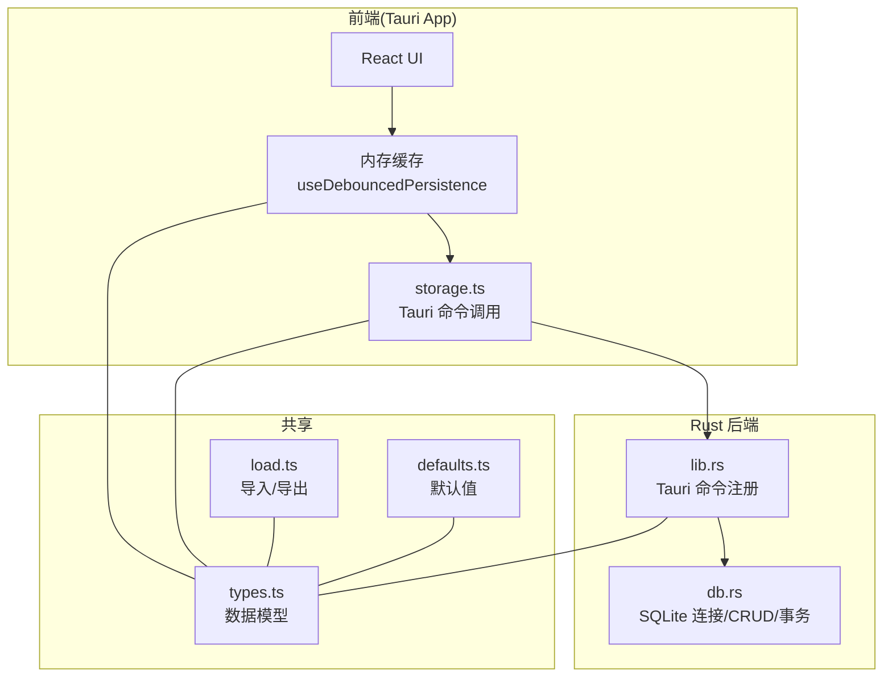
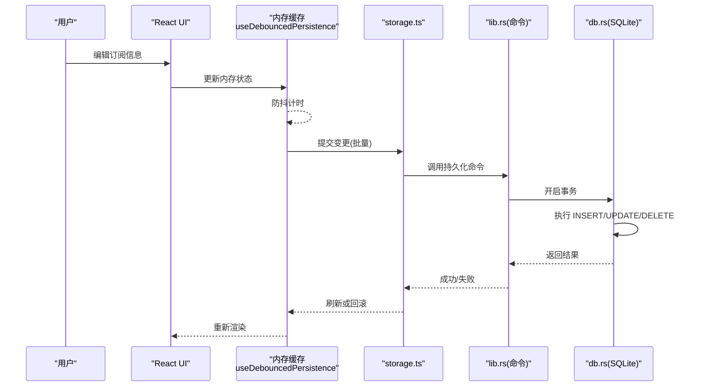
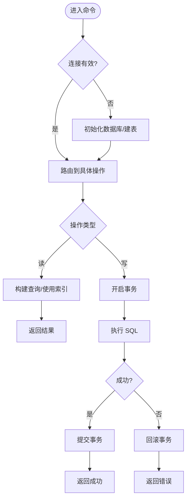
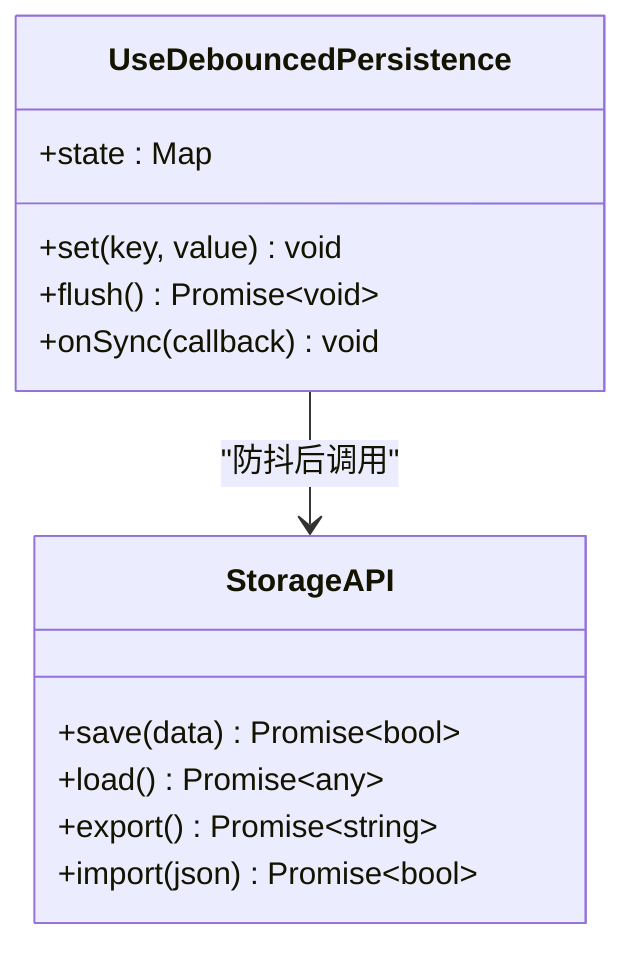
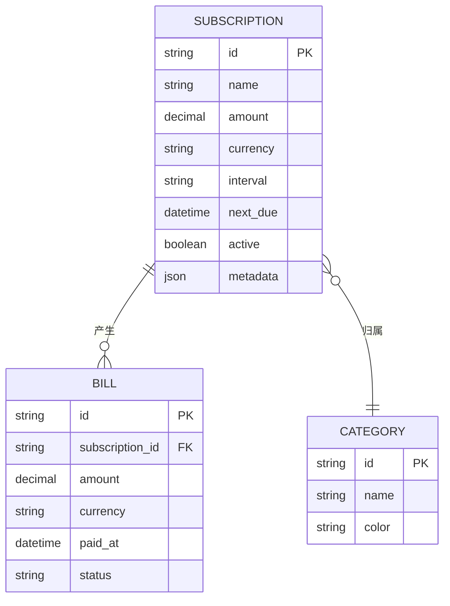
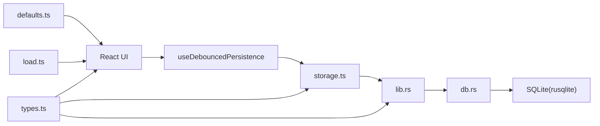

# 持久化层

<cite>
**本文引用的文件**   
- [apps/desktop/src-tauri/src/db.rs](file://apps/desktop/src-tauri/src/db.rs)
- [apps/desktop/src-tauri/src/lib.rs](file://apps/desktop/src-tauri/src/lib.rs)
- [apps/desktop/src/storage.ts](file://apps/desktop/src/storage.ts)
- [apps/desktop/src/useDebouncedPersistence.ts](file://apps/desktop/src/useDebouncedPersistence.ts)
- [packages/core/src/types.ts](file://packages/core/src/types.ts)
- [packages/core/src/defaults.ts](file://packages/core/src/defaults.ts)
- [packages/core/src/load.ts](file://packages/core/src/load.ts)
- [apps/desktop/src-tauri/Cargo.toml](file://apps/desktop/src-tauri/Cargo.toml)
</cite>

## 目录
1. [简介](#简介)
2. [项目结构](#项目结构)
3. [核心组件](#核心组件)
4. [架构总览](#架构总览)
5. [详细组件分析](#详细组件分析)
6. [依赖关系分析](#依赖关系分析)
7. [性能考量](#性能考量)
8. [故障排查指南](#故障排查指南)
9. [结论](#结论)
10. [附录](#附录)

## 简介
本文件聚焦于应用的持久化层，涵盖：
- SQLite 数据库设计与表结构定义
- Rust 后端对数据库的 CRUD、事务与查询优化实现
- 前端存储策略（内存缓存与本地存储协调）
- 数据迁移与备份恢复机制
- 数据完整性约束与索引优化策略
- Schema 变更管理与版本控制流程

该文档旨在帮助开发者快速理解并扩展持久化能力，同时为运维与产品侧提供清晰的维护指引。

## 项目结构
与持久化相关的关键位置如下：
- Rust/Tauri 后端：SQLite 驱动、数据库连接与命令暴露
- 前端 TypeScript：状态缓存、防抖持久化、导入导出与默认值
- 共享类型定义：前后端一致的数据模型

图表来源
- [apps/desktop/src-tauri/src/lib.rs](file://apps/desktop/src-tauri/src/lib.rs)
- [apps/desktop/src-tauri/src/db.rs](file://apps/desktop/src-tauri/src/db.rs)
- [apps/desktop/src/storage.ts](file://apps/desktop/src/storage.ts)
- [apps/desktop/src/useDebouncedPersistence.ts](file://apps/desktop/src/useDebouncedPersistence.ts)
- [packages/core/src/types.ts](file://packages/core/src/types.ts)
- [packages/core/src/defaults.ts](file://packages/core/src/defaults.ts)
- [packages/core/src/load.ts](file://packages/core/src/load.ts)

章节来源
- [apps/desktop/src-tauri/src/lib.rs](file://apps/desktop/src-tauri/src/lib.rs)
- [apps/desktop/src-tauri/src/db.rs](file://apps/desktop/src-tauri/src/db.rs)
- [apps/desktop/src/storage.ts](file://apps/desktop/src/storage.ts)
- [apps/desktop/src/useDebouncedPersistence.ts](file://apps/desktop/src/useDebouncedPersistence.ts)
- [packages/core/src/types.ts](file://packages/core/src/types.ts)
- [packages/core/src/defaults.ts](file://packages/core/src/defaults.ts)
- [packages/core/src/load.ts](file://packages/core/src/load.ts)

## 核心组件
- Rust 后端 db.rs：负责 SQLite 连接管理、建库建表、CRUD、事务封装、查询优化（如索引、预编译语句）。
- Tauri lib.rs：将 Rust 函数暴露为 Tauri 命令，供前端调用。
- 前端 storage.ts：封装 Tauri 命令调用，统一读写入口。
- useDebouncedPersistence.ts：在 React 中维护内存缓存，并通过防抖写入持久化，降低 I/O 频率。
- packages/core：跨端共享的类型、默认值与导入导出逻辑，确保前后端数据结构一致。

章节来源
- [apps/desktop/src-tauri/src/db.rs](file://apps/desktop/src-tauri/src/db.rs)
- [apps/desktop/src-tauri/src/lib.rs](file://apps/desktop/src-tauri/src/lib.rs)
- [apps/desktop/src/storage.ts](file://apps/desktop/src/storage.ts)
- [apps/desktop/src/useDebouncedPersistence.ts](file://apps/desktop/src/useDebouncedPersistence.ts)
- [packages/core/src/types.ts](file://packages/core/src/types.ts)
- [packages/core/src/defaults.ts](file://packages/core/src/defaults.ts)
- [packages/core/src/load.ts](file://packages/core/src/load.ts)

## 架构总览
整体数据流遵循“前端内存优先 + 后端 SQLite 持久化”的分层设计：
- 用户操作更新内存中的状态对象
- 防抖触发批量写入，通过 Tauri 命令调用 Rust 后端
- Rust 使用 rusqlite 执行 SQL，必要时开启事务保证一致性
- 查询时优先命中内存缓存，未命中再回源读取

图表来源
- [apps/desktop/src/useDebouncedPersistence.ts](file://apps/desktop/src/useDebouncedPersistence.ts)
- [apps/desktop/src/storage.ts](file://apps/desktop/src/storage.ts)
- [apps/desktop/src-tauri/src/lib.rs](file://apps/desktop/src-tauri/src/lib.rs)
- [apps/desktop/src-tauri/src/db.rs](file://apps/desktop/src-tauri/src/db.rs)

## 详细组件分析

### Rust 后端：SQLite 数据库与命令
- 连接与初始化
  - 应用启动时建立 SQLite 连接，若不存在则创建数据库文件
  - 执行建表语句，确保表结构与版本兼容
- CRUD 操作
  - 提供插入、更新、删除、按条件查询等接口
  - 使用预编译语句减少解析开销
- 事务处理
  - 批量写操作包裹在事务中，失败自动回滚
  - 读多写少场景下，读路径避免持有写锁
- 查询优化
  - 针对高频查询字段建立索引
  - 合理选择 SELECT 列，避免全表扫描

图表来源
- [apps/desktop/src-tauri/src/db.rs](file://apps/desktop/src-tauri/src/db.rs)
- [apps/desktop/src-tauri/src/lib.rs](file://apps/desktop/src-tauri/src/lib.rs)

章节来源
- [apps/desktop/src-tauri/src/db.rs](file://apps/desktop/src-tauri/src/db.rs)
- [apps/desktop/src-tauri/src/lib.rs](file://apps/desktop/src-tauri/src/lib.rs)

### 前端：内存缓存与本地存储协调
- 内存缓存
  - 使用 React 状态维护当前视图所需数据，保证交互流畅
  - 支持增量更新与局部重渲染
- 防抖持久化
  - 合并多次变更，降低 I/O 压力
  - 失败重试与幂等写入策略
- 与后端通信
  - 通过 storage.ts 统一封装 Tauri 命令调用
  - 错误处理与用户提示

图表来源
- [apps/desktop/src/useDebouncedPersistence.ts](file://apps/desktop/src/useDebouncedPersistence.ts)
- [apps/desktop/src/storage.ts](file://apps/desktop/src/storage.ts)

章节来源
- [apps/desktop/src/useDebouncedPersistence.ts](file://apps/desktop/src/useDebouncedPersistence.ts)
- [apps/desktop/src/storage.ts](file://apps/desktop/src/storage.ts)

### 共享类型与默认值
- types.ts：定义订阅、账单、分类等核心实体与枚举，确保前后端一致
- defaults.ts：提供初始数据模板与默认配置，便于首次运行体验
- load.ts：实现导入/导出逻辑，支持 JSON 格式，便于迁移与备份

图表来源
- [packages/core/src/types.ts](file://packages/core/src/types.ts)
- [packages/core/src/defaults.ts](file://packages/core/src/defaults.ts)
- [packages/core/src/load.ts](file://packages/core/src/load.ts)

章节来源
- [packages/core/src/types.ts](file://packages/core/src/types.ts)
- [packages/core/src/defaults.ts](file://packages/core/src/defaults.ts)
- [packages/core/src/load.ts](file://packages/core/src/load.ts)

## 依赖关系分析
- 前端依赖
  - useDebouncedPersistence 依赖 storage.ts 提供的持久化接口
  - storage.ts 依赖 Tauri 命令（由 lib.rs 暴露）
- 后端依赖
  - lib.rs 依赖 db.rs 的数据库操作
  - db.rs 依赖 rusqlite 与 SQLite 引擎
- 共享依赖
  - types.ts、defaults.ts、load.ts 被前后端共同引用，保证数据契约一致

图表来源
- [apps/desktop/src/useDebouncedPersistence.ts](file://apps/desktop/src/useDebouncedPersistence.ts)
- [apps/desktop/src/storage.ts](file://apps/desktop/src/storage.ts)
- [apps/desktop/src-tauri/src/lib.rs](file://apps/desktop/src-tauri/src/lib.rs)
- [apps/desktop/src-tauri/src/db.rs](file://apps/desktop/src-tauri/src/db.rs)
- [packages/core/src/types.ts](file://packages/core/src/types.ts)
- [packages/core/src/defaults.ts](file://packages/core/src/defaults.ts)
- [packages/core/src/load.ts](file://packages/core/src/load.ts)

章节来源
- [apps/desktop/src-tauri/Cargo.toml](file://apps/desktop/src-tauri/Cargo.toml)
- [apps/desktop/src-tauri/src/lib.rs](file://apps/desktop/src-tauri/src/lib.rs)
- [apps/desktop/src-tauri/src/db.rs](file://apps/desktop/src-tauri/src/db.rs)
- [apps/desktop/src/storage.ts](file://apps/desktop/src/storage.ts)
- [apps/desktop/src/useDebouncedPersistence.ts](file://apps/desktop/src/useDebouncedPersistence.ts)
- [packages/core/src/types.ts](file://packages/core/src/types.ts)
- [packages/core/src/defaults.ts](file://packages/core/src/defaults.ts)
- [packages/core/src/load.ts](file://packages/core/src/load.ts)

## 性能考量
- 事务批处理
  - 将多条写操作合并至单一事务，显著降低磁盘同步次数
- 预编译语句
  - 复用 SQL 计划，减少解析与编译开销
- 索引策略
  - 对外键与高频过滤字段建立索引，避免全表扫描
- 内存优先
  - 前端先更新内存，再异步落盘，提升响应速度
- 只读优化
  - 查询仅选取必要列，必要时使用覆盖索引

[本节为通用指导，不直接分析具体文件]

## 故障排查指南
- 常见错误定位
  - 连接失败：检查数据库文件权限与路径
  - 事务失败：查看日志中的回滚原因，确认外键约束与唯一性约束
  - 导入失败：校验 JSON 结构与必填字段
- 调试建议
  - 启用 SQLite 日志与慢查询日志
  - 在前端增加请求级错误提示与重试机制
- 恢复策略
  - 从备份恢复：使用 load.ts 的导入功能还原数据
  - 回滚到上一版本：保留历史快照，切换时进行差异校验

章节来源
- [apps/desktop/src-tauri/src/db.rs](file://apps/desktop/src-tauri/src/db.rs)
- [apps/desktop/src/storage.ts](file://apps/desktop/src/storage.ts)
- [packages/core/src/load.ts](file://packages/core/src/load.ts)

## 结论
本持久化层以“前端内存缓存 + Rust/SQLite 可靠存储”为核心，结合事务、索引与导入导出能力，兼顾性能与可维护性。通过统一的类型定义与默认值，确保前后端数据契约稳定；通过防抖与批处理，降低 I/O 压力。建议在后续迭代中持续完善迁移脚本与监控指标，进一步提升稳定性与可观测性。

[本节为总结性内容，不直接分析具体文件]

## 附录

### SQLite 表结构与约束（建议）
- 主键与外键
  - 所有实体均设置自增主键
  - 关联表通过外键约束保证引用完整性
- 唯一性与非空约束
  - 业务唯一字段（如名称+周期）加唯一索引
  - 关键金额与时间字段设为非空
- 索引优化
  - 为常用查询条件建立复合索引
  - 避免过度索引导致写放大

[本节为概念性说明，不直接分析具体文件]

### 数据迁移与版本控制
- 版本号管理
  - 在数据库元数据表中记录 schema 版本
  - 每次变更递增版本号并附带迁移脚本
- 迁移策略
  - 向前兼容：新增字段允许为空，旧代码忽略新字段
  - 向后兼容：删除字段前保留一段时间并标记废弃
- 自动化执行
  - 应用启动时检测版本并顺序执行迁移脚本
  - 失败时回滚并记录错误，阻止应用继续运行

[本节为概念性说明，不直接分析具体文件]

### 备份与恢复
- 备份
  - 定期导出 JSON 快照，包含完整数据与元数据
  - 可选加密与压缩，便于安全存储
- 恢复
  - 导入前进行结构校验与冲突检测
  - 支持增量合并与冲突解决策略

[本节为概念性说明，不直接分析具体文件]