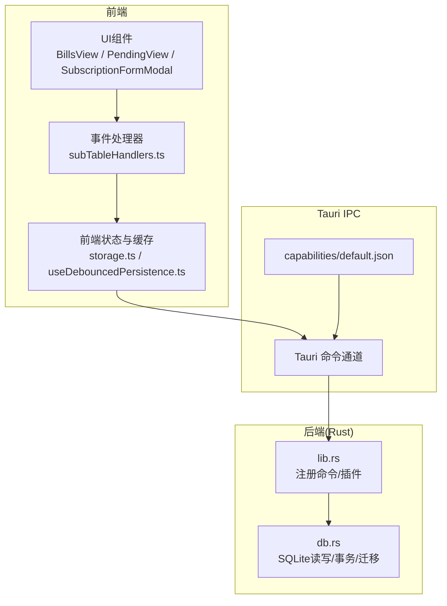
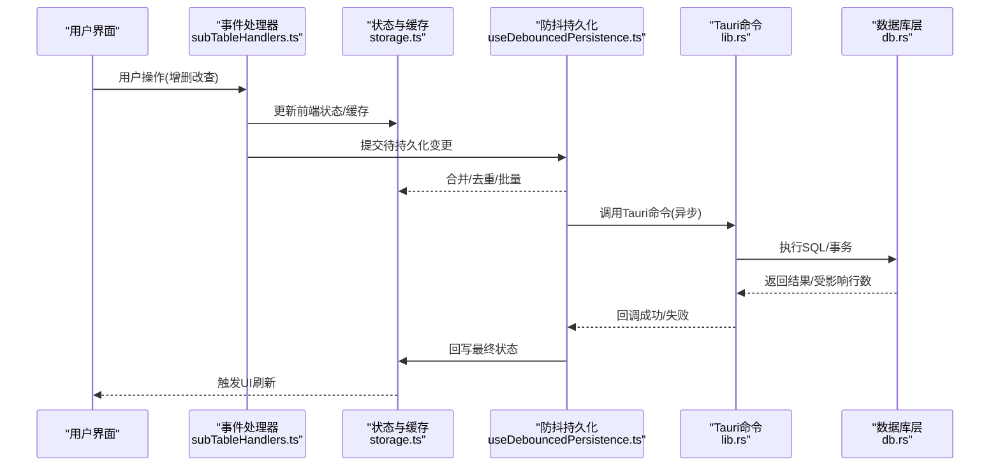
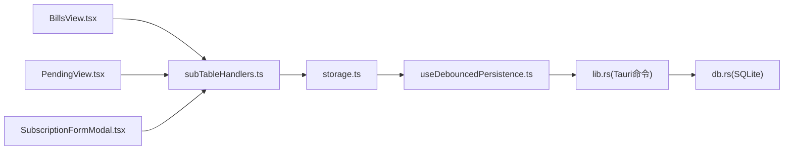
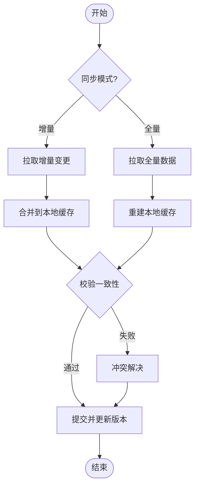

# 数据同步

<cite>
**本文引用的文件**   
- [apps/desktop/src-tauri/src/db.rs](file://apps/desktop/src-tauri/src/db.rs)
- [apps/desktop/src-tauri/src/lib.rs](file://apps/desktop/src-tauri/src/lib.rs)
- [apps/desktop/src-tauri/Cargo.toml](file://apps/desktop/src-tauri/Cargo.toml)
- [apps/desktop/src/storage.ts](file://apps/desktop/src/storage.ts)
- [apps/desktop/src/useDebouncedPersistence.ts](file://apps/desktop/src/useDebouncedPersistence.ts)
- [apps/desktop/src/subTableHandlers.ts](file://apps/desktop/src/subTableHandlers.ts)
- [apps/desktop/src/BillsView.tsx](file://apps/desktop/src/BillsView.tsx)
- [apps/desktop/src/PendingView.tsx](file://apps/desktop/src/PendingView.tsx)
- [apps/desktop/src/SubscriptionFormModal.tsx](file://apps/desktop/src/SubscriptionFormModal.tsx)
- [apps/desktop/src-tauri/capabilities/default.json](file://apps/desktop/src-tauri/capabilities/default.json)
</cite>

## 目录
1. [简介](#简介)
2. [项目结构](#项目结构)
3. [核心组件](#核心组件)
4. [架构总览](#架构总览)
5. [详细组件分析](#详细组件分析)
6. [依赖分析](#依赖分析)
7. [性能考虑](#性能考虑)
8. [故障排查指南](#故障排查指南)
9. [结论](#结论)
10. [附录](#附录)

## 简介
本文件面向“前端JavaScript状态与Rust后端SQLite数据库”的数据同步机制，围绕Tauri IPC通信协议，系统阐述异步数据获取与更新流程、数据一致性保证策略（冲突解决与版本控制）、增量与全量同步的实现方式、错误处理与重试机制，以及性能监控与优化建议。文档力求在技术细节与可读性之间取得平衡，帮助开发者快速理解并扩展该应用的持久化与同步能力。

## 项目结构
本项目采用Tauri架构：前端为React/TypeScript应用，后端为Rust模块，通过Tauri命令进行IPC通信；SQLite作为本地持久化存储。关键目录与职责如下：
- apps/desktop/src：前端页面、状态管理、表单交互、持久化与防抖写入等逻辑。
- apps/desktop/src-tauri/src：Rust侧的Tauri命令、数据库访问、OCR与监控等能力。
- packages/core：跨端共享的类型、工具函数与业务规则。
- capabilities：Tauri权限声明，控制前端对后端命令的调用范围。

图表来源
- [apps/desktop/src/BillsView.tsx](file://apps/desktop/src/BillsView.tsx)
- [apps/desktop/src/PendingView.tsx](file://apps/desktop/src/PendingView.tsx)
- [apps/desktop/src/SubscriptionFormModal.tsx](file://apps/desktop/src/SubscriptionFormModal.tsx)
- [apps/desktop/src/storage.ts](file://apps/desktop/src/storage.ts)
- [apps/desktop/src/useDebouncedPersistence.ts](file://apps/desktop/src/useDebouncedPersistence.ts)
- [apps/desktop/src/subTableHandlers.ts](file://apps/desktop/src/subTableHandlers.ts)
- [apps/desktop/src-tauri/src/lib.rs](file://apps/desktop/src-tauri/src/lib.rs)
- [apps/desktop/src-tauri/src/db.rs](file://apps/desktop/src-tauri/src/db.rs)
- [apps/desktop/src-tauri/capabilities/default.json](file://apps/desktop/src-tauri/capabilities/default.json)

章节来源
- [apps/desktop/src-tauri/src/lib.rs](file://apps/desktop/src-tauri/src/lib.rs)
- [apps/desktop/src-tauri/src/db.rs](file://apps/desktop/src-tauri/src/db.rs)
- [apps/desktop/src/storage.ts](file://apps/desktop/src/storage.ts)
- [apps/desktop/src/useDebouncedPersistence.ts](file://apps/desktop/src/useDebouncedPersistence.ts)
- [apps/desktop/src/subTableHandlers.ts](file://apps/desktop/src/subTableHandlers.ts)
- [apps/desktop/src/BillsView.tsx](file://apps/desktop/src/BillsView.tsx)
- [apps/desktop/src/PendingView.tsx](file://apps/desktop/src/PendingView.tsx)
- [apps/desktop/src/SubscriptionFormModal.tsx](file://apps/desktop/src/SubscriptionFormModal.tsx)
- [apps/desktop/src-tauri/capabilities/default.json](file://apps/desktop/src-tauri/capabilities/default.json)

## 核心组件
- 前端状态与缓存层
  - storage.ts：封装本地存储与内存缓存，提供读取/写入接口，负责与Tauri命令对接。
  - useDebouncedPersistence.ts：基于防抖的持久化策略，合并高频变更，降低IPC与DB压力。
  - subTableHandlers.ts：统一订阅/账单相关的前端操作入口，触发IPC调用与状态更新。
- Rust后端与数据库
  - lib.rs：注册Tauri命令，暴露给前端的API边界。
  - db.rs：SQLite连接、表结构、CRUD、事务与迁移等。
- 权限与配置
  - capabilities/default.json：声明前端可访问的命令与资源。

章节来源
- [apps/desktop/src/storage.ts](file://apps/desktop/src/storage.ts)
- [apps/desktop/src/useDebouncedPersistence.ts](file://apps/desktop/src/useDebouncedPersistence.ts)
- [apps/desktop/src/subTableHandlers.ts](file://apps/desktop/src/subTableHandlers.ts)
- [apps/desktop/src-tauri/src/lib.rs](file://apps/desktop/src-tauri/src/lib.rs)
- [apps/desktop/src-tauri/src/db.rs](file://apps/desktop/src-tauri/src/db.rs)
- [apps/desktop/src-tauri/capabilities/default.json](file://apps/desktop/src-tauri/capabilities/default.json)

## 架构总览
下图展示从UI到SQLite的完整数据流，包括Tauri IPC、前端缓存与防抖持久化、后端命令路由与数据库操作。

图表来源
- [apps/desktop/src/subTableHandlers.ts](file://apps/desktop/src/subTableHandlers.ts)
- [apps/desktop/src/storage.ts](file://apps/desktop/src/storage.ts)
- [apps/desktop/src/useDebouncedPersistence.ts](file://apps/desktop/src/useDebouncedPersistence.ts)
- [apps/desktop/src-tauri/src/lib.rs](file://apps/desktop/src-tauri/src/lib.rs)
- [apps/desktop/src-tauri/src/db.rs](file://apps/desktop/src-tauri/src/db.rs)

## 详细组件分析

### 前端状态与缓存(storage.ts)
- 职责
  - 维护内存中的订阅/账单数据快照，提供查询与更新接口。
  - 封装Tauri命令调用，将前端数据结构映射为后端期望格式。
  - 处理加载态、错误态与重试队列，保障用户体验。
- 设计要点
  - 读写分离：读优先走内存缓存，写走IPC+DB，再回填缓存。
  - 幂等性：同一键的多次写入合并，避免重复持久化。
  - 错误隔离：单个记录失败不影响整体列表加载。

章节来源
- [apps/desktop/src/storage.ts](file://apps/desktop/src/storage.ts)

### 防抖持久化(useDebouncedPersistence.ts)
- 职责
  - 对高频变更进行节流与合并，减少IPC与DB调用次数。
  - 支持批量提交与失败重试，提升吞吐与稳定性。
- 设计要点
  - 时间窗口内聚合变更，按主键去重。
  - 失败时退避重试，指数退避策略避免雪崩。
  - 完成回调中统一更新前端状态，确保UI一致。

章节来源
- [apps/desktop/src/useDebouncedPersistence.ts](file://apps/desktop/src/useDebouncedPersistence.ts)

### 事件处理器(subTableHandlers.ts)
- 职责
  - 统一订阅/账单相关的用户操作入口，协调状态更新与持久化。
  - 校验输入参数，构造请求体，调用storage层方法。
- 设计要点
  - 乐观更新：先更新UI，再异步落库，失败时回滚。
  - 错误上报：捕获异常并提示用户，必要时触发重试。

章节来源
- [apps/desktop/src/subTableHandlers.ts](file://apps/desktop/src/subTableHandlers.ts)

### Rust后端(lib.rs, db.rs)
- lib.rs
  - 注册Tauri命令，暴露给前端使用。
  - 初始化数据库连接与必要资源。
- db.rs
  - SQLite连接管理、表结构定义、索引与约束。
  - CRUD实现、事务封装、批量插入/更新。
  - 迁移脚本与版本管理。

章节来源
- [apps/desktop/src-tauri/src/lib.rs](file://apps/desktop/src-tauri/src/lib.rs)
- [apps/desktop/src-tauri/src/db.rs](file://apps/desktop/src-tauri/src/db.rs)

### 权限与配置(default.json)
- 声明前端可访问的命令集合，限制越权调用。
- 随构建产物注入，确保最小权限原则。

章节来源
- [apps/desktop/src-tauri/capabilities/default.json](file://apps/desktop/src-tauri/capabilities/default.json)

## 依赖分析
- 前端依赖
  - React/TSX组件依赖storage与handlers，通过Tauri命令与后端通信。
  - useDebouncedPersistence依赖storage提供的持久化接口。
- 后端依赖
  - lib.rs依赖db.rs提供的数据库能力。
  - Cargo.toml声明Rust依赖（如sqlite驱动、序列化库等）。

图表来源
- [apps/desktop/src/BillsView.tsx](file://apps/desktop/src/BillsView.tsx)
- [apps/desktop/src/PendingView.tsx](file://apps/desktop/src/PendingView.tsx)
- [apps/desktop/src/SubscriptionFormModal.tsx](file://apps/desktop/src/SubscriptionFormModal.tsx)
- [apps/desktop/src/subTableHandlers.ts](file://apps/desktop/src/subTableHandlers.ts)
- [apps/desktop/src/storage.ts](file://apps/desktop/src/storage.ts)
- [apps/desktop/src/useDebouncedPersistence.ts](file://apps/desktop/src/useDebouncedPersistence.ts)
- [apps/desktop/src-tauri/src/lib.rs](file://apps/desktop/src-tauri/src/lib.rs)
- [apps/desktop/src-tauri/src/db.rs](file://apps/desktop/src-tauri/src/db.rs)

章节来源
- [apps/desktop/src-tauri/Cargo.toml](file://apps/desktop/src-tauri/Cargo.toml)

## 性能考虑
- 前端
  - 使用防抖与批量合并减少IPC与DB调用频率。
  - 分页/懒加载列表数据，避免一次性渲染大量节点。
  - 缓存热点数据，缩短查询路径。
- 后端
  - 使用事务批量写入，减少锁竞争与IO开销。
  - 合理建索引，覆盖常用查询条件。
  - 连接池复用，避免频繁创建销毁连接。
- 监控
  - 埋点统计IPC往返耗时、DB执行耗时、失败率与重试次数。
  - 定期导出指标，定位瓶颈与异常峰值。

[本节为通用指导，不直接分析具体文件]

## 故障排查指南
- 常见问题
  - IPC超时或中断：检查网络/进程间通信是否被杀、权限是否正确。
  - 数据不一致：确认事务是否提交、是否存在并发写冲突。
  - 重复写入：检查防抖合并逻辑与去重键是否唯一。
- 排查步骤
  - 查看前端日志与错误堆栈，定位调用链。
  - 检查Tauri命令返回值与异常信息。
  - 核对SQLite日志与慢查询，验证索引有效性。
- 恢复策略
  - 自动重试：指数退避+最大重试次数。
  - 降级：失败时保留本地草稿，允许稍后重试。
  - 回滚：事务失败时回滚至上一稳定状态。

章节来源
- [apps/desktop/src/useDebouncedPersistence.ts](file://apps/desktop/src/useDebouncedPersistence.ts)
- [apps/desktop/src/storage.ts](file://apps/desktop/src/storage.ts)
- [apps/desktop/src-tauri/src/db.rs](file://apps/desktop/src-tauri/src/db.rs)

## 结论
本方案通过Tauri IPC桥接前端状态与SQLite数据库，结合防抖持久化与事务一致性，实现了高效、稳定的数据同步。建议在后续迭代中完善版本控制与冲突解决策略，引入增量同步与更细粒度的监控指标，进一步提升性能与可靠性。

[本节为总结，不直接分析具体文件]

## 附录

### 数据一致性保证策略
- 冲突解决
  - 以服务端/数据库时间为基准，合并字段级差异，必要时引入版本号或时间戳比较。
  - 对关键字段设置唯一约束，防止重复写入。
- 版本控制
  - 为每条记录维护version字段，更新时携带当前版本，后端校验并递增。
  - 冲突时返回冲突详情，前端提示用户选择合并策略。

[本节为概念说明，不直接分析具体文件]

### 增量同步与全量同步
- 增量同步
  - 基于时间戳或版本号拉取变更集，合并到本地缓存。
  - 适用于大数据量场景，减少带宽与CPU消耗。
- 全量同步
  - 定期或首次启动时拉取全量数据，重建本地缓存。
  - 适用于小数据集或需要强一致的场景。

[本图为概念流程图，不直接映射具体文件]

### 错误处理与重试机制
- 前端
  - 捕获IPC异常，记录上下文，触发重试队列。
  - 失败时显示友好提示，支持手动重试。
- 后端
  - 捕获DB异常，返回结构化错误码与消息。
  - 对可重试错误实施指数退避。

章节来源
- [apps/desktop/src/useDebouncedPersistence.ts](file://apps/desktop/src/useDebouncedPersistence.ts)
- [apps/desktop/src/storage.ts](file://apps/desktop/src/storage.ts)
- [apps/desktop/src-tauri/src/db.rs](file://apps/desktop/src-tauri/src/db.rs)

### 性能监控与优化建议
- 监控指标
  - IPC往返耗时、DB执行耗时、失败率、重试次数、缓存命中率。
- 优化建议
  - 前端：虚拟滚动、分页加载、缓存预热。
  - 后端：批处理、索引优化、连接池调优。
  - 传输：压缩载荷、减少冗余字段。

[本节为通用指导，不直接分析具体文件]