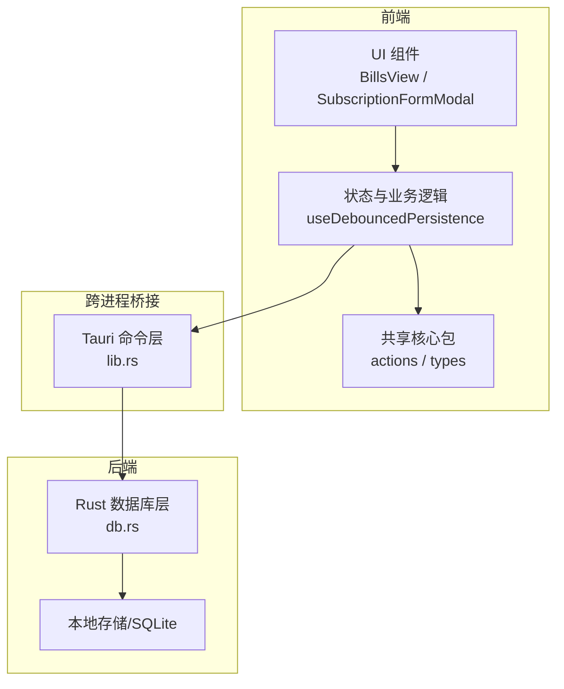
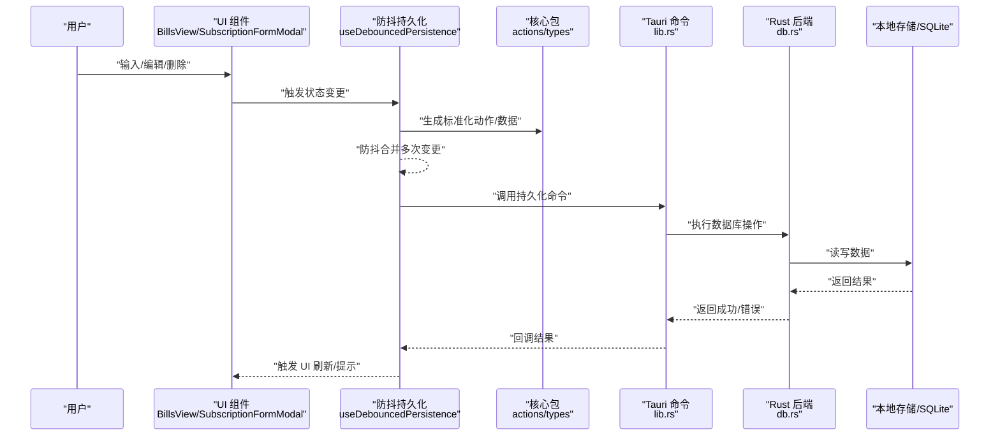
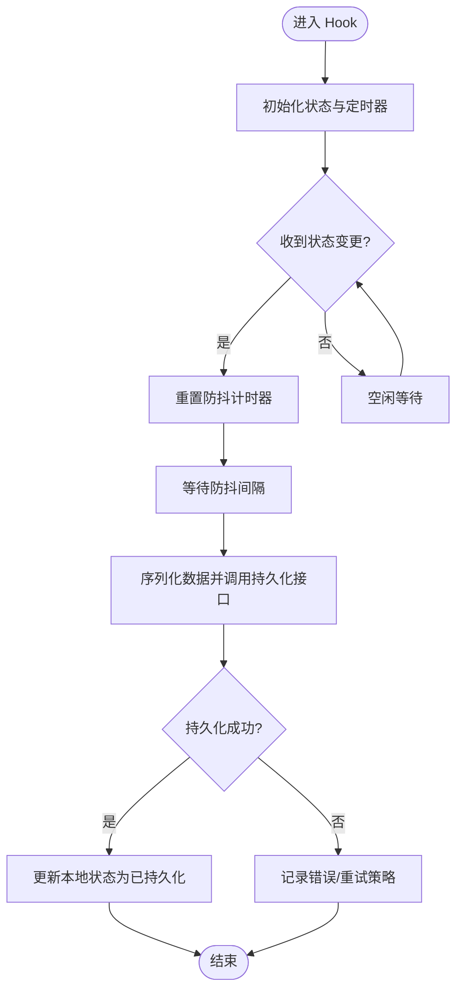
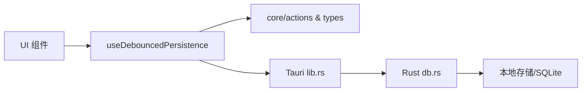

# 数据流架构

<cite>
**本文引用的文件**   
- [apps/desktop/src/useDebouncedPersistence.ts](file://apps/desktop/src/useDebouncedPersistence.ts)
- [apps/desktop/src/storage.ts](file://apps/desktop/src/storage.ts)
- [apps/desktop/src-tauri/src/db.rs](file://apps/desktop/src-tauri/src/db.rs)
- [apps/desktop/src-tauri/src/lib.rs](file://apps/desktop/src-tauri/src/lib.rs)
- [apps/desktop/src/BillsView.tsx](file://apps/desktop/src/BillsView.tsx)
- [apps/desktop/src/SubscriptionFormModal.tsx](file://apps/desktop/src/SubscriptionFormModal.tsx)
- [packages/core/src/actions.ts](file://packages/core/src/actions.ts)
- [packages/core/src/types.ts](file://packages/core/src/types.ts)
</cite>

## 目录
1. [简介](#简介)
2. [项目结构](#项目结构)
3. [核心组件](#核心组件)
4. [架构总览](#架构总览)
5. [详细组件分析](#详细组件分析)
6. [依赖关系分析](#依赖关系分析)
7. [性能考量](#性能考量)
8. [故障排查指南](#故障排查指南)
9. [结论](#结论)
10. [附录](#附录)

## 简介
本文件面向订阅管理桌面应用的数据流架构，聚焦从用户界面到 Rust 后端数据库的完整数据流向。文档涵盖：
- 前端状态管理与 UI 事件触发
- 使用 useDebouncedPersistence 实现防抖持久化策略
- 与 Tauri/Rust 后端的通信与数据库写入
- 缓存策略、数据一致性与同步时机
- 关键数据转换点与同步流程的可视化

## 项目结构
本项目采用前后端分离的桌面应用架构：
- 前端（React + TypeScript）负责 UI、状态管理与交互逻辑
- 共享包（packages/core）提供类型定义、动作与工具函数
- 后端（Tauri + Rust）提供本地数据库访问能力

**图表来源** 
- [apps/desktop/src/BillsView.tsx](file://apps/desktop/src/BillsView.tsx)
- [apps/desktop/src/SubscriptionFormModal.tsx](file://apps/desktop/src/SubscriptionFormModal.tsx)
- [apps/desktop/src/useDebouncedPersistence.ts](file://apps/desktop/src/useDebouncedPersistence.ts)
- [packages/core/src/actions.ts](file://packages/core/src/actions.ts)
- [apps/desktop/src-tauri/src/lib.rs](file://apps/desktop/src-tauri/src/lib.rs)
- [apps/desktop/src-tauri/src/db.rs](file://apps/desktop/src-tauri/src/db.rs)

**章节来源**
- [apps/desktop/src/BillsView.tsx](file://apps/desktop/src/BillsView.tsx)
- [apps/desktop/src/SubscriptionFormModal.tsx](file://apps/desktop/src/SubscriptionFormModal.tsx)
- [apps/desktop/src/useDebouncedPersistence.ts](file://apps/desktop/src/useDebouncedPersistence.ts)
- [packages/core/src/actions.ts](file://packages/core/src/actions.ts)
- [apps/desktop/src-tauri/src/lib.rs](file://apps/desktop/src-tauri/src/lib.rs)
- [apps/desktop/src-tauri/src/db.rs](file://apps/desktop/src-tauri/src/db.rs)

## 核心组件
- 前端 UI 组件：账单列表与订阅表单等，负责收集用户输入并触发状态更新
- 防抖持久化 Hook：useDebouncedPersistence，聚合多次变更，延迟落盘，降低 I/O 频率
- 共享核心包：统一类型与动作，确保前后端数据结构一致性
- Tauri 命令层：暴露给前端的异步接口，转发请求到 Rust 后端
- Rust 数据库层：封装 SQL 操作，保证事务与一致性

**章节来源**
- [apps/desktop/src/useDebouncedPersistence.ts](file://apps/desktop/src/useDebouncedPersistence.ts)
- [packages/core/src/types.ts](file://packages/core/src/types.ts)
- [packages/core/src/actions.ts](file://packages/core/src/actions.ts)
- [apps/desktop/src-tauri/src/lib.rs](file://apps/desktop/src-tauri/src/lib.rs)
- [apps/desktop/src-tauri/src/db.rs](file://apps/desktop/src-tauri/src/db.rs)

## 架构总览
下图展示从 UI 事件到数据库更新的端到端数据流，包括防抖、序列化、跨进程调用与持久化。

**图表来源** 
- [apps/desktop/src/BillsView.tsx](file://apps/desktop/src/BillsView.tsx)
- [apps/desktop/src/SubscriptionFormModal.tsx](file://apps/desktop/src/SubscriptionFormModal.tsx)
- [apps/desktop/src/useDebouncedPersistence.ts](file://apps/desktop/src/useDebouncedPersistence.ts)
- [packages/core/src/actions.ts](file://packages/core/src/actions.ts)
- [apps/desktop/src-tauri/src/lib.rs](file://apps/desktop/src-tauri/src/lib.rs)
- [apps/desktop/src-tauri/src/db.rs](file://apps/desktop/src-tauri/src/db.rs)

## 详细组件分析

### 防抖持久化 Hook（useDebouncedPersistence）
职责与行为：
- 接收状态与配置（如防抖延迟、持久化键名、是否启用持久化）
- 维护本地内存状态，合并短时间内多次变更
- 在防抖窗口结束后，将变更序列化为稳定格式并调用持久化接口
- 处理失败重试与错误回滚，保证 UI 与存储的一致性

典型流程：

**图表来源** 
- [apps/desktop/src/useDebouncedPersistence.ts](file://apps/desktop/src/useDebouncedPersistence.ts)

**章节来源**
- [apps/desktop/src/useDebouncedPersistence.ts](file://apps/desktop/src/useDebouncedPersistence.ts)

### 前端 UI 组件（BillsView / SubscriptionFormModal）
职责与行为：
- 渲染账单列表与订阅表单，响应用户输入
- 通过受控或半受控模式驱动状态变化
- 调用防抖持久化 Hook 提交变更，避免频繁 I/O

交互要点：
- 表单字段变更 -> 更新局部状态 -> 触发防抖持久化
- 批量操作（多选删除/导入）-> 合并为一次持久化
- 错误反馈 -> 显示 Toast/Modal，允许撤销或修正

**章节来源**
- [apps/desktop/src/BillsView.tsx](file://apps/desktop/src/BillsView.tsx)
- [apps/desktop/src/SubscriptionFormModal.tsx](file://apps/desktop/src/SubscriptionFormModal.tsx)

### 共享核心包（actions / types）
职责与行为：
- 定义统一的数据模型与动作类型，确保前后端契约一致
- 提供数据规范化与校验工具，减少脏数据进入持久化层
- 在前端与后端之间作为“协议”参考，便于调试与测试

关键点：
- 类型约束：金额、日期、分类、订阅周期等
- 动作语义：新增、更新、删除、批量操作
- 数据归一化：去除冗余字段、统一格式

**章节来源**
- [packages/core/src/actions.ts](file://packages/core/src/actions.ts)
- [packages/core/src/types.ts](file://packages/core/src/types.ts)

### Tauri 命令层（lib.rs）
职责与行为：
- 暴露异步命令供前端调用（如保存账单、查询列表）
- 参数校验与错误包装，向上返回结构化结果
- 路由到 Rust 后端的具体实现

调用约定：
- 命名空间清晰，避免冲突
- 错误码与消息统一，便于前端处理

**章节来源**
- [apps/desktop/src-tauri/src/lib.rs](file://apps/desktop/src-tauri/src/lib.rs)

### Rust 数据库层（db.rs）
职责与行为：
- 封装 SQL 操作，支持事务、索引与并发控制
- 提供增删改查接口，保证数据完整性与一致性
- 与 Tauri 命令层对接，返回结果或错误

一致性保障：
- 事务包裹批量写入
- 外键约束与唯一性检查
- 失败回滚与日志记录

**章节来源**
- [apps/desktop/src-tauri/src/db.rs](file://apps/desktop/src-tauri/src/db.rs)

## 依赖关系分析

**图表来源** 
- [apps/desktop/src/BillsView.tsx](file://apps/desktop/src/BillsView.tsx)
- [apps/desktop/src/SubscriptionFormModal.tsx](file://apps/desktop/src/SubscriptionFormModal.tsx)
- [apps/desktop/src/useDebouncedPersistence.ts](file://apps/desktop/src/useDebouncedPersistence.ts)
- [packages/core/src/actions.ts](file://packages/core/src/actions.ts)
- [apps/desktop/src-tauri/src/lib.rs](file://apps/desktop/src-tauri/src/lib.rs)
- [apps/desktop/src-tauri/src/db.rs](file://apps/desktop/src-tauri/src/db.rs)

**章节来源**
- [apps/desktop/src/useDebouncedPersistence.ts](file://apps/desktop/src/useDebouncedPersistence.ts)
- [packages/core/src/actions.ts](file://packages/core/src/actions.ts)
- [apps/desktop/src-tauri/src/lib.rs](file://apps/desktop/src-tauri/src/lib.rs)
- [apps/desktop/src-tauri/src/db.rs](file://apps/desktop/src-tauri/src/db.rs)

## 性能考量
- 防抖策略：合理设置延迟时间，平衡实时性与 I/O 压力
- 批量合并：对连续编辑进行合并，减少重复写入
- 懒加载：列表分页与按需加载，避免一次性渲染大量数据
- 缓存策略：内存缓存热点数据，配合失效策略与版本控制
- 事务优化：批量写入使用事务，减少锁竞争与磁盘抖动

[本节为通用指导，不直接分析具体文件]

## 故障排查指南
常见问题与定位方法：
- 持久化失败：检查防抖 Hook 的错误回调与重试逻辑
- 数据不一致：核对 core 类型定义与 Rust 模型映射
- 跨进程错误：查看 Tauri 命令返回值与日志
- 数据库异常：检查事务回滚、外键约束与索引

建议步骤：
- 打开开发者工具，观察网络/命令调用链
- 打印防抖队列与合并后的最终数据
- 验证 Rust 层日志与数据库状态
- 复现最小用例，逐步缩小问题范围

**章节来源**
- [apps/desktop/src/useDebouncedPersistence.ts](file://apps/desktop/src/useDebouncedPersistence.ts)
- [apps/desktop/src-tauri/src/lib.rs](file://apps/desktop/src-tauri/src/lib.rs)
- [apps/desktop/src-tauri/src/db.rs](file://apps/desktop/src-tauri/src/db.rs)

## 结论
本数据流架构通过防抖持久化、统一类型契约与 Tauri 桥接，实现了高效、可靠的前后端数据同步。UI 事件经状态管理与数据规范化后，以批量化方式写入 Rust 数据库，结合事务与约束保证一致性。建议在后续迭代中持续优化防抖策略、缓存失效与错误恢复机制，以提升用户体验与系统稳定性。

[本节为总结性内容，不直接分析具体文件]

## 附录
- 术语说明
  - 防抖（Debounce）：在一段时间内合并多次触发，仅执行最后一次
  - 持久化（Persistence）：将内存状态写入本地存储
  - 事务（Transaction）：一组操作的原子执行，要么全部成功，要么全部回滚
- 最佳实践
  - 始终对输入进行校验与归一化
  - 使用统一错误码与可观测日志
  - 对关键路径添加单元测试与集成测试

[本节为补充信息，不直接分析具体文件]