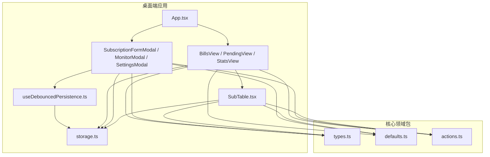
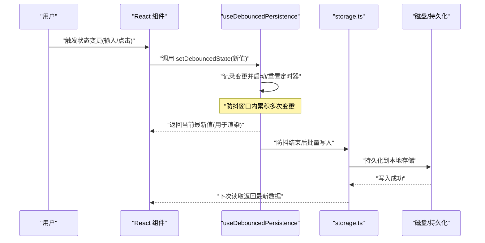
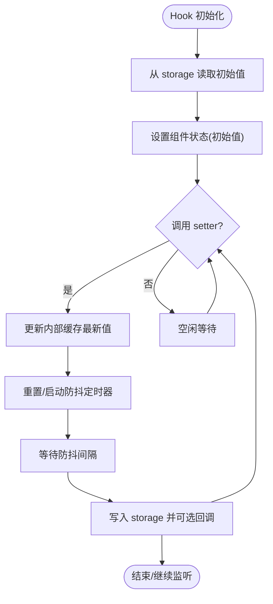
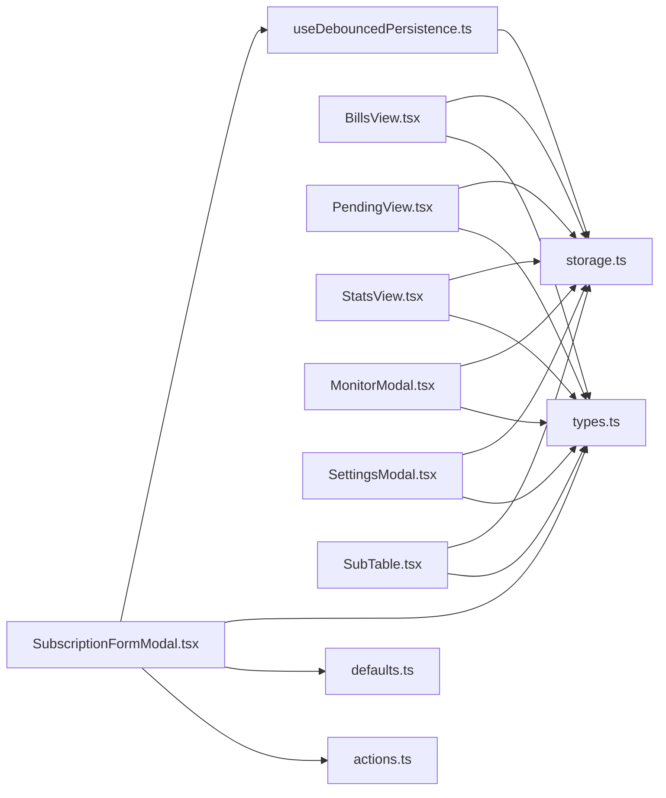

# 状态管理

<cite>
**本文引用的文件**   
- [useDebouncedPersistence.ts](file://apps/desktop/src/useDebouncedPersistence.ts)
- [useDebouncedPersistence.test.ts](file://apps/desktop/src/useDebouncedPersistence.test.ts)
- [storage.ts](file://apps/desktop/src/storage.ts)
- [storage.test.ts](file://apps/desktop/src/storage.test.ts)
- [App.tsx](file://apps/desktop/src/App.tsx)
- [main.tsx](file://apps/desktop/src/main.tsx)
- [SubscriptionFormModal.tsx](file://apps/desktop/src/SubscriptionFormModal.tsx)
- [BillsView.tsx](file://apps/desktop/src/BillsView.tsx)
- [PendingView.tsx](file://apps/desktop/src/PendingView.tsx)
- [StatsView.tsx](file://apps/desktop/src/StatsView.tsx)
- [MonitorModal.tsx](file://apps/desktop/src/MonitorModal.tsx)
- [SettingsModal.tsx](file://apps/desktop/src/SettingsModal.tsx)
- [SubTable.tsx](file://apps/desktop/src/SubTable.tsx)
- [subscriptionFields.ts](file://apps/desktop/src/subscriptionFields.ts)
- [actions.ts](file://packages/core/src/actions.ts)
- [defaults.ts](file://packages/core/src/defaults.ts)
- [types.ts](file://packages/core/src/types.ts)
</cite>

## 目录
1. [简介](#简介)
2. [项目结构](#项目结构)
3. [核心组件与能力](#核心组件与能力)
4. [架构总览](#架构总览)
5. [详细组件分析](#详细组件分析)
6. [依赖关系分析](#依赖关系分析)
7. [性能考量](#性能考量)
8. [故障排查指南](#故障排查指南)
9. [结论](#结论)
10. [附录：使用示例与最佳实践](#附录使用示例与最佳实践)

## 简介
本文件面向前端应用的状态管理机制，聚焦以下目标：
- 解释 React 组件内状态与全局状态的职责边界与协作方式。
- 说明持久化策略与“防抖持久化”的实现原理，避免频繁写入导致的性能问题。
- 描述状态变更的触发机制、响应式更新流程以及跨组件同步策略。
- 提供可操作的最佳实践与性能优化建议，并给出在组件中使用状态管理的示例路径。

## 项目结构
本项目采用多包（monorepo）结构，桌面端应用位于 apps/desktop，核心领域逻辑位于 packages/core。状态管理主要分布在：
- 组件层：各页面与模态框维护局部 UI 状态与表单状态。
- 数据层：通过 storage.ts 统一读写本地存储；通过 useDebouncedPersistence 实现带防抖的持久化。
- 领域层：core 包提供类型、默认值、动作与数据转换等通用能力，供上层复用。

图表来源
- [App.tsx:1-200](file://apps/desktop/src/App.tsx#L1-L200)
- [BillsView.tsx:1-200](file://apps/desktop/src/BillsView.tsx#L1-L200)
- [PendingView.tsx:1-200](file://apps/desktop/src/PendingView.tsx#L1-L200)
- [StatsView.tsx:1-200](file://apps/desktop/src/StatsView.tsx#L1-L200)
- [SubscriptionFormModal.tsx:1-200](file://apps/desktop/src/SubscriptionFormModal.tsx#L1-L200)
- [MonitorModal.tsx:1-200](file://apps/desktop/src/MonitorModal.tsx#L1-L200)
- [SettingsModal.tsx:1-200](file://apps/desktop/src/SettingsModal.tsx#L1-L200)
- [SubTable.tsx:1-200](file://apps/desktop/src/SubTable.tsx#L1-L200)
- [useDebouncedPersistence.ts:1-200](file://apps/desktop/src/useDebouncedPersistence.ts#L1-L200)
- [storage.ts:1-200](file://apps/desktop/src/storage.ts#L1-L200)
- [types.ts:1-200](file://packages/core/src/types.ts#L1-L200)
- [defaults.ts:1-200](file://packages/core/src/defaults.ts#L1-L200)
- [actions.ts:1-200](file://packages/core/src/actions.ts#L1-L200)

章节来源
- [App.tsx:1-200](file://apps/desktop/src/App.tsx#L1-L200)
- [main.tsx:1-100](file://apps/desktop/src/main.tsx#L1-L100)

## 核心组件与能力
- 组件级状态：表单输入、弹窗显隐、选中项、分页/筛选等由各自组件通过 useState/useReducer 管理。
- 全局状态：业务数据（订阅、账单、统计等）通过 storage.ts 提供的读写接口进行持久化，并在需要时结合 useDebouncedPersistence 减少 I/O 频率。
- 领域模型与动作：core 包的 types.ts、defaults.ts、actions.ts 提供统一的类型定义、默认值与数据转换/校验动作，确保状态一致性。

章节来源
- [types.ts:1-200](file://packages/core/src/types.ts#L1-L200)
- [defaults.ts:1-200](file://packages/core/src/defaults.ts#L1-L200)
- [actions.ts:1-200](file://packages/core/src/actions.ts#L1-L200)
- [storage.ts:1-200](file://apps/desktop/src/storage.ts#L1-L200)

## 架构总览
整体状态流遵循“组件驱动 + 持久化缓冲”的模式：
- 用户交互触发组件状态变化。
- 组件将关键业务数据通过 storage.ts 写入本地存储。
- 使用 useDebouncedPersistence 对高频写操作进行防抖，合并多次变更后再落盘，降低 I/O 压力。
- 其他组件读取 storage.ts 的数据，保持视图与数据一致。

图表来源
- [useDebouncedPersistence.ts:1-200](file://apps/desktop/src/useDebouncedPersistence.ts#L1-L200)
- [storage.ts:1-200](file://apps/desktop/src/storage.ts#L1-L200)

## 详细组件分析

### useDebouncedPersistence 自定义 Hook
该 Hook 的核心目标是：
- 为任意键值对提供“最近一次值立即反映到 UI”的能力。
- 将实际持久化操作延迟到一段防抖时间后执行，避免频繁 I/O。
- 支持在组件卸载或依赖变化时清理定时器，防止内存泄漏。

典型行为：
- 首次加载从 storage 读取初始值。
- 每次调用 setter 时，更新内部缓存的最新值并重置定时器。
- 定时器到期后，将最新值写入 storage，并可选择回调通知。

图表来源
- [useDebouncedPersistence.ts:1-200](file://apps/desktop/src/useDebouncedPersistence.ts#L1-L200)

章节来源
- [useDebouncedPersistence.ts:1-200](file://apps/desktop/src/useDebouncedPersistence.ts#L1-L200)
- [useDebouncedPersistence.test.ts:1-200](file://apps/desktop/src/useDebouncedPersistence.test.ts#L1-L200)

### storage.ts 持久化层
- 提供统一的 get/set 接口，封装底层存储细节（如 localStorage/IndexedDB）。
- 保证数据类型安全与错误处理，便于上层直接调用。
- 与 useDebouncedPersistence 配合，仅在防抖结束后才真正落盘。

章节来源
- [storage.ts:1-200](file://apps/desktop/src/storage.ts#L1-L200)
- [storage.test.ts:1-200](file://apps/desktop/src/storage.test.ts#L1-L200)

### 组件中的状态使用模式
- 表单类组件（如 SubscriptionFormModal）：使用 useState 管理字段，提交前合并校验，再通过 storage 写入。
- 列表类组件（如 BillsView、PendingView、SubTable）：从 storage 读取数据，渲染表格；编辑后触发防抖持久化。
- 统计与监控（StatsView、MonitorModal）：读取聚合后的数据，展示趋势与告警。
- 设置（SettingsModal）：保存用户偏好，通常低频写入，可直接落盘或使用防抖。

章节来源
- [SubscriptionFormModal.tsx:1-200](file://apps/desktop/src/SubscriptionFormModal.tsx#L1-L200)
- [BillsView.tsx:1-200](file://apps/desktop/src/BillsView.tsx#L1-L200)
- [PendingView.tsx:1-200](file://apps/desktop/src/PendingView.tsx#L1-L200)
- [StatsView.tsx:1-200](file://apps/desktop/src/StatsView.tsx#L1-L200)
- [MonitorModal.tsx:1-200](file://apps/desktop/src/MonitorModal.tsx#L1-L200)
- [SettingsModal.tsx:1-200](file://apps/desktop/src/SettingsModal.tsx#L1-L200)
- [SubTable.tsx:1-200](file://apps/desktop/src/SubTable.tsx#L1-L200)

### 领域模型与动作（core 包）
- types.ts：统一定义订阅、账单、统计等数据结构，确保前后端与模块间类型一致。
- defaults.ts：提供默认值工厂，避免空对象与未初始化状态。
- actions.ts：提供数据转换、校验、合并等动作函数，保证状态变更的可预测性。

章节来源
- [types.ts:1-200](file://packages/core/src/types.ts#L1-L200)
- [defaults.ts:1-200](file://packages/core/src/defaults.ts#L1-L200)
- [actions.ts:1-200](file://packages/core/src/actions.ts#L1-L200)

## 依赖关系分析
- 组件依赖 storage 进行数据存取。
- useDebouncedPersistence 依赖 storage 与定时器 API。
- 组件与 core 包通过类型与动作函数解耦，便于测试与复用。

图表来源
- [SubscriptionFormModal.tsx:1-200](file://apps/desktop/src/SubscriptionFormModal.tsx#L1-L200)
- [BillsView.tsx:1-200](file://apps/desktop/src/BillsView.tsx#L1-L200)
- [PendingView.tsx:1-200](file://apps/desktop/src/PendingView.tsx#L1-L200)
- [StatsView.tsx:1-200](file://apps/desktop/src/StatsView.tsx#L1-L200)
- [MonitorModal.tsx:1-200](file://apps/desktop/src/MonitorModal.tsx#L1-L200)
- [SettingsModal.tsx:1-200](file://apps/desktop/src/SettingsModal.tsx#L1-L200)
- [SubTable.tsx:1-200](file://apps/desktop/src/SubTable.tsx#L1-L200)
- [useDebouncedPersistence.ts:1-200](file://apps/desktop/src/useDebouncedPersistence.ts#L1-L200)
- [storage.ts:1-200](file://apps/desktop/src/storage.ts#L1-L200)
- [types.ts:1-200](file://packages/core/src/types.ts#L1-L200)
- [defaults.ts:1-200](file://packages/core/src/defaults.ts#L1-L200)
- [actions.ts:1-200](file://packages/core/src/actions.ts#L1-L200)

## 性能考量
- 防抖持久化：对高频输入（如表单实时保存）使用 useDebouncedPersistence，显著减少 I/O 次数。
- 最小化重渲染：仅将必要数据放入 state，使用 memoization（如 useMemo/useCallback）避免不必要的子树更新。
- 批量更新：在复杂表单中，优先合并多个字段变更后再触发持久化。
- 懒加载与分页：大数据集按需加载，避免一次性渲染过多节点。
- 错误与降级：当持久化失败时，保留内存最新值并提供重试机制，保障用户体验。

[本节为通用指导，不直接分析具体文件]

## 故障排查指南
常见问题与定位方法：
- 数据未持久化：检查 storage 写入是否被异常中断；确认 useDebouncedPersistence 的定时器是否被正确清理。
- 界面不同步：确认组件读取的是 storage 的最新值；检查是否存在多处状态源导致不一致。
- 性能抖动：观察是否有高频 setter 调用；适当增大防抖间隔或改为批量提交。
- 类型错误：核对 core 包的类型定义，确保传入数据符合 schema。

章节来源
- [useDebouncedPersistence.test.ts:1-200](file://apps/desktop/src/useDebouncedPersistence.test.ts#L1-L200)
- [storage.test.ts:1-200](file://apps/desktop/src/storage.test.ts#L1-L200)

## 结论
本项目的状态管理以“组件状态 + 持久化缓冲”为核心，通过 useDebouncedPersistence 有效平衡了即时反馈与 I/O 开销。结合 core 包的类型与动作，保证了数据的一致性与可维护性。建议在新增功能时沿用此模式，并持续优化防抖策略与渲染路径。

[本节为总结，不直接分析具体文件]

## 附录：使用示例与最佳实践

### 在组件中使用 useDebouncedPersistence
- 适用场景：表单实时保存、列表项编辑、设置项修改等高频写操作。
- 步骤要点：
  - 引入 Hook，指定存储键名与默认值。
  - 使用 Hook 返回的 setter 更新状态，UI 立即反映最新值。
  - 防抖结束后自动写入 storage，无需手动调用。
- 参考路径：
  - [useDebouncedPersistence.ts:1-200](file://apps/desktop/src/useDebouncedPersistence.ts#L1-L200)
  - [useDebouncedPersistence.test.ts:1-200](file://apps/desktop/src/useDebouncedPersistence.test.ts#L1-L200)

### 在表单组件中集成状态管理
- 推荐做法：
  - 使用 useState 管理字段，提交前用 core 的动作函数进行校验与转换。
  - 对关键字段启用 useDebouncedPersistence，非关键字段可延迟保存。
- 参考路径：
  - [SubscriptionFormModal.tsx:1-200](file://apps/desktop/src/SubscriptionFormModal.tsx#L1-L200)
  - [subscriptionFields.ts:1-200](file://apps/desktop/src/subscriptionFields.ts#L1-L200)
  - [actions.ts:1-200](file://packages/core/src/actions.ts#L1-L200)

### 列表与表格的状态同步
- 推荐做法：
  - 从 storage 读取数据渲染表格，编辑行时更新内存状态并触发防抖持久化。
  - 使用 key 与稳定索引避免不必要的重排。
- 参考路径：
  - [BillsView.tsx:1-200](file://apps/desktop/src/BillsView.tsx#L1-L200)
  - [SubTable.tsx:1-200](file://apps/desktop/src/SubTable.tsx#L1-L200)
  - [storage.ts:1-200](file://apps/desktop/src/storage.ts#L1-L200)

### 最佳实践清单
- 单一数据源：关键业务数据只通过 storage 读写，避免分散状态。
- 类型先行：所有状态变更遵循 core 的类型定义，减少运行时错误。
- 防抖粒度：按字段重要性配置不同的防抖策略，平衡体验与性能。
- 错误恢复：持久化失败时保留内存最新值，并提供重试入口。
- 可测试性：为 Hook 与存储层编写单元测试，覆盖边界条件。

[本节为实践指导，不直接分析具体文件]