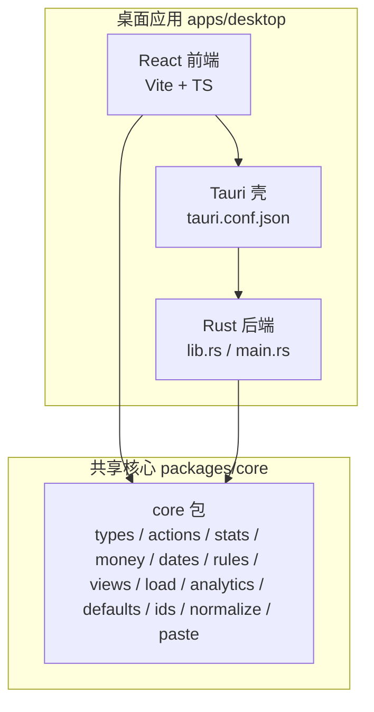
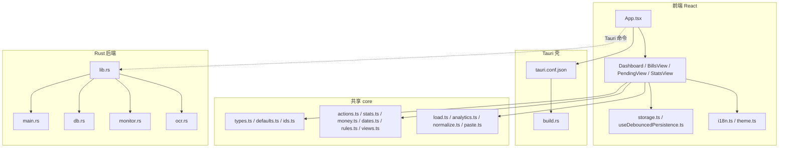
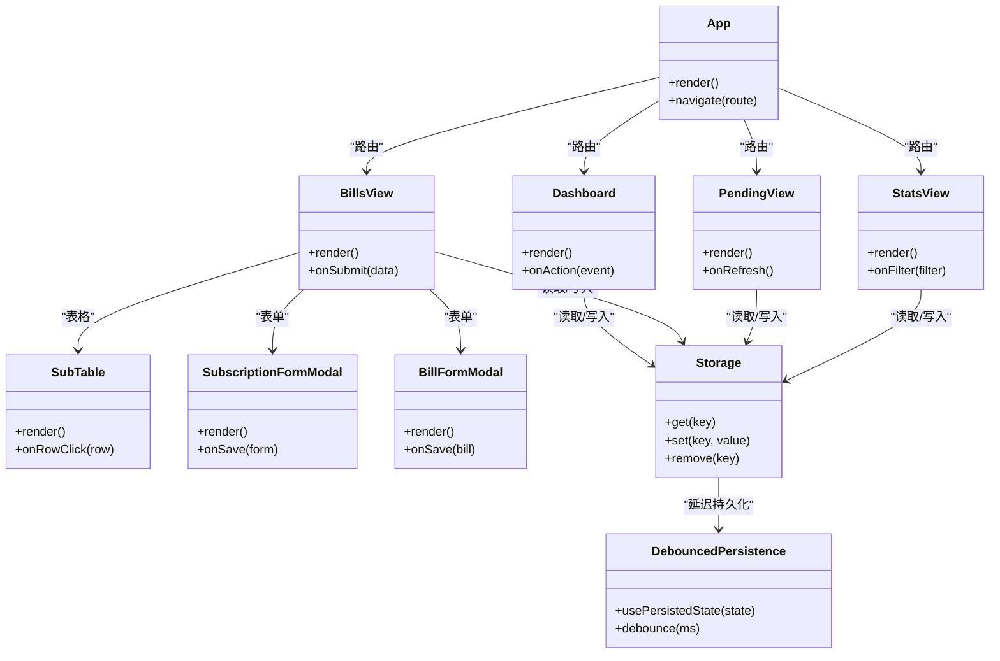
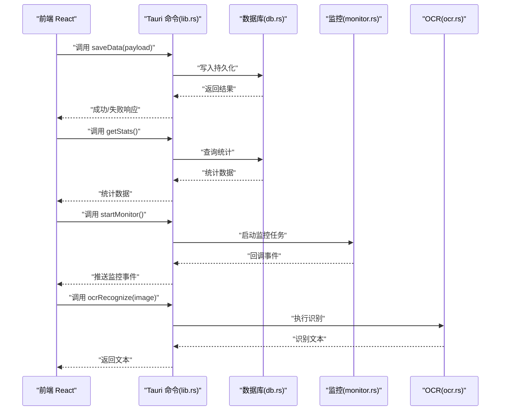
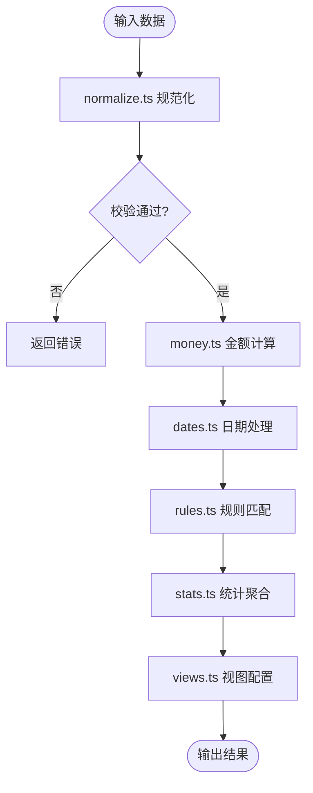
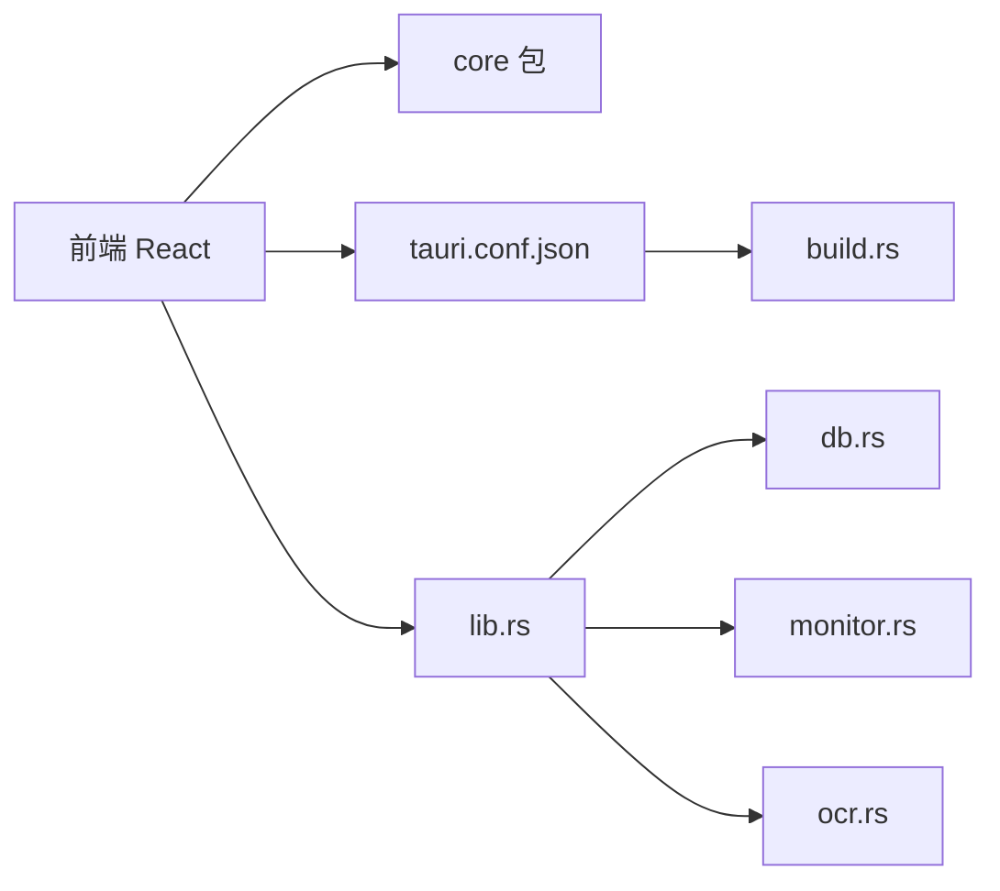

# 整体架构设计

<cite>
**本文引用的文件**   
- [apps/desktop/src/App.tsx](file://apps/desktop/src/App.tsx)
- [apps/desktop/src/main.tsx](file://apps/desktop/src/main.tsx)
- [apps/desktop/src/storage.ts](file://apps/desktop/src/storage.ts)
- [apps/desktop/src/useDebouncedPersistence.ts](file://apps/desktop/src/useDebouncedPersistence.ts)
- [apps/desktop/src/Dashboard.tsx](file://apps/desktop/src/Dashboard.tsx)
- [apps/desktop/src/BillsView.tsx](file://apps/desktop/src/BillsView.tsx)
- [apps/desktop/src/PendingView.tsx](file://apps/desktop/src/PendingView.tsx)
- [apps/desktop/src/StatsView.tsx](file://apps/desktop/src/StatsView.tsx)
- [apps/desktop/src/subTableHandlers.ts](file://apps/desktop/src/subTableHandlers.ts)
- [apps/desktop/src/i18n.ts](file://apps/desktop/src/i18n.ts)
- [apps/desktop/src/theme.ts](file://apps/desktop/src/theme.ts)
- [apps/desktop/package.json](file://apps/desktop/package.json)
- [apps/desktop/vite.config.ts](file://apps/desktop/vite.config.ts)
- [apps/desktop/src-tauri/Cargo.toml](file://apps/desktop/src-tauri/Cargo.toml)
- [apps/desktop/src-tauri/tauri.conf.json](file://apps/desktop/src-tauri/tauri.conf.json)
- [apps/desktop/src-tauri/build.rs](file://apps/desktop/src-tauri/build.rs)
- [apps/desktop/src-tauri/src/lib.rs](file://apps/desktop/src-tauri/src/lib.rs)
- [apps/desktop/src-tauri/src/main.rs](file://apps/desktop/src-tauri/src/main.rs)
- [apps/desktop/src-tauri/src/db.rs](file://apps/desktop/src-tauri/src/db.rs)
- [apps/desktop/src-tauri/src/monitor.rs](file://apps/desktop/src-tauri/src/monitor.rs)
- [apps/desktop/src-tauri/src/ocr.rs](file://apps/desktop/src-tauri/src/ocr.rs)
- [packages/core/src/index.ts](file://packages/core/src/index.ts)
- [packages/core/src/types.ts](file://packages/core/src/types.ts)
- [packages/core/src/actions.ts](file://packages/core/src/actions.ts)
- [packages/core/src/stats.ts](file://packages/core/src/stats.ts)
- [packages/core/src/money.ts](file://packages/core/src/money.ts)
- [packages/core/src/dates.ts](file://packages/core/src/dates.ts)
- [packages/core/src/rules.ts](file://packages/core/src/rules.ts)
- [packages/core/src/views.ts](file://packages/core/src/views.ts)
- [packages/core/src/load.ts](file://packages/core/src/load.ts)
- [packages/core/src/analytics.ts](file://packages/core/src/analytics.ts)
- [packages/core/src/defaults.ts](file://packages/core/src/defaults.ts)
- [packages/core/src/ids.ts](file://packages/core/src/ids.ts)
- [packages/core/src/normalize.ts](file://packages/core/src/normalize.ts)
- [packages/core/src/paste.ts](file://packages/core/src/paste.ts)
</cite>

## 目录
1. [简介](#简介)
2. [项目结构](#项目结构)
3. [核心组件](#核心组件)
4. [架构总览](#架构总览)
5. [详细组件分析](#详细组件分析)
6. [依赖关系分析](#依赖关系分析)
7. [性能考量](#性能考量)
8. [故障排查指南](#故障排查指南)
9. [结论](#结论)
10. [附录](#附录)

## 简介
本文件面向基于 Tauri 的混合桌面应用的整体架构设计，重点阐述三层职责边界与协作方式：
- 前端 React 层：负责 UI 渲染、用户交互与状态展示。
- Rust 后端层：通过 Tauri 暴露系统级能力（数据库、监控、OCR 等），处理数据持久化与平台相关操作。
- 共享 core 包：提供跨平台的业务逻辑与类型定义，被前端与后端共同复用，保证行为一致性与可测试性。

技术栈选择原因：
- React + TypeScript：生态成熟、类型安全、组件化开发效率高，适合复杂桌面应用的界面与交互。
- Tauri：轻量、安全的跨平台框架，以 Rust 为后端内核，显著降低打包体积并提升运行时性能。
- Rust：内存安全、高性能、并发能力强，适合数据库访问、文件 I/O、系统调用与 OCR 等重任务。

## 项目结构
仓库采用多包（monorepo）组织，核心目录说明如下：
- apps/desktop：Tauri 桌面应用，包含 Vite + React 前端与 Rust 后端工程。
- packages/core：TypeScript 共享库，封装领域模型、计算逻辑、视图配置与工具函数。
- docs：产品与设计文档。
- scripts：构建与签名脚本。

图示来源 
- [apps/desktop/src/main.tsx](file://apps/desktop/src/main.tsx)
- [apps/desktop/src-tauri/tauri.conf.json](file://apps/desktop/src-tauri/tauri.conf.json)
- [apps/desktop/src-tauri/src/lib.rs](file://apps/desktop/src-tauri/src/lib.rs)
- [packages/core/src/index.ts](file://packages/core/src/index.ts)

章节来源
- [apps/desktop/package.json](file://apps/desktop/package.json)
- [apps/desktop/vite.config.ts](file://apps/desktop/vite.config.ts)
- [apps/desktop/src-tauri/Cargo.toml](file://apps/desktop/src-tauri/Cargo.toml)
- [apps/desktop/src-tauri/tauri.conf.json](file://apps/desktop/src-tauri/tauri.conf.json)
- [apps/desktop/src-tauri/build.rs](file://apps/desktop/src-tauri/build.rs)

## 核心组件
- 前端 React 层
  - 入口与路由：main.tsx、App.tsx 负责挂载根组件与页面导航。
  - 页面与模块：Dashboard、BillsView、PendingView、StatsView 等按功能划分视图。
  - 表单与交互：SubscriptionFormModal、BillFormModal、SubTable 等处理用户输入与表格操作。
  - 本地存储：storage.ts 与 useDebouncedPersistence.ts 实现数据的延迟持久化与缓存策略。
  - 国际化与主题：i18n.ts、theme.ts 提供多语言与主题切换能力。
- Rust 后端层（Tauri）
  - 命令与插件：lib.rs 注册 Tauri 命令，main.rs 启动应用。
  - 数据持久化：db.rs 封装数据库读写。
  - 系统能力：monitor.rs 提供监控能力；ocr.rs 提供 OCR 识别能力。
- 共享 core 包
  - 类型与常量：types.ts、defaults.ts、ids.ts。
  - 业务逻辑：actions.ts、stats.ts、money.ts、dates.ts、rules.ts、views.ts。
  - 数据加载与工具：load.ts、analytics.ts、normalize.ts、paste.ts。

章节来源
- [apps/desktop/src/main.tsx](file://apps/desktop/src/main.tsx)
- [apps/desktop/src/App.tsx](file://apps/desktop/src/App.tsx)
- [apps/desktop/src/Dashboard.tsx](file://apps/desktop/src/Dashboard.tsx)
- [apps/desktop/src/BillsView.tsx](file://apps/desktop/src/BillsView.tsx)
- [apps/desktop/src/PendingView.tsx](file://apps/desktop/src/PendingView.tsx)
- [apps/desktop/src/StatsView.tsx](file://apps/desktop/src/StatsView.tsx)
- [apps/desktop/src/subTableHandlers.ts](file://apps/desktop/src/subTableHandlers.ts)
- [apps/desktop/src/storage.ts](file://apps/desktop/src/storage.ts)
- [apps/desktop/src/useDebouncedPersistence.ts](file://apps/desktop/src/useDebouncedPersistence.ts)
- [apps/desktop/src/i18n.ts](file://apps/desktop/src/i18n.ts)
- [apps/desktop/src/theme.ts](file://apps/desktop/src/theme.ts)
- [apps/desktop/src-tauri/src/lib.rs](file://apps/desktop/src-tauri/src/lib.rs)
- [apps/desktop/src-tauri/src/main.rs](file://apps/desktop/src-tauri/src/main.rs)
- [apps/desktop/src-tauri/src/db.rs](file://apps/desktop/src-tauri/src/db.rs)
- [apps/desktop/src-tauri/src/monitor.rs](file://apps/desktop/src-tauri/src/monitor.rs)
- [apps/desktop/src-tauri/src/ocr.rs](file://apps/desktop/src-tauri/src/ocr.rs)
- [packages/core/src/index.ts](file://packages/core/src/index.ts)
- [packages/core/src/types.ts](file://packages/core/src/types.ts)
- [packages/core/src/actions.ts](file://packages/core/src/actions.ts)
- [packages/core/src/stats.ts](file://packages/core/src/stats.ts)
- [packages/core/src/money.ts](file://packages/core/src/money.ts)
- [packages/core/src/dates.ts](file://packages/core/src/dates.ts)
- [packages/core/src/rules.ts](file://packages/core/src/rules.ts)
- [packages/core/src/views.ts](file://packages/core/src/views.ts)
- [packages/core/src/load.ts](file://packages/core/src/load.ts)
- [packages/core/src/analytics.ts](file://packages/core/src/analytics.ts)
- [packages/core/src/defaults.ts](file://packages/core/src/defaults.ts)
- [packages/core/src/ids.ts](file://packages/core/src/ids.ts)
- [packages/core/src/normalize.ts](file://packages/core/src/normalize.ts)
- [packages/core/src/paste.ts](file://packages/core/src/paste.ts)

## 架构总览
整体架构遵循“前端 UI + Rust 后端 + 共享 core”的分层模式，通信通过 Tauri 的命令机制进行。

图示来源 
- [apps/desktop/src/App.tsx](file://apps/desktop/src/App.tsx)
- [apps/desktop/src/Dashboard.tsx](file://apps/desktop/src/Dashboard.tsx)
- [apps/desktop/src/BillsView.tsx](file://apps/desktop/src/BillsView.tsx)
- [apps/desktop/src/PendingView.tsx](file://apps/desktop/src/PendingView.tsx)
- [apps/desktop/src/StatsView.tsx](file://apps/desktop/src/StatsView.tsx)
- [apps/desktop/src/storage.ts](file://apps/desktop/src/storage.ts)
- [apps/desktop/src/useDebouncedPersistence.ts](file://apps/desktop/src/useDebouncedPersistence.ts)
- [apps/desktop/src/i18n.ts](file://apps/desktop/src/i18n.ts)
- [apps/desktop/src/theme.ts](file://apps/desktop/src/theme.ts)
- [apps/desktop/src-tauri/tauri.conf.json](file://apps/desktop/src-tauri/tauri.conf.json)
- [apps/desktop/src-tauri/build.rs](file://apps/desktop/src-tauri/build.rs)
- [apps/desktop/src-tauri/src/lib.rs](file://apps/desktop/src-tauri/src/lib.rs)
- [apps/desktop/src-tauri/src/main.rs](file://apps/desktop/src-tauri/src/main.rs)
- [apps/desktop/src-tauri/src/db.rs](file://apps/desktop/src-tauri/src/db.rs)
- [apps/desktop/src-tauri/src/monitor.rs](file://apps/desktop/src-tauri/src/monitor.rs)
- [apps/desktop/src-tauri/src/ocr.rs](file://apps/desktop/src-tauri/src/ocr.rs)
- [packages/core/src/index.ts](file://packages/core/src/index.ts)
- [packages/core/src/types.ts](file://packages/core/src/types.ts)
- [packages/core/src/actions.ts](file://packages/core/src/actions.ts)
- [packages/core/src/stats.ts](file://packages/core/src/stats.ts)
- [packages/core/src/money.ts](file://packages/core/src/money.ts)
- [packages/core/src/dates.ts](file://packages/core/src/dates.ts)
- [packages/core/src/rules.ts](file://packages/core/src/rules.ts)
- [packages/core/src/views.ts](file://packages/core/src/views.ts)
- [packages/core/src/load.ts](file://packages/core/src/load.ts)
- [packages/core/src/analytics.ts](file://packages/core/src/analytics.ts)
- [packages/core/src/defaults.ts](file://packages/core/src/defaults.ts)
- [packages/core/src/ids.ts](file://packages/core/src/ids.ts)
- [packages/core/src/normalize.ts](file://packages/core/src/normalize.ts)
- [packages/core/src/paste.ts](file://packages/core/src/paste.ts)

## 详细组件分析

### 前端 React 层
- 职责边界
  - UI 渲染与交互：各视图组件组合页面布局与交互流程。
  - 状态管理：使用 React Hooks 与自定义 Hook（如 useDebouncedPersistence）管理本地状态与持久化。
  - 国际化与主题：集中管理文案与样式主题。
- 关键文件
  - 入口与路由：main.tsx、App.tsx
  - 视图：Dashboard.tsx、BillsView.tsx、PendingView.tsx、StatsView.tsx
  - 表单与表格：SubscriptionFormModal.tsx、BillFormModal.tsx、SubTable.tsx、subTableHandlers.ts
  - 存储与持久化：storage.ts、useDebouncedPersistence.ts
  - 国际化与主题：i18n.ts、theme.ts

图示来源 
- [apps/desktop/src/App.tsx](file://apps/desktop/src/App.tsx)
- [apps/desktop/src/Dashboard.tsx](file://apps/desktop/src/Dashboard.tsx)
- [apps/desktop/src/BillsView.tsx](file://apps/desktop/src/BillsView.tsx)
- [apps/desktop/src/PendingView.tsx](file://apps/desktop/src/PendingView.tsx)
- [apps/desktop/src/StatsView.tsx](file://apps/desktop/src/StatsView.tsx)
- [apps/desktop/src/SubTable.tsx](file://apps/desktop/src/SubTable.tsx)
- [apps/desktop/src/SubscriptionFormModal.tsx](file://apps/desktop/src/SubscriptionFormModal.tsx)
- [apps/desktop/src/BillFormModal.tsx](file://apps/desktop/src/BillFormModal.tsx)
- [apps/desktop/src/storage.ts](file://apps/desktop/src/storage.ts)
- [apps/desktop/src/useDebouncedPersistence.ts](file://apps/desktop/src/useDebouncedPersistence.ts)

章节来源
- [apps/desktop/src/main.tsx](file://apps/desktop/src/main.tsx)
- [apps/desktop/src/App.tsx](file://apps/desktop/src/App.tsx)
- [apps/desktop/src/Dashboard.tsx](file://apps/desktop/src/Dashboard.tsx)
- [apps/desktop/src/BillsView.tsx](file://apps/desktop/src/BillsView.tsx)
- [apps/desktop/src/PendingView.tsx](file://apps/desktop/src/PendingView.tsx)
- [apps/desktop/src/StatsView.tsx](file://apps/desktop/src/StatsView.tsx)
- [apps/desktop/src/subTableHandlers.ts](file://apps/desktop/src/subTableHandlers.ts)
- [apps/desktop/src/storage.ts](file://apps/desktop/src/storage.ts)
- [apps/desktop/src/useDebouncedPersistence.ts](file://apps/desktop/src/useDebouncedPersistence.ts)
- [apps/desktop/src/i18n.ts](file://apps/desktop/src/i18n.ts)
- [apps/desktop/src/theme.ts](file://apps/desktop/src/theme.ts)

### Rust 后端层（Tauri）
- 职责边界
  - 命令注册与事件总线：lib.rs 暴露给前端的命令接口。
  - 应用生命周期：main.rs 初始化窗口、菜单、插件等。
  - 数据持久化：db.rs 封装 SQLite/其他存储引擎的读写。
  - 系统能力：monitor.rs 提供进程/资源监控；ocr.rs 提供图像识别能力。
- 关键文件
  - 入口与命令：main.rs、lib.rs
  - 数据库：db.rs
  - 监控：monitor.rs
  - OCR：ocr.rs
  - 配置与构建：tauri.conf.json、build.rs、Cargo.toml

图示来源 
- [apps/desktop/src-tauri/src/lib.rs](file://apps/desktop/src-tauri/src/lib.rs)
- [apps/desktop/src-tauri/src/main.rs](file://apps/desktop/src-tauri/src/main.rs)
- [apps/desktop/src-tauri/src/db.rs](file://apps/desktop/src-tauri/src/db.rs)
- [apps/desktop/src-tauri/src/monitor.rs](file://apps/desktop/src-tauri/src/monitor.rs)
- [apps/desktop/src-tauri/src/ocr.rs](file://apps/desktop/src-tauri/src/ocr.rs)
- [apps/desktop/src-tauri/tauri.conf.json](file://apps/desktop/src-tauri/tauri.conf.json)

章节来源
- [apps/desktop/src-tauri/src/lib.rs](file://apps/desktop/src-tauri/src/lib.rs)
- [apps/desktop/src-tauri/src/main.rs](file://apps/desktop/src-tauri/src/main.rs)
- [apps/desktop/src-tauri/src/db.rs](file://apps/desktop/src-tauri/src/db.rs)
- [apps/desktop/src-tauri/src/monitor.rs](file://apps/desktop/src-tauri/src/monitor.rs)
- [apps/desktop/src-tauri/src/ocr.rs](file://apps/desktop/src-tauri/src/ocr.rs)
- [apps/desktop/src-tauri/Cargo.toml](file://apps/desktop/src-tauri/Cargo.toml)
- [apps/desktop/src-tauri/tauri.conf.json](file://apps/desktop/src-tauri/tauri.conf.json)
- [apps/desktop/src-tauri/build.rs](file://apps/desktop/src-tauri/build.rs)

### 共享 core 包
- 职责边界
  - 类型与常量：统一数据结构与默认值，确保前后端一致性。
  - 业务逻辑：金额计算、日期处理、规则匹配、统计聚合、视图配置等。
  - 数据加载与工具：数据导入导出、分析埋点、规范化、粘贴解析等。
- 关键文件
  - 类型与默认值：types.ts、defaults.ts、ids.ts
  - 业务逻辑：actions.ts、stats.ts、money.ts、dates.ts、rules.ts、views.ts
  - 数据与工具：load.ts、analytics.ts、normalize.ts、paste.ts

图示来源 
- [packages/core/src/normalize.ts](file://packages/core/src/normalize.ts)
- [packages/core/src/money.ts](file://packages/core/src/money.ts)
- [packages/core/src/dates.ts](file://packages/core/src/dates.ts)
- [packages/core/src/rules.ts](file://packages/core/src/rules.ts)
- [packages/core/src/stats.ts](file://packages/core/src/stats.ts)
- [packages/core/src/views.ts](file://packages/core/src/views.ts)

章节来源
- [packages/core/src/index.ts](file://packages/core/src/index.ts)
- [packages/core/src/types.ts](file://packages/core/src/types.ts)
- [packages/core/src/actions.ts](file://packages/core/src/actions.ts)
- [packages/core/src/stats.ts](file://packages/core/src/stats.ts)
- [packages/core/src/money.ts](file://packages/core/src/money.ts)
- [packages/core/src/dates.ts](file://packages/core/src/dates.ts)
- [packages/core/src/rules.ts](file://packages/core/src/rules.ts)
- [packages/core/src/views.ts](file://packages/core/src/views.ts)
- [packages/core/src/load.ts](file://packages/core/src/load.ts)
- [packages/core/src/analytics.ts](file://packages/core/src/analytics.ts)
- [packages/core/src/defaults.ts](file://packages/core/src/defaults.ts)
- [packages/core/src/ids.ts](file://packages/core/src/ids.ts)
- [packages/core/src/normalize.ts](file://packages/core/src/normalize.ts)
- [packages/core/src/paste.ts](file://packages/core/src/paste.ts)

## 依赖关系分析
- 前端依赖 core 包用于类型与业务逻辑，避免重复实现。
- Rust 后端通过 Tauri 暴露命令，前端通过异步调用与后端通信。
- 构建阶段由 build.rs 生成必要代码，tauri.conf.json 配置应用元信息与权限。

图示来源 
- [apps/desktop/src/App.tsx](file://apps/desktop/src/App.tsx)
- [apps/desktop/src-tauri/tauri.conf.json](file://apps/desktop/src-tauri/tauri.conf.json)
- [apps/desktop/src-tauri/build.rs](file://apps/desktop/src-tauri/build.rs)
- [apps/desktop/src-tauri/src/lib.rs](file://apps/desktop/src-tauri/src/lib.rs)
- [apps/desktop/src-tauri/src/db.rs](file://apps/desktop/src-tauri/src/db.rs)
- [apps/desktop/src-tauri/src/monitor.rs](file://apps/desktop/src-tauri/src/monitor.rs)
- [apps/desktop/src-tauri/src/ocr.rs](file://apps/desktop/src-tauri/src/ocr.rs)
- [packages/core/src/index.ts](file://packages/core/src/index.ts)

章节来源
- [apps/desktop/package.json](file://apps/desktop/package.json)
- [apps/desktop/vite.config.ts](file://apps/desktop/vite.config.ts)
- [apps/desktop/src-tauri/Cargo.toml](file://apps/desktop/src-tauri/Cargo.toml)
- [apps/desktop/src-tauri/tauri.conf.json](file://apps/desktop/src-tauri/tauri.conf.json)
- [apps/desktop/src-tauri/build.rs](file://apps/desktop/src-tauri/build.rs)
- [apps/desktop/src-tauri/src/lib.rs](file://apps/desktop/src-tauri/src/lib.rs)
- [packages/core/src/index.ts](file://packages/core/src/index.ts)

## 性能考量
- 前端
  - 使用延迟持久化（useDebouncedPersistence）减少频繁 I/O 对 UI 的影响。
  - 合理拆分组件与懒加载，避免首屏过大。
- Rust 后端
  - 数据库操作尽量批量与事务化，减少锁竞争。
  - OCR 与监控任务异步执行，避免阻塞主线程。
- 共享 core
  - 纯函数与不可变数据，便于缓存与并行计算。
  - 类型约束严格，减少运行时错误与序列化开销。

[本节为通用指导，不直接分析具体文件]

## 故障排查指南
- 前端问题
  - 检查 storage.ts 与 useDebouncedPersistence.ts 的键名与序列化格式是否一致。
  - 确认 i18n.ts 与 theme.ts 的资源路径是否正确。
- Rust 后端问题
  - 查看 lib.rs 中命令注册是否完整，参数类型是否与前端一致。
  - db.rs 的数据库连接与迁移是否成功；monitor.rs 与 ocr.rs 的外部依赖是否安装。
- 构建与打包
  - tauri.conf.json 的权限与资源路径是否正确。
  - build.rs 生成的代码是否被正确引入。

章节来源
- [apps/desktop/src/storage.ts](file://apps/desktop/src/storage.ts)
- [apps/desktop/src/useDebouncedPersistence.ts](file://apps/desktop/src/useDebouncedPersistence.ts)
- [apps/desktop/src/i18n.ts](file://apps/desktop/src/i18n.ts)
- [apps/desktop/src/theme.ts](file://apps/desktop/src/theme.ts)
- [apps/desktop/src-tauri/src/lib.rs](file://apps/desktop/src-tauri/src/lib.rs)
- [apps/desktop/src-tauri/src/db.rs](file://apps/desktop/src-tauri/src/db.rs)
- [apps/desktop/src-tauri/src/monitor.rs](file://apps/desktop/src-tauri/src/monitor.rs)
- [apps/desktop/src-tauri/src/ocr.rs](file://apps/desktop/src-tauri/src/ocr.rs)
- [apps/desktop/src-tauri/tauri.conf.json](file://apps/desktop/src-tauri/tauri.conf.json)
- [apps/desktop/src-tauri/build.rs](file://apps/desktop/src-tauri/build.rs)

## 结论
本架构通过清晰的三层职责边界与稳定的通信机制，实现了高内聚、低耦合的桌面应用：
- 前端专注 UI 与交互，借助 core 包获得一致的领域逻辑。
- Rust 后端提供高性能与系统级能力，保障数据安全与稳定性。
- core 包作为跨平台业务核心，提升复用率与可测试性。
该设计在可扩展性、性能与维护性方面具备良好基础，适合持续迭代与多平台发布。

[本节为总结性内容，不直接分析具体文件]

## 附录
- 构建与运行
  - 前端：Vite 开发与构建配置见 vite.config.ts。
  - 后端：Cargo 工程与 Tauri 配置见 Cargo.toml 与 tauri.conf.json。
- 扩展建议
  - 在前端增加错误边界与重试机制。
  - 在后端增加命令版本兼容与降级策略。
  - 在 core 包中补充单元测试与基准测试。

[本节为补充信息，不直接分析具体文件]